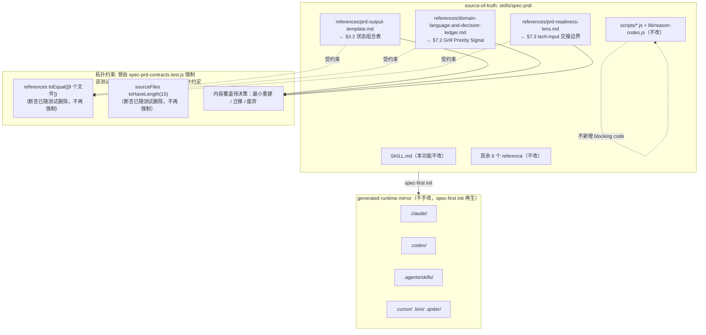
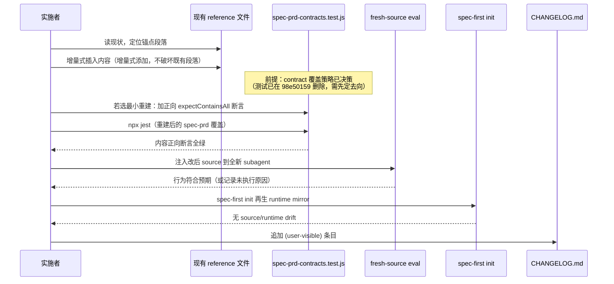

# 技术设计文档：spec-prd-optimization-integration

## Overview

本功能把 `docs/plans/spec-prd-optimization-proposal.md` §10「精简集成提案」确立的可落地范围，增量式并入现有 `skills/spec-prd/`。范围严格限定为 **3 项 doc-only、折进现有 reference、不跨 workflow、不改控制流时序** 的增量，外加 1 项需先决策再落地的术语口径统一（待定项）。

三项增量分别提升：Decision Card 内部状态一致性（§3.2）、grill 追问优先级排序（§7.2）、PM→开发的 tech-input 交接边界清晰度（§7.3）。它们全部落进已有的 9 个 reference 文件之一，均为 advisory / LLM-owned 判断纪律，**不新增 reference 文件、不新增 `BLOCKING_REASON_CODES`、不改 `SKILL.md` 控制流时序、不改确定性脚本语义**。第 4 项（§8.8 术语口径）在本设计中作为 open question 处理，需先裁定 `CONCEPTS.md` / `docs/contracts/domain-glossary.md` / `CONTEXT.md` 三者关系，再单独排期。

设计遵循本仓治理：source-of-truth 是 `skills/`，改完 source 用 `spec-first init` 再生 runtime mirror，绝不手改 `.claude/` `.codex/` `.agents/skills/`；面向用户内容用简体中文；脚本强制确定性事实、LLM 判断语义充分性的边界不被打破。

### 本设计的记号约定（Low-Level Design 语言选择）

本功能是文档集成型改动，没有算法维度。因此 Low-Level Design 直接使用本仓真实存在的两种语言，而非引入伪代码：

- **Markdown**：三项增量的 reference 内容补丁（落点文件本身就是 Markdown）。
- **JavaScript / Jest**：contract test 断言的语言（沿用被删除前 `spec-prd-contracts.test.js` 的 Jest 风格与 `expectContainsAll` helper）。注意该测试已在 `98e50159` 被主动删除，此语言选择仅在头号 Open Question 裁定「最小重建」时才实际使用。

YAML/表格片段用于表达状态组合与分类纪律的结构。所有代码块标注真实语言，不使用 `pascal` 伪代码块。

---

## Architecture

### 集成拓扑（source-of-truth 与落点）

本功能不改变 spec-prd 的运行时架构，只在既有 reference 拓扑内做定点内容增补。下图给出改动面与拓扑锁的关系。



关键架构约束：

- **拓扑约束目前失去自动化强制，降级为设计约定（convention）**：原本 `references` 用 `toEqual([...9 个文件...])` 精确锁定、`sourceFiles` 锁定为 `toHaveLength(15)` 的两条拓扑断言，随 `tests/unit/spec-prd-contracts.test.js` 在提交 `98e50159`（`test(cleanup): 清理过期测试 fixtures、老旧契约测试与开发脚本`）被**主动删除**而一并消失，`HEAD` 已不存在这两条断言。因此「不新建 reference 文件」当前**没有测试守护，仅为设计约定**。是否恢复自动化强制取决于「spec-prd contract 覆盖策略」决策（见头号 Open Question）；在决策落定前，实现仍按约定「不新建 reference 文件、只在既有文件内增补」，但须如实标注该约束当前不被任何测试守护。
- **确定性下限不加码**：三项增量都是 advisory / LLM-owned，不进 `check-prd-artifact.js` 的 `BLOCKING_REASON_CODES`。若重建 contract 覆盖，断言应聚焦「内容存在」正向判据，不断言脚本行为变化。
- **source→runtime 单向再生**：改动只发生在 `skills/`，runtime mirror 由 `spec-first init` 再生。

### 每项增量的落地闭环（时序）



---

## Components and Interfaces

本功能的「组件」是被改动的 4 个文档面 + 1 个测试面。各自的职责与接口（这里的「接口」= 该文件对下游 LLM / 测试的契约表面）如下。

### Component 1: `references/prd-output-template.md`（§3.2 落点）

**Purpose**：承载 PRD artifact 结构与 Readiness Self-Check 字段定义。§3.2 在此新增 Decision Card 合法状态组合参考表。

**落点**：`## Readiness Self-Check` 段之后（当前该段已定义 `write_mode` / `can_enter_spec_plan` / `clarification_evidence` / `decision_card_*` 字段，是状态组合表的自然归属）。

**Interface（对 LLM 的契约）**：
- 提供一张「合法组合 / 矛盾组合」参考表，LLM 在填写 Readiness Self-Check 时自查一致性。
- 复用既有字段名（`write_mode`、`can_enter_spec_plan`、`clarification_evidence`），不引入新字段。
- 明确 advisory：checker 已有 `decision_card_undeclared`（字段缺失）检查，但**不**检查组合矛盾；组合一致性是 LLM 自查纪律。

**Responsibilities**：
- 让 `final-prd + can_enter_spec_plan=no` 这类自相矛盾的 card 在 LLM 自查时暴露。
- 不改变既有 `decision_card_*` 字段语义与 checker 行为。

### Component 2: `references/domain-language-and-decision-ledger.md`（§7.2 落点）

**Purpose**：承载领域语言处理与 Load-Bearing Gap Triage（gap 追问排序纪律）。

**落点**：`### Load-Bearing Gap Triage` 段之后（该段已确立「ordering, not filtering」，§7.2 是它的细化）。

**Interface（对 LLM 的契约）**：
- 提供 P0 架构 / P1 行为 / P2 体验 三档追问优先级，依据 pipeline 传播风险排序。
- 复用既有 `downstream_confirmation_risk` 词汇（Product Expert Lens 已用于排序），不造新词。
- 显式声明反向边界：**只排序、不减深度、不 soft-cap、不进 BLOCKING**，保持 relentless by default。

**Responsibilities**：
- 让多个 open gap 并存时，架构级 gap 最先 grill。
- 不削弱既有 relentless grill 原则，不改变 legal stop point 定义。

### Component 3: `references/prd-readiness-lens.md`（§7.3 落点）

**Purpose**：承载 Readiness Base Gate、Outcomes、handoff entropy check。

**落点**：`## Outcomes` 段（当前已有 handoff entropy check 与 Planning Recheck 的 non-blocking 边界说明；§7.3 在此细化 tech-input 交接分类）。

**Interface（对 LLM 的契约）**：
- 定义 `non_what_tech_recheck`（可随 `ready-for-planning` 交接）vs `what_affecting_tech_decision`（必须 `checkpoint-prd` / `ask-owner` / `revise-prd`）的分类纪律。
- **不新增 `readiness_outcome`**：复用既有 5 值集合（`ready-for-planning` / `revise-prd` / `ask-owner` / `doc-review` / `route-out`）。
- **去掉**方案原文的三受众 `handoff_summary_views` 与 optional 列（Deferred #5 裁定无消费者）。分类纪律并入既有 Planning Recheck / handoff entropy check 表述。

**Responsibilities**：
- 让「技术可行性会改变 WHAT」的 gap 不被错误放行为 ready。
- 复用既有 handoff entropy check 结构，不新增列、不新增 outcome。

### Component 4: spec-prd contract 覆盖（验证面，去向待决策）

**现状**：`tests/unit/spec-prd-contracts.test.js` 已在提交 `98e50159`（`test(cleanup): 清理过期测试 fixtures、老旧契约测试与开发脚本`）中被**主动删除**（-3854 行），`HEAD` 确认不存在；全仓 `tests/` 在 HEAD 已无任何针对 spec-prd references 的拓扑锁或内容契约测试。它是被判定为过期测试而清理，不是「会自己回来的 churn」。

**Purpose（若决策为最小重建）**：仅为本次 3 项增量提供最小内容契约，不重建 3854 行旧测试。

**Interface（若最小重建）**：
- 复用（或重新引入）`expectContainsAll(content, snippets)` helper，对三项增量各加一组**正向**内容断言。
- 断言全部采用「关键短语存在」的正向判据；**不使用** `not.toContain` / 负向正则表达「不削深度」类语义（负向断言易与拟插入文案自相矛盾，见 Contract Test 设计）。

**Responsibilities（若最小重建）**：
- 正向断言三项增量的关键锚点短语存在（含 §7.2 的「排序不减深度」「relentless」）。
- 不断言脚本行为变化（脚本不改）。

**前置条件**：动 source 前必须先落定「spec-prd contract 覆盖策略」（见头号 Open Question：永久废弃 / 迁移 / 最小重建，倾向最小重建）。在决策前，本组件不存在可跑测试，落地依赖 fresh-source eval 作为主要验证。

---

## Data Models

三项增量的核心是三张「纪律表 / 分类模型」。以下用结构化形式给出其字段与合法取值。它们是 prompt/reference 内容，不是 schema、不是 artifact 字段、不是脚本输出。

### Model 1: Decision Card 合法状态组合（§3.2）

字段复用既有 Readiness Self-Check 字段，不新增：

| 字段 | 合法取值 | 来源 |
| --- | --- | --- |
| `write_mode` | `ask-owner-first` \| `checkpoint-prd` \| `final-prd` \| `route-out` | 既有 |
| `can_enter_spec_plan` | `yes` \| `no` | 既有 |
| `clarification_evidence` | `asked-owner` \| `source-proven-no-ask` \| `headless-degraded-logged` \| `skipped` | 既有 |

合法组合矩阵（advisory 自查）：

| write_mode | can_enter_spec_plan | clarification_evidence | 判定 |
| --- | --- | --- | --- |
| ask-owner-first | no | — | 合法（grill 未完成） |
| checkpoint-prd | no | asked-owner / headless-degraded-logged | 合法（保存进度） |
| final-prd | yes | asked-owner / source-proven-no-ask | 合法（所有 branch closed） |
| route-out | no | — | 合法（不产出 PRD） |
| final-prd | no | * | **矛盾** |
| checkpoint-prd | yes | * | **矛盾** |
| final-prd | * | skipped | **矛盾** |
| ask-owner-first | * | （OQ 全 closed） | **应升级 write_mode** |

**Validation Rules**：
- 该表是 LLM 自查参考，不是脚本 gate。checker 现有 `decision_card_undeclared` 只检查字段缺失/为空，不检查组合矛盾。
- 不新增任何 blocking reason code。

### Model 2: Grill Priority Signal 优先级模型（§7.2）

| 档位 | 名称 | 覆盖 gap 类型 | pipeline 传播风险 |
| --- | --- | --- | --- |
| P0 | Architecture-level | 数据 source-of-truth、状态管理归属、权限/鉴权模型、跨 surface 契约/API 边界、不可逆决策（迁移方向/存储选型/协议选择） | 下游必然级联失败 |
| P1 | Behavior-level | 状态流转/边界条件、异常处理、并发/幂等/重试语义、数据格式/验证规则 | 下游可能猜错 |
| P2 | Experience-level | UI 文案/提示、次要空状态、非核心日志格式、低频异常视觉 | 下游可局部调整 |

**Ordering Rules**：
- 多个 open gap 存在时按 P0 → P1 → P2 追问。
- 同档内按 `affected_prd_section_count` 排序（影响多 section 者优先）。
- **不跳过任何档**：P2 gap 也必须达到 legal stop point。
- **唯一合法停止点是 legal stop point 与 owner hard-cap**：所有 gap 都必须追问到 legal stop point，owner 仍可随时 hard-cap（owner-capped 是既有合法停止点），排序不引入任何自动降级出口。

**边界（在文本中以正向短语显式声明，contract 若重建则正向断言这些短语存在）**：
- 排序不减深度（这是问题排序，不是 grill 深度削减）。
- 保持 relentless by default。
- 不新增 checker 检查或 BLOCKING_REASON_CODES。

### Model 3: tech-input 交接分类模型（§7.3）

```yaml
# 交接分类（并入既有 handoff entropy check / Planning Recheck，非新 artifact）
tech_input_classification:
  non_what_tech_recheck:      # 可随 ready-for-planning 交接
    定义: 开发需复核技术事实或 HOW 可行性，但不改变 Requirements / AE / Scope /
          source-of-truth / fallback / analytics acceptance 等产品 WHAT
    交接结果: ready-for-planning（允许）
  what_affecting_tech_decision:  # 必须阻断 ready
    定义: 技术可行性会反向改变产品方案、验收、范围、默认行为或 source-of-truth
    交接结果: checkpoint-prd | ask-owner | revise-prd（除非已有 owner-capped fallback
              且明确说明 planning 不会 invent WHAT）
```

**Validation Rules**：
- 不新增 `readiness_outcome`；分类结果映射到既有 5 值集合。
- 不新增 Outstanding Questions 表的 optional 列（去掉方案原文的 `resolution_requires` optional 列建议）。
- 若分类为 WHAT-affecting，PRD 不得返回 `ready-for-planning`——这与既有 handoff entropy check「open load-bearing WHAT gap → revise-prd / ask-owner」规则一致。

---

## Low-Level Design：三项增量的精确内容补丁

以下给出各项增量拟插入的 Markdown 内容草案（简体中文，与落点文件既有中英混排风格一致）与精确锚点。实际落地时以「增量式添加、不动锁定串」为准，最终措辞在实现阶段按落点文件语气微调。

### 增量 1：Decision Card 合法状态组合表

**文件**：`skills/spec-prd/references/prd-output-template.md`
**锚点**：`## Readiness Self-Check` 段最后一段（`readiness_verified_*` 说明）之后、`## Authoring Discipline` 之前。

拟插入内容（Markdown）：

```markdown
### Decision Card 合法状态组合（advisory 自查）

`write_mode` / `can_enter_spec_plan` / `clarification_evidence` 之间存在语义耦合。
下表是 LLM 填写 Readiness Self-Check 时的一致性自查参考，不是脚本 gate：
checker 的 `decision_card_undeclared` 只检查字段缺失，不裁定组合矛盾。

| write_mode | can_enter_spec_plan | clarification_evidence | 判定 |
| --- | --- | --- | --- |
| ask-owner-first | no | — | 合法：grill 未完成 |
| checkpoint-prd | no | asked-owner / headless-degraded-logged | 合法：保存进度 |
| final-prd | yes | asked-owner / source-proven-no-ask | 合法：所有 branch closed |
| route-out | no | — | 合法：不产出 PRD |

矛盾组合（出现即须修正，不放行 ready）：
- `final-prd` + `can_enter_spec_plan=no` — 矛盾
- `checkpoint-prd` + `can_enter_spec_plan=yes` — 矛盾
- `final-prd` + `clarification_evidence=skipped` — 矛盾
- `ask-owner-first` 但 Outstanding Questions 全部 closed — 应升级 write_mode

此表不新增字段、不新增 blocking reason code。
```

**为何落此处**：Readiness Self-Check 段已定义全部相关字段与 `decision_card_*` 语义，组合表紧随其后是最小认知跳转。

### 增量 2：Grill Priority Signal（追问优先级排序）

**文件**：`skills/spec-prd/references/domain-language-and-decision-ledger.md`
**锚点**：`### Load-Bearing Gap Triage` 段之后。

拟插入内容（Markdown）：

```markdown
### Grill Priority Signal（追问优先级排序）

Load-Bearing Gap Triage 是「排序不过滤」；本段进一步给出排序依据。
在 AI coding pipeline 中，每个未解 gap 的下游传播成本远超传统估算，因此**所有 gap 都追问到
legal stop point**——本段只优化追问顺序，`downstream_confirmation_risk` 高者先问。

按 pipeline 传播风险分档：

- **P0 Architecture-level**（下游必然级联失败）：数据 source-of-truth 选择、状态管理归属、
  权限/鉴权模型、跨 surface 契约/API 边界、不可逆决策（迁移方向/存储选型/协议选择）。
- **P1 Behavior-level**（下游可能猜错）：状态流转/边界条件、异常处理策略、
  并发/幂等/重试语义、数据格式/验证规则。
- **P2 Experience-level**（下游可局部调整）：UI 文案/提示、次要空状态、
  非核心日志格式、低频异常视觉。

使用方式：多个 open gap 时按 P0 → P1 → P2 追问；同档内按 affected PRD section 数排序。

边界（正向声明，保持自洽）：
- **排序不减深度**：这是问题排序，不跳过任何档，P2 gap 也须达到 legal stop point。
- 保持 **relentless** by default。
- 唯一合法停止点是 legal stop point 与 owner hard-cap（owner-capped 是既有合法停止点）；排序不引入任何自动降级出口。
- 不新增 checker 检查或 BLOCKING_REASON_CODES。
```

**为何落此处**：复用同文件既有 `downstream_confirmation_risk` 词汇与 triage「排序不过滤」立场，无需新词、无需新文件。

### 增量 3：tech-input 交接边界

**文件**：`skills/spec-prd/references/prd-readiness-lens.md`
**锚点**：`## Outcomes` 段内 handoff entropy check 段落之后（当前已说明「Planning Recheck 对 HOW/integration recheck 项 non-blocking」）。

拟插入内容（Markdown）：

```markdown
当 handoff entropy check 中出现「需要开发/架构输入」的项时，先按下面二分类，
再决定能否 ready——不新增 readiness_outcome，只用既有五值集合：

- `non_what_tech_recheck`：开发需复核技术事实或 HOW 可行性，但**不会**改变
  Requirements / Acceptance / Scope / source-of-truth / fallback display / analytics
  acceptance。此类可随 `ready-for-planning` 交接，进入既有 Planning Recheck 的
  HOW/integration recheck 通道。
- `what_affecting_tech_decision`：技术可行性会反向改变产品方案、验收、范围、默认行为或
  source-of-truth。此类仍是 PRD-owned WHAT gap，阻断 ready；合法结果是
  `checkpoint-prd`、`ask-owner` 或 `revise-prd`，除非已有 owner-capped fallback 且明确
  说明 planning 不会 invent WHAT。

若 `non_what_tech_recheck` 复核结果为「不可行」且会改变 WHAT，spec-plan 必须返回
spec-prd refine，而不是自行改写需求。此分类是 handoff entropy check 的细化，
不新增 outcome、不新增 Outstanding Questions 列、不新增 handoff 视图。
```

**为何落此处**：既有 Outcomes 段已有 handoff entropy check 与「Planning Recheck non-blocking for HOW」的表述，二分类是它的自然细化，避免新增 outcome（对齐 Deferred #5，去掉三受众视图与 optional 列）。

---

## Contract Test 设计（JavaScript / Jest，仅在决策为「最小重建」时适用）

**前提**：原 `tests/unit/spec-prd-contracts.test.js` 已在 `98e50159` 被主动删除，`HEAD` 无任何 spec-prd 契约测试。以下骨架**仅在**头号 Open Question 裁定为「最小重建本次 3 项增量所需断言」时才落地；若裁定为永久废弃或迁移，则不新增本文件。骨架仅覆盖 3 项增量的最小正向断言，不重建被删除的 3854 行旧测试，也不重建已随删除消失的 `references` / `sourceFiles` 拓扑锁。

统一断言原则：**只用「关键短语存在」的正向断言**（`expectContainsAll`），**不使用** `not.toContain` / 负向正则。原因见 P0-2 / P1-3——负向断言（如 `not.toContain('soft-cap')`、`not.toMatch(/减少\s*grill\s*深度/)`）会与拟插入文案中的 `soft-cap`、`减少 grill 深度` 等字面串自相矛盾，导致设计自身断言必然失败。改为正向断言完整短语（如「排序不减深度」「relentless」），使断言与文案措辞对齐、自洽。

```javascript
// 增量 1：Decision Card 合法状态组合表存在（正向）
test('prd-output-template documents Decision Card legal state combinations', () => {
  const text = read(OUTPUT_TEMPLATE_PATH);
  expectContainsAll(text, [
    'Decision Card 合法状态组合',
    'final-prd',
    'can_enter_spec_plan=no',
    'clarification_evidence=skipped',
  ]);
});

// 增量 2：Grill Priority Signal 存在，且以正向短语声明「排序不减深度 / relentless」
test('domain-language documents Grill Priority Signal as ordering-only', () => {
  const text = read(DOMAIN_LANGUAGE_PATH);
  expectContainsAll(text, [
    'Grill Priority Signal',
    'downstream_confirmation_risk',
    'P0',
    'P1',
    'P2',
    '排序不减深度',
    'relentless',
  ]);
  // 不使用负向断言（不 not.toContain / 不负向正则）——见上文 P0-2 / P1-3。
});

// 增量 3：tech-input 交接二分类存在，且未新增 readiness_outcome（正向）
test('prd-readiness-lens documents tech-input handoff classification', () => {
  const text = read(READINESS_PATH);
  expectContainsAll(text, [
    'non_what_tech_recheck',
    'what_affecting_tech_decision',
    'ready-for-planning',
    'checkpoint-prd',
  ]);
});
```

断言原则：只正向断言「LLM-owned 纪律内容存在」，**不**断言脚本行为变化（脚本不改），**不**使用任何禁止子串 / 负向正则表达「不削深度」类语义。

---

## 头号 Open Question：spec-prd contract 覆盖策略（决策项，阻塞落地）

**背景（已对 git 核对）**：spec-prd 的内容契约测试 `tests/unit/spec-prd-contracts.test.js` 已在提交 `98e50159`（`test(cleanup): 清理过期测试 fixtures、老旧契约测试与开发脚本`）中被**主动删除**（-3854 行）。这是把它当作**过期测试主动清理**，不是并行任务 churn、也不会自行回来。`HEAD` 已无任何针对 spec-prd references 的拓扑锁（`references toEqual` / `sourceFiles toHaveLength`）或内容契约断言。

**连带影响**：Non-Goal「不新建 reference 文件」原本由拓扑锁强制，现该强制已随测试删除而消失，降级为**设计约定（convention）**（详见 Architecture / Non-Goals）。

**待决策问题**：spec-prd 的 contract 覆盖去向未决，须三选一——
1. **永久废弃**：接受 cleanup 意图，spec-prd 不再有内容契约测试，仅靠 fresh-source eval + 设计约定守护。
2. **迁移到别处**：把必要覆盖迁移进其它现存测试面（如通用 skill 结构测试）。
3. **最小重建（倾向）**：只重建覆盖本次 3 项增量所需的**最小正向断言**（见 Contract Test 设计骨架），不恢复 3854 行旧测试，也不机械 `git show d1ce6d97` 恢复旧文件——机械恢复一个被判定过期的测试与 cleanup 意图直接冲突。

**处置**：动 source 前先落定本决策。在决策前，三项增量的落地以 fresh-source eval 为主要验证；「不新建 reference 文件」按约定执行但如实标注当前无测试守护。

---

## §8.8 术语口径统一（Open Question / 待定项）

§8.8 在本功能中**不落地**，作为待决策项记录。原因：它不是机械 find-replace，须先裁定三个文件的关系。

### 现状（已对 source 核对）

三个术语文件并存：

| 文件 | 当前角色 | 消费者 |
| --- | --- | --- |
| `CONCEPTS.md`（repo 根） | 多数 skill 视为权威词汇表 | spec-plan / spec-brainstorm / spec-code-review / spec-explain / spec-pov |
| `docs/contracts/domain-glossary.md` | **spec-prd 当前实际引用的就是它** | `SKILL.md` Phase 2、`check-glossary-drift.js` |
| `CONTEXT.md` | 仅出现在 grill-with-docs 上游 snapshot | grill-with-docs-integration.md（约 29 处，多在 Embedded Upstream Source Snapshot 段） |

### 待决策问题（open questions）

1. `domain-glossary.md` 与 `CONCEPTS.md` 是合并、别名，还是迁移？（决定 spec-prd 引用指向）
2. `CONTEXT.md → CONCEPTS.md` 的改写边界：Embedded Upstream Source Snapshot 段是否保留原文？（须保留——它是上游 source snapshot）
3. spec-prd 对 `CONCEPTS.md` 是否只 gap-fill、不创建（与 spec-plan/brainstorm 一致）？创建权是否仍归 spec-compound？

### 处置

- 本设计不含 §8.8 的内容补丁。
- 需先产出一份「三文件关系裁定」结论（建议独立小 spec 或 doc-review），再按段边界精确改写（保留 N 处上游 snapshot / 改写 M 处 spec-prd 自有适配规则），并跑 `check-glossary-drift.js` 回归。
- 在此之前，§8.8 保持 open，不因「机制就位」而机械执行。

---

## Correctness Properties

以下性质应在实现后成立（作为验证与 fresh-source eval 的判据）：

Property 1: 拓扑不变性 —— 改动后 `references` 仍恰为既有 9 个文件，`sourceFiles` 仍为 15。∀ 落地项，不新增/删除/重命名 reference 文件。

Property 2: 确定性下限不变 —— `BLOCKING_REASON_CODES` 数量与内容不变；`check-prd-artifact.js` / `finalize-prd-artifact.js` 的 blocking 行为与 ready receipt 格式不变。

Property 3: 控制流时序不变 —— `SKILL.md` 的 Phase 顺序与 gate 时序不变（本功能不改 `SKILL.md` 控制流；如需加 trigger 行须核对仍 < 500 行且不改时序）。

Property 4: 状态组合自查有效 —— 给定矛盾 card（如 `final-prd` + `can_enter_spec_plan=no`），fresh-source eval 下 LLM 能据 §3.2 表识别矛盾并拒绝放行 ready。

Property 5: 排序不减深度 —— 给定多个 P0/P1/P2 gap，fresh-source eval 下 LLM 先问 P0，且不跳过任何档、不 soft-cap。

Property 6: 交接边界正确 —— 给定 what-affecting tech gap，fresh-source eval 下 PRD 不返回 `ready-for-planning`；给定 non-WHAT recheck，允许 ready 并进入 Planning Recheck 通道。

Property 7: 无新 outcome / 无新列 —— `readiness_outcome` 仍为既有 5 值；Outstanding Questions 表不新增 optional 列。

Property 8: source/runtime 同源 —— `spec-first init` 后无 drift；runtime mirror 未被手改。

---

## Error Handling

边界与反模式防护：

| 场景 | 触发条件 | 处置 | 恢复 |
| --- | --- | --- | --- |
| 误新建 reference 文件 | 违反「不新建 reference 文件」约定 | 拓扑锁已随测试删除、不再自动强制；靠人工审查 / fresh-source eval 捕获（若决策为最小重建，可正向断言现存文件集） | 回退：内容折进既有文件 |
| 误加 blocking code | 试图把 advisory 升级为 checker gate | 违反 Non-Goal；`reason-codes.js` 不改 | 保持 advisory，撤销脚本改动 |
| §7.2 未正向声明「排序不减深度」 | 文案缺少 relentless / 排序不减深度短语 | 若最小重建：`expectContainsAll` 正向断言缺失即失败（不使用负向断言） | 补正向短语，重申 relentless |
| 新增 readiness_outcome | §7.3 误加第 6 个 outcome | 违反 Non-Goal，人工审查/eval 捕获 | 映射回既有 5 值 |
| 手改 runtime mirror | 直接改 `.claude/` 等 | 违反 source/runtime 边界 | 撤销，改 source 后 `spec-first init` |
| §8.8 机械替换 | 对 `CONTEXT.md` 全局 find-replace | 破坏上游 snapshot / 制造第三条术语路径 | 先决策三文件关系再按段改写 |

---

## Non-Goals（硬边界，必须贯穿实现）

1. **不新建 reference 文件（当前为设计约定，非测试强制）** —— 原由 `spec-prd-contracts.test.js` 的拓扑锁（`references` `toEqual([9 文件])`、`sourceFiles` `toHaveLength(15)`）强制，但该测试已在 `98e50159` 被主动删除，两条断言已不存在，本约束**目前失去自动化强制、降级为设计约定**（是否恢复取决于头号 Open Question 决策）。在决策落定前仍按约定「不新建 reference 文件」执行，但须如实标注它当前不被测试守护。§8.12 新建 4 文件方向仍否决。
2. **不新增 `BLOCKING_REASON_CODES`** —— 保持确定性下限轻量。
3. **不改 `SKILL.md` 控制流时序** —— §8.4 脊柱重排前提已被 doc-review 证伪，净收益≈0、回归成本高。
4. **不单方落地跨-workflow 协议** —— §7.4 / §8.11 Revision Signal 需下游 buy-in，另立 opt-in 提案。
5. **不引入未测阈值机制** —— §8.10 context budget 阈值基于未测估算。
6. **不手改 generated runtime mirror** —— `.claude/` `.codex/` `.agents/skills/` `.cursor/` `.kiro/` `.qoder/` 由 `spec-first init` 再生。
7. **不做 §7.1/§7.5 Developer Quick-Start** —— 列为可选，与既有 handoff_context_slice 重叠，非首批。
8. **§8.8 不机械 find-replace** —— 作为 open question，先决策三文件关系。

---

## Testing Strategy

（验证计划 / Verification Plan）

### 前置条件（gate the exits，缺一不落地）

- **先落定「spec-prd contract 覆盖策略」决策**（头号 Open Question）。事实陈述：`tests/unit/spec-prd-contracts.test.js` 已在提交 `98e50159`（`test(cleanup): ...`）中被**主动删除**（-3854 行），`HEAD` 确认不存在；全仓 `tests/` 已无任何 spec-prd 拓扑锁或内容契约测试。它是被判定为过期测试而清理，**不是**待从 git 恢复的间歇性缺失。**禁止**用 `git show d1ce6d97` 机械恢复该 3854 行旧测试——与 cleanup 意图冲突。是否重建、以何粒度重建，取决于该决策（倾向最小重建）。

### 分层验证

1. **Contract Test（仅在决策为「最小重建」时必做）**：
   - 对三项增量各加一组 **正向** `expectContainsAll` 内容断言（含 §7.2 的「排序不减深度」「relentless」）。
   - **不**使用 `not.toContain` / 负向正则（见 P0-2 / P1-3：负向断言与拟插入文案字面串自相矛盾）。
   - 不重建已随删除消失的 `references` / `sourceFiles` 拓扑锁；不恢复旧的 3854 行测试。
   - 跑重建后的 spec-prd 覆盖全绿。
   - 若决策为永久废弃 / 迁移，则本层不适用，验证以 fresh-source eval 为主。

2. **Fresh-Source Eval（必做，按 `docs/contracts/workflows/fresh-source-eval-checklist.md`）**：
   - 场景 A：矛盾 Decision Card → 期望被自查识别（对应性质 4）。
   - 场景 B：多 P0/P1/P2 gap → 期望先问架构级、不减深度（性质 5）。
   - 场景 C：what-affecting tech gap → 期望不放行 ready-for-planning（性质 6）。
   - 若宿主缺 dispatch primitive / runtime 无法调用，显式记录未执行原因，不声称通过。

3. **回归验证**：
   - `npm run test:unit`（不回归）。
   - `npm run lint:skill-entrypoints`（入口治理不违规）。
   - `spec-first init` 后核对无 source/runtime drift。

4. **文档纪律**：
   - `CHANGELOG.md` 每项追加 `(user-visible)` 条目。
   - 若最终决定给 `SKILL.md` 加 trigger 行，核对仍 < 500 行且不改时序（当前设计倾向不改 `SKILL.md`）。

### 实施顺序

先落定「spec-prd contract 覆盖策略」头号 Open Question，再按 §10.2 的 **1 → 2 → 3** 逐条落地：若决策为最小重建，则各项落地后跑重建的正向断言；若为废弃 / 迁移，则以 fresh-source eval 为主验证。§8.8（术语口径）先定三文件关系再单独排期；跨-workflow Revision Signal 另立 opt-in 提案。

---

## Risks

| 风险 | 等级 | 缓解 |
| --- | --- | --- |
| spec-prd 契约覆盖去向未决（测试已在 `98e50159` 被主动删除，-3854 行，非 churn） | 高（阻塞落地） | 动 source 前先落定头号 Open Question（永久废弃 / 迁移 / 最小重建，倾向最小重建）；禁止机械 `git show` 恢复旧 3854 行测试 |
| 「不新建 reference 文件」失去测试守护（拓扑锁随测试删除消失） | 中 | 明确降级为设计约定并如实标注；靠人工审查 + fresh-source eval 守护；若最小重建可正向断言现存文件集 |
| advisory 内容被下游误当 confirmed gate | 中 | 每项文案显式声明 advisory / LLM-owned；若重建 contract 用正向断言，不用负向禁止串 |
| §8.8 被急于机械替换 | 中 | 明确列为 open question，先决策三文件关系 |
| 增量文案与落点文件语气不一致 | 低 | 实现阶段读现状再对齐语气，增量式插入不动锁定串 |
| runtime drift（忘记 `spec-first init`） | 低 | 落地闭环最后一步强制再生 + drift 核对 |

---

## Dependencies

- **源文件**：`skills/spec-prd/references/prd-output-template.md`、`domain-language-and-decision-ledger.md`、`prd-readiness-lens.md`（§8.8 另涉 `grill-with-docs-integration.md`）。
- **测试**：`tests/unit/spec-prd-contracts.test.js` 已在 `98e50159` 被主动删除，`HEAD` 不存在；是否重建（连同 `expectContainsAll` helper）取决于头号 Open Question。主验证依赖 `docs/contracts/workflows/fresh-source-eval-checklist.md`。
- **脚本（只读依赖，不改）**：`scripts/check-prd-artifact.js`、`finalize-prd-artifact.js`、`scripts/lib/reason-codes.js`、`check-glossary-drift.js`（§8.8 回归用）。
- **CLI**：`spec-first init`（runtime 再生）、`npm run test:unit` / `lint:skill-entrypoints`。
- **规程**：`docs/contracts/workflows/fresh-source-eval-checklist.md`、`docs/plans/spec-prd-optimization-proposal.md` §10。
- **上游依据**：`AGENTS.md`（source/runtime 边界、语言、CHANGELOG 纪律）。
