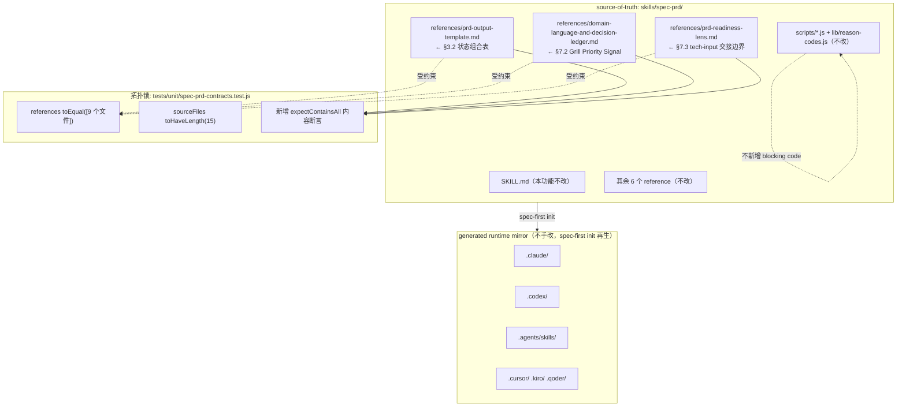
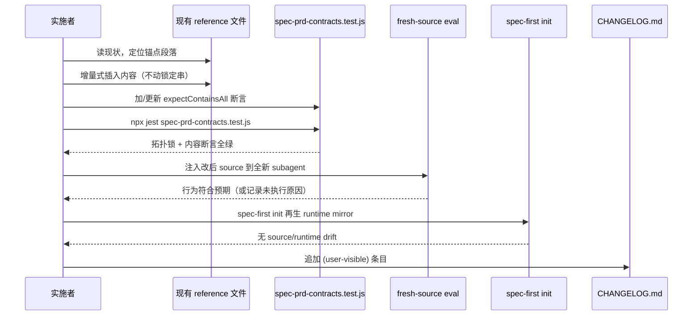

# 技术设计文档：spec-prd-optimization-integration

## Overview

本功能把 `docs/plans/spec-prd-optimization-proposal.md` §10「精简集成提案」确立的可落地范围，增量式并入现有 `skills/spec-prd/`。范围严格限定为 **3 项 doc-only、折进现有 reference、不跨 workflow、不改控制流时序** 的增量，外加 1 项需先决策再落地的术语口径统一（待定项）。

三项增量分别提升：Decision Card 内部状态一致性（§3.2）、grill 追问优先级排序（§7.2）、PM→开发的 tech-input 交接边界清晰度（§7.3）。它们全部落进已有的 9 个 reference 文件之一，均为 advisory / LLM-owned 判断纪律，**不新增 reference 文件、不新增 `BLOCKING_REASON_CODES`、不改 `SKILL.md` 控制流时序、不改确定性脚本语义**。第 4 项（§8.8 术语口径）在本设计中作为 open question 处理，需先裁定 `CONCEPTS.md` / `docs/contracts/domain-glossary.md` / `CONTEXT.md` 三者关系，再单独排期。

设计遵循本仓治理：source-of-truth 是 `skills/`，改完 source 用 `spec-first init` 再生 runtime mirror，绝不手改 `.claude/` `.codex/` `.agents/skills/`；面向用户内容用简体中文；脚本强制确定性事实、LLM 判断语义充分性的边界不被打破。

### 本设计的记号约定（Low-Level Design 语言选择）

本功能是文档集成型改动，没有算法维度。因此 Low-Level Design 直接使用本仓真实存在的两种语言，而非引入伪代码：

- **Markdown**：三项增量的 reference 内容补丁（落点文件本身就是 Markdown）。
- **JavaScript / Jest**：contract test 断言（`tests/unit/spec-prd-contracts.test.js` 的既有语言与既有 helper `expectContainsAll`）。

YAML/表格片段用于表达状态组合与分类纪律的结构。所有代码块标注真实语言，不使用 `pascal` 伪代码块。

---

## Architecture

### 集成拓扑（source-of-truth 与落点）

本功能不改变 spec-prd 的运行时架构，只在既有 reference 拓扑内做定点内容增补。下图给出改动面与拓扑锁的关系。



关键架构约束：

- **拓扑锁不可触碰**：`references` 用 `toEqual([...9 个文件...])` 精确锁定，`sourceFiles` 锁定为 `toHaveLength(15)`（`SKILL.md` + 9 references + 4 scripts + `lib/reason-codes.js`）。任何新建 reference 文件都会打破这两条锁 → 本功能只允许在既有文件内增补。
- **确定性下限不加码**：三项增量都是 advisory / LLM-owned，不进 `check-prd-artifact.js` 的 `BLOCKING_REASON_CODES`。contract test 只断言「内容存在 + 反向禁止串不存在」，不断言脚本行为变化。
- **source→runtime 单向再生**：改动只发生在 `skills/`，runtime mirror 由 `spec-first init` 再生。

### 每项增量的落地闭环（时序）



---

## Components and Interfaces

本功能的「组件」是被改动的 4 个文档面 + 1 个测试面。各自的职责与接口（这里的「接口」= 该文件对下游 LLM / 测试的契约表面）如下。

### Component 1: `references/prd-output-template.md`（§3.2 落点）

**Purpose**：承载 PRD artifact 结构与 Readiness Self-Check 字段定义。§3.2 在此新增 Decision Card 合法状态组合参考表。

**落点**：`## Readiness Self-Check` 段之后（当前该段已定义 `write_mode` / `can_enter_spec_plan` / `clarification_evidence` / `decision_card_*` 字段，是状态组合表的自然归属）。

**Interface（对 LLM 的契约）**：
- 提供一张「合法组合 / 矛盾组合」参考表，LLM 在填写 Readiness Self-Check 时自查一致性。
- 复用既有字段名（`write_mode`、`can_enter_spec_plan`、`clarification_evidence`），不引入新字段。
- 明确 advisory：checker 已有 `decision_card_undeclared`（字段缺失）检查，但**不**检查组合矛盾；组合一致性是 LLM 自查纪律。

**Responsibilities**：
- 让 `final-prd + can_enter_spec_plan=no` 这类自相矛盾的 card 在 LLM 自查时暴露。
- 不改变既有 `decision_card_*` 字段语义与 checker 行为。

### Component 2: `references/domain-language-and-decision-ledger.md`（§7.2 落点）

**Purpose**：承载领域语言处理与 Load-Bearing Gap Triage（gap 追问排序纪律）。

**落点**：`### Load-Bearing Gap Triage` 段之后（该段已确立「ordering, not filtering」，§7.2 是它的细化）。

**Interface（对 LLM 的契约）**：
- 提供 P0 架构 / P1 行为 / P2 体验 三档追问优先级，依据 pipeline 传播风险排序。
- 复用既有 `downstream_confirmation_risk` 词汇（Product Expert Lens 已用于排序），不造新词。
- 显式声明反向边界：**只排序、不减深度、不 soft-cap、不进 BLOCKING**，保持 relentless by default。

**Responsibilities**：
- 让多个 open gap 并存时，架构级 gap 最先 grill。
- 不削弱既有 relentless grill 原则，不改变 legal stop point 定义。

### Component 3: `references/prd-readiness-lens.md`（§7.3 落点）

**Purpose**：承载 Readiness Base Gate、Outcomes、handoff entropy check。

**落点**：`## Outcomes` 段（当前已有 handoff entropy check 与 Planning Recheck 的 non-blocking 边界说明；§7.3 在此细化 tech-input 交接分类）。

**Interface（对 LLM 的契约）**：
- 定义 `non_what_tech_recheck`（可随 `ready-for-planning` 交接）vs `what_affecting_tech_decision`（必须 `checkpoint-prd` / `ask-owner` / `revise-prd`）的分类纪律。
- **不新增 `readiness_outcome`**：复用既有 5 值集合（`ready-for-planning` / `revise-prd` / `ask-owner` / `doc-review` / `route-out`）。
- **去掉**方案原文的三受众 `handoff_summary_views` 与 optional 列（Deferred #5 裁定无消费者）。分类纪律并入既有 Planning Recheck / handoff entropy check 表述。

**Responsibilities**：
- 让「技术可行性会改变 WHAT」的 gap 不被错误放行为 ready。
- 复用既有 handoff entropy check 结构，不新增列、不新增 outcome。

### Component 4: `tests/unit/spec-prd-contracts.test.js`（验证面）

**Purpose**：拓扑锁 + 内容契约断言。

**Interface**：
- 既有 helper `expectContainsAll(content, snippets)` 用于断言 reference 含关键串。
- 新增 3 组内容断言（每项增量一组），外加复用既有 `references` / `sourceFiles` 拓扑锁验证「未新增文件」。

**Responsibilities**：
- 断言三项增量的关键锚点串存在。
- 断言 §7.2 的反向禁止串（削深度 / soft-cap）**不存在**（`not.toContain`）。
- 前置条件：该文件当前被并行任务 churn，间歇性缺失（见 Risks），落地前必须先恢复可跑。

---

## Data Models

三项增量的核心是三张「纪律表 / 分类模型」。以下用结构化形式给出其字段与合法取值。它们是 prompt/reference 内容，不是 schema、不是 artifact 字段、不是脚本输出。

### Model 1: Decision Card 合法状态组合（§3.2）

字段复用既有 Readiness Self-Check 字段，不新增：

| 字段 | 合法取值 | 来源 |
| --- | --- | --- |
| `write_mode` | `ask-owner-first` \| `checkpoint-prd` \| `final-prd` \| `route-out` | 既有 |
| `can_enter_spec_plan` | `yes` \| `no` | 既有 |
| `clarification_evidence` | `asked-owner` \| `source-proven-no-ask` \| `headless-degraded-logged` \| `skipped` | 既有 |

合法组合矩阵（advisory 自查）：

| write_mode | can_enter_spec_plan | clarification_evidence | 判定 |
| --- | --- | --- | --- |
| ask-owner-first | no | — | 合法（grill 未完成） |
| checkpoint-prd | no | asked-owner / headless-degraded-logged | 合法（保存进度） |
| final-prd | yes | asked-owner / source-proven-no-ask | 合法（所有 branch closed） |
| route-out | no | — | 合法（不产出 PRD） |
| final-prd | no | * | **矛盾** |
| checkpoint-prd | yes | * | **矛盾** |
| final-prd | * | skipped | **矛盾** |
| ask-owner-first | * | （OQ 全 closed） | **应升级 write_mode** |

**Validation Rules**：
- 该表是 LLM 自查参考，不是脚本 gate。checker 现有 `decision_card_undeclared` 只检查字段缺失/为空，不检查组合矛盾。
- 不新增任何 blocking reason code。

### Model 2: Grill Priority Signal 优先级模型（§7.2）

| 档位 | 名称 | 覆盖 gap 类型 | pipeline 传播风险 |
| --- | --- | --- | --- |
| P0 | Architecture-level | 数据 source-of-truth、状态管理归属、权限/鉴权模型、跨 surface 契约/API 边界、不可逆决策（迁移方向/存储选型/协议选择） | 下游必然级联失败 |
| P1 | Behavior-level | 状态流转/边界条件、异常处理、并发/幂等/重试语义、数据格式/验证规则 | 下游可能猜错 |
| P2 | Experience-level | UI 文案/提示、次要空状态、非核心日志格式、低频异常视觉 | 下游可局部调整 |

**Ordering Rules**：
- 多个 open gap 存在时按 P0 → P1 → P2 追问。
- 同档内按 `affected_prd_section_count` 排序（影响多 section 者优先）。
- **不跳过任何档**：P2 gap 也必须达到 legal stop point。
- **不引入 soft-cap / skip**：所有 gap 都必须解决；owner 仍可随时 hard-cap（owner-capped 是既有合法停止点）。

**反向禁止（必须在文本中显式声明，并由 contract test 断言不含削深度表述）**：
- 不减少 grill 深度。
- 不改变 relentless by default。
- 不新增 checker 检查或 BLOCKING_REASON_CODES。

### Model 3: tech-input 交接分类模型（§7.3）

```yaml
# 交接分类（并入既有 handoff entropy check / Planning Recheck，非新 artifact）
tech_input_classification:
  non_what_tech_recheck:      # 可随 ready-for-planning 交接
    定义: 开发需复核技术事实或 HOW 可行性，但不改变 Requirements / AE / Scope /
          source-of-truth / fallback / analytics acceptance 等产品 WHAT
    交接结果: ready-for-planning（允许）
  what_affecting_tech_decision:  # 必须阻断 ready
    定义: 技术可行性会反向改变产品方案、验收、范围、默认行为或 source-of-truth
    交接结果: checkpoint-prd | ask-owner | revise-prd（除非已有 owner-capped fallback
              且明确说明 planning 不会 invent WHAT）
```

**Validation Rules**：
- 不新增 `readiness_outcome`；分类结果映射到既有 5 值集合。
- 不新增 Outstanding Questions 表的 optional 列（去掉方案原文的 `resolution_requires` optional 列建议）。
- 若分类为 WHAT-affecting，PRD 不得返回 `ready-for-planning`——这与既有 handoff entropy check「open load-bearing WHAT gap → revise-prd / ask-owner」规则一致。

---

## Low-Level Design：三项增量的精确内容补丁

以下给出各项增量拟插入的 Markdown 内容草案（简体中文，与落点文件既有中英混排风格一致）与精确锚点。实际落地时以「增量式添加、不动锁定串」为准，最终措辞在实现阶段按落点文件语气微调。
