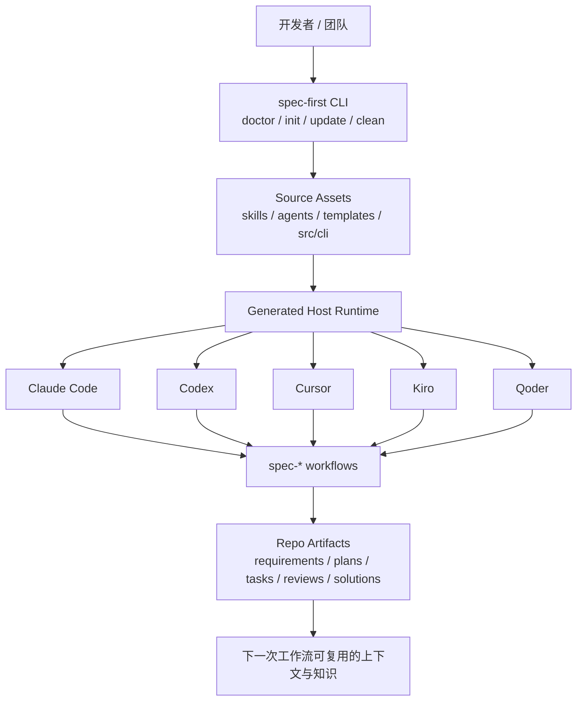

你当前位于 **Get Started → Overview**：这是 spec-first 文档的入口页，目标是先回答“它是什么、解决什么问题、第一次使用会得到什么”，而不是展开安装细节、命令参数或深层架构实现；这些内容会在后续页面逐步进入。spec-first 的公开定位是面向 Claude Code、Codex、Kiro、Qoder 与 Cursor 的 **AI Coding Harness**，它把一次性的 AI coding 对话转成仓库内可治理、可验证、可复用的 requirements、plans、scoped work、review 与 learning 闭环。Sources: [README.zh-CN.md](README.zh-CN.md#L16-L18), [docs/05-用户手册/README.md](docs/05-用户手册/README.md#L3-L9)

## 架构假设与验证结论

本页采用的架构假设是：spec-first 不是一个替代 AI 编程宿主的独立 IDE，而是一层安装到项目仓库中的 **工作流运行时生成器 + 证据化工程闭环**；源码资产集中放在包内，`spec-first init` 根据目标宿主生成 runtime assets，开发者随后在 Claude Code、Codex、Kiro、Qoder 或 Cursor 中使用统一的 `spec-*` workflow 入口。这个假设可以从包描述、CLI 命令、初始化流程、插件 manifest 与宿主 adapter 中验证：包描述明确“scripts prepare facts; LLMs decide; evidence stays in your repo”，CLI 暴露 `doctor/init/update/clean/tasks/session` 等命令，初始化支持五类宿主，插件层声明 source directories 与 supported platforms，adapter 层为每个宿主建立运行时映射。Sources: [package.json](package.json#L2-L14), [src/cli/index.js](src/cli/index.js#L158-L181), [src/cli/commands/init.js](src/cli/commands/init.js#L77-L113), [src/cli/plugin.js](src/cli/plugin.js#L25-L35), [src/cli/adapters/index.js](src/cli/adapters/index.js#L1-L13)

## 一句话理解 spec-first

spec-first 关注的不是“让 AI 多回答几句”，而是让 AI coding 的关键判断留在仓库里：需求为什么这样定义、计划如何拆分、任务如何交接、执行后有哪些证据、评审发现如何关闭、可复用经验如何沉淀。README 将最小成功信号定义得很具体：安装并初始化后，在宿主里运行一个 workflow，然后检查它写入仓库的 Markdown artifact，例如 `docs/brainstorms/` 或 `docs/plans/`。Sources: [README.zh-CN.md](README.zh-CN.md#L26-L35), [README.zh-CN.md](README.zh-CN.md#L162-L167)

## 它在项目里扮演什么角色

spec-first 的核心链路可以理解为 `Codebase -> Spec -> Plan -> Tasks -> Code -> Review -> Knowledge`；每个 contract 或 workflow 都应服务这条链路中的某个节点，或者让上下文、证据、执行交接、评估、治理、知识复用更可重复。对初学者来说，这意味着你不需要一次理解所有 workflow，只要先知道：它把“聊天中的临时判断”转换成“仓库中可检查的工程材料”。Sources: [docs/contracts/ai-coding-harness.md](docs/contracts/ai-coding-harness.md#L7-L14), [README.zh-CN.md](README.zh-CN.md#L125-L141)

在看下图前，先把它理解成三层：最上层是你已经在使用的 AI 宿主，中间是 spec-first 生成并管理的 runtime/workflow 入口，底层是留在仓库里的 durable artifacts 与证据。Sources: [README.zh-CN.md](README.zh-CN.md#L193-L199), [docs/contracts/ai-coding-harness.md](docs/contracts/ai-coding-harness.md#L15-L25)



## 初学者会得到什么

第一次成功运行后，你应该优先检查“是否产生了仓库内 artifact”，而不是先研究 agent 数量或 prompt 细节。README 给出的典型 artifact 目录包括 `docs/ideation/`、`docs/brainstorms/`、`docs/plans/`、`docs/tasks/`、`docs/reviews/`、`docs/solutions/` 与默认 gitignore 的 `.spec-first/workflows/`；但不是每个 workflow 都写入所有目录，第一次运行通常只需要确认 `docs/brainstorms/` 下出现一个需求 brief。Sources: [README.zh-CN.md](README.zh-CN.md#L125-L141), [README.zh-CN.md](README.zh-CN.md#L103-L111)

下面是一个面向新手的项目结构示意，只展示 Overview 需要知道的边界：`skills/`、`agents/`、`templates/`、`src/cli/` 是包内 source assets；`.claude/`、`.codex/`、`.agents/skills/`、`.cursor/`、`.kiro/`、`.qoder/` 是初始化后可能生成的宿主 runtime surface；`docs/**` 与部分 `.spec-first/**` 是 workflow 运行后保留证据和产物的位置。Sources: [README.zh-CN.md](README.zh-CN.md#L193-L199), [docs/05-用户手册/README.md](docs/05-用户手册/README.md#L39-L56)

```text
your-repo/
├── docs/
│   ├── brainstorms/     # 需求 brief、PRD 级需求材料
│   ├── plans/           # 可评审、可执行的实现计划
│   ├── tasks/           # 派生 task packs
│   ├── reviews/         # 文档或代码审查 findings
│   └── solutions/       # 已验证、可复用的经验沉淀
├── .spec-first/         # 本地状态、运行证据、控制面材料
├── .claude/             # Claude Code runtime assets（按选择生成）
├── .codex/              # Codex runtime assets（按选择生成）
├── .cursor/             # Cursor runtime assets（按选择生成）
├── .kiro/               # Kiro runtime assets（按选择生成）
└── .qoder/              # Qoder runtime assets（按选择生成）
```

## 与普通 prompt pack 有什么不同

spec-first 与普通 prompt pack 或 agent 编排的关键差异在于：它把“结果可检查”放在第一位。README 的对比表显示，普通 prompt pack 往往产出更好的聊天答案或 agent transcript，而 spec-first 预期产出仓库内 artifact；普通方案的决策和证据常在 session state、消息总线或 runtime memory 中，而 spec-first 将它们放入项目内文档、generated runtime assets 与可验证 CLI facts。Sources: [README.zh-CN.md](README.zh-CN.md#L168-L179)

| 你关心的问题 | 普通 prompt pack / agent 编排 | spec-first |
|---|---|---|
| 第一次跑完有什么？ | 聊天答案或 agent transcript | 仓库内 requirements brief、plan 等 artifact |
| 决策与证据在哪里？ | 会话状态、runtime memory | 项目内文档、runtime assets、CLI facts |
| 人应该 review 什么？ | 通常是最终 diff 或模型输出 | requirements、plans、task packs、diff、findings、learnings |
| 机械边界谁来守？ | 主要依赖模型自觉或 glue | 脚本守 deterministic invariants，LLM 负责语义判断 |
| 多宿主如何对齐？ | 各宿主分别维护 prompt | 同一套 source assets 生成不同宿主 runtime |

## 支持哪些宿主与入口

当前 CLI help 明确 `init` 可为 Claude Code、Codex、Cursor、Kiro 与 Qoder 安装 workflows、skills、agents 与 developer profile，并且说明 workflow entrypoints 在 `spec-first init` 后由宿主提供，而不是直接作为 shell 命令运行。初始化源码中的平台选择也列出了这五类宿主，其中 Claude Code 与 Codex 是 `-y` 默认宿主，Cursor、Kiro、Qoder 需要显式选择或交互选择。Sources: [src/cli/index.js](src/cli/index.js#L158-L175), [src/cli/commands/init.js](src/cli/commands/init.js#L77-L113)

| 宿主 | 初始化选择 | 初学者理解 |
|---|---|---|
| Claude Code | `--claude` 或交互选择 | 生成 Claude Code 可加载的 workflow runtime |
| Codex | `--codex` 或交互选择 | 生成 Codex 可发现的 skills/runtime surface |
| Cursor | `--cursor` 或交互选择 | 当前文档称为 generated-runtime preview |
| Kiro | `--kiro` 或交互选择 | 生成 Kiro 对应的 skills/agents/runtime |
| Qoder | `--qoder` 或交互选择 | 生成 Qoder 对应的 commands/skills/agents/runtime |

## 常用 workflow 的第一印象

Overview 只需要知道主链路入口的用途：`spec-brainstorm` 从粗略想法提炼需求，`spec-prd` 从已有 PRD 或需求笔记进入，`spec-plan` 形成实现计划，`spec-write-tasks` 拆出可交接任务，`spec-work` 执行有范围的工作，`spec-code-review` 和 `spec-doc-review` 做审查，`spec-compound` 沉淀经验。更细的路由规则属于后续页面 [工作流入口路由：什么时候使用 brainstorm、prd、debug、work 或 review](8-gong-zuo-liu-ru-kou-lu-you-shi-yao-shi-hou-shi-yong-brainstorm-prd-debug-work-huo-review)。Sources: [README.zh-CN.md](README.zh-CN.md#L143-L160), [docs/05-用户手册/README.md](docs/05-用户手册/README.md#L57-L76)

| 你现在的状态 | 第一入口 |
|---|---|
| 只有粗略想法、功能方向或产品变化 | `spec-brainstorm` |
| 已有 PRD、需求笔记或 brownfield change request | `spec-prd` |
| 遇到 bug、失败测试、堆栈或异常行为 | `spec-debug` |
| 已有计划、task pack 或范围明确的实现请求 | `spec-work` |
| 需要审查文档、计划、task pack、diff 或实现 | `spec-doc-review` 或 `spec-code-review` |

## 信任模型：脚本准备事实，LLM 做语义判断

spec-first 的信任模型不是“相信模型不会出错”，而是把职责拆开：脚本负责路径、schema、hash、readiness、budget、reason code、artifact refs、raw-log refs 等可机械判定的不变量；LLM 在这层地板之上判断 scope、架构取舍、finding 是否成立、root cause、task ordering 与证据是否足够。README 也用同一句话概括了这个边界：scripts enforce deterministic invariants; scripts prepare facts; LLM decides semantic adequacy above that floor。Sources: [docs/contracts/ai-coding-harness.md](docs/contracts/ai-coding-harness.md#L26-L33), [README.zh-CN.md](README.zh-CN.md#L207-L215)

## 什么时候适合使用

如果你已经使用 Claude Code、Codex、Kiro、Qoder 或 Cursor，并且希望 AI coding work 留下 durable requirements、plans、显式 review summaries 与 learnings，spec-first 就适合进入评估；如果你只需要一次性 prompt 片段、通用 agent marketplace、不依赖宿主的独立应用，或者团队不希望 workflow artifacts 写入 repo，它可能不是最合适的形态。Sources: [README.zh-CN.md](README.zh-CN.md#L217-L226)

## 下一步阅读路径

建议按目录顺序继续：先读 [Quick Start](2-quick-start) 完成最小安装与首次运行；如果你还没确定宿主，读 [安装前置条件与宿主选择](3-an-zhuang-qian-zhi-tiao-jian-yu-su-zhu-xuan-ze)；完成安装后读 [首次初始化：为 Claude Code、Codex、Kiro、Qoder 与 Cursor 生成运行时](4-shou-ci-chu-shi-hua-wei-claude-code-codex-kiro-qoder-yu-cursor-sheng-cheng-yun-xing-shi)；然后读 [运行第一个需求工作流并检查仓库产物](5-yun-xing-di-ge-xu-qiu-gong-zuo-liu-bing-jian-cha-cang-ku-chan-wu) 来确认你的第一个 artifact。Sources: [README.zh-CN.md](README.zh-CN.md#L36-L88), [README.zh-CN.md](README.zh-CN.md#L90-L123)

完成第一圈后，再进入“核心使用路径”：用 [从想法到代码的主链路：Spec → Plan → Tasks → Code → Review → Knowledge](7-cong-xiang-fa-dao-dai-ma-de-zhu-lian-lu-spec-plan-tasks-code-review-knowledge) 建立整体链路感，用 [工作流入口路由：什么时候使用 brainstorm、prd、debug、work 或 review](8-gong-zuo-liu-ru-kou-lu-you-shi-yao-shi-hou-shi-yong-brainstorm-prd-debug-work-huo-review) 判断每次该从哪里开始，用 [产物目录导览：docs、.spec-first 与临时 handoff 的边界](9-chan-wu-mu-lu-dao-lan-docs-spec-first-yu-lin-shi-handoff-de-bian-jie) 区分哪些文件该看、该提交、该重建。Sources: [docs/05-用户手册/README.md](docs/05-用户手册/README.md#L110-L140), [README.zh-CN.md](README.zh-CN.md#L125-L160)