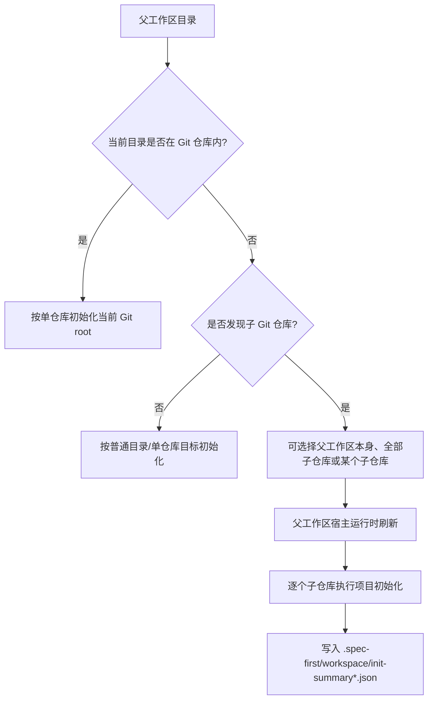
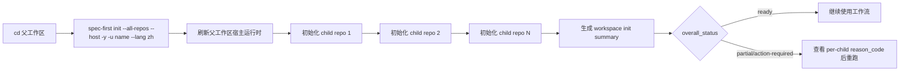

本页解释 **spec-first 在多 Git 仓库父工作区中的初始化方式**：如何选择父工作区、单个子仓库或全部子仓库，运行时资产会写到哪里，父工作区摘要如何生成，以及哪些安全边界会阻止路径逃逸。当前位置属于 Get Started 的“核心使用路径”，建议先完成 [首次初始化：为 Claude Code、Codex、Kiro、Qoder 与 Cursor 生成运行时](4-shou-ci-chu-shi-hua-wei-claude-code-codex-kiro-qoder-yu-cursor-sheng-cheng-yun-xing-shi)，再阅读本页；完成本页后，可继续阅读 [团队协作中的需求、计划、任务包与评审交接](11-tuan-dui-xie-zuo-zhong-de-xu-qiu-ji-hua-ren-wu-bao-yu-ping-shen-jiao-jie)。 Sources: [index.js](src/cli/index.js#L158-L174), [init.js](src/cli/commands/init.js#L127-L135)

## 架构假设与验证结论

**架构假设**：多仓库初始化不是一个隐藏的运行时路由，也不是在父目录里直接伪装成业务仓库；它是 `spec-first init` 在父工作区上构建一个 `all-repos` 初始化计划，先刷新父工作区宿主运行时，再逐个对子 Git 仓库执行普通项目初始化，最后在父工作区 `.spec-first/workspace` 下写入只读型 advisory summary。源码验证显示，CLI 只公开 `doctor`、`init`、`clean`、`update`、`tasks`、`session` 等包级命令；`stage0-context` 已不会作为可用入口出现，相关测试也要求它返回 unknown command。 Sources: [index.js](src/cli/index.js#L44-L79), [workspace-nested-topology.test.js](tests/unit/workspace-nested-topology.test.js#L17-L39), [init.js](src/cli/commands/init.js#L1605-L1674)



上述流程来自 `collectDefaultInitTarget`、`collectInteractiveInitTarget`、`buildWorkspaceInitPlan` 与 `applyWorkspaceInitPlan` 的组合：默认路径会先查找当前目录所属 Git root；若当前目录不是 Git 仓库但包含子 Git 仓库，则构建父工作区目标；交互模式会提供“父工作区本身 / 全部仓库 / 单个仓库 / 取消”的选择；`all-repos` 计划会包含 `parentPlan` 和 `childPlans`。 Sources: [init.js](src/cli/commands/init.js#L622-L740), [init.js](src/cli/commands/init.js#L974-L1006), [init.js](src/cli/commands/init.js#L1605-L1674)

## 推荐工作区形态

父工作区适合放置多个彼此独立的 Git 仓库，例如一个 `crm-workspace` 下同时有 `services/crm-service`、`web/admin-console` 和 `libs/shared-sdk`；spec-first 会把这些子目录识别为 `relationship: child_git_repo` 的候选项，并以相对父工作区的路径作为 `repo_label` 与 `workspace_relative_path`。 Sources: [init.js](src/cli/commands/init.js#L2261-L2330)

```text
crm-workspace/
├── services/
│   └── crm-service/
│       └── .git/
├── web/
│   └── admin-console/
│       └── .git/
├── libs/
│   └── shared-sdk/
│       └── .git/
└── .spec-first/
    └── workspace/
        ├── init-summary.json
        ├── init-summary-claude.json
        └── init-summary-codex.json
```

发现子仓库时，扫描逻辑默认最多递归 3 层，并跳过 `.git`、`.spec-first`、`.claude`、`.codex`、`.kiro`、`.qoder`、`node_modules`、`vendor`、`dist`、`coverage`、`tmp` 等目录；这意味着父工作区应保持清晰的仓库目录层级，避免把真实子仓库放在过深或被跳过的目录下。 Sources: [init.js](src/cli/commands/init.js#L2261-L2312)

## 三种初始化目标

| 目标 | 适用场景 | 触发方式 | 写入范围 | Sources |
|---|---|---|---|---|
| 当前 Git 仓库 | 你已经在某个子仓库或普通仓库内 | `spec-first init --claude` 或交互选择默认当前 Git root | 当前仓库的宿主运行时与托管状态 | [init.js](src/cli/commands/init.js#L622-L641), [init.js](src/cli/commands/init.js#L685-L692) |
| 指定子仓库 | 你站在父工作区，但只想初始化一个子仓库 | `spec-first init --repo services/crm-service --claude` | 指定子仓库的运行时资产；目标必须在当前工作区内并解析到 Git 仓库 | [init.js](src/cli/commands/init.js#L661-L679) |
| 全部子仓库 | 你站在非 Git 父工作区，想批量初始化所有发现的子仓库 | `spec-first init --all-repos --claude` | 父工作区宿主运行时、每个子仓库运行时、父工作区 advisory summary | [init.js](src/cli/commands/init.js#L644-L658), [init.js](src/cli/commands/init.js#L1676-L1768) |

`--repo` 和 `--all-repos` 是互斥的；解析参数时若二者同时出现，CLI 会报错 `Cannot combine --repo and --all-repos`。 Sources: [init.js](src/cli/commands/init.js#L276-L389)

## 操作步骤：从父工作区初始化全部子仓库

第一步，进入**父工作区目录**，而不是某个子仓库目录；`--all-repos` 明确要求当前目录不能已经位于 Git 仓库内，否则会返回 `--all-repos must be run from a parent workspace, not inside a Git repo`。 Sources: [init.js](src/cli/commands/init.js#L644-L652)

```bash
cd crm-workspace
spec-first init --all-repos --claude --codex -y -u "Your Name" --lang zh
```

第二步，确认 CLI 发现了子仓库；源码中的 `runInitForWorkspace` 会打印 `workspace_root`、`selection_source` 和 `child_repos`，然后依次输出 `Init child x/n`。 Sources: [init.js](src/cli/commands/init.js#L1446-L1508)

第三步，检查父工作区摘要；非 dry-run 情况下，`writeWorkspaceInitSummaryFiles` 会写入 `.spec-first/workspace/init-summary.json`，并按宿主写入 `.spec-first/workspace/init-summary-<platform>.json`。 Sources: [init.js](src/cli/commands/init.js#L1884-L1933)



## 父工作区会写什么，不会写什么

`all-repos` 的摘要明确标记 `parent_writes_repo_local_artifacts: false` 与 `parent_writes_host_runtime_assets: true`：父工作区承担宿主运行时和汇总视图职责，但不会把父目录当作业务仓库去生成需求、计划、任务包等仓库级业务产物。 Sources: [init.js](src/cli/commands/init.js#L1770-L1822), [init.js](src/cli/commands/init.js#L1935-L1992)

| 位置 | 会发生什么 | 不应期待什么 | Sources |
|---|---|---|---|
| 父工作区 `.spec-first/workspace/` | 写入 workspace init summary 与按平台拆分的 summary | 不代表父目录成为业务需求仓库 | [init.js](src/cli/commands/init.js#L1884-L1933) |
| 父工作区宿主目录 | 刷新所选宿主运行时资产 | 不替代每个子仓库自己的初始化 | [init.js](src/cli/commands/init.js#L1676-L1697) |
| 每个子 Git 仓库 | 执行普通 project init，并记录 per-child 结果 | 不跨仓库共享仓库本地托管状态 | [init.js](src/cli/commands/init.js#L1708-L1738) |

## 执行前后对比

| 阶段 | 父工作区 | 子仓库 | 典型检查点 | Sources |
|---|---|---|---|---|
| 执行前 | 只是包含多个 Git 仓库的目录 | 可能尚未安装 spec-first 运行时 | `discoverChildGitRepos` 能找到 `.git` 标记的子目录 | [init.js](src/cli/commands/init.js#L2261-L2357) |
| 执行后 | 拥有父工作区宿主运行时与 `.spec-first/workspace/init-summary*.json` | 每个被发现的子仓库都执行项目初始化 | summary 中 `results[]` 记录 `repo_label`、`workspace_relative_path`、`git_root`、`overall_status`、`reason_code` | [init.js](src/cli/commands/init.js#L1716-L1725), [init.js](src/cli/commands/init.js#L1740-L1767), [init.js](src/cli/commands/init.js#L1786-L1822) |

若选择多个宿主，`init-summary.json` 会成为平台索引，使用 `workspace-init-summary-index.v1` 聚合每个平台的 ready/action-required 状态；单宿主情况下，`init-summary.json` 直接保存该平台的 summary。 Sources: [init.js](src/cli/commands/init.js#L1896-L1927), [init.js](src/cli/commands/init.js#L1935-L1992)

## 安全边界与失败处理

`--repo` 目标必须存在、位于当前父工作区内，并能解析到父工作区内部的 Git 仓库；如果目标不存在、越界或不能解析为 Git 仓库，初始化会直接返回错误。 Sources: [init.js](src/cli/commands/init.js#L661-L679)

工作区 summary 写入前会执行 containment 校验：`validateContainedWorkspaceWritePath` 会查找待写路径最近的已存在祖先目录，解析真实路径，并确保它仍在父工作区真实路径内；如果出现符号链接逃逸，会返回 `workspace-summary-symlink-escape`。 Sources: [init.js](src/cli/commands/init.js#L2383-L2408), [init.js](src/cli/commands/init.js#L1884-L1894)

更通用的仓库产物安全校验也要求目标是“具体仓库根”：`resolveTargetRepoRoot` 会调用 `git rev-parse --show-toplevel`，并要求传入路径的 realpath 与 Git top-level realpath 一致；测试覆盖了“子目录不是仓库根”“非 Git 目录不是仓库根”的情况。 Sources: [target-repo.js](src/cli/helpers/target-repo.js#L44-L66), [target-repo-containment.test.js](tests/unit/target-repo-containment.test.js#L22-L38)

仓库相对路径字段还会拒绝 `.git`、密钥路径、生成运行时镜像以及不受支持的 `.spec-first` 路径；例外是允许 `.spec-first/workflows/` 在显式开启 `allowSpecFirstWorkflows` 时作为工作流证据路径。 Sources: [target-repo.js](src/cli/helpers/target-repo.js#L8-L42), [target-repo.js](src/cli/helpers/target-repo.js#L104-L126), [target-repo-containment.test.js](tests/unit/target-repo-containment.test.js#L58-L85)

## 常见决策表

| 你现在的位置 | 你想做什么 | 推荐命令 | 注意事项 | Sources |
|---|---|---|---|---|
| 子仓库内 | 只初始化当前仓库 | `spec-first init --claude` | 当前 Git root 会被作为 single-repo 目标 | [init.js](src/cli/commands/init.js#L622-L629), [init.js](src/cli/commands/init.js#L685-L692) |
| 父工作区内 | 只初始化某个子仓库 | `spec-first init --repo services/crm-service --claude` | 目标必须在父工作区内，并解析到 Git 仓库 | [init.js](src/cli/commands/init.js#L661-L679) |
| 父工作区内 | 初始化全部子仓库 | `spec-first init --all-repos --claude` | 父目录不能本身处于 Git 仓库内，且必须发现至少一个子 Git 仓库 | [init.js](src/cli/commands/init.js#L644-L658) |
| CI 或脚本 | 非交互初始化 | `spec-first init --all-repos --claude -y -u "Name" --lang zh` | `-y` 无法提示姓名；若无法从默认值推断姓名，必须传 `-u` | [init.js](src/cli/commands/init.js#L760-L805) |
| 预演变更 | 查看计划但不写入 | `spec-first init --all-repos --claude --dry-run` | dry-run 会跳过父工作区 advisory summary 写入 | [init.js](src/cli/commands/init.js#L958-L967), [init.js](src/cli/commands/init.js#L1589-L1600) |

## 结果状态如何解读

workspace summary 的 `overall_status` 只有在父运行时和全部子仓库都 ready 时才是 `ready`；如果部分子仓库 ready 但仍存在 action-required，则是 `partial`；如果存在失败，`reason_code` 会使用 `all-repos-partial-or-action-required`，`next_action` 会提示查看每个子仓库的 `reason_code` 并对需要处理的仓库重跑初始化。 Sources: [init.js](src/cli/commands/init.js#L1776-L1822)

每个子仓库的结果包含 `repo_label`、`workspace_relative_path`、`git_root`、`exit_code`、`overall_status`、`reason_code`、`diagnostic` 与 `runtime_untrack`；异常会记录为 `init-exception`，普通初始化失败会记录为 `init-failed`。 Sources: [init.js](src/cli/commands/init.js#L1708-L1738)

## 下一步阅读

如果你还没有完成基础宿主安装，请回到 [首次初始化：为 Claude Code、Codex、Kiro、Qoder 与 Cursor 生成运行时](4-shou-ci-chu-shi-hua-wei-claude-code-codex-kiro-qoder-yu-cursor-sheng-cheng-yun-xing-shi)；如果你已经完成多仓库初始化，并准备在团队中传递需求、计划、任务包与评审上下文，继续阅读 [团队协作中的需求、计划、任务包与评审交接](11-tuan-dui-xie-zuo-zhong-de-xu-qiu-ji-hua-ren-wu-bao-yu-ping-shen-jiao-jie)；如果你需要排查宿主未加载或运行时漂移，跳转到 [常见问题排查：宿主未加载、helper 缺失、运行时漂移与版本提醒](13-chang-jian-wen-ti-pai-cha-su-zhu-wei-jia-zai-helper-que-shi-yun-xing-shi-piao-yi-yu-ban-ben-ti-xing)。 Sources: [index.js](src/cli/index.js#L158-L174), [init.js](src/cli/commands/init.js#L127-L135)