本页位于 Get Started / 团队落地路径，聚焦团队如何在同一条 `Spec → Plan → Tasks → Code → Review → Knowledge` 链路中交接需求、计划、任务包与评审结论；它不展开宿主初始化、CLI 细节或深层架构实现，而是帮助中级开发者判断“当前 artifact 应该由谁消费、什么时候可以移交、什么时候必须退回上一环”。Sources: [README.zh-CN.md](README.zh-CN.md#L143-L158), [docs/05-用户手册/04-workflows-artifacts-map.md](docs/05-用户手册/04-workflows-artifacts-map.md#L25-L34)

## 架构假设：团队协作不是聊天接力，而是仓库内 artifact 接力

本页的验证假设是：`spec-first` 的团队协作边界由 durable artifact、summary-first handoff、确定性校验与评审临时/持久边界共同定义；需求落在 `docs/brainstorms/`，计划落在 `docs/plans/`，可选任务包落在 `docs/tasks/`，实现证据主要来自 diff 与验证结果，代码评审的详细中间产物默认是 OS temp 下的 session handoff，只有 residual 或 PR 文本等被明确路由时才成为持久协作文档。Sources: [docs/05-用户手册/04-workflows-artifacts-map.md](docs/05-用户手册/04-workflows-artifacts-map.md#L19-L34), [skills/spec-code-review/SKILL.md](skills/spec-code-review/SKILL.md#L29-L32)

```mermaid
flowchart LR
  Idea[想法 / PRD / 需求材料] --> Req[需求 artifact<br/>docs/brainstorms/*-requirements.md]
  Req --> Plan[计划 artifact<br/>docs/plans/*-plan.md]
  Plan --> TaskPack{是否需要任务包}
  TaskPack -->|小范围 / 低风险| WorkPlan[spec-work 直接消费 plan]
  TaskPack -->|大范围 / 依赖复杂| Tasks[任务包 artifact<br/>docs/tasks/*-tasks.md]
  Tasks --> WorkTasks[spec-work 消费 validated task pack]
  WorkPlan --> Diff[源码变更 + 验证证据]
  WorkTasks --> Diff
  Diff --> Review[spec-code-review<br/>结构化 findings]
  Review --> Residual{是否有 residual}
  Residual -->|无| Ship[PR / commit / human handoff]
  Residual -->|有且接受| DurableResidual[PR Known Residuals<br/>或 concise residual doc]
  Ship --> Knowledge[docs/solutions/ 可复用经验]
  DurableResidual --> Knowledge
```

这条链路的关键不是每一步都生成文件，而是每个节点都明确“输出是否足以让下游不用猜”。`artifact-summary.v1` 要求下游先消费摘要、source path 与 evidence path，只有摘要缺少必要需求、任务、finding 或证据细节时才展开完整 artifact；这使团队交接可以避免把整份计划、review report、raw log 或 transcript 无差别塞给每个后续 agent 或同事。Sources: [docs/contracts/artifact-summary.md](docs/contracts/artifact-summary.md#L1-L13), [docs/contracts/artifact-summary.md](docs/contracts/artifact-summary.md#L65-L73)

## 交接对象速查：每类 artifact 承担什么责任

需求、计划、任务包与评审并不是同一种“文档状态”的不同名字。需求 artifact 负责稳定 WHAT/WHY 与验收边界，计划 artifact 负责 HOW、实现单元、风险与验证范围，任务包只是从 settled plan 派生出的执行索引，评审则负责对文档或 diff 形成 findings、residual 与 coverage；任务包不能替代计划，review artifact 也不能替代 source truth。Sources: [skills/spec-prd/SKILL.md](skills/spec-prd/SKILL.md#L79-L87), [skills/spec-plan/SKILL.md](skills/spec-plan/SKILL.md#L95-L120), [skills/spec-write-tasks/SKILL.md](skills/spec-write-tasks/SKILL.md#L56-L65)

| 协作对象 | 默认路径 / 位置 | 主要生产者 | 主要消费者 | 团队交接时看什么 |
| --- | --- | --- | --- | --- |
| 需求 | `docs/brainstorms/*-requirements.md` | `spec-brainstorm` 或 `spec-prd` | `spec-plan`、doc review、产品/实现评审者 | scope、acceptance、Change Delta、owner decisions、evidence posture |
| 计划 | `docs/plans/*-plan.md` | `spec-plan` | `spec-write-tasks`、`spec-work`、`spec-doc-review`、human implementer | implementation units、files/tests、risks、assumptions、deferred items |
| 任务包 | `docs/tasks/*-tasks.md` | `spec-write-tasks` | `spec-work`、高风险 doc review、人类 reviewer | `spec_id`、`source_plan`、`source_plan_hash`、Task Pack Contract、waves、stop_if |
| 实现证据 | repo diff、验证输出、可选 `.spec-first/workflows/spec-work/.../run.json` | `spec-work` | `spec-code-review`、PR/commit 流程、human reviewer | changed files、checks run、limitations、residual status |
| 代码评审 | OS temp run artifact；必要时 PR Known Residuals 或 concise residual doc | `spec-code-review` | `spec-work` shipping、PR 准备、human reviewer、`spec-compound` | severity、confidence、evidence、Coverage、residual action |

Sources: [docs/05-用户手册/04-workflows-artifacts-map.md](docs/05-用户手册/04-workflows-artifacts-map.md#L38-L51), [skills/spec-work/SKILL.md](skills/spec-work/SKILL.md#L29-L47), [skills/spec-code-review/SKILL.md](skills/spec-code-review/SKILL.md#L21-L43)

## 需求交接：只把“可规划的 WHAT”交给计划

当团队从产品、运营、设计或已有 PRD 接收需求时，`spec-prd` 的边界是先澄清 brownfield 增量的 WHAT/WHY、当前状态证据、验收、范围、假设与 unresolved questions，再把 PRD 级 requirements 写入 `docs/brainstorms/`；它明确不创建 `docs/prds/`，不实现代码，不写 implementation plan，也不修改 generated runtime mirrors。Sources: [skills/spec-prd/SKILL.md](skills/spec-prd/SKILL.md#L8-L20), [skills/spec-prd/SKILL.md](skills/spec-prd/SKILL.md#L40-L47)

需求 artifact 可以交给 `spec-plan` 的最低标准是：计划者不需要发明产品行为。`spec-prd` 的 closeout 要经过 readiness lens、finalize/checker，并且只有 receipt 与 LLM readiness judgment 都支持时才 hand off to plan；否则应返回 `revise-prd`、`ask-owner` 或 doc-review，而不是用“看起来完整”的 prose 掩盖阻塞问题。Sources: [skills/spec-prd/SKILL.md](skills/spec-prd/SKILL.md#L93-L100), [skills/spec-prd/SKILL.md](skills/spec-prd/SKILL.md#L181-L189)

团队评审需求时，重点不是要求 PRD 写出技术方案，而是检查当前状态 claim 是否有 evidence tag、load-bearing WHAT 是否闭合、owner decisions 是否可追踪、scope boundaries 与 non-goals 是否会阻止下游扩大范围。`spec-prd` 的原则明确区分 WHAT 与 HOW：产品行为、验收、范围与业务约束属于需求；implementation units、数据库表、精确 API 字段与任务拆解属于 planning。Sources: [skills/spec-prd/SKILL.md](skills/spec-prd/SKILL.md#L81-L87), [skills/spec-prd/SKILL.md](skills/spec-prd/SKILL.md#L137-L163)

## 计划交接：计划负责 HOW，但仍然不能开始执行

`spec-plan` 把清晰目标、requirements artifact、bug、项目或已有计划转化为 evidence-grounded HOW plan；它的安全契约是“handoff 前只做 planning”，写完并评审计划后必须展示 handoff menu 并等待用户明确选择，不能自动继续到 `spec-work`、任务编译、issue 创建或代码编辑。Sources: [skills/spec-plan/SKILL.md](skills/spec-plan/SKILL.md#L8-L27)

一个计划适合团队交接时，应包含清晰 problem frame、scope boundary、需求追踪、repo-relative file paths、测试文件路径、带 rationale 的 decisions、可复用 patterns、`reuse / extend / new` 决策、高风险 readiness、按实现单元枚举的测试场景、依赖与 sequencing。计划不是代码预写器；它应该让 implementer 能开始工作，同时不把 implementation code、精确 shell choreography 或微步骤 TDD 指令写进计划。Sources: [skills/spec-plan/SKILL.md](skills/spec-plan/SKILL.md#L106-L120), [skills/spec-plan/SKILL.md](skills/spec-plan/SKILL.md#L318-L329)

计划交接给任务包或实现前，团队应检查它是否继承并保留 `spec_id`，是否用稳定的 U-ID 标记 implementation units，是否在 final review 中确认 origin requirements 的 product intent、scope boundaries、success criteria、blocking questions 与 R/F/AE trace 没有被静默丢弃。Sources: [skills/spec-plan/SKILL.md](skills/spec-plan/SKILL.md#L169-L176), [skills/spec-plan/SKILL.md](skills/spec-plan/SKILL.md#L336-L365)

## 任务包交接：只在复杂度值得时增加派生层

`spec-write-tasks` 是 `spec-plan` 与 `spec-work` 之间的可选派生层：当 settled local source plan 太大、依赖复杂、用户明确要求拆任务，或已有 task pack 需要执行前验证时才使用；小范围低风险计划可以直接交给 `spec-work`，避免把任务包变成额外状态机。Sources: [skills/spec-write-tasks/SKILL.md](skills/spec-write-tasks/SKILL.md#L6-L15), [skills/spec-write-tasks/SKILL.md](skills/spec-write-tasks/SKILL.md#L18-L24)

可执行任务包必须位于 `docs/tasks/`，携带 `spec_id`、`source_plan`、`source_plan_hash`、`generated_by: spec-write-tasks`、`mode: derived` 和有效的 `Task Pack Contract` JSON block；它可以重排 execution slices，但不能改变 scope、acceptance criteria、non-goals、repo ownership 或 product decisions。Sources: [skills/spec-write-tasks/SKILL.md](skills/spec-write-tasks/SKILL.md#L30-L37), [skills/spec-write-tasks/SKILL.md](skills/spec-write-tasks/SKILL.md#L56-L65)

任务包的 deterministic handoff 不是靠人工目测，而是靠 CLI 校验。`spec-first tasks hash <plan-path>` 计算 canonical source plan body hash，`spec-first tasks validate <task-pack-path> --json` 校验 identity、freshness 与 structure；如果 subcommand 不可见或返回 unknown-subcommand，必须降级为 unverifiable / draft-only，不能自称 `deterministic_handoff: true`。Sources: [skills/spec-write-tasks/references/execution-handoff-contract.md](skills/spec-write-tasks/references/execution-handoff-contract.md#L50-L65), [src/cli/commands/tasks.js](src/cli/commands/tasks.js#L35-L85), [src/cli/commands/tasks.js](src/cli/commands/tasks.js#L88-L132)

任务包 reviewer 不应把 CLI validator 当成语义质量证明。确定性校验只覆盖 frontmatter、hash、Task Pack Contract、task_id、dependencies、files、goal、test_focus、done_signal、wave、stop_if 与 source anchor 等结构；拆分是否合理、wave 是否语义安全、review_gate 是否应为 required，仍属于 LLM/人类 review 与后续 `spec-work` 判断。Sources: [skills/spec-write-tasks/references/task-pack-schema.md](skills/spec-write-tasks/references/task-pack-schema.md#L31-L68), [skills/spec-write-tasks/references/execution-handoff-contract.md](skills/spec-write-tasks/references/execution-handoff-contract.md#L87-L130)

## 实现交接：`spec-work` 消费 settled plan 或 validated task pack

`spec-work` 只在范围已定时执行：输入可以是 validated task pack、settled plan、spec path 或具体实现请求；当 WHAT/HOW 未解决、target repo scope 模糊、task pack stale/unverifiable、scope 会超出计划，或需要把 generated runtime mirror 当 source fix 手改时，应停止并返回用户可执行的 handoff，而不是边实现边扩范围。Sources: [skills/spec-work/SKILL.md](skills/spec-work/SKILL.md#L11-L23), [skills/spec-work/SKILL.md](skills/spec-work/SKILL.md#L37-L44)

实现阶段的团队交接重点是保持计划/任务身份和边界。`spec-work` 会从 plan implementation units 或 task cards 创建执行任务，保留 U-ID、task_id、dependencies、wave、files、test_focus、done_signal、stop_if、Execution note 与 verification 字段；如果执行发现超出 plan/task pack 的 scope，必须返回 `spec-plan` 或重跑 `spec-write-tasks`，不能在当前实现中就地扩容。Sources: [skills/spec-work/SKILL.md](skills/spec-work/SKILL.md#L174-L196), [skills/spec-work/SKILL.md](skills/spec-work/SKILL.md#L308-L323)

实现完成后的证据优先级是 repo diff、focused verification、changed files、limitations 与 residual status。`spec-work` 的 contract 指出权威 work evidence 是 repo diff、tests/checks、显式创建的 commits/PRs、被路由的 residual review docs 与实际下游 artifacts；run JSON 是 closeout evidence，并且不能替代 plan/task 的 source authority。Sources: [skills/spec-work/SKILL.md](skills/spec-work/SKILL.md#L29-L36), [docs/05-用户手册/04-workflows-artifacts-map.md](docs/05-用户手册/04-workflows-artifacts-map.md#L106-L111)

## 评审交接：review finding 要可处理，而不是只给结论

`spec-code-review` 用于 PR 前、实现完成后或任何 scoped code diff 需要结构化审查时；它不用于需求/计划/任务包文档审查、不创建 commits/pushes/PRs，也不把 optional external-tool startup failure 当作 reviewer failure。评审输入可以是当前 branch diff、PR、base ref、可选 `plan:<path>`，以及 plan/task/work artifacts、package/test context 和 advisory external-tool evidence。Sources: [skills/spec-code-review/SKILL.md](skills/spec-code-review/SKILL.md#L11-L24)

代码评审输出必须能被下游处理：merged findings report 要包含 severity、confidence、evidence、`autofix_class`、owner routing、residual status、Diff Boundary Review、test gaps 与 Coverage；评审还把“diff 是否留在授权工作内”作为 first-class axis，不能只根据 implementer report、PR prose 或 commit message 降低边界风险。Sources: [skills/spec-code-review/SKILL.md](skills/spec-code-review/SKILL.md#L25-L43), [skills/spec-code-review/SKILL.md](skills/spec-code-review/SKILL.md#L107-L126)

评审 artifact 的持久化边界要特别注意：full-detail run artifact 默认写在 OS temp root 下的 `<os-temp>/spec-first/spec-code-review/<run-id>/`，不是 `.spec-first/`，也不是 repo-local durable truth；`mode:report-only` 不写 temp artifact，interactive/autofix/headless 才写 session artifact。若 shipping 阶段接受 residual findings，应写入 PR 描述的 `Known Residuals`；没有 PR 路径时才写 concise durable summary。Sources: [docs/05-用户手册/04-workflows-artifacts-map.md](docs/05-用户手册/04-workflows-artifacts-map.md#L112-L121), [skills/spec-code-review/SKILL.md](skills/spec-code-review/SKILL.md#L184-L199)

## 团队交接检查清单

交接需求给计划前，检查需求是否已经稳定 WHAT/WHY、scope、验收与 owner decisions；如果 planning 仍需要发明产品行为，应退回 `spec-prd` 或 `spec-brainstorm`。交接计划给实现前，检查 plan 是否写入 `docs/plans/`、保留 `spec_id`、implementation units 可执行、风险/假设/验证范围明确，并且用户已经明确选择 handoff，而不是计划流程自动开始执行。Sources: [skills/spec-prd/SKILL.md](skills/spec-prd/SKILL.md#L52-L55), [skills/spec-plan/SKILL.md](skills/spec-plan/SKILL.md#L20-L27), [skills/spec-plan/SKILL.md](skills/spec-plan/SKILL.md#L157-L176)

交接任务包给实现前，检查 `spec-first tasks validate <task-pack-path> --json` 的结果，而不是只读 Markdown；只有 `deterministic_handoff: true` 且 `semantic_posture` 是 `generated-this-run` 或 `reviewed-existing` 时，`next_action: spec-work-task-pack` 才成立。高风险任务包应走 `review-task-pack`，除非有明确 bounded continuation 授权，否则不要自动进入 doc review。Sources: [skills/spec-write-tasks/references/execution-handoff-contract.md](skills/spec-write-tasks/references/execution-handoff-contract.md#L39-L48), [skills/spec-write-tasks/references/execution-handoff-contract.md](skills/spec-write-tasks/references/execution-handoff-contract.md#L62-L85)

交接实现给评审前，检查 changed files、verification commands、not-run reason、limitations 与 residual 是否明确；评审完成后，检查 findings 是否有 evidence 与 confidence，Coverage 是否说明未确认的影响面，residual 是否被路由到 PR Known Residuals、concise durable doc 或后续 work，而不是留在聊天窗口里。Sources: [skills/spec-work/SKILL.md](skills/spec-work/SKILL.md#L118-L123), [skills/spec-code-review/SKILL.md](skills/spec-code-review/SKILL.md#L75-L83), [docs/05-用户手册/04-workflows-artifacts-map.md](docs/05-用户手册/04-workflows-artifacts-map.md#L114-L121)

## 常见团队分歧与处理方式

当团队争论“要不要写任务包”时，用复杂度与执行风险判断，而不是把任务包当流程必需品。`spec-write-tasks` 明确支持 `skip` 分支：如果 source plan 足够小，直接 `spec-work-plan` 更便宜也更安全；只有 task pack 能降低执行风险或上下文负载时才进入 `compile`。Sources: [skills/spec-write-tasks/references/execution-handoff-contract.md](skills/spec-write-tasks/references/execution-handoff-contract.md#L39-L48), [skills/spec-write-tasks/SKILL.md](skills/spec-write-tasks/SKILL.md#L75-L83)

当团队争论“review finding 是否成立”时，用 direct diff/source/test/log/contract evidence 重新确认；`spec-code-review` 明确要求 advisory 不能当 confirmed，finding 要回到 source、diff、test、log 或 artifact 证据核对后再定级。Sources: [skills/spec-code-review/SKILL.md](skills/spec-code-review/SKILL.md#L75-L83), [skills/spec-code-review/SKILL.md](skills/spec-code-review/SKILL.md#L101-L106)

当团队争论“实现中能不能顺手扩 scope”时，以 plan/task scope 为授权边界。`spec-work` 的 minimality preflight 要求 durable surface 必须由 active plan/task、当前反馈回路或用户请求证明；如果需要新的 public contract、schema/runtime/config surface、workflow handoff 或 generated runtime delivery change，而 plan/task 没授权，就应停止并做用户可见 handoff。Sources: [skills/spec-work/SKILL.md](skills/spec-work/SKILL.md#L83-L96), [skills/spec-work/SKILL.md](skills/spec-work/SKILL.md#L174-L196)

## 下一步阅读路径

如果你还不熟悉完整主链路，先读 [从想法到代码的主链路：Spec → Plan → Tasks → Code → Review → Knowledge](7-cong-xiang-fa-dao-dai-ma-de-zhu-lian-lu-spec-plan-tasks-code-review-knowledge)；如果你经常不知道该从哪个入口开始，读 [工作流入口路由：什么时候使用 brainstorm、prd、debug、work 或 review](8-gong-zuo-liu-ru-kou-lu-you-shi-yao-shi-hou-shi-yong-brainstorm-prd-debug-work-huo-review)；如果你的问题是 artifact 放在哪里、哪些该提交、哪些只是临时 handoff，读 [产物目录导览：docs、.spec-first 与临时 handoff 的边界](9-chan-wu-mu-lu-dao-lan-docs-spec-first-yu-lin-shi-handoff-de-bian-jie)。Sources: [README.zh-CN.md](README.zh-CN.md#L113-L123), [docs/05-用户手册/04-workflows-artifacts-map.md](docs/05-用户手册/04-workflows-artifacts-map.md#L36-L52)

团队落地时，建议再补读 [开发者身份、语言偏好与指令文件同步](12-kai-fa-zhe-shen-fen-yu-yan-pian-hao-yu-zhi-ling-wen-jian-tong-bu)，确保协作中的语言与身份信息一致；遇到宿主未加载、helper 缺失、runtime drift 或版本提醒时，再进入 [常见问题排查：宿主未加载、helper 缺失、运行时漂移与版本提醒](13-chang-jian-wen-ti-pai-cha-su-zhu-wei-jia-zai-helper-que-shi-yun-xing-shi-piao-yi-yu-ban-ben-ti-xing)。Sources: [README.zh-CN.md](README.zh-CN.md#L74-L88), [CONCEPTS.md](CONCEPTS.md#L73-L91)