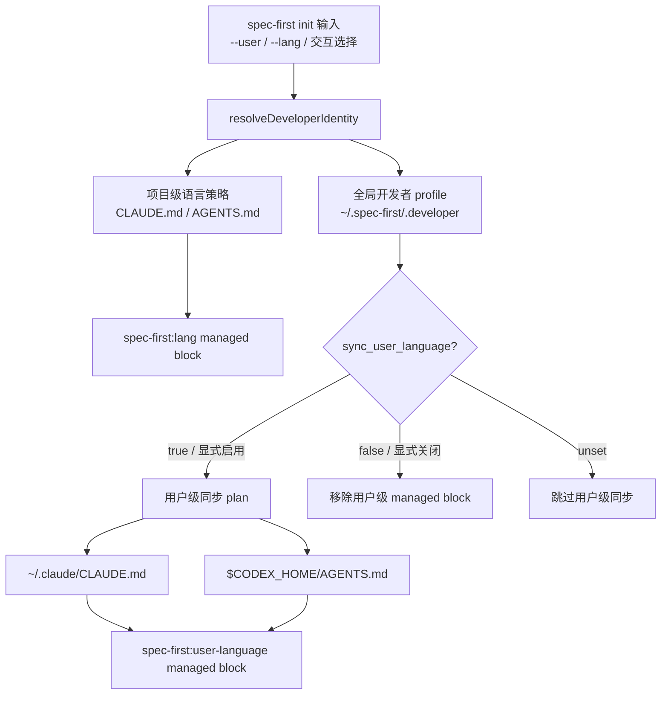
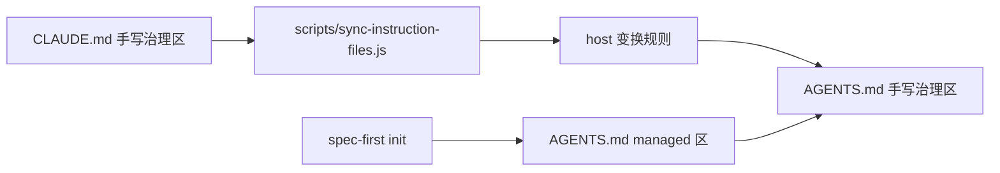
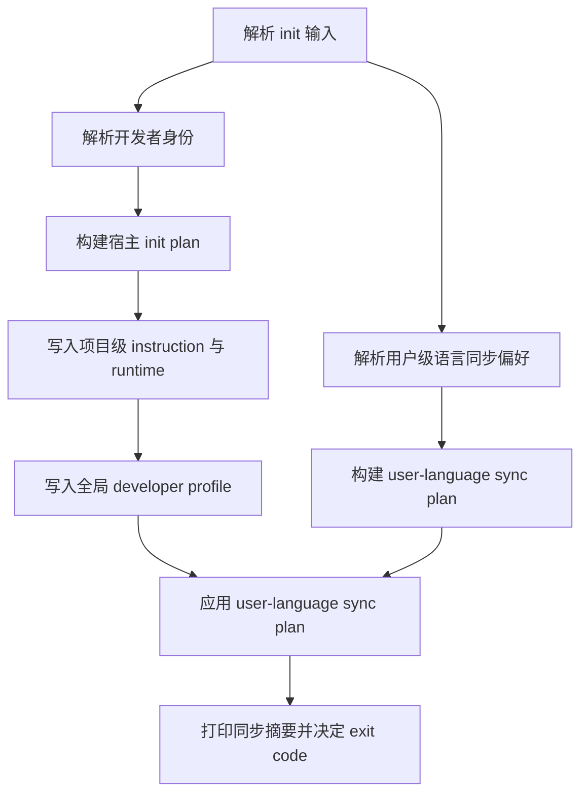

本页位于 Get Started → 团队落地路径中的“开发者身份、语言偏好与指令文件同步”，关注 `spec-first init` 如何确定开发者身份、把语言策略写入项目级 instruction 文件，并在用户授权后同步到 Claude/Codex 的用户级 instruction 文件；不展开宿主初始化、工作流路由或运行时清理细节，这些内容分别属于 [首次初始化：为 Claude Code、Codex、Kiro、Qoder 与 Cursor 生成运行时](4-shou-ci-chu-shi-hua-wei-claude-code-codex-kiro-qoder-yu-cursor-sheng-cheng-yun-xing-shi)、[工作流入口路由：什么时候使用 brainstorm、prd、debug、work 或 review](8-gong-zuo-liu-ru-kou-lu-you-shi-yao-shi-hou-shi-yong-brainstorm-prd-debug-work-huo-review) 与 [常见问题排查：宿主未加载、helper 缺失、运行时漂移与版本提醒](13-chang-jian-wen-ti-pai-cha-su-zhu-wei-jia-zai-helper-que-shi-yun-xing-shi-piao-yi-yu-ban-ben-ti-xing)。Sources: [developer.js](src/cli/developer.js#L51-L85), [lang-policy.js](src/cli/lang-policy.js#L10-L37), [user-language-sync.js](src/cli/user-language-sync.js#L29-L59)

## 架构假设与验证结论

本页的核心架构假设是：**开发者身份是全局 profile 的事实源，项目 instruction 文件承载项目级语言治理，用户级语言同步是显式授权后的可选扩散层**。源码验证显示，开发者 profile 固定读写 `~/.spec-first/.developer`；项目级语言策略通过 `spec-first:lang` managed block 写入宿主对应的项目 instruction 文件；用户级语言同步则生成独立 plan，并只覆盖 Claude/Codex 的用户 instruction 文件。Sources: [developer.js](src/cli/developer.js#L6-L12), [lang-policy.js](src/cli/lang-policy.js#L5-L12), [user-language-sync.js](src/cli/user-language-sync.js#L26-L59)



上图中的三层边界来自不同模块：`developer.js` 负责身份解析和全局 profile 格式化，`lang-policy.js` 负责项目级 `spec-first:lang` block，`user-language-sync.js` 负责用户级 `spec-first:user-language` block 的计划、写入与移除。Sources: [developer.js](src/cli/developer.js#L134-L158), [lang-policy.js](src/cli/lang-policy.js#L23-L37), [user-language-sync.js](src/cli/user-language-sync.js#L61-L102)

## 开发者身份解析：优先级与存储格式

开发者身份解析遵循确定性优先级：命令行显式 `--user` 与 `--lang` 优先，其次读取全局 `~/.spec-first/.developer`，开发者名称再回退到 `git config user.name`，语言缺省为 `zh`；如果最终没有名称会报错，语言仅接受 `zh` 或 `en`。Sources: [developer.js](src/cli/developer.js#L51-L85), [developer.js](src/cli/developer.js#L240-L250)

| 项目 | 优先级 / 行为 | 说明 |
|---|---:|---|
| 开发者名称 | `--user` → 全局 profile → `git config user.name` | 名称无法确定时初始化失败 |
| 输出语言 | `--lang` → 全局 profile → `zh` | 只支持 `zh` / `en` |
| 初始化时间 | 当前时间 ISO 字符串 | 写入 `initialized_at` |
| 版本 | 当前 package 版本 | 写入 `version` |
| 宿主列表 | 初始化选择的 host 集合 | 写入 `hosts`，去重并排序 |
| 用户级语言同步 | `sync_user_language=true/false` | 仅当存在布尔值时写入 |

Sources: [developer.js](src/cli/developer.js#L76-L85), [developer.js](src/cli/developer.js#L140-L158), [developer.js](src/cli/developer.js#L198-L205)

全局 profile 采用简单的 `key=value` 文本格式，解析时会忽略空行、无分隔符行以及空 key/value；字段归一化后输出 `name`、`lang`、`initializedAt`、`version`、`hosts` 与 `syncUserLanguage`。Sources: [developer.js](src/cli/developer.js#L23-L49), [developer.js](src/cli/developer.js#L161-L193)

```text
~/.spec-first/.developer
├── name=<developer name>
├── lang=zh|en
├── initialized_at=<ISO timestamp>
├── version=<spec-first version>
├── hosts=claude,codex,...
└── sync_user_language=true|false   # 仅在用户选择或已持久化时存在
```

上面的结构不是项目内状态，而是用户主目录下的全局身份记录；测试明确覆盖了“项目级 `.developer` 文件会被忽略”，并验证没有全局 profile 时会回退到 git 身份。Sources: [developer.sh](tests/unit/developer.sh#L104-L121), [developer.sh](tests/unit/developer.sh#L178-L187)

## 项目级语言策略：CLAUDE.md 与 AGENTS.md 的 managed block

项目级语言策略由 `writeLangPolicy(projectRoot, developer, adapter)` 写入宿主对应的 instruction 文件：Claude 使用 `CLAUDE.md`，Codex/共享 agent 入口使用 `AGENTS.md`；写入逻辑通过 marker block 保持幂等，文件不存在时创建，文件存在且 marker 完整时原位替换，文件存在但无 marker 时追加。Sources: [lang-policy.js](src/cli/lang-policy.js#L10-L37), [lang-policy.js](src/cli/lang-policy.js#L47-L64)

```text
项目根目录
├── CLAUDE.md        # Claude Code 项目级 instruction
│   └── <!-- spec-first:lang:start --> ... <!-- spec-first:lang:end -->
└── AGENTS.md        # Codex / 其他 AI agent 项目级 instruction
    └── <!-- spec-first:lang:start --> ... <!-- spec-first:lang:end -->
```

`spec-first:lang` block 不只是语言提示，还包含治理规则：中文模式要求所有面向用户的新生成自然语言内容使用简体中文，适用范围包括回答、状态更新、澄清问题、总结、评审、生成文档、需求、计划、任务、变更说明、commit message 和 PR 文案；代码标识符、命令、路径、配置键、环境变量、API 名称、协议名、日志、工具输出和引用材料可保留原文。Sources: [lang-policy.js](src/cli/lang-policy.js#L114-L124), [lang-policy.js](src/cli/lang-policy.js#L152-L163)

英文模式使用同一套边界，只把用户可见自然语言目标切换为 English，并同样允许代码标识符、命令、路径、配置键、环境变量、API 名称、协议名、日志、工具输出和引用材料保留原文。Sources: [lang-policy.js](src/cli/lang-policy.js#L127-L137), [lang-policy.js](src/cli/lang-policy.js#L166-L177)

| managed block | 文件层级 | Marker | 主要职责 |
|---|---|---|---|
| 项目级语言策略 | 项目根目录 `CLAUDE.md` / `AGENTS.md` | `spec-first:lang:start/end` | 规定当前仓库内用户可见输出语言与 changelog 作者读取规则 |
| 用户级语言策略 | `~/.claude/CLAUDE.md` / `$CODEX_HOME/AGENTS.md` | `spec-first:user-language:start/end` | 在用户授权后，把相同语言规则扩散到宿主用户级 instruction |

Sources: [lang-policy.js](src/cli/lang-policy.js#L5-L12), [lang-policy.js](src/cli/lang-policy.js#L104-L112), [user-language-sync.js](src/cli/user-language-sync.js#L392-L405)

## 用户级语言同步：显式授权、持久偏好与跳过模式

用户级语言同步由 `buildUserLanguageSyncPlan` 生成计划：当偏好解析为启用时，只对本次选择且受支持的 host 生成操作；当偏好解析为关闭时，对 Claude/Codex 两个用户级目标生成清理操作；当偏好未设置时模式为 `skipped`，不会产生 host 操作。Sources: [user-language-sync.js](src/cli/user-language-sync.js#L29-L59), [user-language-sync.js](src/cli/user-language-sync.js#L431-L467)

`spec-first init` 的偏好来源也有清晰优先级：命令行显式参数优先，其次沿用全局 profile 中已有的 `syncUserLanguage`；如果使用 `--yes` 且没有既有偏好，则保持 unset；否则交互式询问“是否同步用户级语言偏好到 Codex/Claude 用户 instruction 文件”，默认否。Sources: [init.js](src/cli/commands/init.js#L526-L558), [init-i18n.js](src/cli/init-i18n.js#L15-L15)

| 偏好来源 | 值 | 结果 |
|---|---:|---|
| 显式启用 | `true` | 写入用户级 managed block，并持久化 `sync_user_language=true` |
| 显式关闭 | `false` | 移除用户级 managed block，并持久化 `sync_user_language=false` |
| 已存 profile | `true/false` | 后续 init 自动沿用 |
| `--yes` 且无存储值 | `null` | 跳过用户级同步 |
| 交互默认 | `false` | 用户不确认时不扩散到用户级 instruction |

Sources: [init.js](src/cli/commands/init.js#L532-L557), [user-language-sync.js](src/cli/user-language-sync.js#L345-L389), [user-language-sync.test.js](tests/unit/user-language-sync.test.js#L50-L75)

用户级同步支持两个目标：Claude 固定写入 `~/.claude/CLAUDE.md`，Codex 写入 `$CODEX_HOME/AGENTS.md`；如果 `CODEX_HOME` 未设置，则 Codex home 默认为 `~/.codex`。Sources: [global-config-dir.js](src/cli/helpers/global-config-dir.js#L25-L39), [user-language-sync.js](src/cli/user-language-sync.js#L392-L405)

启用时，同步逻辑会读取目标文件、构造 `spec-first:user-language` block，并通过 marker upsert 追加或替换；关闭时只移除完整 marker block，保留周围用户内容。Sources: [user-language-sync.js](src/cli/user-language-sync.js#L152-L174), [user-language-sync.js](src/cli/user-language-sync.js#L176-L204), [user-language-sync.test.js](tests/unit/user-language-sync.test.js#L294-L327)

## 安全边界：避免覆盖、冲突与 Codex override 阴影

用户级同步不会盲写：如果项目 instruction 文件与用户级目标解析为同一个物理路径，会返回 `same-physical-path-collision`，避免同一个文件被项目级与用户级逻辑双重写入；路径比较会对已存在祖先做 canonicalize，以处理符号链接。Sources: [user-language-sync.js](src/cli/user-language-sync.js#L104-L129), [global-config-dir.js](src/cli/helpers/global-config-dir.js#L41-L82), [user-language-sync.test.js](tests/unit/user-language-sync.test.js#L189-L240)

Codex 还有一个额外保护：启用用户级同步时，如果 `$CODEX_HOME/AGENTS.override.md` 是非空文件，计划会标记为 `codex-global-override-active` 且要求用户处理，不会改写 override，也不会持久化本次启用偏好。Sources: [user-language-sync.js](src/cli/user-language-sync.js#L131-L143), [user-language-sync.js](src/cli/user-language-sync.js#L73-L87), [user-language-sync.test.js](tests/unit/user-language-sync.test.js#L77-L102)

如果目标路径存在但不是普通文件，同步会产生结构化失败 `user-language-target-unreadable`；启用场景下 profile 写入会被跳过，避免记录一个尚未真正生效的偏好；关闭场景下即使清理失败，也会持久化 `sync_user_language=false`，以便后续 init 继续重试移除残留 block。Sources: [user-language-sync.js](src/cli/user-language-sync.js#L207-L246), [user-language-sync.js](src/cli/user-language-sync.js#L73-L87), [user-language-sync.test.js](tests/unit/user-language-sync.test.js#L242-L292)

## CLAUDE.md 与 AGENTS.md 的手写区同步

仓库内 `CLAUDE.md` 与 `AGENTS.md` 的手写治理区不是双向编辑模型：同步脚本以 `CLAUDE.md` 手写区为源，通过 host 规则派生 `AGENTS.md` 手写区，同时保留 `AGENTS.md` 自己的 managed 区；脚本明确说明 managed 区由 `spec-first init` 生成，自己不触碰。Sources: [sync-instruction-files.js](scripts/sync-instruction-files.js#L11-L20), [sync-instruction-files.js](scripts/sync-instruction-files.js#L47-L66)

该脚本的漂移策略是 fail-loud：如果 `CLAUDE.md` 缺少 `spec-first:lang:start` marker，或 host 变换规则中的 source 字符串不再命中，会直接报错；测试覆盖了规则命中、managed 区保留、规则漂移失败、缺少 marker 失败以及磁盘上的 `AGENTS.md` 必须匹配派生结果。Sources: [sync-instruction-files.js](scripts/sync-instruction-files.js#L34-L44), [sync-instruction-files.js](scripts/sync-instruction-files.js#L55-L63), [sync-instruction-files.test.js](tests/unit/sync-instruction-files.test.js#L30-L82)



这个同步链路的实践含义是：修改仓库级通用治理文案时应优先改 `CLAUDE.md` 手写区，再运行同步脚本派生 `AGENTS.md`；不要手动改 `AGENTS.md` 的派生治理区，也不要把 managed block 当作手写内容维护。Sources: [sync-instruction-files.js](scripts/sync-instruction-files.js#L16-L18), [sync-instruction-files.js](scripts/sync-instruction-files.js#L84-L109)

## 初始化时的执行顺序

`spec-first init` 在交互输入完成后先构建宿主初始化 plan，再构建用户级语言同步 plan；非 dry-run 场景下先逐个应用宿主初始化 plan，然后应用用户级语言同步 plan，并把同步结果纳入最终 exit code。Sources: [init.js](src/cli/commands/init.js#L200-L220), [init.js](src/cli/commands/init.js#L233-L266)



全局 developer profile 的写入在宿主 init plan 应用阶段完成：只有 action 为 `create` 或 `overwrite` 时才调用 `writeGlobalDeveloperFile`；已有 `syncUserLanguage` 会在必要时被保留，避免普通 profile 覆盖丢失用户级语言同步偏好。Sources: [init.js](src/cli/commands/init.js#L1288-L1304), [init.js](src/cli/commands/init.js#L2630-L2645), [init.js](src/cli/commands/init.js#L2676-L2688)

## 常见状态与处理建议

| 状态 | 可观察原因码 / 现象 | 建议处理 |
|---|---|---|
| 用户级同步未启用 | `user-language-sync-unset` | 不需要处理；项目级 `spec-first:lang` 仍会生效 |
| Codex override 存在 | `codex-global-override-active` | 先人工处理 `$CODEX_HOME/AGENTS.override.md`，再重新 init |
| 项目路径与用户路径相同 | `same-physical-path-collision` | 换到真实项目根目录执行 init，避免把用户配置目录当项目根 |
| 用户 instruction 目标不是文件 | `user-language-target-unreadable` | 修复目标路径类型后重新 init |
| 关闭同步后目标文件缺失 | `missing/no-op` | 正常状态；关闭不会创建新文件 |

Sources: [user-language-sync.js](src/cli/user-language-sync.js#L61-L102), [user-language-sync.js](src/cli/user-language-sync.js#L122-L143), [user-language-sync.js](src/cli/user-language-sync.js#L176-L204), [user-language-sync.test.js](tests/unit/user-language-sync.test.js#L104-L123)

如果只是想确保当前仓库语言策略正确，检查项目根目录的 `CLAUDE.md` 或 `AGENTS.md` 是否存在 `<!-- spec-first:lang:start -->` 到 `<!-- spec-first:lang:end -->`；如果想确认用户级扩散是否启用，检查 `~/.spec-first/.developer` 是否有 `sync_user_language=true`，再检查对应用户 instruction 文件是否存在 `spec-first:user-language` block。Sources: [lang-policy.js](src/cli/lang-policy.js#L5-L12), [developer.js](src/cli/developer.js#L146-L158), [user-language-sync.test.js](tests/unit/user-language-sync.test.js#L50-L75)

## 阅读路径

如果你还没有完成宿主初始化，先读 [首次初始化：为 Claude Code、Codex、Kiro、Qoder 与 Cursor 生成运行时](4-shou-ci-chu-shi-hua-wei-claude-code-codex-kiro-qoder-yu-cursor-sheng-cheng-yun-xing-shi)；如果你已经完成初始化并准备跑需求链路，继续读 [运行第一个需求工作流并检查仓库产物](5-yun-xing-di-ge-xu-qiu-gong-zuo-liu-bing-jian-cha-cang-ku-chan-wu)；如果遇到宿主未加载、helper 缺失、运行时漂移或版本提醒，再读 [常见问题排查：宿主未加载、helper 缺失、运行时漂移与版本提醒](13-chang-jian-wen-ti-pai-cha-su-zhu-wei-jia-zai-helper-que-shi-yun-xing-shi-piao-yi-yu-ban-ben-ti-xing)。Sources: [init.js](src/cli/commands/init.js#L200-L220), [lang-policy.js](src/cli/lang-policy.js#L23-L37), [user-language-sync.js](src/cli/user-language-sync.js#L61-L102)