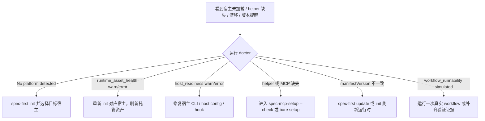

本页位于 Get Started 的团队落地段，目标是把“已经安装或初始化过，但宿主里看不到 workflow、helper 报缺失、生成运行时与源码版本不一致、或频繁/没有看到版本提醒”这四类问题收敛成可执行的排查路径；更完整的初始化流程请回到[首次初始化：为 Claude Code、Codex、Kiro、Qoder 与 Cursor 生成运行时](4-shou-ci-chu-shi-hua-wei-claude-code-codex-kiro-qoder-yu-cursor-sheng-cheng-yun-xing-shi)，命令语义速查请参考[CLI 命令速查：doctor、init、update、clean、tasks 与 session](6-cli-ming-ling-su-cha-doctor-init-update-clean-tasks-yu-session)。Sources: [index.js](src/cli/index.js#L158-L180), [doctor.js](src/cli/commands/doctor.js#L1074-L1098)

## 排查假设：先区分“宿主加载面”和“spec-first 生成面”

多数故障不是单点问题，而是四层链路中的某一层断开：CLI 必须可运行，`spec-first init` 必须把对应宿主的运行时资产写入项目，宿主必须能发现这些资产，`spec-mcp-setup` 才能继续补齐 MCP/helper/provider readiness；`doctor` 的边界也正是检查 CLI 安装、托管运行时资产、宿主 readiness 与工作流验证证据，而不是替代 MCP/helper setup。Sources: [doctor.js](src/cli/commands/doctor.js#L1074-L1098), [spec-mcp-setup/SKILL.md](skills/spec-mcp-setup/SKILL.md#L11-L23)

```mermaid
flowchart TD
  A[spec-first CLI 可运行] --> B[spec-first init 生成宿主运行时]
  B --> C[宿主发现 commands / skills / agents / hooks]
  C --> D[spec-mcp-setup 检查 MCP、helper、provider]
  D --> E[workflow 可进入并产出验证证据]

  B -. state.json / manifestVersion .-> F[运行时漂移判断]
  D -. tool-facts / runtime-capabilities .-> G[helper 与 readiness 事实]
  A -. update notifier .-> H[CLI / 启动版本提醒]
```

这张图的关键判断是：如果宿主看不到入口，先查 `init` 与运行时目录；如果入口能打开但提示工具不可用，再查 `spec-mcp-setup`；如果入口存在但内容或行为像旧版本，再查 state manifest 与 update 刷新；如果只有提醒异常，则查版本提醒的冷却、TTY/CI、宿主范围。Sources: [init.js](src/cli/commands/init.js#L77-L113), [doctor.js](src/cli/commands/doctor.js#L555-L645), [version-reminder.js](src/cli/version-reminder.js#L435-L448)

## 快速分诊流程

先在项目根目录运行 `spec-first doctor --json`；如果已经知道目标宿主，可加 `--claude`、`--codex`、`--cursor`、`--kiro` 或 `--qoder`。无宿主参数时，doctor 会自动检测已初始化平台；如果一个平台都没检测到，它会提示运行 `spec-first init` 并选择目标宿主。Sources: [doctor.js](src/cli/commands/doctor.js#L28-L66), [doctor.js](src/cli/commands/doctor.js#L1105-L1167)



| 现象 | 优先查看字段/输出 | 常见原因 | 第一动作 |
| --- | --- | --- | --- |
| 宿主里看不到 `spec-*` workflow | `platforms`、平台检查、commands/skills/agents | 未初始化该宿主、运行时目录缺失、宿主预览能力未验证 | `spec-first init --<host>` |
| workflow 能进入但工具缺失 | `host_readiness`、`decision_input_health`、setup 输出 | MCP/helper/provider 未配置或 readiness facts 缺失 | 运行 `spec-mcp-setup --check` 或当前宿主的 `spec-mcp-setup` |
| 文件存在但像旧版本 | state 检查中的 `recorded X, bundled Y` 或 drifted | CLI 升级后未刷新生成运行时，或手改了托管文件 | `spec-first update` 或 `spec-first init --<host> -y` |
| 没看到或反复看到版本提醒 | 启动提醒 / CLI update notifier | 冷却、CI/非 TTY、opt-out 环境变量、只支持 Claude/Codex 启动提醒 | 按“版本提醒”章节处理 |

Sources: [doctor.js](src/cli/commands/doctor.js#L537-L552), [doctor.js](src/cli/commands/doctor.js#L871-L925), [version-reminder.js](src/cli/version-reminder.js#L86-L187)

## 宿主未加载：确认生成位置是否符合宿主模型

`spec-first init` 支持 Claude Code、Codex、Cursor、Kiro、Qoder 五个宿主；交互式初始化会让你选择宿主，`-y` 的默认宿主是 Claude 与 Codex，其他宿主需要显式指定。Sources: [init.js](src/cli/commands/init.js#L77-L113), [init.js](src/cli/commands/init.js#L580-L588)

```text
项目根目录
├── .claude/                 # Claude Code runtimeRoot
│   ├── commands/
│   ├── skills/
│   ├── agents/
│   └── spec-first/state.json
├── .codex/                  # Codex runtimeRoot
│   ├── hooks.json
│   ├── hooks/
│   ├── agents/
│   └── spec-first/state.json
├── .agents/skills/          # Codex workflow skill 发现面
├── .cursor/                 # Cursor generated-runtime preview
│   ├── skills/
│   └── spec-first/state.json
├── .kiro/ ...               # Kiro runtime 检测面
└── .qoder/ ...              # Qoder runtime/state 检测面
```

Claude 的入口面包括 `.claude/commands`、`.claude/skills`、`.claude/agents` 与 `.claude/spec-first/state.json`；Codex 的用户可见 workflow 入口发现于 `.agents/skills/`，`.codex/commands/spec/` 仅作为 legacy cleanup target，Codex 的 agent profile 在 `.codex/agents/`。Sources: [claude.js](src/cli/adapters/claude.js#L48-L81), [codex.js](src/cli/adapters/codex.js#L27-L75)

Cursor 当前被标记为 generated-runtime preview：doctor 会提示 Cursor skill discovery/invocation 尚未在本机验证，生成 skills 可能不会被宿主加载；这类提示不是说文件一定没生成，而是表示宿主侧加载证据不足。Sources: [cursor.js](src/cli/adapters/cursor.js#L58-L101), [cursor.js](src/cli/adapters/cursor.js#L133-L174)

如果 doctor 输出某个宿主的 command、skill、agent 或 state 为 `missing`，按输出中的 Fix 重新运行 `spec-first init` 并选择对应宿主；这些 Fix 文案来自统一的 init guidance，默认会提示“Run `spec-first init` and choose <host>”。Sources: [doctor.js](src/cli/commands/doctor.js#L203-L252), [doctor.js](src/cli/commands/doctor.js#L254-L303), [doctor.js](src/cli/commands/doctor.js#L305-L354), [init-guidance.js](src/cli/init-guidance.js#L1-L17)

推荐命令如下：Claude 使用 `spec-first init --claude -y`，Codex 使用 `spec-first init --codex -y`，Cursor/Kiro/Qoder 分别使用 `--cursor`、`--kiro`、`--qoder`；如果在父工作区初始化多仓库，继续参考[多仓库与父工作区初始化实践](10-duo-cang-ku-yu-fu-gong-zuo-qu-chu-shi-hua-shi-jian)。Sources: [init.js](src/cli/commands/init.js#L276-L389), [init.js](src/cli/commands/init.js#L622-L680)

## helper 缺失：不要把 helper 当 MCP，也不要手改 readiness facts

`spec-mcp-setup` 是当前公开的 Runtime Setup 入口，负责宿主 runtime setup、MCP setup、helper-tool readiness、缺失运行时资产与项目本地 setup fact refresh；它的输出事实包括 `.spec-first/config/tool-facts.json`、`.spec-first/config/runtime-capabilities.json` 与场景 fingerprint。Sources: [spec-mcp-setup/SKILL.md](skills/spec-mcp-setup/SKILL.md#L1-L23), [spec-mcp-setup/SKILL.md](skills/spec-mcp-setup/SKILL.md#L48-L51)

helper 工具的单一事实源是 `helper-tools.json`，不是 `mcp-tools.json`；当前 helper 检查包括 `agent-browser` 与 ast-grep 能力检测，读-only 验证应使用 `install-helpers.* --verify-only`，只有 setup 明确需要修复时才走安装路径。Sources: [spec-mcp-setup/SKILL.md](skills/spec-mcp-setup/SKILL.md#L40-L46), [helper-tools.json](skills/spec-mcp-setup/helper-tools.json#L1-L41)

| helper | 是否 baseline blocking | 典型用途 | 检测方式 | 修复入口 |
| --- | --- | --- | --- | --- |
| `gh` | 是 | GitHub issue / PR workflow | command `gh` | 按系统包管理器安装 |
| `jq` | 是 | shell setup scripts / JSON parsing | command `jq` | 按系统包管理器安装 |
| `agent-browser` | 否，按 UI surface 需要 | browser automation / frontend polish / e2e validation | command/skill `agent-browser` | 显式 opt-in 安装后重跑 setup |
| `ast-grep` | helper capability | 结构化源码检索能力 | registry 中的 command detection | 由 setup 检测与报告 |

Sources: [helper-tools.json](skills/spec-mcp-setup/helper-tools.json#L42-L103), [helper-tools.json](skills/spec-mcp-setup/helper-tools.json#L1-L41), [helper-tools.json](skills/spec-mcp-setup/helper-tools.json#L197-L268)

不要使用宿主的 Write/Update/Edit 直接修改 `.spec-first/config/tool-facts.json`、`.spec-first/config/runtime-capabilities.json` 或宿主 MCP 配置；setup 要通过 `verify-tools.*`、`write-setup-facts.*` 与 documented host config targets 写入这些事实。Sources: [spec-mcp-setup/SKILL.md](skills/spec-mcp-setup/SKILL.md#L65-L72)

如果只是想确认缺什么，先运行当前宿主里的 `spec-mcp-setup --check`；如果要刷新 facts 但不安装工具，使用 `--verify-only` 或 `--refresh-facts`；如果要应用默认安装与配置路径，运行 bare `spec-mcp-setup`，它会展示 provider/helper/host 写入计划并执行验证。Sources: [spec-mcp-setup/SKILL.md](skills/spec-mcp-setup/SKILL.md#L73-L87), [spec-mcp-setup/SKILL.md](skills/spec-mcp-setup/SKILL.md#L88-L113)

## 运行时漂移：识别 state、托管文件与引导块三类漂移

运行时漂移最常见的信号是 state 文件里的 `manifestVersion` 与当前打包 manifest 版本不一致；doctor 会报告 `recorded <旧版本>, bundled <新版本>`，并建议在升级后重新同步托管资产。Sources: [doctor.js](src/cli/commands/doctor.js#L871-L907), [state.js](src/cli/state.js#L66-L90)

第二类是 command、skill、agent 或 support asset 的文件内容 drift：doctor 会分别检查缺失与 drifted 项，并把最多三个漂移样本格式化到提示里；如果只有漂移没有缺失，也会建议重新 init 以 resync drifted assets。Sources: [doctor.js](src/cli/commands/doctor.js#L203-L252), [doctor.js](src/cli/commands/doctor.js#L254-L303), [doctor.js](src/cli/commands/doctor.js#L305-L400), [doctor.js](src/cli/commands/doctor.js#L651-L663)

第三类是 instruction bootstrap 漂移：`CLAUDE.md` 或 `AGENTS.md` 中的 `spec-first:bootstrap` managed block 缺失、不完整或与模板不一致时，doctor 会提示恢复 managed bootstrap block。Sources: [instruction-bootstrap.js](src/cli/instruction-bootstrap.js#L38-L82), [doctor.js](src/cli/commands/doctor.js#L928-L944)

| 漂移类型 | 典型 doctor 信息 | 风险 | 修复方式 |
| --- | --- | --- | --- |
| state 版本漂移 | `recorded X, bundled Y` | 生成运行时不是当前 CLI 版本 | `spec-first init --<host> -y` 或 `spec-first update` |
| command/skill/agent 漂移 | `drifted <file> (content_mismatch)` | 宿主读到旧 prompt 或手改后的 prompt | 重新 init 对应宿主 |
| bootstrap 漂移 | `managed bootstrap block missing/drifted` | 会话入口治理失效或路由锚点缺失 | 重新 init 对应宿主 |
| legacy managed state | `legacy managed state detected` | 旧状态结构无法可靠治理 | 重新 init 执行 managed hard reset |

Sources: [doctor.js](src/cli/commands/doctor.js#L871-L925), [instruction-bootstrap.js](src/cli/instruction-bootstrap.js#L84-L129), [state.js](src/cli/state.js#L127-L193)

如果刚收到版本提醒，优先运行 `spec-first update`；该命令会执行 `npm install -g spec-first@latest`，升级成功后启动新的 `spec-first init` 子进程刷新本地 runtime，避免旧进程直接跑新生成逻辑造成版本错位。Sources: [update.js](src/cli/commands/update.js#L18-L29), [update.js](src/cli/commands/update.js#L70-L102)

## 版本提醒：区分 CLI 命令提醒与宿主启动提醒

CLI 命令级提醒只在 `doctor`、`init`、`clean`、`update` 这些命令运行且不是 help 调用时触发；提醒会查询最新版本并输出 `Run spec-first update`，也支持通过 `SPEC_FIRST_NO_UPDATE_NOTIFIER=1` 关闭。Sources: [index.js](src/cli/index.js#L37-L87), [version-reminder.js](src/cli/version-reminder.js#L23-L84)

启动提醒当前只接受 `--claude` 或 `--codex`，会读取对应宿主 runtime 的 state 或存在性来判断当前 runtime version；如果 runtime 不存在，它不会提示。Sources: [index.js](src/cli/index.js#L89-L156), [version-reminder.js](src/cli/version-reminder.js#L110-L175), [version-reminder.js](src/cli/version-reminder.js#L230-L292)

版本提醒有 24 小时 attempt cooldown，并使用 lock 避免并发重复查询；启动提醒的状态写到用户 home 下的 `.<host>/spec-first/startup-version-reminder.json`，CLI 命令提醒写到 `~/.spec-first/version-reminder.json`。Sources: [version-reminder.js](src/cli/version-reminder.js#L7-L13), [version-reminder.js](src/cli/version-reminder.js#L294-L353), [version-reminder.js](src/cli/version-reminder.js#L562-L572)

| 问题 | 可验证事实 | 处理 |
| --- | --- | --- |
| 从未看到 CLI 版本提醒 | CI、非 TTY、`SPEC_FIRST_NO_UPDATE_NOTIFIER`、冷却命中都可能跳过 | 在交互式终端运行 `spec-first doctor`；确认未设置 opt-out |
| 启动提醒没有出现 | 仅 Claude/Codex 支持；runtime 不存在时返回 null | 先 `spec-first init --claude` 或 `--codex` |
| 想重新测试启动提醒 | 有 cooldown state | `spec-first startup-reminder --claude --reset` 或 `--codex --reset` |
| 提醒显示 runtime version unknown | state 缺失或 manifestVersion 不能解析 | 运行 `spec-first init --<host> -y` 刷新 state |

Sources: [version-reminder.js](src/cli/version-reminder.js#L435-L448), [version-reminder.js](src/cli/version-reminder.js#L470-L484), [version-reminder.js](src/cli/version-reminder.js#L177-L187), [version-reminder.js](src/cli/version-reminder.js#L230-L266)

## 故障到命令的最短路径

如果宿主完全未加载，先运行 `spec-first doctor --<host>`，再运行 `spec-first init --<host> -y`；如果多宿主同时缺失，可重复指定宿主重新 init，`init` 的 platform flags 会被解析成平台集合后逐一构建 init plan。Sources: [doctor.js](src/cli/commands/doctor.js#L28-L73), [init.js](src/cli/commands/init.js#L276-L389), [init.js](src/cli/commands/init.js#L606-L612)

如果 helper 缺失但宿主入口存在，进入宿主中的 `spec-mcp-setup --check` 查看缺失项；需要修复时运行 bare `spec-mcp-setup`，它的 workflow 明确会先识别当前宿主、读取 registry、检测工具、安装 helper、写 readiness ledger，并报告可行动状态。Sources: [spec-mcp-setup/SKILL.md](skills/spec-mcp-setup/SKILL.md#L104-L113), [spec-mcp-setup/SKILL.md](skills/spec-mcp-setup/SKILL.md#L114-L127)

如果 doctor 报 runtime drift，优先 `spec-first update`；若你确定 CLI 已经是新版本但本项目运行时旧，只运行 `spec-first init --<host> -y` 刷新生成资产即可。Sources: [update.js](src/cli/commands/update.js#L50-L102), [doctor.js](src/cli/commands/doctor.js#L894-L900)

如果 `workflow_runnability` 是 `simulated` 而不是 `verified`，说明 runtime surface 可以就绪，但缺少新鲜、schema-valid 的工作流验证证据；这不等于宿主未加载，而是没有达到“真实运行已记录”的证据级别。Sources: [doctor.js](src/cli/commands/doctor.js#L555-L645), [doctor.js](src/cli/commands/doctor.js#L665-L699)

## 建议阅读路径

完成本页排查后，如果问题出在首次生成，请读[首次初始化：为 Claude Code、Codex、Kiro、Qoder 与 Cursor 生成运行时](4-shou-ci-chu-shi-hua-wei-claude-code-codex-kiro-qoder-yu-cursor-sheng-cheng-yun-xing-shi)；如果需要理解 `doctor`、`init`、`update`、`clean` 的命令边界，请读[CLI 命令速查：doctor、init、update、clean、tasks 与 session](6-cli-ming-ling-su-cha-doctor-init-update-clean-tasks-yu-session)。Sources: [index.js](src/cli/index.js#L158-L180), [doctor.js](src/cli/commands/doctor.js#L1074-L1103)

如果你正在排查多仓库父工作区，请继续读[多仓库与父工作区初始化实践](10-duo-cang-ku-yu-fu-gong-zuo-qu-chu-shi-hua-shi-jian)；如果你想从架构层理解为什么运行时是生成资产而不是 source truth，请读[源码资产到宿主运行时的生成式架构](15-yuan-ma-zi-chan-dao-su-zhu-yun-xing-shi-de-sheng-cheng-shi-jia-gou)。Sources: [init.js](src/cli/commands/init.js#L622-L719), [spec-mcp-setup/SKILL.md](skills/spec-mcp-setup/SKILL.md#L34-L39)

如果排查已经确认入口和 helper 都正常，下一步应回到使用路径：从[工作流入口路由：什么时候使用 brainstorm、prd、debug、work 或 review](8-gong-zuo-liu-ru-kou-lu-you-shi-yao-shi-hou-shi-yong-brainstorm-prd-debug-work-huo-review)选择正确 workflow，再按[从想法到代码的主链路：Spec → Plan → Tasks → Code → Review → Knowledge](7-cong-xiang-fa-dao-dai-ma-de-zhu-lian-lu-spec-plan-tasks-code-review-knowledge)推进。Sources: [instruction-bootstrap.js](src/cli/instruction-bootstrap.js#L140-L169), [instruction-bootstrap.js](src/cli/instruction-bootstrap.js#L183-L199)