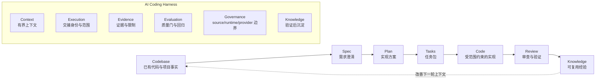
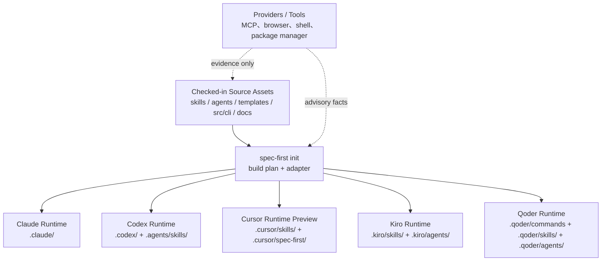
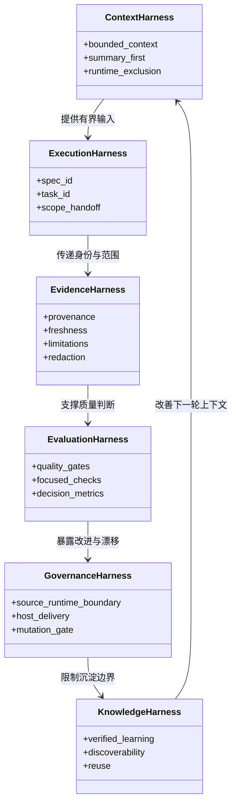

本页位于 Deep Dive 的“架构总览”起点，目标不是介绍某个具体命令或某个宿主的初始化细节，而是解释 `spec-first` 为什么被定义为 **AI Coding Harness**：它把一次性 AI coding 对话约束进一条可治理、可观察、可验证的工程闭环，并用分层合同明确上下文、执行交接、证据、评估、治理与知识沉淀的边界。Sources: [ai-coding-harness.md](docs/contracts/ai-coding-harness.md#L1-L5), [CONCEPTS.md](CONCEPTS.md#L9-L16)

## 架构假设：Harness 不是“更大的 Prompt”，而是工程闭环的约束层

本页的验证假设是：`spec-first` 的核心价值不在于堆叠 agent 数量或 prompt 模板，而在于把不稳定的模型推理放入一个有界循环，使工作从 Codebase 进入 Spec、Plan、Tasks、Code、Review，再回到 Knowledge；合同文档明确写出这条核心链路，并要求任何 contract 变更都服务链路中的节点，或提升上下文、证据、执行交接、评估、治理、知识复用的可重复性。Sources: [ai-coding-harness.md](docs/contracts/ai-coding-harness.md#L7-L14), [CONCEPTS.md](CONCEPTS.md#L9-L16)

`spec-first` 因此更接近“工程护栏”而不是“中心化流程引擎”：合同文档明确说明它不是新的 workflow、command、state machine 或 universal schema；`spec_id` 也只是跨 requirements、plans、task packs 的轻量身份字段，不是工作流状态、审批标记、进度数据库、freshness check 或中心注册键。Sources: [ai-coding-harness.md](docs/contracts/ai-coding-harness.md#L3-L5), [spec-id-traceability.md](docs/contracts/workflows/spec-id-traceability.md#L1-L8)

上图表达的是合同中的“核心链路 + 分层约束”关系：链路描述工作如何流动，Harness 层描述每一步应如何被约束、记录与交接；这种设计让模型仍然负责语义判断，但不能绕过机械边界、证据来源与产物形状。Sources: [ai-coding-harness.md](docs/contracts/ai-coding-harness.md#L15-L24), [source-runtime-customization-boundary.md](docs/contracts/source-runtime-customization-boundary.md#L77-L99)

## 设计理念一：把 AI 输出变成仓库内可检查的工程产物

`spec-first` 的公开定位是面向 Claude Code、Codex、Kiro、Qoder 与 Cursor 的 AI Coding Harness；README 进一步说明，它把一次性 AI coding 对话变成由仓库承载的 requirements、plans、scoped work、review 和 reusable learning 闭环，而不是只保留聊天窗口里的推理过程。Sources: [README.zh-CN.md](README.zh-CN.md#L16-L19), [README.zh-CN.md](README.zh-CN.md#L162-L167)

这个理念在产物层表现为：工作流可能在 `docs/brainstorms/` 写 requirements briefs，在 `docs/plans/` 写 implementation plans，在 `docs/tasks/` 写 task packs，在 `docs/reviews/` 写 findings，在 `docs/solutions/` 写可复用经验，并在 `.spec-first/workflows/` 保存结构化 work closeout evidence；README 同时强调不是每个 workflow 都写入所有产物，产物会随链路逐步积累。Sources: [README.zh-CN.md](README.zh-CN.md#L125-L141)

## 设计理念二：脚本守住事实地板，LLM 负责语义判断

Harness 的一个核心边界是“确定性脚本”和“LLM 语义判断”分工：脚本负责路径、schema validity、hash、readiness、budget、reason code、artifact refs、raw-log refs 等可机械判定的不变量；LLM 在这层事实地板之上判断 scope、架构取舍、finding 是否成立、root cause、任务顺序以及 degraded evidence 是否足够。Sources: [ai-coding-harness.md](docs/contracts/ai-coding-harness.md#L26-L33), [source-runtime-customization-boundary.md](docs/contracts/source-runtime-customization-boundary.md#L77-L99)

| 职责边界 | 由脚本/工具处理 | 由 LLM 判断 |
| --- | --- | --- |
| 输入事实 | 路径、exit code、schema 校验、readiness/freshness、bounded excerpt | 哪些事实与当前任务语义相关 |
| 工作范围 | artifact path、task identity、hash、reason code | 产品 scope、架构 tradeoff、workflow recommendation |
| 审查结论 | source/test/log/schema/contract 的可读证据 | finding 是否成立、风险大小、是否需要阻断 |
| 降级模式 | degraded、not-run、unknown 等状态记录 | 当前 degraded evidence 是否足够继续 |

这张表不是新增规则，而是对现有合同的压缩表达：合同明确说 tools 只能提供 evidence、capabilities、logs 和 readiness facts，不拥有 semantic authority；脚本可以准备 reason code、artifact paths、exit codes、schema validation results、readiness/freshness status、bounded excerpts 和 raw log references，而 LLM 决定产品范围、架构取舍、工作流建议、审查结论与降级证据是否足够。Sources: [source-runtime-customization-boundary.md](docs/contracts/source-runtime-customization-boundary.md#L77-L99)

## 设计理念三：Source 拥有行为，Runtime 只是宿主投影

Harness 的治理层把 source、generated runtime 与 provider 明确分开：可修改行为的 source-of-truth 包括 `skills/`、`agents/`、`templates/`、`src/cli/`、`docs/`、README、AGENTS、CLAUDE 等 checked-in 文件；`.claude/`、`.codex/`、`.agents/skills/`、`.cursor/skills/`、`.kiro/skills/`、`.qoder/skills/` 等路径是 generated runtime mirrors 或 host-local config outputs，不能手改为 source fix。Sources: [source-runtime-customization-boundary.md](docs/contracts/source-runtime-customization-boundary.md#L7-L24), [source-runtime-customization-boundary.md](docs/contracts/source-runtime-customization-boundary.md#L25-L62)

CLI 初始化代码也体现了这个模型：`init` 根据用户选择的平台调用对应 adapter，为每个平台构建 init plan；支持的平台 adapter 包括 Claude、Codex、Cursor、Kiro 与 Qoder；构建项目初始化计划时会读取 manifest、按 adapter 过滤 asset set，并规划 bundled asset sync 与 runtime files sync。Sources: [init.js](src/cli/commands/init.js#L606-L612), [adapters/index.js](src/cli/adapters/index.js#L1-L13), [init.js](src/cli/commands/init.js#L974-L1005), [init.js](src/cli/commands/init.js#L1084-L1119)

上图中的单向箭头是关键：行为从 checked-in source 生成到宿主 runtime，而不是从宿主 runtime 反向成为 source truth；合同明确要求修改行为时先改 source，再按需运行 `spec-first init` 重新生成 runtime mirrors，并用 `doctor` 检查 drift。Sources: [source-runtime-customization-boundary.md](docs/contracts/source-runtime-customization-boundary.md#L46-L56), [source-runtime-customization-boundary.md](docs/contracts/source-runtime-customization-boundary.md#L136-L148)

## 六层 Harness 模型

Harness 合同把系统分为六层：Context Harness、Execution Harness、Evidence Harness、Evaluation Harness、Governance Harness 与 Knowledge Harness。每一层都不是一个独立产品模块，而是一组跨 workflow 的 durable contract surface，用于约束模型如何读取、交接、证明、评估、治理和复用。Sources: [ai-coding-harness.md](docs/contracts/ai-coding-harness.md#L15-L24)

| Harness 层 | 它解决的问题 | 主要边界 |
| --- | --- | --- |
| Context Harness | 防止把整个 repo、generated runtime、raw MCP dump 或长 artifact 广播给 LLM | 有界、相关、可追溯的上下文 |
| Execution Harness | 防止 plan/task/work/review 之间丢失 scope、task identity 与 repo scope | 交接身份与范围，但不变成状态机 |
| Evidence Harness | 防止结论脱离 provenance、freshness、source reads、limitations 与 redaction | 结论必须可质疑、可验证 |
| Evaluation Harness | 防止只看使用次数而不看系统是否变好 | 聚焦检查、advisory quality gate、decision-linked metrics |
| Governance Harness | 防止 source/runtime/provider 边界混淆 | host delivery、mutation gate、并发与 freshness owner |
| Knowledge Harness | 防止经验沉淀为噪声或过期上下文 | 只沉淀已验证、可复用、可发现的经验 |

这张表直接对应合同中的 Harness layer 列表：Context 层服务上下文，Execution 层服务工作交接，Evidence 层服务证据可追溯，Evaluation 层服务系统改进度量，Governance 层服务边界和 owner，Knowledge 层服务可复用经验沉淀。Sources: [ai-coding-harness.md](docs/contracts/ai-coding-harness.md#L15-L24)

这个类图用于理解层间关系，而不是表示源码中的类继承结构：现有实现以合同、技能、CLI 初始化、runtime 生成、测试与文档产物共同表达这些职责，其中 `CONCEPTS.md` 将 Workflow Harness 定义为给 agent 提供正确上下文、证据边界、artifact shape 与 handoff contract 的协调层。Sources: [CONCEPTS.md](CONCEPTS.md#L13-L20), [ai-coding-harness.md](docs/contracts/ai-coding-harness.md#L15-L24)

## Context Harness：默认少读、精确读、summary-first

Context Harness 的目标是默认不把 runtime、generated、audit artifacts 当作普通上下文，保留 source-first、summary-first、path-backed evidence 的读取方式，并在超出上下文预算时记录 reason，而不是静默读取全量目录。Sources: [context-governance.md](docs/contracts/context-governance.md#L1-L14)

默认排除列表覆盖 `.claude/**`、`.codex/**`、`.agents/skills/**`、`.cursor/skills/**`、`.cursor/spec-first/**`、`.kiro/skills/**`、`.kiro/agents/**`、`.qoder/commands/spec-*.md`、`.qoder/skills/**`、`.qoder/agents/**` 等 generated runtime mirror；但普通 workflow 仍可读取 checked-in source truth，例如 `skills/`、`agents/`、`templates/`、`src/cli/`、`docs/contracts/`、AGENTS、CLAUDE、README 以及当前任务相关的源码、测试、计划或需求文档。Sources: [context-governance.md](docs/contracts/context-governance.md#L22-L56)

Context Harness 的核心使用规则是：先读用户请求、diff、changed files、计划/需求/task-pack summary，再读 source-of-truth files 与附近实现/测试切片，然后读 validated summaries、review facts 或 deterministic setup facts，只有在用户要求、workflow 明确需要或 summary 显示证据不足时，才精确展开 full artifact 或 raw evidence。Sources: [context-governance.md](docs/contracts/context-governance.md#L118-L130)

## Execution Harness：传递身份和范围，但不制造隐藏状态机

Execution Harness 通过 `spec_id`、`origin`、`source_plan`、`source_plan_hash`、R/A/F/AE IDs、U-IDs 与 `task_id` 这些字段，在 requirements、plans、task packs 与 work trace 之间保留链路身份；合同明确说它改善 LLM decision input，让相关 artifact 容易 join，而不是要求模型从文件名或 prose 中推断身份。Sources: [spec-id-traceability.md](docs/contracts/workflows/spec-id-traceability.md#L1-L20)

这里的关键边界是“不变成状态机”：同一个 `spec_id` 可用于普通 plan edits、plan deepening、从同一 source plan 重新生成 task pack，以及同一 source plan 的 work/review handoffs；但替代实现方案、独立交付链、abandon-and-replace 或互斥探索分支是否继承或新建 spec chain，仍由 LLM 记录理由，脚本只检查格式、路径存在和明显冲突。Sources: [spec-id-traceability.md](docs/contracts/workflows/spec-id-traceability.md#L38-L55)

## Evidence Harness：默认证据通道是 bounded direct evidence

Evidence Harness 的默认证据通道是 bounded direct evidence：source-read、verification、handoff-summary、external-tool 与 capability-candidate 都可以参与，但合同对每条 lane 的可信度设定了边界；例如 external-tool 输出在经过验证、边界化、摘要化并在关键处由 source/test/log evidence 确认之前，只是 advisory。Sources: [ai-coding-harness.md](docs/contracts/ai-coding-harness.md#L35-L46)

| Evidence lane | 可用来源 | 结论边界 |
| --- | --- | --- |
| source-read | 聚焦文件读取、`rg`、ast-grep、本地 package/test metadata | 作为确认路径，由 workflow 判断语义相关性 |
| verification | tests、syntax checks、CLI output、logs、deterministic validators | 脚本记录事实与 exit code，LLM 解释是否满足任务 |
| handoff-summary | artifact summaries、changed files、review/debug/work summaries | 传递 compact evidence 与 limitations，不广播 raw dump |
| external-tool | browser、MCP、package manager、shell 输出 | 未验证前不可信，只能 advisory |
| capability-candidate | project-graph/code-graph orientation candidates | 只能引导探索，结论需 source/test/log/doc 确认 |

这张表压缩自 Direct Evidence Lanes：它说明 `spec-first` 不禁止外部工具，但外部工具和 providers 不拥有 scope authority、finding authority、root-cause authority、mutation authority 或 workflow state；结论必须回到直接证据或明确限制。Sources: [ai-coding-harness.md](docs/contracts/ai-coding-harness.md#L35-L46), [ai-coding-harness.md](docs/contracts/ai-coding-harness.md#L26-L33)

## Evaluation Harness：用质量门观察系统是否真的变好

Evaluation Harness 的职责是用聚焦检查、advisory quality gate 和 decision-linked metrics 记录系统是否真的变好，而不是只看 workflow 使用次数；合同还要求 contract 变更要提供聚焦测试或 source check，避免新增第二套 readiness truth、第二套 evidence enum、隐藏 workflow state 或宽泛 external-tool platform。Sources: [ai-coding-harness.md](docs/contracts/ai-coding-harness.md#L21-L24), [ai-coding-harness.md](docs/contracts/ai-coding-harness.md#L47-L56)

在源码侧，这种“合同 + 检查”的设计也体现在 skills governance：`plugin.js` 会加载 `skills-governance`，校验每个 skill 的 `entry_surface`、`host_scope`、`host_delivery`、workflow command 映射以及 internal-only、dual-host、host-exclusive、target-host-maintenance 等约束，防止运行时暴露面偏离治理事实。Sources: [plugin.js](src/cli/plugin.js#L252-L279), [plugin.js](src/cli/plugin.js#L281-L439)

## Governance Harness：用 adapter 和 managed state 管住多宿主投影

Governance Harness 要明确 source/runtime/provider 边界、host delivery、mutation gate、并发与 freshness refresh owner；在实现上，`src/cli/adapters/index.js` 将 Claude、Codex、Cursor、Kiro、Qoder 注册为平台 adapter，`init` 根据平台构建 plan，并把 runtime 写入变成受 adapter 约束的同步过程。Sources: [ai-coding-harness.md](docs/contracts/ai-coding-harness.md#L21-L24), [adapters/index.js](src/cli/adapters/index.js#L1-L13), [init.js](src/cli/commands/init.js#L974-L1005)

`planSkillsSync` 展示了 generated runtime 的写入模型：它根据 adapter 的 `skillsRoot` 与 `workflowsRoot` 规划目录、区分 workflow skill 与 standalone skill，先移除 managed skill 目录，再按 source skill 复制并转换文本；agent 同步也从 bundled `agents` source 复制到 adapter 的 `agentsRoot`。Sources: [plugin.js](src/cli/plugin.js#L799-L858), [plugin.js](src/cli/plugin.js#L887-L924)

## Knowledge Harness：只沉淀已验证、可复用、可发现的经验

Knowledge Harness 的边界是“只沉淀已验证、可复用的经验，并让它们可发现；不要求每个 workflow 预读知识库”；`CONCEPTS.md` 也把 Learning 定义为真实问题解决后沉淀在 `docs/solutions/` 下的 source-confirmed solution 或 reusable practice，并要求它 searchable、specific、grounded in evidence。Sources: [ai-coding-harness.md](docs/contracts/ai-coding-harness.md#L21-L24), [CONCEPTS.md](CONCEPTS.md#L109-L122)

这也解释了为什么 Knowledge 处在链路末端但会反馈到下一轮 Codebase：它不是把所有历史知识塞进 prompt，而是在经过验证后形成可发现的经验资产，后续 workflow 再按 summary-first、scope-filtered 的方式读取相关内容。Sources: [context-governance.md](docs/contracts/context-governance.md#L71-L83), [CONCEPTS.md](CONCEPTS.md#L111-L122)

## 分层模型的实际收益

对中级开发者来说，AI Coding Harness 的直接收益是把“模型是否靠谱”转化成几个更容易检查的问题：上下文是否有边界，计划和任务是否能追踪，证据是否有来源和限制，脚本是否守住机械不变量，runtime 是否由 source 生成，经验是否经过验证后才沉淀。Sources: [README.zh-CN.md](README.zh-CN.md#L168-L179), [ai-coding-harness.md](docs/contracts/ai-coding-harness.md#L47-L56)

| 你要判断的问题 | Harness 关注点 | 对应层 |
| --- | --- | --- |
| LLM 有没有读太多无关内容或 generated runtime？ | 默认排除、summary-first、精确展开 | Context |
| Plan、Tasks、Work 是否能接上？ | `spec_id`、`source_plan`、`task_id`、handoff evidence | Execution |
| Review finding 是否有证据？ | provenance、freshness、source-read requirements、limitations | Evidence |
| 改动是否真的改善系统？ | quality gate、focused checks、contract tests | Evaluation |
| 多宿主 runtime 是否漂移？ | source/runtime boundary、adapter、managed state | Governance |
| 经验是否可复用而非噪声？ | verified learning、discoverability、scope-filtered reuse | Knowledge |

这张收益表对应合同中的六层模型与 README 中的采纳对比：相比只保留 agent transcript，`spec-first` 更强调仓库内 artifact、项目内文档、generated runtime assets、可验证 CLI facts、requirements/plans/task packs/diff/review findings/bugs/learnings，以及由脚本和 LLM 共同分担的边界。Sources: [ai-coding-harness.md](docs/contracts/ai-coding-harness.md#L15-L24), [README.zh-CN.md](README.zh-CN.md#L172-L179)

## 与相邻页面的阅读关系

读完本页后，如果你想理解 source assets 如何生成到 Claude、Codex、Cursor、Kiro 与 Qoder 的 runtime surface，下一步读 [源码资产到宿主运行时的生成式架构](15-yuan-ma-zi-chan-dao-su-zhu-yun-xing-shi-de-sheng-cheng-shi-jia-gou)；如果你更关心“哪些事应该交给脚本，哪些事应该交给 LLM”，下一步读 [确定性脚本与 LLM 语义判断的职责分界](16-que-ding-xing-jiao-ben-yu-llm-yu-yi-pan-duan-de-zhi-ze-fen-jie)。Sources: [source-runtime-customization-boundary.md](docs/contracts/source-runtime-customization-boundary.md#L7-L62), [source-runtime-customization-boundary.md](docs/contracts/source-runtime-customization-boundary.md#L77-L99)

如果你已经理解本页的分层模型，并希望继续追踪实现入口，可以进入 [CLI 入口与命令分发机制](17-cli-ru-kou-yu-ming-ling-fen-fa-ji-zhi)；如果你想先看工作流层如何落地，则建议跳到 [技能、命令、Agent 与治理清单的关系](21-ji-neng-ming-ling-agent-yu-zhi-li-qing-dan-de-guan-xi)。Sources: [spec-commands.js](src/cli/spec-commands.js#L1-L13), [plugin.js](src/cli/plugin.js#L252-L279)