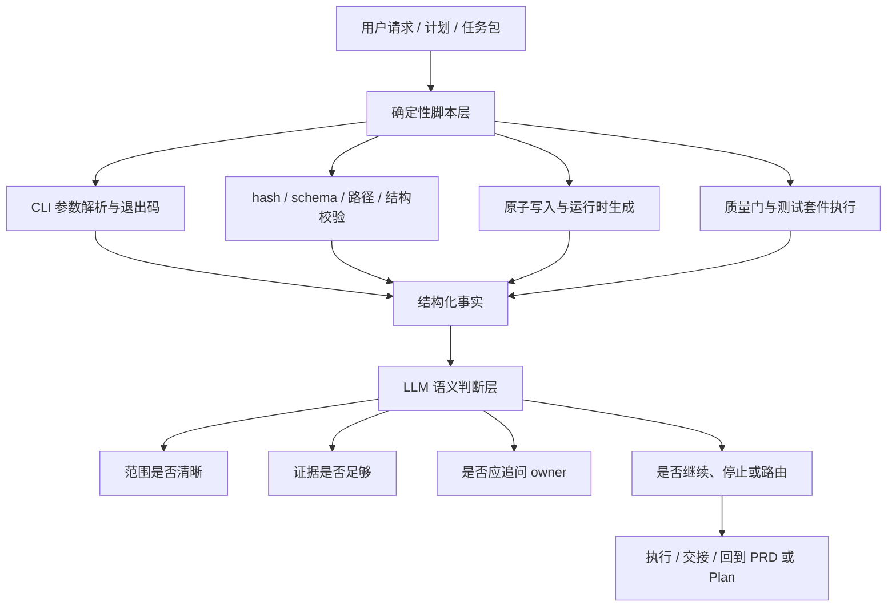
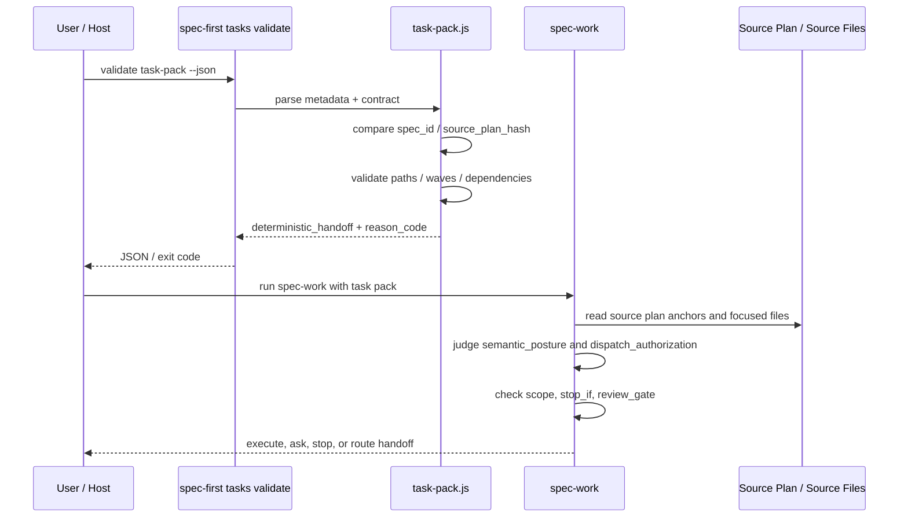

本页解释 spec-first 中一个核心架构原则：**确定性脚本负责可重复、可判定、可审计的机械事实；LLM 工作流负责需要上下文理解、业务取舍、风险排序与语义判断的决策**。这个边界不是“脚本越多越好”或“LLM 全权判断”，而是通过 CLI、契约、验证器、技能提示与上下文治理共同形成的分工体系。Sources: [index.js](src/cli/index.js#L19-L80), [tasks.js](src/cli/commands/tasks.js#L181-L192), [spec-work/SKILL.md](skills/spec-work/SKILL.md#L223-L229)

## 架构假设：把“事实判定”和“意义判断”分离

从代码结构看，spec-first 把 CLI 入口、初始化、任务包校验、schema 校验、质量门等工作放在 Node.js 脚本中执行；这些脚本返回退出码、结构化 JSON、文件写入结果或错误码。相对地，`spec-prd`、`spec-work` 等技能文件把需求澄清、范围判断、证据解释、是否追问用户、是否继续执行等语义职责写入 LLM 工作流契约。Sources: [index.js](src/cli/index.js#L44-L74), [tasks.js](src/cli/commands/tasks.js#L18-L33), [spec-prd/SKILL.md](skills/spec-prd/SKILL.md#L79-L88), [spec-work/SKILL.md](skills/spec-work/SKILL.md#L202-L253)

这个分界的第一原则是：**凡是可以由固定输入得到固定输出的检查，应尽量交给脚本；凡是需要解释“为什么”、权衡“是否足够”、判断“接下来该问谁或该停下”的工作，留给 LLM，但必须被契约和证据边界约束**。例如 `spec-first tasks validate` 明确只检查 identity、freshness、structure，不判断任务拆分质量或业务范围；而 `spec-work` 在确定性校验通过后，还要求检查 `semantic_posture` 和 `dispatch_authorization` 证据是否足以进入执行。Sources: [tasks.js](src/cli/commands/tasks.js#L181-L192), [spec-work/SKILL.md](skills/spec-work/SKILL.md#L217-L226)

## 职责关系图

下面的图展示了本页讨论的边界：CLI 和脚本先把机械事实固化为可消费的结果，LLM 再在这些事实之上做上下文判断；当判断发现边界不满足时，工作流应停止、追问或路由到上游，而不是让脚本伪装成业务裁决者。Sources: [tasks.js](src/cli/commands/tasks.js#L119-L132), [task-pack.js](src/cli/task-pack.js#L572-L575), [spec-work/SKILL.md](skills/spec-work/SKILL.md#L185-L196)

## 一句话分工

| 层级 | 负责什么 | 不负责什么 | 典型证据 |
| --- | --- | --- | --- |
| 确定性脚本 | 参数解析、文件路径安全、hash、schema 字段、退出码、测试结果、原子写入 | 业务范围是否合理、任务是否拆得好、需求是否真的清晰 | JSON 输出、错误码、校验结果、测试报告 |
| LLM 工作流 | 需求/计划/任务的语义理解、证据解释、范围非扩张、用户追问、路由决策 | 伪造工具结果、跳过脚本校验、把 advisory 候选当 confirmed truth | 源码引用、计划引用、用户确认、检查输出、handoff 摘要 |
| 契约文档 | 固化两者边界，说明哪些事实可机械验证、哪些事实只是 advisory | 替代具体 workflow 的语义判断 | `docs/contracts/**`、技能文件中的 workflow contract |

Sources: [tasks.js](src/cli/commands/tasks.js#L181-L192), [project-graph-consumption.md](docs/contracts/project-graph-consumption.md#L64-L69), [context-governance.md](docs/contracts/context-governance.md#L118-L129)

## CLI：机械分发，不做语义裁决

`src/cli/index.js` 中的 `runCli` 是典型的确定性入口：它复制参数、识别命令、按固定分支调用 `doctor`、`init`、`clean`、`update`、`tasks`、`session` 等子命令；未知命令返回错误并打印帮助。这一层只回答“用户调用了哪个命令、参数是否属于 CLI 支持范围”，不解释需求是否合理。Sources: [index.js](src/cli/index.js#L19-L80)

版本提醒也是机械触发：`shouldRunVersionReminder` 只在 `doctor`、`init`、`clean`、`update` 且非 help 参数时返回 true。它不会根据当前任务语义决定是否提醒，而是根据命令名和参数模式执行固定规则。Sources: [index.js](src/cli/index.js#L37-L42), [index.js](src/cli/index.js#L82-L87)

## 初始化：脚本生成计划并写入，LLM 不手改 runtime mirror

初始化流程体现了“生成式运行时”的确定性边界：`runInit` 收集输入、构建 init plans、打印诊断、可 dry-run 预览、确认后逐个应用计划，再执行用户语言同步并汇总退出码。这里的脚本职责是把 source assets 转换为宿主运行时资产，并把应用结果明确化。Sources: [init.js](src/cli/commands/init.js#L178-L266)

初始化参数解析同样是确定性逻辑：`parseInitArgs` 识别 `--yes`、`--dry-run`、`--all-repos`、`--repo`、host flags、语言同步选项等；缺失值或非法组合通过 `parsed.error` 反馈。这些规则不依赖 LLM 对当前仓库意图的猜测。Sources: [init.js](src/cli/commands/init.js#L276-L340)

host 支持列表也被脚本固化：`INIT_PLATFORM_CHOICES` 定义 Claude、Codex、Cursor、Kiro、Qoder；`SUPPORTED_HOST_IDS` 作为读写两侧过滤未知或停用标识的单一事实源，`resolveRememberedHosts` 与 `resolveSelectedHosts` 只保留支持的 host 并规范化排序。Sources: [init.js](src/cli/commands/init.js#L77-L113), [init.js](src/cli/commands/init.js#L580-L604)

与此对应，LLM 工作流被明确要求不要手改 generated runtime mirror。`spec-prd` 规定 PRD artifact 写在 `docs/brainstorms/`，不得编辑 generated runtime mirrors；`context-governance` 也说明 generated runtime mirror 需要通过 source 修改后运行 `spec-first init` 修复，而不是作为 source fix 手改。Sources: [spec-prd/SKILL.md](skills/spec-prd/SKILL.md#L16-L20), [context-governance.md](docs/contracts/context-governance.md#L103-L117)

## 原子写入：脚本保证写入语义，不让 LLM“描述性完成”

`atomic-write.js` 展示了脚本层适合承担的低层可靠性职责：创建临时路径、写入临时文件、rename 到目标路径，并在 Windows 上对 `EPERM`、`EACCES`、`EBUSY` 等目标占用错误做有限重试。这个机制的输出是文件系统状态，不是自然语言承诺。Sources: [atomic-write.js](src/cli/atomic-write.js#L13-L57)

`writeFileAtomicIfAbsent` 使用 `linkSync` 尝试仅在目标不存在时写入，并对临时文件清理做 best-effort。这样的边界特别重要：LLM 可以决定“是否需要写某类 artifact”，但实际写入一致性、临时文件命名和错误传播必须由脚本执行。Sources: [atomic-write.js](src/cli/atomic-write.js#L59-L84)

## 任务包校验：确定性检查“能不能交接”，不判断“拆得好不好”

`spec-first tasks hash` 对 plan body 做 canonical hash：读取 Markdown、剥离 frontmatter、归一化换行，并用 sha256 计算 `source_plan_hash`。这类校验适合脚本，因为相同输入必须得到相同 hash。Sources: [task-pack.js](src/cli/task-pack.js#L88-L96), [task-pack.js](src/cli/task-pack.js#L168-L195), [tasks.js](src/cli/commands/tasks.js#L35-L85)

`spec-first tasks validate` 则读取任务包、验证 contract、比较 `spec_id` 和 `source_plan_hash`，并派生 `task_pack_validity`、`reason_code` 与 `deterministic_handoff`。当有效性为 `valid` 时才得到确定性 handoff；否则返回非零退出码或 JSON 错误结果。Sources: [tasks.js](src/cli/commands/tasks.js#L88-L132), [task-pack.js](src/cli/task-pack.js#L520-L575)

任务包 contract 的解析也严格限定：必须存在 `## Task Pack Contract`，并且该 section 中必须有且只有一个 fenced `json` block；JSON 解析失败会产生确定性错误码。脚本在这里验证“结构是否存在且可解析”，不推断自由文本任务卡是否可执行。Sources: [task-pack.js](src/cli/task-pack.js#L198-L240), [spec-work/SKILL.md](skills/spec-work/SKILL.md#L217-L220)

更细的结构校验包括字段必填、任务 ID 唯一、wave 声明、依赖必须指向已知任务、依赖不能位于同 wave 或更晚 wave、文件路径必须是具体 repo-relative file，且不能指向 generated runtime mirror 或 secret-denied path。这些规则都可被脚本逐条判定。Sources: [task-pack.js](src/cli/task-pack.js#L578-L711), [task-pack.js](src/cli/task-pack.js#L713-L817), [task-pack.js](src/cli/task-pack.js#L819-L900)

但任务包脚本显式留下语义边界：`semantic_posture_evidence` 与 `dispatch_authorization_evidence` 只要求“必须为对象”，注释说明 CLI 只验证字段形状，不判断语义充分性。因此，即使 `deterministic_handoff` 为 true，LLM 仍要判断这些证据是否足以支持执行。Sources: [task-pack.js](src/cli/task-pack.js#L37-L40), [task-pack.js](src/cli/task-pack.js#L699-L711), [spec-work/SKILL.md](skills/spec-work/SKILL.md#L223-L226)

## LLM 工作流：在确定性事实之上做 intake、范围和风险判断

`spec-work` 把执行入口定义为“已有 settled plan、validated task pack、spec path 或 concrete implementation request”。它同时列出不应使用的场景：WHAT/HOW 未解决、repo scope 模糊、任务包 stale/unverifiable、范围会超出计划、或需要手改 generated runtime mirrors。这里的判断依赖上下文和用户意图，因此属于 LLM 工作流职责。Sources: [spec-work/SKILL.md](skills/spec-work/SKILL.md#L17-L24)

在 Phase 0 和 Phase 1，`spec-work` 要根据输入是文件路径还是 bare prompt 进行分流；对于 bare prompt，它要扫描工作区、评估复杂度，并在 WHAT 不清、缺少 settled plan、执行中发现超范围时推荐 brainstorm、plan 或 write-tasks，而不是强行实现。这不是脚本能凭参数完全决定的行为。Sources: [spec-work/SKILL.md](skills/spec-work/SKILL.md#L150-L183)

`spec-work` 对 validated task pack 的消费也不是“脚本通过就盲目执行”：它要求把 source plan 当作 scope、requirements、non-goals 的单一事实源，读取当前任务的 source anchors、`test_focus`、`done_signal`、`stop_if`，并在 hash、identity、contract 等确定性条件之外继续处理语义 posture 和 dispatch authorization。Sources: [spec-work/SKILL.md](skills/spec-work/SKILL.md#L202-L229)

当不能安全继续时，LLM 负责给出用户可执行的 handoff envelope，包括 blocking reason、recommended entrypoint、next action 和 context to carry。这类输出需要面向人类协作，不是脚本错误码能完整替代的。Sources: [spec-work/SKILL.md](skills/spec-work/SKILL.md#L185-L196)

## PRD 工作流：需求语义属于 LLM，但写入前也受脚本和 guard 约束

`spec-prd` 的核心职责是把既有系统增量、粗糙产品说明或低质量 PRD 转换为 durable PRD artifact，并通过 evidence、acceptance、scope boundaries、assumptions、unresolved questions 让 WHAT/WHY 可交接。它明确不做 implementation planning、task execution 或 debugging。Sources: [spec-prd/SKILL.md](skills/spec-prd/SKILL.md#L8-L18), [spec-prd/SKILL.md](skills/spec-prd/SKILL.md#L24-L31)

PRD 中的语义判断被组织成 Requirement Analysis Gate、Product Expert Lens、Requirements Grill、Pre-Write Closure Decision、Readiness Lens 等步骤；它要求区分 confirmed-source、user-stated、source-candidate、assumption 等证据措辞，并在 owner question、write mode、readiness outcome 上进行判断。Sources: [spec-prd/SKILL.md](skills/spec-prd/SKILL.md#L12-L15), [spec-prd/SKILL.md](skills/spec-prd/SKILL.md#L101-L114)

但 `spec-prd` 也承认脚本型 guard 的价值：Claude runtime 会安装 `prd-prewrite-guard`，在 `Write|Edit|MultiEdit` 前阻止缺少 durable-write `write_mode` 路径的 PRD artifact 首次写入。这说明 LLM 决定写什么，脚本/guard 约束“是否满足可写前提”。Sources: [spec-prd/SKILL.md](skills/spec-prd/SKILL.md#L18-L21), [spec-prd/SKILL.md](skills/spec-prd/SKILL.md#L93-L100)

## 上下文治理：脚本和契约决定“默认不读什么”，LLM决定“何时例外读取”

`context-governance.md` 明确它不是 context router 实现，也不是 workflow 状态机；它只定义普通 workflow 在读取 repo context 时必须遵守的最小 runtime exclusion policy。这个 contract 的目标包括默认不把 runtime/generated/audit artifacts 当作普通上下文、保留 source-first 与 summary-first、允许明确 runtime/setup/audit workflow 在范围内读取对应 artifacts。Sources: [context-governance.md](docs/contracts/context-governance.md#L1-L13)

默认排除项包括 `.spec-first/audits/**`、`.spec-first/governance/**`、`.claude/**`、`.codex/**`、`.agents/skills/**`、Cursor/Kiro/Qoder 的 generated mirrors 和 host-local config。普通 workflow 仍可读取 checked-in source truth，例如 `skills/`、`agents/`、`templates/`、`src/cli/`、`docs/contracts/`、`AGENTS.md`、`CLAUDE.md`、README 和当前任务相关源码、测试、计划或需求文档。Sources: [context-governance.md](docs/contracts/context-governance.md#L22-L55)

这形成了清晰边界：上下文排除规则是可机械化的路径政策，但是否因为用户明确点名、当前任务正在修改 runtime/setup、已加载指令冲突等例外而读取某个 instruction source，则需要 workflow 根据任务语义说明读取原因。Sources: [context-governance.md](docs/contracts/context-governance.md#L57-L70), [context-governance.md](docs/contracts/context-governance.md#L103-L117)

## 外部图谱与能力提供者：只能指路，不能证明结论

`project-graph-consumption.v1` 把 project-graph 和 code-graph 定义为 candidate evidence：它能帮助定位候选区域、关系路径或概念图，但不能证明 findings、scope、root cause、affected tests 或 merge readiness。Sources: [project-graph-consumption.md](docs/contracts/project-graph-consumption.md#L1-L13), [project-graph-consumption.md](docs/contracts/project-graph-consumption.md#L33-L42)

该 contract 的 trust tiers 进一步规定：exploration-tier navigation 可以用图谱候选决定下一步读哪里；conclusion-tier claims 必须由 source、tests、logs、docs、contracts 或 user confirmation 确认后，才能进入 plan claim、review finding、root-cause conclusion、implementation basis 或 shipping claim。Sources: [project-graph-consumption.md](docs/contracts/project-graph-consumption.md#L64-L75)

这正是脚本与 LLM 分界的扩展：provider readiness 是机械事实，图谱输出是 advisory 候选，最终结论仍要由 LLM 回到直接证据并承担语义解释责任。Sources: [project-graph-consumption.md](docs/contracts/project-graph-consumption.md#L49-L63), [project-graph-consumption.md](docs/contracts/project-graph-consumption.md#L86-L94)

## Schema validator：轻量确定性，不冒充完整标准解释器

`src/contracts/schema-validator.js` 实现了一个小型 deterministic validator，支持 `$ref`、`type`、`enum`、`const`、`required`、`properties`、`items`、`contains`、`additionalProperties`、组合关键字、条件关键字、长度、pattern 和数值范围等检查。Sources: [schema-validator.js](src/contracts/schema-validator.js#L3-L28), [schema-validator.js](src/contracts/schema-validator.js#L48-L123)

这个 validator 会在类型不匹配、缺失 required key、出现 unexpected additional key、数组长度不满足、字符串 pattern 不匹配、数值范围不满足时追加错误信息。它适合承担 contract tests 和 doctor evidence checks 中的重复结构校验。Sources: [schema-validator.js](src/contracts/schema-validator.js#L125-L190), [schema-validator.js](src/contracts/schema-validator.js#L192-L200)

但文档明确声明它不是完整 JSON Schema 实现，不能替代 Ajv 或其他 standards-complete validator；`format`、`$schema`、`$id`、`title`、`description`、`default`、`examples` 等未被此 validator 强制执行。也就是说，确定性脚本本身也必须声明能力边界，不能越权解释完整语义。Sources: [schema-validator.md](docs/contracts/schema-validator.md#L1-L4), [schema-validator.md](docs/contracts/schema-validator.md#L25-L30)

## AI Dev Quality Gate：脚本跑检查，LLM消费失败主题

`run-ai-dev-quality-gate.js` 固定运行 workflow runtime contract tests 和 benchmark fixtures，构造 gate result，并写出 `ai-dev-quality-gate-result.json` 与 `quality-feedback-topics.json`。`passed` 只由 blocking checks 是否全部通过决定，advisory failures 单独记录。Sources: [run-ai-dev-quality-gate.js](scripts/run-ai-dev-quality-gate.js#L16-L30), [run-ai-dev-quality-gate.js](scripts/run-ai-dev-quality-gate.js#L88-L103), [run-ai-dev-quality-gate.js](scripts/run-ai-dev-quality-gate.js#L138-L164)

质量反馈构造器只把失败 check 标准化成 candidate topics，例如 `gate-check:<check_id>`，并附带 artifact paths 和 tags。它不会自动决定应该修哪个模块、是否阻断某个 feature、或如何重排计划；这些仍是 LLM 或人类评审消费结构化事实后的工作。Sources: [quality-feedback.js](src/verification/quality-feedback.js#L7-L22), [quality-feedback.js](src/verification/quality-feedback.js#L24-L50)

## 模块交互图

下面的交互图把一次“从任务包到执行”的边界串起来：脚本先完成 hash、identity、contract 和结构校验；LLM 再读取计划与任务 anchors，判断 posture、authorization、scope 和 `stop_if`；若不满足，则返回 handoff。Sources: [tasks.js](src/cli/commands/tasks.js#L88-L132), [task-pack.js](src/cli/task-pack.js#L520-L575), [spec-work/SKILL.md](skills/spec-work/SKILL.md#L209-L235)

## 边界对照表

| 场景 | 脚本应该做 | LLM 应该做 | 不应发生 |
| --- | --- | --- | --- |
| CLI 命令进入 | 解析命令、调用子命令、返回退出码 | 根据用户目标选择合适入口 | 让 CLI 猜业务意图 |
| 初始化运行时 | 构建 plan、dry-run、写入 host runtime、同步状态 | 决定是否需要初始化或重建 | 手改 `.claude/**`、`.codex/**` 等 generated mirror |
| 任务包执行前 | hash、spec_id、contract、路径、wave、dependency 校验 | 判断 semantic posture、authorization、scope 是否足够 | 把 validator 通过当成业务 ready |
| PRD 写作 | guard 首次 durable write 前置条件 | 澄清 WHAT/WHY、追问 owner、判断 readiness | 没有证据却声明 ready-for-planning |
| 图谱/外部工具 | 提供 readiness 或候选事实 | 回到 source/tests/logs/docs 确认结论 | 把 candidate 当 confirmed truth |
| 质量门 | 运行测试、写 gate result、生成 feedback topics | 解释失败影响并决定修复策略 | 用自然语言替代真实测试结果 |

Sources: [index.js](src/cli/index.js#L19-L80), [init.js](src/cli/commands/init.js#L200-L266), [task-pack.js](src/cli/task-pack.js#L572-L575), [spec-prd/SKILL.md](skills/spec-prd/SKILL.md#L101-L114), [project-graph-consumption.md](docs/contracts/project-graph-consumption.md#L64-L69), [run-ai-dev-quality-gate.js](scripts/run-ai-dev-quality-gate.js#L138-L164)

## 判断准则：什么时候写脚本，什么时候写 workflow 规则

如果一个规则可以表达为“输入格式固定、输出集合有限、错误码可枚举、运行结果应可在 CI 或本地重复”，它更适合进入脚本层。例如路径安全、frontmatter/hash、JSON contract、schema keyword、host id 过滤、文件写入原子性和测试套件退出码。Sources: [task-pack.js](src/cli/task-pack.js#L247-L306), [schema-validator.js](src/contracts/schema-validator.js#L100-L190), [atomic-write.js](src/cli/atomic-write.js#L47-L57), [init.js](src/cli/commands/init.js#L586-L604)

如果一个规则需要理解产品意图、既有系统语义、用户是否已经回答关键问题、计划是否会让执行者发明 WHAT、候选证据是否足以支撑结论，或是否应该停止并路由到另一个工作流，它应保留在 LLM workflow 中，并通过契约、证据标签和 handoff 模板约束。Sources: [spec-prd/SKILL.md](skills/spec-prd/SKILL.md#L79-L88), [spec-prd/SKILL.md](skills/spec-prd/SKILL.md#L137-L166), [spec-work/SKILL.md](skills/spec-work/SKILL.md#L174-L196)

## 常见误区

第一个误区是“脚本通过等于可以上线”。在 spec-first 中，脚本通过只说明机械约束满足；`spec-work` 明确要求确定性 identity、freshness、structure 检查只是必要非充分条件，还要检查 semantic posture 和 dispatch authorization。Sources: [spec-work/SKILL.md](skills/spec-work/SKILL.md#L217-L226)

第二个误区是“LLM 看起来理解了，就可以跳过脚本”。任务包执行前必须使用 `spec-first tasks validate <task-pack-path> --json` 比较 hash；如果 tooling unavailable，应把任务包视为 unverifiable 并停止，而不是靠模型读 Markdown 自行判断新鲜度。Sources: [spec-work/SKILL.md](skills/spec-work/SKILL.md#L217-L222), [tasks.js](src/cli/commands/tasks.js#L119-L132)

第三个误区是“图谱、审计或 generated runtime 可以直接作为上下文全量读取”。context governance 明确普通 workflow 默认排除 runtime/generated/audit artifacts，并要求 summary-first、精确路径读取；project graph 也明确不要 cat full graph artifact。Sources: [context-governance.md](docs/contracts/context-governance.md#L71-L82), [context-governance.md](docs/contracts/context-governance.md#L118-L129), [project-graph-consumption.md](docs/contracts/project-graph-consumption.md#L14-L21)

第四个误区是“轻量 schema validator 等于完整 JSON Schema”。本仓库的 schema validator 文档明确限制它的支持关键字，并说明若需要 standards-complete 行为，应为具体 consumer 增加显式依赖和测试。Sources: [schema-validator.md](docs/contracts/schema-validator.md#L5-L30)

## 与相邻页面的阅读关系

如果你想继续理解这些脚本如何从源码资产生成到不同宿主运行时，下一步阅读 [源码资产到宿主运行时的生成式架构](15-yuan-ma-zi-chan-dao-su-zhu-yun-xing-shi-de-sheng-cheng-shi-jia-gou)。如果你更关心 CLI 如何分发到 `doctor/init/update/clean/tasks/session`，继续阅读 [CLI 入口与命令分发机制](17-cli-ru-kou-yu-ming-ling-fen-fa-ji-zhi)。Sources: [index.js](src/cli/index.js#L158-L181)

如果你要深入初始化写入、原子更新和 managed state，继续阅读 [初始化计划构建、原子写入与托管状态治理](18-chu-shi-hua-ji-hua-gou-jian-yuan-zi-xie-ru-yu-tuo-guan-zhuang-tai-zhi-li)。如果你要理解证据和质量门如何被固化为持续反馈，再阅读 [任务包 hash、验证证据、质量反馈与 AI Dev Quality Gate](27-ren-wu-bao-hash-yan-zheng-zheng-ju-zhi-liang-fan-kui-yu-ai-dev-quality-gate)。Sources: [atomic-write.js](src/cli/atomic-write.js#L47-L57), [tasks.js](src/cli/commands/tasks.js#L35-L85), [run-ai-dev-quality-gate.js](scripts/run-ai-dev-quality-gate.js#L138-L164)