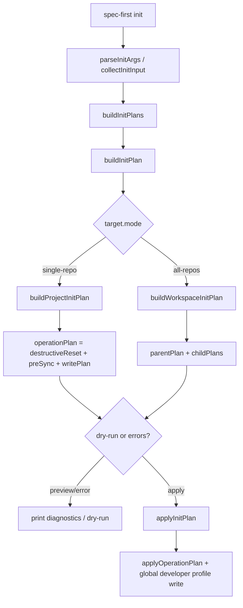
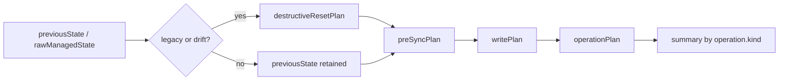
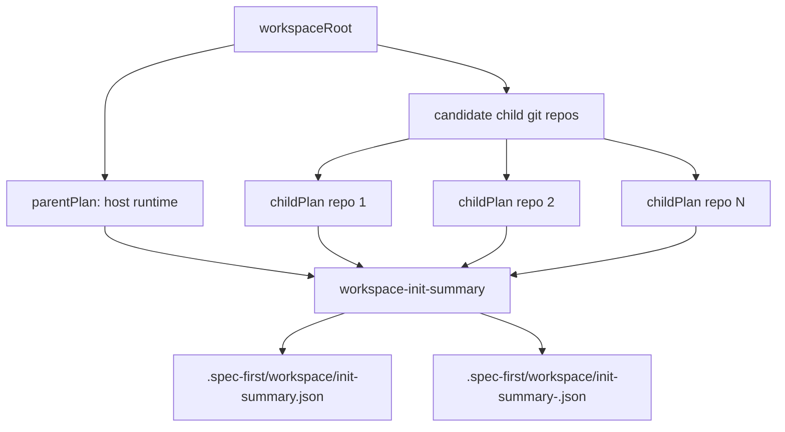
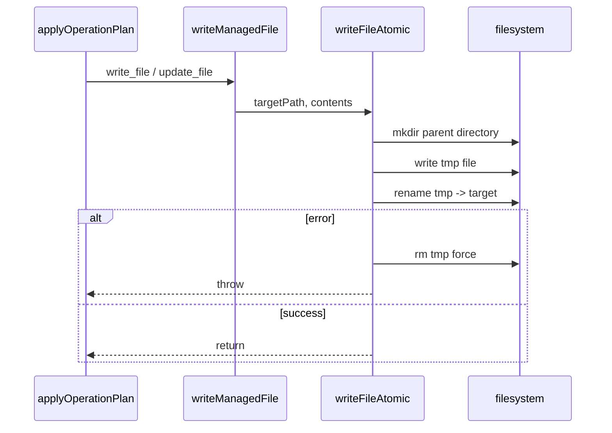
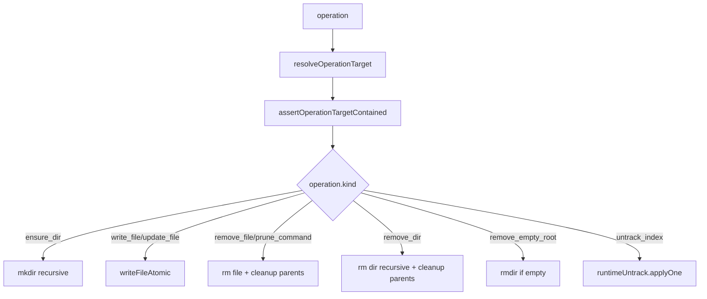

本页位于 Deep Dive / CLI 与运行时管理中的“初始化计划构建、原子写入与托管状态治理”，聚焦 `spec-first init` 在**写入前如何构建可检查计划、写入时如何保持文件级原子性、写入后如何用托管状态约束后续清理与重建**。它不展开各宿主适配器的具体资产布局，也不覆盖 `clean` / `update` 的完整生命周期；这些内容应继续阅读 [平台适配器模型：Claude、Codex、Cursor、Kiro 与 Qoder](19-ping-tai-gua-pei-qi-mo-xing-claude-codex-cursor-kiro-yu-qoder) 与 [运行时清理、升级、重建与遗留资产迁移](20-yun-xing-shi-qing-li-sheng-ji-zhong-jian-yu-yi-liu-zi-chan-qian-yi)。Sources: [index.js](src/cli/index.js#L44-L58), [init.js](src/cli/commands/init.js#L974-L1018), [state.js](src/cli/state.js#L575-L620)

## 架构假设与验证结论

初始化链路可以从三个不变量理解：第一，`buildInitPlan` 必须是**计划构建器**，在测试中被验证为不会写入文件；第二，`applyInitPlan` 才是**执行器**，按计划落盘并返回初始化结果；第三，所有被 CLI 视为“spec-first 管理”的运行时资产必须进入 `state.json` 或 operation plan，使后续的 obsolete prune、hard reset、runtime untrack 有可验证依据。`src/cli/init-plan.js` 只导出 `commands/init` 中的 `buildInitPlan` 与 `applyInitPlan`，说明公开 API 与 CLI 实现共享同一套计划/执行语义；单元测试进一步断言 `buildInitPlan` 前后目录快照一致，而 `applyInitPlan` 会实际生成宿主运行时与状态文件。Sources: [init-plan.js](src/cli/init-plan.js#L1-L9), [init-plan.test.js](tests/unit/init-plan.test.js#L57-L110), [init.js](src/cli/commands/init.js#L974-L1018)

初始化不是“直接复制模板”，而是一个**计划编译流程**：CLI 入口将 `init` 命令分发给 `runInit`，`runInit` 解析参数、收集交互输入、构造一个或多个平台计划，然后根据 dry-run 与错误状态选择预览或执行；计划内部再组合资产同步、运行时文件同步、`.gitignore` 策略、元数据文件、运行时 untrack 等子计划。Sources: [index.js](src/cli/index.js#L19-L58), [init.js](src/cli/commands/init.js#L115-L200), [init.js](src/cli/commands/init.js#L2723-L2744)

上图的关键是：`operationPlan` 是执行前的唯一计划载体，单仓库计划由 `buildProjectInitPlan` 产生，多仓库计划由 `buildWorkspaceInitPlan` 组合 parent 与 child 计划；真正写入由 `applyInitPlan` 分派到 project 或 workspace 执行函数，而不是在构建阶段隐式发生。Sources: [init.js](src/cli/commands/init.js#L606-L613), [init.js](src/cli/commands/init.js#L974-L1018), [init.js](src/cli/commands/init.js#L1605-L1675)

## 参数解析与输入规约

`parseInitArgs` 将初始化输入规约为结构化对象：它识别 `--claude`、`--codex`、`--cursor`、`--kiro`、`--qoder` 平台选择，支持 `-y/--yes`、`--dry-run`、`--all-repos`、`--repo`、`--user`、`--lang` 与用户语言同步开关，并在解析阶段拒绝未知参数、缺失值、非法语言、`--repo` 与 `--all-repos` 组合、互斥的语言同步开关。Sources: [init.js](src/cli/commands/init.js#L276-L389)

| 维度 | 机制 | 代码约束 | 治理效果 |
|---|---|---|---|
| 宿主选择 | 平台 flag 聚合到 `platforms` | 只接受 `INIT_PLATFORM_CHOICES` 中的 flag | 避免未知宿主进入计划 |
| 执行模式 | `--dry-run` 与 `-y/--yes` | 非交互时要求可解析默认或显式宿主 | 分离预览与落盘 |
| 目标范围 | `--repo` / `--all-repos` | 二者不可组合 | 避免目标语义冲突 |
| 用户偏好 | `--user` / `--lang` / sync 开关 | 语言只允许 `zh` 或 `en` | 为 profile 与指令注入提供稳定输入 |

该表描述的是参数层的第一道边界：初始化计划只接受已知宿主、明确目标与可枚举语言，这使后续 adapter、developer profile、workspace target 的处理可以基于有限状态机，而不是任意字符串。Sources: [init.js](src/cli/commands/init.js#L77-L113), [init.js](src/cli/commands/init.js#L276-L389)

## 单仓库计划：从现状读取到可执行 operation plan

`buildProjectInitPlan` 首先规范化项目根目录，读取已安装状态，加载插件 manifest，按 adapter 过滤资产集合，再调用 adapter 生成运行时文件同步计划；随后它解析开发者身份，并把本次选择的 host 列表写入 developer 对象，以便全局开发者 profile 能记录已选择宿主。Sources: [init.js](src/cli/commands/init.js#L1020-L1119)

计划构建阶段会产生 `previewState`，其内容来自 `buildState(manifest.version, syncedAssets)`，包括 platform、commands、skills、workflowSkills、agents 与 agentSupportFiles；这个 state 不是审计日志，而是**托管资产边界**，后续删除、迁移、hard reset 都以这些字段为索引。Sources: [init.js](src/cli/commands/init.js#L1116-L1149), [state.js](src/cli/state.js#L99-L112)

当存在旧状态或漂移时，计划会先进入治理分支：legacy state 会触发 `legacy_state_detected` 诊断并构造 `planHardResetManagedAssets`；已存在的新式 state 若检测到当前运行时漂移，也会构造 hard reset 计划并清空 previousState，使后续同步按干净边界重建。Sources: [init.js](src/cli/commands/init.js#L1175-L1206), [state.js](src/cli/state.js#L360-L389)

最终单仓库计划由三段合成：`destructiveResetPlan` 负责必要时删除受管资产根或旧资产，`preSyncPlan` 负责移除 obsolete asset、裁剪命令命名空间、清理 retired runtime asset 与遗留 developer profile，`writePlan` 负责写入新资产、`.gitignore`、metadata 与 runtime untrack；`operationPlan` 是三者 merge 后的总计划。Sources: [init.js](src/cli/commands/init.js#L1208-L1256), [state.js](src/cli/state.js#L216-L238)

这个顺序体现了初始化的幂等治理策略：先处理需要破坏性重置的旧边界，再移除不再属于下一版本 state 的资产，最后写入当前版本资产与元数据；`mergeOperationPlans` 通过 `kind:path` 去重并汇总 operation kind，避免同一路径重复操作。Sources: [init.js](src/cli/commands/init.js#L1208-L1256), [state.js](src/cli/state.js#L216-L246)

## 多仓库计划：parent runtime 与 child repo 的分层

当 target mode 为 `all-repos` 时，`buildInitPlan` 会进入 `buildWorkspaceInitPlan`：它以 workspace root 构建一个 parentPlan，并为每个 child git repo 构建独立 child plan；返回对象的 mode 为 `all-repos`，包含 candidates、parentPlan、childPlans、聚合 errors、聚合 diagnostics 与 parent/children summary。Sources: [init.js](src/cli/commands/init.js#L984-L997), [init.js](src/cli/commands/init.js#L1605-L1675)

多仓库执行结果会写入 `.spec-first/workspace/init-summary.json` 与平台专属 summary 文件；多平台情况下，`init-summary.json` 会成为 index summary，按平台维护 summary entry，并聚合 ready/action_required 与 runtime_untrack_total 等计数。Sources: [init.js](src/cli/commands/init.js#L1740-L1767), [init.js](src/cli/commands/init.js#L1884-L1928), [init.js](src/cli/commands/init.js#L1935-L1992)

这里的边界是明确的：parent runtime 是宿主运行时刷新入口，child plans 是各 git repo 的仓库本地初始化；summary 被标记为 advisory，并显式记录 `parent_writes_repo_local_artifacts: false` 与 `parent_writes_host_runtime_assets: true`，使父工作区初始化结果可审计但不混淆子仓库产物所有权。Sources: [init.js](src/cli/commands/init.js#L1770-L1823), [init.js](src/cli/commands/init.js#L1935-L1992)

## 写入计划的组成：资产、gitignore、metadata 与 untrack

`buildInitWritePlan` 将五类写入合并为一个 write plan：bundled asset sync、adapter runtime sync、`.gitignore` 管理块、metadata plan、runtime untrack plan；其中 `.gitignore` 只有在 `applySpecFirstGitignoreBlock` 返回非 `already-current` 时才生成 write/update operation，并在 operation 上附加 gitignoreStatus。Sources: [init.js](src/cli/commands/init.js#L2723-L2777)

metadata plan 会写入宿主 instruction 文件、adapter state 文件、缺失时的 `CHANGELOG.md`，并在 Claude 平台额外写入托管 hook matcher 配置；instruction 文件在写入前会移除旧 runtime tools block 与旧 coding guidelines block，再应用语言托管块与 bootstrap block。Sources: [init.js](src/cli/commands/init.js#L2796-L2867)

runtime untrack plan 来自 `planRuntimeUntrack`：它先确认当前目录是 git worktree，再用 `.gitignore` 策略中的 spec-first runtime patterns 查询已被 git 跟踪的路径，若存在则生成 `untrack_index` operation；如果没有被跟踪的 runtime asset，则返回 `none-tracked` 空计划。Sources: [init.js](src/cli/commands/init.js#L2779-L2794), [runtime-untrack.js](src/cli/runtime-untrack.js#L9-L41)

| 子计划 | 代表 operation | 输入来源 | 作用 |
|---|---|---|---|
| asset sync | `write_file` / `update_file` | plugin manifest 与 filtered asset set | 写入 skills、agents、commands 等包内资产 |
| runtime sync | `write_file` / `update_file` | adapter runtime planner | 写入宿主专属 hooks/settings 等运行时 |
| gitignore | `write_file` / `update_file` | `applySpecFirstGitignoreBlock` | 让托管 runtime 默认不进入 git |
| metadata | `write_file` / `update_file` | developer、nextState、bootstrap block | 写 instruction、state、CHANGELOG、Claude settings |
| untrack | `untrack_index` | git ls-files + runtime ignore patterns | 将已误跟踪 runtime 从索引移除 |

该表只描述 init write plan 内部的职责分层：它解释为何初始化同时包含“新增/更新文件”和“从 git index 解绑文件”，因为 `.gitignore` 只能影响未来跟踪，而 `untrack_index` 处理已经进入索引的受管 runtime。Sources: [init.js](src/cli/commands/init.js#L2723-L2794), [runtime-untrack.js](src/cli/runtime-untrack.js#L15-L32)

## 原子写入：文件替换的最小可靠单元

所有 operation plan 中的 `write_file` 与 `update_file` 最终由 `writeManagedFile` 调用 `writeFileAtomic` 写入；`writeFileAtomic` 先确保父目录存在，再创建带 basename、pid、timestamp 与随机后缀的临时文件，写入临时文件后通过 rename 替换目标文件，异常时删除临时文件并重新抛出。Sources: [state.js](src/cli/state.js#L591-L594), [state.js](src/cli/state.js#L641-L654), [atomic-write.js](src/cli/atomic-write.js#L13-L57)

Windows 上 rename-over-existing 可能因杀毒、索引器或开放句柄出现 EPERM/EACCES/EBUSY，`renameWithWindowsRetry` 只对这些目标竞争错误重试 10 次，每次阻塞等待 20ms；非 Windows 平台直接执行 `fs.renameSync`，其他错误不会被重试掩盖。Sources: [atomic-write.js](src/cli/atomic-write.js#L5-L45)

原子写入的粒度是“单文件”，不是整个初始化事务；只有发生 destructive reset 时，`applyProjectInitPlan` 会为 destructive/preSync/write 三段创建 runtime rollback backup，并在异常时恢复备份，而普通非破坏性路径按 preSync 后 writePlan 的顺序直接执行。Sources: [init.js](src/cli/commands/init.js#L1259-L1295), [atomic-write.js](src/cli/atomic-write.js#L47-L57)

## 托管状态：state.json 的结构与安全边界

托管状态文件由 `buildState` 规范化生成，必含 `manifestVersion`、`platform`、`commands`、`skills`、`workflowSkills`、`agents`、`agentSupportFiles`；`validateManagedStateShape` 要求这些字段为数组，并要求条目是非空字符串。Sources: [state.js](src/cli/state.js#L6-L12), [state.js](src/cli/state.js#L99-L157)

状态条目的路径安全约束非常严格：禁止绝对路径、Windows drive 路径、反斜杠、空段、`.` / `..`、NUL、Windows 保留名，以及包含 `< > : " | ? *` 或以点/空格结尾的 segment；agents 与 agentSupportFiles 允许嵌套路径，其他字段默认不允许嵌套。Sources: [state.js](src/cli/state.js#L127-L187)

这些约束让 state file 成为**受管资产索引**而不是任意删除清单：`planManagedAssetRemoval` 只根据 state 中记录的 commands、skills、workflowSkills、agents、agentSupportFiles 构造 remove operation；`planObsoleteManagedAssetRemoval` 只删除 previous state 中存在但 next state 中不存在的条目。Sources: [state.js](src/cli/state.js#L287-L354), [state.js](src/cli/state.js#L395-L467)

| 状态字段 | 映射根目录 | 删除/清理语义 |
|---|---|---|
| `commands` | `adapter.commandRoot` | 删除已托管命令文件 |
| `skills` | `adapter.skillsRoot` | 删除已托管 skill 目录 |
| `workflowSkills` | `adapter.workflowsRoot` | 删除已托管 workflow skill 目录 |
| `agents` | `adapter.agentsRoot` | 删除已托管 agent 文件 |
| `agentSupportFiles` | `adapter.agentsRoot` | 删除已托管 agent support 文件 |

该映射来自 `planManagedAssetRemoval` 的构造逻辑，因此它也是判断“哪些文件属于 spec-first 管理”的核心边界；不在 state 中、也不匹配 retired/runtime namespace 规则的文件，不会因为 state obsolete 逻辑被删除。Sources: [state.js](src/cli/state.js#L287-L354), [state.js](src/cli/state.js#L473-L535)

## Operation 执行器：路径包含性与动作分派

`applyOperationPlan` 对每个 operation 先解析目标路径，再执行两层包含性校验：第一，`resolveOperationTarget` 要求目标路径位于 project root 下，并禁止 remove/prune/untrack 等危险动作指向 project root 本身；第二，`assertOperationTargetContained` 找到最近存在路径并用 realpath 校验，防止通过 symlink 逃逸项目根。Sources: [state.js](src/cli/state.js#L575-L620), [state.js](src/cli/state.js#L656-L677)

动作分派是显式白名单：`ensure_dir` 创建目录，`write_file` / `update_file` 原子写文件，`remove_file` / `prune_command` 删除文件，`remove_dir` 删除目录，`remove_empty_root` 删除空根目录，`untrack_index` 调用 runtime untrack 的单项应用函数；未知 kind 不会在该分支中产生副作用。Sources: [state.js](src/cli/state.js#L575-L620), [state.js](src/cli/state.js#L641-L719)

这张图说明 init 的写入安全不是分散在调用者中的惯例，而是集中在 operation 执行器中：只要初始化写入经过 operation plan，就必须经过相同的 containment guard 与 kind whitelist。Sources: [state.js](src/cli/state.js#L575-L620), [state.js](src/cli/state.js#L656-L677)

## Runtime untrack：治理已被 Git 跟踪的运行时资产

`planRuntimeUntrack` 的读取阶段只做诊断和计划：它先运行 `git rev-parse --is-inside-work-tree`，再运行 `git ls-files -z -- <spec-first gitignore patterns>`，把 NUL 分隔路径去重排序后变成 `untrack_index` operations；失败时返回 reason_code 与 diagnostic，而不是抛出异常。Sources: [runtime-untrack.js](src/cli/runtime-untrack.js#L9-L41), [runtime-untrack.js](src/cli/runtime-untrack.js#L114-L195)

`applyOne` 在真正执行 `git rm --cached` 前会再次用 `git ls-files -- <filePath>` 检查目标是否仍被跟踪；如果此时已经未跟踪，则返回 `skipped-now-untracked`，否则执行 `git rm --cached --quiet -f -- <filePath>` 并返回 `untracked-runtime`。Sources: [runtime-untrack.js](src/cli/runtime-untrack.js#L43-L89)

runtime untrack 的结果会被 `applyOperationPlan` 汇总为 applied/skipped/reason_codes/diagnostic，并由 `applyProjectInitPlan` 包装到 init result 的 `runtime_untrack` 字段；因此初始化输出可以告知用户“运行时资产是否被从 Git 索引解绑”，而不需要把这件事伪装成普通文件写入。Sources: [state.js](src/cli/state.js#L611-L638), [init.js](src/cli/commands/init.js#L1268-L1295)

## 错误、诊断与 dry-run 的分界

计划中存在 errors 时，`applyProjectInitPlan` 不会执行写入，只返回 exit_code 1 与 runtime_untrack summary；dry-run 路径则打印 operation plan、untrack diagnostic、legacy state 与 destructive reset reason，不调用 `applyInitPlan`。Sources: [init.js](src/cli/commands/init.js#L950-L970), [init.js](src/cli/commands/init.js#L1259-L1266)

diagnostics 是非阻塞治理信号，例如 Cursor 生成式运行时 preview warning、Codex HOME hook 写入跳过、Codex 全局 hook 污染提示、legacy state 检测与当前运行时漂移检测；这些信号会进入 plan.diagnostics，并由 `printInitDiagnostics` 按 warn/log 输出。Sources: [init.js](src/cli/commands/init.js#L1056-L1062), [init.js](src/cli/commands/init.js#L1119-L1144), [init.js](src/cli/commands/init.js#L1175-L1206), [init.js](src/cli/commands/init.js#L2100-L2125)

| 情况 | 阶段 | 行为 | 是否写文件 |
|---|---|---|---|
| 参数非法 | parse | 返回错误并打印 usage | 否 |
| plan.errors 非空 | build/apply 前 | 返回 exit_code 1 | 否 |
| `--dry-run` | preview | 打印 operation plan | 否 |
| diagnostics only | build/apply | 警告但继续 | 是，除非其他错误 |
| destructive reset | apply | backup → reset/preSync/write → 删除 backup | 是 |
| destructive reset 异常 | apply | restore backup → rethrow | 尝试恢复 |

该表把错误与诊断分开：errors 阻断执行，diagnostics 解释风险或降级；dry-run 仍构造完整计划但不执行，destructive reset 则在执行阶段增加备份恢复保护。Sources: [init.js](src/cli/commands/init.js#L950-L970), [init.js](src/cli/commands/init.js#L1259-L1295), [init.js](src/cli/commands/init.js#L2100-L2125)

## 测试所固定的行为契约

单元测试固定了两个核心契约：`buildInitPlan` 只物化计划、不写文件；`applyInitPlan` 会写入宿主 instruction、commands/hooks/state 等实际产物，并且不会把 `.developer` 写到项目内的宿主 state 目录。Sources: [init-plan.test.js](tests/unit/init-plan.test.js#L57-L110)

测试还覆盖宿主差异对计划的影响：Kiro 生成 skills、agents 与 state，但不生成 command、hook 或 steering runtime；Qoder 生成 commands、skills、agents 与 state，但不生成 rules 或 hooks；Cursor 生成 skills 与 state，不生成 commands、agents 或 rules，并在 diagnostics 中暴露 generated-runtime preview warning。Sources: [init-plan.test.js](tests/unit/init-plan.test.js#L160-L199), [init-plan.test.js](tests/unit/init-plan.test.js#L200-L274), [init-plan.test.js](tests/unit/init-plan.test.js#L276-L329)

legacy managed state 测试固定了破坏性计划语义：旧状态被识别后，plan 会带有 `legacyStateDetected`、`destructiveResetReason: legacy_state_detected`、remove_dir summary 与 diagnostics；执行后旧 skill 被删除，新 commands 按当前扁平命名空间生成。Sources: [init-plan.test.js](tests/unit/init-plan.test.js#L363-L389)

Codex 相关测试固定了 hook 治理边界：在 CODEX_HOME root 初始化时，计划包含 `codex_home_hook_write_skipped` 诊断，并且不写 `.codex/hooks.json` 或 session-start hook；普通项目初始化如果检测到全局 CODEX_HOME 污染，会暴露 advisory diagnostics，但仍写入当前项目 hook。Sources: [init-plan.test.js](tests/unit/init-plan.test.js#L391-L440)

## 与相邻页面的边界

如果你要理解“为什么不同宿主的 commandRoot、skillsRoot、agentsRoot、hooks/settings 生成不同”，下一步应读 [平台适配器模型：Claude、Codex、Cursor、Kiro 与 Qoder](19-ping-tai-gua-pei-qi-mo-xing-claude-codex-cursor-kiro-yu-qoder)；本页只解释 adapter 产出的计划如何被合并、校验与执行。Sources: [init.js](src/cli/commands/init.js#L1116-L1127), [state.js](src/cli/state.js#L287-L354)

如果你要理解初始化之后如何执行清理、升级、重建或遗留资产迁移，继续读 [运行时清理、升级、重建与遗留资产迁移](20-yun-xing-shi-qing-li-sheng-ji-zhong-jian-yu-yi-liu-zi-chan-qian-yi)；本页只覆盖 init 期间的 preSync、hard reset、retired prune 与 runtime untrack 机制。Sources: [init.js](src/cli/commands/init.js#L1208-L1256), [state.js](src/cli/state.js#L360-L389), [state.js](src/cli/state.js#L473-L535)

如果你要从入口分发角度理解 `doctor`、`init`、`update`、`clean` 如何被 CLI 路由，请回到 [CLI 入口与命令分发机制](17-cli-ru-kou-yu-ming-ling-fen-fa-ji-zhi)；本页只把 `init` 分支展开到计划构建、原子写入与托管状态治理。Sources: [index.js](src/cli/index.js#L19-L80), [init.js](src/cli/commands/init.js#L974-L1018)