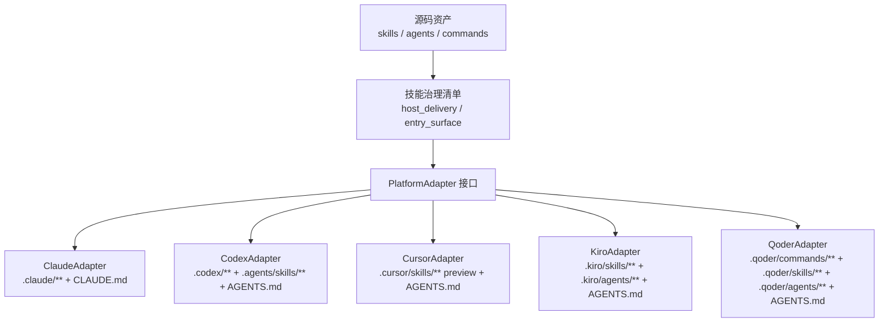
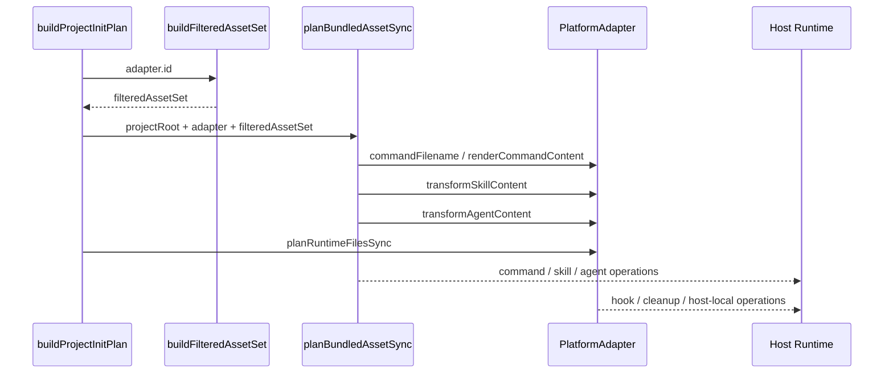

本页位于 Deep Dive → CLI 与运行时管理 → **[平台适配器模型：Claude、Codex、Cursor、Kiro 与 Qoder](19-ping-tai-gua-pei-qi-mo-xing-claude-codex-cursor-kiro-yu-qoder)**，只解释 spec-first 如何用平台适配器把同一组源码资产投影为 Claude Code、Codex、Cursor、Kiro 与 Qoder 的不同运行时形态；初始化计划、原子写入、清理迁移、技能语义本身分别属于相邻页面 [初始化计划构建、原子写入与托管状态治理](18-chu-shi-hua-ji-hua-gou-jian-yuan-zi-xie-ru-yu-tuo-guan-zhuang-tai-zhi-li)、[运行时清理、升级、重建与遗留资产迁移](20-yun-xing-shi-qing-li-sheng-ji-zhong-jian-yu-yi-liu-zi-chan-qian-yi)、[技能、命令、Agent 与治理清单的关系](21-ji-neng-ming-ling-agent-yu-zhi-li-qing-dan-de-guan-xi)。Sources: [index.js](src/cli/adapters/index.js#L1-L40), [init.js](src/cli/commands/init.js#L77-L113)

## 架构假设与验证结论

本页采用的架构假设是：spec-first 的多宿主支持不是在每个工作流里硬编码宿主差异，而是以 `PlatformAdapter` 作为稳定接口，把“目录布局、命令入口、技能/Agent 文本变换、运行时附加文件、检查与移除”这些变化点封装在各宿主 adapter 中；源码验证显示基类显式定义了 `runtimeRoot`、`managedRoot`、`commandRoot`、`skillsRoot`、`workflowsRoot`、`agentsRoot`、`stateFile`、`instructionFile`、`renderCommandContent`、`transformSkillContent`、`transformAgentContent`、`inspect` 与运行时文件同步/移除/检查扩展点。Sources: [base.js](src/cli/adapters/base.js#L5-L176)

第二个验证结论是：当前受支持宿主集合由 adapter registry 与 init host choices 双重体现，registry 实例化 `claude`、`codex`、`cursor`、`kiro`、`qoder` 五类 adapter，并通过 `getAdapter()` 对未知平台报错；初始化交互/非交互入口同样列出五个 host flag，其中 `claude` 与 `codex` 是 `-y` 默认宿主，`cursor`、`kiro`、`qoder` 默认不勾选。Sources: [index.js](src/cli/adapters/index.js#L7-L34), [init.js](src/cli/commands/init.js#L77-L113)

## 适配器抽象：稳定接口与变化点

`PlatformAdapter` 的核心价值是把“源码资产是什么”和“宿主运行时长什么样”分离：基类默认认为宿主支持 command 与 agent，提供 no-op 的技能/Agent 内容变换与运行时文件同步/移除扩展，具体宿主再覆盖能力位与路径；因此上层初始化逻辑可以只调用 adapter 的统一字段和方法，而不需要知道 Claude 的 hook、Codex 的 `.agents/skills`、Cursor 的 preview 约束、Kiro 的只读 Agent 工具或 Qoder 的命令 frontmatter。Sources: [base.js](src/cli/adapters/base.js#L34-L48), [base.js](src/cli/adapters/base.js#L86-L173)

上图中的治理清单不是 adapter 内部的分支判断，而是 `buildFilteredAssetSet()` 依据每个 skill 的 `entry_surface` 与 `host_delivery` 决定某平台接收 command、workflow skill、standalone skill、internal skill、agent 或 skipped 记录；adapter 则负责把这些已过滤资产写到宿主约定目录，并在写入前执行文本变换。Sources: [plugin.js](src/cli/plugin.js#L600-L655), [plugin.js](src/cli/plugin.js#L690-L710)

## 五类宿主的运行时形态对比

不同宿主的首要差异是“入口面”而不是工作流语义：Claude 与 Qoder 生成显式 command 文件，Codex、Cursor、Kiro 将工作流作为技能目录暴露；Codex 的 workflow 与 standalone skill 都落在 `.agents/skills`，Cursor 与 Kiro 将 workflow 和 skill 都落在各自 `.cursor/skills`、`.kiro/skills`，而 Claude 把 command-backed workflow 放在 `.claude/spec-first/workflows`、standalone skill 放在 `.claude/skills`。Sources: [claude.js](src/cli/adapters/claude.js#L56-L77), [codex.js](src/cli/adapters/codex.js#L49-L70), [cursor.js](src/cli/adapters/cursor.js#L71-L97), [kiro.js](src/cli/adapters/kiro.js#L45-L66), [qoder.js](src/cli/adapters/qoder.js#L47-L68)

| 宿主 | `hasCommands` | `supportsAgents` | command root | skill / workflow root | agent root | state file | instruction file |
|---|---:|---:|---|---|---|---|---|
| Claude | true | true | `.claude/commands` | `.claude/skills` / `.claude/spec-first/workflows` | `.claude/agents` | `.claude/spec-first/state.json` | `CLAUDE.md` |
| Codex | false | true | `.codex/commands/spec`（清理兼容层） | `.agents/skills` / `.agents/skills` | `.codex/agents` | `.codex/spec-first/state.json` | `AGENTS.md` |
| Cursor | false | false | `.cursor/commands/spec`（不应存在） | `.cursor/skills` / `.cursor/skills` | `.cursor/agents`（不投影） | `.cursor/spec-first/state.json` | `AGENTS.md` |
| Kiro | false | true | `.kiro/commands/spec`（不应存在） | `.kiro/skills` / `.kiro/skills` | `.kiro/agents` | `.kiro/spec-first/state.json` | `AGENTS.md` |
| Qoder | true | true | `.qoder/commands` | `.qoder/skills` / `.qoder/skills` | `.qoder/agents` | `.qoder/spec-first/state.json` | `AGENTS.md` |

Sources: [claude.js](src/cli/adapters/claude.js#L44-L81), [codex.js](src/cli/adapters/codex.js#L37-L83), [cursor.js](src/cli/adapters/cursor.js#L59-L100), [kiro.js](src/cli/adapters/kiro.js#L33-L70), [qoder.js](src/cli/adapters/qoder.js#L35-L72)

## 生成链路：过滤资产，再交给 adapter 投影

初始化构建计划时，CLI 先通过 `buildFilteredAssetSet(adapter.id)` 得到该平台应同步的命令、技能、workflow skill、internal skill 与 agent，再调用 `planBundledAssetSync()` 与 `adapter.planRuntimeFilesSync()` 生成操作计划；这意味着“哪些资产交付给宿主”与“如何写成宿主运行时”是两层决策。Sources: [init.js](src/cli/commands/init.js#L1084-L1122), [plugin.js](src/cli/plugin.js#L690-L710)

命令生成只在 `adapter.hasCommands` 为 true 时发生，`planCommandsSync()` 会先用 `adapter.commandFilename()` 计算运行时文件名，再用 `renderRuntimeCommandContent()` 调 adapter 渲染命令内容；技能生成则统一复制源码 skill 目录，但会根据 workflow/standalone 选择 `adapter.workflowsRoot` 或 `adapter.skillsRoot`，并对每个文本文件调用 `transformSkillTextFile()` 进入 adapter 变换。Sources: [plugin.js](src/cli/plugin.js#L690-L710), [plugin.js](src/cli/plugin.js#L734-L758), [plugin.js](src/cli/plugin.js#L799-L858)

Agent 同步也遵循同一个抽象边界：如果 adapter 声明 `supportsAgents === false`，计划层不会同步 agent；否则 `planAgentsSync()` 以 `adapter.agentsRoot` 为目标目录，并对 `.agent.md` 内容调用 `adapter.transformAgentContent()`。Sources: [plugin.js](src/cli/plugin.js#L672-L697), [plugin.js](src/cli/plugin.js#L887-L900)

## ClaudeAdapter：命令优先、Hook 托管与 Claude 指令文件

Claude adapter 的路径模型最接近 Claude Code 原生习惯：运行时根目录是 `.claude`，命令目录是 `.claude/commands`，command 文件名被规范为 `spec-${command.name}.md`，standalone skill 在 `.claude/skills`，command-backed workflow 的 skill 体在 `.claude/spec-first/workflows`，Agent 在 `.claude/agents`，状态文件在 `.claude/spec-first/state.json`，仓库根指令文件是 `CLAUDE.md`。Sources: [claude.js](src/cli/adapters/claude.js#L44-L81)

Claude 的 command 渲染有一个关键合并逻辑：如果传入了源 skill 内容，adapter 会保留 command template 的 frontmatter，但用 skill body 作为命令正文，然后再按 workflow skill 语境执行路径重写；这使 Claude slash command 入口可以承载 workflow skill 的真实正文，同时保持命令 frontmatter。Sources: [claude.js](src/cli/adapters/claude.js#L84-L109), [claude.js](src/cli/adapters/claude.js#L405-L425)

Claude adapter 还管理四个 hook 文件：SessionStart、spec-plan guard、PRD prewrite guard、PRD readiness guard；同步计划会为这些 hook 生成 `write_file` 或 `update_file` 操作并设置可执行权限，检查逻辑会验证文件存在、内容是否等于模板、权限是否可执行，清理计划还会删除退休的 `.claude/commands/spec` 命令命名空间。Sources: [claude.js](src/cli/adapters/claude.js#L7-L38), [claude.js](src/cli/adapters/claude.js#L184-L220), [claude.js](src/cli/adapters/claude.js#L310-L350)

## CodexAdapter：项目级技能发现、SessionStart Hook 与全局污染防护

Codex adapter 明确声明 Codex 支持是 project-scoped：用户可见 workflow 入口来自 `.agents/skills/`，`.codex/commands/spec/` 只作为 legacy compatibility cleanup target，reviewer/research agent profile 位于 `.codex/agents/`，spec-first 状态仍在 `.codex/spec-first/`；因此 `hasCommands` 为 false，而 `skillsRoot` 与 `workflowsRoot` 都是 `.agents/skills`。Sources: [codex.js](src/cli/adapters/codex.js#L27-L35), [codex.js](src/cli/adapters/codex.js#L49-L70)

Codex 的文本变换承担两类适配：第一，把 Claude/Codex 源路径重写为 `.agents/skills` 与 `.codex/agents`；第二，把 `Task spec-...(...)` 形式改写为“优先 `spawn_agent`，不可用时读取 profile 并 inline fallback”的 Codex 执行说明，并把反引号中的 bundled agent 名重写为 `.codex/agents/<name>.agent.md`。Sources: [codex.js](src/cli/adapters/codex.js#L222-L251), [codex.js](src/cli/adapters/codex.js#L304-L324), [codex.js](src/cli/adapters/codex.js#L326-L342)

Codex adapter 管理项目级 SessionStart：同步计划写入 `.codex/hooks/session-start`、Windows wrapper `.codex/hooks/session-start.cmd` 与 `.codex/hooks.json`，但当当前项目根的 `.codex` 就是 Codex global hook 目录时会跳过 hook 写入，避免全局 hook 对每个项目重复注入；初始化计划还会在普通项目初始化时检查既有 global SessionStart 污染，并仅作为 advisory 诊断提示。Sources: [codex.js](src/cli/adapters/codex.js#L139-L155), [codex.js](src/cli/adapters/codex.js#L352-L377), [init.js](src/cli/commands/init.js#L1118-L1144)

## CursorAdapter：生成式 preview、技能 frontmatter 规范化与重复发现检查

Cursor adapter 是生成式运行时 preview：它关闭 command 与 agent 投影，`hasCommands` 为 false，`supportsAgents` 为 false，runtime root 是 `.cursor`，skill/workflow 都生成到 `.cursor/skills`，状态文件为 `.cursor/spec-first/state.json`，指令文件使用 `AGENTS.md`；初始化计划会为 Cursor 追加 warning，说明本机未验证 Cursor skill discovery/invocation，生成技能可能不会加载。Sources: [cursor.js](src/cli/adapters/cursor.js#L59-L100), [init.js](src/cli/commands/init.js#L1056-L1062)

Cursor 的 skill 变换重点是 frontmatter 规范化：只允许 `name`、`description`、`paths`、`disable-model-invocation`、`metadata` 等字段，名称会小写化、限制字符集并截断到 64 字符；workflow skill 或显式字段会写入 `disable-model-invocation: true`，同时所有跨宿主路径会被重写为 `.cursor/skills/**`、`.cursor/spec-first/**` 或 `.cursor/mcp.json`。Sources: [cursor.js](src/cli/adapters/cursor.js#L10-L16), [cursor.js](src/cli/adapters/cursor.js#L181-L233), [cursor.js](src/cli/adapters/cursor.js#L272-L301), [cursor.js](src/cli/adapters/cursor.js#L362-L379)

Cursor 的检查逻辑体现了 preview 风险控制：doctor 总会给出“generated-runtime preview” warning；如果发现 `.cursor/commands/spec` 或 `.cursor/agents` 会提示其不属于 P0 运行时形态；它还会扫描项目、用户与嵌套工作区中的 Cursor-compatible skill roots，发现同名 skill 且存在 unmanaged 或 divergent 副本时提示重复发现优先级未验证。Sources: [cursor.js](src/cli/adapters/cursor.js#L133-L174), [cursor.js](src/cli/adapters/cursor.js#L381-L419), [cursor.js](src/cli/adapters/cursor.js#L436-L482), [cursor.js](src/cli/adapters/cursor.js#L485-L583)

## KiroAdapter：技能入口、只读 Agent 默认工具与 Kiro 路径面

Kiro adapter 关闭 command 生成但保留 agent 投影：`hasCommands` 为 false，`skillsRoot` 与 `workflowsRoot` 都是 `.kiro/skills`，agent 位于 `.kiro/agents`，状态文件位于 `.kiro/spec-first/state.json`，指令文件使用 `AGENTS.md`；如果检查到 `.kiro/commands/spec` 存在，会提示 Kiro P0 使用生成的 `spec-*` workflow runtime assets，而不是生成 command 文件。Sources: [kiro.js](src/cli/adapters/kiro.js#L33-L70), [kiro.js](src/cli/adapters/kiro.js#L122-L150)

Kiro 的 skill 内容会把其他宿主路径重写为 `.kiro/skills`、`.kiro/agents`、`.kiro/spec-first` 与 `.kiro/settings/mcp.json`，并把 `spec-first init --codex`、`spec-first clean --codex` 改成 Kiro host flag；当 skill 是 `spec-mcp-setup` 时，还会插入 Kiro Host Pin，要求调用 setup 脚本时设置 `MCP_SETUP_HOST=kiro`，避免在多 CLI 共存机器上依赖 PATH 推断。Sources: [kiro.js](src/cli/adapters/kiro.js#L157-L194), [kiro.js](src/cli/adapters/kiro.js#L248-L265)

Kiro 的 Agent 转换显式收窄工具面：它解析源 frontmatter，规范化 `name`，保留 `description`，但把 `tools` 固定为 `["read"]`，并在检查中要求默认工具必须是 read、不得带 `model:`、不得泄漏 Claude/Codex 工具名。Sources: [kiro.js](src/cli/adapters/kiro.js#L88-L104), [kiro.js](src/cli/adapters/kiro.js#L306-L321), [kiro.js](src/cli/adapters/kiro.js#L353-L379)

## QoderAdapter：命令与技能双面投影、工具白名单与 legacy namespace 清理

Qoder adapter 同时支持 command、skill 与 agent：runtime root 为 `.qoder`，command root 是 `.qoder/commands`，command 文件名为 `spec-${command.name}.md`，skill/workflow 都位于 `.qoder/skills`，agent 位于 `.qoder/agents`，状态文件是 `.qoder/spec-first/state.json`，指令文件是 `AGENTS.md`。Sources: [qoder.js](src/cli/adapters/qoder.js#L35-L72)

Qoder 的 command 渲染会从源 skill 中取 body，并生成 Qoder 需要的 frontmatter：`name` 使用规范化后的 command display name，`description` 来自 command description、skillName 或 command name；随后按 workflow skill 语境继续执行 Qoder skill 内容变换。Sources: [qoder.js](src/cli/adapters/qoder.js#L75-L97), [qoder.js](src/cli/adapters/qoder.js#L316-L364)

Qoder 的路径重写覆盖其他宿主的 command、skill、agent、spec-first 与 MCP 设置路径，目标分别落到 `.qoder/commands/spec-*.md`、`.qoder/skills`、`.qoder/agents`、`.qoder/spec-first` 与 `.qoder/settings.local.json`；清理计划会移除退休的 `.qoder/commands/spec` namespace。Sources: [qoder.js](src/cli/adapters/qoder.js#L193-L240), [qoder.js](src/cli/adapters/qoder.js#L175-L186)

Qoder Agent 的默认工具集合是 `Read`、`Grep`、`Glob`，并会根据源工具或正文引用选择性加入 `WebFetch`、`WebSearch` 与符合 `mcp__server__tool` 模式的 MCP 工具；检查时要求基础工具存在，禁止默认 `Write`、`Edit`、`Bash`、`Agent`，禁止 `model:`，并检查是否错误使用了 Kiro 的 `"read"` 工具语法。Sources: [qoder.js](src/cli/adapters/qoder.js#L8-L9), [qoder.js](src/cli/adapters/qoder.js#L114-L130), [qoder.js](src/cli/adapters/qoder.js#L382-L398), [qoder.js](src/cli/adapters/qoder.js#L460-L492)

## 宿主适配模式比较

五个 adapter 可以归纳为三类模式：Claude/Qoder 是“command 可见入口 + skill/agent runtime 投影”，Codex 是“技能发现入口 + Codex profile dispatch + 项目 hook”，Cursor 是“无 agent、无 command 的 preview skill 投影”，Kiro 是“skill 入口 + read-only agent 投影”；这不是能力优劣排序，而是每个宿主原生加载模型不同导致的运行时形态差异。Sources: [claude.js](src/cli/adapters/claude.js#L56-L77), [codex.js](src/cli/adapters/codex.js#L49-L70), [cursor.js](src/cli/adapters/cursor.js#L71-L97), [kiro.js](src/cli/adapters/kiro.js#L45-L66), [qoder.js](src/cli/adapters/qoder.js#L47-L68)

| 模式 | 代表宿主 | 入口策略 | Agent 策略 | 主要风险控制 |
|---|---|---|---|---|
| Command-backed runtime | Claude、Qoder | 生成 `spec-*` command 文件 | 投影 agent profile | frontmatter、路径重写、retired namespace 清理 |
| Skill-discovery runtime | Codex、Kiro | workflow 作为 skill 目录暴露 | Codex profile dispatch；Kiro read-only agent | hook 配置检查、只读工具面、非本宿主路径检查 |
| Generated-runtime preview | Cursor | workflow 作为 `.cursor/skills/spec-*` 目录 | 不投影 agent | preview warning、frontmatter 白名单、重复 skill root 扫描 |

Sources: [codex.js](src/cli/adapters/codex.js#L139-L155), [cursor.js](src/cli/adapters/cursor.js#L133-L174), [kiro.js](src/cli/adapters/kiro.js#L353-L379), [qoder.js](src/cli/adapters/qoder.js#L400-L492)

## Doctor 与运行时漂移检查

`spec-first doctor` 使用同一 adapter registry：无显式 flag 时先检测项目中的平台，显式 flag 支持 `--claude|--codex|--cursor|--kiro|--qoder`，随后对每个平台调用平台检查并输出 common checks 与 platform-specific checks；CLI 可用性检查也按平台映射到不同命令，Codex 为 `codex`、Cursor 为 `agent`、Kiro 为 `kiro`、Qoder 为 `qodercli`、Claude 为 `claude`。Sources: [doctor.js](src/cli/commands/doctor.js#L28-L104), [doctor.js](src/cli/commands/doctor.js#L148-L200)

平台级 `inspectRuntimeFiles()` 是 adapter 的漂移检测扩展点：Claude 检查 hook、Agent 引用与 Task agent 解析；Codex 检查 SessionStart hook、Windows wrapper 与 hooks.json；Cursor 检查 preview、unexpected command/agent 目录、frontmatter 与重复 skill roots；Kiro 检查 unexpected command 目录、skill 名称/path、Agent frontmatter；Qoder 检查 command、skill 与 Agent frontmatter。Sources: [claude.js](src/cli/adapters/claude.js#L132-L181), [codex.js](src/cli/adapters/codex.js#L190-L203), [cursor.js](src/cli/adapters/cursor.js#L133-L174), [kiro.js](src/cli/adapters/kiro.js#L122-L150), [qoder.js](src/cli/adapters/qoder.js#L150-L173)

## 设计边界：adapter 负责运行时语法，不负责工作流语义

adapter 不决定某个业务场景该进入哪个 workflow，也不解释需求、计划、任务包或评审质量；它只把已治理的源码资产转换成宿主能加载的目录、frontmatter、路径引用、hook 与工具面，并提供 drift 检查。工作流入口治理通过写入宿主指令文件的 bootstrap block 暴露，其中 `instructionFile` 由 adapter 决定，Claude 写 `CLAUDE.md`，其他四个宿主写 `AGENTS.md`。Sources: [base.js](src/cli/adapters/base.js#L78-L83), [instruction-bootstrap.js](src/cli/instruction-bootstrap.js#L8-L20), [claude.js](src/cli/adapters/claude.js#L80-L81), [codex.js](src/cli/adapters/codex.js#L73-L75), [cursor.js](src/cli/adapters/cursor.js#L99-L100), [kiro.js](src/cli/adapters/kiro.js#L69-L70), [qoder.js](src/cli/adapters/qoder.js#L71-L72)

运行时路径也不是 source of truth：初始化计划从 bundled manifest、skills governance 与源码 skill/agent 目录生成运行时；若运行时漂移，init 会在有既有 state 的情况下调用当前 runtime drift 检查并可能执行 managed hard reset。具体 reset、obsolete removal、原子写入与 rollback 机制属于 [初始化计划构建、原子写入与托管状态治理](18-chu-shi-hua-ji-hua-gou-jian-yuan-zi-xie-ru-yu-tuo-guan-zhuang-tai-zhi-li)。Sources: [init.js](src/cli/commands/init.js#L1116-L1124), [init.js](src/cli/commands/init.js#L1193-L1225), [init.js](src/cli/commands/init.js#L1259-L1287)

## 阅读路径

如果你想继续理解“adapter 产物如何被写入并治理状态”，下一步读 [初始化计划构建、原子写入与托管状态治理](18-chu-shi-hua-ji-hua-gou-jian-yuan-zi-xie-ru-yu-tuo-guan-zhuang-tai-zhi-li)；如果你关注运行时升级、清理和 legacy 迁移，读 [运行时清理、升级、重建与遗留资产迁移](20-yun-xing-shi-qing-li-sheng-ji-zhong-jian-yu-yi-liu-zi-chan-qian-yi)；如果你要理解哪些 skill 被暴露成 command、skill 或 internal asset，读 [技能、命令、Agent 与治理清单的关系](21-ji-neng-ming-ling-agent-yu-zhi-li-qing-dan-de-guan-xi)。Sources: [init.js](src/cli/commands/init.js#L974-L1006), [plugin.js](src/cli/plugin.js#L600-L655), [plugin.js](src/cli/plugin.js#L690-L710)