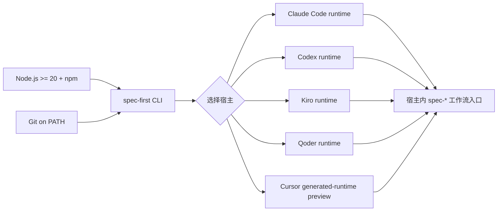
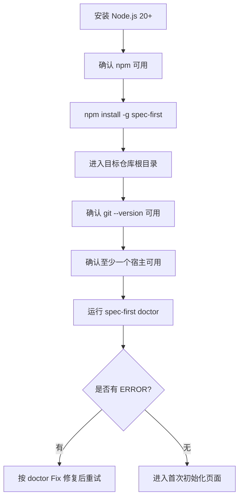

你当前位于 Get Started 路径中的 **「安装前置条件与宿主选择」** 页面，前一页是 [Quick Start](2-quick-start)，后一页是 [首次初始化：为 Claude Code、Codex、Kiro、Qoder 与 Cursor 生成运行时](4-shou-ci-chu-shi-hua-wei-claude-code-codex-kiro-qoder-yu-cursor-sheng-cheng-yun-xing-shi)。本页只解决两个问题：安装 `spec-first` 前你的机器需要准备什么，以及第一次应该选择哪个宿主来承载 `spec-*` 工作流入口。Sources: [package.json](package.json#L2-L14), [README.zh-CN.md](README.zh-CN.md#L36-L45), [src/cli/index.js](src/cli/index.js#L158-L181)

## 架构假设：spec-first 是 CLI 安装包，宿主是运行时承载面

从第一性原理看，`spec-first` 本身先作为 npm CLI 安装到本机，再通过 `spec-first init` 把同一套源资产投递到 Claude Code、Codex、Kiro、Qoder 或 Cursor 的项目级运行时目录中；因此，安装前置条件分成三层：Node/npm 负责运行 CLI，Git 负责让工具读取仓库事实，宿主 CLI 或宿主应用负责加载生成后的工作流入口。Sources: [package.json](package.json#L2-L14), [README.zh-CN.md](README.zh-CN.md#L40-L45), [src/cli/commands/doctor.js](src/cli/commands/doctor.js#L106-L146)



上图的关键点是：终端里的 `spec-first` 命令只负责安装、检查、初始化、更新与清理；真正的 `spec-brainstorm`、`spec-plan`、`spec-work` 等工作流入口，需要在宿主加载运行时后从宿主会话中使用，而不是把它们当作 shell 命令直接运行。Sources: [README.zh-CN.md](README.zh-CN.md#L90-L101), [src/cli/index.js](src/cli/index.js#L165-L175)

## 必备前置条件

安装前请先确认本机有 **Node.js 20 或更新版本**。`package.json` 在 `engines` 中声明 `node >=20.0.0`，CLI 入口也会在启动时调用 Node 版本检查；如果版本不足，会输出“spec-first requires Node.js >=20.0.0”并停止执行。Sources: [package.json](package.json#L112-L114), [bin/spec-first.js](bin/spec-first.js#L1-L10), [src/cli/node-version.js](src/cli/node-version.js#L3-L20)

第二个必备项是 **npm**，因为推荐安装方式是 `npm install -g spec-first`，安装完成后第一个验证命令是 `spec-first doctor`。发布包把 `spec-first` 暴露为 bin 入口 `bin/spec-first.js`，所以全局安装后终端才能解析 `spec-first` 命令。Sources: [README.zh-CN.md](README.zh-CN.md#L47-L68), [docs/05-用户手册/01-快速开始.md](docs/05-用户手册/01-快速开始.md#L7-L13), [package.json](package.json#L6-L8)

第三个必备项是 **Git 已安装并在 PATH 中**。`doctor` 会执行 `git --version` 检查 Git 是否可用；如果 Git 缺失，会提示安装 Git 并确保它在 PATH 中，因为 setup 和 workflow 检查需要读取仓库事实。Sources: [README.zh-CN.md](README.zh-CN.md#L40-L45), [src/cli/commands/doctor.js](src/cli/commands/doctor.js#L121-L146)

第四个条件是你要站在 **目标项目仓库根目录** 执行检查和后续初始化。README 明确要求 terminal 位于想启用 `spec-first` 的项目仓库根目录；首次试用者可以先在 throwaway/test repo 里体验，再初始化真实项目。Sources: [README.zh-CN.md](README.zh-CN.md#L40-L45)

| 检查项 | 最低要求 | 如何验证 | 不满足时会怎样 |
|---|---:|---|---|
| Node.js | `>=20.0.0` | `node -v` 或 `spec-first doctor` | CLI 启动时停止，提示安装 Node.js 20+ |
| npm | 可执行 `npm install -g` | `npm -v` | 无法用推荐方式安装 CLI |
| Git | `git` 在 PATH 中 | `git --version` 或 `spec-first doctor` | `doctor` 报 ERROR，并提示安装 Git 或修复 PATH |
| 项目目录 | 当前终端在目标仓库根目录 | `pwd` / `git rev-parse --show-toplevel` | 后续 runtime 会写到错误项目或无法读取仓库事实 |
Sources: [src/cli/node-version.js](src/cli/node-version.js#L10-L20), [src/cli/commands/doctor.js](src/cli/commands/doctor.js#L106-L146), [README.zh-CN.md](README.zh-CN.md#L40-L45)

## 推荐安装方式

推荐从 npm 全局安装：`npm install -g spec-first`。安装后立刻运行 `spec-first doctor`，它会检查 Node.js、Git、插件清单、开发者信息以及已检测宿主的运行时资产状态；如果当前项目还没有初始化任何宿主，`doctor` 会提示运行 `spec-first init` 并选择 Claude Code、Codex、Cursor、Kiro 或 Qoder。Sources: [docs/05-用户手册/01-快速开始.md](docs/05-用户手册/01-快速开始.md#L7-L13), [src/cli/commands/doctor.js](src/cli/commands/doctor.js#L42-L68), [src/cli/commands/doctor.js](src/cli/commands/doctor.js#L434-L440)

```bash
npm install -g spec-first
spec-first doctor
```

如果你在 macOS 或 Linux 的 shell 里曾经缓存过旧命令路径，可以在安装后执行 `hash -r`；Windows PowerShell 或 `cmd.exe` 没有 `hash -r`，新开一个终端窗口即可清掉命令缓存，也可以用 `Get-Command spec-first` 确认命令解析路径。Sources: [docs/05-用户手册/01-快速开始.md](docs/05-用户手册/01-快速开始.md#L24-L30)

Windows 上推荐使用 Windows Terminal + PowerShell 7+ 或原生 `cmd.exe` 做安装和 smoke check；Windows PowerShell 5.1 也支持，但文档明确指出 PowerShell 7+ 的 UTF-8 行为更稳定。Sources: [README.zh-CN.md](README.zh-CN.md#L56-L72)

## 安装后项目里大致会出现什么

本页不展开初始化步骤，但你需要先理解宿主选择会影响文件落点：Claude Code 使用 `.claude/`，Codex 组合使用 `.agents/skills` 与 `.codex/`，Kiro 使用 `.kiro/`，Qoder 使用 `.qoder/`，Cursor 使用 `.cursor/`。这些目录是运行时承载面，不是五套不同的产品逻辑。Sources: [src/cli/adapters/claude.js](src/cli/adapters/claude.js#L48-L82), [src/cli/adapters/codex.js](src/cli/adapters/codex.js#L41-L75), [src/cli/adapters/kiro.js](src/cli/adapters/kiro.js#L37-L70), [src/cli/adapters/qoder.js](src/cli/adapters/qoder.js#L39-L72), [src/cli/adapters/cursor.js](src/cli/adapters/cursor.js#L63-L100)

```text
your-project/
├── .claude/          # Claude Code runtime（选择 Claude 时）
├── .agents/skills/   # Codex workflow skills（选择 Codex 时）
├── .codex/           # Codex state / agents / hooks（选择 Codex 时）
├── .kiro/            # Kiro runtime（选择 Kiro 时）
├── .qoder/           # Qoder runtime（选择 Qoder 时）
├── .cursor/          # Cursor generated-runtime preview（选择 Cursor 时）
└── .spec-first/      # spec-first 项目级配置或执行产物边界，按具体工作流使用
```

`doctor` 对不同宿主会检查不同的运行时面：例如 Claude 会检查 commands、skills、agents 与 state；Codex 没有 commands 面，入口从 `.agents/skills` 发现；Cursor 当前不投递 agents，并且会报告 generated-runtime preview 警告。Sources: [src/cli/adapters/claude.js](src/cli/adapters/claude.js#L115-L130), [src/cli/adapters/codex.js](src/cli/adapters/codex.js#L49-L75), [src/cli/adapters/cursor.js](src/cli/adapters/cursor.js#L71-L130), [src/cli/adapters/cursor.js](src/cli/adapters/cursor.js#L139-L144)

## 宿主选择原则

如果你是第一次使用，优先选择你已经在当前项目里最常使用的宿主。`spec-first` 明确面向 Claude Code、Codex、Kiro、Qoder 与 Cursor；同一套公开 workflow 入口统一写作 `spec-*`，各宿主主要差异在 runtime delivery，也就是生成文件放在哪里、宿主如何发现这些入口。Sources: [README.zh-CN.md](README.zh-CN.md#L16-L18), [docs/05-用户手册/01-快速开始.md](docs/05-用户手册/01-快速开始.md#L1-L4), [src/cli/adapters/index.js](src/cli/adapters/index.js#L1-L18)

| 宿主 | 适合先选的情况 | 运行时入口位置 | 初学者注意点 |
|---|---|---|---|
| Claude Code | 你已经主要用 Claude Code 做项目内 AI coding | `.claude/commands/spec-*.md`、`.claude/skills`、`.claude/spec-first/workflows`、`.claude/agents` | 有 commands、skills、agents 与 hooks，运行时面最完整 |
| Codex | 你主要用 Codex，并希望 workflow skills 从项目级技能目录发现 | `.agents/skills`、`.codex/agents`、`.codex/spec-first` | `.codex/commands/spec/` 是遗留兼容清理目标，不是当前用户可见入口 |
| Kiro | 你在 Kiro 中工作，希望使用同名 `spec-*` workflow runtime | `.kiro/skills`、`.kiro/agents`、`.kiro/spec-first` | Kiro P0 使用 generated `spec-*` skill runtime，不使用 generated command files |
| Qoder | 你在 Qoder 中工作，并希望同时生成 command、skills、agents | `.qoder/commands`、`.qoder/skills`、`.qoder/agents`、`.qoder/spec-first` | Qoder 会生成 `spec-*.md` command 文件与技能/agent runtime |
| Cursor | 你想试用 Cursor generated-runtime preview | `.cursor/skills`、`.cursor/spec-first` | 当前会出现 preview 警告：skill discovery/invocation 尚未在本机验证 |
Sources: [src/cli/adapters/claude.js](src/cli/adapters/claude.js#L48-L82), [src/cli/adapters/codex.js](src/cli/adapters/codex.js#L27-L35), [src/cli/adapters/kiro.js](src/cli/adapters/kiro.js#L37-L70), [src/cli/adapters/qoder.js](src/cli/adapters/qoder.js#L39-L72), [src/cli/adapters/cursor.js](src/cli/adapters/cursor.js#L118-L144)

## `-y` 默认宿主与显式选择

交互式 `spec-first init` 会让你选择宿主；如果使用非交互 `-y/--yes`，当前默认宿主是 Claude Code 和 Codex，因为它们在初始化选项中标记为 `defaultForYes: true`，而 Cursor、Kiro、Qoder 的 `defaultForYes` 为 `false`。这意味着初学者如果想用 Cursor、Kiro 或 Qoder，不应只执行 `spec-first init -y`，而应显式加上对应 flag。Sources: [src/cli/commands/init.js](src/cli/commands/init.js#L77-L113), [src/cli/commands/init.js](src/cli/commands/init.js#L147-L150)

| 你的目标 | 推荐命令形态 | 原因 |
|---|---|---|
| 跟随交互引导选择 | `spec-first init` | 会进入宿主多选、身份和语言确认 |
| 非交互安装 Claude + Codex 默认面 | `spec-first init -y` | `-y` 默认宿主包含 Claude 与 Codex |
| 非交互安装 Cursor | `spec-first init --cursor -y` | Cursor 不是 `-y` 默认宿主 |
| 非交互安装 Kiro | `spec-first init --kiro -y` | Kiro 不是 `-y` 默认宿主 |
| 非交互安装 Qoder | `spec-first init --qoder -y` | Qoder 不是 `-y` 默认宿主 |
Sources: [src/cli/commands/init.js](src/cli/commands/init.js#L77-L113), [src/cli/commands/init.js](src/cli/commands/init.js#L132-L143)

## 用 doctor 判断宿主是否可用

`spec-first doctor` 是安装后的第一检查命令；你也可以用 `spec-first doctor --claude`、`--codex`、`--cursor`、`--kiro` 或 `--qoder` 只检查某个宿主。`doctor` 会先构造通用检查，再按平台检查宿主 CLI、运行时文件、commands、skills、agents 与 state。Sources: [docs/05-用户手册/01-快速开始.md](docs/05-用户手册/01-快速开始.md#L42-L58), [src/cli/commands/doctor.js](src/cli/commands/doctor.js#L28-L40), [src/cli/commands/doctor.js](src/cli/commands/doctor.js#L443-L487)

```bash
spec-first doctor
spec-first doctor --claude
spec-first doctor --codex
spec-first doctor --cursor
spec-first doctor --kiro
spec-first doctor --qoder
```

宿主 CLI 的检查命令也不同：Claude Code 检查 `claude --version`，Codex 检查 `codex --version`，Cursor 检查 `agent --version`，Kiro 检查 `kiro --version`，Qoder 检查 `qodercli --version`；如果对应命令不在 PATH 上，`doctor` 会给出 WARNING 并提示安装宿主 CLI 后重启 shell。Sources: [src/cli/commands/doctor.js](src/cli/commands/doctor.js#L148-L199)

## 初学者选择建议

如果你已经有固定宿主，就选那个宿主；如果你还没有偏好，并希望最少踩坑，先从 Claude Code 或 Codex 开始，因为它们是 `-y` 默认宿主，并且 README 的快速开始路径首先围绕安装、`doctor`、`init`、重启宿主和运行第一个 workflow 展开。Sources: [src/cli/commands/init.js](src/cli/commands/init.js#L77-L113), [README.zh-CN.md](README.zh-CN.md#L47-L101)

如果你选择 Cursor，请把它视为 generated-runtime preview，而不是已完全验证的宿主加载体验；源码中的 Cursor runtime 检查会固定加入 WARNING，说明 “Cursor skill discovery/invocation is not verified on this machine; generated skills may not load”。Sources: [src/cli/adapters/cursor.js](src/cli/adapters/cursor.js#L133-L144)

如果你选择 Kiro，需理解当前路径使用 `.kiro/skills` 承载 `spec-*` workflow runtime，而不是生成 command files；如果检查到 `.kiro/commands/spec`，doctor 会把它视为非预期 command runtime 目录并建议重新初始化刷新。Sources: [src/cli/adapters/kiro.js](src/cli/adapters/kiro.js#L45-L59), [src/cli/adapters/kiro.js](src/cli/adapters/kiro.js#L122-L149)

如果你选择 Qoder，它同时有 command、skills、agents 与 state 面；Qoder adapter 会将 workflow command 文件命名为 `spec-<name>.md`，并把 skills 与 workflows 放在 `.qoder/skills`。Sources: [src/cli/adapters/qoder.js](src/cli/adapters/qoder.js#L47-L68), [src/cli/adapters/qoder.js](src/cli/adapters/qoder.js#L75-L112)

## 安装前自检清单

在继续到初始化页面前，请完成这四项自检：Node.js 是 20 或更新版本；`npm install -g spec-first` 已成功；`git --version` 可用；至少一个目标宿主已安装或你知道要选择哪个宿主。完成后运行 `spec-first doctor`，如果没有阻断性 ERROR，就可以进入下一页执行初始化。Sources: [src/cli/node-version.js](src/cli/node-version.js#L15-L20), [README.zh-CN.md](README.zh-CN.md#L47-L72), [src/cli/commands/doctor.js](src/cli/commands/doctor.js#L106-L199)



## 下一步阅读

建议按目录顺序继续阅读 [首次初始化：为 Claude Code、Codex、Kiro、Qoder 与 Cursor 生成运行时](4-shou-ci-chu-shi-hua-wei-claude-code-codex-kiro-qoder-yu-cursor-sheng-cheng-yun-xing-shi)，在那里再执行 `spec-first init` 并选择宿主；初始化后再读 [运行第一个需求工作流并检查仓库产物](5-yun-xing-di-ge-xu-qiu-gong-zuo-liu-bing-jian-cha-cang-ku-chan-wu)，最后用 [CLI 命令速查：doctor、init、update、clean、tasks 与 session](6-cli-ming-ling-su-cha-doctor-init-update-clean-tasks-yu-session) 补齐日常命令记忆。Sources: [README.zh-CN.md](README.zh-CN.md#L74-L88), [README.zh-CN.md](README.zh-CN.md#L90-L123), [src/cli/index.js](src/cli/index.js#L165-L175)