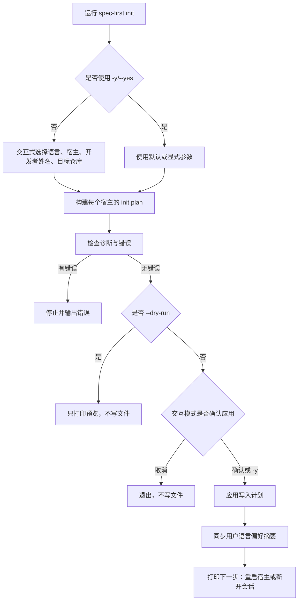
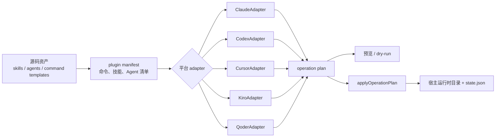

你当前位于 Get Started 路径中的「首次初始化：为 Claude Code、Codex、Kiro、Qoder 与 Cursor 生成运行时」。这一页只解释 `spec-first init` 第一次做什么、如何选择宿主、会生成哪些运行时目录、怎样预览写入，以及初始化完成后要做什么；安装前置条件请回看[安装前置条件与宿主选择](3-an-zhuang-qian-zhi-tiao-jian-yu-su-zhu-xuan-ze)，第一个业务需求工作流请继续阅读[运行第一个需求工作流并检查仓库产物](5-yun-xing-di-ge-xu-qiu-gong-zuo-liu-bing-jian-cha-cang-ku-chan-wu)。Sources: [index.js](src/cli/index.js#L158-L174), [init.js](src/cli/commands/init.js#L2209-L2255)

## 初始化解决什么问题

`spec-first init` 的核心目标，是把仓库里的通用源码资产转换成各个 AI 编码宿主能识别的本地运行时资产。CLI 顶层帮助把 `init` 描述为安装 workflows、skills、agents 和 developer profile；它支持 Claude Code、Codex、Cursor、Kiro、Qoder 五类宿主，并且初始化后由宿主加载生成的 workflow entrypoints。Sources: [index.js](src/cli/index.js#L160-L174), [init.js](src/cli/commands/init.js#L2213-L2225)

初始化不是“运行需求工作流”，也不是“配置所有 MCP/helper”。它只负责生成或刷新宿主运行时入口、技能、Agent、状态文件、指令文件和必要的 hook；初始化完成后的下一步，CLI 明确提示要重启宿主或新开会话，让宿主加载刚生成的 `spec-* workflow entrypoints`，需要更完整 readiness 时再运行 `spec-mcp-setup`。Sources: [init.js](src/cli/commands/init.js#L2165-L2184), [init.js](src/cli/commands/init.js#L2186-L2207)

## 一眼看懂初始化流程

下面的图把第一次初始化压缩成一个从“选择宿主”到“写入运行时”的流程。对新手来说，关键是先选宿主，再确认开发者身份和语言，然后在预览阶段确认将要写入或重置的内容，最后才真正落盘。Sources: [init.js](src/cli/commands/init.js#L126-L145), [init.js](src/cli/commands/init.js#L178-L231), [init.js](src/cli/commands/init.js#L233-L266)



Sources: [init.js](src/cli/commands/init.js#L200-L231), [init.js](src/cli/commands/init.js#L233-L266), [init.js](src/cli/commands/init.js#L903-L918)

## 推荐的新手命令

如果你在自己的项目仓库里第一次使用，最简单的方式是运行交互式初始化，让 CLI 问你要初始化哪些宿主；交互式模式要求终端可交互，否则会提示你改用 `-y/--yes`。Sources: [init.js](src/cli/commands/init.js#L138-L145), [init.js](src/cli/commands/init.js#L2216-L2223)

```bash
spec-first init
```

Sources: [init.js](src/cli/commands/init.js#L2216-L2223)

如果你希望跳过提问，可以使用非交互模式。注意：`-y` 默认只初始化 Claude Code 和 Codex；Cursor、Kiro、Qoder 需要显式加对应 flag。新机器如果没有全局 developer profile 或 git `user.name`，非交互模式必须传 `-u <name>`。Sources: [init.js](src/cli/commands/init.js#L580-L584), [init.js](src/cli/commands/init.js#L778-L806), [init.js](src/cli/commands/init.js#L2222-L2245)

```bash
spec-first init -y -u "你的名字" --lang zh
spec-first init --claude --codex --cursor --kiro --qoder -y -u "你的名字" --lang zh
```

Sources: [init.js](src/cli/commands/init.js#L276-L389), [init.js](src/cli/commands/init.js#L2213-L2225)

在真正写文件前，你可以加 `--dry-run` 只看预览。代码路径中，`--dry-run` 会打印初始化预览并直接返回，不会进入应用写入计划的步骤。Sources: [init.js](src/cli/commands/init.js#L218-L220), [init.js](src/cli/commands/init.js#L311-L313), [init.js](src/cli/commands/init.js#L2242-L2247)

```bash
spec-first init --claude --dry-run
```

Sources: [init.js](src/cli/commands/init.js#L311-L313), [init.js](src/cli/commands/init.js#L855-L900)

## 宿主选择对比

五个宿主都通过同一个 adapter 注册表接入，CLI 通过宿主 id 找到对应 adapter；当前支持的 id 是 `claude`、`codex`、`cursor`、`kiro`、`qoder`。Sources: [adapters/index.js](src/cli/adapters/index.js#L1-L13), [adapters/index.js](src/cli/adapters/index.js#L15-L35)

| 宿主 | 初始化 flag | 默认 `-y` 是否包含 | 主要运行时根目录 | workflow/skill 入口位置 | Agent 支持 | 备注 |
|---|---:|---:|---|---|---:|---|
| Claude Code | `--claude` | 是 | `.claude` | `.claude/commands` 与 `.claude/spec-first/workflows` | 是 | 会安装 Claude 管理 hook，并使用 `CLAUDE.md` 作为指令文件 |
| Codex | `--codex` | 是 | `.codex` | `.agents/skills` | 是 | 不安装 command entrypoints，依赖 skill discovery |
| Cursor | `--cursor` | 否 | `.cursor` | `.cursor/skills` | 否 | generated-runtime preview，代码会提示本机未验证 skill discovery/invocation |
| Kiro | `--kiro` | 否 | `.kiro` | `.kiro/skills` | 是 | 使用 `AGENTS.md`，不安装 command entrypoints |
| Qoder | `--qoder` | 否 | `.qoder` | `.qoder/commands` 与 `.qoder/skills` | 是 | 生成 `spec-*.md` command 文件，并支持技能与 Agent |

Sources: [init.js](src/cli/commands/init.js#L77-L113), [claude.js](src/cli/adapters/claude.js#L44-L82), [codex.js](src/cli/adapters/codex.js#L36-L75), [cursor.js](src/cli/adapters/cursor.js#L58-L101), [kiro.js](src/cli/adapters/kiro.js#L32-L70), [qoder.js](src/cli/adapters/qoder.js#L34-L72)

## 初始化会写出哪些目录

初始化时，源资产来自包内的 `templates/claude/commands/spec`、`skills` 和 `agents`，再经过各宿主 adapter 转换为目标宿主能读取的目录结构；manifest 会从源码目录和治理文件中构建命令、技能、Agent 列表。Sources: [plugin.js](src/cli/plugin.js#L25-L31), [plugin.js](src/cli/plugin.js#L113-L149)

```text
你的项目/
├── .claude/                 # Claude Code runtime（选择 --claude 时）
│   ├── commands/
│   ├── skills/
│   ├── agents/
│   ├── hooks/
│   └── spec-first/state.json
├── .codex/                  # Codex runtime（选择 --codex 时）
│   ├── hooks/
│   ├── agents/
│   └── spec-first/state.json
├── .agents/skills/          # Codex 的 workflow/skill discovery 入口
├── .cursor/                 # Cursor preview runtime（选择 --cursor 时）
│   ├── skills/
│   └── spec-first/state.json
├── .kiro/                   # Kiro runtime（选择 --kiro 时）
│   ├── skills/
│   ├── agents/
│   └── spec-first/state.json
├── .qoder/                  # Qoder runtime（选择 --qoder 时）
│   ├── commands/
│   ├── skills/
│   ├── agents/
│   └── spec-first/state.json
├── CLAUDE.md                # Claude Code 指令文件
└── AGENTS.md                # Codex / Cursor / Kiro / Qoder 指令文件
```

Sources: [claude.js](src/cli/adapters/claude.js#L48-L82), [codex.js](src/cli/adapters/codex.js#L41-L75), [cursor.js](src/cli/adapters/cursor.js#L63-L101), [kiro.js](src/cli/adapters/kiro.js#L37-L70), [qoder.js](src/cli/adapters/qoder.js#L39-L72)

这些目录里最重要的是宿主可见入口和 `state.json`。`state.json` 记录 manifest 版本、platform、commands、skills、workflowSkills、agents、agentSupportFiles；后续重新初始化、清理或漂移检测会使用这些托管状态来判断哪些资产由 spec-first 管理。Sources: [state.js](src/cli/state.js#L62-L91), [state.js](src/cli/state.js#L99-L124), [state.js](src/cli/state.js#L127-L157)

## 初始化背后的架构

从第一性原理看，`init` 不是把同一批文件机械复制到五个目录，而是“源码资产 → manifest → adapter 转换 → operation plan → 原子写入”的生成式流程。每个 adapter 定义自己的 runtime root、skills root、agents root、state file 和内容转换规则；统一的 init plan 负责把这些宿主差异收敛成可预览、可应用的写入计划。Sources: [base.js](src/cli/adapters/base.js#L1-L18), [base.js](src/cli/adapters/base.js#L20-L84), [base.js](src/cli/adapters/base.js#L95-L166), [init.js](src/cli/commands/init.js#L974-L1018)



Sources: [plugin.js](src/cli/plugin.js#L107-L149), [adapters/index.js](src/cli/adapters/index.js#L1-L13), [init.js](src/cli/commands/init.js#L1084-L1119), [init.js](src/cli/commands/init.js#L1214-L1256)

## 交互式初始化会问什么

交互式初始化会先解析参数并确认终端可交互，然后收集语言、宿主、开发者姓名、用户语言同步偏好和目标仓库。代码会读取全局 developer profile；如果全局 profile 已存在且用户没有显式覆盖，交互流程会询问是否沿用已有姓名和语言。Sources: [init.js](src/cli/commands/init.js#L126-L145), [init.js](src/cli/commands/init.js#L400-L429), [init.js](src/cli/commands/init.js#L456-L492)

| 交互项 | 用途 | 可用的非交互替代 |
|---|---|---|
| 语言 | 决定初始化提示与 developer profile 的 `lang` | `--lang zh` 或 `--lang en` |
| 宿主 | 选择要生成哪些运行时 | `--claude`、`--codex`、`--cursor`、`--kiro`、`--qoder` |
| 开发者姓名 | 写入全局 developer profile，并用于后续作者身份推断 | `-u <name>` 或 `--user=<name>` |
| 用户语言同步偏好 | 可选择是否同步用户级语言指令 | `--sync-user-language` 或 `--no-sync-user-language` |
| 目标仓库 | 决定只初始化当前仓库、某个子仓库，还是高级模式下所有子仓库 | `--repo <path>` 或 `--all-repos` |

Sources: [init.js](src/cli/commands/init.js#L276-L389), [init.js](src/cli/commands/init.js#L487-L523), [init.js](src/cli/commands/init.js#L526-L558)

## 非交互初始化的规则

非交互模式适合 CI、脚本或你已经知道要初始化哪个宿主的场景。`-y/--yes` 会跳过交互提问；如果没有显式宿主 flag，就使用默认宿主集合，而默认集合只包含 Claude Code 和 Codex。Sources: [init.js](src/cli/commands/init.js#L307-L310), [init.js](src/cli/commands/init.js#L436-L448), [init.js](src/cli/commands/init.js#L580-L584)

非交互模式最容易踩的坑是 developer name。代码会从显式 `-u/--user`、全局 developer profile、git `user.name` 中解析姓名；如果三者都没有，`spec-first init -y` 无法提问，就会返回明确错误并给出带 `-u <name>` 的示例。Sources: [developer.js](src/cli/developer.js#L51-L86), [init.js](src/cli/commands/init.js#L778-L806)

## 预览、写入与回滚保护

初始化会先构建计划，再打印诊断并收集错误；如果有错误，流程会停止。没有错误时，`--dry-run` 只打印预览；交互模式会在预览后要求确认，确认后才应用计划。Sources: [init.js](src/cli/commands/init.js#L200-L231), [init.js](src/cli/commands/init.js#L2100-L2139)

真正写入时，`applyInitPlan` 会分发到单仓库或 all-repos 的应用逻辑；单仓库计划会先应用预同步清理，再应用写入计划。如果检测到 legacy state 或当前 runtime drift，初始化会执行托管硬重置，并在写入前创建 runtime rollback backup，失败时恢复备份。Sources: [init.js](src/cli/commands/init.js#L1008-L1018), [init.js](src/cli/commands/init.js#L1175-L1206), [init.js](src/cli/commands/init.js#L1259-L1287), [init.js](src/cli/commands/init.js#L2459-L2519)

## 常见情况与处理方式

| 现象 | 原因 | 处理方式 |
|---|---|---|
| `spec-first init` 在 CI 或非 TTY 中失败 | 未使用 `-y/--yes`，而 init 需要交互终端 | 改用 `spec-first init -y -u <name> --lang zh`，并显式传宿主 flag |
| `-y` 没有生成 Cursor/Kiro/Qoder | 默认非交互宿主只有 Claude Code 和 Codex | 加 `--cursor`、`--kiro` 或 `--qoder` |
| `-y` 提示无法确定 developer name | 没有 `-u`，也没有可用全局 profile 或 git `user.name` | 加 `-u <name>` |
| Cursor 初始化后出现 preview 警告 | Cursor 当前是 generated-runtime preview，本机未验证 discovery/invocation | 重启 Cursor 后自行验证生成技能是否加载，再继续使用 |
| Claude 初始化前报 `.claude/settings.json` 无效 | Claude settings JSON 读取失败 | 修复 `.claude/settings.json` 为合法 JSON 后重跑 init |
| 想先确认会写哪些文件 | 不想立即落盘 | 使用 `--dry-run` |

Sources: [init.js](src/cli/commands/init.js#L138-L145), [init.js](src/cli/commands/init.js#L580-L584), [init.js](src/cli/commands/init.js#L778-L806), [init.js](src/cli/commands/init.js#L1056-L1062), [init.js](src/cli/commands/init.js#L1151-L1173), [init.js](src/cli/commands/init.js#L218-L220)

## 多仓库工作区只做最小理解

如果你在父工作区里有多个子 Git 仓库，初始化命令支持 `--repo <path>` 指定一个子仓库，也支持高级模式 `--all-repos` 初始化所有子仓库。帮助文本明确说明：默认只初始化父工作区 runtime；子仓库 truth 留在各自仓库中，只有当子仓库本身是独立 agent root 时，才使用 `--repo` 或 `--all-repos`。Sources: [init.js](src/cli/commands/init.js#L2235-L2240), [init.js](src/cli/commands/init.js#L1446-L1603)

all-repos 模式会为父工作区刷新宿主 runtime，并为每个子仓库生成结果摘要；摘要写入 `.spec-first/workspace/init-summary.json` 和按平台区分的 summary 文件。多仓库实践细节不在本页展开，后续请阅读[多仓库与父工作区初始化实践](10-duo-cang-ku-yu-fu-gong-zuo-qu-chu-shi-hua-shi-jian)。Sources: [init.js](src/cli/commands/init.js#L1551-L1587), [init.js](src/cli/commands/init.js#L1884-L1933)

## 初始化完成后做什么

初始化成功后，CLI 会提示你重启对应宿主或新开会话，让宿主加载生成的入口。单宿主时提示会写明宿主名；多宿主时会提示分别重启 Claude Code、Codex、Cursor、Kiro、Qoder 中你已选择的宿主。Sources: [init.js](src/cli/commands/init.js#L2165-L2184), [init.js](src/cli/commands/init.js#L2186-L2207)

建议的阅读顺序是：如果你还没确认前置条件，回到[安装前置条件与宿主选择](3-an-zhuang-qian-zhi-tiao-jian-yu-su-zhu-xuan-ze)；如果已经完成初始化，继续到[运行第一个需求工作流并检查仓库产物](5-yun-xing-di-ge-xu-qiu-gong-zuo-liu-bing-jian-cha-cang-ku-chan-wu)；如果你想查命令参数，再看[CLI 命令速查：doctor、init、update、clean、tasks 与 session](6-cli-ming-ling-su-cha-doctor-init-update-clean-tasks-yu-session)。Sources: [init.js](src/cli/commands/init.js#L2249-L2255), [index.js](src/cli/index.js#L165-L174)