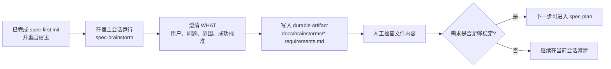

你当前位于 Get Started 路径中的 **[运行第一个需求工作流并检查仓库产物](5-yun-xing-di-ge-xu-qiu-gong-zuo-liu-bing-jian-cha-cang-ku-chan-wu)**。本页只解决一个问题：初始化完成并重启宿主后，怎样在 Claude Code、Codex、Kiro、Qoder 或 Cursor 会话中运行第一个需求工作流，并确认它真的把可复查的产物写进了仓库。Sources: [README.zh-CN.md](README.zh-CN.md#L90-L111), [docs/05-用户手册/09-首次工作流走查.md](docs/05-用户手册/09-首次工作流走查.md#L68-L90)

## 架构假设：第一次成功不是“AI 回答得不错”，而是“仓库里留下了可检查证据”

从第一性原理看，`spec-first` 的入门闭环不是让你记住所有 workflow，而是让一次需求讨论变成仓库内的 durable artifact。README 明确把最小成功信号定义为：安装和 init 后，在宿主里运行一个 workflow，然后检查它写入仓库的 Markdown artifact；第一次运行通常从 `spec-brainstorm` 开始，并在 `docs/brainstorms/` 下生成 requirements 文件。Sources: [README.zh-CN.md](README.zh-CN.md#L30-L34), [README.zh-CN.md](README.zh-CN.md#L94-L111)



上图表达的是“需求产物先于实现”的最小路径：`spec-brainstorm` 负责澄清 WHAT，`spec-plan` 才负责 HOW，`spec-work` 才进入执行；因此第一次不要急着改代码，而是先确认需求文件是否回答了用户、卡点、当前必须解决的需求、非目标、成功标准和后续 planning 边界。Sources: [skills/spec-brainstorm/SKILL.md](skills/spec-brainstorm/SKILL.md#L9-L37), [skills/spec-plan/SKILL.md](skills/spec-plan/SKILL.md#L14-L23), [docs/05-用户手册/09-首次工作流走查.md](docs/05-用户手册/09-首次工作流走查.md#L82-L90)

## 运行前确认：你应当已经完成初始化和宿主重启

本页默认你已经完成 `spec-first init`，选择了实际使用的宿主，并重启宿主或打开了新会话；后续 `spec-*` 入口是在 Claude Code、Codex、Kiro、Qoder 或 Cursor 会话里运行，不是直接在终端 shell 里执行。Sources: [README.zh-CN.md](README.zh-CN.md#L74-L92), [docs/05-用户手册/09-首次工作流走查.md](docs/05-用户手册/09-首次工作流走查.md#L36-L45)

如果宿主提示缺少 helper、MCP readiness facts 或 runtime 环境未准备好，应先在当前宿主会话运行 `spec-mcp-setup`；它负责安装并验证 required harness runtime、MCP servers 和 helper tools，输出确定性环境事实，但不替代后续需求判断。Sources: [README.zh-CN.md](README.zh-CN.md#L82-L88), [docs/05-用户手册/09-首次工作流走查.md](docs/05-用户手册/09-首次工作流走查.md#L46-L60)

## 第一步：在宿主会话里启动 brainstorm

在你选择的宿主会话中输入下面的入口，把引号里的内容替换成你真实想做的第一个小需求；官方走查示例使用的是 `Improve onboarding for first-time CLI users`。Sources: [README.zh-CN.md](README.zh-CN.md#L94-L101), [docs/05-用户手册/09-首次工作流走查.md](docs/05-用户手册/09-首次工作流走查.md#L68-L80)

```text
spec-brainstorm "Improve onboarding for first-time CLI users"
```

`spec-brainstorm` 适合“已经有一个选定问题或功能方向，但行为、范围、用户、成功标准或交接上下文还不清楚”的场景；它不适合已经明确 HOW 的实现计划、执行、调试或评审任务。Sources: [skills/spec-brainstorm/SKILL.md](skills/spec-brainstorm/SKILL.md#L15-L29), [skills/using-spec-first/SKILL.md](skills/using-spec-first/SKILL.md#L160-L166)

## 第二步：配合澄清，而不是催促它直接实现

第一次需求工作流的目标是把 WHAT 说清楚，而不是马上写代码。走查文档明确要求：如果用户是谁、卡在哪里、当前必须解决什么、哪些内容不在本轮范围内、成功标准是什么、后续 planning 边界是什么还不清楚，就应继续对话澄清，而不是急着进入实现。Sources: [docs/05-用户手册/09-首次工作流走查.md](docs/05-用户手册/09-首次工作流走查.md#L82-L90), [skills/spec-brainstorm/SKILL.md](skills/spec-brainstorm/SKILL.md#L33-L37)

| 你在会话中看到的状态 | 初学者应做什么 | 原因 |
| --- | --- | --- |
| AI 追问目标用户或成功标准 | 直接回答，不要切到实现 | brainstorm 的职责是澄清 WHAT |
| AI 询问范围或非目标 | 明确本轮做什么、不做什么 | 避免 plan 阶段替你发明需求 |
| AI 已生成 requirements 文件路径 | 复制路径，准备检查仓库文件 | 第一次成功信号是 artifact 可检查 |
| AI 建议进入 plan | 先检查 requirements 内容，再决定是否继续 | plan 是 HOW，不应替代需求澄清 |

这张表对应 `spec-brainstorm` 的 workflow contract：输入是 feature/problem 与上下文，输出是 requirements doc 或 brief alignment summary，后续消费者是 `spec-plan`、owners、reviewers、work/review flows。Sources: [skills/spec-brainstorm/SKILL.md](skills/spec-brainstorm/SKILL.md#L21-L37), [docs/05-用户手册/09-首次工作流走查.md](docs/05-用户手册/09-首次工作流走查.md#L92-L115)

## 第三步：检查 `docs/brainstorms/` 下的新文件

brainstorm 完成后，在仓库里查找类似下面的文件；README 给出的通用形状是 `docs/brainstorms/YYYY-MM-DD-NNN-<topic>-requirements.md`，走查示例给出的具体形状是 `docs/brainstorms/2026-05-01-001-cli-onboarding-requirements.md`。Sources: [README.zh-CN.md](README.zh-CN.md#L103-L111), [docs/05-用户手册/09-首次工作流走查.md](docs/05-用户手册/09-首次工作流走查.md#L76-L80)

```text
docs/brainstorms/YYYY-MM-DD-NNN-<topic>-requirements.md
```

你要检查的不是“文件是否很长”，而是它是否能作为下一步 planning 的上游输入：它应该保存问题框架、actors、flows、边界、非目标和验收样例，并被 `spec-plan`、文档评审、后续维护者用于复核 scope、acceptance examples、Change Delta、owner 决策和 evidence posture。Sources: [docs/05-用户手册/04-workflows-artifacts-map.md](docs/05-用户手册/04-workflows-artifacts-map.md#L25-L34), [docs/05-用户手册/04-workflows-artifacts-map.md](docs/05-用户手册/04-workflows-artifacts-map.md#L36-L50)

## 产物结构：第一次只需要认清这几个位置

第一次需求工作流通常只写入 `docs/brainstorms/` 下的一个 requirements 文件；随着链路继续，后续才会逐步出现 `docs/plans/`、`docs/tasks/`、代码变更、review findings 和 `docs/solutions/`。Sources: [README.zh-CN.md](README.zh-CN.md#L125-L142), [docs/05-用户手册/04-workflows-artifacts-map.md](docs/05-用户手册/04-workflows-artifacts-map.md#L25-L35)

```text
your-repo/
├── docs/
│   ├── brainstorms/
│   │   └── YYYY-MM-DD-NNN-<topic>-requirements.md   ← 第一次重点检查
│   ├── plans/                                      ← 后续 spec-plan
│   ├── tasks/                                      ← 后续 spec-write-tasks
│   └── solutions/                                  ← 后续 spec-compound
└── .spec-first/
    ├── config/                                     ← setup facts，本页通常不检查
    └── workflows/                                  ← workflow runtime evidence，默认不提交
```

`docs/brainstorms/`、`docs/plans/`、`docs/tasks/` 和 `docs/solutions/` 属于长期协作文档层；`.spec-first/config/`、`.spec-first/workflows/`、`.spec-first/workspace/` 等更多是 setup 或 workflow runtime artifacts，并且在 `.gitignore` 的 spec-first managed block 中默认忽略。Sources: [docs/05-用户手册/09-首次工作流走查.md](docs/05-用户手册/09-首次工作流走查.md#L181-L188), [.gitignore](.gitignore#L54-L99)

## 产物检查清单

下面的检查清单只覆盖第一次需求 workflow 的最小验收：确认文件存在、内容能承接 plan、边界没有混乱。更完整的产物目录、workflow 路由和多仓父工作区规则分别属于后续页面。Sources: [README.zh-CN.md](README.zh-CN.md#L103-L123), [docs/05-用户手册/04-workflows-artifacts-map.md](docs/05-用户手册/04-workflows-artifacts-map.md#L53-L64)

| 检查项 | 你应该看到什么 | 如果没看到 |
| --- | --- | --- |
| 文件位置 | `docs/brainstorms/*-requirements.md` | 回到宿主会话确认 brainstorm 是否完成 |
| 文件角色 | requirements brief，而不是实现代码 | 继续澄清 WHAT，不要直接进入 work |
| 范围边界 | 有当前必须做和明确不做的内容 | 让会话补充非目标和成功标准 |
| 后续交接 | 能被 `spec-plan` 接着使用 | 需求稳定后再进入 plan |
| Git 边界 | durable docs 可提交；runtime mirrors 不当 source truth | 不手改 generated runtime copies |

这些检查项来自两个事实：`spec-brainstorm` 的 artifact 是 `docs/brainstorms/`，它的 downstream consumers 包括 `spec-plan`、owners、reviewers、work/review flows；同时首次走查强调 generated runtime assets 不是 source truth，`skills/`、`agents/`、`templates/` 和 `src/cli/` 才是 spec-first 自身能力源码真相源。Sources: [skills/spec-brainstorm/SKILL.md](skills/spec-brainstorm/SKILL.md#L24-L37), [docs/05-用户手册/09-首次工作流走查.md](docs/05-用户手册/09-首次工作流走查.md#L181-L188)

## Before / After：你应当从“聊天记录”过渡到“仓库证据”

第一次运行前，你只有宿主会话里的自然语言想法；第一次运行后，你应该拥有一个可以被 review、plan 和后续维护者读取的 requirements artifact。Sources: [README.zh-CN.md](README.zh-CN.md#L30-L34), [docs/05-用户手册/04-workflows-artifacts-map.md](docs/05-用户手册/04-workflows-artifacts-map.md#L29-L34)

| 运行前 | 运行后 |
| --- | --- |
| `我想改善首次 CLI 用户的 onboarding` | `docs/brainstorms/2026-05-01-001-cli-onboarding-requirements.md` |
| 只有聊天上下文 | 仓库内 durable Markdown artifact |
| 下一步容易直接让 AI 写代码 | 下一步可以让 `spec-plan` 基于 requirements 定义 HOW |
| scope、非目标、成功标准可能散落在对话中 | scope、非目标、成功标准集中在 requirements brief 中 |

这就是 `spec-first` 入门阶段最重要的认知转换：不是把所有 workflow 串成强状态机，而是让每一步留下下一步能读取的高质量上下文。Sources: [docs/05-用户手册/09-首次工作流走查.md](docs/05-用户手册/09-首次工作流走查.md#L3-L10), [skills/using-spec-first/SKILL.md](skills/using-spec-first/SKILL.md#L131-L134)

## 常见问题排查

如果你在终端里输入 `spec-brainstorm` 后发现“命令不存在”，这通常是入口位置错了：README 和首次走查都说明 workflow 入口是在受支持宿主会话中运行，而不是 shell 命令。Sources: [README.zh-CN.md](README.zh-CN.md#L90-L101), [docs/05-用户手册/09-首次工作流走查.md](docs/05-用户手册/09-首次工作流走查.md#L36-L45)

| 现象 | 可能原因 | 处理方式 |
| --- | --- | --- |
| 终端提示找不到 `spec-brainstorm` | 把宿主 workflow 当成 shell 命令 | 回到 Claude Code、Codex、Kiro、Qoder 或 Cursor 会话运行 |
| 宿主看不到 `spec-*` 入口 | init 后未重启宿主或 runtime 未加载 | 重启宿主或新开会话 |
| 提示 helper / MCP facts 缺失 | runtime 环境未准备完整 | 在宿主会话先运行 `spec-mcp-setup` |
| 没有生成 brainstorm 文件 | workflow 未完成或需求仍在澄清 | 回到会话继续完成 brainstorm |
| 生成了 runtime 目录改动 | `.claude/`、`.codex/`、`.agents/skills/` 等是 generated runtime assets | 不手改 runtime copies；需要重建时用 `spec-first init` |

这些处理方式与官方边界一致：`mcp-setup` 只准备 required harness runtime 和 helper readiness；`.claude/`、`.codex/`、`.agents/skills/` 是 generated runtime assets，不是 source truth；长期协作文档层才是本页要检查的主要对象。Sources: [docs/05-用户手册/09-首次工作流走查.md](docs/05-用户手册/09-首次工作流走查.md#L46-L60), [docs/05-用户手册/09-首次工作流走查.md](docs/05-用户手册/09-首次工作流走查.md#L181-L188), [.gitignore](.gitignore#L54-L99)

## 什么时候进入下一步

当 requirements brief 已经足够稳定，可以在宿主会话中运行 `spec-plan`，让 plan 把 requirements 转成可评审、可执行的工程决策上下文；plan 的职责是说明目标、非目标、文件区域、依赖风险、验证方式和实现阶段要保留的决策，而不是提前执行代码改动。Sources: [docs/05-用户手册/09-首次工作流走查.md](docs/05-用户手册/09-首次工作流走查.md#L92-L115), [skills/spec-plan/SKILL.md](skills/spec-plan/SKILL.md#L20-L60)

```text
spec-plan
```

如果 plan 很小，后续可以直接进入 work；如果 plan 涉及多个模块、多个阶段或需要多人/多 agent 交接，可以先用 `spec-write-tasks` 派生 task pack；但这些已经超出本页范围，本页只要求你能跑完第一个需求 workflow 并检查 requirements artifact。Sources: [docs/05-用户手册/09-首次工作流走查.md](docs/05-用户手册/09-首次工作流走查.md#L116-L141), [README.zh-CN.md](README.zh-CN.md#L113-L123)

## 推荐阅读顺序

完成本页后，如果你想继续主链路，下一页建议读 [CLI 命令速查：doctor、init、update、clean、tasks 与 session](6-cli-ming-ling-su-cha-doctor-init-update-clean-tasks-yu-session)，用来区分终端 CLI 与宿主 workflow；然后读 [从想法到代码的主链路：Spec → Plan → Tasks → Code → Review → Knowledge](7-cong-xiang-fa-dao-dai-ma-de-zhu-lian-lu-spec-plan-tasks-code-review-knowledge)，理解 requirements 之后怎样进入 plan、tasks、work、review 和 knowledge。Sources: [README.zh-CN.md](README.zh-CN.md#L143-L160), [docs/05-用户手册/09-首次工作流走查.md](docs/05-用户手册/09-首次工作流走查.md#L92-L168)

如果你不确定下次应该从哪个入口开始，继续读 [工作流入口路由：什么时候使用 brainstorm、prd、debug、work 或 review](8-gong-zuo-liu-ru-kou-lu-you-shi-yao-shi-hou-shi-yong-brainstorm-prd-debug-work-huo-review)；如果你想系统理解每个文件夹该不该提交、该由谁读取，继续读 [产物目录导览：docs、.spec-first 与临时 handoff 的边界](9-chan-wu-mu-lu-dao-lan-docs-spec-first-yu-lin-shi-handoff-de-bian-jie)。Sources: [skills/using-spec-first/SKILL.md](skills/using-spec-first/SKILL.md#L146-L174), [docs/05-用户手册/04-workflows-artifacts-map.md](docs/05-用户手册/04-workflows-artifacts-map.md#L7-L35)