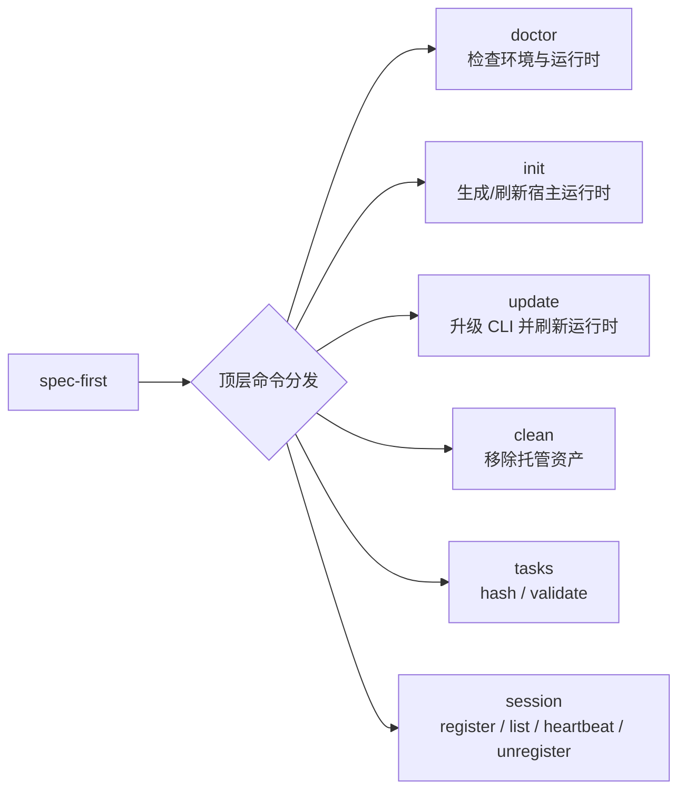
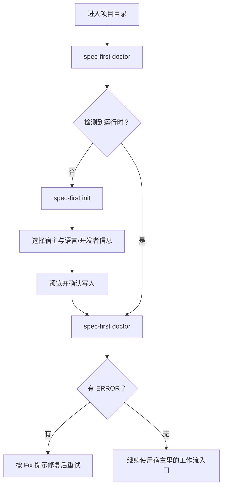

本页是 **spec-first CLI 的入门速查页**，只覆盖六个日常命令：`doctor`、`init`、`update`、`clean`、`tasks` 与 `session`。它适合你在“已经知道要用 CLI，但不确定该敲哪条命令”时快速查阅：先用 `doctor` 看环境与运行时是否正常，用 `init` 生成或刷新宿主运行时，用 `update` 升级 CLI 并刷新本地资产，用 `clean` 移除托管资产，用 `tasks` 校验任务包的确定性交接，用 `session` 做多会话协作提示。Sources: [index.js](src/cli/index.js#L44-L70), [index.js](src/cli/index.js#L158-L182)

## 架构假设与验证结论

从 CLI 分发代码看，`spec-first` 的顶层命令采用一个很直接的模式：`runCli()` 读取第一个参数作为命令名，然后把剩余参数交给对应模块；本页覆盖的六个命令分别由 `runDoctor`、`runInit`、`runUpdate`、`runClean`、`runTasks` 与 `runSession` 实现。这个结构意味着初学者可以把 CLI 理解成“一个入口 + 多个子命令模块”，不需要先理解完整工作流系统。Sources: [index.js](src/cli/index.js#L19-L80)



命令帮助文本也验证了这个心智模型：CLI 帮助页列出 `doctor`、`init`、`update`、`clean`、`tasks` 与 `session`，并明确说明宿主工作流入口是在 `spec-first init` 之后由宿主提供，而不是本页这些 CLI 命令直接执行完整需求工作流。Sources: [index.js](src/cli/index.js#L158-L178)

## 先看一张速查表

| 你想做什么 | 推荐命令 | 最常用写法 | 成功时你会看到什么 | 失败时先看什么 |
|---|---|---|---|---|
| 检查安装、宿主运行时、托管资产是否正常 | `doctor` | `spec-first doctor` | PASS / WARNING / ERROR 检查项 | 是否缺 Node、Git、宿主 CLI 或运行时资产 |
| 初始化 Claude、Codex、Cursor、Kiro、Qoder 运行时 | `init` | `spec-first init` 或 `spec-first init --claude -y` | 预览、确认、写入托管资产 | 是否缺交互式终端，或 `-y` 时缺默认宿主/用户信息 |
| 升级 CLI 并刷新当前项目运行时 | `update` | `spec-first update` | npm 升级成功，随后自动跑 fresh `spec-first init` | npm 是否在 PATH，自动刷新是否失败 |
| 移除某个宿主的 spec-first 托管资产 | `clean` | `spec-first clean --claude --dry-run` | 删除预览或删除完成提示 | 是否指定且只指定一个宿主 |
| 计算计划 hash 或验证任务包交接 | `tasks` | `spec-first tasks hash <plan>` / `spec-first tasks validate <task-pack>` | hash 字符串或 `task pack valid` | 路径是否存在，任务包身份/新鲜度/结构是否有效 |
| 登记、查看、续心跳或注销协作会话 | `session` | `spec-first session list` | 活跃会话列表 | session id 是否有效，记录是否过期 |

这些命令的顶层用法、宿主标志、`tasks` 子命令和 `session` 子命令都来自 CLI 的帮助文本与各命令自己的帮助文本；注意 `update` 当前只接受 `-h/--help`，不再接受旧的 check-only 或宿主筛选参数。Sources: [index.js](src/cli/index.js#L165-L173), [update.js](src/cli/commands/update.js#L38-L42), [tasks.js](src/cli/commands/tasks.js#L181-L192), [session.js](src/cli/commands/session.js#L288-L303)

## 推荐使用顺序

第一次接触一个仓库时，可以按“检查 → 初始化 → 再检查”的顺序走：先运行 `spec-first doctor`，如果提示没有检测到平台运行时，就运行 `spec-first init` 选择宿主；初始化完成后再运行 `spec-first doctor`，确认运行时资产、宿主就绪状态和工作流可运行性。`doctor` 在没有检测到平台时会提示运行 `spec-first init` 并选择 Claude Code、Codex、Cursor、Kiro 或 Qoder。Sources: [doctor.js](src/cli/commands/doctor.js#L52-L66), [init.js](src/cli/commands/init.js#L115-L145)



如果你是在阅读入门章节，本页位于 [运行第一个需求工作流并检查仓库产物](5-yun-xing-di-ge-xu-qiu-gong-zuo-liu-bing-jian-cha-cang-ku-chan-wu) 之后、[从想法到代码的主链路：Spec → Plan → Tasks → Code → Review → Knowledge](7-cong-xiang-fa-dao-dai-ma-de-zhu-lian-lu-spec-plan-tasks-code-review-knowledge) 之前；建议先掌握本页命令，再进入后续主链路页面理解具体工作流。Sources: [index.js](src/cli/index.js#L174-L178)

## 项目里会出现哪些相关目录

本页命令主要围绕“源码包资产 → 项目运行时资产 → 本地状态/证据”这条线工作。`init` 会根据宿主生成命令、技能、Agent 与托管状态；`doctor` 会检查这些资产是否存在、是否漂移；`clean` 会移除 spec-first 托管资产；`session` 的会话记录位于 `.spec-first/sessions/<id>.json`，并且是 advisory，不是硬锁。Sources: [doctor.js](src/cli/commands/doctor.js#L203-L251), [doctor.js](src/cli/commands/doctor.js#L254-L303), [clean.js](src/cli/commands/clean.js#L102-L114), [session.js](src/cli/commands/session.js#L299-L302)

```text
你的项目/
├── .spec-first/
│   ├── config/                 # 配置、setup facts、运行时能力等本地信息
│   └── sessions/               # session register/list 使用的会话记录
├── .claude/ 或 .cursor/ 等       # 按宿主生成的运行时目录，具体路径由 adapter 决定
├── docs/
│   ├── plans/                  # tasks hash 常指向的源计划文档
│   └── tasks/                  # tasks validate 常验证的任务包文档
└── package / source files       # CLI 在当前项目根目录运行
```

`doctor` 会按平台检查托管状态文件、instruction bootstrap、运行时文件、命令文件、技能目录、Agent 目录与 Agent 支撑文件；它还会把安装健康、运行时资产健康、宿主就绪、决策输入健康和工作流可运行性汇总成 JSON 字段。Sources: [doctor.js](src/cli/commands/doctor.js#L443-L527), [doctor.js](src/cli/commands/doctor.js#L537-L552)

## `doctor`：检查环境、运行时与工作流可运行性

`doctor` 的基本用法是 `spec-first doctor [--claude|--codex|--cursor|--kiro|--qoder] [--json]`。不传宿主参数时，它会自动检测当前项目中已初始化的平台；如果没有检测到任何 spec-first 平台运行时，命令会告诉你运行 `spec-first init`。传入 `--json` 时，错误会通过退出码 `3` 表达；普通输出则按 PASS、WARNING、ERROR 打印。Sources: [doctor.js](src/cli/commands/doctor.js#L28-L73), [doctor.js](src/cli/commands/doctor.js#L1074-L1099)

常用命令如下：先跑 `spec-first doctor` 看人类可读输出；如果你想在脚本或 CI 中消费结果，使用 `spec-first doctor --json`；如果只想看某个宿主，例如 Claude Code，则使用 `spec-first doctor --claude`。`doctor` 支持的宿主标志包括 `--claude`、`--codex`、`--cursor`、`--kiro` 与 `--qoder`。Sources: [doctor.js](src/cli/commands/doctor.js#L44-L55), [doctor.js](src/cli/commands/doctor.js#L1134-L1167)

`doctor` 的检查分三层：公共检查包含 Node.js、Git、runtime asset manifest 与全局开发者信息；平台检查包含宿主 CLI、托管状态、bootstrap、运行时文件、命令文件、技能和 Agent 资产；JSON 结果还会给出 `install_health`、`runtime_asset_health`、`host_readiness`、`decision_input_health` 与 `workflow_runnability`。Sources: [doctor.js](src/cli/commands/doctor.js#L434-L440), [doctor.js](src/cli/commands/doctor.js#L449-L486), [doctor.js](src/cli/commands/doctor.js#L512-L527)

`workflow_runnability` 有三个主要状态：`verified` 表示运行时表面已准备好且有新鲜验证证据；`simulated` 表示运行时表面已准备好但证据缺失、过期或不完整；`not_verified` 表示运行时资产或工作流表面不完整。初学者可以简单理解为：`verified` 最稳，`simulated` 可继续但证据不足，`not_verified` 先修初始化或资产问题。Sources: [doctor.js](src/cli/commands/doctor.js#L555-L645), [doctor.js](src/cli/commands/doctor.js#L1088-L1092)

## `init`：生成或刷新宿主运行时

`init` 是把 spec-first 的源码资产安装到当前项目宿主运行时的命令。它支持 `--claude`、`--codex`、`--cursor`、`--kiro`、`--qoder`，也支持 `-y/--yes` 非交互模式、`--dry-run` 预览、`--all-repos` 或 `--repo <path>` 指定初始化范围、`-u/--user <name>` 设置开发者名、`--lang <zh|en>` 设置语言，以及 `--sync-user-language` / `--no-sync-user-language` 控制用户语言同步。Sources: [init.js](src/cli/commands/init.js#L126-L145), [init.js](src/cli/commands/init.js#L276-L388)

最适合初学者的第一条命令是 `spec-first init`，因为它会走交互流程：选择语言、选择宿主、确认开发者信息，然后生成计划并预览写入内容。若你在没有交互式终端的环境运行，则必须使用 `-y/--yes` 并按需指定宿主标志；代码中明确要求非 `-y` 模式必须有交互式终端。Sources: [init.js](src/cli/commands/init.js#L138-L145), [init.js](src/cli/commands/init.js#L391-L448)

如果你已经知道要初始化哪个宿主，可以使用非交互写法，例如 `spec-first init --claude -y -u Alice --lang zh`。如果只想看会改哪些文件，不想真的写入，使用 `spec-first init --claude --dry-run`；`--dry-run` 会打印将删除、创建目录、写入文件和 runtime untrack 的预览，并明确提示没有文件被修改。Sources: [init.js](src/cli/commands/init.js#L218-L231), [init.js](src/cli/commands/init.js#L2869-L2939)

`init` 成功写入后会应用初始化计划、同步用户语言设置，并在成功时打印下一步提示；如果计划收集阶段发现错误，会先打印错误并退出。这个行为让你可以放心先看预览，再确认写入。Sources: [init.js](src/cli/commands/init.js#L200-L266)

## `update`：升级 CLI，并刷新运行时资产

`update` 的基本用法只有 `spec-first update`。它会执行 `npm install -g spec-first@latest` 升级全局安装的 CLI，然后启动一个 fresh `spec-first init` 子进程刷新当前项目的运行时资产，以避免旧进程直接执行新生成逻辑带来的版本错位。Sources: [update.js](src/cli/commands/update.js#L15-L29), [update.js](src/cli/commands/update.js#L50-L78)

`update` 当前不接受 `--json`、`--claude`、`--codex` 等旧参数；只要传入除 `-h/--help` 之外的参数，就会返回用法错误。它的退出码语义是：`0` 表示升级成功且运行时刷新完成，或刷新被安全跳过并给出 fallback 指引；`1` 表示升级失败或自动刷新失败；`2` 表示用法错误。Sources: [update.js](src/cli/commands/update.js#L33-L42), [update.js](src/cli/commands/update.js#L249-L270)

如果自动刷新范围无法安全判断，或者刷新失败，`update` 会打印可复制的 fallback init 命令，分别覆盖单仓库、父工作区和子仓库场景；如果你是通过 Claude Code plugin 安装 spec-first，而不是 npm 全局安装，帮助文本明确提示应使用 `claude plugin update`，因为 npm 全局安装管理的是另一份副本。Sources: [update.js](src/cli/commands/update.js#L70-L97), [update.js](src/cli/commands/update.js#L195-L205), [update.js](src/cli/commands/update.js#L268-L270)

## `clean`：移除 spec-first 托管资产

`clean` 用来移除当前项目中某个宿主的 spec-first 托管资产，基本用法是 `spec-first clean (--claude|--codex|--cursor|--kiro|--qoder) [--dry-run]`。它要求你必须指定且只能指定一个宿主；如果不指定宿主、指定多个宿主，或传入未知参数，都会返回用法错误。Sources: [clean.js](src/cli/commands/clean.js#L25-L55), [clean.js](src/cli/commands/clean.js#L125-L164)

建议先运行 dry-run，例如 `spec-first clean --claude --dry-run`，确认将删除哪些托管文件；真正删除时，`clean` 会应用托管资产删除计划和运行时清理计划，然后提示自定义资产不会被动到。Sources: [clean.js](src/cli/commands/clean.js#L102-L114), [clean.js](src/cli/commands/clean.js#L392-L397)

`clean` 还有一个单独的工作区孤儿清理模式：`spec-first clean --workspace-orphans [--confirm]`。默认情况下它只预览 `.spec-first/workspace/parent-artifact-quarantine.json` 中记录的父工作区孤儿产物；只有加上 `--confirm` 才会删除支持的孤儿路径。这个模式不能和宿主标志混用。Sources: [clean.js](src/cli/commands/clean.js#L166-L183), [clean.js](src/cli/commands/clean.js#L206-L243), [clean.js](src/cli/commands/clean.js#L368-L380)

## `tasks`：计算计划 hash 与验证任务包

`tasks` 是一个子命令组，目前有两个子命令：`hash <plan-path> [--json]` 用于计算源计划的规范化 hash；`validate <task-pack-path> [--json] [--repo=<path>|--repo <path>]` 用于验证派生任务包。帮助文本明确说明，`validate` 只检查身份、新鲜度和结构，不判断任务拆分质量或业务范围。Sources: [tasks.js](src/cli/commands/tasks.js#L9-L33), [tasks.js](src/cli/commands/tasks.js#L181-L192)

计算 hash 的常见写法是 `spec-first tasks hash docs/plans/<plan>.md`；普通输出只打印 hash，`--json` 会输出 `schema_version`、绝对 plan 路径、hash、canonicalization 版本、是否移除 frontmatter 和规范化正文大小。Sources: [tasks.js](src/cli/commands/tasks.js#L35-L86)

验证任务包的常见写法是 `spec-first tasks validate docs/tasks/<task-pack>.md`；如果任务包满足确定性交接条件，会输出 `task pack valid` 并返回 `0`，否则会输出 `task pack invalid` 和错误列表，并返回 `1`。如果任务包对应的仓库根不是当前目录，可用 `--repo <path>` 或 `--repo=<path>` 指定。Sources: [tasks.js](src/cli/commands/tasks.js#L88-L133), [tasks.js](src/cli/commands/tasks.js#L161-L179)

## `session`：多会话协作提示，不是硬锁

`session` 是一个 opt-in 的多参与者工作区治理提示协议，子命令包括 `register`、`heartbeat`、`unregister` 与 `list`。它的帮助文本明确说明：会话记录保存在 `.spec-first/sessions/<id>.json`，记录是 advisory，不是硬锁；LLM 或使用者需要根据记录决定推迟、继续或协调。Sources: [session.js](src/cli/commands/session.js#L18-L43), [session.js](src/cli/commands/session.js#L288-L303)

注册会话可以使用 `spec-first session register --agent-kind claude-code --scope-hint "正在改登录模块"`；如果不提供 `--id`，命令会生成 session id；`--agent-kind` 允许 `claude-code`、`codex` 或 `other`；还可以传 `--host-marker` 与 `--pid`。注册成功后会输出 session id 和记录路径。Sources: [session.js](src/cli/commands/session.js#L121-L178)

保持会话活跃使用 `spec-first session heartbeat --id <session-id>`；结束工作后使用 `spec-first session unregister --id <session-id>`；查看当前会话使用 `spec-first session list`，如果也想显示过期记录则加 `--include-stale`。记录超过 24 小时未 heartbeat 会被视为 stale。Sources: [session.js](src/cli/commands/session.js#L180-L241), [session.js](src/cli/commands/session.js#L244-L286), [session.js](src/cli/commands/session.js#L299-L302)

## 退出码怎么读

| 命令 | 典型成功退出码 | 常见非零退出码 | 初学者处理方式 |
|---|---:|---:|---|
| `doctor` | `0` | JSON 模式发现 ERROR 时 `3`；未知参数 `2` | 先读 ERROR 的 Fix，再重新运行 |
| `init` | `0` | 参数错误或非交互环境缺 `-y` 时 `2`；计划错误时 `1` | 用交互模式重试，或补齐 `-y`、宿主、用户与语言 |
| `update` | `0` | 升级/刷新失败 `1`；多余参数 `2` | 检查 npm 与 PATH，必要时复制 fallback init 命令 |
| `clean` | `0` | 状态读取/清理失败 `1`；用法错误 `2` | 先 `--dry-run`，确认只指定一个宿主 |
| `tasks` | `0` | 文件/验证失败 `1`；缺路径或未知参数 `2` | 确认 plan/task-pack 路径与 `--repo` |
| `session` | `0` | 操作失败 `1`；缺 id、未知参数或非法 id `2` | 用 `session list` 找 id，必要时重新 register |

这些退出码来自各命令实现：`doctor` 在 JSON 模式下用 `3` 表示存在 ERROR，`update` 帮助文本列出 `0/1/2`，`tasks validate` 用确定性交接结果决定 `0/1`，`session` 在缺少 id 或未知参数时返回 `2`，`clean` 在用法错误时返回 `2`。Sources: [doctor.js](src/cli/commands/doctor.js#L70-L73), [update.js](src/cli/commands/update.js#L263-L266), [tasks.js](src/cli/commands/tasks.js#L119-L133), [session.js](src/cli/commands/session.js#L194-L209), [clean.js](src/cli/commands/clean.js#L43-L55)

## 常见场景配方

| 场景 | 命令 | 说明 |
|---|---|---|
| 我刚 clone 项目，不知道能不能用 | `spec-first doctor` | 自动检测已初始化宿主，没有运行时会提示 init |
| 我要第一次初始化 Claude Code | `spec-first init --claude` | 交互式确认语言、用户和写入计划 |
| 我在 CI 或非交互终端初始化 | `spec-first init --claude -y -u Alice --lang zh` | 避免交互式终端要求 |
| 我升级了 CLI，想同步项目运行时 | `spec-first update` | 先 npm 全局升级，再 fresh init 刷新运行时 |
| 我想移除 Claude 的托管资产 | `spec-first clean --claude --dry-run` | 先看预览，再去掉 `--dry-run` 执行 |
| 我要确认任务包是不是来自当前 plan | `spec-first tasks validate <task-pack> --repo .` | 只验证身份、新鲜度和结构 |
| 我担心多个 AI 会话同时改同一仓库 | `spec-first session register --agent-kind claude-code --scope-hint "<范围>"` | 生成 advisory 会话记录 |

这些配方都只组合本页命令已经支持的参数：`doctor` 可自动检测平台；`init` 支持宿主标志、`-y`、用户和语言；`update` 自动升级并刷新；`clean` 支持宿主 dry-run；`tasks validate` 支持 `--repo`；`session register` 支持 `--agent-kind` 和 `--scope-hint`。Sources: [doctor.js](src/cli/commands/doctor.js#L52-L66), [init.js](src/cli/commands/init.js#L301-L388), [update.js](src/cli/commands/update.js#L50-L93), [clean.js](src/cli/commands/clean.js#L102-L114), [tasks.js](src/cli/commands/tasks.js#L88-L133), [session.js](src/cli/commands/session.js#L121-L178)

## 下一步阅读

如果你还没有完成初始化，下一页优先回看 [首次初始化：为 Claude Code、Codex、Kiro、Qoder 与 Cursor 生成运行时](4-shou-ci-chu-shi-hua-wei-claude-code-codex-kiro-qoder-yu-cursor-sheng-cheng-yun-xing-shi)；如果你已经能顺利运行 `doctor` 与 `init`，下一步阅读 [从想法到代码的主链路：Spec → Plan → Tasks → Code → Review → Knowledge](7-cong-xiang-fa-dao-dai-ma-de-zhu-lian-lu-spec-plan-tasks-code-review-knowledge)，理解 CLI 初始化后的宿主工作流如何串起来；如果你遇到宿主未加载、helper 缺失或运行时漂移，再跳到 [常见问题排查：宿主未加载、helper 缺失、运行时漂移与版本提醒](13-chang-jian-wen-ti-pai-cha-su-zhu-wei-jia-zai-helper-que-shi-yun-xing-shi-piao-yi-yu-ban-ben-ti-xing)。Sources: [index.js](src/cli/index.js#L174-L178)