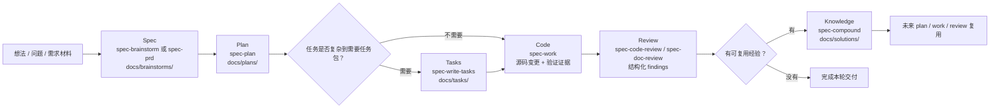
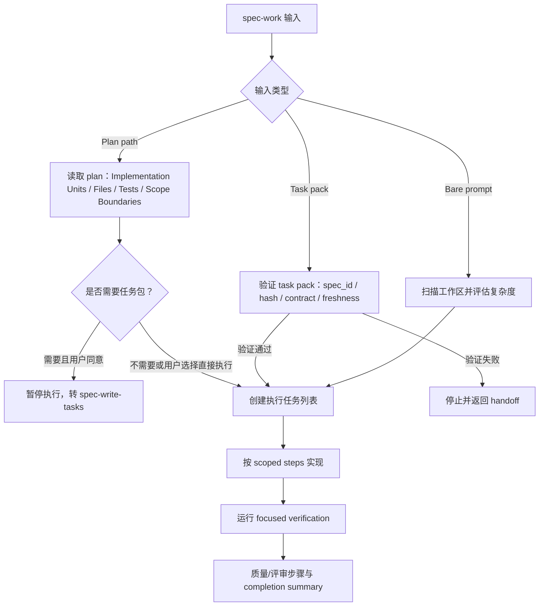

你当前位于 Get Started 里的“核心使用路径”部分，本页只解释一条主链路：如何把一个想法或需求，逐步变成可执行计划、任务包、代码变更、评审结果，最后沉淀为可复用知识。`spec-first` 的核心不是“多一个 AI 命令”，而是让一次 AI coding 对话留下仓库内可检查、可移交、可复用的产物：requirements、plans、scoped work、review 和 reusable learning。Sources: [README.zh-CN.md](README.zh-CN.md#L16-L19), [README.zh-CN.md](README.zh-CN.md#L30-L35)

## 一句话理解主链路

主链路可以记成：**先把 WHAT 说清楚，再把 HOW 规划清楚，再决定是否拆任务，再执行代码，再审查差异，最后把值得复用的经验写回知识库**。公开入口在宿主中统一使用 `spec-*` 形式，README 明确列出研发主链路为 `Codebase → Spec → Plan → Tasks → Code → Review → Knowledge`，并把 `spec-brainstorm`、`spec-prd`、`spec-plan`、`spec-write-tasks`、`spec-work`、`spec-code-review`、`spec-doc-review`、`spec-compound` 对应到各自产物目录。Sources: [README.zh-CN.md](README.zh-CN.md#L143-L158)



上图里的每个节点都对应一个“交接边界”：`docs/brainstorms/` 承载需求，`docs/plans/` 承载实施计划，`docs/tasks/` 承载可选任务包，代码阶段以 diff、验证结果和 closeout 为证据，评审阶段产出 findings，知识阶段写入 `docs/solutions/`。这些目录在用户手册中被定义为长期协作文档层或工作流证据层，而不是一次性聊天记录。Sources: [docs/05-用户手册/04-workflows-artifacts-map.md](docs/05-用户手册/04-workflows-artifacts-map.md#L25-L35), [docs/05-用户手册/04-workflows-artifacts-map.md](docs/05-用户手册/04-workflows-artifacts-map.md#L36-L50)

## 每一阶段做什么

| 阶段 | 你要回答的问题 | 推荐入口 | 主要产物 | 进入下一步的信号 |
|---|---|---|---|---|
| Spec | 到底要做什么，为什么做，边界是什么？ | `spec-brainstorm` 或 `spec-prd` | `docs/brainstorms/*-requirements.md` | WHAT/WHY、范围、验收口径足够让 planning 不再发明需求 |
| Plan | 准备怎么做，改哪些区域，风险和验证是什么？ | `spec-plan` | `docs/plans/*-plan.md` | 实施单元、文件/测试参考、风险、非目标和交接选项清楚 |
| Tasks | 计划是否太大，需要拆成执行任务包？ | `spec-write-tasks` | `docs/tasks/*-tasks.md` | 任务包通过 identity、freshness、structure 和 handoff 校验 |
| Code | 在已确认范围内实现、验证、收尾 | `spec-work` | 源码变更、验证结果、完成摘要 | diff 和检查结果能证明本轮工作完成或明确阻塞 |
| Review | 变更是否在授权范围内，质量和风险是否可接受？ | `spec-code-review`，文档用 `spec-doc-review` | findings、Coverage、residual status | findings 已处理、接受或明确残留 |
| Knowledge | 这次解决的问题以后是否值得复用？ | `spec-compound` | `docs/solutions/**/*` | 有真实已解决问题和 source-confirmed reusable lesson |

这张表故意把 `Tasks` 标成可选，因为 `spec-write-tasks` 自身定义为 `spec-plan` 与 `spec-work` 之间的 optional derived layer：它不执行代码，只在计划太大、用户明确要求拆任务，或已有任务包需要执行前验证时使用；小改动可以直接从 plan 进入 work。Sources: [skills/spec-write-tasks/SKILL.md](skills/spec-write-tasks/SKILL.md#L6-L15), [skills/spec-write-tasks/SKILL.md](skills/spec-write-tasks/SKILL.md#L18-L24)

## Spec：先把 WHAT 写成可交接需求

当行为、范围、用户、成功标准或 planning handoff 还不清楚时，从 `spec-brainstorm` 开始；它的职责是澄清 WHAT，并只在需要 durable handoff 时写入 `docs/brainstorms/`。如果是已有系统上的增量需求、粗糙 PRD 或低质量需求稿，则使用 `spec-prd`，它会先做需求澄清和 current-state evidence，再写成 PRD-grade requirements artifact。Sources: [skills/spec-brainstorm/SKILL.md](skills/spec-brainstorm/SKILL.md#L9-L17), [skills/spec-prd/SKILL.md](skills/spec-prd/SKILL.md#L8-L18)

`spec-brainstorm` 和 `spec-prd` 的共同边界是：它们不实现代码、不写实施计划、不拆任务。`spec-prd` 特别强调 **WHAT not HOW**：产品行为、验收、范围、证据和业务约束属于 PRD；实现单元、数据库表、精确 API 字段和任务拆分属于 planning。Sources: [skills/spec-brainstorm/SKILL.md](skills/spec-brainstorm/SKILL.md#L18-L28), [skills/spec-prd/SKILL.md](skills/spec-prd/SKILL.md#L79-L87)

```text
docs/
  brainstorms/
    YYYY-MM-DD-NNN-<topic>-requirements.md   # Spec / PRD 需求产物
```

在主链路里，`docs/brainstorms/*-requirements.md` 是后续 `spec-plan` 的上游输入；用户手册把它定义为 requirements brief 或研发侧 clarified requirements，用于后续复核 scope、acceptance examples、Change Delta、owner decision 和 evidence posture。Sources: [docs/05-用户手册/04-workflows-artifacts-map.md](docs/05-用户手册/04-workflows-artifacts-map.md#L29-L32), [docs/05-用户手册/04-workflows-artifacts-map.md](docs/05-用户手册/04-workflows-artifacts-map.md#L40-L43)

## Plan：把 WHAT 转成可评审的 HOW

`spec-plan` 的职责是把清晰目标、requirements artifact、bug、项目或已有 plan 转成 evidence-grounded HOW plan，同时保持 planning-only 边界。它明确说：`spec-brainstorm` 定义 WHAT，`spec-plan` 定义 HOW，`spec-work` 执行 plan；即使没有上游 brainstorm，`spec-plan` 也可以从需求文档、bug report、feature idea 或粗略描述开始。Sources: [skills/spec-plan/SKILL.md](skills/spec-plan/SKILL.md#L8-L18)

计划阶段最重要的安全边界是：**handoff 前只做规划，不做实现**。`spec-plan` 要写或更新 plan artifact，不能调用 implementation tools、修改代码、运行 implementation workflows；计划写完并 review 后，需要给出 handoff menu，并等待用户明确选择，不能自动继续进入 `spec-work`、task compilation 或代码编辑。Sources: [skills/spec-plan/SKILL.md](skills/spec-plan/SKILL.md#L20-L27)

一个合格 plan 应包含问题框架、范围边界、需求追踪、repo-relative 文件路径、测试文件路径、决策与理由、可复用模式、必要的 high-risk readiness、测试场景、依赖和顺序。`spec-plan` 对“ready”的定义很实用：implementer 可以有信心开始，而不需要 plan 代替自己写代码。Sources: [skills/spec-plan/SKILL.md](skills/spec-plan/SKILL.md#L106-L120)

```text
docs/
  plans/
    YYYY-MM-DD-NNN-<type>-<descriptive-name>-plan.md   # Plan 实施计划
```

计划文件命名规则由 `spec-plan` 定义：放在 `docs/plans/`，使用 `YYYY-MM-DD-NNN-<type>-<descriptive-name>-plan.md`，并通过 `spec_id` 维持需求、计划、任务包和后续 work/review 的链路身份。Sources: [skills/spec-plan/SKILL.md](skills/spec-plan/SKILL.md#L157-L175)

## Tasks：只在复杂计划需要压缩执行上下文时拆任务

`spec-write-tasks` 不是必经阶段，而是一个 derived layer。它的目标是判断任务包是否值得创建：当 settled local source plan 太大、依赖复杂、用户明确要求拆分，或已有 task pack 需要执行前验证时才使用；否则返回 `skip`，让工作直接进入 `spec-work`。Sources: [skills/spec-write-tasks/SKILL.md](skills/spec-write-tasks/SKILL.md#L12-L24), [skills/spec-write-tasks/SKILL.md](skills/spec-write-tasks/SKILL.md#L75-L83)

任务包永远不能替代 plan。`spec-write-tasks` 的核心规则写得很直接：`spec-plan` 始终是 single source of truth；任务包可以重排执行切片，但不能改变 scope、acceptance criteria、non-goals、repo ownership 或 product decisions。Sources: [skills/spec-write-tasks/SKILL.md](skills/spec-write-tasks/SKILL.md#L56-L65)

```text
docs/
  tasks/
    YYYY-MM-DD-NNN-<topic>-tasks.md   # 可选 derived task pack
```

可执行任务包必须位于 `docs/tasks/`，并带有 `spec_id`、`source_plan`、`source_plan_hash`、`generated_by: spec-write-tasks`、`mode: derived` 和有效的 `Task Pack Contract` JSON block；最终还必须运行 `spec-first tasks validate <task-pack-path> --json`，不能自称 deterministic handoff。Sources: [skills/spec-write-tasks/SKILL.md](skills/spec-write-tasks/SKILL.md#L34-L45), [skills/spec-write-tasks/SKILL.md](skills/spec-write-tasks/SKILL.md#L102-L116)

## Code：在确定范围内执行，而不是边做边改需求

`spec-work` 执行 settled plan、validated task pack、spec path 或明确实现请求。它的输出不是“聊天里说完成”，而是 scoped code/docs/config changes、focused verification results、review/residual status，以及一份紧凑 completion response，说明改了哪些文件、跑了哪些检查、有哪些 artifacts 和下一步。Sources: [skills/spec-work/SKILL.md](skills/spec-work/SKILL.md#L11-L18), [skills/spec-work/SKILL.md](skills/spec-work/SKILL.md#L25-L35)

如果 WHAT/HOW 未解决、target repo 不明确、task pack stale 或 unverifiable、需要扩展到 plan 之外，`spec-work` 应停止并给用户一个 handoff envelope，而不是静默扩大范围。`spec-work` 的工作流是：triage 输入、验证 repo/branch/task-pack 边界、建立任务列表、按范围实现、运行 focused verification、执行必要质量/评审步骤，最后返回完成契约。Sources: [skills/spec-work/SKILL.md](skills/spec-work/SKILL.md#L21-L43)

`spec-work` 读 plan 时会把 plan 当作 decision artifact，而不是 execution script；读 task pack 时会把 `source_plan` 仍然视为 scope、requirements 和 non-goals 的 single source of truth。执行过程中如果发现超出 plan/task scope 的文件、repo、route、symbol、consumer 或风险，只能记录为 follow-up 或 test-candidate evidence，不能直接加进本轮实现。Sources: [skills/spec-work/SKILL.md](skills/spec-work/SKILL.md#L200-L214), [skills/spec-work/SKILL.md](skills/spec-work/SKILL.md#L235-L253)



这个执行流程的关键是“能停下来”。`spec-work` 在 oversized intake 中要求：如果 bare prompt 的产品 WHAT 不清楚，推荐 brainstorm；如果目标清楚但没有 settled plan，返回 plan；如果 settled plan 太大而需要拆依赖、waves 或跨模块 ownership，给一次 `spec-write-tasks` diversion；如果执行中发现超出 scope，停止并返回 `spec-plan` 或重新运行 `spec-write-tasks`。Sources: [skills/spec-work/SKILL.md](skills/spec-work/SKILL.md#L166-L184)

## Review：先证明 diff 在授权范围内，再讨论质量

代码阶段完成后，使用 `spec-code-review` 审查 code diffs、PR 或 branch changes。它适合在创建 PR 前、实现后或任何 scoped code diff 需要 structured review 时使用；不适合 requirements/plan/task-pack 文档审查，也不负责创建 commit、push 或 PR。Sources: [skills/spec-code-review/SKILL.md](skills/spec-code-review/SKILL.md#L11-L19)

`spec-code-review` 的输出是 merged findings report，包括 severity、confidence、evidence、autofix_class、owner routing、residual status、Diff Boundary Review、test gaps 和 Coverage。对初学者来说，最值得记住的是：评审不是一句“LGTM”，而是一组可处理的 finding 和覆盖说明。Sources: [skills/spec-code-review/SKILL.md](skills/spec-code-review/SKILL.md#L21-L39)

`Diff Boundary Review` 是一等公民：每次 review 都要判断 diff 是否留在授权工作范围内。它会携带 `scope_boundary`、`authorized_scope_source`、`scope_boundary_evidence`，并区分 `clean`、`concern`、`violation`、`unknown`；实现者报告、PR 文案、commit message 或 work closeout 只能作为 claim source，必须用 diff/source/test/log/contract evidence 核验。Sources: [skills/spec-code-review/SKILL.md](skills/spec-code-review/SKILL.md#L107-L127)

如果要审查 requirements、plan 或 task pack，用 `spec-doc-review`，不是 `spec-code-review`。`spec-doc-review` 会按文档类型检查 coherence、feasibility、scope、risk 和 downstream execution readiness；对 task pack，它还会确认它是 derived，而不是第二份 plan。Sources: [skills/spec-doc-review/SKILL.md](skills/spec-doc-review/SKILL.md#L11-L19), [skills/spec-doc-review/SKILL.md](skills/spec-doc-review/SKILL.md#L113-L130)

## Knowledge：只沉淀真实解决过、值得复用的问题

`spec-compound` 用在真实问题刚刚解决后，把 source-confirmed 的 reusable lesson 写入 `docs/solutions/`。它不用于 active debugging、未解决实现、一句话总结、原始 transcript 归档，也不是每次完成工作的强制 gate。Sources: [skills/spec-compound/SKILL.md](skills/spec-compound/SKILL.md#L10-L20), [skills/spec-compound/SKILL.md](skills/spec-compound/SKILL.md#L22-L37)

知识沉淀的价值在于复利：第一次解决问题需要研究，写成结构化解决方案后，下次遇到类似问题可以被 `spec-plan`、`spec-work`、`spec-code-review`、`spec-sessions`、未来 `compound-refresh` 和人工搜索复用。Sources: [skills/spec-compound/SKILL.md](skills/spec-compound/SKILL.md#L12-L15), [skills/spec-compound/SKILL.md](skills/spec-compound/SKILL.md#L42-L49)

```text
docs/
  solutions/
    architecture-patterns/
    conventions/
    developer-experience/
    tooling-decisions/
    workflow-issues/
```

`docs/solutions/` 是长期知识层，而不是把原始 diff、完整 review bundle 或聊天记录复制进去。`spec-compound` 要优先消费 summary-first handoff，并且只有当 changed source、tests、logs、contracts 或 review findings 能确认 reusable lesson 时，才记录为 durable learning。Sources: [skills/spec-compound/SKILL.md](skills/spec-compound/SKILL.md#L84-L92), [docs/05-用户手册/04-workflows-artifacts-map.md](docs/05-用户手册/04-workflows-artifacts-map.md#L34-L43)

## 主链路中的仓库结构

下面是主链路最常接触的项目结构。`docs/` 下的内容通常是团队可提交、可复核、可长期协作的 durable artifacts；`.spec-first/workflows/spec-work/...` 属于 work closeout evidence，用户手册明确提醒它不是 plan/task 的 source authority；`spec-code-review` 的 full-detail run artifact 则写在 OS temp 下，不是 repo-local durable truth。Sources: [docs/05-用户手册/04-workflows-artifacts-map.md](docs/05-用户手册/04-workflows-artifacts-map.md#L25-L35), [docs/05-用户手册/04-workflows-artifacts-map.md](docs/05-用户手册/04-workflows-artifacts-map.md#L106-L121)

```text
your-repo/
  docs/
    brainstorms/   # Spec / PRD：需求、边界、验收
    plans/         # Plan：实施计划、风险、验证范围
    tasks/         # Tasks：可选 derived task pack
    solutions/     # Knowledge：可复用经验
  .spec-first/
    workflows/
      spec-work/   # Work closeout evidence（不是 scope authority）
  <os-temp>/
    spec-first/
      spec-code-review/   # Review 当前 run 临时 handoff
```

第一次使用时，不需要一次跑完整条链路。README 建议的最小成功信号是：安装和 init 后，在宿主里运行一个 workflow，然后检查它写入仓库的 Markdown artifact，通常位于 `docs/brainstorms/` 或 `docs/plans/`；更深的治理内容可以以后再读。Sources: [README.zh-CN.md](README.zh-CN.md#L30-L35), [README.zh-CN.md](README.zh-CN.md#L103-L123)

## 初学者的推荐走法

如果你只有一个粗略想法，按 `spec-brainstorm → spec-plan → spec-work → spec-code-review → spec-compound（可选）` 走；如果你已有 PRD 或需求笔记，按 `spec-prd → spec-plan → spec-work → spec-code-review → spec-compound（可选）` 走；如果 plan 很大，再在 `spec-plan` 和 `spec-work` 之间插入 `spec-write-tasks`。Sources: [README.zh-CN.md](README.zh-CN.md#L113-L123), [skills/spec-write-tasks/SKILL.md](skills/spec-write-tasks/SKILL.md#L18-L24)

| 你的当前状态 | 从哪里开始 | 为什么 |
|---|---|---|
| 只有模糊功能想法 | `spec-brainstorm` | 行为、范围、用户、成功标准还不清楚，planning 会发明 WHAT |
| 已有 PRD、需求稿或 brownfield change request | `spec-prd` | 需要把需求材料转成 planning-ready 的 PRD artifact |
| WHAT 已清楚，想设计实施方案 | `spec-plan` | 进入 HOW 阶段，只规划不实现 |
| 已有 plan，范围不大 | `spec-work` | 直接在 settled scope 内执行 |
| 已有 plan，但单次执行上下文太大 | `spec-write-tasks` | 生成 derived task pack，降低执行风险和上下文负担 |
| 代码已经改完，需要检查 | `spec-code-review` | 审查 diff 范围、质量、验证和 residual risk |
| 文档、plan 或 task pack 需要检查 | `spec-doc-review` | 审查文档可执行性、范围和下游 readiness |
| 问题已解决且值得复用 | `spec-compound` | 写入 `docs/solutions/`，让未来工作复用经验 |

这些入口选择与 README 的快速路由一致：粗略想法用 `spec-brainstorm`，已有 PRD 或需求笔记用 `spec-prd`，bug 或失败测试用 `spec-debug`，已定计划或范围明确实现用 `spec-work`，需要审查时用 `spec-doc-review` 或 `spec-code-review`。Sources: [README.zh-CN.md](README.zh-CN.md#L113-L123)

## 常见误区

**误区一：把 plan 当成代码脚本逐行执行。** `spec-plan` 明确要求计划包含决策、边界、文件、依赖、风险和测试场景，而不是预写 implementation code 或 shell command choreography；`spec-work` 也明确把 plan 当作 decision artifact，而不是 execution script。Sources: [skills/spec-plan/SKILL.md](skills/spec-plan/SKILL.md#L95-L104), [skills/spec-work/SKILL.md](skills/spec-work/SKILL.md#L200-L208)

**误区二：每个 plan 都必须拆 task pack。** `spec-write-tasks` 只在计划太大、依赖复杂或用户明确要求时使用；它可以返回 `skip`，因为小改动直接进入 `spec-work` 更便宜、更安全。Sources: [skills/spec-write-tasks/SKILL.md](skills/spec-write-tasks/SKILL.md#L18-L24), [skills/spec-write-tasks/SKILL.md](skills/spec-write-tasks/SKILL.md#L75-L83)

**误区三：执行时顺手扩范围。** `spec-work` 要求新增 durable surface 前检查 scope need、existing capability、future-only abstraction、architecture evidence 和 authorization boundary；如果实现需要 plan/task 未授权的新公共契约、跨模块抽象、schema/runtime/config surface 或 provider boundary，应停止并 handoff，而不是直接做。Sources: [skills/spec-work/SKILL.md](skills/spec-work/SKILL.md#L83-L96)

**误区四：评审只看代码风格。** `spec-code-review` 把 Diff Boundary Review 作为一等轴线，要判断 diff 是否在授权范围内；它还要求用 direct diff/source/test/log evidence 确认 findings，不能把 advisory 或实现者自述当 confirmed。Sources: [skills/spec-code-review/SKILL.md](skills/spec-code-review/SKILL.md#L75-L83), [skills/spec-code-review/SKILL.md](skills/spec-code-review/SKILL.md#L107-L127)

## 下一步阅读

如果你还没有初始化宿主，请先读 [首次初始化：为 Claude Code、Codex、Kiro、Qoder 与 Cursor 生成运行时](4-shou-ci-chu-shi-hua-wei-claude-code-codex-kiro-qoder-yu-cursor-sheng-cheng-yun-xing-shi)；如果你想亲手跑一次最小闭环，请读 [运行第一个需求工作流并检查仓库产物](5-yun-xing-di-ge-xu-qiu-gong-zuo-liu-bing-jian-cha-cang-ku-chan-wu)；如果你还不确定应该从 brainstorm、prd、debug、work 还是 review 开始，请继续读下一页 [工作流入口路由：什么时候使用 brainstorm、prd、debug、work 或 review](8-gong-zuo-liu-ru-kou-lu-you-shi-yao-shi-hou-shi-yong-brainstorm-prd-debug-work-huo-review)。Sources: [README.zh-CN.md](README.zh-CN.md#L74-L88), [README.zh-CN.md](README.zh-CN.md#L94-L123)

当你已经跑过一轮主链路后，建议再读 [产物目录导览：docs、.spec-first 与临时 handoff 的边界](9-chan-wu-mu-lu-dao-lan-docs-spec-first-yu-lin-shi-handoff-de-bian-jie)，因为主链路的可信度来自“产物放在哪里、谁能读、是否应该提交、是否只是临时 handoff”这些边界。Sources: [docs/05-用户手册/04-workflows-artifacts-map.md](docs/05-用户手册/04-workflows-artifacts-map.md#L1-L6), [docs/05-用户手册/04-workflows-artifacts-map.md](docs/05-用户手册/04-workflows-artifacts-map.md#L53-L64)