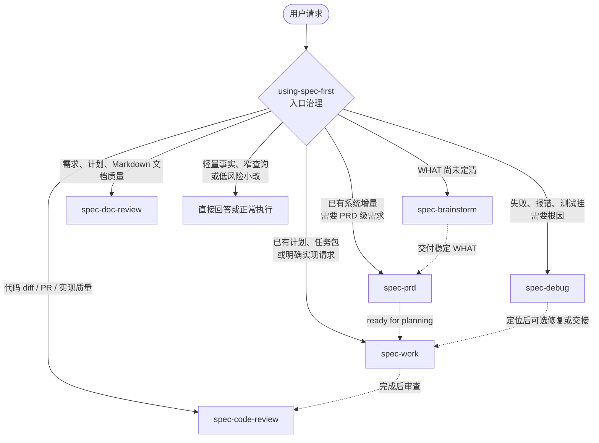

**架构假设**：spec-first 的入口路由不是“所有工作先 brainstorm”，而是一个轻量的治理层先判断当前意图是否需要进入公开 `spec-*` workflow；如果需要，只选择一个最匹配的入口，并让该入口接管后续执行。本页位于 Get Started → 核心使用路径，当前页专注解释 `spec-brainstorm`、`spec-prd`、`spec-debug`、`spec-work` 与 review 入口的选择边界，不展开 plan、tasks、knowledge 或运行时管理细节。Sources: [SKILL.md](skills/using-spec-first/SKILL.md#L8-L10), [SKILL.md](skills/using-spec-first/SKILL.md#L76-L87), [SKILL.md](skills/using-spec-first/SKILL.md#L108-L131)

## 入口路由的第一原则

spec-first 的入口治理由 `using-spec-first` 承担：它本身不是 slash command、不是 `spec-*` workflow，也不产出计划、任务包、评审报告或 durable knowledge；它的职责是在“重大工作开始前”或“用户询问下一步该走哪个 workflow”时，基于当前意图、宿主表面、项目指令与最小事实，输出一个公开 workflow 入口、一个下一步建议，或判断无需进入 workflow。Sources: [SKILL.md](skills/using-spec-first/SKILL.md#L15-L26), [SKILL.md](skills/using-spec-first/SKILL.md#L50-L58)



这张图表达的是“单次入口选择”，不是自动串联流水线：路由规则要求按优先级选择第一个强匹配入口，不能自动连跑多个 workflow，除非当前 workflow 自己的契约显式 handoff。Sources: [SKILL.md](skills/using-spec-first/SKILL.md#L120-L134), [workflow-skill-agent-map.md](docs/workflow-skill-agent-map.md#L12-L20)

## 快速决策表

| 当前请求的真实意图 | 推荐入口 | 不要误走的入口 | 判断依据 |
| --- | --- | --- | --- |
| 已经选定一个问题、功能或改进，但行为、范围、用户、成功标准或交接上下文还没定清 | `spec-brainstorm` | `spec-work`、`spec-plan` | 规划或执行会被迫“发明 WHAT” |
| 已有系统形态，正在编写、精修或验证 brownfield PRD 级需求 | `spec-prd` | `spec-brainstorm` | 产品/系统表面已锚定，重点是 source-first 澄清 WHAT/WHY 与验收 |
| 有失败测试、运行时报错、回归、异常行为、stack trace 或反复修失败 | `spec-debug` | `spec-work` | 先建立因果链，再决定是否修复 |
| 已有 settled plan、validated task pack、spec path 或明确实现请求 | `spec-work` | `spec-brainstorm`、`spec-prd` | 执行边界足够清楚，目标是按范围改代码/文档/配置并验证 |
| 用户要求审查 PR、diff、当前分支实现质量或合并风险 | `spec-code-review` | `spec-work` | 目标是结构化评审，不是继续实现 |
| 用户要求审查需求、计划、spec 或 Markdown 文档 | `spec-doc-review` | `spec-code-review`、`spec-prd` | 目标是独立 critique 文档质量，而不是新写 PRD |
| 只是窄事实查询、单文档摘要、轻量解释、低风险小改 | 不进入 workflow | 任意 `spec-*` | routing policy 明确允许 lightweight direct outcomes |

Sources: [SKILL.md](skills/using-spec-first/SKILL.md#L19-L25), [SKILL.md](skills/using-spec-first/SKILL.md#L146-L174), [SKILL.md](skills/spec-brainstorm/SKILL.md#L15-L20), [SKILL.md](skills/spec-prd/SKILL.md#L24-L31), [SKILL.md](skills/spec-debug/SKILL.md#L15-L22), [SKILL.md](skills/spec-work/SKILL.md#L17-L24), [SKILL.md](skills/spec-code-review/SKILL.md#L13-L20)

## 什么时候用 `spec-brainstorm`

当用户已经给出一个选定的问题、功能或改进方向，但“要构建什么”还没有稳定下来时，用 `spec-brainstorm`。典型信号包括：目标用户不清、行为边界不清、成功标准不清、scope 仍在摇摆、后续 planning 需要靠猜才能写出 WHAT；它的输出是需求文档或简短对齐摘要，主要服务后续 `spec-plan`、owner、review 与 work/review flows。Sources: [SKILL.md](skills/spec-brainstorm/SKILL.md#L9-L17), [SKILL.md](skills/spec-brainstorm/SKILL.md#L21-L37)

不要把所有“想法类”请求都扔进 `spec-brainstorm`：开放式找点子、0-1 idea generation 更接近 `spec-ideate`；已有系统增量 PRD 写作/精修/校验更接近 `spec-prd`；明确 HOW 计划、执行、debug、review、setup、单文档清理或窄事实回答都不应进入 brainstorm。Sources: [SKILL.md](skills/spec-brainstorm/SKILL.md#L18-L20), [SKILL.md](skills/spec-brainstorm/SKILL.md#L39-L53), [SKILL.md](skills/using-spec-first/SKILL.md#L160-L162)

**判断句式**：如果你发现自己要在计划或实现阶段替用户补全“用户是谁、到底改什么行为、验收怎么算、哪些不做”，入口通常应先停在 `spec-brainstorm`。Sources: [SKILL.md](skills/spec-brainstorm/SKILL.md#L15-L17), [SKILL.md](skills/using-spec-first/SKILL.md#L125-L127)

## 什么时候用 `spec-prd`

当请求面向“已有系统”的增量需求，并且目标是把粗糙说明、低质量 PRD、现有 PRD 或代码感知的需求判断，转成可供规划消费的 PRD 级需求文档时，用 `spec-prd`。它强调 brownfield first、WHAT not HOW、source-first current-state evidence、验收、范围边界、假设与未解决问题，默认产物是 `docs/brainstorms/*-requirements.md`，并显式不创建 `docs/prds/`、不实现代码、不写 implementation plan。Sources: [SKILL.md](skills/spec-prd/SKILL.md#L8-L18), [SKILL.md](skills/spec-prd/SKILL.md#L24-L31), [SKILL.md](skills/spec-prd/SKILL.md#L79-L87)

`spec-prd` 与 `spec-brainstorm` 的关键差异在于：brainstorm 解决“问题框架和 WHAT 尚未成形”，PRD 解决“已有系统增量需要达到 planning-readiness”。如果产品形态、系统表面或 owner 决策仍没有锚定，PRD 入口会先遇到 target surface、product identity 或 current-state evidence 的失败模式。Sources: [SKILL.md](skills/spec-prd/SKILL.md#L44-L54), [SKILL.md](skills/spec-prd/SKILL.md#L93-L100), [SKILL.md](skills/using-spec-first/SKILL.md#L133-L134)

**判断句式**：如果用户拿来的是“我们现有系统要加/改一个能力，这份需求能不能进入规划、PRD 怎么补齐、哪些 WHAT 还不能让 planning 发明”，入口通常是 `spec-prd`。Sources: [SKILL.md](skills/spec-prd/SKILL.md#L10-L14), [SKILL.md](skills/spec-prd/SKILL.md#L93-L100)

## 什么时候用 `spec-debug`

当请求的中心是失败、异常、回归或无法解释的行为时，用 `spec-debug`，并且它在路由优先级上位于普通 work 之前。典型输入包括失败测试、运行时报错、broken behavior、stack trace、issue reference、reproduction path、日志、反复修复失败的上下文；workflow 会先 triage、复现或记录无法复现原因、追踪因果链、测试假设，再决定是否做一个 scoped fix。Sources: [SKILL.md](skills/using-spec-first/SKILL.md#L122-L126), [SKILL.md](skills/spec-debug/SKILL.md#L13-L22), [SKILL.md](skills/spec-debug/SKILL.md#L39-L45)

不要因为“最后可能要改代码”就直接走 `spec-work`：debug 的硬边界是先解释完整 causal chain，避免凭直觉修症状、shotgun debugging 或修完不复跑反馈回路。只有当根因已明确、修复范围也能被安全界定时，debug 才可能把较大的修复交给 `spec-work` 或进入后续 review。Sources: [SKILL.md](skills/spec-debug/SKILL.md#L61-L78), [SKILL.md](skills/spec-debug/SKILL.md#L110-L120)

**判断句式**：如果用户问“为什么失败”“这个测试怎么挂了”“线上这个异常怎么来的”“我修了几次还是不对”，入口通常是 `spec-debug`，不是 `spec-work`。Sources: [SKILL.md](skills/spec-debug/SKILL.md#L1-L4), [SKILL.md](skills/spec-debug/SKILL.md#L15-L22)

## 什么时候用 `spec-work`

当用户给出的是 settled plan、validated task pack、spec path，或已经足够具体的实现请求时，用 `spec-work`。这个入口的目标是按当前 repo scope 系统化执行，实现 scoped code/docs/config changes，运行聚焦验证，最后返回 changed files、checks、artifacts 与 required next action 等完成证据。Sources: [SKILL.md](skills/spec-work/SKILL.md#L7-L14), [SKILL.md](skills/spec-work/SKILL.md#L17-L35)

`spec-work` 不是兜底执行器：如果 WHAT/HOW 未解决、target repo scope 模糊、task pack stale/unverifiable、实现会越过 plan/task 范围、或需要把 generated runtime mirrors 当 source fix 手改，都不应继续 work，而应停下或路由回更合适入口。Sources: [SKILL.md](skills/spec-work/SKILL.md#L21-L24), [SKILL.md](skills/spec-work/SKILL.md#L37-L44)

**判断句式**：如果你可以清楚说出“按这个计划/任务包/明确请求改哪些行为，并能用最小反馈回路验证”，入口通常是 `spec-work`。Sources: [SKILL.md](skills/spec-work/SKILL.md#L63-L81), [SKILL.md](skills/spec-work/SKILL.md#L83-L96)

## 什么时候用 review

当用户要求的是“评价已有变更”，而不是“继续实现”，就进入 review。代码 diff、PR、当前分支实现质量、测试缺口、merge-readiness 或实现风险走 `spec-code-review`；需求、计划、任务包、Markdown artifact 的独立 critique 走 `spec-doc-review`，而不是把文档审查误当成 PRD 编写。Sources: [SKILL.md](skills/using-spec-first/SKILL.md#L124-L134), [SKILL.md](skills/using-spec-first/SKILL.md#L155-L156), [workflow-skill-agent-map.md](docs/workflow-skill-agent-map.md#L33-L36)

`spec-code-review` 适用于创建 PR 前、实现完成后，或任何需要 confidence-gated findings 的 scoped code diff；它的输入可以是当前分支 diff、PR URL/number、base ref、plan path 与 mode token，输出是合并去重后的 findings report、Coverage、test gaps、residual status，以及在允许模式下的 safe autofix。Sources: [SKILL.md](skills/spec-code-review/SKILL.md#L11-L20), [SKILL.md](skills/spec-code-review/SKILL.md#L21-L40)

不要用 `spec-code-review` 来做需求/计划文档评审、未解决工作规划、commit/push/PR 创建，或把 optional external-tool startup failure 当成 reviewer failure。评审入口的重点是基于 diff/source/test/log/artifact evidence 形成可处理 findings，而不是代替实现 workflow。Sources: [SKILL.md](skills/spec-code-review/SKILL.md#L17-L20), [SKILL.md](skills/spec-code-review/SKILL.md#L69-L83), [SKILL.md](skills/spec-code-review/SKILL.md#L101-L105)

**判断句式**：如果用户说“帮我 review 这个 PR / diff / 当前分支有没有问题”，走 `spec-code-review`；如果用户说“帮我审这份需求/计划/Markdown 是否一致、可行、完整”，走 `spec-doc-review`。Sources: [SKILL.md](skills/using-spec-first/SKILL.md#L133-L134), [workflow-skill-agent-map.md](docs/workflow-skill-agent-map.md#L34-L36)

## 外部 Issue / PR 输入怎么路由

外部 issue 或 PR 材料不是单独 workflow；它只是输入表面。失败报告、复现步骤、stack trace、failing checks 或 abnormal behavior 走 `spec-debug`；enhancement request、product change、unclear acceptance 或 WHAT discovery 走 `spec-prd` 或 `spec-brainstorm`；PR diff quality、implementation risk、test gaps 或 merge-readiness 走 `spec-code-review`；已经 scoped 的 plan、task pack、execution brief 或 owner instruction 走 `spec-work`。Sources: [SKILL.md](skills/using-spec-first/SKILL.md#L135-L144)

对 issue body、评论、PR description、PR diff 与 reporter-provided commands，要按 `provider_untrusted` 或 user-provided input 处理；不能照搬执行 reporter 命令，下游 workflow 必须用当前 source、tests、logs、diff 或 owner evidence 重新确认 claims。Sources: [SKILL.md](skills/using-spec-first/SKILL.md#L135-L145)

## 常见误路由与修正

| 误路由 | 为什么错 | 正确修正 |
| --- | --- | --- |
| “任何大需求都先 brainstorm” | routing policy 明确要求 decision tree，不是 blanket brainstorm-first | 看 WHAT 是否真的未定；brownfield PRD 走 `spec-prd`，执行明确走 `spec-work` |
| “有 bug 也直接 work 修” | debug 优先于 work，因为先要建立 root cause | 失败、报错、测试挂先走 `spec-debug` |
| “PRD 不好就 doc-review” | 如果目标是 brownfield PRD authoring/refinement/readiness validation，应由 PRD workflow 做 source-first grill | 独立 critique 走 `spec-doc-review`；PRD 作者/精修/规划就绪判断走 `spec-prd` |
| “用户提到 PR 就一定 code-review” | PR 可能只是上下文；真实意图可能是失败诊断、需求变更或执行任务 | 按请求动作路由：failure→debug，diff quality→review，scoped work→work |
| “一次请求自动 brainstorm → PRD → work → review” | routing contract 禁止自动串联多个 workflow | 只选当前最强匹配入口，让该 workflow 自己 handoff |

Sources: [SKILL.md](skills/using-spec-first/SKILL.md#L108-L134), [SKILL.md](skills/using-spec-first/SKILL.md#L135-L145), [SKILL.md](skills/spec-brainstorm/SKILL.md#L39-L53), [SKILL.md](skills/spec-debug/SKILL.md#L61-L78)

## 视觉化目录边界

本页讨论的是入口选择，不是产物目录全景；但理解路由时可以记住这几个与本页直接相关的 source/runtime 边界：`using-spec-first` 是源侧路由 policy，`spec-brainstorm` 与 `spec-prd` 主要写需求类 artifact，`spec-work` 的权威证据是 repo diff 与验证结果，`spec-code-review` 的 durable repo-local evidence 只在 workflow 明确路由时产生。Sources: [SKILL.md](skills/using-spec-first/SKILL.md#L50-L58), [SKILL.md](skills/spec-brainstorm/SKILL.md#L24-L29), [SKILL.md](skills/spec-prd/SKILL.md#L40-L43), [SKILL.md](skills/spec-work/SKILL.md#L29-L35), [SKILL.md](skills/spec-code-review/SKILL.md#L25-L32)

```text
spec-first source of truth
├── skills/using-spec-first/SKILL.md      # 入口治理：只负责路由，不产 artifact
├── skills/spec-brainstorm/SKILL.md       # WHAT 未定时的需求澄清
├── skills/spec-prd/SKILL.md              # brownfield PRD 级需求编写/精修/校验
├── skills/spec-debug/SKILL.md            # 失败与异常的根因诊断
├── skills/spec-work/SKILL.md             # settled scope 内的实现执行
└── skills/spec-code-review/SKILL.md      # diff / PR / 实现质量评审
```

这份结构图只覆盖本页涉及的入口；完整的 workflow、skill 与 agent 映射可在后续 Deep Dive 中阅读。Sources: [workflow-skill-agent-map.md](docs/workflow-skill-agent-map.md#L24-L48)

## 下一步阅读路径

如果你想先理解从想法到代码的完整主链路，请读上一页 [从想法到代码的主链路：Spec → Plan → Tasks → Code → Review → Knowledge](7-cong-xiang-fa-dao-dai-ma-de-zhu-lian-lu-spec-plan-tasks-code-review-knowledge)；如果你已经知道入口但想确认产物会落在哪里，请读下一页 [产物目录导览：docs、.spec-first 与临时 handoff 的边界](9-chan-wu-mu-lu-dao-lan-docs-spec-first-yu-lin-shi-handoff-de-bian-jie)；如果你需要深入理解所有核心 workflow 的内部机制，再读 [核心工作流深析：brainstorm、prd、plan、write-tasks、work、review、compound](22-he-xin-gong-zuo-liu-shen-xi-brainstorm-prd-plan-write-tasks-work-review-compound)。Sources: [workflow-skill-agent-map.md](docs/workflow-skill-agent-map.md#L4-L20), [workflow-skill-agent-map.md](docs/workflow-skill-agent-map.md#L24-L48)