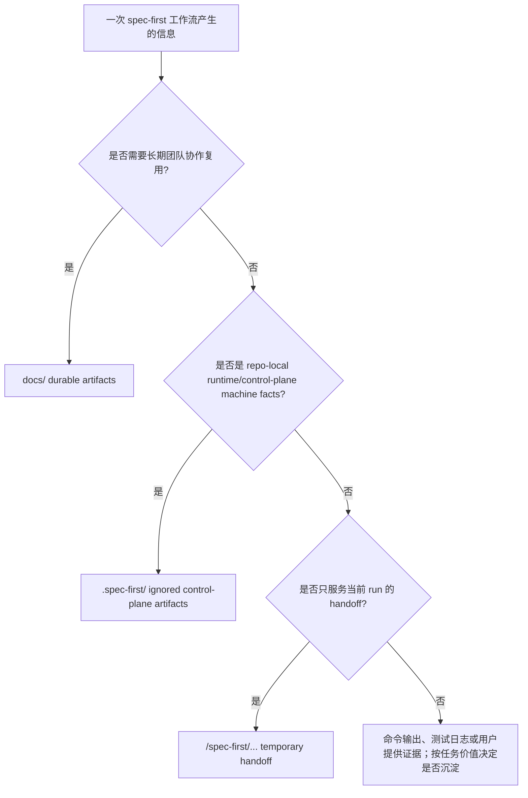

你当前位于 Get Started 路径中的 **[产物目录导览：docs、.spec-first 与临时 handoff 的边界](9-chan-wu-mu-lu-dao-lan-docs-spec-first-yu-lin-shi-handoff-de-bian-jie)**。本页的目标不是解释每个 workflow 的完整执行细节，而是帮你在第一次或前几次使用 spec-first 时判断：哪些产物应该提交到仓库、哪些只是本机运行事实、哪些只是当前会话的临时交接材料。Sources: [10-产物目录.md](docs/05-用户手册/10-产物目录.md#L1-L11)

## 架构假设：产物边界由“协作寿命”决定

本页采用一个可验证的架构假设：**产物的存放位置由它的协作寿命和权威级别决定**。长期协作知识进入 `docs/`；可重建或本机相关的控制面事实进入 `.spec-first/`；只服务当前 reviewer/orchestrator run 的 full-detail handoff 放在 OS temp 下，不进入仓库持久层。这个假设与用户手册中的核心原则一致：`docs/` 承载 ideation、requirements、plans、tasks、solutions；`.spec-first/` 多为 runtime/control-plane facts；`.claude/`、`.codex/`、`.agents/skills/` 等是可重建 runtime assets。Sources: [10-产物目录.md](docs/05-用户手册/10-产物目录.md#L5-L11)



这张图只表达目录边界，不表达 workflow 状态机。项目文档明确说明，“产物目录”的重点是边界，不是把 workflow 固化成状态机；同时，是否写入 `docs/` 取决于对应 workflow 的职责和当前任务价值。Sources: [10-产物目录.md](docs/05-用户手册/10-产物目录.md#L1-L3), [10-产物目录.md](docs/05-用户手册/10-产物目录.md#L36-L36)

## 三类产物的快速判断表

| 类别 | 典型路径 | 生命周期 | 是否通常提交 | 判断口径 |
| --- | --- | --- | --- | --- |
| 长期协作文档 | `docs/ideation/`、`docs/brainstorms/`、`docs/plans/`、`docs/tasks/`、`docs/solutions/` | 跨会话、跨成员、跨评审复用 | 通常提交；`docs/tasks/` 视团队协作需要 | 记录需求、计划、任务包、经验沉淀等 durable context |
| 本机控制面事实 | `.spec-first/config/`、`.spec-first/workspace/`、`.spec-first/audits/`、`.spec-first/app-audit/`、`.spec-first/workflows/` | 可重建、与本机 setup 或 run 相关 | 通常不提交 | 回答“当前机器事实是什么”，不是长期手工维护知识库 |
| 临时 handoff | `<os-temp>/spec-first/spec-code-review/<run-id>/` | 当前 code review run | 不提交 | 保存 reviewer JSON、detail enrichment、safe_auto 结果和 residual handoff |

Sources: [10-产物目录.md](docs/05-用户手册/10-产物目录.md#L13-L24), [10-产物目录.md](docs/05-用户手册/10-产物目录.md#L62-L77), [04-workflows-artifacts-map.md](docs/05-用户手册/04-workflows-artifacts-map.md#L19-L35)

## 视觉目录：你会看到哪些文件夹

```text
repo/
├── docs/
│   ├── ideation/          # 候选想法、排序、拒绝理由
│   ├── brainstorms/       # requirements / prd-requirements
│   ├── plans/             # 执行前计划与取舍
│   ├── tasks/             # 从 plan 派生的任务包
│   └── solutions/         # 已解决问题的可复用经验
├── .spec-first/
│   ├── config/            # setup-owned machine facts
│   ├── workspace/         # parent workspace advisory summaries
│   ├── audits/            # skill audit execution artifacts
│   ├── app-audit/         # app consistency audit run artifacts
│   └── workflows/         # verification / spec-work / quality gate artifacts
└── <os-temp>/spec-first/
    └── spec-code-review/  # 当前 review run 的临时 handoff，不在仓库内
```

`docs/` 下的 durable artifacts 与 `.spec-first/` 下的 control-plane artifacts 在文档中被明确分开：前者属于长期协作文档层，后者属于 project-local runtime/control-plane 产物；而 code review full-detail run artifact 明确写到 OS temp root，不是 `.spec-first/`，也不是 repo-local durable truth。Sources: [04-workflows-artifacts-map.md](docs/05-用户手册/04-workflows-artifacts-map.md#L25-L35), [04-workflows-artifacts-map.md](docs/05-用户手册/04-workflows-artifacts-map.md#L112-L121)

## `docs/`：长期协作知识与决策上下文

`docs/` 是团队应优先阅读和提交的协作层。`docs/ideation/*-ideation.md` 保存候选想法、批判、排序和拒绝理由；`docs/brainstorms/*-requirements.md` 保存需求 brief 或 `spec-prd` 生成的研发侧 clarified requirements；`docs/plans/*-plan.md` 是执行前的主要决策上下文；`docs/tasks/*-tasks.md` 是从 plan 派生的 executable handoff；`docs/solutions/**/*` 保存解决问题后的可复用经验。Sources: [10-产物目录.md](docs/05-用户手册/10-产物目录.md#L13-L24)

这些文件的共同点是：它们不是当前机器状态，而是让后续 `spec-plan`、`spec-work`、`spec-write-tasks`、review 或维护者可以复用的上下文。项目文档把 `docs/ideation/`、`docs/brainstorms/`、`docs/plans/`、`docs/tasks/`、`docs/solutions/` 分别归类为候选方向、需求成型、计划/任务交接和知识沉淀，并列出它们的典型后续用途。Sources: [04-workflows-artifacts-map.md](docs/05-用户手册/04-workflows-artifacts-map.md#L36-L52)

选择写入哪个 `docs/` 子目录时，可以按工作阶段判断：想让 AI 生成、批判和排序多个方向时写 `docs/ideation/`；已选一个方向并需要记录需求时写 `docs/brainstorms/`；产品或 owner 已给出 PRD / 需求材料并需要研发侧澄清时仍写 `docs/brainstorms/`；需要执行前共识时写 `docs/plans/`；计划很大、需要交接或并行执行时派生 `docs/tasks/`；问题已经解决且经验可复用时写 `docs/solutions/`。Sources: [10-产物目录.md](docs/05-用户手册/10-产物目录.md#L78-L89)

## `.spec-first/`：本机事实与控制面，不是长期知识库

`.spec-first/` 主要用于 setup、审计、验证和质量门等机器事实。当前目录映射中列出的 `.spec-first/config/`、`.spec-first/workspace/`、`.spec-first/audits/skill-audit/`、`.spec-first/app-audit/runs/<run-id>/`、`.spec-first/workflows/verification/<slug>/`、`.spec-first/workflows/spec-work/<workspace-slug>/<run-id>/`、`.spec-first/workflows/quality-gates/ai-dev-quality-gate/` 都属于 runtime/control-plane 或执行证据目录。Sources: [04-workflows-artifacts-map.md](docs/05-用户手册/04-workflows-artifacts-map.md#L7-L18)

`.spec-first/config/` 保存 setup-owned facts，例如 `runtime-capabilities.json`，用于 host baseline、required helper readiness、candidate tools/resources、fallback 能力和 artifact path contract；它不是 query-ready direct evidence，也不是 live MCP proof。Sources: [04-workflows-artifacts-map.md](docs/05-用户手册/04-workflows-artifacts-map.md#L9-L18), [04-workflows-artifacts-map.md](docs/05-用户手册/04-workflows-artifacts-map.md#L65-L82)

`.spec-first/workspace/` 是父 workspace 的 advisory 层，用来保存 child repo 候选、批量维护 summary、scenario fingerprint 和 parent orphan quarantine。它帮助在多仓父目录下理解候选和批量维护结果，但不能替代 child repo 内的 `.spec-first/config/`、当前源码、git diff、tests/logs、ast-grep 或 bounded direct source reads。Sources: [04-workflows-artifacts-map.md](docs/05-用户手册/04-workflows-artifacts-map.md#L83-L105)

`.spec-first/workflows/spec-work/<workspace-slug>/<run-id>/run.json` 是 `spec-work` closeout evidence，不是 plan/task 的 source authority；其中 optional `direct_evidence_used` 只是 compact summary，用于把 work 阶段消费过的 direct source evidence 传给下游 `spec-code-review`。Sources: [04-workflows-artifacts-map.md](docs/05-用户手册/04-workflows-artifacts-map.md#L106-L110)

## 临时 handoff：当前 run 的协调材料，不是仓库事实

`spec-code-review` 的 full-detail run artifact 写到当前 OS temp root 下的 `<os-temp>/spec-first/spec-code-review/<run-id>/`。这个路径不在 `.spec-first/` 下，也不是 repo-local durable truth；实际 `<os-temp>` 由运行环境解析，例如 macOS/Linux 的 `$TMPDIR` 或 Windows 的 `%TEMP%`。Sources: [04-workflows-artifacts-map.md](docs/05-用户手册/04-workflows-artifacts-map.md#L112-L115)

它的持久化边界很明确：`mode:report-only` 不写 temp artifact；interactive、autofix 和 headless mode 会写 OS temp artifact，但默认不提交、不承诺长期保留；如果 shipping 阶段接受 residual findings，PR 描述应写 `Known Residuals`，无 PR 提交路径时才写 concise durable summary；系统不默认把 full-detail per-reviewer JSON bundle 复制进 `docs/` 或 `.spec-first/`。Sources: [04-workflows-artifacts-map.md](docs/05-用户手册/04-workflows-artifacts-map.md#L116-L121)

换句话说，临时 handoff 的作用是让当前 reviewer/orchestrator run 协调细节，不是让未来维护者把它当作需求、计划、验证证据或长期知识。需要长期共享时，应把结论压缩成 PR 描述或团队约定的 concise durable doc，而不是把完整临时 bundle 搬进仓库。Sources: [04-workflows-artifacts-map.md](docs/05-用户手册/04-workflows-artifacts-map.md#L21-L24), [04-workflows-artifacts-map.md](docs/05-用户手册/04-workflows-artifacts-map.md#L112-L121)

## Git 边界：为什么很多目录不该提交

spec-first 在 `.gitignore` 中维护了受管 runtime assets 和本机 workflow artifacts 的忽略规则。被忽略的 generated runtime assets 包括 `.claude/commands/spec-*.md`、`.claude/skills/`、`.claude/spec-first/`、`.claude/agents/`、`.codex/`、`.agents/skills/`、`.cursor/skills/`、`.kiro/skills/`、`.qoder/skills/` 等；被忽略的本机 setup 和 workflow runtime artifacts 包括 `.spec-first/config/*.json`、`.spec-first/audits/`、`.spec-first/app-audit/`、`.spec-first/workflows/`、`.spec-first/workspace/`、`.spec-first/sessions/`。Sources: [.gitignore](.gitignore#L54-L99), [gitignore-policy.js](src/cli/gitignore-policy.js#L6-L61)

源码中也以同一组模式生成 spec-first 的 `.gitignore` block，并暴露 `getSpecFirstGitignorePatterns()` 供 runtime untrack 逻辑复用。`planRuntimeUntrack()` 会通过 `git ls-files` 找到已经被这些忽略规则覆盖但仍被 Git 跟踪的路径，然后生成 `untrack_index` 操作，说明这些 runtime/control-plane 资产的正确状态是不进入 Git index。Sources: [gitignore-policy.js](src/cli/gitignore-policy.js#L63-L83), [runtime-untrack.js](src/cli/runtime-untrack.js#L9-L41)

如果 runtime 看起来坏了，修复方式不是手改 generated copy，而是先判断 source truth 是否正确，再用 `spec-first init` 选择目标宿主重建。手册明确把 `.claude/`、`.codex/`、`.agents/skills/` 等列为 generated runtime assets，并说明如果这些目录漂移，应重新运行对应宿主的 init。Sources: [10-产物目录.md](docs/05-用户手册/10-产物目录.md#L38-L50)

## Source truth：真正应该改哪里

如果你要改变 CLI 行为，应修改 `src/cli/`；如果要改变 skill 定义或脚本，应修改 `skills/`；如果要改变 agent 定义，应修改 `agents/`；如果要改变 runtime 生成模板，应修改 `templates/`；如果要改变协作文档、计划、手册和长期知识，应修改 `docs/`；如果要增加回归保障，应修改 `tests/`。Sources: [10-产物目录.md](docs/05-用户手册/10-产物目录.md#L51-L61)

| 想改变的东西 | 应修改的 source truth | 不应直接修改的对象 |
| --- | --- | --- |
| CLI 命令、doctor/init/update/clean 行为 | `src/cli/` | `.claude/commands/spec-*.md` 等 runtime copy |
| Skill 的提示词、references、脚本 | `skills/` | `.claude/skills/`、`.agents/skills/`、`.cursor/skills/` 等生成副本 |
| Agent 定义 | `agents/` | `.claude/agents/`、`.codex/agents/` 等生成副本 |
| 宿主 runtime 模板 | `templates/` | 已生成的宿主目录 |
| 团队知识、需求、计划、任务、经验 | `docs/` | `.spec-first/` 机器事实目录 |

Sources: [10-产物目录.md](docs/05-用户手册/10-产物目录.md#L38-L61), [gitignore-policy.js](src/cli/gitignore-policy.js#L6-L61)

## 多仓父 workspace：`.spec-first/workspace/` 只给建议，不替你做语义选择

在父 workspace 下，`.spec-first/workspace/` 可以保存 `project-config-bootstrap-summary.json`、`mcp-setup-summary.json`、`mcp-verify-summary.json`、`scenario-fingerprint-setup.json`、`scenario-fingerprint.json` 和 `parent-artifact-quarantine.json` 等 summary。它们的用途是帮助识别 child repo 候选、批量 setup 结果、场景 fingerprint 和 parent orphan quarantine，而不是成为任何 child repo 的 canonical truth。Sources: [04-workflows-artifacts-map.md](docs/05-用户手册/04-workflows-artifacts-map.md#L83-L105)

`parent-artifact-quarantine.v1` 合同也明确说它是 setup-owned advisory artifact，用于标记出现在父 workspace root 的 repo-local setup artifacts，避免下游 workflow 把它误认为当前 child repo truth；它的 authority 是 advisory evidence only。Sources: [parent-artifact-quarantine.md](docs/contracts/parent-artifact-quarantine.md#L1-L13)

清理父 workspace orphan 时，`spec-first clean --workspace-orphans` 是 preview-first；没有 `--confirm` 时只列出 `quarantined_paths[]`，不能删除文件。清理消费者还必须拒绝绝对路径、parent traversal、反斜杠、symlink escape，以及超出受支持 parent-orphan surface 的路径。Sources: [parent-artifact-quarantine.md](docs/contracts/parent-artifact-quarantine.md#L50-L61), [clean.js](src/cli/commands/clean.js#L166-L200)

因此，当你在父 workspace 下不确定该写哪个 repo 时，应回到 plan/task scope，让文档显式写出 `target_repo` 或 per-unit/per-task `target_repo`；不要让 workspace summary 替你做语义选择。Sources: [10-产物目录.md](docs/05-用户手册/10-产物目录.md#L78-L89)

## 日常决策清单

| 问题 | 推荐动作 | 原因 |
| --- | --- | --- |
| 这是需求、计划、任务或可复用经验吗？ | 写入 `docs/` 对应子目录 | 属于长期协作知识 |
| 这是 setup、audit、verification、quality gate 的机器事实吗？ | 留在 `.spec-first/`，通常不提交 | 属于 runtime/control-plane facts |
| 这是 code review 当前 run 的 reviewer JSON 或 enrichment 细节吗？ | 留在 `<os-temp>/spec-first/spec-code-review/<run-id>/` | 属于临时 session/orchestrator handoff |
| runtime copy 漂移或坏了？ | 修改 source truth 后重新 `spec-first init` | generated runtime assets 可重建 |
| `.spec-first/` 事实 stale、blocked 或 degraded？ | 在下游 workflow 中说明限制，并回退到 bounded direct repo reads、git diff、tests/logs 或用户证据 | `.spec-first/` 不是长期手工维护知识库 |

Sources: [10-产物目录.md](docs/05-用户手册/10-产物目录.md#L62-L77), [10-产物目录.md](docs/05-用户手册/10-产物目录.md#L78-L89)

## 下一步阅读路径

如果你还没有跑过完整需求链路，建议先回到上一页 [运行第一个需求工作流并检查仓库产物](5-yun-xing-di-ge-xu-qiu-gong-zuo-liu-bing-jian-cha-cang-ku-chan-wu)，用一个最小需求观察 `docs/` 与 `.spec-first/` 的实际变化；如果你想理解何时选择 brainstorm、prd、debug、work 或 review，请阅读 [工作流入口路由：什么时候使用 brainstorm、prd、debug、work 或 review](8-gong-zuo-liu-ru-kou-lu-you-shi-yao-shi-hou-shi-yong-brainstorm-prd-debug-work-huo-review)。Sources: [10-产物目录.md](docs/05-用户手册/10-产物目录.md#L13-L24), [04-workflows-artifacts-map.md](docs/05-用户手册/04-workflows-artifacts-map.md#L36-L52)

完成本页后，下一页是 [多仓库与父工作区初始化实践](10-duo-cang-ku-yu-fu-gong-zuo-qu-chu-shi-hua-shi-jian)，它会把这里的 `.spec-first/workspace/` advisory 边界放到多仓库父工作区场景中继续展开；团队落地阶段则建议继续阅读 [团队协作中的需求、计划、任务包与评审交接](11-tuan-dui-xie-zuo-zhong-de-xu-qiu-ji-hua-ren-wu-bao-yu-ping-shen-jiao-jie)。Sources: [04-workflows-artifacts-map.md](docs/05-用户手册/04-workflows-artifacts-map.md#L83-L105), [10-产物目录.md](docs/05-用户手册/10-产物目录.md#L76-L88)