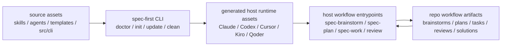
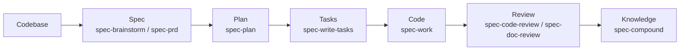

你当前位于入门指南的第一篇：[项目概览](1-xiang-mu-gai-lan)。本页只回答一个问题：**spec-first 是什么、解决什么问题、由哪些部分组成，以及第一次阅读时应该先看哪里**。它不会展开安装步骤、宿主差异、命令细节或测试体系；这些内容会在后续页面逐步展开。Sources: [README.zh-CN.md](README.zh-CN.md#L16-L20), [src/cli/index.js](src/cli/index.js#L158-L174)

## 架构假设：spec-first 是一层项目内 AI Coding Harness

从代码和文档可以验证的核心假设是：`spec-first` 不是一个替代 Claude Code、Codex、Cursor、Kiro 或 Qoder 的独立 IDE，而是一层安装到项目仓库里的 **AI Coding Harness**。它把一次性的 AI coding 对话，转成仓库承载的 requirements、plans、scoped work、review 和 reusable learning 闭环；脚本负责准备事实和强制确定性边界，LLM 在这层基础上做语义判断。Sources: [README.zh-CN.md](README.zh-CN.md#L16-L18), [README.zh-CN.md](README.zh-CN.md#L207-L215)

这个假设也能从 npm 包定义中得到验证：包名是 `spec-first`，命令行入口是 `bin/spec-first.js`，描述明确写明它面向 Claude Code、Codex、Kiro、Qoder 与 Cursor，并把一次性 AI coding chats 转为 repo-backed、verifiable engineering loop。Sources: [package.json](package.json#L1-L8), [package.json](package.json#L112-L114)

## 一句话理解

**spec-first 让 AI 辅助开发从“聊天窗口里的临时回答”，变成“仓库里可检查、可交接、可复用的工程过程”。** 对初学者来说，最重要的不是它有多少 prompt 或 agent，而是一次 workflow 是否留下了可读、可审查、可继续推进的 artifact，例如 `docs/brainstorms/` 下的需求 brief 或 `docs/plans/` 下的实现计划。Sources: [README.zh-CN.md](README.zh-CN.md#L26-L35), [README.zh-CN.md](README.zh-CN.md#L125-L142)

## 它解决的核心问题

AI 写代码可以很快，但真正昂贵的是保存代码背后的判断：为什么选择这个范围、检查过哪些证据、哪些 review finding 重要、下一位 agent 或同事应该继承什么上下文。如果这些信息只留在会话里，下一次会话、下一位 reviewer 或下一次迭代都很难复用。Sources: [README.zh-CN.md](README.zh-CN.md#L162-L167)

spec-first 的做法是把开发过程中的关键判断写进仓库：requirements、PRD、plans、task packs、review findings、bugs 和 learnings 都可以成为持久 artifact。这样，AI 的输出不只是“看起来完成了”，而是能被人检查、被后续 workflow 消费、被团队沉淀为知识。Sources: [README.zh-CN.md](README.zh-CN.md#L180-L191)

## 架构总览

下面这张图只展示入门级全景：CLI 从 source assets 生成各宿主的 runtime assets；开发者在宿主里调用 `spec-*` workflow；workflow 再把需求、计划、任务、审查与经验写回仓库。Sources: [README.zh-CN.md](README.zh-CN.md#L193-L199), [src/cli/index.js](src/cli/index.js#L196-L214)



Sources: [README.zh-CN.md](README.zh-CN.md#L193-L199), [src/cli/index.js](src/cli/index.js#L158-L174)

## 你会接触到的几个部分

| 部分 | 初学者可以怎样理解 | 典型位置或入口 |
|---|---|---|
| CLI package | 负责安装、初始化、检查和刷新 runtime 的命令行工具 | `spec-first doctor`、`spec-first init`、`spec-first update`、`spec-first clean` |
| Source assets | spec-first 自带的源资产，用来生成各宿主能识别的 runtime | `skills/`、`agents/`、`templates/`、`src/cli/` |
| Host runtime assets | 初始化后写入项目的宿主侧入口和配置 | `.claude/`、`.codex/`、`.cursor/`、`.kiro/`、`.qoder/` 等 |
| Workflow entrypoints | 在宿主会话里使用的 `spec-*` 工作流入口 | `spec-brainstorm`、`spec-plan`、`spec-work`、`spec-code-review` |
| Repo artifacts | workflow 留在仓库里的可检查产物 | `docs/brainstorms/`、`docs/plans/`、`docs/tasks/`、`docs/solutions/` |

Sources: [README.zh-CN.md](README.zh-CN.md#L125-L160), [README.zh-CN.md](README.zh-CN.md#L193-L199), [src/cli/index.js](src/cli/index.js#L158-L174)

## 项目结构速览

下面是面向初学者的视觉化结构，只保留理解项目概览所需的主干：`bin/` 是 npm 命令入口，`src/cli/` 是 CLI 实现，`skills/` 和 `agents/` 是 workflow 与专家能力来源，`templates/` 是宿主 runtime 模板，`docs/` 是文档、契约、计划和产物承载区，`tests/` 与 `scripts/` 支撑验证和发布。Sources: [package.json](package.json#L37-L83), [bin/spec-first.js](bin/spec-first.js#L1-L24)

```text
spec-first/
├── bin/
│   └── spec-first.js          # npm bin 入口
├── src/
│   └── cli/                   # doctor / init / update / clean 等 CLI 实现
├── skills/                    # spec-* workflow 能力来源
├── agents/                    # 专家 agent 角色定义
├── templates/                 # 生成宿主 runtime 的模板
├── docs/                      # 用户文档、契约、计划、产物与知识沉淀
├── scripts/                   # lint、测试、发布、同步等脚本
├── tests/                     # 单元、集成、烟测与契约测试
└── package.json               # npm 包元数据与脚本入口
```

Sources: [package.json](package.json#L15-L36), [package.json](package.json#L37-L83)

## 从命令行入口看它如何启动

当你运行 `spec-first` 时，npm bin 指向 `bin/spec-first.js`。这个文件先检查 Node.js 版本，再把参数交给 `src/cli` 中的 `runCli(argv)`。因此，CLI 是整个工具的可执行入口，而不是每个 workflow 的直接执行器。Sources: [package.json](package.json#L6-L8), [bin/spec-first.js](bin/spec-first.js#L1-L24)

`runCli` 当前公开处理的 package CLI 命令包括 `doctor`、`init`、`clean`、`update`、`tasks`、`repair-worktree`、`session` 和 `internal`。帮助信息也明确说明：安装后的 workflow entrypoints 由宿主在 `spec-first init` 之后提供。Sources: [src/cli/index.js](src/cli/index.js#L19-L80), [src/cli/index.js](src/cli/index.js#L158-L174)

## CLI 命令与宿主 workflow 的区别

初学者最容易混淆的是：`spec-first doctor` 这类是终端里的 package CLI 命令，而 `spec-plan`、`spec-work`、`spec-code-review` 这类是在 Claude Code、Codex、Cursor、Kiro 或 Qoder 会话里使用的 workflow 入口，不是 package CLI 子命令。Sources: [src/cli/index.js](src/cli/index.js#L196-L214)

| 类型 | 在哪里运行 | 例子 | 作用 |
|---|---|---|---|
| Package CLI 命令 | 终端 | `spec-first doctor` | 检查环境、runtime asset manifest 和托管 runtime assets |
| Package CLI 命令 | 终端 | `spec-first init` | 安装 workflows、skills、agents 和开发者 profile |
| Package CLI 命令 | 终端 | `spec-first update` | 升级 CLI package 并刷新 runtime assets |
| Package CLI 命令 | 终端 | `spec-first clean` | 移除当前项目中的 spec-first managed assets |
| Host workflow 入口 | AI 宿主会话 | `spec-plan`、`spec-work`、`spec-code-review`、`spec-mcp-setup` | 启动需求、计划、执行、审查或环境准备类 workflow |

Sources: [src/cli/index.js](src/cli/index.js#L158-L174), [src/cli/index.js](src/cli/index.js#L196-L214)

## 支持哪些宿主

`spec-first init` 的宿主选择包括 Claude Code、Codex、Cursor、Kiro 和 Qoder。代码中的初始化平台列表显示，Claude 和 Codex 是 `-y` 默认宿主，Cursor、Kiro 和 Qoder 也在支持列表中，但默认不自动选择。Sources: [src/cli/commands/init.js](src/cli/commands/init.js#L77-L113)

| 宿主 | init 标识 | 初学者理解 |
|---|---|---|
| Claude Code | `--claude` | 生成 Claude Code 可使用的项目 workflow 入口 |
| Codex | `--codex` | 生成 Codex 可使用的 skills / hooks 运行面 |
| Cursor | `--cursor` | 生成 Cursor 相关 runtime；README 标注其为 generated-runtime preview |
| Kiro | `--kiro` | 生成 Kiro skills、agents 与 spec-first runtime |
| Qoder | `--qoder` | 生成 Qoder commands、skills、agents 与 spec-first runtime |

Sources: [src/cli/commands/init.js](src/cli/commands/init.js#L77-L113), [README.zh-CN.md](README.zh-CN.md#L80-L87)

## 典型工作流主线

项目 README 把研发主链路概括为 `Codebase → Spec → Plan → Tasks → Code → Review → Knowledge`。对应到公开入口，粗略想法可以从 `spec-brainstorm` 开始，已有 PRD 可以进入 `spec-prd`，实现计划使用 `spec-plan`，任务拆分使用 `spec-write-tasks`，范围明确的执行使用 `spec-work`，审查使用 `spec-code-review` 或 `spec-doc-review`，经验沉淀使用 `spec-compound`。Sources: [README.zh-CN.md](README.zh-CN.md#L143-L160)



Sources: [README.zh-CN.md](README.zh-CN.md#L143-L160)

## 第一次跑完你应该看到什么

第一次试用时，最小成功信号不是“AI 说完成了”，而是仓库中出现了可检查的 Markdown artifact。README 给出的首次验证路径是：安装和 init 后，在宿主里运行一个 workflow，然后检查它写入仓库的 Markdown artifact，通常位于 `docs/brainstorms/` 或 `docs/plans/`。Sources: [README.zh-CN.md](README.zh-CN.md#L30-L35)

对第一次运行来说，README 推荐从 `spec-brainstorm "描述你的第一个任务"` 开始；完成后检查是否出现类似 `docs/brainstorms/YYYY-MM-DD-NNN-<topic>-requirements.md` 的文件。这就是“工作已经写进仓库，可检查，并可以移交给 plan 继续推进”的最小闭环。Sources: [README.zh-CN.md](README.zh-CN.md#L94-L123)

## 它产出哪些仓库内 artifact

不同 workflow 不会每次都写入所有目录。初学者只需要先记住：`docs/brainstorms/` 常用于需求 brief，`docs/plans/` 用于实现计划，`docs/tasks/` 用于任务交接，`docs/solutions/` 用于复用经验；`.spec-first/workflows/` 可承载 structured work closeout evidence，并且 README 标注其默认 gitignore。Sources: [README.zh-CN.md](README.zh-CN.md#L125-L142)

| 目录 | 常见内容 | 初学者用途 |
|---|---|---|
| `docs/ideation/` | ranked ideas 与探索记录 | 保存早期想法和探索结果 |
| `docs/brainstorms/` | requirements briefs 与 PRD 级需求 | 把模糊需求变成可继续推进的文档 |
| `docs/plans/` | implementation plans | 保存可评审、可执行的实现计划 |
| `docs/tasks/` | derived task packs | 把计划拆成可交接任务 |
| `docs/reviews/` | 文档与代码审查 findings | 保存审查结论和问题 |
| `docs/solutions/` | 可复用经验 | 把解决过的问题沉淀成知识 |
| `.spec-first/workflows/` | structured work closeout evidence | 保存执行闭环证据，默认 gitignore |

Sources: [README.zh-CN.md](README.zh-CN.md#L125-L142)

## 信任模型：脚本守边界，LLM 做判断

spec-first 的信任模型可以用一句话概括：**scripts enforce deterministic invariants; scripts prepare facts; LLM decides semantic adequacy above that floor.** 也就是说，脚本负责安装、校验、生成、报告可机器判断的事实；LLM 负责需求框定、范围边界、取舍判断、实现判断和 review evidence。Sources: [README.zh-CN.md](README.zh-CN.md#L207-L215)

这对初学者很重要：不要把 spec-first 理解成“完全自动化替你开发”的系统。它更像是给 AI 开发过程铺了一层可检查的地板，让关键过程进入仓库，让人和模型都围绕 artifacts、tests、source/runtime boundaries 工作。Sources: [README.zh-CN.md](README.zh-CN.md#L180-L191), [README.zh-CN.md](README.zh-CN.md#L207-L215)

## 什么时候适合使用 spec-first

如果你已经在使用 Claude Code、Codex、Kiro、Qoder 或 Cursor，并希望用项目内 workflow 替代一次性 prompt；如果你希望 AI coding work 留下 durable requirements、plans、显式路由的 review summaries 和 learnings；如果你希望脚本处理确定性 setup，同时语义判断仍由 LLM 完成，那么 spec-first 的形态是匹配的。Sources: [README.zh-CN.md](README.zh-CN.md#L217-L226)

如果你只需要一次性 prompt 片段、通用 agent marketplace、不依赖宿主的独立应用，或者团队流程不希望 workflow artifacts 写入 repo，README 也明确提示 spec-first 可能不是最合适的形态。Sources: [README.zh-CN.md](README.zh-CN.md#L217-L226)

## 建议阅读路线

作为入门指南的第一页，读完本文后建议按目录顺序继续：[快速开始](2-kuai-su-kai-shi) 会带你完成安装和初始化，[首次运行与成功信号](3-shou-ci-yun-xing-yu-cheng-gong-xin-hao) 会帮助你确认第一次 workflow 是否真的成功，[选择你的宿主：Claude Code、Codex、Cursor、Kiro 与 Qoder](4-xuan-ze-ni-de-su-zhu-claude-code-codex-cursor-kiro-yu-qoder) 会解释如何选择运行环境。Sources: [README.zh-CN.md](README.zh-CN.md#L36-L88), [src/cli/commands/init.js](src/cli/commands/init.js#L77-L113)

如果你已经知道要运行什么任务，可以继续看 [常用入口速查：从需求、计划、执行到审查](5-chang-yong-ru-kou-su-cha-cong-xu-qiu-ji-hua-zhi-xing-dao-shen-cha)。如果你更关心文件会写到哪里、哪些该提交、哪些不该提交，可以看 [产物目录与提交边界](6-chan-wu-mu-lu-yu-ti-jiao-bian-jie)。Sources: [README.zh-CN.md](README.zh-CN.md#L113-L160), [README.zh-CN.md](README.zh-CN.md#L125-L142)