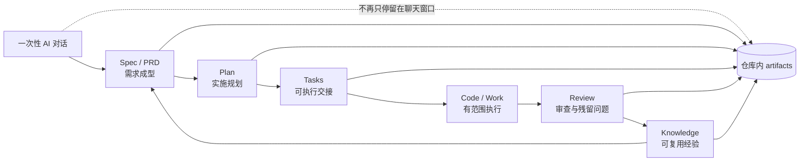
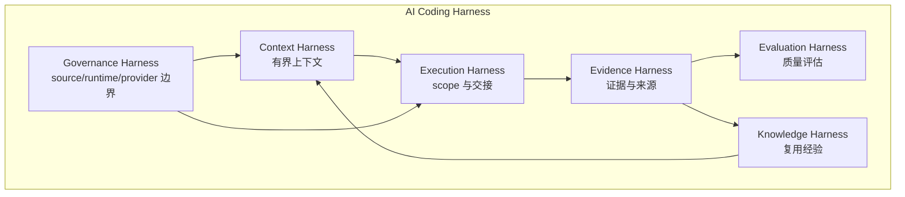

你当前位于深度解析的“核心理念与工作流”起点页：本页只解释一个核心转变——`spec-first` 如何把一次性的 AI coding 对话，转成由仓库承载、可检查、可交接、可复用的工程闭环。它不会展开每个 workflow 的完整操作细节；如果你想看主链路各节点，请继续读 [工作流主链路：Spec、Plan、Tasks、Code、Review、Knowledge](11-gong-zuo-liu-zhu-lian-lu-spec-plan-tasks-code-review-knowledge)。Sources: [README.zh-CN.md](README.zh-CN.md#L16-L18), [docs/contracts/ai-coding-harness.md](docs/contracts/ai-coding-harness.md#L7-L13)

## 架构假设与验证结论

本页的架构假设是：`spec-first` 的价值不在于把 prompt 写得更长，也不在于替代 Claude Code、Codex、Cursor、Kiro 或 Qoder，而是在项目仓库中增加一层 **AI Coding Harness**，让需求、计划、任务、执行、审查和知识沉淀形成有边界的循环。源码中的概念定义直接把 Spec-first 命名为“turning unstable agent reasoning into a bounded engineering loop”，并把 Workflow Harness 定义为提供上下文、证据边界、产物形状和交接契约的协调层。Sources: [CONCEPTS.md](CONCEPTS.md#L9-L19), [docs/contracts/ai-coding-harness.md](docs/contracts/ai-coding-harness.md#L1-L5)

验证后的最小模型是：**脚本提供事实地板，LLM 在事实地板之上做语义判断，仓库保存可复查产物**。合同明确要求 scripts enforce deterministic invariants and prepare deterministic facts，而 LLM workflows decide semantic adequacy；README 也把同一规则总结为“scripts enforce deterministic invariants; scripts prepare facts; LLM decides semantic adequacy above that floor”。Sources: [docs/contracts/ai-coding-harness.md](docs/contracts/ai-coding-harness.md#L26-L33), [README.zh-CN.md](README.zh-CN.md#L207-L215)

## 问题：一次性对话为什么不够

一次 AI 对话可以很快给出答案，但真正昂贵的是保存“答案背后的判断”：为什么选这个 scope、看过哪些证据、review finding 为什么成立、下一位维护者应该继承什么上下文。README 将这个问题描述为：如果没有仓库承载的轨迹，上下文会随聊天窗口消失，下一次会话缺上下文，reviewer 看不到计划为什么变化，团队也难以复用成功经验。Sources: [README.zh-CN.md](README.zh-CN.md#L162-L167)

`spec-first` 因此把“工作是否变得可检查”放在第一圈成功信号里，而不是先要求用户理解全部治理概念。快速开始文档要求用户在宿主中运行一个 workflow 后，检查仓库中是否出现 Markdown artifact，例如 `docs/brainstorms/` 或 `docs/plans/`；第一次运行甚至可以只确认 `docs/brainstorms/YYYY-MM-DD-NNN-<topic>-requirements.md` 这样的 artifact 是否存在。Sources: [README.zh-CN.md](README.zh-CN.md#L26-L35), [README.zh-CN.md](README.zh-CN.md#L103-L112)

## 核心转变：从聊天记录到仓库闭环

`spec-first` 的核心链路被合同固定为 `Codebase -> Spec -> Plan -> Tasks -> Code -> Review -> Knowledge`。这意味着一次需求不再只是 prompt；它可以先变成需求 brief，再变成 plan，再按需要拆成 task pack，随后进入有范围的执行、审查和知识沉淀。Sources: [docs/contracts/ai-coding-harness.md](docs/contracts/ai-coding-harness.md#L7-L13), [README.zh-CN.md](README.zh-CN.md#L143-L158)



上图中的每个节点都不是抽象口号，而是对应当前仓库中已经命名的 workflow node 和 artifact 类型：brainstorm/PRD、plan、work、debug、review、compound 等节点拥有输入、输出、产物、失败模式和下游交接；artifact 被定义为 durable workflow output，例如 requirements document、plan、task pack、review report、validation ledger、setup facts、run artifact 或 solution doc。Sources: [CONCEPTS.md](CONCEPTS.md#L17-L19), [CONCEPTS.md](CONCEPTS.md#L89-L95)

## 仓库承载的两类 durable surface

`spec-first` 有两类 durable surface：一类是 **workflow artifacts**，也就是 `docs/brainstorms/`、`docs/plans/`、`docs/tasks/`、`docs/solutions/` 和 `.spec-first/workflows/` 等项目内产物；另一类是 **generated host runtime assets**，也就是由 source assets 生成到不同宿主目录中的 runtime surface。README 明确描述：Source assets（`skills/`、`agents/`、`templates/`、`src/cli/`）经 `spec-first init` 重新生成为 host runtime assets，并产出仓库内 workflow artifacts。Sources: [README.zh-CN.md](README.zh-CN.md#L193-L199), [docs/contracts/source-runtime-customization-boundary.md](docs/contracts/source-runtime-customization-boundary.md#L63-L75)

```text
spec-first repo
├── source assets
│   ├── skills/
│   ├── agents/
│   ├── templates/
│   └── src/cli/
├── generated runtime mirrors
│   ├── .claude/
│   ├── .agents/skills/
│   ├── .cursor/skills/
│   ├── .kiro/
│   └── .qoder/
└── workflow artifacts
    ├── docs/brainstorms/
    ├── docs/plans/
    ├── docs/tasks/
    ├── docs/solutions/
    └── .spec-first/workflows/
```

这个结构的关键不是“目录多”，而是 **行为来源与运行投影分离**：如果要改变 spec-first 的行为，应编辑 checked-in source assets，例如 `skills/`、`agents/`、`templates/`、`src/cli/`、`docs/`、`README`、`AGENTS.md` 或 `CLAUDE.md`；不要把 `.claude/`、`.codex/`、`.agents/skills/`、`.cursor/skills/`、`.kiro/` 或 `.qoder/` 等 generated runtime mirrors 当作源码修复点。Sources: [docs/contracts/source-runtime-customization-boundary.md](docs/contracts/source-runtime-customization-boundary.md#L7-L24), [docs/contracts/source-runtime-customization-boundary.md](docs/contracts/source-runtime-customization-boundary.md#L25-L56)

## 一次性对话与工程闭环的差异

| 维度 | 一次性 AI 对话 | 仓库承载的工程闭环 |
|---|---|---|
| 结果形态 | 聊天答案或临时 transcript | requirements、plans、tasks、review findings、learnings 等 artifacts |
| 决策保存 | 依赖会话上下文 | 写入项目内文档或结构化运行证据 |
| 可审查性 | reviewer 通常只看最终 diff | reviewer 可以看需求、计划、任务、diff、finding 与验证证据 |
| 边界控制 | 主要依赖模型自觉 | 脚本守住机械不变量，LLM 负责语义判断 |
| 多宿主一致性 | 各宿主分别维护 prompt | 一套 source assets 生成多宿主 runtime surface |

这张表不是营销对比，而是当前仓库机制的归纳：README 明确说明 requirements 会变成持久 brief，plans 和 task packs 会把模糊意图变成可评审、可执行上下文，work closeout 可以指向结构化 verification evidence，work/review/debug/optimize/compound workflows 会沉淀证据与经验，并且一套 source assets 以统一 `spec-*` workflow 入口支持多个宿主。Sources: [README.zh-CN.md](README.zh-CN.md#L172-L191)

## Harness 分层：为什么闭环能被治理

仓库闭环之所以可治理，是因为它不是单一“大流程”，而是被拆成 Context、Execution、Evidence、Evaluation、Governance 和 Knowledge 六层 Harness。合同中每一层都有明确职责：Context 控制上下文边界，Execution 传递 scope 与 handoff evidence，Evidence 保存 provenance 与 freshness，Evaluation 记录质量是否变好，Governance 管 source/runtime/provider 边界，Knowledge 只沉淀已验证、可复用经验。Sources: [docs/contracts/ai-coding-harness.md](docs/contracts/ai-coding-harness.md#L15-L24)



这个分层避免了两个常见极端：一端是“所有事情都靠模型自由发挥”，另一端是“把研发流程变成僵硬状态机”。合同明确说 Execution Harness 在 plan/task/work/review 间传递 scope、task identity、repo scope 和 handoff evidence，但不变成状态机；同时也要求新 contract 只增加能关闭重复 handoff、evidence 或 governance gap 的最小 durable mechanism。Sources: [docs/contracts/ai-coding-harness.md](docs/contracts/ai-coding-harness.md#L17-L24), [docs/contracts/ai-coding-harness.md](docs/contracts/ai-coding-harness.md#L26-L33)

## 产物如何让工作可交接

长期协作文档层的 durable artifacts 覆盖了从想法到知识的主要阶段：`docs/ideation/` 保存候选方向与被拒原因，`docs/brainstorms/` 保存需求成型 brief 或 clarified requirements，`docs/plans/` 保存实施单元、取舍、验证范围与风险，`docs/tasks/` 保存可执行 handoff，`docs/solutions/` 保存已解决问题的可复用经验。Sources: [docs/05-用户手册/04-workflows-artifacts-map.md](docs/05-用户手册/04-workflows-artifacts-map.md#L25-L35)

| 产物目录 | 在闭环中的角色 | 后续典型读取方 |
|---|---|---|
| `docs/brainstorms/` | 需求成型与研发侧 clarified requirements | `spec-plan`、doc review、维护者 |
| `docs/plans/` | 实施规划与取舍记录 | `spec-work`、`spec-write-tasks`、review |
| `docs/tasks/` | 从 plan 派生的 executable handoff | `spec-work`、协作者 |
| `docs/solutions/` | 已解决问题的可复用经验 | 后续 brainstorm、plan、work、debug、review |
| `.spec-first/workflows/` | 结构化运行证据与质量门结果 | doctor、review、后续诊断 |

这些 artifacts 的权威边界也很重要：workflow artifacts 是本地 evidence，不是 spec-first 行为源码；它们可以被下游 workflow、review 和人类读取，但不能覆盖 `skills/`、`agents/`、`templates/`、`src/cli/` 或 `docs/contracts/**` 中的 source contracts。Sources: [docs/contracts/source-runtime-customization-boundary.md](docs/contracts/source-runtime-customization-boundary.md#L63-L75), [docs/05-用户手册/04-workflows-artifacts-map.md](docs/05-用户手册/04-workflows-artifacts-map.md#L36-L52)

## 路由不是“所有事情都先 brainstorm”

从一次性对话进入工程闭环，并不等于每个请求都强制走需求流程。`using-spec-first` 的入口治理明确说它是 standalone meta skill，不是 command-backed workflow，也不是 `spec-*` workflow；它负责判断当前请求是否应在改变状态前进入 public workflow，并且轻量事实问答、窄定位查询、单文档整理、明确低风险小改动可以直接处理。Sources: [skills/using-spec-first/SKILL.md](skills/using-spec-first/SKILL.md#L6-L14), [skills/using-spec-first/SKILL.md](skills/using-spec-first/SKILL.md#L15-L29)

路由规则的核心是“意图优先于关键词”：显式 route 优先，环境和 runtime 问题走 setup/update，失败和异常走 debug，审查请求走 code/doc review，WHAT 仍不清时才进入 ideate/brainstorm/PRD，目标清楚但路径不清时进入 plan，已有 plan 或 task pack 时进入 work，完成后再通过 compound 沉淀知识。Sources: [skills/using-spec-first/SKILL.md](skills/using-spec-first/SKILL.md#L108-L133), [skills/using-spec-first/SKILL.md](skills/using-spec-first/SKILL.md#L146-L174)

## 信任模型：事实地板与语义判断分离

`spec-first` 的 trust model 可以概括为一句话：**可机械判定的事情交给脚本，不可机械判定的工程判断交给 LLM，但 LLM 必须站在可追溯证据之上**。合同把 direct evidence lanes 分成 source-read、verification、handoff-summary、external-tool 和 capability-candidate，并要求 external-tool evidence 在 source、test、log、schema、contract 或用户确认前都是 advisory。Sources: [docs/contracts/ai-coding-harness.md](docs/contracts/ai-coding-harness.md#L35-L46), [docs/contracts/ai-coding-harness.md](docs/contracts/ai-coding-harness.md#L26-L33)

这也解释了为什么 `spec-first` 不把外部工具或 provider 当作最终权威。source/runtime 边界合同明确说 ast-grep、browser tools、MCP tools、package managers、shell commands 等只提供 evidence、capabilities、logs 和 readiness facts；它们不拥有 product scope、architecture tradeoffs、workflow recommendation、review conclusion 或 degraded evidence 是否足够这些语义权威。Sources: [docs/contracts/source-runtime-customization-boundary.md](docs/contracts/source-runtime-customization-boundary.md#L77-L100)

## 你应该如何理解本页的“闭环”

当本页说“闭环”，指的是一种可持续的工程记忆机制：一次需求、一次计划、一次实现、一次审查或一次问题解决，都应尽可能留下可定位、可复查、可继续使用的 artifact。Concepts 将 Learning 定义为在真实问题解决后沉淀到 `docs/solutions/` 的 source-confirmed solution 或 reusable practice；Compound 则是把已解决问题转成可复用知识，让后续 implementation、debugging、planning 和 review 从更好的上下文开始。Sources: [CONCEPTS.md](CONCEPTS.md#L109-L122)

这个闭环仍然保持轻量：不是每个 workflow 都会写入所有 artifact，第一次运行通常只需要在 `docs/brainstorms/` 下写一个文件；更深的 plans、tasks、代码变更、review findings 和 learnings 会随着实际工作逐步积累。Sources: [README.zh-CN.md](README.zh-CN.md#L125-L142)

## 下一步阅读路径

如果你已经理解“一次性 AI 对话为什么要变成仓库闭环”，下一页建议读 [工作流主链路：Spec、Plan、Tasks、Code、Review、Knowledge](11-gong-zuo-liu-zhu-lian-lu-spec-plan-tasks-code-review-knowledge)，它会展开主链路每个阶段的职责；如果你更关心“什么时候进入 workflow，什么时候直接回答”，读 [路由治理：何时进入 workflow，何时直接回答](12-lu-you-zhi-li-he-shi-jin-ru-workflow-he-shi-zhi-jie-hui-da)；如果你想从需求质量开始，读 [需求澄清与 PRD 质量闭环](13-xu-qiu-cheng-qing-yu-prd-zhi-liang-bi-huan)。Sources: [docs/contracts/ai-coding-harness.md](docs/contracts/ai-coding-harness.md#L7-L13), [skills/using-spec-first/SKILL.md](skills/using-spec-first/SKILL.md#L120-L133)

如果你想把这个理念对应到 CLI 和运行时，可以稍后读 [命令行入口与命令分发架构](17-ming-ling-xing-ru-kou-yu-ming-ling-fen-fa-jia-gou)、[初始化流程与多宿主运行时生成](18-chu-shi-hua-liu-cheng-yu-duo-su-zhu-yun-xing-shi-sheng-cheng) 和 [Source of Truth 与 Generated Runtime 边界](21-source-of-truth-yu-generated-runtime-bian-jie)。当前页只需要你记住一个判断标准：一次 AI 工作结束后，仓库里是否留下了下一位开发者可以检查、质疑、接续和复用的东西。Sources: [README.zh-CN.md](README.zh-CN.md#L245-L258), [docs/contracts/source-runtime-customization-boundary.md](docs/contracts/source-runtime-customization-boundary.md#L7-L24)