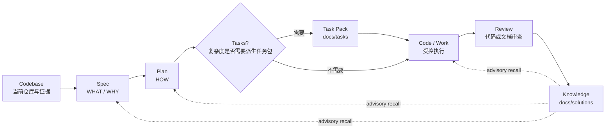

你当前位于深度解析的核心理念页面：[工作流主链路：Spec、Plan、Tasks、Code、Review、Knowledge](11-gong-zuo-liu-zhu-lian-lu-spec-plan-tasks-code-review-knowledge)。本页只解释主链路本身：一个需求如何从 **Spec** 进入 **Plan**，在必要时派生为 **Tasks**，再进入 **Code** 执行、**Review** 审查，最后沉淀为 **Knowledge**；运行时初始化、路由治理、CLI 分发、双宿主治理等细节属于相邻页面，不在这里展开。Sources: [docs/workflow-skill-agent-map.md](docs/workflow-skill-agent-map.md#L4-L20), [README.zh-CN.md](README.zh-CN.md#L143-L158)

这条链路的核心假设是：`spec-first` 不是让 AI “多聊几轮”，而是把一次性 coding 对话拆成可检查、可移交、可复用的仓库产物。README 明确把典型链路表述为 `Codebase → Spec → Plan → Tasks → Code → Review → Knowledge`，并列出 `docs/brainstorms/`、`docs/plans/`、`docs/tasks/`、源码变更、结构化 findings、`docs/solutions/` 等产物。Sources: [README.zh-CN.md](README.zh-CN.md#L127-L141), [README.zh-CN.md](README.zh-CN.md#L145-L157)

## 主链路总览

主链路可以理解为“从意图到证据再到复用”的流水线：Spec 稳定 WHAT，Plan 决定 HOW，Tasks 在复杂场景下压缩执行上下文，Code 在受控范围内修改仓库，Review 用结构化 findings 检查边界与质量，Knowledge 只在问题已解决且经验可复用时写入长期知识库。Sources: [skills/spec-brainstorm/SKILL.md](skills/spec-brainstorm/SKILL.md#L9-L37), [skills/spec-plan/SKILL.md](skills/spec-plan/SKILL.md#L8-L18), [skills/spec-write-tasks/SKILL.md](skills/spec-write-tasks/SKILL.md#L6-L15), [skills/spec-work/SKILL.md](skills/spec-work/SKILL.md#L11-L47), [skills/spec-code-review/SKILL.md](skills/spec-code-review/SKILL.md#L11-L43), [skills/spec-compound/SKILL.md](skills/spec-compound/SKILL.md#L16-L48)



上图中的 `Tasks` 是可选派生层，不是每次执行都必须经过的状态；`spec-write-tasks` 明确声明 task pack 不执行代码，只在计划过大、依赖复杂、用户明确要求拆分或需要执行前验证时才生成或校验任务包。Sources: [skills/spec-write-tasks/SKILL.md](skills/spec-write-tasks/SKILL.md#L6-L15), [skills/spec-write-tasks/SKILL.md](skills/spec-write-tasks/SKILL.md#L18-L32), [skills/spec-write-tasks/SKILL.md](skills/spec-write-tasks/SKILL.md#L56-L65)

## 阶段、入口与产物

| 链路阶段 | 主要入口 | 解决的问题 | 典型产物 |
| --- | --- | --- | --- |
| Spec | `spec-brainstorm`、`spec-prd` | 明确 WHAT、WHY、范围、验收与当前系统事实 | `docs/brainstorms/*-requirements.md` |
| Plan | `spec-plan` | 把需求转成可评审、可执行的 HOW | `docs/plans/*-plan.md` |
| Tasks | `spec-write-tasks` | 把复杂计划派生为可执行任务包，或验证已有任务包 | `docs/tasks/*-tasks.md` |
| Code | `spec-work` | 在计划或任务包边界内修改源码、文档或配置 | 仓库 diff、验证结果、必要的 work evidence |
| Review | `spec-code-review`、`spec-doc-review` | 审查代码 diff、需求、计划或任务包 | 结构化 findings、临时 review artifacts、必要 residual handoff |
| Knowledge | `spec-compound` | 把刚解决且可复用的问题沉淀为团队知识 | `docs/solutions/**/*` |

Sources: [README.zh-CN.md](README.zh-CN.md#L145-L157), [docs/05-用户手册/04-workflows-artifacts-map.md](docs/05-用户手册/04-workflows-artifacts-map.md#L29-L35), [docs/workflow-skill-agent-map.md](docs/workflow-skill-agent-map.md#L12-L20)

产物位置体现了链路边界：`docs/brainstorms/` 保存需求 brief 与 PRD 级需求，`docs/plans/` 保存实施计划，`docs/tasks/` 保存派生 task pack，`docs/solutions/` 保存可复用工程知识；`.spec-first/workflows/spec-work/` 则用于 work closeout evidence，默认不是提交到 Git 的长期文档层。Sources: [docs/05-用户手册/04-workflows-artifacts-map.md](docs/05-用户手册/04-workflows-artifacts-map.md#L29-L35), [docs/05-用户手册/04-workflows-artifacts-map.md](docs/05-用户手册/04-workflows-artifacts-map.md#L38-L50)

```text
docs/
  brainstorms/   Spec：requirements brief 与 PRD 级 WHAT/WHY
  plans/         Plan：implementation plan 与 HOW 决策
  tasks/         Tasks：可选派生 task pack
  solutions/     Knowledge：已解决问题的可复用经验

.spec-first/
  workflows/
    spec-work/   Work closeout evidence（默认不作为长期文档层提交）
```

这个目录结构不是“所有 workflow 都必须写满”的清单，而是链路逐步积累的轨迹；README 明确说明第一次运行通常只会在 `docs/brainstorms/` 写一个 artifact，后续才逐渐积累 plans、tasks、代码变更、review findings 和 learnings。Sources: [README.zh-CN.md](README.zh-CN.md#L127-L141)

## Spec：稳定 WHAT，避免 Plan 发明需求

Spec 阶段包含两类常见入口：`spec-brainstorm` 用于行为、范围、用户、成功标准或 planning handoff 仍不清楚的特性或问题；`spec-prd` 用于 brownfield 场景，把已有系统增量、粗糙产品笔记或低质量 PRD 转成标准、持久的 PRD requirements artifact。Sources: [skills/spec-brainstorm/SKILL.md](skills/spec-brainstorm/SKILL.md#L9-L37), [skills/spec-prd/SKILL.md](skills/spec-prd/SKILL.md#L8-L18)

`spec-brainstorm` 的边界是“先澄清 WHAT，再进入 requirements/planning”；它会在需要持久交接时创建 `docs/brainstorms/`，下游消费者包括 `spec-plan`、owner、reviewer 以及后续 work/review flows。Sources: [skills/spec-brainstorm/SKILL.md](skills/spec-brainstorm/SKILL.md#L9-L37)

`spec-prd` 更偏向已有系统中的增量需求治理：它强调 source-first 的 current-state evidence、需求追问、验收、范围边界、假设和 unresolved questions，默认把 Markdown requirements 写入 `docs/brainstorms/*-requirements.md`，并显式禁止创建 `docs/prds/`、实现代码、写 implementation plan 或编辑 generated runtime mirrors。Sources: [skills/spec-prd/SKILL.md](skills/spec-prd/SKILL.md#L8-L18), [skills/spec-prd/SKILL.md](skills/spec-prd/SKILL.md#L79-L88)

Spec 阶段的输出目标不是“看起来完整的文档”，而是避免下游计划阶段凭空补 WHAT；`spec-prd` 的执行规则明确要求在 Phase 4 closeout 运行 readiness lens，并且只有 receipt 与 LLM readiness judgment 都支持时才 hand off to plan。Sources: [skills/spec-prd/SKILL.md](skills/spec-prd/SKILL.md#L93-L100)

## Plan：把需求转成 HOW，但不开始实现

`spec-plan` 的职责是把明确目标、需求 artifact、bug、项目或已有 plan 转成 evidence-grounded HOW plan；它明确区分 `spec-brainstorm` 定义 WHAT、`spec-plan` 定义 HOW、`spec-work` 执行计划。Sources: [skills/spec-plan/SKILL.md](skills/spec-plan/SKILL.md#L8-L18)

Plan 阶段有硬边界：在 handoff 之前只允许研究、决策、写入或更新 plan artifact，不允许调用实现工具、修改代码/配置/runtime source、运行 implementation workflow，也不能声称已经开始实现；plan 写完并 review 后必须展示 handoff menu 并等待用户明确选择。Sources: [skills/spec-plan/SKILL.md](skills/spec-plan/SKILL.md#L20-L27)

一个合格 plan 应包含问题框架、范围边界、需求追踪、repo-relative 文件路径、测试文件路径、决策与理由、现有模式引用、必要的 reuse/extend/new 判断、风险与依赖、以及具体到实现者能理解的测试场景。Sources: [skills/spec-plan/SKILL.md](skills/spec-plan/SKILL.md#L106-L120)

Plan 的核心输出是 `docs/plans/YYYY-MM-DD-NNN-<type>-<descriptive-name>-plan.md`，并通过稳定的 `spec_id` 串联 brainstorm、plan、task pack 与后续 handoff；当 origin requirements 有 `spec_id` 时，plan 必须继承它。Sources: [skills/spec-plan/SKILL.md](skills/spec-plan/SKILL.md#L157-L176)

## Tasks：只在复杂执行需要时派生任务包

`spec-write-tasks` 位于 `spec-plan` 与 `spec-work` 之间，是可选派生层；它不会执行代码，只会把 settled source plan 编译为 task pack、校验已有 task pack，或返回 no-task-pack decision。Sources: [skills/spec-write-tasks/SKILL.md](skills/spec-write-tasks/SKILL.md#L6-L15)

Task pack 的关键原则是 **Plan 仍然是 single source of truth**：任务包可以重新组织 execution slices，但不能改变 scope、acceptance criteria、non-goals、repo ownership 或 product decisions，也不能成为进度状态、审批状态、生命周期数据库或第二份 plan。Sources: [skills/spec-write-tasks/SKILL.md](skills/spec-write-tasks/SKILL.md#L56-L65)

当生成 task pack 时，artifact 位于 `docs/tasks/`，并必须携带 `spec_id`、`source_plan`、`source_plan_hash`、`generated_by: spec-write-tasks`、`mode: derived` 和有效的 `Task Pack Contract` JSON block；这些字段让 `spec-work` 能验证 identity、freshness 与 structure。Sources: [skills/spec-write-tasks/SKILL.md](skills/spec-write-tasks/SKILL.md#L34-L45), [skills/spec-write-tasks/SKILL.md](skills/spec-write-tasks/SKILL.md#L85-L100)

| 分支 | 含义 | 下一步 |
| --- | --- | --- |
| `compile` | plan 已 task-ready，任务包能降低执行风险或上下文负载 | 生成 task pack 后交给 `spec-work` |
| `skip` | 直接 `spec-work` 更便宜、更安全 | 不生成 task pack |
| `return-to-plan` | scope、验收、架构、验证或 repo ownership 未解决 | 回到 `spec-plan` |
| `draft-only` | 只能帮助讨论，不能作为可执行 handoff | 不交给 `spec-work` |
| `validate-only` | 仅验证已有 task pack | 通过后可作为执行输入 |

Sources: [skills/spec-write-tasks/SKILL.md](skills/spec-write-tasks/SKILL.md#L75-L83)

## Code：在计划或任务包边界内执行

`spec-work` 接收 settled plan、validated task pack、spec path 或具体实现请求，并在当前 repo scope 中执行；它的输出是 scoped code/docs/config changes、focused verification results、review/residual status，以及命名 changed files、checks run、artifacts 和 next action 的完成响应。Sources: [skills/spec-work/SKILL.md](skills/spec-work/SKILL.md#L11-L47)

执行阶段不能把模糊需求硬推进实现：当 WHAT/HOW 未解决、target repo scope 不明确、task pack stale/unverifiable、scope 会超出 plan，或需要把 generated runtime mirrors 当 source fix 手改时，`spec-work` 应停止并给出 handoff，而不是扩大范围。Sources: [skills/spec-work/SKILL.md](skills/spec-work/SKILL.md#L17-L39)

当输入是 task pack 时，`spec-work` 必须读取并验证 frontmatter、`source_plan`、`spec_id`、`source_plan_hash`、`Task Pack Contract`，并用 `spec-first tasks validate <task-pack-path> --json` 比对当前 source plan；hash mismatch、missing spec_id、wrong chain、unverifiable hash 等情况都应在实现前拒绝。Sources: [skills/spec-work/SKILL.md](skills/spec-work/SKILL.md#L200-L235)

当输入是 plan path 时，`spec-work` 可以在执行前判断是否适合转入 `spec-write-tasks`，但这只是一次可选 diversion：复杂计划、依赖链、跨模块 surface、广泛 verification 或 deep plan 可推荐任务包；1-2 个文件、docs-only/config-only、窄 bugfix 或用户明确要求直接执行时则不推荐。Sources: [skills/spec-work/SKILL.md](skills/spec-work/SKILL.md#L236-L249)

执行过程中，plan 是 decision artifact，不是执行脚本；`spec-work` 会从 Implementation Units、Files、Test Scenarios、Verification、Execution note、Scope Boundaries 和 Deferred to Implementation 中提取执行上下文，但不能在执行中编辑 plan body 来记录进度。Sources: [skills/spec-work/SKILL.md](skills/spec-work/SKILL.md#L200-L254)

## Review：把“是否可交付”变成结构化 findings

Review 阶段分为代码审查与文档审查：`spec-code-review` 审查 code diffs、PR 或 branch implementation changes；`spec-doc-review` 审查 requirements、plans、task packs 或 Markdown planning artifacts 的一致性、可行性、范围、风险和 downstream readiness。Sources: [skills/spec-code-review/SKILL.md](skills/spec-code-review/SKILL.md#L11-L43), [skills/spec-doc-review/SKILL.md](skills/spec-doc-review/SKILL.md#L11-L43)

`spec-code-review` 的输入可以是当前分支 diff、PR URL/number、base ref、可选 plan path 与 mode token；输出包含 merged findings report、severity、confidence、evidence、autofix class、owner routing、residual status、Diff Boundary Review、test gaps 与 Coverage。Sources: [skills/spec-code-review/SKILL.md](skills/spec-code-review/SKILL.md#L21-L39), [skills/spec-code-review/SKILL.md](skills/spec-code-review/SKILL.md#L147-L159)

代码审查把“diff 是否留在授权工作内”作为一等公民，而不是附带检查；它会区分 `clean`、`concern`、`violation` 与 `unknown`，并要求用 plan refs、declared files、diff files 或限制说明支撑 scope_boundary verdict。Sources: [skills/spec-code-review/SKILL.md](skills/spec-code-review/SKILL.md#L107-L126)

`spec-doc-review` 读取并分类 requirements、plan 或 task-pack，并根据文档形状而非仅靠路径判断类型；对 task pack，它会检查其是否派生自唯一 source plan、是否没有新增 scope/acceptance/non-goals/public contracts/implementation decisions，以及 context refs 是否只是阅读指针而非 scope authority。Sources: [skills/spec-doc-review/SKILL.md](skills/spec-doc-review/SKILL.md#L105-L130)

Review 的产物边界也很重要：code review 的 session-scoped artifacts 位于 OS temp 目录，只有 accepted residual docs 或 PR text 等显式路由内容才成为 durable repo-local evidence；doc review 不承诺 repo-local JSON run artifact，headless caller 消费 structured text envelope 和实际文档 edits。Sources: [skills/spec-code-review/SKILL.md](skills/spec-code-review/SKILL.md#L29-L35), [skills/spec-doc-review/SKILL.md](skills/spec-doc-review/SKILL.md#L29-L35), [docs/05-用户手册/04-workflows-artifacts-map.md](docs/05-用户手册/04-workflows-artifacts-map.md#L112-L121)

## Knowledge：只沉淀已解决且可复用的经验

`spec-compound` 只用于一个真实问题刚刚解决、且经验值得未来 agent 或 teammate 复用的场景；它不用于 active debugging、未解决实现、一-off cosmetic edits、原始 transcript 归档，也不是 mandatory completion gate。Sources: [skills/spec-compound/SKILL.md](skills/spec-compound/SKILL.md#L16-L45)

Compound 的主要产物是一个 `docs/solutions/` learning document；它会消费 solved problem context、changed files/tests、final work/review summaries、可选 session-history refs 和已有 `docs/solutions/` candidates，然后输出 durable solution document、duplicate/related-doc notes 和 evidence-backed summary。Sources: [skills/spec-compound/SKILL.md](skills/spec-compound/SKILL.md#L26-L48)

知识沉淀不是把上游报告全文复制进知识库，而是保留可复用 lesson delta 与 evidence paths；当上游 work/review/debug summaries 包含外部工具或广泛影响证据时，Compound 只能在 changed source、tests、logs、contracts 或 review findings 重新确认后记录 reusable lesson。Sources: [skills/spec-compound/SKILL.md](skills/spec-compound/SKILL.md#L88-L99)

Knowledge 会反向支持后续 Spec、Plan、Work、Review，但其地位是 advisory recall：`spec-work` 明确要求把 `docs/solutions/` recall 当成指针而不是已确认真相，需要回到 source refs 或上游 required reads 重新确认。Sources: [skills/spec-work/SKILL.md](skills/spec-work/SKILL.md#L118-L130), [skills/spec-compound/SKILL.md](skills/spec-compound/SKILL.md#L94-L104)

## 链路中的证据与边界

主链路的横切层是 evidence，而不是额外的顺序节点；普通 workflow 通过 bounded source reads、`rg`、ast-grep、git diff、tests/logs、`docs/solutions` 和 runtime readiness facts 获取可验证上下文。Sources: [docs/workflow-skill-agent-map.md](docs/workflow-skill-agent-map.md#L4-L20)

| 边界 | 规则 | 为什么重要 |
| --- | --- | --- |
| WHAT/HOW | Spec 定义 WHAT，Plan 定义 HOW，Work 执行 | 防止计划阶段发明需求或执行阶段重写目标 |
| Plan/Tasks | Plan 是 single source of truth，task pack 是派生执行索引 | 防止任务包变成第二份计划 |
| Work/Review | Work 产出 diff 与验证，Review 结构化判断质量与边界 | 防止“实现者自证完成” |
| Review/Knowledge | 只有已解决且可复用的问题进入 Compound | 防止知识库堆积未验证假设 |
| Recall/Truth | `docs/solutions/` 是 advisory pointer，仍需 source confirmation | 防止旧经验漂移后被当成当前事实 |

Sources: [skills/spec-plan/SKILL.md](skills/spec-plan/SKILL.md#L95-L120), [skills/spec-write-tasks/SKILL.md](skills/spec-write-tasks/SKILL.md#L56-L65), [skills/spec-work/SKILL.md](skills/spec-work/SKILL.md#L31-L47), [skills/spec-code-review/SKILL.md](skills/spec-code-review/SKILL.md#L69-L83), [skills/spec-compound/SKILL.md](skills/spec-compound/SKILL.md#L88-L99)

这也是为什么 `.spec-first/` 下的执行 artifacts 与 `docs/` 下的长期 artifacts 要分开理解：前者多是 setup facts、verification evidence、work run evidence、quality gate 或审计执行结果；后者才是需求、计划、任务和知识沉淀等协作文档层。Sources: [docs/05-用户手册/04-workflows-artifacts-map.md](docs/05-用户手册/04-workflows-artifacts-map.md#L7-L18), [docs/05-用户手册/04-workflows-artifacts-map.md](docs/05-用户手册/04-workflows-artifacts-map.md#L25-L35)

## 典型推进路径

当你从一个粗略功能想法开始时，推荐路径是 `spec-brainstorm` 先形成 requirements brief，再由 `spec-plan` 形成 implementation plan；如果 plan 过大或依赖复杂，再用 `spec-write-tasks` 生成 task pack；随后 `spec-work` 执行，`spec-code-review` 或 `spec-doc-review` 审查，最后在问题确实解决且经验可复用时运行 `spec-compound`。Sources: [README.zh-CN.md](README.zh-CN.md#L113-L123), [docs/workflow-skill-agent-map.md](docs/workflow-skill-agent-map.md#L24-L48)

当你已经有 brownfield PRD、需求笔记或存量系统变更请求时，可以从 `spec-prd` 开始；它的目标是让 PRD 具备进入 planning 的 WHAT/WHY、current-state evidence、验收和边界，而不是提前写 HOW。Sources: [README.zh-CN.md](README.zh-CN.md#L113-L123), [skills/spec-prd/SKILL.md](skills/spec-prd/SKILL.md#L22-L55)

当你已经有清晰计划、已验证 task pack 或范围明确的实现请求时，可以直接进入 `spec-work`；但如果执行前发现 scope、repo、task pack freshness 或 product/architecture 决策不成立，`spec-work` 会停止并给出 compact handoff，而不是继续扩大实现范围。Sources: [README.zh-CN.md](README.zh-CN.md#L113-L123), [skills/spec-work/SKILL.md](skills/spec-work/SKILL.md#L166-L196)

## 阅读下一页

如果你想理解“什么时候进入这条主链路，什么时候直接回答”，下一步阅读 [路由治理：何时进入 workflow，何时直接回答](12-lu-you-zhi-li-he-shi-jin-ru-workflow-he-shi-zhi-jie-hui-da)；如果你正在处理需求质量，阅读 [需求澄清与 PRD 质量闭环](13-xu-qiu-cheng-qing-yu-prd-zhi-liang-bi-huan)；如果你已经进入计划与任务交接，阅读 [计划、任务包与执行交接契约](14-ji-hua-ren-wu-bao-yu-zhi-xing-jiao-jie-qi-yue)。Sources: [docs/workflow-skill-agent-map.md](docs/workflow-skill-agent-map.md#L107-L114), [skills/spec-prd/SKILL.md](skills/spec-prd/SKILL.md#L93-L100), [skills/spec-write-tasks/SKILL.md](skills/spec-write-tasks/SKILL.md#L102-L117)

如果你关注审查和后续闭环，继续阅读 [代码审查、文档审查与残留问题处理](15-dai-ma-shen-cha-wen-dang-shen-cha-yu-can-liu-wen-ti-chu-li)；如果你关注经验如何在下一次 workflow 中复用，阅读 [知识沉淀与复用机制](16-zhi-shi-chen-dian-yu-fu-yong-ji-zhi)。Sources: [skills/spec-code-review/SKILL.md](skills/spec-code-review/SKILL.md#L41-L43), [skills/spec-doc-review/SKILL.md](skills/spec-doc-review/SKILL.md#L41-L43), [skills/spec-compound/SKILL.md](skills/spec-compound/SKILL.md#L46-L48)