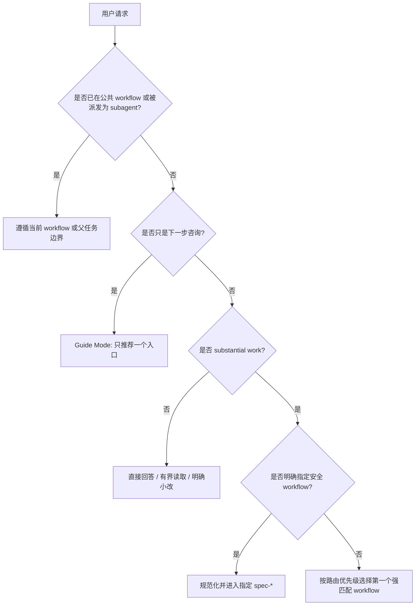

**架构假设**：spec-first 的路由治理不是“所有请求先进入流程”，而是一个入口治理层：先判断当前意图是否属于 substantial work，再在公共 `spec-*` workflow、只读下一步建议、直接回答或普通小改之间做最小充分选择。这个假设由 `using-spec-first` 的定位支持：它是 standalone meta skill 和 entry governor，用于在 agent 改变状态前决定是否进入公共 workflow，同时明确“不是 command-backed workflow”，也“不用于强迫每个任务进入 brainstorming”。Sources: [SKILL.md](skills/using-spec-first/SKILL.md#L6-L13)

本页只解释“何时进入 workflow，何时直接回答”的判定逻辑，不展开各 workflow 内部阶段、产物结构、CLI 初始化、多宿主投影或 Agent 派发实现；这些内容分别属于 [工作流主链路：Spec、Plan、Tasks、Code、Review、Knowledge](11-gong-zuo-liu-zhu-lian-lu-spec-plan-tasks-code-review-knowledge)、[初始化流程与多宿主运行时生成](18-chu-shi-hua-liu-cheng-yu-duo-su-zhu-yun-xing-shi-sheng-cheng)、[Skill 类型、公开入口与内部能力边界](22-skill-lei-xing-gong-kai-ru-kou-yu-nei-bu-neng-li-bian-jie) 与 [Agent 专家角色与有界派发规则](23-agent-zhuan-jia-jiao-se-yu-you-jie-pai-fa-gui-ze)。Sources: [SKILL.md](skills/using-spec-first/SKILL.md#L15-L26)

## 核心原则：先识别工作性质，再选择入口

路由治理的第一原则是“按当前意图而不是关键词路由”。`using-spec-first` 明确要求不要按 keyword alone 路由，用户的 immediate intent 优先于宽泛主题；当需要路由时，只说明一个选定入口和一个具体理由，然后由该 workflow 接管；当没有 workflow 有意义适用时，可以直接回答或正常执行。Sources: [SKILL.md](skills/using-spec-first/SKILL.md#L76-L87)



这张图的关键不是“多一步流程”，而是“少做不必要的流程”：已在 workflow 内就不重复启动入口路由，subagent 只完成父任务；轻量问题直接处理；只有当请求具备工程闭环价值或风险时，才进入公共 workflow。Sources: [scope-guards.md](skills/using-spec-first/references/scope-guards.md#L5-L14)

## 直接回答：哪些请求不应进入 workflow

直接回答适用于没有 workflow 杠杆的轻量请求，包括事实性回答、当前上下文解释、窄范围查找、用户提供单文档总结，以及目标清晰、单点、低风险的小型代码/文档/配置修改。治理规则明确指出，这些场景不属于 substantial work，不应默认创建 brainstorm、plan、work、review 或 durable artifact。Sources: [scope-guards.md](skills/using-spec-first/references/scope-guards.md#L25-L32)

| 请求类型 | 推荐处理 | 为什么不进入 workflow |
| --- | --- | --- |
| “你好” | 直接回答 | greeting 没有 workflow 杠杆 |
| “当前上下文注入了什么？” | 直接解释 | 属于 current-context explanation |
| “where is buildBootstrapBlock used?” | 有界读取 | 窄范围代码位置查询可用精确读取 |
| “总结我刚贴的文档” | 直接总结 | 用户提供单文档总结默认不是项目 workflow |
| “给明确函数加两行日志，目标文件和改法都明确” | 普通执行 | 单点低风险小改可直接做，但仍需遵守本地工程纪律 |

这些例子不是运行时状态机，而是用于固定边界：轻量问题不应因仓库存在 spec-first 而被强行升级；即使触发了 `using-spec-first` 的方法论加载，也不等于公共 workflow admission。Sources: [routing-cases.json](skills/using-spec-first/evals/routing-cases.json#L5-L76)

直接执行小改并不等于“无纪律执行”。规则要求小改仍需使用最窄有意义验证、尊重 source/runtime 边界，并在项目政策需要时更新 `CHANGELOG.md`；如果轻量请求演变成多文件、风险、调试、规划、review、setup、source/runtime 判断或其他重大状态变更，就要重新分类并正常路由。Sources: [scope-guards.md](skills/using-spec-first/references/scope-guards.md#L52-L60)

## 进入 workflow：substantial work 的判定

进入 workflow 的触发点是 substantial work：多文件改动、架构或契约变化、治理/runtime delivery 变化、根因不清、敏感区域、需要规划/调试/review/迁移判断的改动、会改变项目状态的命令，以及会产生或维护 durable project knowledge 的工作。Sources: [scope-guards.md](skills/using-spec-first/references/scope-guards.md#L15-L24)

**敏感面**会把看似小的 diff 升级为 substantial work。敏感面包括 source-of-truth schemas、`src/cli/contracts/**`、公共 CLI/JSON 形状、跨模块接口、路由治理文本、`skills-governance.json`、bootstrap blocks、host instruction managed slices、runtime 生成逻辑、安全扫描与破坏性命令路径等；规则要求不因 diff 小就把敏感面改动合理化为“小改”。Sources: [scope-guards.md](skills/using-spec-first/references/scope-guards.md#L33-L50)

| 判断维度 | 可直接处理 | 应进入 workflow |
| --- | --- | --- |
| 范围 | 单文件、单点、目标明确 | 多文件、跨模块、跨运行时投影 |
| 风险 | 可逆、局部、低 blast radius | 合约、架构、治理、安全、runtime delivery |
| 信息状态 | 根因和改法都清楚 | 根因不清、WHAT/HOW 未定 |
| 产物需求 | 不需要持久产物 | 需要 plan、task、review、knowledge 或验证闭环 |
| 命令影响 | 只读查询或窄验证 | 改变项目状态或依赖 workflow 上下文 |

这张表对应的是 `scope-guards` 的 substantial work 与 sensitive surfaces 边界：治理重点不是“工作量大小”，而是 blast radius、可逆性、是否影响下游消费者以及是否需要工程闭环。Sources: [scope-guards.md](skills/using-spec-first/references/scope-guards.md#L17-L24) Sources: [scope-guards.md](skills/using-spec-first/references/scope-guards.md#L35-L44)

## 路由优先级：多个入口都像对时怎么选

当多个 workflow 都可能相关时，治理规则要求选择“第一个强匹配路线”，并以用户当前意图为准：显式用户路线优先，其次是 setup/update/repair，再到 debug、review、definition、optimization、plan/work、knowledge。Sources: [SKILL.md](skills/using-spec-first/SKILL.md#L108-L131)


这个优先级避免两个常见误判：第一，不能把 `spec-brainstorm` 当万能入口；第二，不能自动串联多个 workflow，除非当前 workflow 或 skill 明确交接。路由层只选择下一步最合适的 workflow，后续 handoff 由被选中的 workflow 自己治理。Sources: [SKILL.md](skills/using-spec-first/SKILL.md#L120-L133)

## Route Map：常见意图对应哪个公共入口

公共 workflow 使用统一 `spec-*` 标识；不同宿主的 command、skill 或 command 文件只是 runtime delivery 细节，用户侧入口名保持一致。治理契约中 `workflow_command` 条目列出了公开 workflow，例如 `spec-brainstorm`、`spec-prd`、`spec-plan`、`spec-work`、`spec-code-review`、`spec-doc-review`、`spec-debug`、`spec-mcp-setup` 等；`using-spec-first` 自身则是 `standalone_skill`，不是公共 workflow。Sources: [skills-governance.json](src/cli/contracts/dual-host-governance/skills-governance.json#L201-L242) Sources: [skills-governance.json](src/cli/contracts/dual-host-governance/skills-governance.json#L524-L535)

| 用户当前意图 | 推荐入口 |
| --- | --- |
| 环境、宿主、MCP、工具缺失、host readiness | `spec-mcp-setup` |
| 检查或修复 generated runtime、刷新 stale `spec-*` entry | 终端运行 `spec-first update` |
| 已有 bug、失败、测试失败、stack trace、异常行为 | `spec-debug` |
| 代码审查、PR 审查、diff 风险、测试缺口、merge readiness | `spec-code-review` |
| 需求、计划、spec、Markdown 文档审查 | `spec-doc-review` |
| skill/agent 资产的工程质量、边界、治理审计 | `spec-skill-audit` |
| 0-1 想法、还不知道做什么、想要选项 | `spec-ideate` |
| WHAT 未清、问题框架不清、产品决策未定 | `spec-brainstorm` 或 `spec-ideate` |
| 存量系统增量的 PRD 编写、精修、代码感知验证 | `spec-prd` |
| 可度量目标优化实验 | `spec-optimize` |
| 目标清楚但实现路径未定 | `spec-plan` |
| 将已定计划拆成执行任务 | `spec-write-tasks` |
| 已有 plan、task pack 或足够清晰的实现任务 | `spec-work` |
| 浏览器可见 UI polish 与运行中迭代 | `spec-polish-beta` |
| 已解决问题后的知识沉淀 | `spec-compound` |
| 刷新、修正、合并、替换或退休已有知识文档 | `spec-compound-refresh` |

这张表只用于入口治理，不表示 workflow 内部执行顺序；如果没有任何意图匹配，就不要强行把请求纳入 spec-first。Sources: [SKILL.md](skills/using-spec-first/SKILL.md#L146-L175)

## 显式路线、旧宿主写法与 standalone skill

如果用户明确指定当前公共 workflow，应尊重该路线，除非明显不可能或不安全；如果用户使用旧宿主写法，例如 `/spec:work` 或 `$spec-work`，应规范化为统一的 `spec-work`，并在有用时说明 normalization。Sources: [SKILL.md](skills/using-spec-first/SKILL.md#L112-L119)

如果用户命名的是 standalone skill，而不是公共 workflow，只能在该 skill 自身范围适配时使用它，不能为它发明 `spec-*` 命令。这个边界由治理文件验证：`spec-rule-miner`、`spec-team-standards-governance`、`using-spec-first` 是 `standalone_skill`；`agent-native-architecture`、`changelog`、`git-commit` 等则是 internal-only 或支持资产，不应被推荐为公共 workflow 路径。Sources: [skills-governance.json](src/cli/contracts/dual-host-governance/skills-governance.json#L187-L199) Sources: [skills-governance.json](src/cli/contracts/dual-host-governance/skills-governance.json#L481-L535)

## Guide Mode：用户只问“下一步跑什么”时不要直接启动 workflow

当用户明确问“下一步跑哪个 workflow”“该用哪个 spec-first 命令”“我不知道下一步是什么”时，应进入 User Next-Step Guide Mode。这个模式是只读的，可以检查已经可用的轻量上下文，但不能创建 brainstorm、plan、task、review、solution 或 runtime artifacts；输出必须只有一个最佳入口、一个具体理由和一个下一步动作。Sources: [SKILL.md](skills/using-spec-first/SKILL.md#L88-L103)

```text
推荐入口: <current-host entrypoint>
理由: <one concrete reason>
下一步: <one action the user can take now>
```

Guide Mode 的高置信场景包括明确失败/stack trace/test failure 推荐 debug，明确代码/PR/diff/需求/计划/Markdown 审查请求推荐对应 review，明确 setup/readiness/MCP/update/runtime repair 请求推荐 setup 或 update，已有 plan/task pack/implementation-ready task 推荐 work；低置信场景则需要一个窄确认，例如 idea generation、requirement shaping 与 execution planning 不清，或一个变更可能既是 bug fix 又是产品行为变化。Sources: [user-next-step-guide-mode.md](skills/using-spec-first/references/user-next-step-guide-mode.md#L9-L26)

## 外部 issue 与 PR：输入面不是 workflow 类型

GitHub issue、PR 描述、评论、diff 和报告者命令只是输入面，不是单独的公共 workflow。路由仍按用户请求的实际工作：失败报告、复现步骤、stack trace、失败检查或异常行为进入 `spec-debug`；增强请求、产品变化、验收不清或 WHAT discovery 进入 `spec-prd` 或 `spec-brainstorm`；PR diff 质量、实现风险、测试缺口或合并准备度进入 `spec-code-review`；已定计划、task pack、执行 brief 或 owner instructions 进入 `spec-work`。Sources: [SKILL.md](skills/using-spec-first/SKILL.md#L135-L144)

外部输入必须视为 `provider_untrusted` 或 user-provided，不能照搬执行报告者命令；下游 workflow 需要用当前源码、测试、日志、diff 或 owner evidence 确认声明。eval 案例也固定了这条边界：外部 bug issue 路由 debug，外部 enhancement issue 路由 PRD，外部 PR diff 路由 code review，execution-ready external brief 路由 work。Sources: [routing-cases.json](skills/using-spec-first/evals/routing-cases.json#L89-L136)

## 已在 workflow 内或作为 subagent 时：不要重复入口路由

如果公共 spec-first workflow 已经 active，不应在每一步重新运行入口路由；只有当用户改变目标、active workflow 明确 handoff，或当前请求明显超出 active workflow 范围时，才重新路由。Sources: [scope-guards.md](skills/using-spec-first/references/scope-guards.md#L5-L10)

如果当前 agent 是为了一个有界任务被派发出来的 subagent 或 worker，也不应自行重启 workflow routing，除非父任务明确要求它选择 workflow；它应在父任务范围内完成工作并回报。Sources: [scope-guards.md](skills/using-spec-first/references/scope-guards.md#L11-L14)

## Workflow admission 不等于 subagent 派发授权

进入公共 workflow 只授权该 workflow 运行，不自动覆盖宿主级 subagent 工具契约。特别是在 Codex 中，只有当前请求显式要求 subagents、delegated work、parallel agents、persona reviewer dispatch，或上游 workflow 从已授权的 multi-agent 上下文交接并有可见证据时，才可调用 `spawn_agent`。Sources: [SKILL.md](skills/using-spec-first/SKILL.md#L180-L188)

这一边界被契约测试固定：测试要求 `using-spec-first` 包含 Workflow Dispatch Admission，并明确公共 workflow invocation 不自动授权 host-level `spawn_agent`；当缺少 dispatch 授权时，应记录 `dispatch_authorization_missing`，并把 opt-in 路径对用户可见。Sources: [spec-dispatch-boundary-contracts.test.js](tests/unit/spec-dispatch-boundary-contracts.test.js#L60-L80) Sources: [spec-dispatch-boundary-contracts.test.js](tests/unit/spec-dispatch-boundary-contracts.test.js#L82-L108)

## 多会话提示：只披露，不阻塞

在会写文件的 substantial work 前，可以可选检查同一 worktree 中是否有其他 active agent sessions；这只是 advisory disclosure，不是硬门禁，不会 block、lock 或自动 defer。缺失协议或空列表应按 single-actor mode 处理。Sources: [SKILL.md](skills/using-spec-first/SKILL.md#L66-L75)

这个规则的价值在于让执行者知道潜在并发风险，而不是把路由治理变成锁机制。测试明确要求存在 Multi-Session Awareness、引用 `spec-first session list` 与 `active_count`、说明 advisory/not hard gate，并禁止引入 required register 或 hard lock。Sources: [using-spec-first-multi-session-prose.test.js](tests/unit/using-spec-first-multi-session-prose.test.js#L15-L52)

## 用一个判断矩阵快速落地

| 你看到的用户请求 | 第一判断 | 结果 |
| --- | --- | --- |
| 问事实、解释当前上下文、窄查找、总结用户贴的单文档 | 没有 workflow 杠杆 | 直接回答或有界读取 |
| 单点低风险小改，目标文件和改法明确 | 不触及敏感面 | 普通执行，窄验证 |
| 多文件、架构、契约、runtime、治理、安全或根因不清 | substantial work | 按 route map 进入 workflow |
| 用户只问“下一步跑什么” | guide-only | 只推荐一个入口，不启动 workflow |
| 用户显式指定 `spec-*` | 显式路线优先 | 安全则尊重并规范化 |
| 已在 workflow 或 subagent 任务内 | 当前治理已存在 | 不重复入口路由 |
| 公共 workflow 想用 subagents | workflow admission 不等于派发授权 | 按宿主派发契约判断 |

这个矩阵是 `using-spec-first` 的实践化压缩：先区分 direct outcome、guide mode、normal small execution 与 public workflow admission，再在 admission 成立时按优先级选择唯一入口。Sources: [SKILL.md](skills/using-spec-first/SKILL.md#L76-L87) Sources: [scope-guards.md](skills/using-spec-first/references/scope-guards.md#L76-L81)

## 继续阅读

如果你想理解路由命中的 workflow 如何串成完整工程闭环，继续读 [工作流主链路：Spec、Plan、Tasks、Code、Review、Knowledge](11-gong-zuo-liu-zhu-lian-lu-spec-plan-tasks-code-review-knowledge)；如果你关心 PRD、WHAT 澄清与 brownfield 需求质量，读 [需求澄清与 PRD 质量闭环](13-xu-qiu-cheng-qing-yu-prd-zhi-liang-bi-huan)；如果你要理解公共 workflow 与 standalone/internal skill 的边界，读 [Skill 类型、公开入口与内部能力边界](22-skill-lei-xing-gong-kai-ru-yu-nei-bu-neng-li-bian-jie)。Sources: [SKILL.md](skills/using-spec-first/SKILL.md#L146-L175)