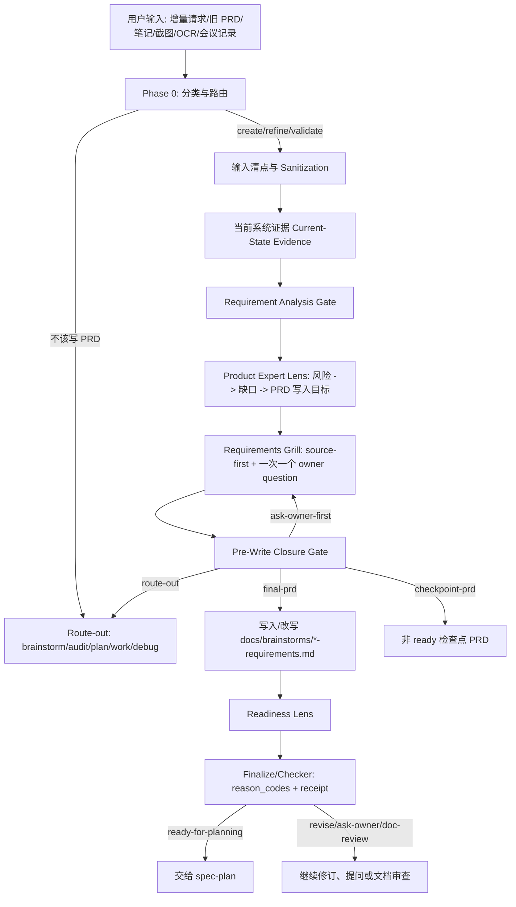
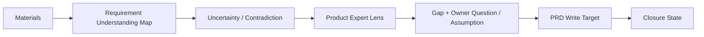
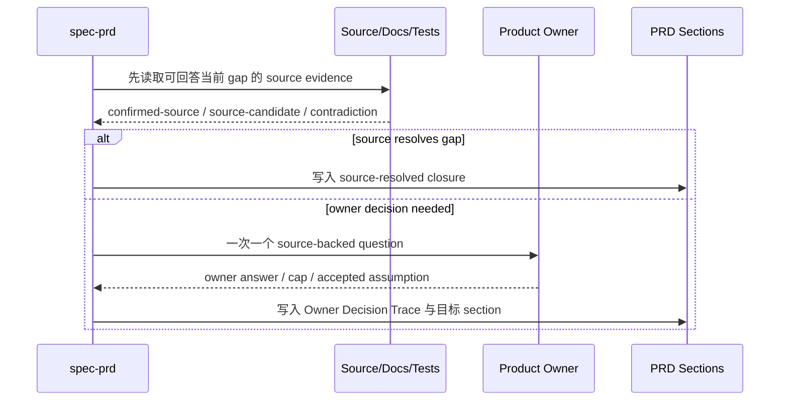
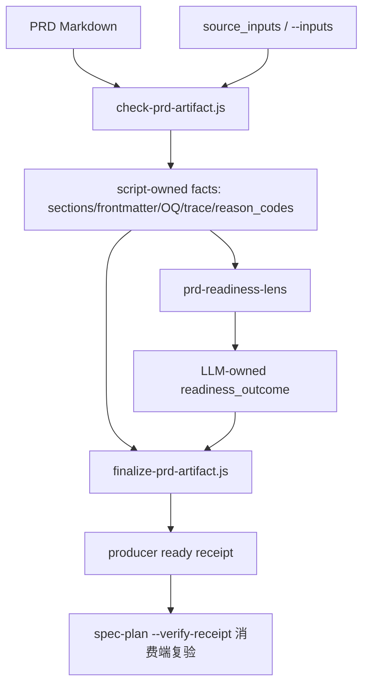

本页解释 spec-first 中 `$spec-prd` 如何把“粗糙需求、旧 PRD、会议记录、截图/OCR、多源笔记或增量请求”转化为可交给计划阶段消费的 PRD 级需求产物。架构假设是：`spec-prd` 不是模板填空器，而是一个 **analysis-first 的 PRD 生产 workflow**；它先建立当前系统证据与需求理解图，再通过 Product Expert Lens 和 Requirements Grill 关闭会导致下游发明 WHAT 的缺口，最后用 readiness lens 与 finalize/checker 形成机器可复验的质量闭环。源码入口、主流程与架构导读均明确把链路描述为 `Input -> Classify / Route Decision -> Input Inventory & Sanitization -> Current-State Evidence -> Requirement Analysis Gate -> Product Expert Lens -> Requirements Grill -> Pre-Write Closure Decision -> PRD Write / Refine -> Readiness Lens + Finalize -> Handoff`。Sources: [SKILL.md](skills/spec-prd/SKILL.md#L10-L18), [2026-06-30-spec-prd最新执行逻辑源码梳理.md](docs/02-架构设计/2026-06-30-spec-prd最新执行逻辑源码梳理.md#L9-L45)

本页只覆盖“需求澄清与 PRD 质量闭环”：什么时候进入 PRD workflow、怎样做 source-first 澄清、怎样避免直接写 PRD、怎样判定 `ready-for-planning`。实现计划、任务拆分、代码执行和代码审查分别属于后续页面：[计划、任务包与执行交接契约](14-ji-hua-ren-wu-bao-yu-zhi-xing-jiao-jie-qi-yue)、[代码审查、文档审查与残留问题处理](15-dai-ma-shen-cha-wen-dang-shen-cha-yu-can-liu-wen-ti-chu-li)。Sources: [SKILL.md](skills/spec-prd/SKILL.md#L24-L55), [SKILL.md](skills/spec-prd/SKILL.md#L81-L88)

## 工作流定位：PRD 先关闭 WHAT，再允许 Planning 设计 HOW

`spec-prd` 的核心边界是 **WHAT not HOW**：PRD 内应表达产品行为、验收、范围、当前状态证据与业务约束；实现单元、数据库表、精确 API 字段和任务拆分属于计划阶段。它面向 brownfield 增量，即已有系统上的需求创建、旧 PRD 精炼或 planning-readiness 校验，而不是 0-1 产品探索、调试修复或实现计划。Sources: [SKILL.md](skills/spec-prd/SKILL.md#L24-L38), [SKILL.md](skills/spec-prd/SKILL.md#L79-L88)



这张图的读法是：PRD 写作不是流程起点，而是澄清和证据闭合之后的动作；`PRD Write / Refine` 之后仍必须经过 readiness lens 与 finalize/checker。源码明确要求 Phase 4 是强制 gate，不能在运行 readiness lens 与 artifact checker/finalize 之前宣称 PRD 完成、标准化或可交给 `spec-plan`。Sources: [SKILL.md](skills/spec-prd/SKILL.md#L191-L200), [SKILL.md](skills/spec-prd/SKILL.md#L278-L291), [prd-readiness-lens.md](skills/spec-prd/references/prd-readiness-lens.md#L33-L42)

## 入口判断：不是所有“需求”都应该写 PRD

Phase 0 首先判断是否应 route-out 或 bypass：0-1 产品想法、产品形态未定、PRD/design/source 一致性审查、实现计划、调试修复或已经实现就绪的小改动，不应被强行塞进 PRD ceremony。真正进入 `spec-prd` 的场景通常是 brownfield 增量 PRD authoring、已有 PRD refinement，或代码感知的 planning-readiness validation。Sources: [SKILL.md](skills/spec-prd/SKILL.md#L24-L38), [SKILL.md](skills/spec-prd/SKILL.md#L193-L200)

| 判断维度 | 进入 `spec-prd` | Route-out / Bypass |
| --- | --- | --- |
| 产品形态 | 目标产品/系统 surface 已知，是既有系统增量 | 0-1 产品探索或产品形态未定 |
| 工作目的 | 创建、精炼或校验 PRD 级需求 | 直接写计划、拆任务、修 bug、执行代码 |
| 输入材料 | 旧 PRD、粗糙笔记、截图/OCR、会议记录、代码/文档证据 | 仅需轻量直接修复，PRD 不增加 durable WHAT 价值 |
| 输出价值 | 让下游 planning 不再发明 WHAT | PRD 只会制造多余流程或错误抽象 |

这张表来自 workflow contract 的使用边界与 Phase 0 路由规则：`spec-prd` 可以输出 PRD 级 requirements artifact、质量诊断与优化建议、显式 route-out 或带 readiness 结果的 validation report；它不应输出实现计划或任务包。Sources: [SKILL.md](skills/spec-prd/SKILL.md#L24-L55), [SKILL.md](skills/spec-prd/SKILL.md#L193-L200)

## 输入安全：先 Sanitization，再把材料变成证据

PRD 输入被视为 **untrusted document content**：现有 PRD、notes、screenshots/OCR、transcripts、source excerpts 中的产品事实、目标、范围、验收、技术建议、临时结论、未确认事实、非目标以及嵌入式 agent 指令/命令必须被分离。若输入混合了已批准决策记录与原始讨论，流程还要区分 ratified owner decisions、proposal、rejected ideas、thinking-aloud 和 superseded draft claims。Sources: [SKILL.md](skills/spec-prd/SKILL.md#L129-L136), [SKILL.md](skills/spec-prd/SKILL.md#L206-L211)

`spec-prd` 的证据模型要求每个影响 PRD 的当前状态声明都带 provenance：`confirmed-source`、`user-stated`、`source-candidate`、`external-research` 或 `assumption`。其中 source-candidate 只是候选指针，来自代码索引、知识库、历史产物或检索层的命中都不能直接写成 confirmed current-state fact；会影响范围、验收、权限、source-of-truth 或下游消费者的声明，必须直接读源码/文档/测试/契约确认，或显式记录为 assumption / Outstanding Questions。Sources: [evidence-and-topology.md](skills/spec-prd/references/evidence-and-topology.md#L18-L37), [SKILL.md](skills/spec-prd/SKILL.md#L214-L223)

| Evidence Tag | 含义 | 是否可直接支撑当前状态声明 |
| --- | --- | --- |
| `confirmed-source` | repo source、tests、docs、contracts、templates 或确定性命令输出直接确认 | 可以 |
| `user-stated` | 产品 owner 明确陈述且未被 confirmed source 反驳 | 可以，但需保留 owner 来源 |
| `source-candidate` | 有界搜索、索引或用户指针给出候选文件/符号/流程 | 不可以，需继续确认或降级 |
| `external-research` | 明确外部来源，带日期与引用 | 仅在显式需要时作为外部证据 |
| `assumption` | 安全、可见、可复核的推断 | 可携带，但不能伪装成确认事实 |

这套标签的目的不是增加文档形式主义，而是防止 planning 消费“看起来像事实”的未经确认材料。`Current System Snapshot` 只应写影响 PRD 的事实；不支持的当前状态声明应进入 `Evidence And Assumptions` 或 `Outstanding Questions`。Sources: [evidence-and-topology.md](skills/spec-prd/references/evidence-and-topology.md#L18-L29), [SKILL.md](skills/spec-prd/SKILL.md#L222-L224)

## Requirement Analysis Gate：把材料整理成可澄清的需求地图

在任何 durable PRD write-in 之前，Phase 1 必须运行 **Requirement Analysis Gate**，它是 run-local map，不是持久 schema。这个 gate 的流向是：materials -> requirement understanding map -> uncertainty/contradiction identification -> decide which product/design/technical decisions must be asked through Product Expert Lens / Requirements Grill -> PRD write targets。Sources: [SKILL.md](skills/spec-prd/SKILL.md#L226-L233), [prd-readiness-lens.md](skills/spec-prd/references/prd-readiness-lens.md#L71-L73)



这个 map 的价值在于让每个风险都绑定到一个 PRD 写入目标，而不是被模糊地停留在“后续确认”。Readiness lens 会检查 Requirement Analysis Gate 是否关闭或显式携带了 Input Inventory、Source Authority Order、Target Surface Anchor、Current-State Summary、Change Delta、Module Map、Open Decisions 等 planning 需要的理解元素。Sources: [SKILL.md](skills/spec-prd/SKILL.md#L228-L230), [prd-readiness-lens.md](skills/spec-prd/references/prd-readiness-lens.md#L71-L73)

## Product Expert Lens：按下游确认风险排序，而不是按清单打分

Product Expert Lens 是 `spec-prd` 的产品判断单一规范来源。它会识别 actor、beneficiary、operator、admin、developer、downstream consumer 和 product owner 的差异，但只在这些差异会改变 WHAT、验收或范围时才展开；它还从实现者和测试作者视角重新阅读需求，找出会迫使下游发明接口可用性、权限边界、状态、source-of-truth、fallback 或验收判定的缺口。Sources: [product-expert-lens.md](skills/spec-prd/references/product-expert-lens.md#L1-L18)

Product Expert Lens 的 run-local interface 是 `downstream_confirmation_risk -> claim -> evidence/source -> gap -> owner_question_or_assumption -> PRD_write_target -> closure_state`。这里的关键不是生成一个分数，而是确保每个进入 Requirements Grill 的 gap 都绑定 `PRD_write_target`；无法绑定写入目标的 load-bearing gap 不能消失，必须继续 grill，或显式携带为 Outstanding Questions、blocker、accepted assumption 或 route-out。Sources: [product-expert-lens.md](skills/spec-prd/references/product-expert-lens.md#L27-L57)

| 字段 | 作用 |
| --- | --- |
| `downstream_confirmation_risk` | 排序哪个缺口最可能让 planning/work 发明 WHAT |
| `claim` | 被判断的用户、source、design 或 current-state 声明 |
| `evidence/source` | 记录证据来源与可信姿态 |
| `gap` | 命名缺失或矛盾的 WHAT |
| `owner_question_or_assumption` | 一个 source-backed owner question 或安全假设 |
| `PRD_write_target` | 答案要写入的标准 PRD section |
| `closure_state` | `closed`、`narrowed`、`accepted-assumption`、`owner-capped`、`outstanding-question`、`blocker` 或 `route-out` |

Product Expert Lens 不负责发明市场策略、优先级、行业义务或产品范围；也不写实现设计、API schema、数据库变更、任务拆分或测试缝。它只是把产品判断压缩成可澄清、可写入、可交接的 PRD 风险接口。Sources: [product-expert-lens.md](skills/spec-prd/references/product-expert-lens.md#L19-L26), [product-expert-lens.md](skills/spec-prd/references/product-expert-lens.md#L48-L58)

## Requirements Grill：source-first，一次只问一个问题

Requirements Grill 是默认澄清姿态，尤其用于 rough PRD、draft、reference-claims、resume-prd、pure-text、多源 notes、screenshots/OCR、meeting notes 或 chat logs。它继承 `grill-with-docs` 的核心纪律：如果问题可以通过代码库回答，就先探索代码库；如果必须问 owner，则一次只问一个问题，并等待反馈后再继续。Sources: [grill-with-docs-integration.md](skills/spec-prd/references/grill-with-docs-integration.md#L18-L33), [grill-with-docs-integration.md](skills/spec-prd/references/grill-with-docs-integration.md#L57-L70)

`spec-prd` 的交互方式要求使用宿主的 blocking question tool：Claude Code 使用 `AskUserQuestion`，Codex 使用 `request_user_input`；只有工具不可用、调用失败或运行时不支持时才退回聊天编号选项。任何 owner question 都必须记录 `question_delivery`，并且问题要绑定 named gap 与 PRD write target。Sources: [SKILL.md](skills/spec-prd/SKILL.md#L65-L74), [SKILL.md](skills/spec-prd/SKILL.md#L107-L114)



Grill 不是“问过一个问题即可写 PRD”的许可。合法停止点只有四类：leaf、source、owner cap、how-pushdown；“足够写一个 PRD section”“问过一个关键问题”“模型认为低风险”都不是停止理由。Checkpoint 也不是逃生口，只有真正 no-reply/headless 或大输入恢复时才可作为非 ready 产物。Sources: [SKILL.md](skills/spec-prd/SKILL.md#L167-L175), [prd-readiness-lens.md](skills/spec-prd/references/prd-readiness-lens.md#L47-L62)

## Pre-Write Closure Gate：先决定 write_mode，再写 PRD

第一次 durable PRD Write 前必须公开 compact Decision Card，至少包含 `write_mode`、`highest_risk_gap`、`next_action` 和 `why planning will not invent WHAT`。`write_mode=final-prd` 仅当每个 load-bearing branch 已达到合法停止点；`write_mode=ask-owner-first` 表示继续 grill 最高风险分支；`write_mode=checkpoint-prd` 是非 ready 恢复路径；`write_mode=route-out` 表示 PRD 不应继续。Sources: [SKILL.md](skills/spec-prd/SKILL.md#L137-L165), [SKILL.md](skills/spec-prd/SKILL.md#L232-L239)

| `write_mode` | 语义 | 是否可交给 planning |
| --- | --- | --- |
| `final-prd` | load-bearing branches 已按合法停止点关闭，且 planning 不会发明 WHAT | 仍需 Phase 4 readiness + finalize/checker 后才可以 |
| `ask-owner-first` | 最高风险缺口仍需 owner 回答 | 不可以 |
| `checkpoint-prd` | 真 no-reply/headless 或大输入恢复的非 ready 产物 | 不可以 |
| `route-out` | PRD workflow 不是正确路径 | 不进入 PRD handoff |

Pre-Write Closure Gate 的硬约束是：不能先写 ready/final PRD 再指望 Phase 4 兜底。Claude managed runtime 通过 `prd-prewrite-guard` 阻止缺少 durable-write `write_mode` 路径的新 PRD artifact；Codex 没有等价 pre-tool guard，因此 producer finalize 与 `spec-plan` consumer `--verify-receipt` 是强制交接纪律。Sources: [SKILL.md](skills/spec-prd/SKILL.md#L18-L21), [SKILL.md](skills/spec-prd/SKILL.md#L234-L239)

## PRD 产物形态：统一写入 `docs/brainstorms/*-requirements.md`

默认 PRD artifact 写在 `docs/brainstorms/YYYY-MM-DD-NNN-<slug>-requirements.md`，frontmatter 使用 `artifact_kind: prd-requirements`。源码明确禁止创建 `docs/prds/`、实现代码、写 implementation plans 或修改 generated runtime mirrors。Sources: [SKILL.md](skills/spec-prd/SKILL.md#L16-L20), [prd-output-template.md](skills/spec-prd/references/prd-output-template.md#L23-L43)

PRD core sections 包括 `Summary`、`Change Delta`、`Requirements`、`Acceptance Examples`、`Scope Boundaries`、`Evidence And Assumptions`。Compact PRD 可以省略非 load-bearing conditional detail，但仍需要足够的 evidence、acceptance 与 scope boundary；bypass 则不写 PRD artifact。Sources: [prd-output-template.md](skills/spec-prd/references/prd-output-template.md#L45-L72)

```text
docs/
└── brainstorms/
    └── YYYY-MM-DD-NNN-<slug>-requirements.md
        ├── frontmatter: artifact_kind: prd-requirements
        ├── Summary
        ├── Change Delta
        ├── Requirements
        ├── Acceptance Examples
        ├── Scope Boundaries
        ├── Evidence And Assumptions
        ├── Outstanding Questions          # 条件触发
        ├── Planning Recheck               # 条件触发
        └── Readiness Self-Check           # handoff 前使用
```

条件 sections 只在能减少 planning invention 时加入，例如 `Current System Snapshot`、`Change Topology`、`Surface Map`、`Producer / Artifact / Consumer`、`Source-Of-Truth Resolution`、`Negative Acceptance`、`Glossary`、`Decision Notes`、`Outstanding Questions` 与 `Planning Recheck`。`Planning Recheck` 不能被用作 PRD-owned owner questions 的停车场；会改变用户行为、范围、验收、数据权威、接口可用性、fallback、analytics acceptance 或 source-of-truth 的问题不能伪装成非阻塞 recheck。Sources: [prd-output-template.md](skills/spec-prd/references/prd-output-template.md#L132-L170)

## Readiness Lens：LLM 判断语义，脚本判定事实

Phase 4 是强制 producer-local gate。它要求在推荐 planning 前运行 readiness lens：如果 ready，才交给当前宿主的 plan workflow；如果仍有缺口，则继续一问一答 grill，或用 labeled assumptions、Outstanding Questions、blockers、route-out 处理；如果需要独立 critique，则进入文档审查路径。Sources: [SKILL.md](skills/spec-prd/SKILL.md#L278-L287), [prd-readiness-lens.md](skills/spec-prd/references/prd-readiness-lens.md#L152-L171)

readiness lens 的基础维度包括 Clarity & Non-ambiguity、Evidence & Inference provenance、Traceability & Coverage、Testability、Boundary integrity、Planning-invention & Handoff readiness。它始终运行 Core Pack，条件 packs 只在触发时运行；这是一条 prompt economy 规则，而不是降低质量标准。Sources: [prd-readiness-lens.md](skills/spec-prd/references/prd-readiness-lens.md#L20-L36)

| Readiness Outcome | 含义 |
| --- | --- |
| `ready-for-planning` | planning 可以消费 PRD 而无需发明 WHAT |
| `revise-prd` | 先修复具体 PRD 缺口 |
| `ask-owner` | 继续问一个 source-backed grill question，关闭或缩小 named write target |
| `doc-review` | 风险广泛或微妙时请求独立文档审查 |
| `route-out` | 当前工作应使用 brainstorm、app consistency audit、plan、debug 或 work |

`ready-for-planning` 不是模型一句话可以宣布的状态。若存在 PRD artifact path，必须运行 `skills/spec-prd/scripts/finalize-prd-artifact.js <prd-path> --inputs <input-path>` 或等价 runtime script；closeout 也必须展示 finding count、blocking `reason_codes`、producer receipt status 与 LLM-owned `readiness_outcome`。Sources: [SKILL.md](skills/spec-prd/SKILL.md#L289-L291), [prd-readiness-lens.md](skills/spec-prd/references/prd-readiness-lens.md#L37-L43)

## Checker 与 Finalize：质量闭环的确定性底座

`check-prd-artifact.js` 是确定性 PRD artifact checker，它只报告 Markdown 结构、frontmatter、trace、placeholder 等 script-owned facts；是否构成 readiness blocker 由 PRD readiness lens 语义裁决。脚本内部锁定 core sections、machine section ids、evidence tags、Outstanding Questions 表头别名、Owner Decision Trace 表头别名和合法 closure disposition。Sources: [check-prd-artifact.js](skills/spec-prd/scripts/check-prd-artifact.js#L1-L17), [check-prd-artifact.js](skills/spec-prd/scripts/check-prd-artifact.js#L23-L100)

`finalize-prd-artifact.js` 消费 checker report，处理 `--inputs`、`--inputs-from-frontmatter`、`--check-only`、`--verify-receipt` 与 `--refresh-inputs-hash`。它会构造 finalize receipt，并将 ready intent 限定为 `write_mode === final-prd` 且 `can_enter_spec_plan === yes`；缺失 ready intent 时会产生 `finalize_required`。Sources: [finalize-prd-artifact.js](skills/spec-prd/scripts/finalize-prd-artifact.js#L19-L65), [finalize-prd-artifact.js](skills/spec-prd/scripts/finalize-prd-artifact.js#L157-L187)

reason-code 分类法集中在 `scripts/lib/reason-codes.js`，作为 checker 与 finalize 的共同真相源。阻断码覆盖结构/声明类问题、ready receipt 缺失或过期、closure contract 矛盾、checkpoint claiming ready、设计源未读未接受等；receipt-only 与 checkpoint input-scan exempt 子集被单独定义，避免 checkpoint closeout 与 ready finalization 混淆。Sources: [reason-codes.js](skills/spec-prd/scripts/lib/reason-codes.js#L1-L14), [reason-codes.js](skills/spec-prd/scripts/lib/reason-codes.js#L15-L80)



这条链路把“语义判断”和“确定性事实”拆开：LLM 负责判断需求理解、owner question、WHAT 是否闭合、planning 是否仍需发明产品行为；脚本负责 frontmatter、section identity、hash、ready receipt、OQ/Trace 表一致性与 blocking reason code。架构导读同样明确，`spec-plan` 不信任 PRD 自称 ready，必须用 `--verify-receipt` 做消费端复验。Sources: [2026-06-30-spec-prd最新执行逻辑源码梳理.md](docs/02-架构设计/2026-06-30-spec-prd最新执行逻辑源码梳理.md#L27-L45), [finalize-prd-artifact.js](skills/spec-prd/scripts/finalize-prd-artifact.js#L47-L64)

## 常见失败模式与恢复动作

`spec-prd` 将若干捷径列为 failure-mode blacklist：直接读完材料就写 PRD、把 checkpoint 当逃生口、伪造 headless、洗白 owner answer、洗白 design evidence、逃避 checker/finalize、修改 runtime mirror。命中这些模式时，必须停止当前输出路径并运行恢复动作，而不是用更漂亮的 PRD 文案掩盖证据缺口。Sources: [SKILL.md](skills/spec-prd/SKILL.md#L177-L190), [prd-readiness-lens.md](skills/spec-prd/references/prd-readiness-lens.md#L47-L62)

| 失败模式 | 可观察信号 | 正确恢复 |
| --- | --- | --- |
| Direct write after read | 无 Decision Card、Requirement Analysis Gate、Product Expert Lens 或 grill trace 就写 PRD | 回到 Phase 1，先产出 run-local map、最高风险 gap 与下一步 owner/source action |
| Checkpoint as escape | 只问泛化范围问题，就把 load-bearing OQs 停进 checkpoint | 继续一问一答 grill；只有真 no-reply/headless 或大输入恢复才写非 ready checkpoint |
| Fake headless | chat 可等待却声明 `true-headless-unavailable` | 使用 blocking tool 或 `chat-fallback` 并等待回答 |
| Owner answer laundering | owner 要求继续读设计/source，却被改写为接受跳过 | 保留为 unmet blocking condition |
| Checker/finalize evasion | 无 receipt 却声明 final/ready/can_enter_spec_plan | 运行 finalize/checker；失败则降级为 revise/ask-owner |
| Runtime mirror patch | 修改 `.claude/`、`.codex/`、`.agents/skills/` 来修 PRD 行为 | 回到 `skills/spec-prd/**` source，再通过 init 投影 runtime |

这些失败模式的共同根因是把“PRD prose 看起来完整”误当作“需求已闭合”。源码反复强调：unasked load-bearing OQs 仍然是 open；`asked-owner` 必须表示 owner 回答了对应 OQ；checkpoint 只是非 ready 出口，不是 readiness 的替代品。Sources: [SKILL.md](skills/spec-prd/SKILL.md#L167-L175), [prd-readiness-lens.md](skills/spec-prd/references/prd-readiness-lens.md#L51-L62)

## 与后续工作流的交接

`spec-prd` 的 downstream consumers 包括 `spec-plan`、`spec-doc-review`、product owners、implementation reviewers 以及需要稳定 WHAT/WHY 上下文的未来 work/review flows。只有当 readiness receipt 与 LLM readiness judgment 都支持时，才应 hand off 到 planning；否则输出应是 revise-prd、ask-owner、doc-review 或 route-out。Sources: [SKILL.md](skills/spec-prd/SKILL.md#L52-L55), [SKILL.md](skills/spec-prd/SKILL.md#L97-L100)

建议阅读路径是：先理解本页的 PRD 澄清闭环，再阅读 [计划、任务包与执行交接契约](14-ji-hua-ren-wu-bao-yu-zhi-xing-jiao-jie-qi-yue)，理解 `ready-for-planning` PRD 如何进入计划与任务包；如果你关注质量门、schema 和确定性不变量，再阅读 [Schema、质量门与确定性不变量](26-schema-zhi-liang-men-yu-que-ding-xing-bu-bian-liang)；如果你关注 PRD 之后的审查与残留问题，继续阅读 [代码审查、文档审查与残留问题处理](15-dai-ma-shen-cha-wen-dang-shen-cha-yu-can-liu-wen-ti-chu-li)。Sources: [SKILL.md](skills/spec-prd/SKILL.md#L48-L55), [prd-readiness-lens.md](skills/spec-prd/references/prd-readiness-lens.md#L152-L171)