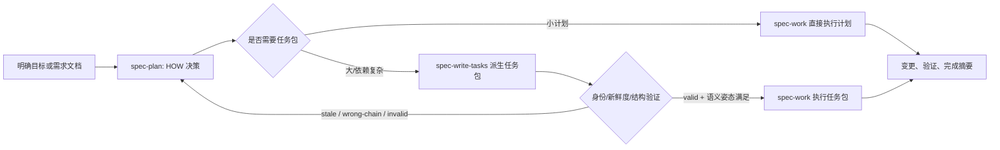

本页解释 spec-first 中从 **计划（spec-plan）** 到 **任务包（spec-write-tasks）** 再到 **执行（spec-work）** 的交接契约：计划负责决定 HOW，任务包是可选的派生执行索引，执行只在范围、身份、新鲜度与结构可验证时接手。它不覆盖需求澄清、代码审查或 CLI 初始化细节；如果你需要理解上游 WHAT，请先读 [需求澄清与 PRD 质量闭环](13-xu-qiu-cheng-qing-yu-prd-zhi-liang-bi-huan)，如果你要理解下游审查，请继续读 [代码审查、文档审查与残留问题处理](15-dai-ma-shen-cha-wen-dang-shen-cha-yu-can-liu-wen-ti-chu-li)。Sources: [SKILL.md](skills/spec-plan/SKILL.md#L10-L18), [SKILL.md](skills/spec-write-tasks/SKILL.md#L8-L15), [SKILL.md](skills/spec-work/SKILL.md#L11-L14)

## 核心假设：计划是源，任务包是索引，执行是受约束的动作

从第一性原理看，这条链路的关键不是“把计划拆得越细越好”，而是维护一个单向权威关系：`spec-plan` 生成可持久化的决策文档，`spec-write-tasks` 只在能降低执行风险或上下文负载时派生任务包，`spec-work` 根据已验证的计划或任务包执行，并在发现 WHAT/HOW 不清、仓库范围不明或任务包不可验证时停止而不是扩张范围。Sources: [SKILL.md](skills/spec-plan/SKILL.md#L20-L27), [SKILL.md](skills/spec-write-tasks/SKILL.md#L56-L65), [SKILL.md](skills/spec-work/SKILL.md#L21-L40)



这张图只表达已验证的契约关系：任务包不是第二份计划，也不是进度状态；它可以重排执行切片，但不能改变范围、验收标准、非目标、仓库所有权或产品决策。`spec-work` 即使消费任务包，也必须把任务包中的 `source_plan` 继续视为范围、需求和非目标的单一来源。Sources: [SKILL.md](skills/spec-write-tasks/SKILL.md#L56-L65), [SKILL.md](skills/spec-work/SKILL.md#L204-L208), [SKILL.md](skills/spec-work/SKILL.md#L210-L214)

## 三层产物的职责边界

| 层级 | 主要入口 | 产物性质 | 可以做什么 | 不能做什么 |
| --- | --- | --- | --- | --- |
| 计划 | `spec-plan` | 持久化 HOW 决策文档 | 记录问题框架、范围、需求追踪、实现单元、文件/测试引用、顺序、风险、假设与交接选项 | 不能实现代码、运行测试作为证明、生成任务包状态或替代未解决的产品澄清 |
| 任务包 | `spec-write-tasks` | 可选的派生执行索引 | 从已定稿本地计划编译任务图、执行波次、任务卡与机器可读契约，或验证已有任务包 | 不能改变计划范围，不能成为进度状态、审批状态、生命周期数据库或第二份计划 |
| 执行 | `spec-work` | 受范围约束的实现过程 | 在当前仓库范围内实现代码/文档/配置变更，运行聚焦验证，输出完成摘要和后续动作 | 不能在 WHAT/HOW 未解决、任务包陈旧/不可验证或范围会扩张时继续执行 |

Sources: [SKILL.md](skills/spec-plan/SKILL.md#L30-L60), [SKILL.md](skills/spec-write-tasks/SKILL.md#L18-L48), [SKILL.md](skills/spec-work/SKILL.md#L17-L47)

这个边界带来的实际开发体验是：中小计划可以直接进入执行；只有当计划过大、依赖链复杂、跨模块文件所有权明显或验证面较宽时，才值得引入任务包。`spec-work` 在读取计划路径时也会把任务包编译作为一次性可选分流，而不是强制状态机。Sources: [SKILL.md](skills/spec-write-tasks/SKILL.md#L77-L83), [SKILL.md](skills/spec-work/SKILL.md#L237-L241), [SKILL.md](skills/spec-work/SKILL.md#L174-L183)

## 计划契约：HOW 决策必须足够可执行，但不能变成代码

`spec-plan` 的核心安全契约是“交接前只规划”：在后置交接选择前，它只能研究、决策、写入或更新计划产物，不能调用实现工具、修改代码/配置/运行时源文件、启动实现工作流，也不能声称实现已经开始。计划完成并审查后，必须给出交接菜单并等待用户明确选择。Sources: [SKILL.md](skills/spec-plan/SKILL.md#L20-L27)

一个合格计划必须让实现者可以自信启动，但不替实现者写代码。它应包含清晰的问题框架和范围边界、需求追踪、仓库相对路径、特性实现单元的测试文件路径、带理由的关键决策、可复用模式、`reuse / extend / new` 决策、高风险触发时的准备度检查、足够具体的测试场景，以及依赖和顺序。Sources: [SKILL.md](skills/spec-plan/SKILL.md#L106-L120)

计划中的实现单元以稳定 U-ID 表示，例如 `### U1. [Name]`；U-ID 在重排、拆分和删除后不重编号，允许出现空洞。这个规则让后续 `spec-work` 和任务包能够稳定引用同一工作单元，避免“第二次编辑计划后任务引用漂移”的问题。Sources: [SKILL.md](skills/spec-plan/SKILL.md#L181-L197), [SKILL.md](skills/spec-plan/SKILL.md#L239-L245), [SKILL.md](skills/spec-work/SKILL.md#L312-L315)

计划可以包含高层技术设计、Mermaid 图、输出结构树或方向性伪代码，但这些内容是为了让审查者验证方案形状，不是实现规范；计划规则明确禁止包含导入、精确方法签名、框架级代码、git 命令、提交信息或测试命令编排。Sources: [SKILL.md](skills/spec-plan/SKILL.md#L198-L223), [SKILL.md](skills/spec-plan/SKILL.md#L318-L329)

## 任务包契约：只在降低风险时派生

`spec-write-tasks` 的输入必须解析到一个本地、源拥有的已定稿计划，或一个已有本地任务包；远程仓库、包名、市场标识符和泛泛任务列表会被拒绝。它的输出不是单一“成功/失败”，而是 `compile`、`skip`、`return-to-plan`、`draft-only` 或 `validate-only` 之一。Sources: [SKILL.md](skills/spec-write-tasks/SKILL.md#L26-L45), [execution-handoff-contract.md](skills/spec-write-tasks/references/execution-handoff-contract.md#L39-L49)

| 分支 | 何时选择 | 下游动作 |
| --- | --- | --- |
| `compile` | 源计划已定稿、任务就绪、有可执行身份，且任务包能显著降低执行风险或上下文负载 | 生成可执行任务包；通常进入 `spec-work-task-pack`，高风险时先审查 |
| `skip` | 计划足够小，直接执行比增加派生层更便宜、更安全 | 不生成任务包，进入 `spec-work-plan` |
| `return-to-plan` | 范围、验收、架构、仓库范围或验证决策缺失 | 不生成可执行任务包，回到计划修订 |
| `draft-only` | 临时切片有助讨论，但身份、哈希或结构不可执行 | 输出非执行草稿，不能交给 `spec-work` |
| `validate-only` | 已有任务包需要验证身份、新鲜度和结构 | 只有 valid 且语义姿态满足时才可执行 |

Sources: [SKILL.md](skills/spec-write-tasks/SKILL.md#L75-L83), [execution-handoff-contract.md](skills/spec-write-tasks/references/execution-handoff-contract.md#L39-L49)

可执行任务包必须写在 `docs/tasks/YYYY-MM-DD-NNN-<type>-<slug>-tasks.md`，并在 frontmatter 中携带 `type: task-pack`、`status: derived`、`spec_id`、`source_plan`、`source_plan_hash`、`generated_by: spec-write-tasks` 和 `mode: derived`。其中 `spec_id` 连接同一 spec 链，`source_plan_hash` 证明任务包仍来自当前源计划正文。Sources: [task-pack-schema.md](skills/spec-write-tasks/references/task-pack-schema.md#L5-L29), [task-pack-schema.md](skills/spec-write-tasks/references/task-pack-schema.md#L31-L60)

任务包正文需要包含 Overview、Source Summary、Traceability Matrix、Task Graph、Execution Waves、Task Pack Contract、Task Cards、Orientation Evidence、Validation Notes 和 Regeneration Rules；当前确定性验证只证明 frontmatter 身份/新鲜度和 `Task Pack Contract` JSON 结构，周边人类可读章节仍是高质量交接要求，但不是 CLI 证明。Sources: [task-pack-schema.md](skills/spec-write-tasks/references/task-pack-schema.md#L69-L83)

## Task Pack Contract：机器可读的执行索引

任务包的 `## Task Pack Contract` 下必须有且仅有一个 fenced JSON 块；验证器不会从自由格式 Markdown 任务卡推断结构。JSON 中的每个任务至少需要 `task_id`、`dependencies`、非空具体 `files`、`goal`、`test_focus`、`done_signal`、`wave`、`stop_if`，并且必须通过 `source_unit` 或 `requirement_refs` 至少锚定一个来源。Sources: [task-pack-schema.md](skills/spec-write-tasks/references/task-pack-schema.md#L131-L166), [task-pack.js](src/cli/task-pack.js#L198-L240)

```json
{
  "schema_version": "task-pack/v1",
  "execution_waves": [
    { "wave": 1, "tasks": ["T001"] }
  ],
  "tasks": [
    {
      "task_id": "T001",
      "source_unit": "U1",
      "requirement_refs": ["R1"],
      "goal": "Validate task pack identity, freshness, and structure.",
      "dependencies": [],
      "files": ["src/cli/task-pack.js"],
      "test_focus": "Valid and stale task pack validation.",
      "done_signal": "Validator tests pass.",
      "wave": 1,
      "review_gate": "required",
      "review_focus": "Review task-pack validator compatibility and source-plan boundary.",
      "stop_if": "Validation requires judging task splitting quality or changing source-plan scope."
    }
  ]
}
```

`files` 必须是具体仓库相对 POSIX 文件路径，不能是绝对路径、反斜杠路径、目录、通配符、`.`、`..`、`...` 或 Windows 非法/保留片段；任务也不能把生成的宿主运行时镜像当作源文件所有权，例如 `.claude/**`、`.codex/**`、`.agents/skills/**` 等。Sources: [task-pack-schema.md](skills/spec-write-tasks/references/task-pack-schema.md#L172-L185), [task-pack-schema.md](skills/spec-write-tasks/references/task-pack-schema.md#L253-L256), [task-pack.js](src/cli/task-pack.js#L247-L275)

`context_refs`、`entry_hint`、`parallelizable`、`expected_side_effects`、`risk_note`、`notes`、`review_gate`、`review_focus`、`handoff_owner` 和 `target_repo` 是质量字段：它们帮助压缩上下文、表达审查意图或保障多仓库安全，但验证器不证明这些字段的语义充分性。Sources: [task-pack-schema.md](skills/spec-write-tasks/references/task-pack-schema.md#L187-L205), [execution-handoff-contract.md](skills/spec-write-tasks/references/execution-handoff-contract.md#L87-L95)

## 身份、新鲜度与结构验证

任务包可执行性的确定性验证由 CLI 完成：在报告 `deterministic_handoff` 和 `validation` 字段前，必须实际运行 `spec-first tasks validate <task-pack-path> --json`；计算或比较源计划哈希时必须运行 `spec-first tasks hash <plan-path>`。如果子命令不可见或哈希不可验证，不能自报确定性交接成功。Sources: [SKILL.md](skills/spec-write-tasks/SKILL.md#L102-L115), [execution-handoff-contract.md](skills/spec-write-tasks/references/execution-handoff-contract.md#L50-L69)

验证器会读取任务包 frontmatter，检查 `type`、`generated_by`、`status`、`mode`，解析 `spec_id`、`source_plan` 和 `source_plan_hash`，确认源计划路径在仓库内存在，读取源计划 frontmatter 的 `spec_id`，并计算当前源计划正文哈希与任务包记录的哈希对比。Sources: [task-pack.js](src/cli/task-pack.js#L405-L491), [task-pack.js](src/cli/task-pack.js#L494-L540)

源计划哈希的规范化规则是：以 UTF-8 读取源计划，规范化换行，若第一行为 `---` 则移除完整 frontmatter 块，对剩余 Markdown 正文精确哈希，不抽取章节、不折叠空白；因此 frontmatter 中的状态或 `spec_id` 不参与新鲜度判断，身份单独校验。Sources: [task-pack.js](src/cli/task-pack.js#L88-L195), [execution-handoff-contract.md](skills/spec-write-tasks/references/execution-handoff-contract.md#L96-L115)

| 验证问题 | 结果分类 | 原因码 |
| --- | --- | --- |
| `spec_id` 与源计划不匹配 | `wrong-chain` | `wrong_chain` |
| `source_plan_hash` 与当前源计划正文不匹配 | `stale` | `stale_hash` |
| 源计划 frontmatter 损坏或哈希不可计算 | `unverifiable` | `unverifiable_hash` |
| 缺失源计划或源计划不存在 | `invalid` 或缺失类错误 | `source_plan_missing` |
| 缺少任务包或源计划 `spec_id` | `invalid` | `missing_spec_id` |
| JSON 契约缺失、歧义或结构错误 | `invalid` | `invalid_contract` |

Sources: [task-pack.js](src/cli/task-pack.js#L378-L403), [task-pack.js](src/cli/task-pack.js#L543-L575)

## 任务组织：波次是分组，不是状态机

任务包可以按 foundation-first、story-first 或 unit-first 组织：有共享 schema、契约、适配器或测试基础设施时先做基础；有用户故事或端到端行为时按可验证故事切片；已有清晰实现单元时保留 U-ID 追踪。任务包不应机械地把每个实现单元转换成一个任务。Sources: [task-pack-schema.md](skills/spec-write-tasks/references/task-pack-schema.md#L257-L274)

一个好的任务通常能在不重读整份计划的情况下启动，触达一个相关文件组，有一个主要验证目标，能解锁依赖或交付独立切片，并且不需要超过五个私有子任务才可执行。任务应在跨无关模块、验证点独立或可并行部分与串行部分混杂时拆分；连续编辑同一文件或实现与测试构成天然闭环时合并。Sources: [task-pack-schema.md](skills/spec-write-tasks/references/task-pack-schema.md#L275-L298)

执行波次只是执行分组，不是生命周期状态：同一波次任务应避免共享文件；如果文件重叠，应序列化到不同波次；隐藏依赖不能藏在波次标签后面。确定性 lint 可以检查任务是否列入唯一匹配波次，以及同波文件重叠是否被消除。Sources: [task-pack-schema.md](skills/spec-write-tasks/references/task-pack-schema.md#L113-L129), [task-pack-schema.md](skills/spec-write-tasks/references/task-pack-schema.md#L300-L319)

## 执行接手：validated task pack 是一等输入，但 source_plan 仍是权威

当 `spec-work` 读取任务包时，它先确认任务包 frontmatter、读取 `source_plan` 并把该计划作为范围、需求和非目标的单一权威；然后读取当前任务卡的 `source_unit`、`requirement_refs`、`context_refs`、`test_focus`、`done_signal` 和 `stop_if`，再回到源计划的相关实现单元、需求/验收引用、范围边界、非目标和实现期未知项。Sources: [SKILL.md](skills/spec-work/SKILL.md#L202-L228)

执行器必须用 `spec-first tasks validate <task-pack-path> --json` 比较任务包哈希与当前源计划；如果工具不可用、任务包是 draft/transient、缺失源计划、缺失身份、身份不匹配、缺失哈希、哈希不可用或哈希不匹配，都必须在实现前拒绝任务包，并要求重跑 `spec-write-tasks` 或回到 `spec-plan`。Sources: [SKILL.md](skills/spec-work/SKILL.md#L215-L223), [SKILL.md](skills/spec-work/SKILL.md#L235-L241)

通过确定性验证仍不等于语义质量充分。`spec-work` 还要检查 `semantic_posture` 与 `dispatch_authorization`：同会话生成且当前哈希匹配的任务包可视为 `generated-this-run`；已有任务包若声明 `reviewed-existing`，需要当前证据元数据或可验证审查来源；`dispatch_authorization: authorized` 需要有界延续引用或文档审查结果引用。Sources: [SKILL.md](skills/spec-work/SKILL.md#L223-L227), [execution-handoff-contract.md](skills/spec-write-tasks/references/execution-handoff-contract.md#L64-L69)

## stop_if 与 review_gate：执行中的停止与审查意图

`stop_if` 是任务级停止条件：如果实现触发了任务卡中的 `stop_if`，执行必须停止并返回 `spec-plan` 或重新生成任务包，不能在原地扩大范围来“顺手解决”。任务包的再生成规则也明确要求当计划、范围、实现单元、文件、验证或手工编辑后的任务语义改变时重建；哈希不匹配或 spec 链不匹配时必须拒绝执行。Sources: [SKILL.md](skills/spec-work/SKILL.md#L227-L228), [task-pack-schema.md](skills/spec-write-tasks/references/task-pack-schema.md#L330-L346)

`review_gate` 是审查意图，不是审批状态或进度状态。`review_gate: required` 表示任务完成检查点：在标记逻辑任务完成、提交该逻辑单元、进入下一波次或进入最终阶段前，需要运行有界 `spec-code-review mode:report-only` 小审查，或明确停止并交接。`review_gate: optional` 则作为最终审查上下文保留，除非本地风险信号需要提前审查。Sources: [SKILL.md](skills/spec-work/SKILL.md#L228-L235), [execution-handoff-contract.md](skills/spec-write-tasks/references/execution-handoff-contract.md#L87-L95)

高风险任务包应推荐 `next_action: review-task-pack`，触发条件包括存在 `review_gate: required`、触及共享契约、公开工作流 prose、source/runtime 边界、安全/发布/CI 表面，或任务/依赖复杂到语义漂移和过度拆分代价较高。默认不能自动派发审查，除非本轮明确授权了 write-tasks 到 doc-review 的单次有界延续。Sources: [execution-handoff-contract.md](skills/spec-write-tasks/references/execution-handoff-contract.md#L70-L86)

## 执行策略：从计划单元或任务卡派生工作队列

`spec-work` 会从计划的实现单元、依赖、文件、测试目标和验证标准，或从任务包的 Task Cards、Execution Waves、dependencies 与 `task_id` 派生内部任务列表；当计划定义 U-ID 时，内部任务主题应保留 U-ID 前缀，以便阻塞点、延迟工作记录和最终摘要仍锚定同一个计划单元。Sources: [SKILL.md](skills/spec-work/SKILL.md#L308-L323), [SKILL.md](skills/spec-work/SKILL.md#L448-L462)

执行策略按规模与依赖选择：1–2 个小任务或需要用户中途互动时内联执行；3 个以上且有依赖时可串行子代理；3 个以上且通过并行安全检查时可并行子代理。并行前必须构建文件到单元映射并检查交集；可靠隔离不可用时，重叠写集应降级为串行。Sources: [SKILL.md](skills/spec-work/SKILL.md#L324-L349)

给子代理的上下文必须包含完整工作文档路径、特定单元/任务的目标、文件、方法、执行提示、模式、测试场景、验证，或任务卡等价字段；共享目录回退时，子代理不得 staging、提交或运行项目测试套件，由编排者统一集成、验证和提交。Sources: [SKILL.md](skills/spec-work/SKILL.md#L351-L363)

## 交接失败时的用户可操作输出

当 `spec-work` 无法安全继续，需要推荐另一个 workflow、任务编译、仓库范围补充、任务包再生成或用户澄清时，不能只说“回到 spec-plan”或给一个裸 workflow 名称；它必须给出阻塞原因、推荐入口、可复制下一步和需要携带的上下文。Sources: [SKILL.md](skills/spec-work/SKILL.md#L174-L197)

```text
Blocking reason: <specific reason execution cannot continue safely>
Recommended entrypoint: <current-host public entrypoint or standalone skill name>
Next action: <copy-ready invocation or short reply phrase>
Context to carry: <plan/task-pack path, failed validation command, stop_if, target_repo gap, or scope evidence when applicable>
```

这份用户可操作输出是交接契约的一部分：它把失败从“模型犹豫”转化为“明确的下一动作”。例如任务包哈希失配时，`Context to carry` 应保留任务包路径、源计划路径和失败的验证命令；多仓库范围不明时，应保留 `target_repo` 缺口；触发 `stop_if` 时，应保留具体任务 ID 与停止条件。Sources: [SKILL.md](skills/spec-work/SKILL.md#L185-L197), [SKILL.md](skills/spec-work/SKILL.md#L215-L223), [task-pack-schema.md](skills/spec-write-tasks/references/task-pack-schema.md#L330-L346)

## 快速判断表：下一步该走哪里

| 当前状态 | 推荐入口 | 理由 |
| --- | --- | --- |
| WHAT 或产品边界仍不清 | [需求澄清与 PRD 质量闭环](13-xu-qiu-cheng-qing-yu-prd-zhi-liang-bi-huan) | `spec-plan` 定义 HOW，但不会替未定的 WHAT 做产品探索 |
| 目标清楚，但还没有 HOW 决策 | `spec-plan` | 需要生成计划，明确范围、实现单元、文件/测试引用和风险 |
| 已有小型定稿计划 | `spec-work <plan-path>` | 直接执行通常比派生任务包更低成本 |
| 已有大型/深度/跨模块计划 | `spec-write-tasks <plan-path>` | 任务包可压缩上下文、表达依赖和波次，降低执行风险 |
| 已有任务包但计划改过 | `spec-write-tasks <task-pack-path>` 或从源计划重建 | `source_plan_hash` 不匹配时必须拒绝执行 |
| 任务包 valid 且语义姿态满足 | `spec-work <task-pack-path>` | validated task pack 是一等执行输入，但源计划仍是范围权威 |
| 执行中发现范围扩张 | 回到 `spec-plan` 或重跑 `spec-write-tasks` | 执行器不能把范围外发现静默纳入当前实现 |

Sources: [SKILL.md](skills/spec-plan/SKILL.md#L14-L18), [SKILL.md](skills/spec-write-tasks/SKILL.md#L77-L83), [SKILL.md](skills/spec-work/SKILL.md#L174-L183), [SKILL.md](skills/spec-work/SKILL.md#L237-L241), [task-pack-schema.md](skills/spec-write-tasks/references/task-pack-schema.md#L330-L346)

## 与相邻页面的阅读顺序

建议按链路阅读：先从 [工作流主链路：Spec、Plan、Tasks、Code、Review、Knowledge](11-gong-zuo-liu-zhu-lian-lu-spec-plan-tasks-code-review-knowledge) 建立整体视角；如果任务从模糊需求开始，回到 [需求澄清与 PRD 质量闭环](13-xu-qiu-cheng-qing-yu-prd-zhi-liang-bi-huan)；掌握本页的计划与任务包交接后，继续阅读 [代码审查、文档审查与残留问题处理](15-dai-ma-shen-cha-wen-dang-shen-cha-yu-can-liu-wen-ti-chu-li)，再进入 [知识沉淀与复用机制](16-zhi-shi-chen-dian-yu-fu-yong-ji-zhi)。Sources: [SKILL.md](skills/spec-plan/SKILL.md#L58-L60), [SKILL.md](skills/spec-write-tasks/SKILL.md#L46-L48), [SKILL.md](skills/spec-work/SKILL.md#L45-L47)