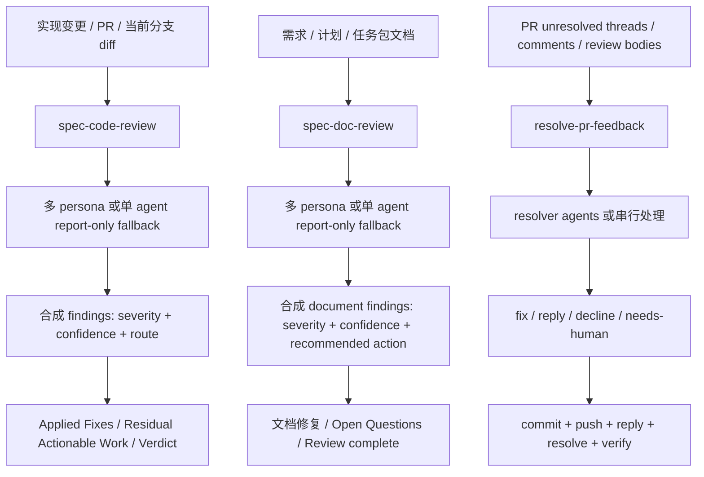
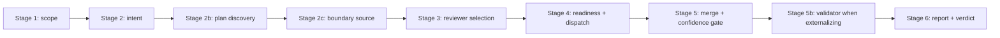
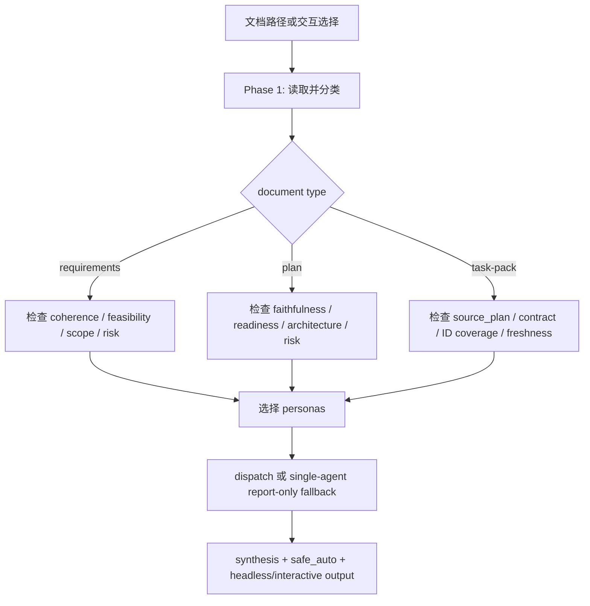

本页解释 spec-first 中三类相邻但边界不同的审查闭环：`spec-code-review` 负责代码 diff、PR 或分支实现变更审查；`spec-doc-review` 负责需求、计划、任务包等 Markdown 规划产物审查；`resolve-pr-feedback` 负责读取 PR review feedback、判断有效性、修复、回复并关闭线程。架构假设是：**审查不是单一动作，而是“证据收集 → 多视角判断 → 合成路由 → 残留处理”的分层流水线**；代码审查与文档审查共享 persona 合成思想，但 mutation、artifact、headless 输出与 PR 线程处理边界不同。Sources: [SKILL.md](skills/spec-code-review/SKILL.md#L13-L43), [SKILL.md](skills/spec-doc-review/SKILL.md#L13-L43), [SKILL.md](skills/resolve-pr-feedback/SKILL.md#L8-L14)

## 当前位置与阅读边界

你当前位于深度解析主链路中的“代码审查、文档审查与残留问题处理”。前一页 [计划、任务包与执行交接契约](14-ji-hua-ren-wu-bao-yu-zhi-xing-jiao-jie-qi-yue) 解释上游计划和任务如何交接给执行；本页只解释执行之后如何审查代码、审查文档，以及如何把审查残留变成可处理的后续动作；下一页 [知识沉淀与复用机制](16-zhi-shi-chen-dian-yu-fu-yong-ji-zhi) 才讨论哪些审查经验值得沉淀为复用知识。Sources: [SKILL.md](skills/spec-code-review/SKILL.md#L41-L43), [SKILL.md](skills/spec-doc-review/SKILL.md#L41-L43), [artifact-summary.md](docs/contracts/artifact-summary.md#L55-L63)

## 总体关系图

下面的 Mermaid 图描述三条路径的关系：代码审查从 diff 或 PR 进入，文档审查从需求、计划或任务包进入，PR feedback 处理从 unresolved review threads 或 PR comments 进入；三者都会围绕 evidence、finding、routing、residual status 做闭环，但只有代码审查和 PR feedback 处理在特定模式下会修改代码，文档审查只允许接受范围内的文档修复或 Open Questions 处理。Sources: [SKILL.md](skills/spec-code-review/SKILL.md#L175-L214), [SKILL.md](skills/spec-doc-review/SKILL.md#L83-L103), [full-mode.md](skills/resolve-pr-feedback/references/full-mode.md#L63-L73)

## 三种审查入口的职责对比

| 入口 | 适用对象 | 不适用对象 | 典型输出 | 是否可修改文件 | 下游消费者 |
|---|---|---|---|---|---|
| `spec-code-review` | 当前分支 diff、PR、显式 base diff、实现变更 | 需求/计划/任务包文档审查、提交/推送/创建 PR、未决工作规划 | 合并后的 findings、severity、confidence、`autofix_class`、owner、residual status、Coverage、Verdict | 交互/autofix/headless 模式可应用 `safe_auto`；report-only 不修改 | `spec-work`、PR 准备、人类 reviewer、`spec-compound` |
| `spec-doc-review` | requirements、plan、task-pack 等 Markdown 规划产物 | 代码 diff review、实现修复、PR merge-readiness code review | persona-reviewed findings、recommended action、headless envelope、`Review complete` | 可应用允许的文档 `safe_auto`；fallback/report-only 不修改 | `spec-plan`、`spec-work`、task-pack validation/rebuild、人类文档 owner |
| `resolve-pr-feedback` | PR review comments、unresolved review threads、针对某个 thread URL 的反馈 | 普通预合并代码审查、文档审查、无 PR feedback 的改动评估 | fixed/replied/declined/needs-human 汇总、commit/push、thread reply/resolve、verify 结果 | 是，resolver 可修改代码；orchestrator 负责最终集成 | PR review 线程与人类 reviewer |

Sources: [SKILL.md](skills/spec-code-review/SKILL.md#L13-L43), [SKILL.md](skills/spec-doc-review/SKILL.md#L13-L43), [SKILL.md](skills/resolve-pr-feedback/SKILL.md#L21-L35), [full-mode.md](skills/resolve-pr-feedback/references/full-mode.md#L94-L113)

## 代码审查：从 scope 到 verdict 的流水线

`spec-code-review` 的第一原则是先确定审查范围，而不是直接阅读零散文件。它支持 `base:<sha-or-ref>` 快速路径、PR/URL、分支名、当前分支四类 scope；无论路径如何，最终都要形成 base、tracked file list、diff、untracked list，并且 untracked 文件默认不在审查范围内，除非用户先 `git add`。Sources: [SKILL.md](skills/spec-code-review/SKILL.md#L317-L338), [SKILL.md](skills/spec-code-review/SKILL.md#L340-L405), [SKILL.md](skills/spec-code-review/SKILL.md#L443-L464)

代码审查的意图发现会把 PR title/body、linked issues、commit messages、branch log 与会话上下文压缩成 2–3 行 intent summary；如果交互模式下意图不明确，会先问一个阻塞问题，autofix/report-only/headless 则保守推断并把不确定性写入 Coverage 或 Verdict reasoning。Sources: [SKILL.md](skills/spec-code-review/SKILL.md#L465-L492)

计划发现是代码审查中的需求完整性检查入口：显式 `plan:` 参数优先，其次是 PR body 中的 `docs/plans/*.md`，最后才按 branch keyword 自动发现；显式计划中的未完成 requirement 会影响 verdict，而 inferred 计划只作为低置信 advisory 线索。Sources: [SKILL.md](skills/spec-code-review/SKILL.md#L493-L508), [SKILL.md](skills/spec-code-review/SKILL.md#L919-L944)

边界审查把“diff 是否留在授权范围内”提升为一等维度。workflow 会记录 `scope_boundary`、`authorized_scope_source`、`scope_boundary_evidence`，并区分 explicit touch set、declared files、inferred plan、diff-only、unknown；仅靠 diff 推断不能给出 `clean`，而源/运行时边界、generated runtime、未授权文件或需求遗漏都可能成为 boundary finding。Sources: [SKILL.md](skills/spec-code-review/SKILL.md#L107-L127), [SKILL.md](skills/spec-code-review/SKILL.md#L509-L522)

## Reviewer 选择：最小充分，而不是越多越好

代码审查在 Stage 3 先计算 changed file count、untracked excluded count、非测试非生成非 lockfile 行数、docs-only、simple-config-only、sensitive diff、prior comments、explicit plan 等事实，再决定最小 reviewer set 或 full core；低风险小改动可以只用 2–3 个 reviewer，敏感、宽泛、契约、运行时、发布、CLI、安全或跨模块改动必须使用 full core 加条件 reviewer。Sources: [SKILL.md](skills/spec-code-review/SKILL.md#L523-L558), [SKILL.md](skills/spec-code-review/SKILL.md#L560-L590)

| diff 类别 | 可用最小 reviewer set | 触发条件摘要 |
|---|---|---|
| docs-only | `spec-project-standards-reviewer`, `spec-maintainability-reviewer` | 文件数不超过 2、无 untracked、非 sensitive、无 prior comments、无 explicit plan，且全是文档/示例等 |
| simple config only | `spec-correctness-reviewer`, `spec-testing-reviewer`, `spec-project-standards-reviewer` | 同上，但改动是 package metadata、lint/test config、YAML/JSON/TOML 或 CI 配置 |
| tiny executable diff | `spec-correctness-reviewer`, `spec-testing-reviewer`, `spec-maintainability-reviewer` | 同上，且非测试非生成非 lockfile 代码行数不超过 25 |
| 其他或不确定 | full core + applicable conditionals | 任一最小条件不满足，或事实缺失/矛盾 |

Sources: [SKILL.md](skills/spec-code-review/SKILL.md#L560-L579)

默认 full core 包含 correctness、testing、maintainability、project-standards、agent-native、learnings-researcher；条件 reviewer 会按安全、性能、API 契约、迁移、可靠性、adversarial、CLI readiness、previous comments、Rails/Python/TypeScript/frontend races/Swift iOS 等栈与风险面追加。Sources: [SKILL.md](skills/spec-code-review/SKILL.md#L251-L300)

## 证据边界：finding 必须回到直接证据

代码审查不要求外部工具 ready 才能 dispatch reviewer；它可以使用直接 diff、source reads、`rg`、ast-grep、package/test facts、logs、用户提供 artifact 来确认 findings。如果外部 capability-class 或 project graph 提供候选影响面，这些候选默认是 advisory 和 provider-untrusted，只有被 source/test/log/contract evidence 确认后才可以支撑 finding。Sources: [SKILL.md](skills/spec-code-review/SKILL.md#L101-L105), [SKILL.md](skills/spec-code-review/SKILL.md#L128-L142), [SKILL.md](skills/spec-code-review/SKILL.md#L626-L640)

文档审查也遵守直接证据边界：当文档声称代码库现状、实现状态或迁移事实时，reviewer 应使用 bounded direct reads、`rg`、ast-grep、package/test facts、logs 或用户 artifact 检查；如果无法确认影响声明，结果应记录为限制，而不是把未确认声明当事实。Sources: [SKILL.md](skills/spec-doc-review/SKILL.md#L70-L73), [SKILL.md](skills/spec-doc-review/SKILL.md#L193-L199)

## 合成、置信门与残留路由

代码审查的 finding 合成包含 validate、deduplicate、cross-reviewer agreement、pre-existing separation、disagreement resolution、routing normalization、boundary label derivation、weak advisory demotion、confidence-first gate、partition 和排序编号。置信度使用离散锚点 `0/25/50/75/100`，低于 75 的 finding 通常被压制，但 P0 在 50+ 时不能静默丢弃。Sources: [SKILL.md](skills/spec-code-review/SKILL.md#L808-L871)

| `autofix_class` | 默认 owner | 含义 | 残留处理姿态 |
|---|---|---|---|
| `safe_auto` | `review-fixer` | 本地、确定性、适合 workflow 内 fixer 的修复 | 在允许 mutation 的模式中自动进入 in-skill fixer queue |
| `gated_auto` | `downstream-resolver` 或 `human` | 有具体修复，但触及行为、契约、权限或敏感边界 | 作为 unresolved actionable work 或交互 Apply/Defer 决策 |
| `manual` | `downstream-resolver` 或 `human` | 应交接处理而不是本 skill 内自动修复 | 进入 residual actionable queue 或人工处理 |
| `advisory` | `human` 或 `release` | 学习、发布说明、残余风险等 report-only 输出 | 不作为自动修复项，通常进入报告或 release/human 路由 |

Sources: [SKILL.md](skills/spec-code-review/SKILL.md#L233-L250), [SKILL.md](skills/spec-code-review/SKILL.md#L863-L868)

Stage 5b 是“外部化前的独立验证门”，只在 headless、autofix、交互 File-tickets 等会把 finding 外部化或自动处理的路径运行；它会为 surviving finding 启动独立 validator，validator 只重新检查 finding 是否成立，不继承原 reviewer 的偏见，失败或超时不能当作反证，尤其 P0/P1 unvalidated findings 仍需保持可见。Sources: [SKILL.md](skills/spec-code-review/SKILL.md#L873-L914)

最终报告必须包含 scope、intent、mode、reviewer team、按 severity 分组的 pipe-delimited finding 表、Requirements Completeness、Applied Fixes、Residual Actionable Work、Pre-existing、learnings、agent-native gaps、schema drift、deployment notes、resource advisory、Coverage 与 Verdict；当结构化验证存在时，应以 `verification-run-summary.v1` 或 `honest-closeout.v1` 形式承载，而不是只写“tests passed”之类自然语言声明。Sources: [SKILL.md](skills/spec-code-review/SKILL.md#L915-L950), [honest-closeout.md](docs/contracts/workflows/honest-closeout.md#L1-L21)

## 代码审查模式差异

| 模式 | 触发方式 | 是否交互 | 是否修改文件 | 是否写 artifact | 关键限制 |
|---|---|---|---|---|---|
| Interactive | 默认，无 mode token | 是 | 可应用 `safe_auto`，并询问 gated/manual 决策 | 可写 temp review artifact | 需要平台 question tool 或 fallback |
| Autofix | `mode:autofix` | 否 | 只应用 `safe_auto -> review-fixer` | 写 run artifact | 不 commit、不 push、不创建 PR |
| Report-only | `mode:report-only` | 否 | 否 | 不写 `<review-artifact-dir>` | 唯一适合与 browser testing 并发的只读模式 |
| Headless | `mode:headless` | 否 | 单 pass 应用 `safe_auto` | 写 run artifact | 必须能确定 diff scope；不安全于共享 checkout 并发 mutation |

Sources: [SKILL.md](skills/spec-code-review/SKILL.md#L175-L214)

这些模式的核心差异是 mutation ownership。report-only 绝不编辑文件或外部化 work；autofix/headless 可以应用安全自动修复，但不能 commit、push 或创建 PR；显式 PR/branch target 在 report-only/headless 下不能切换共享 checkout，必须使用隔离 worktree/checkout 或停止。Sources: [SKILL.md](skills/spec-code-review/SKILL.md#L196-L214), [SKILL.md](skills/spec-code-review/SKILL.md#L201-L213)

## 文档审查：审查需求、计划和任务包的语义质量

`spec-doc-review` 的对象是 requirements、plan、task-pack；它按内容形状优先分类，而不是只看路径。requirements 关注 what/why，plan 关注 how，task-pack 关注是否忠实派生自一个 source plan、是否只缩减执行上下文而不引入新 scope、acceptance criteria、non-goals、public contracts 或 implementation decisions。Sources: [SKILL.md](skills/spec-doc-review/SKILL.md#L105-L143)

文档 reviewer 默认包含 coherence 和 feasibility，并按文档信号激活 product-lens、design-lens、security-lens、scope-guardian、adversarial-document-reviewer；低风险 docs-only、typo 级或窄 task-pack metadata 检查可以用最小 document-review set，但如果文档宽泛、敏感、不清晰或有 unresolved findings，就应使用 full set。Sources: [SKILL.md](skills/spec-doc-review/SKILL.md#L144-L193), [SKILL.md](skills/spec-doc-review/SKILL.md#L201-L227)

文档审查的 dispatch gate 更严格：host 必须暴露 dispatch primitive，并且当前请求或父 workflow 必须明确授权 subagents、parallel reviewers、delegated review 或等价 multi-agent phase；如果授权缺失、runtime 不支持或用户请求 no-agents/report-only，则进入 single-agent report-only fallback，不应用 `safe_auto`、不追加 Open Questions、也不编辑文档。Sources: [SKILL.md](skills/spec-doc-review/SKILL.md#L228-L251)

文档审查与代码审查一样使用 summary-first handoff：reviewer 默认接收选定 section bundle、summary、evidence paths、full-read triggers 和相关直接证据，而不是把完整长文档广播给每个 agent；只有 summary 缺少必要 detail、需要精确 prose/line references、或跨文档 invariant 无法被 summary 表达时才展开 full artifact。Sources: [SKILL.md](skills/spec-doc-review/SKILL.md#L58-L63), [SKILL.md](skills/spec-doc-review/SKILL.md#L258-L272), [artifact-summary.md](docs/contracts/artifact-summary.md#L21-L73)

文档审查的产出不是代码审查 report 的简化版，而是面向规划质量的 findings：severity、confidence-first anchor、recommended action、允许的 `safe_auto` 修复、headless structured output，以及最终 `Review complete` 信号；其下游包括 `spec-plan`、`spec-work`、任务包 validation/rebuild、人类文档 owner，以及当文档 finding 暗示实现风险时的 code-review handoff。Sources: [SKILL.md](skills/spec-doc-review/SKILL.md#L25-L43), [SKILL.md](skills/spec-doc-review/SKILL.md#L281-L299)

## PR feedback 处理：把外部 review 线程变成闭环

`resolve-pr-feedback` 的默认策略是“优先修复真实反馈，不制造怀疑来逃避工作”。它有 Full 和 Targeted 两种模式：无参数或 PR number 会处理该 PR 的所有 unresolved threads 与 actionable PR-level feedback；comment/thread URL 只处理指定 thread，不抓取或处理其他线程。Sources: [SKILL.md](skills/resolve-pr-feedback/SKILL.md#L8-L14), [SKILL.md](skills/resolve-pr-feedback/SKILL.md#L21-L35), [targeted-mode.md](skills/resolve-pr-feedback/references/targeted-mode.md#L1-L35)

Full Mode 会先用 GraphQL helper 获取 `review_threads`、`pr_comments`、`review_bodies` 和 `fetch_warnings`；review threads 可 resolve，PR comments 和 review bodies 没有 resolve 机制，因此需要用 actionability 和 already replied 过滤避免重复处理。非 actionable 的 wrapper、approval、CI summary 等会静默丢弃，不计入任务列表或总结。Sources: [full-mode.md](skills/resolve-pr-feedback/references/full-mode.md#L5-L50)

PR feedback 处理的 mutation 边界与代码审查不同：resolver agents 可以编辑代码，但 orchestrator 拥有最终集成，包括 combined validation、staging、commit、push、reply 和 thread resolution；如果 dispatch 不可用、用户禁用、mutation 不安全、文件重叠或发现冲突，就串行处理或停止协调。Sources: [SKILL.md](skills/resolve-pr-feedback/SKILL.md#L40-L45), [full-mode.md](skills/resolve-pr-feedback/references/full-mode.md#L67-L73), [full-mode.md](skills/resolve-pr-feedback/references/full-mode.md#L114-L120)

resolver 的返回 verdict 包括 `fixed`、`fixed-differently`、`replied`、`not-addressing`、`declined`、`needs-human`；其中 `needs-human` 会保留线程开放等待人类决策，`not-addressing` 必须有证据说明反馈事实不成立，`declined` 必须说明为什么照做会让代码变差。Sources: [full-mode.md](skills/resolve-pr-feedback/references/full-mode.md#L94-L113), [full-mode.md](skills/resolve-pr-feedback/references/full-mode.md#L166-L183)

修复完成后，workflow 会对 resolver 改过的文件运行项目 validation；绿色则 commit/push，失败且触及 resolver-changed files 时允许一次 inline diagnose-and-fix，失败但只涉及未改文件则作为 pre-existing failure 记录在 commit footer。随后对 review threads 回复并 resolve，对 PR comments/review bodies 用 PR comment 回复。Sources: [full-mode.md](skills/resolve-pr-feedback/references/full-mode.md#L122-L150), [full-mode.md](skills/resolve-pr-feedback/references/full-mode.md#L152-L215)

最后的 verify 会重新抓取 feedback，`review_threads` 应为空，除了刻意保留的 `needs-human`；如果仍有新线程，最多进行两轮 fix-verify 循环，之后停止并暴露 remaining issues 与 recurring pattern，避免无限循环。Sources: [full-mode.md](skills/resolve-pr-feedback/references/full-mode.md#L216-L252)

## 残留问题的统一处理模型

在代码审查中，残留问题主要来自 `gated_auto`、`manual`、`human`、`release`、pre-existing、testing gaps、Coverage limitations 与 validator degraded 状态；这些不会被 `safe_auto` fixer 自动吞掉，而是进入 Residual Actionable Work、report-only queue、Pre-existing、Coverage 或 Verdict。Sources: [SKILL.md](skills/spec-code-review/SKILL.md#L233-L250), [SKILL.md](skills/spec-code-review/SKILL.md#L863-L871), [SKILL.md](skills/spec-code-review/SKILL.md#L925-L944)

在文档审查中，残留问题通常表现为 unresolved open questions、需要 owner 决策的 scope/risk/coherence 问题、headless 返回给 caller 的 gated/manual/FYI findings，或 single-agent report-only fallback 中记录的 Coverage 限制；workflow 不会自动运行 `spec-compound`，只会在有可复用经验时给出最多一条 advisory learning capture recommendation。Sources: [SKILL.md](skills/spec-doc-review/SKILL.md#L89-L103), [SKILL.md](skills/spec-doc-review/SKILL.md#L244-L251), [SKILL.md](skills/spec-doc-review/SKILL.md#L287-L299)

在 PR feedback 处理中，残留问题主要是 `needs-human`、两轮后仍剩余的线程、不可安全并行的冲突、validation 阻塞、或 pending decision；这些必须在 summary 中显式列出，并在有 blocking question tool 时合并询问，不能静默跳过。Sources: [full-mode.md](skills/resolve-pr-feedback/references/full-mode.md#L226-L252)

## 常见判断矩阵

| 场景 | 应使用 | 不应使用 | 原因 |
|---|---|---|---|
| 合并前想审查当前分支实现 | `spec-code-review` | `spec-doc-review` | 输入是 diff/branch implementation，不是规划文档 |
| 想检查 plan 是否可执行、是否越界 | `spec-doc-review` | `spec-code-review` | 输入是 plan 文档，需要 coherence、feasibility、scope、risk 审查 |
| PR 上已有 reviewer 留下 unresolved threads | `resolve-pr-feedback` | 普通 `spec-code-review` | 目标是逐条处理、修复、回复、resolve review feedback |
| 只想生成只读代码审查报告 | `spec-code-review mode:report-only` | autofix/headless | report-only 不编辑文件、不写 run artifact，适合并发只读验证 |
| 自动化调用需要结构化代码审查输出 | `spec-code-review mode:headless` | interactive | headless 无交互、要求 diff scope、返回 structured envelope，并以 `Review complete` 作为终止信号 |
| 自动化调用需要结构化文档审查输出 | `spec-doc-review mode:headless <path>` | interactive doc review | headless 不问问题，把 non-safe_auto findings 返回给 caller |

Sources: [SKILL.md](skills/spec-code-review/SKILL.md#L13-L43), [SKILL.md](skills/spec-code-review/SKILL.md#L175-L214), [SKILL.md](skills/spec-doc-review/SKILL.md#L13-L43), [SKILL.md](skills/spec-doc-review/SKILL.md#L83-L103), [SKILL.md](skills/resolve-pr-feedback/SKILL.md#L21-L35)

## 实践建议

如果你刚完成实现，先用 `spec-code-review` 审查当前 diff；如果审查发现 residual actionable work，按 `autofix_class` 和 owner 区分哪些能自动修、哪些要交给 downstream resolver 或人类；如果这些 finding 来自 PR reviewer 的真实线程，则切换到 `resolve-pr-feedback` 完成修复、回复、resolve 和 verify。Sources: [SKILL.md](skills/spec-code-review/SKILL.md#L37-L43), [SKILL.md](skills/spec-code-review/SKILL.md#L863-L871), [full-mode.md](skills/resolve-pr-feedback/references/full-mode.md#L122-L150), [full-mode.md](skills/resolve-pr-feedback/references/full-mode.md#L216-L252)

如果你正在审查需求、计划或任务包，不要把它当成代码 diff review；使用 `spec-doc-review` 让 reviewer 从 coherence、feasibility、scope、risk、downstream readiness 角度给出 finding，并在需要时把文档 finding 作为后续 `spec-plan`、`spec-work` 或代码审查的输入。Sources: [SKILL.md](skills/spec-doc-review/SKILL.md#L13-L43), [SKILL.md](skills/spec-doc-review/SKILL.md#L113-L143), [SKILL.md](skills/spec-doc-review/SKILL.md#L281-L299)

下一步阅读建议：如果你想理解这些审查输入从哪里来，回到 [计划、任务包与执行交接契约](14-ji-hua-ren-wu-bao-yu-zhi-xing-jiao-jie-qi-yue)；如果你想理解哪些审查经验会变成可复用知识，继续读 [知识沉淀与复用机制](16-zhi-shi-chen-dian-yu-fu-yong-ji-zhi)；如果你想理解审查中的 schema、质量门和稳定字段，阅读 [Schema、质量门与确定性不变量](26-schema-zhi-liang-men-yu-que-ding-xing-bu-bian-liang)。Sources: [artifact-summary.md](docs/contracts/artifact-summary.md#L55-L73), [honest-closeout.md](docs/contracts/workflows/honest-closeout.md#L1-L21), [SKILL.md](skills/spec-code-review/SKILL.md#L939-L945)