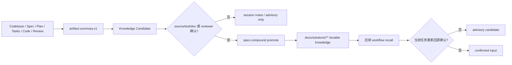

本页解释 spec-first 如何把一次工作中的经验转化为可复用、可回源、可失效的项目知识。核心结论是：知识机制不是外部 memory 平台，也不是新的状态机；它以文件为默认事实载体，通过 summary-first handoff 降低上下文成本，通过 `docs/solutions/**` 召回历史经验，并要求在复用前回到当前 source/test/doc 或人工确认。Sources: [knowledge-harness.md](docs/contracts/knowledge/knowledge-harness.md#L3-L16)

## 架构假设：知识闭环的边界先于知识检索

从代码与合同面验证后，可以形成一个明确假设：spec-first 的知识沉淀机制不是“把所有历史都喂给模型”，而是把工作流末端的 verified learning 写入 durable store，再在后续 Plan、Work、Debug、Review 等环节以 advisory candidate 的形式召回；只有经过当前证据确认后，召回内容才可参与结论。Knowledge Harness 合同把目标定义为让 `Codebase -> Spec -> Plan -> Tasks -> Code -> Review -> Knowledge` 最后一环“可发现、可回源、可失效”，并明确脚本只强制机械不变量和准备事实，语义充分性由 LLM workflow 判断。Sources: [knowledge-harness.md](docs/contracts/knowledge/knowledge-harness.md#L5-L10)

上图中的关键控制点有两个：写入前的 Promotion Boundary，以及读取后的 Recall Trust Boundary。写入前，未验证的 session notes、raw tool output、raw diff hunks 或未确认 recall 不应进入 `docs/solutions/**`；读取后，`docs/solutions/**` 命中也只产生候选线索，必须使用 `source_refs` 或上游 `source_reads_required` 回到当前 source/test/doc、确定性校验、review finding 或人工确认。Sources: [knowledge-harness.md](docs/contracts/knowledge/knowledge-harness.md#L48-L63)

## 六层 Knowledge Harness：从上下文到沉淀

Knowledge Harness 把知识闭环拆成六层：L1 Project Context、L2 Context Budget、L3 Code Intelligence、L4 Memory / Prior Decisions、L5 Skill / Tool Capability、L6 Evidence / Promotion。当前重点不是同时实现所有层，而是明确每层职责与边界：L2、L4、L6 是 v1.15 completion gate；L5 是 advisory follow-up；L1 已由现有 `spec-prd` 与宿主文档覆盖；L3 延后到 v1.16 capability-aware 协同。Sources: [knowledge-harness.md](docs/contracts/knowledge/knowledge-harness.md#L18-L30)

| 层级 | 作用 | 当前机制 | 复用边界 |
| --- | --- | --- | --- |
| L1 Project Context | 保留项目角色、source/runtime 边界、宿主指令和需求上下文 | `spec-prd`、host docs、项目角色文档 | host docs 是 source 指令，不是 workflow 状态 |
| L2 Context Budget | 用最小高信号 token 传递上游 artifact、路径和验证信息 | `context-bundle.v1`、`artifact-summary.v1` | 不新增第二套 included/omitted schema |
| L3 Code Intelligence | 帮助定位影响面、调用链和候选测试 | external providers、`rg`、ast-grep | provider 只提供 advisory navigation |
| L4 Memory / Prior Decisions | 召回历史经验和已拒绝方案 | `docs/solutions/**`、`spec-learnings-researcher` | recall 命中不是 confirmed truth |
| L5 Skill / Tool Capability | 暴露可用 skill、MCP、CLI 和降级能力 | tool facts、runtime capabilities、skills registry | setup facts 不替代语义判断 |
| L6 Evidence / Promotion | 把已验证、可复用、可失效的经验沉淀进 durable store | `spec-compound`、`spec-compound-refresh` | 未验证经验不进入 durable knowledge |

这张表的含义是：知识机制将“上下文传递”“历史召回”“经验沉淀”拆开治理，避免把历史材料、工具输出和当前事实混为一谈。L4 的 recall 只负责把可能相关的历史经验带到桌面，L6 的 promotion 才负责把已验证经验写入长期知识库。Sources: [knowledge-harness.md](docs/contracts/knowledge/knowledge-harness.md#L20-L30)

## Summary-First Handoff：先摘要，后展开

`artifact-summary.v1` 是跨 workflow 交接的默认入口。Producer 应先给出 goal、scope、non-goals、key conclusions、changed facts、evidence paths、limitations 和 `full_artifact_read_triggers`；consumer 先读取 summary 和精确 path，只有命中触发条件时才展开完整 artifact。Sources: [knowledge-harness.md](docs/contracts/knowledge/knowledge-harness.md#L31-L47)

Artifact Summary 合同进一步说明，它不是底层 artifact 的 source-of-truth 替代品，也不是第二份完整报告；它的作用是避免把长计划、review report、audit JSON、raw log 或 session transcript 全量传给每个下游 agent，同时保留 source paths、evidence paths 和 full-read triggers。Sources: [artifact-summary.md](docs/contracts/artifact-summary.md#L1-L20)

| 信号或字段 | Producer / Consumer 行为 | 设计目的 |
| --- | --- | --- |
| `summary_missing` | 上游没有可消费 summary 时，下游记录该信号并读取最小 explicit path | 防止静默依赖缺失摘要 |
| `full_artifact_read_reason` | 展开完整 artifact 时记录原因，且原因对应触发条件 | 让上下文膨胀可解释 |
| `full_artifact_read_triggers` | 只有缺少必要 requirement/task/finding/evidence detail、需要精确 prose/line reference、互依赖任务需要具体实现细节时展开 | 避免默认全量加载 |
| `evidence_paths` / `source_reads_required` | 下游回到证据路径做 source/test/contract confirmation | 防止 summary 变成事实替代品 |

这些规则使知识复用保持“短摘要先行、证据路径兜底”的形态。即使 summary 中携带 direct/session evidence summary，它也只能作为 advisory handoff；consumer 仍必须回到 `evidence_paths` 或 `source_reads_required` 做 source/test/contract confirmation。Sources: [artifact-summary.md](docs/contracts/artifact-summary.md#L55-L73)

## `docs/solutions/**`：长期知识库而非真理库

`docs/solutions/**` 是 durable knowledge 的默认存放位置，但它不是默认真理库。Knowledge Harness 明确规定：`docs/solutions/**` recall 只产生 advisory candidate；consumer 必须回到 learning frontmatter 的 `source_refs` 或 evidence summary 的 `source_reads_required`，用当前 source/test/doc、确定性校验或人工 reviewer 确认后，才能把结论升为 confirmed。Sources: [knowledge-harness.md](docs/contracts/knowledge/knowledge-harness.md#L48-L55)

`spec-learnings-researcher` 的角色也符合这条边界：它只负责在 `docs/solutions/` 下检索 institutional learning、做相关性排序、标注 stale caveat 和总结可复用经验；它不拥有当前架构决策、测试风险判定、范围批准、实现或 review autofix 权限。Sources: [spec-learnings-researcher.agent.md](agents/spec-learnings-researcher.agent.md#L8-L23)

检索策略是 grep-first，而不是默认向量化。Agent 先从工作上下文提取模块名、技术术语、问题信号、组件类型、概念、决策、方法和领域，再用内容搜索优先匹配 frontmatter 字段，只读取候选文件的 frontmatter，从而降低上下文成本。Sources: [spec-learnings-researcher.agent.md](agents/spec-learnings-researcher.agent.md#L31-L45), [spec-learnings-researcher.agent.md](agents/spec-learnings-researcher.agent.md#L77-L100), [spec-learnings-researcher.agent.md](agents/spec-learnings-researcher.agent.md#L118-L146)

## Promotion Boundary：只有已验证经验才能沉淀

`spec-compound` 是把刚解决的问题沉淀为团队知识的主要入口。它的用途是：在真实问题已经解决、可复用经验值得保留时，把结构化文档写入 `docs/solutions/`；它不用于 active debugging、未解决实现、一次性 cosmetic edits、raw transcript archiving，也不作为强制 completion gate。Sources: [SKILL.md](skills/spec-compound/SKILL.md#L16-L45)

`spec-compound` 的输出边界很窄：主要产物是一份 `docs/solutions/` learning document；只有当 discoverability check 发现具体缺口时，才会维护 instruction-file。下游消费者包括 `spec-plan`、`spec-work`、`spec-code-review`、`spec-sessions`、后续 `spec-compound-refresh`、仓库本地 advisory vocabulary 以及直接搜索 `docs/solutions/` 的人。Sources: [SKILL.md](skills/spec-compound/SKILL.md#L30-L49)

Promotion 的结构化要求来自 `skills/spec-compound/references/schema.yaml`，它是 `docs/solutions/` frontmatter 的 canonical contract。新 promoted solution 必须包含 `invalidation_condition` 和 `source_refs`；同时 schema 也定义了 `domain`、`pattern`、`rejected_alternatives`、`applicable_versions` 等用于召回和复核的字段。Sources: [schema.yaml](skills/spec-compound/references/schema.yaml#L1-L10), [schema.yaml](skills/spec-compound/references/schema.yaml#L203-L233)

现有缺少结构化字段的历史文档被视为 `legacy_unstructured_advisory`：它们仍可被 recall，但不能因为已经存在于 durable store 中就被视为 verified structured knowledge。只有至少回填 `domain`、`pattern`、`invalidation_condition` 和 `source_refs` 后，才可按新的结构化召回规则消费。Sources: [knowledge-harness.md](docs/contracts/knowledge/knowledge-harness.md#L54-L63), [schema.yaml](skills/spec-compound/references/schema.yaml#L242-L253)

## Recall Trust Boundary：复用经验时必须重新回源

在 planning 场景中，`spec-plan` 明确把 `docs/solutions/` 中的 institutional learnings 视为 recall advisory candidate evidence。匹配到的 learning 是“指针”，不是 confirmed truth；plan 必须使用 `source_refs` 或上游 `source_reads_required` 回到当前 source/test/doc evidence、确定性检查或人工 review，再决定是否采用。Sources: [governance-boundaries.md](skills/spec-plan/references/governance-boundaries.md#L29-L38)

在 debugging 场景中，`spec-debug` 默认把 `docs/solutions/` recall 作为 orientation source，但也限定为 frontmatter 直接扫描；只有 trivial-bug fast-path 才跳过。召回命中仍只是 diagnostic pointer，不是 root-cause proof，必须回到 source/test/doc、复现输出、确定性检查、日志或人工确认。Sources: [SKILL.md](skills/spec-debug/SKILL.md#L80-L95)

这意味着“过去经验”在 spec-first 中不会直接替代当前证据。它的价值是缩短定位路径、暴露已拒绝方案、提醒失效条件和提供可复用模式；它的风险通过 `source_refs`、`source_reads_required`、`invalidation_condition` 和当前证据确认来控制。Sources: [knowledge-harness.md](docs/contracts/knowledge/knowledge-harness.md#L48-L55), [spec-learnings-researcher.agent.md](agents/spec-learnings-researcher.agent.md#L136-L146)

## Context Budget：知识复用必须受上下文预算约束

Knowledge Harness 不新增 context budget 字段，而是复用 `context-bundle.v1` 的既有语义：included context 映射到 `related_paths` 和 `evidence_paths`，omitted context 映射到 `excluded_context` 及其 `reason_code` / `reason`，budget 映射到 `budget` / `budget_used`。Sources: [context-bundle.md](docs/contracts/context-bundle.md#L101-L115)

`context-bundle.v1` 的 consumer 规则要求先读 `artifact_summaries`，再读完整 artifact paths；精确读取 `evidence_paths`，没有新的 reason 时不扩展到父目录；只有列出的 `full_read_triggers` 命中时，才展开完整文件。这保证知识召回不会演化成“目录级全量加载”。Sources: [context-bundle.md](docs/contracts/context-bundle.md#L101-L110)

## 机制对比：沉淀、召回、确认不是同一件事

| 动作 | 由谁主导 | 输入 | 输出 | 是否可作为 confirmed truth |
| --- | --- | --- | --- | --- |
| 沉淀 promotion | `spec-compound` | 已解决问题、changed files/tests、work/review summary、现有 candidates | 一份 `docs/solutions/**` learning doc | 只有满足 verified learning 边界后才进入 durable store |
| 刷新 refresh | `spec-compound-refresh` | 已有 learning、当前 source/test/doc 状态 | 更新或维护既有 durable knowledge | 取决于重新验证结果 |
| 召回 recall | `spec-learnings-researcher` 或 workflow 直接扫描 | 当前任务上下文、frontmatter metadata | ranked advisory candidates | 否 |
| 确认 confirmation | 当前 workflow consumer | `source_refs`、`source_reads_required`、当前 source/test/doc、命令或 reviewer | confirmed input / stale caveat / rejected reuse | 是，前提是证据来自当前权威来源 |

这个分层避免了三个常见误用：把召回命中当事实、把 raw session/tool output 当知识、把 promotion gate 当安全防线。合同明确指出 promotion gate 的定位是噪声与质量控制，不是反注入防御；默认 source truth 也不是向量库、SQLite 或外部 memory 平台。Sources: [knowledge-harness.md](docs/contracts/knowledge/knowledge-harness.md#L11-L17), [knowledge-harness.md](docs/contracts/knowledge/knowledge-harness.md#L56-L63)

## 阅读路径

如果你想理解知识机制在主链路中的位置，下一步建议阅读 [工作流主链路：Spec、Plan、Tasks、Code、Review、Knowledge](11-gong-zuo-liu-zhu-lian-lu-spec-plan-tasks-code-review-knowledge)。如果你更关心审查结果如何进入后续工作，继续读 [代码审查、文档审查与残留问题处理](15-dai-ma-shen-cha-wen-dang-shen-cha-yu-can-liu-wen-ti-chu-li)。如果你要理解 Knowledge Harness 与 Context、Evidence、Execution、Evaluation 的分层关系，继续读 [Context、Evidence、Execution、Evaluation 与 Knowledge Harness 分层](25-context-evidence-execution-evaluation-yu-knowledge-harness-fen-ceng)。Sources: [knowledge-harness.md](docs/contracts/knowledge/knowledge-harness.md#L18-L30), [artifact-summary.md](docs/contracts/artifact-summary.md#L1-L7)