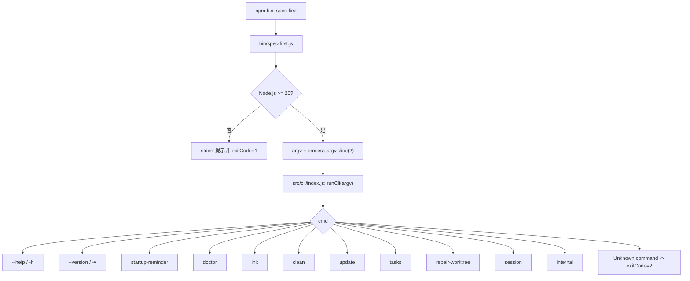

本页位于“CLI 与运行时架构”章节，聚焦 `spec-first` **包级 CLI 入口**如何从 npm `bin` 映射进入 Node 脚本、完成 Node 版本闸门、进入 `runCli(argv)` 分发器，并把不同命令交给 `src/cli/commands/*` 模块；它不展开初始化生成的多宿主运行时细节，也不解释各宿主适配器内部差异，这些内容应继续阅读 [初始化流程与多宿主运行时生成](18-chu-shi-hua-liu-cheng-yu-duo-su-zhu-yun-xing-shi-sheng-cheng) 与 [平台适配器与宿主差异封装](19-ping-tai-gua-pei-qi-yu-su-zhu-chai-yi-feng-zhuang)。Sources: [package.json](package.json#L2-L8), [spec-first.js](bin/spec-first.js#L1-L23), [index.js](src/cli/index.js#L19-L80)

## 架构假设与验证结论

从第一性原理看，这个 CLI 的核心职责不是直接执行 `spec-plan`、`spec-work` 等工作流，而是管理包级命令面：`doctor` 检查环境，`init` 安装或刷新运行时资产，`clean` 移除托管资产，`update` 升级包并刷新运行时，`tasks` 与 `session` 提供辅助治理命令；源码验证显示 `--version` 输出也明确提示 `spec-plan`、`spec-work`、`spec-code-review`、`spec-mcp-setup` 是宿主 workflow 入口，不是 package CLI 子命令。Sources: [index.js](src/cli/index.js#L158-L181), [index.js](src/cli/index.js#L196-L215), [cli-entry-contracts.test.js](tests/unit/cli-entry-contracts.test.js#L106-L114)

第二个可验证假设是：命令分发采用一个集中式、显式 `if` 链，而不是动态扫描目录或插件式路由；`src/cli/index.js` 在文件顶部静态引入各命令模块，然后在 `runCli(argv)` 中按首个参数 `cmd` 分支调用对应 `run*` 函数，未知命令统一返回用法错误退出码 `2`。Sources: [index.js](src/cli/index.js#L1-L17), [index.js](src/cli/index.js#L19-L80), [cli-entry-contracts.test.js](tests/unit/cli-entry-contracts.test.js#L307-L315)

## 从 npm bin 到分发器的入口链路

`package.json` 将可执行命令名 `spec-first` 映射到 `bin/spec-first.js`，同时声明包类型为 CommonJS；入口脚本使用 shebang 让系统可直接执行 Node 脚本，随后在 IIFE 中先调用 Node 版本检查，再把 `process.argv.slice(2)` 传给 `src/cli` 导出的 `runCli`。Sources: [package.json](package.json#L5-L8), [spec-first.js](bin/spec-first.js#L1-L15)

入口脚本的错误处理边界很窄：如果 Node 版本不满足要求，它设置退出码 `1` 并提前返回；如果 `runCli(argv)` 正常 resolve，则把返回值写入 `process.exitCode`；如果 Promise reject，则只打印错误消息并返回退出码 `1`，因此命令模块的预期失败应通过返回码表达，而不是抛异常作为常规控制流。Sources: [spec-first.js](bin/spec-first.js#L5-L22), [node-version.js](src/cli/node-version.js#L23-L33)



上图中的分支都能在源码中定位：`runCli` 先处理无命令、帮助和版本，再处理 `startup-reminder`，随后在版本提醒闸门之后分发到 `doctor/init/clean/update/tasks/repair-worktree/session/internal`，最后落到未知命令错误路径。Sources: [index.js](src/cli/index.js#L19-L80)

## 分发器的控制流层次

`runCli(argv)` 的第一层是全局命令面：无参数、`--help`、`-h` 直接打印帮助并返回 `0`，`--version` 与 `-v` 打印版本并返回 `0`，`startup-reminder` 是一个专用入口，先于通用版本提醒逻辑执行。Sources: [index.js](src/cli/index.js#L19-L35), [index.js](src/cli/index.js#L89-L107)

第二层是版本提醒闸门，它只覆盖 `doctor`、`init`、`clean`、`update` 四类包级维护命令，并且当子命令参数包含 `-h` 或 `--help` 时跳过提醒；对应测试验证了这些子命令帮助不会消费版本提醒状态。Sources: [index.js](src/cli/index.js#L37-L42), [index.js](src/cli/index.js#L82-L87), [cli-entry-contracts.test.js](tests/unit/cli-entry-contracts.test.js#L139-L162)

第三层才是真正的命令分发：`doctor`、`init`、`clean`、`tasks`、`repair-worktree`、`session`、`internal` 都通过 `Promise.resolve(...)` 包装同步返回值，`update` 直接返回异步函数结果；这个差异来自 `runUpdate` 本身是 `async function`，而其他命令在分发层表现为同步返回退出码。Sources: [index.js](src/cli/index.js#L44-L74), [update.js](src/cli/commands/update.js#L28-L40)

## 命令面总览

| 命令 | 分发目标 | 主要职责边界 | 退出码信号 |
|---|---|---|---|
| `--help` / `-h` | `printHelp()` | 展示包级 CLI 命令，不列出宿主 workflow 入口为可执行子命令 | 成功返回 `0` |
| `--version` / `-v` | `printVersion()` | 展示版本、快速上手与 workflow 入口提示 | 成功返回 `0` |
| `startup-reminder` | `runStartupReminder()` | 处理宿主启动时的版本提醒冷却与展示 | 参数错误返回 `2`，成功返回 `0` |
| `doctor` | `runDoctor()` | 检查环境、平台 CLI、托管资产等健康状态 | 帮助返回 `0`，用法错误 `2`，有错误报告时 `3` |
| `init` | `runInit()` | 安装或刷新 workflow、skills、agents 与开发者配置 | 帮助返回 `0`，解析或交互前置错误返回 `2` |
| `clean` | `runClean()` | 移除指定宿主的 spec-first 托管资产 | 帮助返回 `0`，用法错误返回 `2` |
| `update` | `runUpdate()` | 执行全局 npm 升级，并用 fresh `spec-first init` 刷新运行时 | 帮助返回 `0`，升级失败 `1`，用法错误 `2` |
| `tasks` | `runTasks()` | 对派生任务包进行 hash 与 validate | 子命令或参数错误返回 `2`，验证失败返回 `1` |
| `session` | `runSession()` | 管理多 actor session advisory 的 register/list/heartbeat/unregister | 未给子命令时返回 `2`，帮助返回 `0` |
| 未知命令 | 内联错误分支 | 打印 Unknown command 与帮助 | 返回 `2` |

Sources: [index.js](src/cli/index.js#L23-L80), [doctor.js](src/cli/commands/doctor.js#L28-L40), [doctor.js](src/cli/commands/doctor.js#L68-L103), [init.js](src/cli/commands/init.js#L126-L145), [clean.js](src/cli/commands/clean.js#L25-L53), [update.js](src/cli/commands/update.js#L28-L40), [tasks.js](src/cli/commands/tasks.js#L9-L33), [session.js](src/cli/commands/session.js#L18-L43)

## 包级 CLI 与宿主 workflow 入口的边界

包级帮助文本只列出 `doctor/init/update/clean/repair-worktree/tasks/session` 等命令，并明确说明安装后的 workflow entrypoints 由宿主在 `spec-first init` 后提供；版本页进一步提示 `spec-plan`、`spec-work`、`spec-code-review`、`spec-mcp-setup` 是“宿主 workflow 入口”，不是 package CLI 子命令。Sources: [index.js](src/cli/index.js#L158-L181), [index.js](src/cli/index.js#L208-L215)

这个边界被契约测试固定：帮助输出必须包含 `tasks <subcommand>` 与 `session <subcommand>`，版本输出必须包含 workflow 入口示例，同时 `doctor --help` 要把 MCP/helper setup 指向匹配的 `spec-mcp-setup` workflow entrypoint。Sources: [cli-entry-contracts.test.js](tests/unit/cli-entry-contracts.test.js#L87-L125)

## 目录结构：入口、分发与命令实现

```text
spec-first
├── package.json                 # npm bin: spec-first -> bin/spec-first.js
├── bin
│   └── spec-first.js             # 进程入口、Node 版本闸门、runCli 调用
└── src
    └── cli
        ├── index.js              # 集中式命令分发器
        ├── node-version.js       # Node >=20 检查
        ├── external-command.js   # 同步外部命令包装与超时
        └── commands
            ├── clean.js
            ├── doctor.js
            ├── init.js
            ├── internal.js
            ├── repair-worktree.js
            ├── session.js
            ├── tasks.js
            └── update.js
```

这棵结构体现了“薄入口、集中分发、命令模块自治”的模式：`bin/spec-first.js` 不解析业务参数，`src/cli/index.js` 只识别首个命令并转交，命令目录中的文件各自实现参数解析、帮助文本、业务调用与退出码。Sources: [package.json](package.json#L5-L8), [spec-first.js](bin/spec-first.js#L12-L22), [index.js](src/cli/index.js#L19-L80), [get_dir_structure](src/cli/commands)

## 子命令内部的二级分发

`tasks` 是典型二级分发命令：`runTasks(argv)` 读取第一个子命令，支持 `hash` 与 `validate`，无子命令或帮助时打印帮助，未知子命令时根据是否请求 `--json` 输出结构化或人类可读错误。Sources: [tasks.js](src/cli/commands/tasks.js#L9-L33)

`session` 也是二级分发命令，但它的子命令集合是 `register`、`heartbeat`、`unregister`、`list`；如果只输入 `spec-first session`，它会打印帮助并返回 `2`，而 `spec-first session --help` 返回 `0`。Sources: [session.js](src/cli/commands/session.js#L18-L43)

这两个命令说明主分发器只负责“命令名级别”的路由，子命令语义由具体模块控制；这让 `index.js` 保持稳定，也让命令模块可以定义自己的 JSON 输出、参数校验和错误码。Sources: [index.js](src/cli/index.js#L60-L70), [tasks.js](src/cli/commands/tasks.js#L35-L132), [session.js](src/cli/commands/session.js#L58-L119)

## 外部命令执行的安全包装

CLI 中需要调用外部命令时，并不直接到处分散配置 `spawnSync` 参数；`external-command.js` 提供 `spawnSyncWithTimeout(command, args, options)`，默认超时为 3000ms，也允许通过 `SPEC_FIRST_EXTERNAL_COMMAND_TIMEOUT_MS` 覆盖。Sources: [external-command.js](src/cli/external-command.js#L1-L21)

这个包装固定了 `shell: false`、继承或传入环境变量、`windowsHide: true` 和超时参数，并提供 `isCommandTimeout(result)` 判断 `ETIMEDOUT`；`doctor` 用它检查 Git 与宿主 CLI 版本，因此环境检查不会无限挂起在外部命令上。Sources: [external-command.js](src/cli/external-command.js#L22-L40), [doctor.js](src/cli/commands/doctor.js#L121-L146), [doctor.js](src/cli/commands/doctor.js#L148-L199)

## 退出码与错误语义

当前命令分发架构使用明确退出码区分成功、用法错误和运行失败：帮助与版本为 `0`，未知命令为 `2`，`doctor` 在 JSON 模式下发现错误报告时返回 `3`，`update` 把 npm 未找到或升级失败映射到 `1`，把多余参数映射到 `2`。Sources: [index.js](src/cli/index.js#L23-L31), [index.js](src/cli/index.js#L76-L80), [doctor.js](src/cli/commands/doctor.js#L68-L103), [update.js](src/cli/commands/update.js#L36-L66)

这种设计让调用方可以把“用户输错命令”和“命令执行失败”分开处理；契约测试也固定了未知命令必须返回 `2`、stdout 为空、stderr 包含 `Unknown command`、`Run spec-first --help` 与 `Usage:`。Sources: [cli-entry-contracts.test.js](tests/unit/cli-entry-contracts.test.js#L307-L315)

## 模式对比：为什么这里是显式分发

| 维度 | 当前实现：显式 `if` 分发 | 可替代模式：动态命令注册 |
|---|---|---|
| 可读性 | 所有包级命令集中出现在 `runCli` 中 | 需要额外查注册表或目录扫描 |
| 契约稳定性 | 未知命令、帮助、版本提醒闸门在一个函数中可审查 | 命令注册顺序和副作用更难从入口判断 |
| 测试方式 | 通过真实 `bin/spec-first.js` spawn 验证 CLI contract | 需要同时验证注册机制与命令模块 |
| 扩展成本 | 新命令要修改 `index.js` 并添加模块 | 新命令可能只需新增注册项 |
| 当前证据 | 源码静态 require 命令模块并逐项分支 | 仓库中未显示动态扫描式 CLI 路由 |

Sources: [index.js](src/cli/index.js#L1-L17), [index.js](src/cli/index.js#L19-L80), [cli-entry-contracts.test.js](tests/unit/cli-entry-contracts.test.js#L12-L23), [cli-entry-contracts.test.js](tests/unit/cli-entry-contracts.test.js#L87-L104)

## 对中级开发者的阅读建议

如果你要修改包级 CLI，先从本页的入口链路理解 `package.json -> bin/spec-first.js -> runCli(argv)`，再阅读 [初始化流程与多宿主运行时生成](18-chu-shi-hua-liu-cheng-yu-duo-su-zhu-yun-xing-shi-sheng-cheng) 理解 `init` 生成资产的后续动作；如果你的变更涉及 Claude、Codex、Cursor、Kiro、Qoder 的差异，再继续阅读 [平台适配器与宿主差异封装](19-ping-tai-gua-pei-qi-yu-su-zhu-chai-yi-feng-zhuang)。Sources: [index.js](src/cli/index.js#L48-L50), [init.js](src/cli/commands/init.js#L77-L113), [init.js](src/cli/commands/init.js#L188-L199)

如果你要验证命令行为，应优先看 `tests/unit/cli-entry-contracts.test.js`，因为它用真实 `bin/spec-first.js` 通过 `spawnSync(process.execPath, [BIN_PATH, ...args])` 运行，覆盖帮助、版本、子命令帮助、未知命令、非 ANSI 输出等入口契约。Sources: [cli-entry-contracts.test.js](tests/unit/cli-entry-contracts.test.js#L12-L23), [cli-entry-contracts.test.js](tests/unit/cli-entry-contracts.test.js#L87-L137), [cli-entry-contracts.test.js](tests/unit/cli-entry-contracts.test.js#L307-L327)