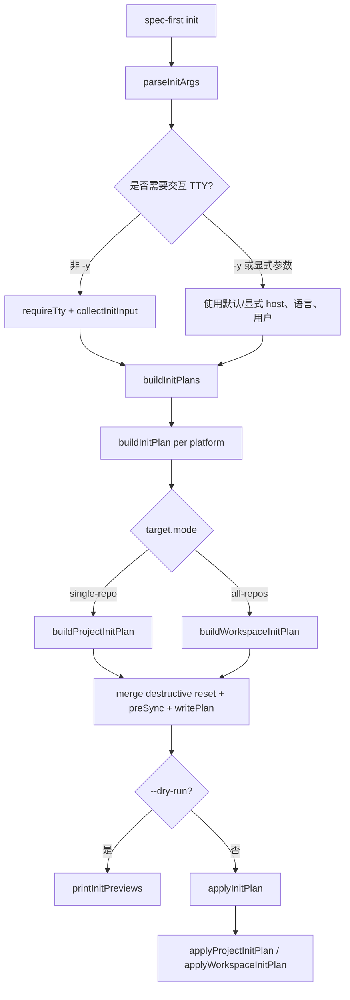
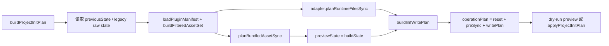

`spec-first init` 的核心职责不是“安装一组文件”，而是把仓库内的 **Source of Truth**（skills、agents、命令模板、治理清单、用户语言策略）编译成目标宿主可加载的 **Generated Runtime**，并在写入前形成可预览、可诊断、可回滚的初始化计划。本页聚焦初始化链路本身：入口解析、交互收集、计划构建、多宿主适配、运行时文件生成、托管状态写入与多仓 workspace 初始化摘要；平台适配器细节、漂移修复机制和 Source/Runtime 边界会在后续页面展开。Sources: [index.js](src/cli/index.js#L44-L50), [init.js](src/cli/commands/init.js#L115-L155), [init.js](src/cli/commands/init.js#L872-L916)

## 架构假设与验证结论

从第一性原理看，初始化流程必须同时满足三个约束：**同一套源码资产可投影到多个宿主**、**写入前能确定会改什么**、**重复 init 不应累积脏状态**。源码验证显示，CLI 入口只负责把 `init` 命令分发到 `runInit`；`runInit` 再完成参数解析、TTY/非交互约束、交互输入收集、计划构建、dry-run 预览、确认与应用；真正的宿主差异被收敛到 `PlatformAdapter` 及各宿主 adapter。Sources: [index.js](src/cli/index.js#L19-L80), [init.js](src/cli/commands/init.js#L115-L254), [base.js](src/cli/adapters/base.js#L5-L145)

这张图中的关键分界是 `buildInitPlan` 与 `applyInitPlan`：前者只构造结构化计划，后者才执行计划；因此 `--dry-run` 能复用同一套计划生成逻辑而不改变运行时资产。Sources: [init.js](src/cli/commands/init.js#L188-L224), [init.js](src/cli/commands/init.js#L872-L916), [init.js](src/cli/commands/init.js#L2765-L2835)

## 命令入口、参数语义与默认宿主

`spec-first init` 在 CLI 分发层是一个顶层命令；帮助信息声明它支持 `--claude`、`--codex`、`--cursor`、`--kiro`、`--qoder`、`-y/--yes`、`--all-repos`、`--repo <path>`、`--lang <zh|en>`、`--sync-user-language`、`--no-sync-user-language` 与 `--dry-run`。当使用 `-y` 且未显式选择平台时，默认宿主集合是 Claude Code 与 Codex；Cursor、Kiro、Qoder 需要显式 flag 才会进入非交互初始化。Sources: [index.js](src/cli/index.js#L158-L173), [init.js](src/cli/commands/init.js#L264-L377), [init.js](src/cli/commands/init.js#L567-L570), [init.js](src/cli/commands/init.js#L2107-L2143)

| 入口选项 | 初始化语义 | 影响范围 |
|---|---|---|
| `--claude` / `--codex` / `--cursor` / `--kiro` / `--qoder` | 显式选择一个或多个宿主 runtime | 决定 adapter、运行时目录、命令/skill/agent 投影方式 |
| `-y` / `--yes` | 跳过交互；未显式 host 时使用默认 host | 默认只初始化 Claude Code + Codex |
| `--dry-run` | 构建并打印计划，不写入文件 | 用于预览 remove / ensure / write / untrack |
| `--all-repos` | 在父级 workspace 中初始化所有子 Git 仓库 | 生成父级 advisory summary，并逐个初始化 child repo |
| `--repo <path>` | 在父级 workspace 中指定单个子仓库 | 限定初始化目标 |
| `--lang zh|en` | 设置用户可见输出语言与 instruction managed block | 写入 instruction 文件与全局 developer profile |

## 交互收集：语言、宿主、开发者身份与 workspace 目标

交互路径首先解析默认值与全局 developer profile；若已有全局 profile 且用户未显式覆盖，初始化会优先询问是否沿用，而不是无条件重新询问语言和名字。随后选择宿主列表，交互多选框会根据上次记录的 hosts 预勾选；非交互路径则直接使用显式 platforms 或默认 platforms。Sources: [init.js](src/cli/commands/init.js#L379-L435), [init.js](src/cli/commands/init.js#L443-L510), [init.js](src/cli/commands/init.js#L573-L578)

用户身份解析不仅用于提示展示，也会进入初始化计划中的 `developer` 对象，并在需要时写入全局 `~/.spec-first/.developer`。源码中 `resolveGlobalDeveloperWriteAction` 区分 create、overwrite、preserve：已有 profile 且 name/lang 未变时，如果本次 host 选择变化，也会只更新 hosts，避免用户重新选择宿主后被静默丢弃。Sources: [init.js](src/cli/commands/init.js#L990-L998), [init.js](src/cli/commands/init.js#L2526-L2570), [init.js](src/cli/commands/init.js#L1195-L1202)

当检测到父级 workspace 内存在子 Git 仓库时，初始化可以进入 workspace targeting：`--all-repos` 会构造父级计划与每个 child repo 计划；`--repo <path>` 则限定目标。子仓库发现逻辑最多向下扫描 3 层，并跳过 `.claude`、`.codex`、`.kiro`、`.qoder`、`.spec-first`、`node_modules`、`vendor` 等目录，以避免把 generated runtime 或依赖目录误识别为业务仓库。Sources: [init.js](src/cli/commands/init.js#L480-L510), [init.js](src/cli/commands/init.js#L1520-L1571), [init.js](src/cli/commands/init.js#L2157-L2208)

## 初始化计划：先计算，再写入

`buildInitPlan` 是初始化的总计划入口：它先规范化平台并取出 adapter，然后根据 target mode 选择 `buildWorkspaceInitPlan` 或 `buildProjectInitPlan`。这使单仓库与多仓 workspace 共用同一个 project-level 计划生成器，而 workspace 只是在外层组合 parent plan 与 child plans。Sources: [init.js](src/cli/commands/init.js#L872-L904), [init.js](src/cli/commands/init.js#L1519-L1571)

`buildProjectInitPlan` 的计划由三类操作合并而成：第一类是必要的 destructive reset，用于 legacy state 或当前 runtime drift；第二类是 pre-sync 清理，包括 obsolete managed asset removal、command namespace prune、retired runtime asset prune、legacy developer profile cleanup；第三类是实际写入计划，包括 bundled assets、平台 runtime 文件、`.gitignore`、instruction 文件、state 文件、CHANGELOG、hook 配置与 runtime untrack。Sources: [init.js](src/cli/commands/init.js#L1073-L1124), [init.js](src/cli/commands/init.js#L2619-L2641), [init.js](src/cli/commands/init.js#L2692-L2757)

计划对象包含 `schema_version: spec-first-init-plan.v1`、`mode`、`projectRoot`、`platform`、`adapterId`、`developer`、`previousState`、`previewState`、`preSyncPlan`、`writePlan`、`operationPlan`、`syncedAssets`、`diagnostics`、`errors` 与 `summary`。这些字段让初始化结果既可打印给用户，也可被测试与其他模块复用；`src/cli/init-plan.js` 还显式导出 `buildInitPlan` 和 `applyInitPlan`，说明计划构建/应用是稳定的内部接口。Sources: [init.js](src/cli/commands/init.js#L1129-L1154), [init-plan.js](src/cli/init-plan.js#L1-L9)

## 多宿主 adapter：同一资产，不同运行时形态

宿主差异通过 `src/cli/adapters/index.js` 统一注册，当前支持 `claude`、`codex`、`cursor`、`kiro`、`qoder`。基础 adapter 定义了 runtimeRoot、managedRoot、commandRoot、skillsRoot、workflowsRoot、agentsRoot、stateFile、instructionFile、命令渲染、skill 转换、agent 转换、runtime 文件同步与检查等接口；具体宿主只覆盖自己的路径、能力与转换规则。Sources: [adapters/index.js](src/cli/adapters/index.js#L1-L40), [base.js](src/cli/adapters/base.js#L5-L145)

| 宿主 | 命令入口 | Skill / Workflow 位置 | Agent 位置 | Instruction 文件 | State 文件 | 运行时备注 |
|---|---|---|---|---|---|---|
| Claude Code | `.claude/commands/spec-*.md` | standalone: `.claude/skills`；workflow: `.claude/spec-first/workflows` | `.claude/agents` | `CLAUDE.md` | `.claude/spec-first/state.json` | 生成 SessionStart、spec-plan guard、PRD guard 等 hook |
| Codex | 不生成 command；依赖 skill discovery | `.agents/skills` | `.codex/agents` | `AGENTS.md` | `.codex/spec-first/state.json` | 项目级 `.codex/hooks.json`；在 CODEX_HOME 项目根会跳过 hook 写入 |
| Cursor | 不生成 command | `.cursor/skills` | 不投影 spec-first agents | `AGENTS.md` | `.cursor/spec-first/state.json` | generated-runtime preview，并输出 loader 未验证警告 |
| Kiro | 不生成 command | `.kiro/skills` | `.kiro/agents` | `AGENTS.md` | `.kiro/spec-first/state.json` | agent frontmatter 会改写为 Kiro 只读工具集 |
| Qoder | `.qoder/commands/spec-*.md` | `.qoder/skills` | `.qoder/agents` | `AGENTS.md` | `.qoder/spec-first/state.json` | command frontmatter 与 agent tools 会按 Qoder 规则重写 |

Claude adapter 使用 `.claude/commands` 暴露 `spec-*` 命令，同时把 workflow skill 放入 `.claude/spec-first/workflows`，并将 standalone skills 放入 `.claude/skills`；它还会把 canonical agent name 改写为 Claude 可执行引用，并为 runtime setup surface 注入 Claude host pin。Sources: [claude.js](src/cli/adapters/claude.js#L43-L113), [claude.js](src/cli/adapters/claude.js#L184-L200)

Codex adapter 明确把 `.agents/skills` 作为用户可见 workflow 入口，`hasCommands` 为 false，`.codex/commands/spec` 只作为 legacy compatibility cleanup target；Codex 的 hook 写入还会检测当前 project root 是否等同 CODEX_HOME，若是则跳过 SessionStart hook 写入以避免全局双重注入。Sources: [codex.js](src/cli/adapters/codex.js#L27-L75), [codex.js](src/cli/adapters/codex.js#L139-L155)

Cursor adapter 当前是 generated-runtime preview：它不生成 command，不支持 spec-first agents，skills 与 workflows 都落在 `.cursor/skills`，并在 runtime inspection 中固定输出“Cursor skill discovery/invocation 未在本机验证”的 warning。Sources: [cursor.js](src/cli/adapters/cursor.js#L54-L97), [cursor.js](src/cli/adapters/cursor.js#L129-L170)

Kiro adapter 不生成 command，skills/workflows 位于 `.kiro/skills`，agents 位于 `.kiro/agents`；agent 内容会被转换为 Kiro frontmatter，并限制工具为 `read`。Sources: [kiro.js](src/cli/adapters/kiro.js#L29-L68), [kiro.js](src/cli/adapters/kiro.js#L85-L101)

Qoder adapter 生成 `.qoder/commands/spec-*.md` 命令，同时也生成 `.qoder/skills` 与 `.qoder/agents`；命令渲染会重组 frontmatter，agent 转换会依据原始 tools/body 决定 Qoder agent tools。Sources: [qoder.js](src/cli/adapters/qoder.js#L27-L66), [qoder.js](src/cli/adapters/qoder.js#L68-L124)

## 资产过滤与 runtime 投影

初始化不会把所有源码资产无差别复制到每个宿主，而是先读取 skills governance truth source，构造 per-platform filtered asset set。`buildFilteredAssetSet` 按 `entry_surface` 与 `host_delivery[platform]` 决定 workflow command 是投影为 command、skill 还是跳过；standalone skill 只有 delivery 为 skill 时写入；internal-only skill 只有 delivery 为 internal 且在 allowlist 中才写入。Sources: [plugin.js](src/cli/plugin.js#L107-L150), [plugin.js](src/cli/plugin.js#L586-L655)

`planBundledAssetSync` 把 filtered asset set 编译成三组计划：commands、skills、agents。commands 只在 `adapter.hasCommands` 为 true 时生成；agents 在 `adapter.supportsAgents === false` 时为空；skills 会按 standalone、internal、workflow 三类合并去重，并根据 adapter 的 `skillsRoot` 与 `workflowsRoot` 决定目标目录。Sources: [plugin.js](src/cli/plugin.js#L690-L710), [plugin.js](src/cli/plugin.js#L734-L758), [plugin.js](src/cli/plugin.js#L799-L858), [plugin.js](src/cli/plugin.js#L887-L924)

运行时投影的核心是 adapter 的 transform hooks：命令内容通过 `adapter.renderCommandContent`，skill 文本通过 `adapter.transformSkillContent`，agent 文本通过 `adapter.transformAgentContent`。这解释了为什么同一个 `skills/spec-plan/SKILL.md` 可以在 Claude 中成为 command-backed workflow，在 Codex/Kiro/Cursor 中成为 skill discovery 入口，在 Qoder 中同时适配 command frontmatter 与 skill path。Sources: [base.js](src/cli/adapters/base.js#L86-L123), [plugin.js](src/cli/plugin.js#L742-L749), [plugin.js](src/cli/plugin.js#L839-L846), [plugin.js](src/cli/plugin.js#L896-L903)

## Instruction bootstrap、语言策略与最小路由锚点

每次 init 都会更新宿主的 instruction 文件：Claude 写 `CLAUDE.md`，其他当前 adapter 写 `AGENTS.md`。写入前会先移除 legacy runtime tools block 与 legacy coding guidelines block，再写入语言 managed block，最后写入 using-spec-first bootstrap block；这使用户可见输出语言与 workflow 入口治理在会话启动时即存在。Sources: [claude.js](src/cli/adapters/claude.js#L76-L82), [codex.js](src/cli/adapters/codex.js#L69-L75), [cursor.js](src/cli/adapters/cursor.js#L91-L97), [kiro.js](src/cli/adapters/kiro.js#L62-L68), [qoder.js](src/cli/adapters/qoder.js#L60-L66), [init.js](src/cli/commands/init.js#L2692-L2722)

bootstrap block 使用 `<!-- spec-first:bootstrap:start -->` 与 `<!-- spec-first:bootstrap:end -->` 包裹；重新 init 时，如果 markers 完整就替换 block，如果 marker 损坏则按更保守的规则清理 spec-first 已知内容，避免重复追加，也避免误删用户自写内容。Sources: [instruction-bootstrap.js](src/cli/instruction-bootstrap.js#L5-L20), [instruction-bootstrap.js](src/cli/instruction-bootstrap.js#L84-L113), [instruction-bootstrap.js](src/cli/instruction-bootstrap.js#L115-L138)

bootstrap 内容本身只提供最小入口锚点：何时进入 workflow、何时直接回答、何时不重新分流、如何按意图路由，以及 setup/runtime、debug、review、brainstorm、prd、plan、work 等入口提示；完整路由表仍在 `skills/using-spec-first/SKILL.md`。Sources: [instruction-bootstrap.js](src/cli/instruction-bootstrap.js#L140-L169), [instruction-bootstrap.js](src/cli/instruction-bootstrap.js#L171-L200)

## 写入、dry-run 与安全应用

`--dry-run` 路径打印计划摘要而不写文件，包括将删除的文件/目录、将 prune 的 command、将 ensure 的目录、将写入/更新的文件，以及 runtime untrack 诊断；最后明确输出“no files changed”语义。Sources: [init.js](src/cli/commands/init.js#L206-L219), [init.js](src/cli/commands/init.js#L2765-L2835), [init.js](src/cli/commands/init.js#L2861-L2883)

实际应用时，`applyProjectInitPlan` 会先应用 destructive reset 与 preSync，再应用 writePlan；如果存在 destructive reset，它会先创建 runtime rollback backup，发生异常时恢复备份并清理 backup。成功后再写入全局 developer profile，并返回 runtime untrack summary。Sources: [init.js](src/cli/commands/init.js#L1157-L1193), [init.js](src/cli/commands/init.js#L1195-L1202)

底层写文件操作通过 operation plan 执行，而公共原子写工具会先创建同目录临时文件，写入后 `renameSync` 到目标路径；异常时删除临时文件。这一策略保证单个文件写入不是“半截文件”状态。Sources: [atomic-write.js](src/cli/atomic-write.js#L5-L22), [state.js](src/cli/state.js#L86-L91)

## 托管状态与重复 init 的幂等边界

每个宿主都有自己的 `stateFile`，其中记录 manifestVersion、platform、commands、skills、workflowSkills、agents、agentSupportFiles。初始化会用当前 filtered asset set 构造 `previewState`，并基于 previousState 规划 obsolete removal、namespace prune、retired runtime prune；因此重复 init 的目标是让 generated runtime 回到当前 manifest 对应的状态，而不是增量叠加文件。Sources: [state.js](src/cli/state.js#L62-L75), [state.js](src/cli/state.js#L99-L124), [init.js](src/cli/commands/init.js#L1014-L1047), [init.js](src/cli/commands/init.js#L1106-L1124)

state 读取会校验必须字段与路径安全：commands、skills、workflowSkills、agents、agentSupportFiles 必须是字符串数组；路径不能是绝对路径、不能包含反斜杠、不能包含危险 segment，也会拒绝 Windows 保留名等不安全路径。Sources: [state.js](src/cli/state.js#L6-L37), [state.js](src/cli/state.js#L127-L187)

## 多仓 workspace 初始化摘要

`all-repos` 模式会分别应用 parent runtime plan 与每个 child repo plan，并生成 `workspace-init-summary.v1`。summary 记录 parent host runtime 状态、child repo 结果、ready/action_required 计数、platform/platforms、dry_run、selection_source、next_action 等字段；它是 advisory，不把 child repo truth 合并到父级。Sources: [init.js](src/cli/commands/init.js#L1574-L1666), [init.js](src/cli/commands/init.js#L1668-L1719)

workspace summary 写入前会校验目标路径 containment：通过 nearest existing path 的 realpath 与 workspace root realpath 判断是否存在 symlink escape；如果路径不安全，初始化会返回 action-required 结果而不是继续写入。Sources: [init.js](src/cli/commands/init.js#L1645-L1657), [init.js](src/cli/commands/init.js#L2274-L2290)

## 初始化完成后的用户信号

初始化成功后，CLI 会按宿主输出下一步：重启宿主或新开会话，让宿主加载 generated entrypoints；轻量 docs、小修复、首次试用、plan、work、review、debug 可以直接使用匹配的 `spec-*` workflow；需要更完整 readiness 时，再运行对应宿主中的 `spec-mcp-setup`。多宿主初始化时，提示会合并宿主名称，并强调在对应宿主启动同名 workflow 入口。Sources: [init.js](src/cli/commands/init.js#L1204-L1257), [init.js](src/cli/commands/init.js#L2063-L2105)

## 与相邻页面的阅读关系

如果你想理解 `spec-first init` 如何被顶层 CLI 发现与分发，下一步阅读 [命令行入口与命令分发架构](17-ming-ling-xing-ru-kou-yu-ming-ling-fen-fa-jia-gou)；如果你要深入每个宿主 adapter 的路径改写、frontmatter 改写与能力差异，继续阅读 [平台适配器与宿主差异封装](19-ping-tai-gua-pei-qi-yu-su-zhu-chai-yi-feng-zhuang)；如果你关心 state、atomic write、runtime drift 与 repair 的完整机制，阅读 [托管状态、原子写入与运行时漂移修复](20-tuo-guan-zhuang-tai-yuan-zi-xie-ru-yu-yun-xing-shi-piao-yi-xiu-fu)；如果你要判断哪些文件能手改、哪些是生成镜像，阅读 [Source of Truth 与 Generated Runtime 边界](21-source-of-truth-yu-generated-runtime-bian-jie)。Sources: [index.js](src/cli/index.js#L44-L80), [adapters/index.js](src/cli/adapters/index.js#L1-L40), [state.js](src/cli/state.js#L62-L124), [init.js](src/cli/commands/init.js#L2619-L2757)