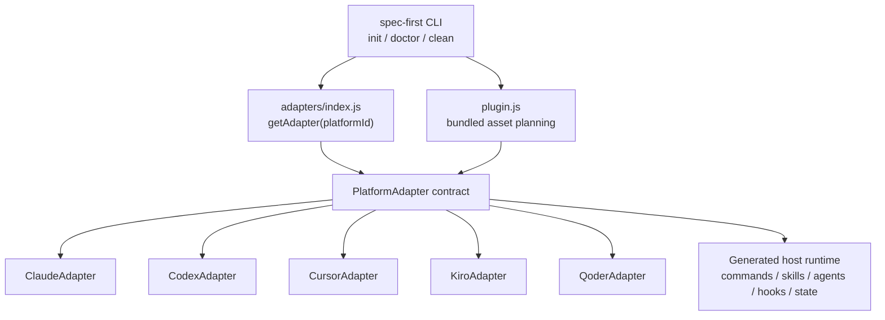
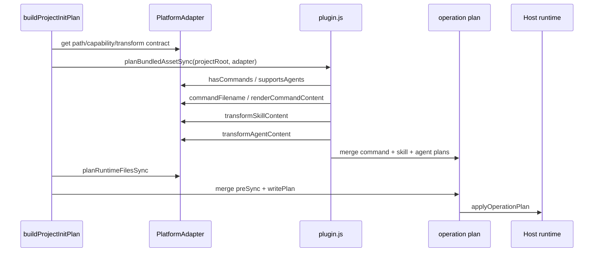

本页解释 spec-first 如何用 **PlatformAdapter 抽象层**把 Claude Code、Codex、Cursor、Kiro 与 Qoder 的运行时目录、入口形态、Skill/Agent 转换、Hook 写入、健康检查与清理差异封装在 CLI 内部；它不展开初始化交互主流程，也不讨论 Source of Truth 与 Generated Runtime 的边界，那些内容分别应继续阅读[初始化流程与多宿主运行时生成](18-chu-shi-hua-liu-cheng-yu-duo-su-zhu-yun-xing-shi-sheng-cheng)与[Source of Truth 与 Generated Runtime 边界](21-source-of-truth-yu-generated-runtime-bian-jie)。Sources: [base.js](src/cli/adapters/base.js#L1-L177), [index.js](src/cli/adapters/index.js#L1-L40), [init.js](src/cli/commands/init.js#L77-L113)

## 架构假设：宿主差异被限制在 Adapter 边界内

从第一性原理看，多宿主支持的核心问题不是“复制几套目录”，而是同一组 bundled commands、skills、agents 在不同宿主中具有不同的 **发现入口、文件命名、frontmatter 约束、agent 调度语义、hook 生命周期与漂移检测规则**；代码中的假设是：CLI 主流程只依赖统一的 adapter 接口，宿主差异通过 `src/cli/adapters/*.js` 的子类实现，并由 `getAdapter(platformId)` 在运行时选择。Sources: [base.js](src/cli/adapters/base.js#L5-L45), [base.js](src/cli/adapters/base.js#L86-L173), [index.js](src/cli/adapters/index.js#L1-L27)

上图表达的是调用方向而非部署拓扑：`init`、`doctor`、`clean` 都先确定 platform，再通过 adapter 读取路径、能力开关和转换函数；asset 同步层只关心 `hasCommands`、`supportsAgents`、`commandRoot`、`skillsRoot`、`workflowsRoot`、`agentsRoot` 这些接口，不直接硬编码某个宿主的目录细节。Sources: [init.js](src/cli/commands/init.js#L441-L442), [plugin.js](src/cli/plugin.js#L690-L710), [doctor.js](src/cli/commands/doctor.js#L443-L486), [clean.js](src/cli/commands/clean.js#L392-L436)

## Adapter 契约：路径、能力、转换与运行时文件生命周期

`PlatformAdapter` 的接口可以分成四类：第一类是宿主标识与运行时路径，例如 `id`、`runtimeRoot`、`managedRoot`、`commandRoot`、`skillsRoot`、`workflowsRoot`、`agentsRoot`、`stateFile`、`instructionFile`；第二类是能力开关，例如默认启用的 `hasCommands` 与 `supportsAgents`；第三类是内容转换入口，例如 `commandFilename()`、`renderCommandContent()`、`transformSkillContent()`、`transformAgentContent()`；第四类是宿主额外运行时文件生命周期，例如 `planRuntimeFilesSync()`、`planRuntimeFilesRemoval()`、`inspectRuntimeFiles()`、`removeRuntimeFiles()`。Sources: [base.js](src/cli/adapters/base.js#L5-L84), [base.js](src/cli/adapters/base.js#L86-L123), [base.js](src/cli/adapters/base.js#L125-L173)

| 契约维度 | Adapter 方法或属性 | 作用范围 | 默认行为 |
|---|---|---|---|
| 身份与路径 | `id`, `runtimeRoot`, `managedRoot`, `stateFile`, `instructionFile` | 决定宿主运行时与托管状态位置 | 必须由子类实现 |
| 入口能力 | `hasCommands`, `supportsAgents` | 决定是否生成命令文件、Agent 文件 | 默认 `true` |
| 内容投影 | `commandFilename`, `renderCommandContent`, `transformSkillContent`, `transformAgentContent` | 将源资产投影为宿主可读格式 | 默认保留原文件名与原内容 |
| 附加文件 | `planRuntimeFilesSync`, `planRuntimeFilesRemoval`, `inspectRuntimeFiles`, `removeRuntimeFiles` | Hook、settings、遗留目录等宿主特有文件 | 默认空操作 |

这个契约使 CLI 主流程能把“生成什么”与“如何适配某个宿主”分离：`plugin.js` 根据 adapter 计划 commands、skills、agents 的写入，`doctor.js` 根据 adapter 组合通用检查和宿主检查，`clean.js` 根据 adapter 删除托管运行时与宿主额外文件。Sources: [plugin.js](src/cli/plugin.js#L690-L710), [doctor.js](src/cli/commands/doctor.js#L443-L486), [clean.js](src/cli/commands/clean.js#L400-L436)

## 宿主注册与选择：受支持平台是显式集合

当前受支持宿主由 adapter registry 显式注册为 `claude`、`codex`、`cursor`、`kiro`、`qoder`，`getSupportedPlatforms()` 返回该集合，未知 platform 会在 `getAdapter()` 中直接抛错；`init` 的交互选项也维护同一组宿主标识与用户可见标签，其中 Claude Code 与 Codex 是 `-y/--yes` 的默认宿主，Cursor、Kiro、Qoder 不是默认选中项。Sources: [index.js](src/cli/adapters/index.js#L1-L40), [init.js](src/cli/commands/init.js#L77-L113), [init.js](src/cli/commands/init.js#L567-L574)

| 宿主 | CLI flag | `-y` 默认 | Adapter 类 | 注册 ID |
|---|---:|---:|---|---|
| Claude Code | `--claude` | 是 | `ClaudeAdapter` | `claude` |
| Codex | `--codex` | 是 | `CodexAdapter` | `codex` |
| Cursor | `--cursor` | 否 | `CursorAdapter` | `cursor` |
| Kiro | `--kiro` | 否 | `KiroAdapter` | `kiro` |
| Qoder | `--qoder` | 否 | `QoderAdapter` | `qoder` |

`init` 参数解析不会动态扫描宿主，而是把显式 flag 映射到 `INIT_PLATFORM_CHOICES` 中的 platform id；交互式选择也使用该列表渲染 checkbox，并在生成计划时对每个 platform 调用 `buildInitPlan()`。Sources: [init.js](src/cli/commands/init.js#L264-L376), [init.js](src/cli/commands/init.js#L421-L442), [init.js](src/cli/commands/init.js#L593-L599)

## 运行时目录矩阵：同一资产，不同投影位置

不同宿主最大的可见差异是 runtime shape：Claude 使用 `.claude/commands`、`.claude/skills`、`.claude/spec-first/workflows` 与 `.claude/agents`；Codex 不生成 command 文件，而将 workflow 与 standalone skill 都放在 `.agents/skills`，Agent 放在 `.codex/agents`；Cursor 不生成 command，也不投影 spec-first agents，Skill 位于 `.cursor/skills`；Kiro 不生成 command，Skill 位于 `.kiro/skills`，Agent 位于 `.kiro/agents`；Qoder 生成 `.qoder/commands/spec-*.md`，Skill 与 workflow 位于 `.qoder/skills`，Agent 位于 `.qoder/agents`。Sources: [claude.js](src/cli/adapters/claude.js#L43-L82), [codex.js](src/cli/adapters/codex.js#L36-L83), [cursor.js](src/cli/adapters/cursor.js#L54-L97), [kiro.js](src/cli/adapters/kiro.js#L29-L68), [qoder.js](src/cli/adapters/qoder.js#L27-L66)

| 宿主 | Command 入口 | Skill root | Workflow root | Agent root | Instruction file | State file |
|---|---|---|---|---|---|---|
| Claude | `.claude/commands/spec-*.md` | `.claude/skills` | `.claude/spec-first/workflows` | `.claude/agents` | `CLAUDE.md` | `.claude/spec-first/state.json` |
| Codex | 不生成 command | `.agents/skills` | `.agents/skills` | `.codex/agents` | `AGENTS.md` | `.codex/spec-first/state.json` |
| Cursor | 不生成 command | `.cursor/skills` | `.cursor/skills` | 不支持投影 | `AGENTS.md` | `.cursor/spec-first/state.json` |
| Kiro | 不生成 command | `.kiro/skills` | `.kiro/skills` | `.kiro/agents` | `AGENTS.md` | `.kiro/spec-first/state.json` |
| Qoder | `.qoder/commands/spec-*.md` | `.qoder/skills` | `.qoder/skills` | `.qoder/agents` | `AGENTS.md` | `.qoder/spec-first/state.json` |

这张矩阵解释了为什么上游 bundled source 不能直接成为运行时事实源：同一个 workflow skill 在 Claude 中可同时生成 command 与 workflow mirror，在 Codex/Kiro/Cursor 中则主要通过 skill discovery 暴露，在 Qoder 中 command frontmatter 又需要重新渲染。Sources: [plugin.js](src/cli/plugin.js#L690-L710), [plugin.js](src/cli/plugin.js#L734-L759), [plugin.js](src/cli/plugin.js#L799-L858), [qoder.js](src/cli/adapters/qoder.js#L68-L90)

## Asset 同步管线：Adapter 决定是否生成 command 与 agent

`planBundledAssetSync()` 是资产投影的中枢：如果 `adapter.hasCommands` 为真，它会调用 `planCommandsSync()`；无论是否有 command，都会调用 `planSkillsSync()`；如果 `adapter.supportsAgents === false`，则跳过 Agent 计划，否则调用 `planAgentsSync()`；最后把这些 operation plan 合并为统一的 `syncedAssets`。Sources: [plugin.js](src/cli/plugin.js#L690-L710)

在 command 同步中，runtime command 的文件名先经 `adapter.commandFilename()` 改写，再由 `renderRuntimeCommandContent()` 走 adapter 渲染；在 skill 同步中，workflow skill 会根据 `adapter.workflowsRoot` 投影到 workflow root，standalone/internal skill 投影到 `adapter.skillsRoot`，并对文本文件执行 `adapter.transformSkillContent()`；在 agent 同步中，每个 agent 文件走 `adapter.transformAgentContent()`，support files 则原样复制。Sources: [plugin.js](src/cli/plugin.js#L734-L759), [plugin.js](src/cli/plugin.js#L799-L858), [plugin.js](src/cli/plugin.js#L887-L924), [plugin.js](src/cli/plugin.js#L1078-L1084)

## 内容转换：路径重写、名称规范化与 Host Pin

Claude 的转换逻辑重点在于将 command template 与 workflow skill body 合并，并在 `spec-mcp-setup` 运行面插入 Claude Host Pin；它还会把 workflow skill 的 source runtime path 重写到 `.claude/spec-first/workflows/<skillName>`，避免运行时文档仍指向源目录。Sources: [claude.js](src/cli/adapters/claude.js#L84-L109), [claude.js](src/cli/adapters/claude.js#L242-L258)

Codex 的转换逻辑更偏向“skill discovery 运行时”：它把 Claude/Codex command 路径、`.claude/spec-first/workflows/`、`.claude/skills/`、`.codex/skills/` 重写为 `.agents/skills/`，把 agent 路径重写到 `.codex/agents/`；同时把 Task 风格的 agent 调用改写为 Codex 可理解的 `spawn_agent` 描述，并在 `spec-mcp-setup` 中插入 Codex Host Pin。Sources: [codex.js](src/cli/adapters/codex.js#L97-L120), [codex.js](src/cli/adapters/codex.js#L222-L252), [codex.js](src/cli/adapters/codex.js#L278-L323)

Cursor 的转换逻辑体现了 preview 宿主的保守策略：它关闭 command 与 agent 投影，只生成 `.cursor/skills`；Skill 内容会经过 shared path rewrite 与 Cursor frontmatter 规范化，并在 runtime setup surface 插入 Cursor Host Pin；doctor 侧会报告 “Cursor generated-runtime preview”，提示本机未验证 Cursor skill discovery/invocation。Sources: [cursor.js](src/cli/adapters/cursor.js#L67-L112), [cursor.js](src/cli/adapters/cursor.js#L129-L170), [init.js](src/cli/commands/init.js#L954-L959)

Kiro 的转换逻辑把跨宿主路径重写到 `.kiro/skills`、`.kiro/agents`、`.kiro/spec-first` 或 `.kiro/settings/mcp.json`，并将 agent frontmatter 规范为 `name`、`description`、`tools: ["read"]` 的受控形态；这说明 Kiro 适配器不仅改路径，也改 agent 元数据模型。Sources: [kiro.js](src/cli/adapters/kiro.js#L70-L101), [kiro.js](src/cli/adapters/kiro.js#L154-L190)

Qoder 的转换逻辑同时支持 command 与 skill：command 文件名为 `spec-${command.name}.md`，`renderCommandContent()` 会从 skill body 重建 Qoder command frontmatter；Agent frontmatter 会规范化 `name`、`description` 与 tools，其中基础工具为 `Read`、`Grep`、`Glob`，并可根据内容加入 Web 工具。Sources: [qoder.js](src/cli/adapters/qoder.js#L40-L105), [qoder.js](src/cli/adapters/qoder.js#L107-L124), [qoder.js](src/cli/adapters/qoder.js#L8-L10)

## Hook 与宿主额外运行时文件

Claude 适配器管理四类 hook 文件：SessionStart、spec-plan guard、PRD prewrite guard、PRD readiness guard；`planRuntimeFilesSync()` 会为每个 hook 生成 `write_file` 或 `update_file` operation，并设置 executable mode `0o755`，`inspectRuntimeFiles()` 会检查 hook 是否缺失、漂移或不可执行。Sources: [claude.js](src/cli/adapters/claude.js#L7-L38), [claude.js](src/cli/adapters/claude.js#L184-L199), [claude.js](src/cli/adapters/claude.js#L310-L350)

Codex 适配器管理 `.codex/hooks/session-start`、`.codex/hooks/session-start.cmd` 与 `.codex/hooks.json`，但当当前 project root 对应 Codex global hook 目录时会跳过 hook 写入，以避免全局 SessionStart 对每个项目重复注入；`init` 会把这个跳过行为转成 warning diagnostic，而普通项目初始化还会检测既有 global hook pollution 并给出只读告警。Sources: [codex.js](src/cli/adapters/codex.js#L12-L25), [codex.js](src/cli/adapters/codex.js#L139-L155), [init.js](src/cli/commands/init.js#L1016-L1043)

这些额外运行时文件没有塞进通用 asset 同步逻辑，而是由 adapter 的 `planRuntimeFilesSync()` 与 `planRuntimeFilesRemoval()` 承担，原因是它们不是 bundled skills/agents/commands 的简单镜像，而是宿主发现机制、hook 配置或遗留兼容目录的特殊处理。Sources: [base.js](src/cli/adapters/base.js#L134-L158), [claude.js](src/cli/adapters/claude.js#L202-L220), [codex.js](src/cli/adapters/codex.js#L157-L188), [qoder.js](src/cli/adapters/qoder.js#L168-L179)

## Doctor 检查：通用健康信号叠加宿主检查

`doctor` 的平台检查由三层组成：第一层是通用安装健康，例如 Node.js、Git、runtime asset manifest 与 global developer profile；第二层是 runtime asset health，例如 managed state、instruction bootstrap、adapter-specific runtime files、command 文件、skills、agents；第三层是 host readiness，例如对应宿主 CLI 是否可执行。Sources: [doctor.js](src/cli/commands/doctor.js#L434-L486), [doctor.js](src/cli/commands/doctor.js#L148-L200)

`doctor` 对 adapter 能力开关保持一致：只有 `adapter.hasCommands` 为真才检查 generated commands；如果 `adapter.supportsAgents === false`，则跳过 agents 与 agent support files 的库存检查；这正是 Cursor 不投影 agents、Codex 不生成 command 文件时不会被通用检查误报的关键。Sources: [doctor.js](src/cli/commands/doctor.js#L449-L469), [cursor.js](src/cli/adapters/cursor.js#L67-L89), [codex.js](src/cli/adapters/codex.js#L49-L67)

各 adapter 还能追加自己的 runtime shape 检查：Claude 检查 canonical agent name、Task agent reference 与 managed hook；Codex 检查 hook 文件与 hooks.json，且在 Codex home project root 下返回 skipped hook 检查；Cursor 报告 generated-runtime preview 并检查 unexpected command/agents 目录；Kiro 检查 unexpected command 目录、skill name 与 agent frontmatter；Qoder 检查 command、skill name 与 agent frontmatter。Sources: [claude.js](src/cli/adapters/claude.js#L132-L181), [codex.js](src/cli/adapters/codex.js#L190-L204), [cursor.js](src/cli/adapters/cursor.js#L129-L170), [kiro.js](src/cli/adapters/kiro.js#L119-L147), [qoder.js](src/cli/adapters/qoder.js#L143-L166)

## Clean 与运行时清理：只删除托管资产和宿主附加文件

`clean` 明确要求一次只能选择一个 host flag，并通过 `getAdapter(platform)` 读取对应 state；它先基于 state 删除托管资产，再通过 `buildRuntimeCleanupPreview()` 清理 instruction managed blocks、state file、Claude settings hook matcher，以及 adapter 提供的宿主 runtime removal operations。Sources: [clean.js](src/cli/commands/clean.js#L43-L57), [clean.js](src/cli/commands/clean.js#L58-L115), [clean.js](src/cli/commands/clean.js#L392-L436)

Claude clean 会移除退休的 `.claude/commands/spec` namespace 与四个 managed hook 文件；Codex clean 会清理 command 兼容目录、legacy plugin roots、legacy Codex skills、SessionStart hooks 与 hooks.json managed entry；Qoder clean 会移除退休的 `.qoder/commands/spec` namespace。Sources: [claude.js](src/cli/adapters/claude.js#L202-L226), [codex.js](src/cli/adapters/codex.js#L157-L216), [qoder.js](src/cli/adapters/qoder.js#L168-L179)

这里的边界很重要：clean 不试图删除用户自定义资产，只围绕 state 中记录的 managed assets 与 adapter 声明的 managed runtime files 工作；这与 CLI 输出中的 “Custom assets outside the spec-first managed set were left untouched” 一致。Sources: [clean.js](src/cli/commands/clean.js#L102-L114), [state.js](src/cli/state.js#L1-L35)

## 适配器设计带来的扩展规则

新增或修改宿主适配时，必须同时考虑五个面：注册面要在 `adapters/index.js` 和 `INIT_PLATFORM_CHOICES` 暴露；路径面要实现 runtime roots、skills/workflows/agents/state/instruction 文件；能力面要设置 `hasCommands` 与 `supportsAgents`；内容面要实现 command/skill/agent 转换；运维面要实现 runtime sync、runtime removal 与 inspect checks，否则 init、doctor、clean 三条链路会出现不一致。Sources: [index.js](src/cli/adapters/index.js#L1-L40), [init.js](src/cli/commands/init.js#L77-L113), [base.js](src/cli/adapters/base.js#L34-L48), [base.js](src/cli/adapters/base.js#L86-L173)

从现有实现看，最容易遗漏的是“内容引用中的其他宿主路径”：Codex、Cursor、Kiro、Qoder 都有自己的 `rewriteSharedPaths()` 或等价逻辑，把 `.claude/**`、`.codex/**`、`.agents/skills/**`、`.kiro/**`、`.qoder/**` 等引用改写为当前宿主运行时路径；如果只改目录常量而不改内容引用，doctor 的 runtime drift 或宿主专属检查会暴露这些未重写路径。Sources: [codex.js](src/cli/adapters/codex.js#L222-L252), [cursor.js](src/cli/adapters/cursor.js#L177-L200), [kiro.js](src/cli/adapters/kiro.js#L154-L190), [qoder.js](src/cli/adapters/qoder.js#L186-L200)

## 与相邻页面的阅读关系

如果你需要理解 adapter 是如何被 `spec-first init` 触发并写入项目的，下一步读[初始化流程与多宿主运行时生成](18-chu-shi-hua-liu-cheng-yu-duo-su-zhu-yun-xing-shi-sheng-cheng)；如果你需要理解 state、atomic write 与漂移修复如何保护这些 generated runtime，继续读[托管状态、原子写入与运行时漂移修复](20-tuo-guan-zhuang-tai-yuan-zi-xie-ru-yu-yun-xing-shi-piao-yi-xiu-fu)；如果你要判断哪些文件是源、哪些文件是生成镜像，继续读[Source of Truth 与 Generated Runtime 边界](21-source-of-truth-yu-generated-runtime-bian-jie)。Sources: [init.js](src/cli/commands/init.js#L906-L1155), [plugin.js](src/cli/plugin.js#L690-L710), [clean.js](src/cli/commands/clean.js#L392-L436)