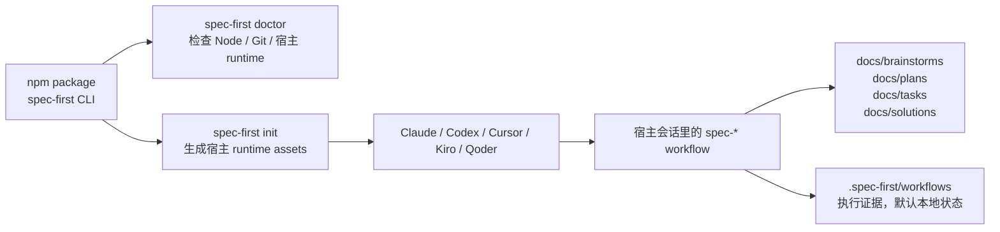
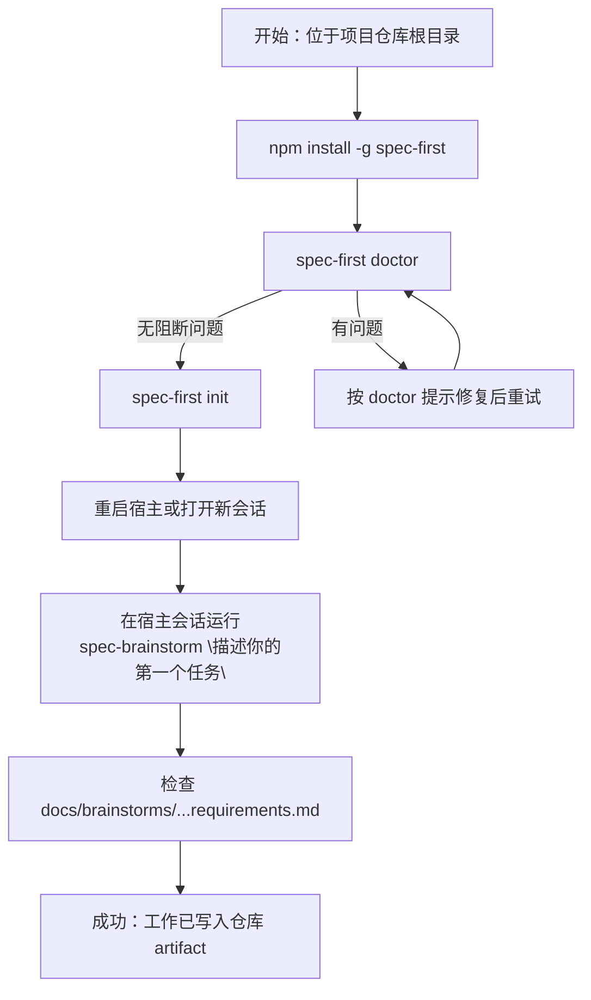

本页是 spec-first 的**最短可运行路径**：安装 CLI、检查环境、初始化宿主 runtime、重启宿主，然后在 Claude Code、Codex、Cursor、Kiro 或 Qoder 会话里运行第一个 `spec-*` workflow，并确认仓库里出现可检查的 Markdown artifact。这里不展开工作流治理细节，只帮助你在约 5 分钟内看到第一个成功信号。Sources: [README.zh-CN.md](README.zh-CN.md#L36-L45), [README.zh-CN.md](README.zh-CN.md#L74-L88), [README.zh-CN.md](README.zh-CN.md#L90-L111)

## 先建立一个正确心智模型

spec-first 不是另一个聊天机器人，也不是只给模型看的 prompt 包；它是一个安装在你项目里的 **AI Coding Harness**。CLI 负责把仓库内的 source assets 生成到不同宿主可识别的 runtime surface，宿主里的 `spec-*` workflow 再把一次性对话变成仓库里的 requirements、plans、work evidence、review findings 和 reusable learning。Sources: [README.zh-CN.md](README.zh-CN.md#L16-L20), [README.zh-CN.md](README.zh-CN.md#L193-L199), [package.json](package.json#L2-L8)



上图的关键边界是：`spec-first doctor`、`spec-first init`、`spec-first update`、`spec-first clean` 属于 package CLI 命令；`spec-brainstorm`、`spec-plan`、`spec-work`、`spec-code-review`、`spec-mcp-setup` 等是宿主加载 runtime 后提供的 workflow 入口，不是终端里的 package CLI 子命令。Sources: [src/cli/index.js](src/cli/index.js#L158-L179), [src/cli/index.js](src/cli/index.js#L196-L214), [README.zh-CN.md](README.zh-CN.md#L90-L101)

## 前置条件

开始前，请确认你在**目标项目仓库根目录**打开终端，并且已经安装 Node.js、npm、Git，以及至少一个受支持宿主。首次试用可以先在 throwaway/test repo 中体验，确认生成文件和工作流入口符合预期后，再初始化真实项目。Sources: [README.zh-CN.md](README.zh-CN.md#L40-L45), [src/cli/commands/doctor.js](src/cli/commands/doctor.js#L106-L145)

| 项目 | 要求 | 为什么需要 |
| --- | --- | --- |
| Node.js | `>=20.0.0` | package 声明引擎要求，`doctor` 也会检查 Node major version |
| npm | 随 Node 安装 | 用于全局安装 `spec-first` |
| Git | 在 `PATH` 中可用 | `doctor`、setup 与 workflow 会读取仓库事实 |
| 宿主 | Claude Code、Codex、Cursor、Kiro 或 Qoder | `init` 会为所选宿主生成 runtime assets |
| 当前目录 | 目标项目仓库根目录 | runtime 与 artifact 都写入当前项目 |

Sources: [package.json](package.json#L112-L114), [README.zh-CN.md](README.zh-CN.md#L40-L45), [src/cli/commands/doctor.js](src/cli/commands/doctor.js#L121-L145), [src/cli/adapters/index.js](src/cli/adapters/index.js#L1-L12)

## 5 分钟完成第一次运行

按下面流程走即可；先用终端安装和初始化，再切到宿主会话运行第一个 workflow。Sources: [README.zh-CN.md](README.zh-CN.md#L47-L72), [README.zh-CN.md](README.zh-CN.md#L74-L111)



### 步骤 1：安装 CLI 并检查环境

macOS / Linux 使用 npm 全局安装，然后立即运行 `doctor`。`doctor` 会检查 Node.js、Git，以及已初始化宿主的 runtime asset 状态；如果当前项目还没有检测到 spec-first 平台，它会提示你运行 `spec-first init`。Sources: [README.zh-CN.md](README.zh-CN.md#L47-L55), [src/cli/commands/doctor.js](src/cli/commands/doctor.js#L28-L65), [src/cli/commands/doctor.js](src/cli/commands/doctor.js#L106-L145)

```bash
npm install -g spec-first
spec-first doctor
```

Windows PowerShell 7+、Windows PowerShell 5.1 或 cmd.exe 也使用同一组 package CLI 命令；在 Win64 上，推荐 Windows Terminal + PowerShell 7+ 或原生 cmd.exe 做安装和 smoke check。Sources: [README.zh-CN.md](README.zh-CN.md#L56-L72)

```powershell
npm install -g spec-first
spec-first doctor
```

```bat
npm install -g spec-first
spec-first doctor
```

### 步骤 2：初始化宿主 runtime

运行 `spec-first init`，选择你当前要使用的宿主，确认开发者姓名与语言，然后确认写入。当前 CLI 支持 `--claude`、`--codex`、`--cursor`、`--kiro`、`--qoder`、`-y/--yes`、`--repo`、`--all-repos`、`-u/--user`、`--lang <zh|en>` 等初始化参数；交互模式会预览写入内容并在确认后应用。Sources: [README.zh-CN.md](README.zh-CN.md#L74-L88), [src/cli/commands/init.js](src/cli/commands/init.js#L126-L145), [src/cli/commands/init.js](src/cli/commands/init.js#L264-L377)

```bash
spec-first init
```

如果你想直接脚本化初始化某个宿主，可以使用显式 flag；例如 `spec-first init --kiro -y -u <name> --lang zh` 或 `spec-first init --qoder -y -u <name> --lang zh`。Cursor 需要显式 `--cursor` opt-in，当前属于 generated-runtime preview，CLI 会提示 Cursor skill discovery/invocation 尚未在本机验证。Sources: [README.zh-CN.md](README.zh-CN.md#L80-L88), [src/cli/commands/init.js](src/cli/commands/init.js#L93-L112), [src/cli/commands/init.js](src/cli/commands/init.js#L954-L959), [src/cli/adapters/cursor.js](src/cli/adapters/cursor.js#L135-L140)

### 步骤 3：重启宿主

初始化完成后，请重启 Claude Code、Codex、Cursor、Kiro 或 Qoder，或者打开一个新会话，让宿主重新加载刚生成的 runtime assets。不要在终端里直接执行 `spec-brainstorm`；它是宿主会话中的 workflow 入口。Sources: [README.zh-CN.md](README.zh-CN.md#L90-L101), [src/cli/index.js](src/cli/index.js#L208-L214)

### 步骤 4：运行第一个 workflow

第一次建议从 `spec-brainstorm` 开始，因为它面向“我有一个功能/问题，但行为、范围、用户、成功标准或交接上下文还没完全澄清”的场景，并会把结果写入 `docs/brainstorms/` 作为 durable handoff。Sources: [README.zh-CN.md](README.zh-CN.md#L94-L111), [skills/spec-brainstorm/SKILL.md](skills/spec-brainstorm/SKILL.md#L9-L18), [skills/spec-brainstorm/SKILL.md](skills/spec-brainstorm/SKILL.md#L21-L29)

```text
# 在任意受支持宿主会话中输入，而不是在终端中输入
spec-brainstorm "描述你的第一个任务"
```

### 步骤 5：验证成功信号

brainstorm 完成后，在仓库里检查是否出现类似 `docs/brainstorms/YYYY-MM-DD-NNN-<topic>-requirements.md` 的文件。看到这个文件，就说明第一次 workflow 已经把工作从临时对话变成了仓库内可检查 artifact。Sources: [README.zh-CN.md](README.zh-CN.md#L103-L111), [README.zh-CN.md](README.zh-CN.md#L125-L141), [skills/spec-brainstorm/SKILL.md](skills/spec-brainstorm/SKILL.md#L24-L29)

## 初始化后会生成什么

不同宿主的 runtime delivery 目录不同，但源头是一套 package 内的 `skills/`、`agents/`、`templates/` 与 `src/cli/`。不要手改生成副本来当 source truth；需要刷新时重新运行 `spec-first init`。Sources: [README.zh-CN.md](README.zh-CN.md#L193-L199), [skills/spec-mcp-setup/SKILL.md](skills/spec-mcp-setup/SKILL.md#L34-L39), [src/cli/plugin.js](src/cli/plugin.js#L25-L35)

```text
your-project/
├── .claude/                 # Claude Code runtime：commands、skills、agents、spec-first state
├── .codex/                  # Codex runtime state / hooks / agents
├── .agents/skills/          # Codex 用户可见 workflow skills
├── .cursor/                 # Cursor generated-runtime preview：skills、spec-first state
├── .kiro/                   # Kiro Agent Skills、agents、spec-first state
├── .qoder/                  # Qoder commands、skills、agents、spec-first state
├── .spec-first/             # setup facts / workflow evidence 等本地状态
└── docs/
    ├── brainstorms/         # 第一个 brainstorm artifact 通常出现在这里
    ├── plans/
    ├── tasks/
    └── solutions/
```

| 宿主 | 主要生成位置 | 入口形态 | 初学者需要知道的事 |
| --- | --- | --- | --- |
| Claude Code | `.claude/commands`、`.claude/skills`、`.claude/agents`、`.claude/spec-first` | command + skill + agent runtime | 初始化后重启 Claude Code，再使用 `spec-*` |
| Codex | `.agents/skills`、`.codex/agents`、`.codex/spec-first` | project-scoped skills | 用户可见 workflow 入口来自 `.agents/skills` |
| Cursor | `.cursor/skills`、`.cursor/spec-first` | Agent Skills preview | 需要显式 `--cursor`，当前为 generated-runtime preview |
| Kiro | `.kiro/skills`、`.kiro/agents`、`.kiro/spec-first` | Agent Skills | 不生成 command 文件，主要使用 skills |
| Qoder | `.qoder/commands`、`.qoder/skills`、`.qoder/agents`、`.qoder/spec-first` | command + skill + agent runtime | 使用统一 `spec-*` 命名 |

Sources: [src/cli/adapters/claude.js](src/cli/adapters/claude.js#L48-L78), [src/cli/adapters/codex.js](src/cli/adapters/codex.js#L41-L75), [src/cli/adapters/cursor.js](src/cli/adapters/cursor.js#L59-L97), [src/cli/adapters/kiro.js](src/cli/adapters/kiro.js#L25-L59), [src/cli/adapters/qoder.js](src/cli/adapters/qoder.js#L32-L65)

## 第一次任务该选哪个入口

快速开始阶段只需要记住一个原则：**还没说清楚“要做什么”时先 brainstorm；已经有明确输入时按任务类型选择更贴近的入口**。完整路由治理后续再读，本页只给你第一次运行和下一步选择。Sources: [README.zh-CN.md](README.zh-CN.md#L113-L123), [skills/spec-brainstorm/SKILL.md](skills/spec-brainstorm/SKILL.md#L39-L53)

| 你的任务是…… | 建议入口 | 典型产物 |
| --- | --- | --- |
| 粗略想法、功能方向或产品变化 | `spec-brainstorm` | `docs/brainstorms/` |
| 已有 PRD、需求笔记或 brownfield change request | `spec-prd` | `docs/brainstorms/` |
| bug、失败测试、堆栈或异常行为 | `spec-debug` | debugging notes / evidence |
| 已定计划、task pack 或范围明确的实现请求 | `spec-work` | 源码变更 + 执行证据 |
| 需要审查的文档、计划、task pack、diff 或实现 | `spec-doc-review` 或 `spec-code-review` | 结构化 findings |
| helper 或 MCP readiness facts 缺失 | `spec-mcp-setup` | `.spec-first/config/*` setup facts |

Sources: [README.zh-CN.md](README.zh-CN.md#L113-L123), [README.zh-CN.md](README.zh-CN.md#L143-L160), [skills/spec-mcp-setup/SKILL.md](skills/spec-mcp-setup/SKILL.md#L11-L23)

## 常见初始化选项速查

日常初学者只需要 `spec-first doctor` 和 `spec-first init`；如果你在 CI、脚本、教学环境或多仓 workspace 中使用，再考虑显式参数。Sources: [src/cli/index.js](src/cli/index.js#L158-L179), [src/cli/commands/init.js](src/cli/commands/init.js#L264-L377)

| 命令或参数 | 用途 | 示例 |
| --- | --- | --- |
| `spec-first doctor` | 检查环境、runtime manifest 与托管 runtime assets | `spec-first doctor` |
| `spec-first init` | 交互式安装 workflows、skills、agents 与开发者 profile | `spec-first init` |
| `--claude` / `--codex` / `--cursor` / `--kiro` / `--qoder` | 显式选择宿主 | `spec-first init --claude` |
| `-y` / `--yes` | 跳过交互确认，适合脚本模式 | `spec-first init --kiro -y -u Alice --lang zh` |
| `-u` / `--user` | 指定开发者名称 | `spec-first init -u Alice` |
| `--lang zh\|en` | 指定语言偏好 | `spec-first init --lang zh` |
| `--dry-run` | 只预览写入计划，不应用 | `spec-first init --dry-run` |
| `--repo <path>` | 收窄到指定 child repo | `spec-first init --repo packages/app` |
| `--all-repos` | 对父 workspace 下 child Git repos 走 all-repos 路径 | `spec-first init --all-repos` |

Sources: [src/cli/index.js](src/cli/index.js#L165-L172), [src/cli/commands/init.js](src/cli/commands/init.js#L264-L377), [docs/05-用户手册/01-快速开始.md](docs/05-用户手册/01-快速开始.md#L100-L108)

## 如果第一圈不顺利

先相信 `doctor` 的输出。它会对 Node.js、Git、宿主 CLI、命令文件、skills、agents 与 runtime drift 给出 PASS、WARNING 或 ERROR，并在需要时给出重新运行 `spec-first init` 的修复建议。Sources: [src/cli/commands/doctor.js](src/cli/commands/doctor.js#L75-L104), [src/cli/commands/doctor.js](src/cli/commands/doctor.js#L148-L200), [src/cli/commands/doctor.js](src/cli/commands/doctor.js#L203-L354)

| 现象 | 先做什么 | 原因 |
| --- | --- | --- |
| `doctor` 提示 Node.js 版本错误 | 安装 Node.js 20 或更新版本 | CLI 要求 Node `>=20.0.0` |
| `doctor` 提示 Git not found | 安装 Git 并确认在 `PATH` 中 | workflow 和 setup 会读取 Git 仓库事实 |
| 宿主里看不到 `spec-*` | 重新运行 `spec-first init` 后完全重启宿主 | runtime assets 需要宿主重新加载 |
| `spec-brainstorm` 在终端里报错 | 切到 Claude/Codex/Cursor/Kiro/Qoder 会话中输入 | `spec-*` 是宿主 workflow 入口，不是 package CLI |
| helper 或 MCP readiness facts 缺失 | 在当前宿主运行 `spec-mcp-setup` | setup workflow 负责安装、验证、刷新 required harness runtime readiness facts |
| Cursor skills 没加载 | 确认用了 `spec-first init --cursor`，并按 preview 限制排查 | Cursor 当前是 generated-runtime preview |

Sources: [package.json](package.json#L112-L114), [README.zh-CN.md](README.zh-CN.md#L82-L88), [README.zh-CN.md](README.zh-CN.md#L90-L101), [skills/spec-mcp-setup/SKILL.md](skills/spec-mcp-setup/SKILL.md#L73-L83), [src/cli/adapters/cursor.js](src/cli/adapters/cursor.js#L135-L140)

## 读完本页后去哪

如果你已经成功生成第一个 `docs/brainstorms/...requirements.md`，下一页建议读 [首次运行与成功信号](3-shou-ci-yun-xing-yu-cheng-gong-xin-hao)，确认哪些文件、输出和宿主行为代表第一圈真的跑通；如果你还没决定使用哪个宿主，读 [选择你的宿主：Claude Code、Codex、Cursor、Kiro 与 Qoder](4-xuan-ze-ni-de-su-zhu-claude-code-codex-cursor-kiro-yu-qoder)。Sources: [README.zh-CN.md](README.zh-CN.md#L103-L123), [src/cli/adapters/index.js](src/cli/adapters/index.js#L1-L12)

接下来，当你想知道“不同任务应该从哪个 `spec-*` 开始”时，读 [常用入口速查：从需求、计划、执行到审查](5-chang-yong-ru-kou-su-cha-cong-xu-qiu-ji-hua-zhi-xing-dao-shen-cha)；当你想知道哪些目录应该提交、哪些目录只是本地状态时，读 [产物目录与提交边界](6-chan-wu-mu-lu-yu-ti-jiao-bian-jie)。Sources: [README.zh-CN.md](README.zh-CN.md#L113-L160), [README.zh-CN.md](README.zh-CN.md#L125-L141), [skills/spec-mcp-setup/SKILL.md](skills/spec-mcp-setup/SKILL.md#L48-L51)