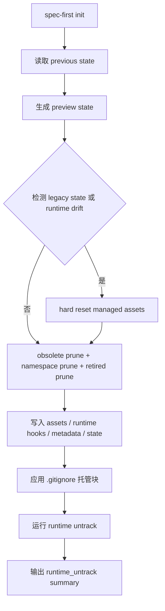
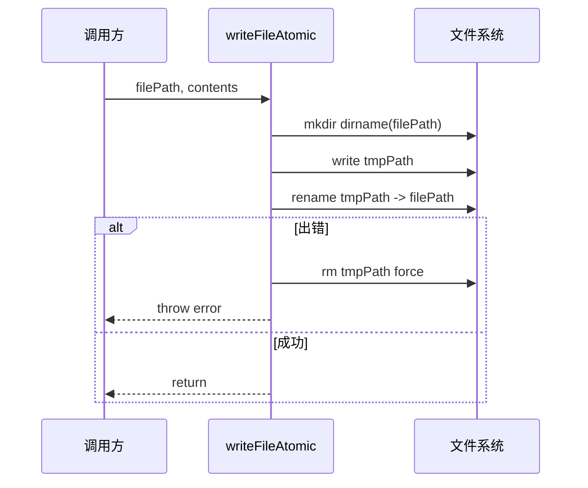
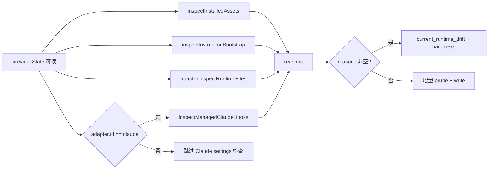

这一页解释 spec-first CLI 如何把多宿主生成物视为**受托管运行时**：状态文件记录“哪些文件归 spec-first 管”，写入路径通过统一原子写入器落盘，初始化时再用状态差异、运行时检查、Git 索引清理与必要的硬重置来修复漂移。本文只覆盖托管状态、原子写入、运行时漂移修复与运行时 untrack；命令分发、多宿主适配器整体设计、Source of Truth 边界请继续阅读相邻页面：[命令行入口与命令分发架构](17-ming-ling-xing-ru-kou-yu-ming-ling-fen-fa-jia-gou)、[初始化流程与多宿主运行时生成](18-chu-shi-hua-liu-cheng-yu-duo-su-zhu-yun-xing-shi-sheng-cheng)、[平台适配器与宿主差异封装](19-ping-tai-gua-pei-qi-yu-su-zhu-chai-yi-feng-zhuang)、[Source of Truth 与 Generated Runtime 边界](21-source-of-truth-yu-generated-runtime-bian-jie)。Sources: [state.js](src/cli/state.js#L86-L91), [init.js](src/cli/commands/init.js#L1014-L1124), [runtime-untrack.js](src/cli/runtime-untrack.js#L9-L41)

## 架构假设：运行时是可再生资产，状态文件是清理边界

spec-first 的核心不变量是：生成到 `.claude`、`.codex`、`.agents`、`.cursor`、`.kiro`、`.qoder` 与 `.spec-first` 局部运行目录中的文件，不应被当作手写源文件长期维护；CLI 通过 `.gitignore` 托管块把这些运行时目录和局部产物加入忽略范围，并在 init 写入计划中合并 gitignore 更新、状态文件、运行时文件和 untrack 操作。Sources: [gitignore-policy.js](src/cli/gitignore-policy.js#L6-L60), [init.js](src/cli/commands/init.js#L2619-L2636)

这张图对应 init 的实际执行路径：`buildProjectInitPlan` 先读取既有状态、构造预期状态、检测 legacy state 与当前运行时漂移，再把硬重置、预同步清理、写入计划合并成 operation plan；`applyProjectInitPlan` 在存在 destructive reset 时会先创建回滚备份，再依次执行 destructive reset、pre-sync 和 write plan。Sources: [init.js](src/cli/commands/init.js#L962-L1124), [init.js](src/cli/commands/init.js#L1157-L1192)

## 托管状态模型：manifestVersion 加五类资产数组

托管状态文件由 `buildState()` 生成，包含 `manifestVersion`、`platform`、`commands`、`skills`、`workflowSkills`、`agents`、`agentSupportFiles`；其中 `skills` 会合并普通 skills 与 internalSkills，所有数组都经过去重、过滤空字符串和排序，保证状态文件稳定可比较。Sources: [state.js](src/cli/state.js#L99-L124), [state.js](src/cli/state.js#L195-L202)

| 字段 | 含义 | 参与的清理路径 |
|---|---|---|
| `commands` | 当前宿主公开命令文件名，例如 Claude 的 `spec-*.md` | `adapter.commandRoot/<commandFile>` |
| `skills` | 运行时 skill 目录名，包含普通 skill 与 internal skill | `adapter.skillsRoot/<skillName>` |
| `workflowSkills` | workflow skill 目录名 | `adapter.workflowsRoot/<skillName>` |
| `agents` | agent 文件相对路径 | `adapter.agentsRoot/<agentPath>` |
| `agentSupportFiles` | agent 支撑文件相对路径 | `adapter.agentsRoot/<supportPath>` |

这些字段不是展示元数据，而是删除边界：`planManagedAssetRemoval()` 会按状态中记录的 command、skill、workflow skill、agent、agent support file 构造 remove 操作；`planObsoleteManagedAssetRemoval()` 则比较 previous state 与 next state，只删除旧状态中存在但新状态中不存在的托管资产。Sources: [state.js](src/cli/state.js#L287-L353), [state.js](src/cli/state.js#L395-L467)

## 状态文件校验：只接受安全的相对路径

状态文件读取后会立即进入 `validateManagedStateShape()`：它要求状态必须是 JSON object，`manifestVersion` 必须是非空字符串，五类托管资产字段必须存在且为数组，数组项必须是非空字符串；随后每个路径项还要通过 `isSafeManagedStatePath()`，拒绝绝对路径、Windows 盘符、反斜杠、空白包裹、NUL 字节、`..`、不允许嵌套字段中的 `/`、Windows 保留名以及含有 Windows 非法字符或尾随点/空格的片段。Sources: [state.js](src/cli/state.js#L127-L187)

| 约束 | 目的 | 代码行为 |
|---|---|---|
| 非空 `manifestVersion` | 避免未知结构被当成可执行状态 | 缺失时报错 |
| 数组字段必备 | 保证清理逻辑可枚举 | 缺失或非数组时报错 |
| 非空字符串项 | 避免空路径退化到目录根 | 空项时报错 |
| 相对路径且无 `..` | 防止越界删除或写入 | 不安全路径时报错 |
| agent 与 support file 可嵌套 | 允许 agent 支撑目录结构 | 仅这两类字段 `allowNested` |

这套校验解释了为什么状态文件既是“记录”，也是“能力边界”：CLI 只会基于通过安全校验的相对路径构造 operation plan；后续真正执行时还会再做 project root containment 与 symlink 逃逸检查，形成读状态阶段与执行阶段的双层防护。Sources: [state.js](src/cli/state.js#L150-L156), [state.js](src/cli/state.js#L575-L620), [state.js](src/cli/state.js#L656-L677)

## 原子写入：同目录临时文件 + rename

`writeFileAtomic()` 的写入流程非常窄：先确保目标目录存在，再在目标文件同目录创建形如 `.<basename>.<pid>.<timestamp>.<random>.tmp` 的临时文件，写入内容后用 `fs.renameSync(tmpPath, filePath)` 替换目标；如果写入或 rename 失败，临时文件会被 best-effort 删除并重新抛出错误。Sources: [atomic-write.js](src/cli/atomic-write.js#L5-L22)

同目录临时文件的行为由单元测试固定：临时路径必须位于目标目录，不能是固定的 `${filePath}.tmp`，两次生成不能相同；连续写入后最终内容以最后一次 rename 后的目标文件为准，并且目录中不应残留 `.tmp` 文件。Sources: [atomic-write.test.js](tests/unit/atomic-write.test.js#L19-L44)

`writeFileAtomicIfAbsent()` 是“只写一次”的变体：它同样先写临时文件，但最终使用 `fs.linkSync(tmpPath, filePath)` 创建目标硬链接；如果目标已存在，调用会抛出 `EEXIST`，测试断言第一次内容被保留且临时文件不残留。Sources: [atomic-write.js](src/cli/atomic-write.js#L24-L43), [atomic-write.test.js](tests/unit/atomic-write.test.js#L46-L59)

## 统一执行器：写入、删除、untrack 都走 operation plan

init 不直接散落调用 `fs.writeFileSync()` 写运行时文件，而是构造 operation plan，再由 `applyOperationPlan()` 统一解释；它支持 `ensure_dir`、`write_file`、`update_file`、`remove_file`、`prune_command`、`remove_dir`、`remove_empty_root` 与 `untrack_index`，其中写入操作最终进入 `writeManagedFile()`，再调用共享的 `writeFileAtomic()`。Sources: [state.js](src/cli/state.js#L575-L620), [state.js](src/cli/state.js#L641-L654)

| 操作类型 | 执行动作 | 安全约束 |
|---|---|---|
| `write_file` / `update_file` | 原子写入文本或 buffer，可选 chmod | 先解析到项目内路径，再检查 symlink 不逃逸 |
| `remove_file` / `prune_command` | 删除文件并清理空父目录 | 禁止目标为项目根 |
| `remove_dir` | 递归删除目录并清理空父目录 | 禁止目标为项目根 |
| `remove_empty_root` | 仅当目录为空时删除 | 禁止目标为项目根 |
| `untrack_index` | 调用 runtime untrack 的单文件应用逻辑 | 仅操作 Git 索引，不删除工作区文件 |

执行器的路径防护分两步：`resolveOperationTarget()` 用 `path.resolve()` 确保目标位于项目根内，并拒绝删除项目根；`assertOperationTargetContained()` 找到目标路径最近存在的祖先并取真实路径，如果真实路径不在项目真实根内，则判定为 symlink 逃逸并抛错。Sources: [state.js](src/cli/state.js#L656-L677), [state.js](src/cli/state.js#L679-L696)

相关测试覆盖了关键破坏性边界：operation plan 会拒绝 `../` 指向项目外的删除；会拒绝通过 symlinked `.claude` 写到项目外；会拒绝通过 symlinked `.codex` 删除项目外文件；也会拒绝删除项目根。Sources: [atomic-write.test.js](tests/unit/atomic-write.test.js#L104-L188)

## 漂移检测：状态存在时才进行当前运行时一致性检查

当 previous state 能被正常读取时，init 会调用 `inspectCurrentRuntimeDrift()` 检查当前运行时是否偏离预期；它通过 `inspectInstalledAssets()` 查看 commands、skills、agents、agentSupportFiles 的 missing 与 drifted 列表，通过 `inspectInstructionBootstrap()` 检查 instruction bootstrap 是否 installed，通过宿主 adapter 的 `inspectRuntimeFiles()` 检查宿主运行时文件，并在 Claude 下额外检查 managed Claude hooks settings。Sources: [init.js](src/cli/commands/init.js#L1091-L1104), [init.js](src/cli/commands/init.js#L2314-L2353)

漂移原因以结构化 reason 字符串累计：资产缺失会形成 `${key}_missing`，资产内容漂移会形成 `${key}_drifted`，bootstrap 非 installed 会形成 `bootstrap_<status>`，adapter runtime check 非 PASS 会形成 `runtime_file_<checkName>`，Claude settings 非 installed 会形成 `claude_settings_<event>_<status>`；只要 reasons 非空，init 就记录 `current_runtime_drift` 诊断并把 previous state 对应的托管资产纳入硬重置计划。Sources: [init.js](src/cli/commands/init.js#L2314-L2353), [init.js](src/cli/commands/init.js#L1091-L1104)

## Legacy state 与当前漂移：两类硬重置触发器

如果状态文件无法通过新结构读取，但 raw state 符合 legacy state 判断，init 会标记 `legacy_state_detected`，基于 legacy raw state、runtime commands、bundled skills、command skill names、bundled agents 与 support files 构造 legacy hard reset state，然后执行 `planHardResetManagedAssets()`；如果状态文件可读但当前运行时漂移，则基于 previous state 执行同一个 hard reset 规划函数。Sources: [state.js](src/cli/state.js#L189-L193), [init.js](src/cli/commands/init.js#L1073-L1104)

`planHardResetManagedAssets()` 会先加入按状态精确删除的托管资产，再在 adapter 支持 command 时删除 command root；如果 workflows root 与 skills root 不同，还会删除 workflow root。这说明硬重置不是全项目清空，而是围绕 adapter 声明的托管根和状态中记录的资产执行。Sources: [state.js](src/cli/state.js#L360-L389)

| 场景 | 检测入口 | 重置依据 | 诊断 code |
|---|---|---|---|
| Legacy state | `readState()` 抛错后读取 raw state，并用 `isLegacyManagedState()` 判断 | legacy hard reset state | `legacy_state_detected` |
| 当前运行时漂移 | previous state 可读后执行 `inspectCurrentRuntimeDrift()` | previous state | `current_runtime_drift` |
| 正常增量更新 | previous state 可读且无 drift | previous vs preview 差异 | 无 destructive reset code |

当 destructive reset 存在时，apply 阶段会创建 rollback backup：它从 destructive reset、pre-sync 与 write plan 中收集会删除或写入的路径，按路径长度排序避免重复备份嵌套目录，复制已存在的文件或目录到临时备份根；如果执行失败，会先删除目标路径，再从备份恢复存在过的条目，并恢复非目录文件 mode。Sources: [init.js](src/cli/commands/init.js#L1165-L1185), [init.js](src/cli/commands/init.js#L2355-L2448)

## 增量修复：obsolete、namespace、retired 三层清理

没有触发硬重置时，pre-sync plan 由三类清理组成：`planObsoleteManagedAssetRemoval()` 删除 previous state 中存在但 preview state 中不存在的托管资产；`planCommandNamespacePrune()` 扫描 command root 中形如 `spec-*.md` 的文件，删除不在当前 managed command list 且不在 retired 例外集中的文件；`planRetiredRuntimeAssetPrune()` 删除代码中声明的 retired common runtime paths 与当前 adapter 对应 retired paths。Sources: [init.js](src/cli/commands/init.js#L1106-L1111), [state.js](src/cli/state.js#L395-L520)

这种增量修复的边界很清楚：obsolete 清理依赖状态差异，namespace prune 只触碰 `spec-*.md` 命令文件，retired prune 只触碰显式列出的退休路径；未被状态记录、未匹配 spec command 命名空间、也未列为 retired 的用户文件不会被这些计划主动删除。Sources: [state.js](src/cli/state.js#L395-L467), [state.js](src/cli/state.js#L473-L520)

## Runtime untrack：修复“运行时已被 Git 跟踪”的历史污染

`.gitignore` 只能阻止未来新增，不能让已经 tracked 的运行时文件自动退出 Git 索引；因此 init write plan 会追加 `buildInitUntrackPlan()`，它调用 `planRuntimeUntrack()`，再把返回的 `untrack_index` operations 合并到同一个 write plan 中。Sources: [init.js](src/cli/commands/init.js#L2619-L2639), [init.js](src/cli/commands/init.js#L2675-L2689)

`planRuntimeUntrack()` 先确认当前目录在 Git worktree 内，然后执行 `git ls-files -z -- <spec-first gitignore patterns>` 找出仍被索引跟踪的运行时路径；若没有 tracked 路径，返回 `none-tracked`，否则把每个路径转成 `{ kind: 'untrack_index', path, reason: 'managed_runtime_untrack' }`，并返回 count、reason_code 与 sample paths。Sources: [runtime-untrack.js](src/cli/runtime-untrack.js#L9-L41), [gitignore-policy.js](src/cli/gitignore-policy.js#L64-L66)

实际应用单个 untrack 操作时，`applyOne()` 会先用 `git ls-files -- <filePath>` 确认路径仍被 tracked；若已经不在索引中则返回 `skipped-now-untracked`；否则执行 `git rm --cached --quiet -f -- <filePath>`，只从索引移除，不删除工作区文件。Sources: [runtime-untrack.js](src/cli/runtime-untrack.js#L43-L89)

测试验证了 untrack 的语义：tracked 的 Codex state、Codex hook、Claude hook、`.spec-first/sessions` 会被从 Git 索引移除，同时工作区文件继续存在；已被 `.gitignore` 忽略但从未添加过的运行时文件会报告 `none-tracked`；重复 plan/apply 后第二次也会报告 `none-tracked`，体现幂等性。Sources: [runtime-untrack.test.js](tests/unit/runtime-untrack.test.js#L56-L189), [runtime-untrack.test.js](tests/unit/runtime-untrack.test.js#L225-L243)

untrack 还处理路径安全细节：默认 Git runner 对 literal pathspecs 设置 `GIT_LITERAL_PATHSPECS=1`，但在批量 `ls-files` 匹配 gitignore patterns 时显式关闭 literal pathspecs；测试覆盖了包含空格、前导 dash 和 pathspec magic 字符串的 tracked runtime paths，断言它们会被安全 untrack，而普通源文件仍保持 tracked。Sources: [runtime-untrack.js](src/cli/runtime-untrack.js#L142-L195), [runtime-untrack.test.js](tests/unit/runtime-untrack.test.js#L245-L275)

## 宿主差异：状态路径与运行时根来自 adapter

托管状态机制不把路径硬编码在状态模块里，而是读取 adapter 的 root 定义：Claude 的 runtime root 是 `.claude`，managed root 是 `.claude/spec-first`，commands 在 `.claude/commands`，skills 在 `.claude/skills`，workflow skills 在 `.claude/spec-first/workflows`，agents 在 `.claude/agents`，state file 是 `.claude/spec-first/state.json`。Sources: [claude.js](src/cli/adapters/claude.js#L43-L78)

Codex adapter 的边界不同：runtime root 是 `.codex`，managed root 是 `.codex/spec-first`，没有 commands 公开入口，skills 与 workflow skills 都在 `.agents/skills`，agents 在 `.codex/agents`，state file 是 `.codex/spec-first/state.json`；因此同一套状态与清理逻辑会因 adapter root 不同而落到不同宿主目录。Sources: [codex.js](src/cli/adapters/codex.js#L36-L75)

| 维度 | Claude | Codex |
|---|---|---|
| runtime root | `.claude` | `.codex` |
| managed state | `.claude/spec-first/state.json` | `.codex/spec-first/state.json` |
| commands | `.claude/commands/spec-*.md` | `hasCommands=false` |
| skills | `.claude/skills` | `.agents/skills` |
| workflow skills | `.claude/spec-first/workflows` | `.agents/skills` |
| agents | `.claude/agents` | `.codex/agents` |

adapter 还负责宿主运行时文件的写入与检查：Claude 会规划四个 managed hook 文件并赋予 `0o755` mode，检查 runtime 文件时会发现 canonical agent name、未解析 Task agent reference 等错误；Codex 会在 project 层规划 hooks 文件，并在检测到当前 project root 就是 Codex global hook 目录时跳过 hook 写入以避免全局双注入。Sources: [claude.js](src/cli/adapters/claude.js#L132-L200), [codex.js](src/cli/adapters/codex.js#L139-L200)

## 操作结果：runtime_untrack 是 init 成功输出的一部分

apply 阶段返回的结果包含 `runtime_untrack` summary；打印 init 成功信息时，会在生成 commands、skills、agents、agent support files、gitignore 更新之后打印 runtime untrack 摘要，再打印全局 developer profile 写入摘要。Sources: [init.js](src/cli/commands/init.js#L1187-L1192), [init.js](src/cli/commands/init.js#L1204-L1245)

`applyOperationPlan()` 本身也会汇总 untrack 结果：它统计 applied 与 skipped 数量，收集 reason codes 和 diagnostic，并在有实际 applied 时把 reason_code 设为 `untracked-runtime`，否则使用第一个 reason code 或 `none-tracked`。Sources: [state.js](src/cli/state.js#L611-L638)

## 运行时漂移修复的设计取舍

这套机制的强约束是“只信任可验证边界”：状态文件必须满足 shape 与路径安全，operation plan 必须通过项目根与真实路径 containment，写文件必须经同目录临时文件和 rename，运行时索引污染必须用 `git rm --cached` 修复且保留工作区文件；这些约束共同避免了运行时目录因升级、手动修改、历史提交或宿主差异而长期漂移。Sources: [state.js](src/cli/state.js#L127-L187), [state.js](src/cli/state.js#L575-L677), [atomic-write.js](src/cli/atomic-write.js#L12-L22), [runtime-untrack.js](src/cli/runtime-untrack.js#L72-L89)

继续阅读建议：如果你想理解这些 operation plan 从哪个 CLI 入口触发，读 [命令行入口与命令分发架构](17-ming-ling-xing-ru-kou-yu-ming-ling-fen-fa-jia-gou)；如果你想看 init 如何选择宿主并生成运行时，读 [初始化流程与多宿主运行时生成](18-chu-shi-hua-liu-cheng-yu-duo-su-zhu-yun-xing-shi-sheng-cheng)；如果你想比较 Claude、Codex、Cursor、Kiro、Qoder 的 adapter 差异，读 [平台适配器与宿主差异封装](19-ping-tai-gua-pei-qi-yu-su-zhu-chai-yi-feng-zhuang)；如果你关心为什么这些文件不应作为源文件编辑，读 [Source of Truth 与 Generated Runtime 边界](21-source-of-truth-yu-generated-runtime-bian-jie)。Sources: [claude.js](src/cli/adapters/claude.js#L43-L78), [codex.js](src/cli/adapters/codex.js#L36-L75), [init.js](src/cli/commands/init.js#L872-L916)