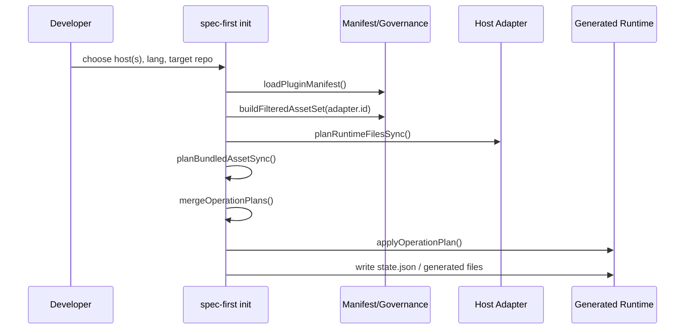
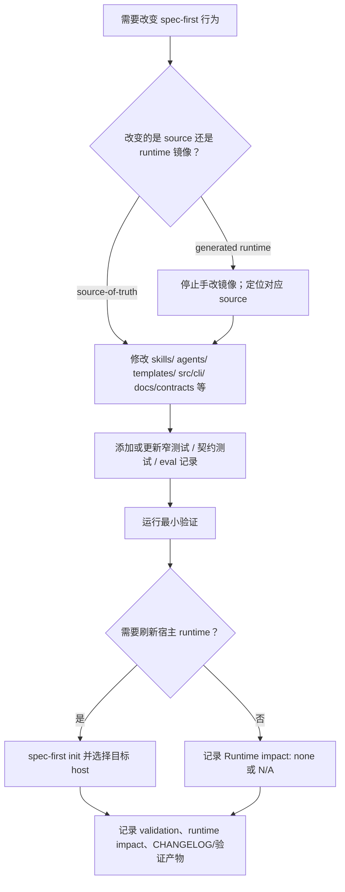

本页解释 spec-first 中 **可编辑的行为源** 与 **由 CLI 生成的宿主运行时镜像** 之间的边界：当你要改变 workflow、skill、agent、模板、契约或 CLI 行为时，应修改仓库内 source-of-truth；当 `.claude/`、`.codex/`、`.agents/skills/`、`.cursor/`、`.kiro/`、`.qoder/` 等宿主侧文件陈旧或漂移时，应通过 `spec-first init` 重新生成，而不是把镜像目录当作长期修复点。Sources: [source-runtime-customization-boundary.md](docs/contracts/source-runtime-customization-boundary.md#L7-L24), [source-runtime-customization-boundary.md](docs/contracts/source-runtime-customization-boundary.md#L25-L56)

## 架构假设与验证结论

本页的核心架构假设是：spec-first 的行为由仓库内受版本控制的源码资产定义，CLI 在初始化时读取这些源码资产与治理契约，按目标宿主适配后写入宿主运行时目录；运行时目录只负责让 Claude Code、Codex、Cursor、Kiro、Qoder 能加载对应入口，不反向拥有语义权威。源码验证显示，插件层将 `templates/claude/commands/spec`、`skills`、`agents` 作为 source directories，并从 `src/cli/contracts/dual-host-governance/skills-governance.json` 构建 manifest；初始化流程再按 adapter 选择目标宿主、构建过滤后的资产集、规划 runtime files sync 与 bundled asset sync。Sources: [plugin.js](src/cli/plugin.js#L15-L31), [plugin.js](src/cli/plugin.js#L107-L149), [init.js](src/cli/commands/init.js#L982-L1017)

```mermaid
flowchart LR
  subgraph Source["Source of Truth（可编辑、可评审、可测试）"]
    S1["skills/"]
    S2["agents/"]
    S3["templates/"]
    S4["src/cli/"]
    S5["docs/contracts/**"]
    S6["AGENTS.md / CLAUDE.md 中的 managed source slices"]
  end

  subgraph Generator["CLI 生成层"]
    G1["loadPluginManifest()"]
    G2["buildFilteredAssetSet(adapter.id)"]
    G3["planBundledAssetSync()"]
    G4["adapter.planRuntimeFilesSync()"]
    G5["applyOperationPlan()"]
  end

  subgraph Runtime["Generated Runtime Mirrors（不可作为修复源）"]
    R1[".claude/**"]
    R2[".codex/** + .agents/skills/**"]
    R3[".cursor/**"]
    R4[".kiro/**"]
    R5[".qoder/**"]
  end

  Source --> Generator --> Runtime
```

上图表达的是一个单向生成链路：源码资产进入 manifest 与 adapter 过滤，生成计划合并为 operation plan，再由 apply 阶段写入目标宿主目录；如果运行时漂移，代码路径会检测 state 或 runtime drift，并在需要时执行 managed hard reset 后重新 init，而不是读取 runtime 镜像来回写 source。Sources: [init.js](src/cli/commands/init.js#L1044-L1123), [init.js](src/cli/commands/init.js#L1157-L1192), [state.js](src/cli/state.js#L575-L619)

## Source of Truth：哪些位置可以改变行为

source-of-truth 是改变 spec-first 行为的入口，包括 `skills/`、`agents/`、`templates/`、`src/cli/`、`src/cli/contracts/**`、`docs/`、`README.md`、`README.zh-CN.md`、`AGENTS.md`、`CLAUDE.md`、`CHANGELOG.md`；其中 `AGENTS.md` 与 `CLAUDE.md` 是已纳入版本控制的宿主入口文档，它们内部的 spec-first managed blocks 属于由生成器治理的 source slices，但这不等同于 `.claude/`、`.codex/` 等 generated runtime mirrors。Sources: [source-runtime-customization-boundary.md](docs/contracts/source-runtime-customization-boundary.md#L7-L24)

插件层进一步把这种边界落实为代码结构：`SOURCE_DIRECTORIES` 指向命令模板、skills 与 agents，`loadPluginManifest()` 从 package metadata 与 skills governance truth source 构建 manifest，workflow command 的描述与参数提示来自模板或对应 skill source 的 frontmatter。换言之，入口、说明、skill 内容与 agent 内容的长期修复应进入这些源码文件，而不是进入某个宿主生成后的副本。Sources: [plugin.js](src/cli/plugin.js#L25-L31), [plugin.js](src/cli/plugin.js#L107-L180)

| 类别 | Source-of-truth 路径 | 负责内容 | 修改后动作 |
|---|---|---|---|
| Workflow/Skill 行为 | `skills/**/SKILL.md` 与其 references/evals | workflow 语义、执行边界、评估材料 | 更新测试或 eval；必要时重新 init |
| Agent 行为 | `agents/**/*.agent.md` 及 support files | reviewer/researcher 等专家角色内容 | 更新契约测试；必要时重新 init |
| 宿主模板与 hook | `templates/**` | 宿主启动、hook、命令模板 | 更新 CLI/契约测试；重新 init 目标宿主 |
| 生成与适配逻辑 | `src/cli/**` | init、adapter、state、doctor、clean 等行为 | 运行窄验证；记录 runtime impact |
| 契约与文档 | `docs/contracts/**`、`docs/**` | 边界、治理、用户说明 | 更新相关文档测试或契约测试 |

这张表的分类来自边界契约列出的 source-of-truth 路径，以及代码中 `SOURCE_DIRECTORIES`、manifest 构建、bundled skills/agents 列表读取函数的实现；它只描述已在仓库中出现的可验证路径，不把宿主本地未知文件纳入 spec-first 行为源。Sources: [source-runtime-customization-boundary.md](docs/contracts/source-runtime-customization-boundary.md#L7-L24), [plugin.js](src/cli/plugin.js#L441-L495), [plugin.js](src/cli/plugin.js#L561-L584)

## Generated Runtime Mirrors：哪些位置不能手改成“修复”

generated runtime mirrors 包括 `.claude/`、`.codex/`、`.agents/skills/`、`.cursor/skills/`、`.cursor/spec-first/`、`.cursor/mcp.json`、`.kiro/skills/`、`.kiro/agents/`、`.kiro/spec-first/`、spec-first managed `.kiro/settings/`、`.qoder/commands/spec-*.md`、`.qoder/commands/spec/`、`.qoder/skills/`、`.qoder/agents/`、`.qoder/spec-first/`、`.qoder/settings.local.json`。这些路径是宿主运行时镜像或宿主本地配置输出，不能作为 source fixes；正确动作是先改源码，再运行 `spec-first init` 并选择需要刷新的目标宿主。Sources: [source-runtime-customization-boundary.md](docs/contracts/source-runtime-customization-boundary.md#L25-L56)

`.gitignore` 策略也把这些 runtime 目录编码为 generated runtime assets：Claude commands/skills/spec-first/agents/hooks、Codex `.codex/`、`.agents/skills/`、Cursor skills/spec-first/mcp、Kiro skills/agents/spec-first/settings、Qoder commands/skills/agents/spec-first/settings.local，以及 `.spec-first/workflows/`、`.spec-first/audits/`、`.spec-first/governance/` 等本地运行产物都在 spec-first managed ignore block 中。Sources: [gitignore-policy.js](src/cli/gitignore-policy.js#L6-L60), [gitignore-policy.js](src/cli/gitignore-policy.js#L72-L119)

| Runtime 路径族 | 性质 | 正确修复入口 |
|---|---|---|
| `.claude/**` | Claude Code runtime mirror 与 hook/config 输出 | 改 `skills/`、`agents/`、`templates/claude/` 或 `src/cli/adapters/claude.js` 后 `spec-first init --claude` |
| `.codex/**` + `.agents/skills/**` | Codex project-scoped runtime；`.agents/skills` 是用户可见 workflow skill 入口 | 改 source 后 `spec-first init --codex` |
| `.cursor/**` | Cursor generated-runtime preview；Cursor loader discovery/invocation 在本机未被证明 | 改 source 后 `spec-first init --cursor` |
| `.kiro/**` | Kiro skills/agents/settings runtime mirror | 改 source 后 `spec-first init --kiro` |
| `.qoder/**` | Qoder commands/skills/agents/settings runtime mirror | 改 source 后 `spec-first init --qoder` |

这张表只总结边界契约与 adapter 代码已经表达的事实：Claude adapter 定义 `.claude` runtime、commands、skills、workflows、agents、state 与 `CLAUDE.md` instruction file；Codex adapter 定义 `.codex` runtime、`.agents/skills` skills/workflows、`.codex/agents` agents、`.codex/spec-first/state.json` state 与 `AGENTS.md` instruction file；Cursor 与 Kiro adapter 也分别声明自己的 runtimeRoot、skillsRoot、agentsRoot、stateFile 与 instructionFile。Sources: [claude.js](src/cli/adapters/claude.js#L43-L83), [codex.js](src/cli/adapters/codex.js#L27-L75), [cursor.js](src/cli/adapters/cursor.js#L54-L97), [kiro.js](src/cli/adapters/kiro.js#L29-L68)

## 生成链路：从源码到目标宿主

初始化入口先解析 host flags、语言、workspace 目标等参数，然后为每个选中 platform 构建 init plan；`INIT_PLATFORM_CHOICES` 明确支持 Claude、Codex、Cursor、Kiro、Qoder，`buildInitPlans()` 对每个平台调用 `buildInitPlan()` 并通过 `getAdapter(platform)` 绑定宿主适配器。Sources: [init.js](src/cli/commands/init.js#L77-L113), [init.js](src/cli/commands/init.js#L264-L377), [init.js](src/cli/commands/init.js#L593-L600), [adapters/index.js](src/cli/adapters/index.js#L1-L40)

源码中的 `buildProjectInitPlan()` 会加载 plugin manifest、按 adapter id 构建 filtered asset set、规划 bundled assets、规划 adapter runtime files，并生成 preview state；随后将 obsolete removal、namespace prune、retired runtime prune、developer cleanup 与 init write plan 合并为最终 operation plan。应用阶段再先执行 reset/pre-sync，后执行 write plan，并返回 runtime untrack summary。Sources: [init.js](src/cli/commands/init.js#L962-L1047), [init.js](src/cli/commands/init.js#L1106-L1154), [init.js](src/cli/commands/init.js#L1157-L1192)

`planBundledAssetSync()` 把命令、skills、agents 三类源码资产合并为写入计划；命令内容通过 adapter 渲染，skills 在写入前可执行宿主路径/名称转换，agents 也通过 adapter.transformAgentContent 转换。这样，同一份 source skill 或 agent 可以投射到不同宿主的 runtime 形态，但语义修改仍回到 source。Sources: [plugin.js](src/cli/plugin.js#L690-L710), [plugin.js](src/cli/plugin.js#L734-L858), [plugin.js](src/cli/plugin.js#L887-L900)

## Managed Blocks：入口文档中的可控切片

`AGENTS.md` 与 `CLAUDE.md` 的特殊性在于：它们是 checked-in host entry documents，但其中的 spec-first managed blocks 由生成器维护。`instruction-bootstrap.js` 使用 `<!-- spec-first:bootstrap:start -->` 与 `<!-- spec-first:bootstrap:end -->` 标记受管区域，写入时会替换已有有效 block；检测时会区分 missing、partial、installed、drifted。Sources: [source-runtime-customization-boundary.md](docs/contracts/source-runtime-customization-boundary.md#L23-L24), [instruction-bootstrap.js](src/cli/instruction-bootstrap.js#L5-L20), [instruction-bootstrap.js](src/cli/instruction-bootstrap.js#L38-L82)

这意味着入口文档不是“整文件都由 runtime 生成”的镜像；它们包含受管切片与可能的人工内容。代码在无完整标记时采用保守策略：只有 dangling marker 证明 prior management 时才启用更强清理；无 marker 时仅移除明确的 spec-first 旧内容，避免删除用户自写 section。Sources: [instruction-bootstrap.js](src/cli/instruction-bootstrap.js#L84-L113), [instruction-bootstrap.js](src/cli/instruction-bootstrap.js#L115-L138)

## 漂移检测、重置与安全写入

runtime 漂移不是“直接补丁 runtime”的授权，而是说明 source 与 runtime 可能需要重新对齐；契约要求使用 `spec-first doctor --claude|--codex|--cursor|--kiro|--qoder` 检查漂移，并通过 source 修改与 init 刷新来修复。源码侧，`buildProjectInitPlan()` 在发现 legacy managed state 或 current runtime drift 时，会构造 managed hard reset 计划并记录诊断。Sources: [source-runtime-customization-boundary.md](docs/contracts/source-runtime-customization-boundary.md#L55-L56), [init.js](src/cli/commands/init.js#L968-L981), [init.js](src/cli/commands/init.js#L1073-L1104)

写入执行并不是任意文件系统操作：operation plan 会解析目标路径，要求目标位于 project root 内，禁止删除 project root 本身，并检查最近存在路径的 realpath 不得通过 symlink 逃逸；文件写入使用 atomic temp path + rename 的方式完成。Sources: [state.js](src/cli/state.js#L575-L619), [state.js](src/cli/state.js#L656-L677), [atomic-write.js](src/cli/atomic-write.js#L5-L22)

runtime 目录还会被从 Git index 中清理：`planRuntimeUntrack()` 在 Git repo 内对 spec-first gitignore patterns 运行 `git ls-files`，为仍被追踪的 generated runtime 路径生成 `untrack_index` operations；apply 阶段再用 `git rm --cached --quiet -f` 让这些路径不再作为提交源。Sources: [runtime-untrack.js](src/cli/runtime-untrack.js#L9-L40), [runtime-untrack.js](src/cli/runtime-untrack.js#L43-L89), [state.js](src/cli/state.js#L611-L619)

## Workflow Artifacts 与 Provider Facts 不拥有语义权威

`docs/brainstorms/`、`docs/plans/`、`docs/tasks/`、`docs/validation/`、`docs/solutions/`、`.spec-first/workflows/`、`.spec-first/app-audit/` 是 target-repo workflow artifacts：它们可供后续 workflow、review、人类阅读，但不会覆盖 `skills/`、`agents/`、`templates/`、`src/cli/` 或 `docs/contracts/**` 中的 source contracts。Sources: [source-runtime-customization-boundary.md](docs/contracts/source-runtime-customization-boundary.md#L63-L76)

外部工具与 provider 也只提供 evidence、capabilities、logs、readiness facts，而不拥有 semantic authority；脚本可以准备 reason_code、artifact paths、exit codes、schema validation results、freshness status、bounded excerpts、raw log references，但产品范围、架构取舍、workflow 推荐、review 结论与降级证据是否足够仍由 LLM 在契约边界上判断。Sources: [source-runtime-customization-boundary.md](docs/contracts/source-runtime-customization-boundary.md#L77-L99)

## Raw Output 与 Credential 边界

provider、MCP、browser、CLI、shell raw results 都是不可信引用数据；进入 prompt、facts blocks、review reports、validation docs 或 durable artifacts 前，必须经过 schema validation、target-repo path containment、excerpt length cap、escaping、provenance classification、readiness/freshness classification 与 prompt-injection boundary。Sources: [source-runtime-customization-boundary.md](docs/contracts/source-runtime-customization-boundary.md#L101-L114)

凭证边界同样不允许把 provider credentials 写入 repo source、generated runtime mirrors、durable run artifacts、provider raw logs、validation reports、task packs 或 plans；凭证应来自环境变量、宿主 secret managers 或 provider-native credential stores，并以 redacted status、presence checks 与 next-action hints 形式暴露。Sources: [source-runtime-customization-boundary.md](docs/contracts/source-runtime-customization-boundary.md#L115-L135)

## 修改流程：如何安全改变行为

改变 spec-first 行为的标准路径是：先编辑 source-of-truth 文件，再为改变的契约添加或更新聚焦测试，先运行窄验证；如果改动触及 skill/agent/workflow prose、templates、host entry blocks 或 generated-runtime behavior，需要记录 fresh-source eval 状态与 runtime impact；只有当任务或发布确实需要 runtime refresh 时，才运行 `spec-first init` 并选择对应宿主。Sources: [source-runtime-customization-boundary.md](docs/contracts/source-runtime-customization-boundary.md#L136-L148)

实践判断可以压缩为一句话：**长期行为改 source，短期加载问题 init，漂移报告看作 evidence，不把 runtime mirror 当补丁目标**。这个判断与契约中的 customization flow、generated runtime mirror 禁手改规则、doctor 漂移说明、以及 init 写入计划的单向生成实现一致。Sources: [source-runtime-customization-boundary.md](docs/contracts/source-runtime-customization-boundary.md#L46-L56), [source-runtime-customization-boundary.md](docs/contracts/source-runtime-customization-boundary.md#L136-L148), [init.js](src/cli/commands/init.js#L1112-L1192)

## 与相邻页面的阅读关系

如果你需要理解 runtime 是如何被初始化出来的，下一步应阅读 [初始化流程与多宿主运行时生成](18-chu-shi-hua-liu-cheng-yu-duo-su-zhu-yun-xing-shi-sheng-cheng)；如果你关心宿主差异如何被 adapter 封装，应继续读 [平台适配器与宿主差异封装](19-ping-tai-gua-pei-qi-yu-su-zhu-chai-yi-feng-zhuang)；如果你正在处理 state、atomic write 或 drift repair，则应读 [托管状态、原子写入与运行时漂移修复](20-tuo-guan-zhuang-tai-yuan-zi-xie-ru-yu-yun-xing-shi-piao-yi-xiu-fu)；如果你的问题转向 skill/agent 的公开入口与内部能力边界，则进入 [Skill 类型、公开入口与内部能力边界](22-skill-lei-xing-gong-kai-ru-kou-yu-nei-bu-neng-li-bian-jie)。Sources: [init.js](src/cli/commands/init.js#L2063-L2082), [adapters/index.js](src/cli/adapters/index.js#L1-L40), [state.js](src/cli/state.js#L86-L112), [plugin.js](src/cli/plugin.js#L586-L656)