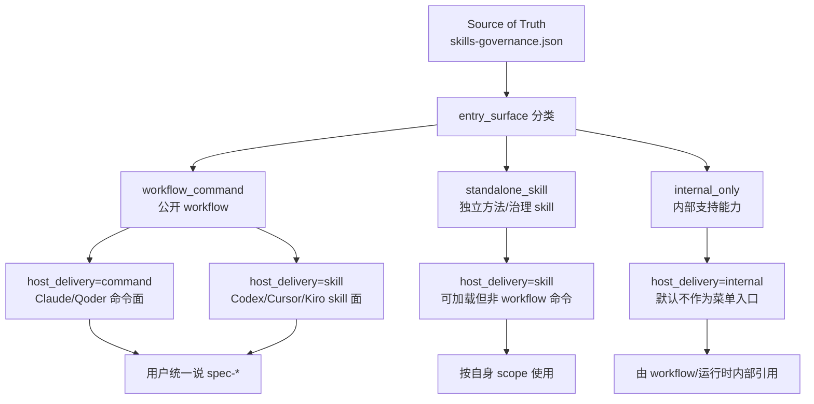
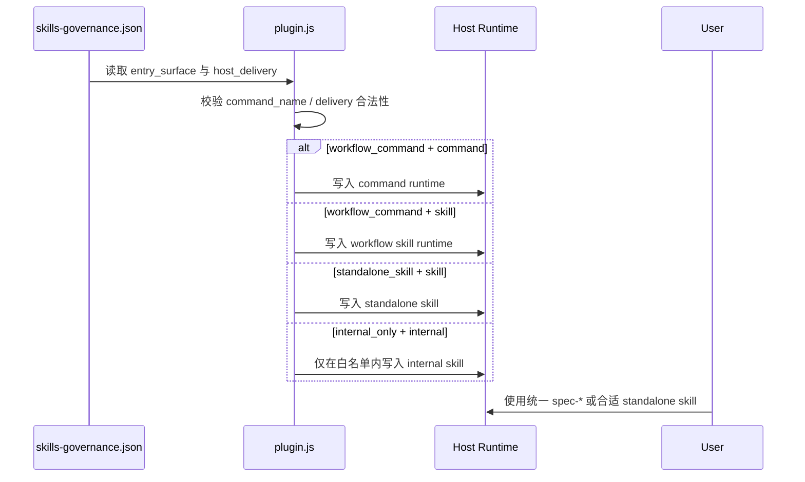

本页解释 spec-first 中 **Skill 的三类入口面**、它们如何投影到不同宿主，以及哪些能力应作为公开 workflow 暴露、哪些只能作为 standalone skill 或内部支持资产存在。当前位置位于目录的「Skills、Agents 与契约治理」分组，承接 [Source of Truth 与 Generated Runtime 边界](21-source-of-truth-yu-generated-runtime-bian-jie)，并为后续 [Agent 专家角色与有界派发规则](23-agent-zhuan-jia-jiao-se-yu-you-jie-pai-fa-gui-ze) 与 [双宿主治理与入口一致性校验](24-shuang-su-zhu-zhi-li-yu-ru-kou-zhi-xing-xiao-yan) 建立边界语言。Sources: [skills-governance.json](src/cli/contracts/dual-host-governance/skills-governance.json#L1-L18), [using-spec-first/SKILL.md](skills/using-spec-first/SKILL.md#L190-L197)

## 架构假设与验证结论

本页的工作假设是：spec-first 并不把 `skills/` 下的每个目录都等价地暴露给用户，而是通过一个治理契约把 Skill 分为 `workflow_command`、`standalone_skill`、`internal_only` 三类，再由宿主适配逻辑把它们投影成 command、skill、internal 或 none；代码验证显示，这个分类不是文档约定，而是由 `skills-governance.json` 与 `plugin.js` 的校验、过滤和同步逻辑共同执行。Sources: [skills-governance.json](src/cli/contracts/dual-host-governance/skills-governance.json#L1-L18), [plugin.js](src/cli/plugin.js#L252-L278), [plugin.js](src/cli/plugin.js#L586-L655)

## 三类 Skill 的核心模型

spec-first 的 Skill 入口面由 `ENTRY_SURFACES` 定义为 `workflow_command`、`standalone_skill`、`internal_only`；宿主投递形态由 `HOST_DELIVERIES` 定义为 `command`、`skill`、`internal`、`none`。这意味着「Skill 类型」与「宿主上看起来像什么」是两层概念：前者决定能力边界，后者决定运行时投影。Sources: [plugin.js](src/cli/plugin.js#L30-L38)

上图的关键点是：用户面对的是统一的 `spec-*` workflow 语言，而不是每个宿主的文件投影细节；`using-spec-first` 明确要求公共 workflow 标识跨宿主使用统一 `spec-*` 形式，并说明宿主运行时投递只是内部投影细节。Sources: [using-spec-first/SKILL.md](skills/using-spec-first/SKILL.md#L190-L197)

| 类型 | entry_surface | command_name | 可见性 | 典型用途 | 边界 |
| --- | --- | --- | --- | --- | --- |
| 公开 workflow | `workflow_command` | 必须是字符串并匹配 manifest | 用户可路由的 `spec-*` 工作流 | PRD、计划、执行、审查、知识沉淀等主链路 | workflow 拥有自己的产物、验证和结束条件 |
| 独立 Skill | `standalone_skill` | 必须为 `null` | 可作为 skill 加载，但不是 command-backed workflow | 路由治理、规则挖掘、团队标准治理等 | 不得被描述成 slash command 或 `spec-*` workflow |
| 内部能力 | `internal_only` | 必须为 `null` | 不应作为用户菜单入口 | 辅助工具、风格能力、测试支持、内部 helper | 不得以 command 或 skill 的用户可见形式暴露 |

上表来自治理校验规则：`workflow_command` 必须能在 manifest 中找到命令并声明匹配的 `command_name`；非 workflow 不能拥有 `command_name`；`standalone_skill` 不能以 `command` 投递；`internal_only` 不能以 `command` 或 `skill` 作为用户可见投递。Sources: [plugin.js](src/cli/plugin.js#L337-L365), [plugin.js](src/cli/plugin.js#L368-L376)

## 公开 workflow：统一入口，不等于统一宿主文件形态

公开 workflow 的来源是治理文件中 `entry_surface: "workflow_command"` 的记录，例如 `spec-prd`、`spec-plan`、`spec-work`、`spec-code-review` 等；这些记录都带有 `command_name`，并在 Claude 与 Qoder 上投递为 `command`，在 Codex、Cursor、Kiro 上投递为 `skill`。因此用户应学习统一入口名，例如 `spec-plan`、`spec-work`，而不是学习 `.claude/commands` 或 `.agents/skills` 的差异。Sources: [skills-governance.json](src/cli/contracts/dual-host-governance/skills-governance.json#L230-L241), [skills-governance.json](src/cli/contracts/dual-host-governance/skills-governance.json#L342-L353), [skills-governance.json](src/cli/contracts/dual-host-governance/skills-governance.json#L468-L479)

公开 workflow 的 manifest 只从 `entry_surface === "workflow_command"` 的治理记录构建命令，并读取对应 command template 或 SKILL frontmatter 的描述与参数提示；随后 `listBundledCommands()` 成为 CLI 命令清单的来源。Sources: [plugin.js](src/cli/plugin.js#L113-L139), [plugin.js](src/cli/plugin.js#L441-L459), [spec-commands.js](src/cli/spec-commands.js#L1-L12)

公开 workflow 的边界还体现在每个 SKILL 自己的 Contract Summary 中。例如 `spec-plan` 明确自己负责把清晰目标转成 HOW 计划，不负责实现代码、运行测试证明、生成任务包状态或重写生成运行时资产；它的下游消费者才是 `spec-write-tasks`、`spec-work`、`spec-doc-review` 等。Sources: [spec-plan/SKILL.md](skills/spec-plan/SKILL.md#L28-L60)

## standalone skill：可加载的治理能力，不是 workflow 命令

`using-spec-first` 是最典型的 standalone skill：它定义自己是 spec-first 的元技能和入口治理器，用于判断当前请求是否应进入公开 workflow；同时它明确声明自己不是 command-backed workflow、slash command 或 `spec-*` workflow，也不负责把所有任务强行导入 brainstorming。Sources: [using-spec-first/SKILL.md](skills/using-spec-first/SKILL.md#L6-L14)

standalone skill 的治理记录会把 `command_name` 设为 `null`，并在各宿主上以 `skill` 投递；例如 `using-spec-first`、`spec-rule-miner`、`spec-team-standards-governance` 都属于这一类。它们可以被加载和使用，但不能被推荐成公共 workflow 命令。Sources: [skills-governance.json](src/cli/contracts/dual-host-governance/skills-governance.json#L188-L199), [skills-governance.json](src/cli/contracts/dual-host-governance/skills-governance.json#L482-L535)

standalone skill 的边界由 lint 进一步保护：脚本会根据治理文件找出 `entry_surface === "standalone_skill"` 的技能名及其别名，并生成规则拦截将它们写成 `/spec:*` 或 `$spec-*` 这类正向命令入口的文案。Sources: [lint-skill-entrypoints.js](scripts/lint-skill-entrypoints.js#L43-L71), [lint-skill-entrypoints.test.js](tests/unit/lint-skill-entrypoints.test.js#L40-L75)

## internal_only：内部支持资产，不是用户菜单

`internal_only` 表示该 Skill 是 source/runtime 支持资产，而不是用户应该选择的公开路径；治理校验禁止 internal-only skill 以 `command` 或 `skill` 形式用户可见投递。`agent-native-architecture`、`changelog`、`feature-video`、`frontend-design`、`gemini-imagegen`、`git-commit`、`proof`、`report-bug` 等记录都采用这种入口面。Sources: [skills-governance.json](src/cli/contracts/dual-host-governance/skills-governance.json#L5-L18), [skills-governance.json](src/cli/contracts/dual-host-governance/skills-governance.json#L20-L32), [skills-governance.json](src/cli/contracts/dual-host-governance/skills-governance.json#L48-L171), [plugin.js](src/cli/plugin.js#L368-L376)

运行时过滤逻辑进一步收窄 internal-only 的投递：只有当记录是 `internal_only`、当前宿主投递为 `internal`，且技能名位于 `DELIVERED_INTERNAL_SKILLS` 时，才会进入 `internalSkills`；当前该白名单只包含 `git-worktree`。这说明 internal-only 不等于全部复制到运行时，更不等于用户可直接选择。Sources: [plugin.js](src/cli/plugin.js#L36-L38), [plugin.js](src/cli/plugin.js#L630-L637)

## 公开入口与宿主投影的关系

同一个公开 workflow 在不同宿主上可以有不同投影：当 `host_delivery` 是 `command` 时会生成 command；当它是 `skill` 时会作为 workflow skill 进入运行时；两者都会被归入 `workflowSkills`，因此属于同一个公开能力集合。Sources: [plugin.js](src/cli/plugin.js#L596-L623)

这条链路解释了为什么「公开入口」不应直接绑定宿主文件名：`syncBundledAssets()` 先根据适配器构建过滤后的资产集合，再分别同步 commands、skills、agents；最终返回的也区分 `commands`、`skills`、`workflowSkills`、`internalSkills`、`agents` 和 `skipped`。Sources: [plugin.js](src/cli/plugin.js#L679-L688), [plugin.js](src/cli/plugin.js#L690-L710)

## workflow、skill、agent 的能力边界

workflow 是面向用户的工作单元，Skill 是承载 workflow 或能力说明的源码资产，Agent 是在特定 workflow 中被有界调用的专家角色；`docs/workflow-skill-agent-map.md` 把主链路定义为 Codebase → Spec → Plan → Tasks → Code → Review → Knowledge，并列出 workflow 到 skill 与 agent 的映射。Sources: [workflow-skill-agent-map.md](docs/workflow-skill-agent-map.md#L4-L20), [workflow-skill-agent-map.md](docs/workflow-skill-agent-map.md#L24-L48)

| 层级 | 回答的问题 | 用户是否直接选择 | 例子 | 本页边界 |
| --- | --- | --- | --- | --- |
| Workflow | 现在进入哪条工程流程？ | 是，使用统一 `spec-*` | `spec-prd`、`spec-plan`、`spec-work` | 只讨论其公开入口与 Skill 类型 |
| Skill | 这条能力如何被宿主加载？ | workflow skill 可间接选择，standalone skill 按 scope 使用 | `using-spec-first`、`spec-rule-miner` | 不能把 standalone/internal 写成 workflow |
| Agent | workflow 内部是否需要专家审查或研究？ | 通常否，由 workflow 有界派发 | `spec-correctness-reviewer`、`spec-testing-reviewer` | 详细派发规则属于下一页 |

Agent 激活不属于本页展开范围，但需要知道边界：映射文档把 Agent 激活分为 always-on、条件激活、opt-in，并说明 dispatch 不可用时 `spec-code-review`、`spec-doc-review` 会降级为报告模式或 inline fallback；完整专家角色和派发规则应继续阅读 [Agent 专家角色与有界派发规则](23-agent-zhuan-jia-jiao-se-yu-you-jie-pai-fa-gui-ze)。Sources: [workflow-skill-agent-map.md](docs/workflow-skill-agent-map.md#L51-L103), [workflow-skill-agent-map.md](docs/workflow-skill-agent-map.md#L107-L113)

## 入口治理的防漂移机制

入口治理不是只靠人工记忆：`lint-skill-entrypoints.config.json` 扫描 `skills`、`CLAUDE.md`、`AGENTS.md`，阻止标题以 slash command 开头、阻止旧的宿主特定 entrypoint 文案、阻止遗留 `/research` 和 `/simplify` 入口。Sources: [lint-skill-entrypoints.config.json](scripts/lint-skill-entrypoints.config.json#L1-L32)

lint 测试覆盖了关键行为：禁止把 `using-spec-first` 写成正向 `/spec:using-spec-first` 命令；允许 `spec-write-tasks`、`spec-work` 这类 workflow command 作为公开入口；并确认扫描范围包含 `CLAUDE.md` 与 `AGENTS.md`。Sources: [lint-skill-entrypoints.test.js](tests/unit/lint-skill-entrypoints.test.js#L56-L104), [lint-skill-entrypoints.test.js](tests/unit/lint-skill-entrypoints.test.js#L106-L119)

公共 workflow 与必要 standalone skill 还必须在入口附近暴露紧凑的 I/O 与失败模式摘要；测试要求每个公开 workflow 与 `using-spec-first` 在前 120 行包含 When To Use、When Not To Use、Inputs、Outputs、Artifacts、Failure Modes、Workflow、Downstream Consumers 等字段。Sources: [public-workflow-contract-summary.test.js](tests/unit/public-workflow-contract-summary.test.js#L15-L46)

## 开发者判断清单

当你新增或调整 Skill 时，先判断它是否真的是用户可选择的工程流程：如果它会产生 PRD、计划、任务、执行、审查、知识沉淀等 workflow 产物，才应考虑 `workflow_command`；如果它只是路由、治理、规则或方法论能力，应保持 `standalone_skill`；如果它只是被其他 workflow、脚本或运行时内部引用，应保持 `internal_only`。Sources: [using-spec-first/SKILL.md](skills/using-spec-first/SKILL.md#L225-L231), [plugin.js](src/cli/plugin.js#L337-L376)

当你写用户文档或宿主提示时，应优先写统一 `spec-*` 入口；不要把 standalone skill 写成 slash command；不要推荐 internal-only skill 作为菜单项；如果只是说明禁止行为，lint 允许「Do not route users to ...」这类 guardrail 文案，但会拦截正向推荐。Sources: [using-spec-first/SKILL.md](skills/using-spec-first/SKILL.md#L112-L119), [using-spec-first/SKILL.md](skills/using-spec-first/SKILL.md#L190-L197), [lint-skill-entrypoints.js](scripts/lint-skill-entrypoints.js#L173-L178)

## 下一步阅读

如果你想理解这些入口如何由 CLI 初始化并投影到 `.claude/`、`.agents/`、`.cursor/`、`.kiro/`、`.qoder/` 等运行时目录，继续阅读 [初始化流程与多宿主运行时生成](18-chu-shi-hua-liu-cheng-yu-duo-su-zhu-yun-xing-shi-sheng-cheng) 与 [Source of Truth 与 Generated Runtime 边界](21-source-of-truth-yu-generated-runtime-bian-jie)；如果你想理解 workflow 内部如何安全调用专家角色，继续阅读 [Agent 专家角色与有界派发规则](23-agent-zhuan-jia-jiao-se-yu-you-jie-pai-fa-gui-ze)；如果你关心入口一致性如何被测试和发布门禁守住，继续阅读 [双宿主治理与入口一致性校验](24-shuang-su-zhu-zhi-li-yu-ru-kou-zhi-xing-xiao-yan) 与 [Skill 入口 lint、AI Dev Quality Gate 与回归评估](28-skill-ru-kou-lint-ai-dev-quality-gate-yu-hui-gui-ping-gu)。Sources: [plugin.js](src/cli/plugin.js#L679-L710), [lint-skill-entrypoints.config.json](scripts/lint-skill-entrypoints.config.json#L1-L32), [workflow-skill-agent-map.md](docs/workflow-skill-agent-map.md#L107-L115)