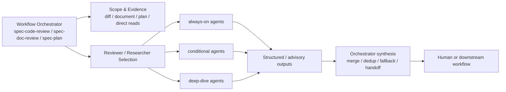

本页解释 spec-first 中 **Agent 专家角色** 的定位：它们不是公开 workflow，也不是中心化调度器，而是由 workflow 在明确边界内选择、注入上下文并收敛结果的专家 persona / research / reviewer 资产；本页只覆盖 agent 角色、生命周期分类、派发准入、降级与输出收敛，不展开 Skill 入口治理、双宿主一致性、Schema 质量门等相邻主题。Sources: [workflow-skill-agent-map.md](docs/workflow-skill-agent-map.md#L24-L48), [agent-lifecycle-catalog.md](docs/contracts/agents/agent-lifecycle-catalog.md#L1-L19)

## 架构假设：Agent 是受 workflow 编排的专家能力，不是独立流程引擎

从源码与契约看，spec-first 的主链路仍是 `Codebase → Spec → Plan → Tasks → Code → Review → Knowledge`，Agent 位于其中若干 workflow 的内部执行层：例如 `spec-code-review` 选择代码审查 persona，`spec-doc-review` 选择文档审查 persona，`spec-plan` 使用只读 research agents，`spec-compound` 在知识沉淀时选择专项专家。这个结构说明 Agent 的核心价值是 **把语义判断拆成可命名、可复用、可边界化的专家视角**，而不是让每个 agent 自行拥有 workflow 生命周期。Sources: [workflow-skill-agent-map.md](docs/workflow-skill-agent-map.md#L4-L20), [workflow-skill-agent-map.md](docs/workflow-skill-agent-map.md#L24-L48)

上图中的关键点是：workflow orchestrator 负责范围解析、证据准备、agent 选择、结果合并与最终 handoff；agent 负责在给定范围内输出专业判断。`spec-code-review` 明确由编排器处理意图发现、reviewer 选择、finding 合并去重与综合，而 reviewer agents 只在被选中后接收上下文并返回发现。Sources: [skills/spec-code-review/SKILL.md](skills/spec-code-review/SKILL.md#L689-L717), [skills/spec-code-review/SKILL.md](skills/spec-code-review/SKILL.md#L808-L815)

## Source of Truth：Agent 源文件与生命周期目录的关系

Agent profile 的源码资产位于 `agents/`，仓库级执行指引也把 `agents/` 列为 source-of-truth 路径；生成后的 `.claude/`、`.codex/`、`.agents/skills/` 属于 runtime mirrors，不应被当作源头手改。CLI 侧通过 `src/cli/agents.js` 暴露 agent source dir、agent path 列表与同步入口，本质上只是把 bundled agents 投射到宿主运行时，而不是定义调度策略。Sources: [AGENTS.md](AGENTS.md#L86-L115), [src/cli/agents.js](src/cli/agents.js#L1-L20)

`docs/contracts/agents/agent-lifecycle-catalog.md` 是 **source-level 使用地图**：它解释 51 个 agent 在什么场景下应被 workflow 或维护者选择，但文档自身明确不是运行时调度器、不替代 agent frontmatter、不授权新增自动 dispatch，也不改变 Claude/Codex generated runtime mirrors。Sources: [agent-lifecycle-catalog.md](docs/contracts/agents/agent-lifecycle-catalog.md#L1-L19)

## Agent 资产如何进入不同宿主运行时

CLI manifest 从 `agents/` 读取 Markdown agent entries，并把它们纳入插件 manifest；Claude adapter 的 agent runtime root 是 `.claude/agents`，Codex adapter 的 agent runtime root 是 `.codex/agents`。这说明 spec-first 对 agent 的跨宿主支持是 **source-first projection**：同一组 `agents/*.agent.md` 经过 adapter transform 后复制到各宿主约定目录。Sources: [src/cli/plugin.js](src/cli/plugin.js#L141-L149), [src/cli/adapters/claude.js](src/cli/adapters/claude.js#L64-L82), [src/cli/adapters/codex.js](src/cli/adapters/codex.js#L57-L75)

同步逻辑会创建宿主 agent 目录，遍历 bundled agent paths，并对每个 agent 文件调用 `adapter.transformAgentContent(content)` 后写入目标路径；完整性检查也会用同一 transform 后的期望内容与 runtime 文件比对。这使 runtime drift 可以被检测，但不把 runtime 文件提升为新的事实来源。Sources: [src/cli/plugin.js](src/cli/plugin.js#L860-L884), [src/cli/plugin.js](src/cli/plugin.js#L887-L924), [src/cli/plugin.js](src/cli/plugin.js#L1333-L1348)

## 生命周期分类：always-on、conditional、deep-dive、deprecated candidate

Agent lifecycle 是 **per-consumer classification**，不是 agent 的全局唯一属性；同一个 agent 可能在某个 workflow 中默认使用，在另一个 workflow 中只是条件触发或专项深审。生命周期目录把类型分为 `always-on`、`conditional`、`deep-dive` 与 `deprecated candidate`，并要求 conditional agent 有触发信号，deep-dive agent 不作为普通 review 默认 reviewer。Sources: [agent-lifecycle-catalog.md](docs/contracts/agents/agent-lifecycle-catalog.md#L21-L31)

| Lifecycle | 含义 | 派发边界 |
|---|---|---|
| `always-on` | 至少一个 consumer 默认会考虑或默认 dispatch | 必须说明默认发生在哪个 consumer；scale-aware minimum set 或用户 opt-out 可按 workflow 合同跳过 |
| `conditional` | 满足明确 diff、文档、技术栈、风险或用户请求信号时使用 | 无触发信号时不派发 |
| `deep-dive` | 专项研究、专项审计、复杂背景调查或显式 opt-in 时使用 | 不作为普通 review 默认 reviewer |
| `deprecated candidate` | 消费者不清、能力重叠或偏旧场景 | 保留 source，等待回源确认后合并、降级或退役 |

Sources: [agent-lifecycle-catalog.md](docs/contracts/agents/agent-lifecycle-catalog.md#L21-L31)

## 专家角色图谱：reviewer、researcher、deep-dive 与手动专项角色

从 workflow 映射表看，Agent 消费者集中在 review、planning research、ideation research、knowledge capture、session history 与 UI/Figma 同步等场景；公开 workflow 仍由 Skill 承载，Agent 只是其中的专家执行单元。例如 `spec-code-review` 使用 correctness、testing、maintainability、security、performance 等 persona；`spec-doc-review` 使用 coherence、feasibility、scope、security-lens 等 persona；`spec-plan` 使用 repo research、learnings、flow analysis、framework docs 等 research agent。Sources: [workflow-skill-agent-map.md](docs/workflow-skill-agent-map.md#L26-L48), [workflow-skill-agent-map.md](docs/workflow-skill-agent-map.md#L51-L103)

| 角色族群 | 典型 Agent | 主要消费者 | 角色边界 |
|---|---|---|---|
| 代码审查 persona | `spec-correctness-reviewer`, `spec-testing-reviewer`, `spec-maintainability-reviewer` | `spec-code-review` | 检查 diff 中的行为、测试、维护性问题 |
| 文档审查 persona | `spec-coherence-reviewer`, `spec-feasibility-reviewer`, `spec-scope-guardian-reviewer` | `spec-doc-review` | 检查 requirements / plan / task-pack 的一致性、可行性与范围 |
| 研究型 agent | `spec-repo-research-analyst`, `spec-learnings-researcher`, `spec-web-researcher` | `spec-plan`, `spec-ideate` | 只读收集上下文、历史经验或外部资料 |
| 专项 deep-dive | `spec-performance-oracle`, `spec-data-integrity-guardian`, `spec-deployment-verification-agent` | `spec-compound`、专项审查或 release/migration handoff | 仅在明确风险域或显式需求下使用 |

Sources: [workflow-skill-agent-map.md](docs/workflow-skill-agent-map.md#L51-L103), [agent-lifecycle-catalog.md](docs/contracts/agents/agent-lifecycle-catalog.md#L67-L120)

## Agent profile 的最小契约：名称、描述、模型、工具与输出格式

单个 agent 文件以 frontmatter 声明名称、描述、模型、工具与展示颜色；例如 `spec-correctness-reviewer` 声明自己是 always-on code-review persona，工具为 `Read, Grep, Glob, Bash`，并在正文中限定其关注逻辑错误、边界条件、状态管理、错误传播与 intent-vs-implementation mismatch。Sources: [spec-correctness-reviewer.agent.md](agents/spec-correctness-reviewer.agent.md#L1-L13)

Agent profile 还会给出信心校准与输出格式；`spec-correctness-reviewer` 要求按 findings schema 返回 JSON，且不在 JSON 外输出 prose。这种约束让 workflow 能把多个专家输出汇总、校验、去重，而不是让 agent 直接决定最终结论。Sources: [spec-correctness-reviewer.agent.md](agents/spec-correctness-reviewer.agent.md#L22-L52), [skills/spec-code-review/SKILL.md](skills/spec-code-review/SKILL.md#L808-L815)

## 有界派发规则一：先选角色，再过 dispatch capability gate

`spec-code-review` 在创建 run ID 或派发 reviewer 前，必须确认当前宿主暴露 dispatch primitive，并确认被选中的 reviewers 属于当前文档化 code-review phase；该 workflow 明确指出 dispatch capability 是 runtime boundary，不是 reviewer-selection preference。Sources: [skills/spec-code-review/SKILL.md](skills/spec-code-review/SKILL.md#L689-L701)

`spec-doc-review` 同样在派发前要求确认宿主具备 dispatch primitive、当前请求或父 workflow 明确授权 subagents / parallel reviewer work / delegated review，并且所选 reviewer 属于当前文档化 document-review phase；这意味着“选择了 persona”与“可以派发 subagent”是两个独立判断。Sources: [skills/spec-doc-review/SKILL.md](skills/spec-doc-review/SKILL.md#L228-L243)

## 有界派发规则二：reviewer 是分析 agent，不是实现 worker

代码审查 workflow 明确规定 reviewers 是 analysis agents，不是 implementation workers；派发范围被限制为已解析 diff scope、选中的 reviewer personas、advisory facts 与 output schema，并禁止从 code review 中创建隐藏 implement/check agents。Sources: [skills/spec-code-review/SKILL.md](skills/spec-code-review/SKILL.md#L689-L709)

文档审查 workflow 也有同样边界：派发只限于 document-review personas、当前文档范围、选定 sections、pre-facts 与 output contract；自动修复只限 workflow 文档化的 `safe_auto` 文档编辑，fallback、no-agents、unsafe runtime 或缺少 dispatch capability 时不得编辑文档或 generated runtime mirrors。Sources: [skills/spec-doc-review/SKILL.md](skills/spec-doc-review/SKILL.md#L228-L250)

## 有界派发规则三：Codex 的 spawn_agent 需要显式授权语义

Codex 中，公开 workflow invocation 只授权 workflow 自身，并不自动授权 `spawn_agent`；`spec-plan` 要求只有当用户显式请求 subagents、delegation、parallel research 或 research-agent dispatch 时才派发 research agents，否则读取对应 agent profile 并在当前 agent 中顺序应用，且记录 `dispatch_authorization_missing`。Sources: [skills/spec-plan/SKILL.md](skills/spec-plan/SKILL.md#L132-L138)

`spec-doc-review` 对 Codex 的约束更具体：直接调用 `spec-doc-review` 不等于显式 `spawn_agent` 授权；只有用户明确请求 subagents、parallel agents、delegated review、persona reviewer dispatch，或上游 workflow 从已授权上下文委派，才可继续正常多 persona 派发。Sources: [skills/spec-doc-review/SKILL.md](skills/spec-doc-review/SKILL.md#L230-L243)

## 有界派发规则四：bounded parallelism，而不是无限并发

文档审查派发使用宿主 subagent primitive，例如 Claude Code 的 `Agent` 或 Codex 的 `spawn_agent`，但必须遵守 active-subagent limit：选中的 reviewers 被排队，只派发宿主接受的数量，完成后再补位；容量限制类 spawn error 被视为 backpressure，而不是 reviewer failure。Sources: [skills/spec-doc-review/SKILL.md](skills/spec-doc-review/SKILL.md#L252-L279)

代码审查也规定，如果平台支持 reviewer dispatch 但不支持 parallel sub-agents，则通过同一 Stage 4 scheduler 顺序派发；如果平台限制 active concurrency，则使用 bounded queueing，而不是把 cap-related spawn failure 当作 reviewer failure。Sources: [skills/spec-code-review/SKILL.md](skills/spec-code-review/SKILL.md#L1208-L1218)

## 派发失败与降级：single-agent report-only fallback

当 dispatch unavailable、explicitly disabled 或 unsafe 时，`spec-code-review` 设置 `single_agent_report_only_fallback: true`，把有效模式视为 report-only，不创建 review artifact 目录，不写 reviewer artifacts，由 orchestrator 串行应用选中的 persona lenses，并跳过 validator dispatch 与 fixer paths。Sources: [skills/spec-code-review/SKILL.md](skills/spec-code-review/SKILL.md#L702-L709)

`spec-doc-review` 的 fallback 也采用 read-only review：不应用 `safe_auto` fixes，不追加 Open Questions，不编辑文档；Coverage 必须说明 `single-agent report-only fallback`，并给出具体 reason code，如 `dispatch_authorization_missing`、`dispatch_unavailable`、`runtime_dispatch_failed` 或 `safety_boundary_not_met`。Sources: [skills/spec-doc-review/SKILL.md](skills/spec-doc-review/SKILL.md#L244-L250)

## 输出收敛：agent finding 不是最终 verdict

Agent lifecycle catalog 要求面向 downstream handoff 的 compact summary 映射到 `review-finding.v1` 共享字段，包括 severity、category、evidence、impact、recommendation、owner、confidence 与 residual_status；同时强调 workflow-specific reviewer return schema 不被该共享形状替代。Sources: [agent-lifecycle-catalog.md](docs/contracts/agents/agent-lifecycle-catalog.md#L32-L64)

`spec-code-review` 在 Stage 5 把多个 reviewer JSON return 转换成一个去重、confidence-gated finding set；返回结构先被验证，缺少 required fields 或类型错误的 reviewer return / finding 会被丢弃并记录 drop count。这保证 agent 输出必须经过 orchestrator 合并与质量门，而不是直接成为最终审查结论。Sources: [skills/spec-code-review/SKILL.md](skills/spec-code-review/SKILL.md#L808-L815)

## 变更验证：Agent prose 需要 fresh-source 视角

仓库指南指出 Agent / Skill prose 变更不同于普通代码，因为宿主可能在会话启动时缓存定义；验证时应优先检查 `agents/`、`skills/`、`templates/` 与 `src/cli/` 的源码真相源，再补充 contract / unit tests。Sources: [AGENTS.md](AGENTS.md#L170-L180)

同一段指南还要求不要依赖当前会话已缓存的 typed-agent / skill 调用，也不要手改 `.claude/`、`.codex/`、`.agents/skills/` 来“刷新”行为；需要 runtime regeneration 时使用 `spec-first init`。Sources: [AGENTS.md](AGENTS.md#L170-L180)

## 契约测试如何防止派发边界漂移

`spec-dispatch-boundary-contracts.test.js` 固化了多个关键边界：高风险 skills 不应保留过时的 “Codex cannot dispatch” 假设；运行时不能把 legacy Task dispatch 静默重写成 inline-only；mutating dispatch skills 必须声明隔离、序列化与 orchestrator ownership；phase 2 dispatch-bearing workflows 必须拒绝隐藏 implement-check lifecycle。Sources: [spec-dispatch-boundary-contracts.test.js](tests/unit/spec-dispatch-boundary-contracts.test.js#L60-L80), [spec-dispatch-boundary-contracts.test.js](tests/unit/spec-dispatch-boundary-contracts.test.js#L130-L163), [spec-dispatch-boundary-contracts.test.js](tests/unit/spec-dispatch-boundary-contracts.test.js#L180-L203)

这些测试不是调度器实现，而是 **防漂移护栏**：它们用字符串级合同检查保证 workflow prompt 不重新引入“需要用户二次确认才能 dispatch”的旧模型，也不允许把 reviewer personas 偷换成隐藏实现 worker。Sources: [spec-dispatch-boundary-contracts.test.js](tests/unit/spec-dispatch-boundary-contracts.test.js#L82-L128), [spec-dispatch-boundary-contracts.test.js](tests/unit/spec-dispatch-boundary-contracts.test.js#L180-L203)

## 阅读路径建议

如果你想理解 Agent 与 Skill 的入口边界，下一步读 [Skill 类型、公开入口与内部能力边界](22-skill-lei-xing-gong-kai-ru-kou-yu-nei-bu-neng-li-bian-jie)；如果你关心 Claude、Codex、Cursor、Kiro、Qoder 之间的生成一致性，继续读 [双宿主治理与入口一致性校验](24-shuang-su-zhu-zhi-li-yu-ru-kou-zhi-xing-xiao-yan)；如果你要理解 agent 输出如何进入 evidence、execution、evaluation 与 knowledge 分层，继续读 [Context、Evidence、Execution、Evaluation 与 Knowledge Harness 分层](25-context-evidence-execution-evaluation-yu-knowledge-harness-fen-ceng)。Sources: [workflow-skill-agent-map.md](docs/workflow-skill-agent-map.md#L24-L48), [agent-lifecycle-catalog.md](docs/contracts/agents/agent-lifecycle-catalog.md#L5-L19)