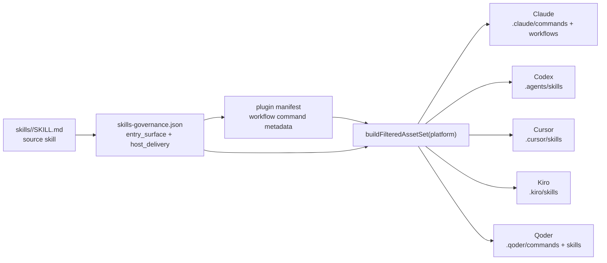
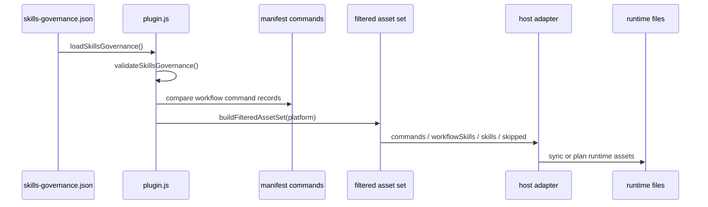

**架构假设**：这里的“双宿主治理”不是在运行时维护两套入口，而是用一个集中式治理真源把 workflow、standalone skill、internal skill 的入口语义与各宿主投递形态分离，再由 lint、manifest 构建、filtered asset set 和 CI gate 共同阻止入口漂移；同时，历史目录名 `dual-host-governance` 已经泛化为 supported-host / 多宿主治理语义，当前支持 Claude、Codex、Cursor、Kiro、Qoder。Sources: [README.md](docs/contracts/dual-host-governance/README.md#L1-L8), [plugin.js](src/cli/plugin.js#L25-L35)

## 治理目标：统一用户入口，分离宿主投射

本页只解释 **Skill/Workflow 入口一致性**：用户侧统一看到 `spec-*` workflow 名称，宿主侧可以投射为 command、skill、internal 或 none；因此一致性校验的对象不是“文件路径必须相同”，而是“同一个源层能力在不同宿主上是否按治理真源被正确表达”。契约明确规定所有 supported hosts 的用户可见 workflow 标识统一为 `spec-*`，宿主 runtime delivery 是内部投射细节，不改变用户侧 workflow 名称。Sources: [README.md](docs/contracts/dual-host-governance/README.md#L12-L22)

这张图表达的关键点是：`skills-governance.json` 不是文档装饰，而是 `plugin.js` runtime filter、lint、审计脚本的共同真源；human-readable contract 留在 `docs/contracts/dual-host-governance/README.md`，machine-readable 真源固定在 `src/cli/contracts/dual-host-governance/`，运行时代码不得直接依赖 `docs/` 下的 machine-readable contract。Sources: [README.md](docs/contracts/dual-host-governance/README.md#L217-L243)

## 治理模型：entry surface 与 host delivery 两层语义

治理模型的第一层是 `entry_surface`，用于描述 skill 在仓库真源中的入口类型：`workflow_command` 表示 command-backed workflow source，`standalone_skill` 表示普通 skill 交付，`internal_only` 表示只用于内部编排或宿主内部消费；这是一种源层分类，不等价于每个宿主都必须生成 command 文件。Sources: [README.md](docs/contracts/dual-host-governance/README.md#L40-L61)

治理模型的第二层是 `host_delivery`，用于描述每个宿主最终如何交付，允许值为 `command`、`skill`、`internal`、`none`；契约特别强调 `entry_surface` 描述源层角色，`host_delivery` 描述每个宿主最终如何交付，两者不能混写。Sources: [README.md](docs/contracts/dual-host-governance/README.md#L83-L103)

| 维度 | 字段 | 允许值 | 校验含义 |
|---|---|---|---|
| 源层入口类型 | `entry_surface` | `workflow_command` / `standalone_skill` / `internal_only` | 判断 skill 是 workflow source、standalone skill 还是内部能力 |
| 宿主分发边界 | `host_scope` | `dual_host` / `host_exclusive` / `target_host_maintenance` | 判断是否面向全部宿主、单宿主或跨宿主维护场景 |
| 所属宿主 | `owner_host` | `claude` / `codex` / `cursor` / `kiro` / `qoder` / `null` | 对 host-exclusive 与 target-host-maintenance 建立归属约束 |
| 宿主投递形态 | `host_delivery.<host>` | `command` / `skill` / `internal` / `none` | 决定 filtered asset set 是否生成 command、workflow skill、standalone skill 或跳过 |

表中字段由 schema 固定为无额外属性结构：治理记录必须包含 `skill_name`、`entry_surface`、`command_name`、`host_scope`、`owner_host`、`host_delivery`，并且 `host_delivery` 必须覆盖 `claude`、`codex`、`cursor`、`kiro`、`qoder` 五个宿主。Sources: [skills-governance.schema.json](src/cli/contracts/dual-host-governance/skills-governance.schema.json#L26-L131)

## 当前宿主投递矩阵

当前契约下，command-backed workflow skill 的宿主投递规则是：Claude 生成 `.claude/commands/spec-*.md` 并同步 workflow mirror；Codex 不再生成 `.codex/commands/spec/*`，而是通过 `.agents/skills/spec-*` 发现；Kiro 不生成 command layer，通过 `.kiro/skills/spec-*` 发现；Qoder 生成 `.qoder/commands/spec-*.md`，并同步 `.qoder/skills/spec-*` workflow skill mirror。Sources: [README.md](docs/contracts/dual-host-governance/README.md#L104-L129)

| 宿主 | workflow 用户口径 | runtime 投递 | command layer | 入口一致性要点 |
|---|---|---|---|---|
| Claude | `spec-*` | command + workflow skill mirror | `.claude/commands/spec-*.md` | command-backed workflow 可有 command 文件 |
| Codex | `spec-*` | `.agents/skills/spec-*` | 不生成 `.codex/commands/spec/*` | 旧 command layer 仅作为清理目标 |
| Cursor | `spec-*` | `.cursor/skills/spec-*` | 不生成 command layer | 当前为 generated-runtime preview，且不投射 agents |
| Kiro | `spec-*` | `.kiro/skills/spec-*` | 不生成 `.kiro/commands/spec/*` | Kiro P0 不占用 native Specs namespace |
| Qoder | `spec-*` | command + skill mirror | `.qoder/commands/spec-*.md` | command 文件与 skill mirror 同步存在 |

CodexAdapter 的实现直接把 `hasCommands` 设为 `false`，但保留 `.codex/commands/spec` 作为 legacy cleanup 相关路径；注释也说明 Codex 的用户可见 workflow 入口来自 `.agents/skills/`，`.codex/commands/spec/` 只作为历史兼容清理目标。Sources: [codex.js](src/cli/adapters/codex.js#L27-L35), [codex.js](src/cli/adapters/codex.js#L49-L87)

KiroAdapter 同样把 `hasCommands` 设为 `false`，`inspectRuntimeFiles` 在发现 `.kiro/commands/spec` 时给出 warning，说明 Kiro P0 使用生成的 `spec-*` workflow runtime assets，而不是生成 command 文件。Sources: [kiro.js](src/cli/adapters/kiro.js#L29-L68), [kiro.js](src/cli/adapters/kiro.js#L119-L148)

QoderAdapter 则保留 command root `.qoder/commands`，command 文件名为 `spec-${command.name}.md`，并把 workflow skill root 设为 `.qoder/skills`；这与契约中 Qoder 同时生成 command runtime files 与 workflow skill mirrors 的规则一致。Sources: [qoder.js](src/cli/adapters/qoder.js#L27-L67), [qoder.js](src/cli/adapters/qoder.js#L68-L105)

CursorAdapter 把 `hasCommands` 与 `supportsAgents` 都设为 `false`，使用 `.cursor/skills` 作为 workflow skill runtime root，并在 doctor 检查中对 Cursor generated-runtime preview、意外 command runtime 目录、意外 agents runtime 目录给出 warning。Sources: [cursor.js](src/cli/adapters/cursor.js#L54-L97), [cursor.js](src/cli/adapters/cursor.js#L129-L170)

## 入口一致性校验链路

入口一致性校验的第一道防线是治理文件加载与结构校验：`loadSkillsGovernance()` 读取 `src/cli/contracts/dual-host-governance/skills-governance.json`，调用 `validateSkillsGovernance()`，再返回按 `skill_name` 排序后的治理记录；这保证运行时消费的是已通过枚举、字段、交付形态验证的治理数据。Sources: [plugin.js](src/cli/plugin.js#L243-L279)

`validateSkillsGovernance()` 校验 schemaVersion、skills 数组、skill 是否存在于 bundled skills、skill 是否重复、`entry_surface` 是否有效、`host_scope` 是否有效、每个 supported platform 的 `host_delivery` 是否有效；workflow command 还必须能在 manifest command set 中找到对应 command，并且 `command_name` 必须与 manifest 中的命令名一致。Sources: [plugin.js](src/cli/plugin.js#L281-L347)

非 workflow skill 不能在 manifest command set 中出现，`command_name` 必须为 `null`；standalone skill 不能在任何宿主上以 `command` 交付；internal_only skill 不能以用户可见的 `command` 或 `skill` 暴露。Sources: [plugin.js](src/cli/plugin.js#L348-L376)

对于 `dual_host`，校验要求 `owner_host=null`，并且所有 supported platforms 都不能是 `none` 或 `internal`；对于 `host_exclusive`，只能交付给唯一的 `owner_host`；对于 `target_host_maintenance`，必须交付给 owner host，且至少还要交付给一个非 owner host。Sources: [plugin.js](src/cli/plugin.js#L378-L438)

上面的调用序列对应实现中的构建路径：`buildFilteredAssetSet(platformOrAdapter)` 先解析平台，再读取治理真源与 bundled commands，然后按 `entry_surface` 和 `host_delivery.<platform>` 分别填充 `commands`、`workflowSkills`、`skills`、`internalSkills` 与 `skipped`。Sources: [plugin.js](src/cli/plugin.js#L586-L655)

## filtered asset set：把治理决策转成宿主资产集合

filtered asset set 是双宿主治理的运行时投影层：当 `workflow_command` 在某宿主上的 delivery 是 `command` 时，它同时进入 `commands` 与 `workflowSkills`；当 delivery 是 `skill` 时，只进入 `workflowSkills`；standalone skill 只有在 delivery 是 `skill` 时进入 `skills`；internal_only 默认跳过，只有列入 `DELIVERED_INTERNAL_SKILLS` 且 delivery 是 `internal` 时进入 `internalSkills`。Sources: [plugin.js](src/cli/plugin.js#L596-L644)

运行时同步与 dry-run plan 都使用同一个 filtered asset set：`syncBundledAssets()` 先构建 filtered asset set，再按 adapter 是否支持 commands 决定是否同步 commands，并同步 skills、workflowSkills、internalSkills、agents；`planBundledAssetSync()` 也使用同一集合生成操作计划和 `syncedAssets` 摘要。Sources: [plugin.js](src/cli/plugin.js#L679-L710)

契约要求 filtered asset set 的构建至少覆盖 `init` previewState、obsolete asset 清理、实际同步、doctor、clean、state 模块相关清理/检查逻辑，并且它是运行时计算结果，不新增第二套持久化 state 语义，继续复用现有 `state.json` tracked arrays。Sources: [README.md](docs/contracts/dual-host-governance/README.md#L164-L215)

## 文案入口 lint：阻止 standalone skill 被写成命令

入口一致性不只校验生成资产，也校验文案。`scripts/lint-skill-entrypoints.js` 读取配置文件、治理真源，并构建规则；其中动态规则 `standalone-command-entrypoint` 会从治理记录中筛出 `entry_surface === standalone_skill` 的 skill 名称，再生成匹配 `/...` 或 `$...` 命令式入口的正则，阻止 standalone skill 被描述成 slash command 或 command entrypoint。Sources: [lint-skill-entrypoints.js](scripts/lint-skill-entrypoints.js#L13-L71)

lint 配置扫描 `skills`、`CLAUDE.md`、`AGENTS.md` 三类入口相关 Markdown；阻断规则还包括标题不能以 slash entrypoint 开头、Codex 旧入口不能写成 `**Codex entry point:** /spec:*` 或 `$spec-*`、旧的 `/research` 和 `/simplify` alias 不能作为用户可见入口。Sources: [lint-skill-entrypoints.config.json](scripts/lint-skill-entrypoints.config.json#L1-L32)

lint 对“禁止性护栏文案”有特判：如果某一行是 “do not / don't / never” 或明确说明不是 command-backed workflow、command entrypoint、workflow entrypoint、slash command，则不会把它当作正向入口违规；这让文档可以安全写出“不要使用某旧入口”而不触发误报。Sources: [lint-skill-entrypoints.js](scripts/lint-skill-entrypoints.js#L73-L104), [lint-skill-entrypoints.js](scripts/lint-skill-entrypoints.js#L173-L178)

对应单元测试覆盖了四个入口语义：禁止性护栏 prose 可通过，正向写 `/spec:using-spec-first` 会失败，`spec-write-tasks` 这类 public workflow entrypoint 可通过，workflow-command skill 的 public workflow prose 可通过；测试还要求 scanRoots 覆盖 `CLAUDE.md` 与 `AGENTS.md`。Sources: [lint-skill-entrypoints.test.js](tests/unit/lint-skill-entrypoints.test.js#L40-L119)

## CI gate：把入口漂移变成 PR 失败

GitHub Actions 中的 `Skill Entrypoint Gate` 会在 pull request 触及 `skills/**`、dual-host governance contract、lint 脚本、配置、相关测试、package 等路径时触发，并执行 `npm run lint:skill-entrypoints` 与 eval fixture contract 测试；这把入口一致性从本地约定提升为 PR 级质量门。Sources: [skill-entrypoint-gate.yml](.github/workflows/skill-entrypoint-gate.yml#L1-L50)

`package.json` 把 `npm run lint` 映射到 `npm run lint:skill-entrypoints`，而 `lint:skill-entrypoints` 直接执行 `node scripts/lint-skill-entrypoints.js`；发布包 `files` 也包含 governance 相关 docs/contracts、scripts、skills、templates，确保治理脚本与运行时源能够随包分发。Sources: [package.json](package.json#L15-L36), [package.json](package.json#L37-L83)

## 路径重写：入口一致性之外的运行时可解析性

不同宿主的 runtime root 不同，入口一致性校验不能只检查名称，还必须避免 runtime 文档引用错误路径。ClaudeAdapter、CodexAdapter、KiroAdapter、QoderAdapter、CursorAdapter 都在 `transformSkillContent()` 中调用 `rewriteSourceSkillRuntimePaths()`，把操作性 source skill 路径重写为对应宿主 runtime skill root，同时保留真正描述 source of truth 的路径。Sources: [claude.js](src/cli/adapters/claude.js#L84-L109), [codex.js](src/cli/adapters/codex.js#L97-L116), [kiro.js](src/cli/adapters/kiro.js#L70-L83), [qoder.js](src/cli/adapters/qoder.js#L92-L105), [cursor.js](src/cli/adapters/cursor.js#L99-L112)

路径重写测试验证了两个边界：含 “source of truth / current source directory” 的行应保持 `skills/<skill>` 形态，真正的操作性引用如 `Read .../references/...`、`bash .../scripts/...`、`Run from ...` 应重写到 `.agents/skills/...` 或 `.claude/spec-first/workflows/...` 等 runtime root；这避免了“入口名统一但运行时引用仍指向源码目录”的漂移。Sources: [skill-path-rewrite-guard.test.js](tests/unit/skill-path-rewrite-guard.test.js#L26-L87)

## 维护规则：新增或修改 skill 时必须同步治理真源

贡献者维护规则要求：新增或修改 skill 时不得只改 `SKILL.md` 文案而不更新 `skills-governance.json`，不得只改 command template frontmatter 或生成后的 manifest command set 而不更新 `entry_surface=workflow_command` 记录，不得把 standalone skill 写成已声明 slash command，新增 lint / doctor / smoke 规则时应优先引用 `skills-governance.json`，而不是重复手写 skill 名单。Sources: [README.md](docs/contracts/dual-host-governance/README.md#L255-L268)

helper skill 可解析性也有单元测试护栏：测试会扫描 skill 文档中 “load/invoke/use/run the `X` skill” 这类委托引用，并要求被委托 skill 要么可通过 runtime 交付解析，要么登记为 host-provided；否则就是 source→runtime 的多真相源断裂。Sources: [helper-skill-resolvability-contracts.test.js](tests/unit/helper-skill-resolvability-contracts.test.js#L12-L23), [helper-skill-resolvability-contracts.test.js](tests/unit/helper-skill-resolvability-contracts.test.js#L49-L100)

Agent 入口口径也被治理测试约束：所有 bundled agent instructions 不得使用 `/spec:*` 或 `$spec-*`，而应使用统一的 `spec-*` workflow entrypoints；同一测试文件还通过 orphan detection 要求 bundled agents 要么被 source 引用，要么登记为 standalone。Sources: [agents-governance-contracts.test.js](tests/unit/agents-governance-contracts.test.js#L17-L20), [agents-governance-contracts.test.js](tests/unit/agents-governance-contracts.test.js#L61-L107)

## 快速定位：入口一致性问题应看哪里

如果你要判断某个 skill 是否应该出现在某宿主 runtime，先看 `src/cli/contracts/dual-host-governance/skills-governance.json` 中该 skill 的 `entry_surface`、`command_name`、`host_scope`、`host_delivery`；例如 `spec-doc-review` 是 `workflow_command`，Claude 与 Qoder 以 `command` 投递，Codex、Cursor、Kiro 以 `skill` 投递，而 `spec-rule-miner` 是 `standalone_skill`，五个宿主均以 `skill` 投递。Sources: [skills-governance.json](src/cli/contracts/dual-host-governance/skills-governance.json#L33-L46), [skills-governance.json](src/cli/contracts/dual-host-governance/skills-governance.json#L187-L200)

如果你要判断为什么某宿主没有生成 command 文件，查看对应 adapter 的 `hasCommands` 与 command root；Codex、Cursor、Kiro 都显式 `hasCommands=false`，Qoder 与 Claude 则提供 command root 和 `commandFilename()`，这些 adapter 差异必须服从 governance 的 filtered asset set，而不是绕过治理真源单独写文件。Sources: [codex.js](src/cli/adapters/codex.js#L49-L63), [cursor.js](src/cli/adapters/cursor.js#L67-L85), [kiro.js](src/cli/adapters/kiro.js#L42-L56), [qoder.js](src/cli/adapters/qoder.js#L40-L54), [claude.js](src/cli/adapters/claude.js#L56-L70)

## 延伸阅读

要理解这些入口如何在初始化时生成到不同宿主 runtime，继续读 [初始化流程与多宿主运行时生成](18-chu-shi-hua-liu-cheng-yu-duo-su-zhu-yun-xing-shi-sheng-cheng)；要理解宿主差异为何封装在 adapter 中，继续读 [平台适配器与宿主差异封装](19-ping-tai-gua-pei-qi-yu-su-zhu-chai-yi-feng-zhuang)；要理解 source 与 generated runtime 为什么不能混写，继续读 [Source of Truth 与 Generated Runtime 边界](21-source-of-truth-yu-generated-runtime-bian-jie)。Sources: [plugin.js](src/cli/plugin.js#L679-L710), [README.md](docs/contracts/dual-host-governance/README.md#L217-L243)