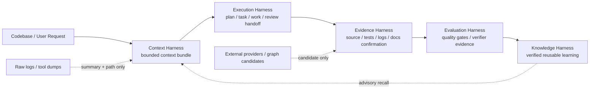
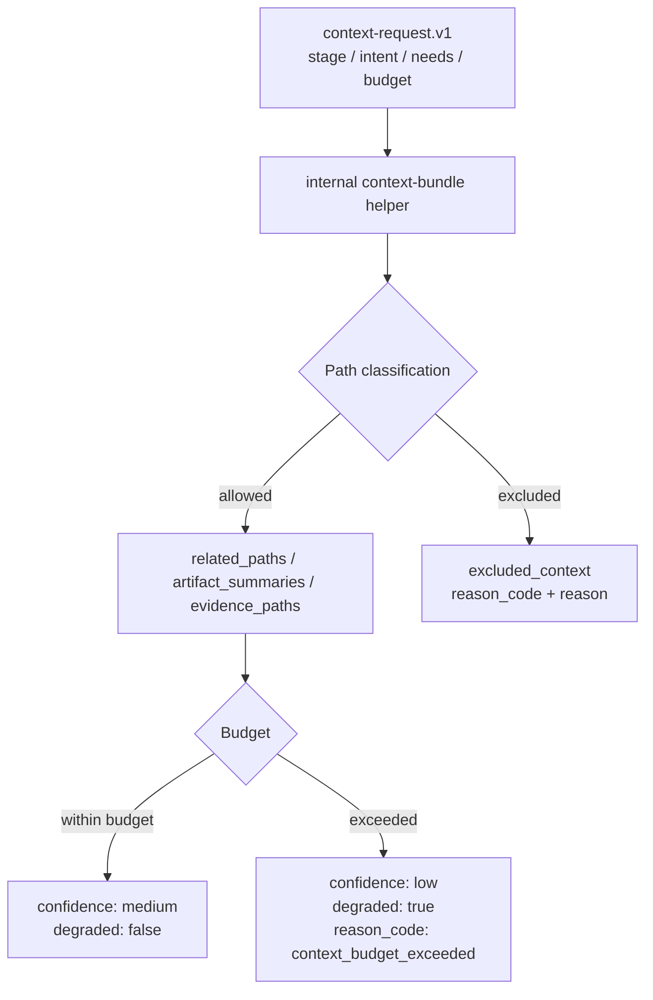
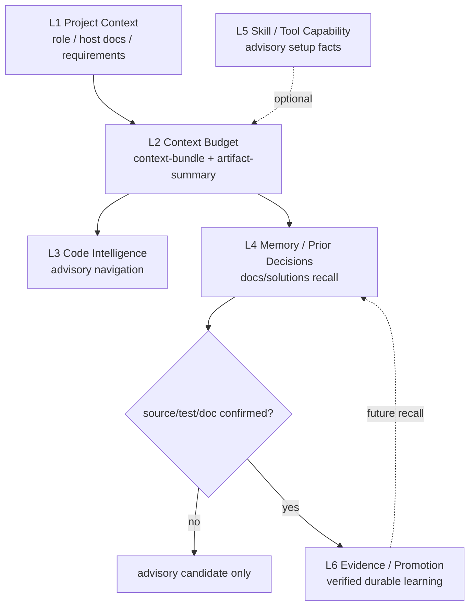

本页的架构假设是：spec-first 并不是把 AI 开发流程做成一个中心化状态机，而是把 **Context、Execution、Evidence、Evaluation、Knowledge** 拆成彼此有边界、可交接、可验证的 Harness 层；这些层共同服务 `Codebase -> Spec -> Plan -> Tasks -> Code -> Review -> Knowledge` 主链路，并通过轻量合同约束“给模型什么上下文、证据如何升信、执行如何交接、质量如何评估、经验如何沉淀”。仓库中的顶层 Harness 合同明确列出这些分层、主链路与边界规则，因此本文只解释当前页所处的分层模型，不展开 CLI 分发、宿主生成或测试发布体系。Sources: [ai-coding-harness.md](docs/contracts/ai-coding-harness.md#L7-L24), [ai-coding-harness.md](docs/contracts/ai-coding-harness.md#L26-L33)

## 分层总览：从“对话上下文”到“可复用知识”

spec-first 的 Harness 分层可以理解为一条信任与压缩并行发生的流水线：Context Harness 负责把高信号上下文装入可审查 envelope；Execution Harness 负责在 plan、task、work、review 之间传递 scope、task identity、repo scope 与 handoff evidence；Evidence Harness 负责保留 provenance、freshness、source reads、limitations 与 redaction；Evaluation Harness 用质量门与 decision-linked metrics 观察系统是否真的变好；Knowledge Harness 只沉淀已验证、可复用的经验，并让这些经验可发现但不强制每个 workflow 预读知识库。Sources: [ai-coding-harness.md](docs/contracts/ai-coding-harness.md#L15-L24)

这张图的关键不是“所有步骤都必须线性执行”，而是“信任不能跳级”：external-tool、project-graph 或 code-graph 只能提供候选线索；结论级 claim 必须回到 source、tests、logs、docs、contracts 或用户确认；跨 workflow 交接时优先传递 summary、路径、限制与触发条件，而不是广播完整 artifact、raw log、raw MCP dump 或 generated runtime mirror。Sources: [ai-coding-harness.md](docs/contracts/ai-coding-harness.md#L35-L45), [project-graph-consumption.md](docs/contracts/project-graph-consumption.md#L64-L84), [artifact-summary.md](docs/contracts/artifact-summary.md#L55-L72)

| Harness 层 | 主要责任 | 典型合同 / 产物 | 信任边界 |
| --- | --- | --- | --- |
| Context Harness | 有界、相关、可追溯地传递上下文 | `context-bundle.v1`, `artifact-summary.v1` | 不广播 full repo、long artifact、raw dump |
| Execution Harness | 在 workflow 间传递 scope、task、repo 与 handoff evidence | `spec-work-run-artifact`、spec id traceability | 不演化成隐藏状态机 |
| Evidence Harness | 记录 provenance、freshness、limitations、redaction | project graph consumption、review finding、verification evidence | advisory 不能直接升为 confirmed |
| Evaluation Harness | 用聚焦检查与质量门评估系统改进 | quality gates、verification evidence | 评估事实与语义判断分离 |
| Knowledge Harness | 只沉淀 verified、可复用、可失效的经验 | `docs/solutions/**`, compound schema | recall 是 advisory candidate |

Sources: [ai-coding-harness.md](docs/contracts/ai-coding-harness.md#L17-L24), [knowledge-harness.md](docs/contracts/knowledge/knowledge-harness.md#L18-L30)

## Context Harness：上下文是 envelope，不是仓库广播

Context Harness 的核心单位是 `context-request.v1` 与 `context-bundle.v1`。它们把当前任务所需的 related paths、artifact summaries、evidence paths 与 full-read triggers 放入一个可审查 envelope；脚本只强制路径、预算、reason 等可机械判定的不变量，LLM 仍负责判断这些上下文是否足以支撑当前 plan、work、review 或 compound 判断。Sources: [context-bundle.md](docs/contracts/context-bundle.md#L1-L8)

`context-bundle.v1` 的设计目标是为高频 workflow 提供 cache-friendly dynamic suffix，让 reviewer、worker、researcher 收到最小充分上下文，而不是 full repo、full docs、full artifact 或 generated runtime mirror；它还要求记录 included / excluded context 的 reason_code，并在预算超限时显式 degraded。Sources: [context-bundle.md](docs/contracts/context-bundle.md#L9-L15)

实现上，内部 helper 会接收 `--stage`、`--intent`、`--changed-file`、`--related-path`、`--artifact-summary`、`--evidence-path`、`--full-read-trigger`、`--max-files`、`--max-tokens` 与 `--allow-runtime-context` 等参数，并输出 `spec-first.context-bundle.v1`；构建时先分类 changed files、related paths、artifact summaries 与 evidence paths，再应用文件预算和 token 估算，最终给出 `related_paths`、`artifact_summaries`、`evidence_paths`、`excluded_context`、`budget_used`、`confidence`、`degraded` 与 `reason_code`。Sources: [context-bundle.js](src/cli/helpers/context-bundle.js#L294-L312), [context-bundle.js](src/cli/helpers/context-bundle.js#L315-L408)

Context Harness 还承担 runtime/generated 边界治理：普通上下文默认排除 `.spec-first/audits/**`、`.spec-first/governance/**`、`.spec-first/workspace/**`、`.spec-first/app-audit/**`、`.spec-first/workflows/**`、`.spec-first/sessions/**` 以及 generated mirrors；契约测试覆盖了这些排除 reason_code，并验证 helper 会先做 canonicalize，再做排除判断，防止路径穿越或 symlink escape 被当成普通上下文。Sources: [context-bundle.md](docs/contracts/context-bundle.md#L116-L121), [context-bundle-contracts.test.js](tests/unit/context-bundle-contracts.test.js#L137-L253), [context-bundle-contracts.test.js](tests/unit/context-bundle-contracts.test.js#L255-L399)

在 workflow 层，`spec-work` 与 `spec-code-review` 都把不变量、边界与 reference index 保留在 stable instruction prefix，把当前 user request、diff summary、tool/test summaries、`artifact-summary.v1` 与 `context-bundle.v1` 放入 dynamic suffix；二者还要求维护 run-local context ledger，记录 paths read、reason、phase 与 compact summary，并只在 exact wording、文件变更、证据不足或用户要求时重读。Sources: [spec-work/SKILL.md](skills/spec-work/SKILL.md#L108-L123), [spec-code-review/SKILL.md](skills/spec-code-review/SKILL.md#L85-L99)

## Execution Harness：交接 scope 与 evidence，而不是隐藏状态机

Execution Harness 的边界是“传递执行交接事实”，不是“替 workflow 做状态机”。顶层 Harness 合同把 Execution Harness 定义为在 plan、task、work、review 之间传递 scope、task identity、repo scope 与 handoff evidence；而 `spec-work` 的工作流合同强调输入必须是 settled plan、validated task pack、spec path 或 concrete implementation request，失败模式包括 repo scope 模糊、task pack stale/unverifiable、hash/spec_id mismatch、scope expansion 与 validation failure。Sources: [ai-coding-harness.md](docs/contracts/ai-coding-harness.md#L17-L24), [spec-work/SKILL.md](skills/spec-work/SKILL.md#L15-L47)

`spec-work-run-artifact.schema.json` 是 Execution Harness 的具体写侧合同之一：它声明 runtime path 为 `.spec-first/workflows/spec-work/<workspace-slug>/<run-id>/run.json`，producer 是 internal `spec-work-run-artifact write`，同一 workspace/run-id artifact 不覆盖而返回 already-exists；其 required 字段同时包含 `source_refs`、`script_confirmed`、`llm_asserted`、`provider_untrusted`、`retention`、`artifact_path` 与 `warnings`，用来把“脚本确认事实、LLM 语义断言、未信任 provider 候选”分开放置。Sources: [spec-work-run-artifact.schema.json](docs/contracts/workflows/spec-work-run-artifact.schema.json#L1-L31)

这个 run artifact 合同也体现了 Execution Harness 的触发边界：`producer.workflow_integrated=true` 时，`reason_code` 只能来自 `trigger-task-pack`、`trigger-not-run-validation`、`trigger-deferred-follow-up` 或 `trigger-substantive-work`；如果未集成，则 reason code 限定为 `no-trigger-matched`、`producer-error` 或 `producer-write-side-only`。这让执行证据只在有 durable evidence trigger 时落盘，而不是把每次模型推理都写成 workflow 状态。Sources: [spec-work-run-artifact.schema.json](docs/contracts/workflows/spec-work-run-artifact.schema.json#L55-L120), [spec-work/SKILL.md](skills/spec-work/SKILL.md#L140-L145)

## Evidence Harness：候选线索必须回源升信

Evidence Harness 的第一原则是 **bounded direct evidence**。顶层合同把 evidence lane 分成 source-read、verification、handoff-summary、external-tool 与 capability-candidate：source-read 与 verification 是确认路径；handoff-summary 传递 compact evidence 与 limitations；external-tool 必须 bounded、summarized，并在 material 时回到 source/test/log 证据确认；capability-candidate 只能指导读取方向，结论 claim 仍需要 source/test/log/doc confirmation。Sources: [ai-coding-harness.md](docs/contracts/ai-coding-harness.md#L35-L45)

`project-graph-consumption.v1` 明确把 project-graph 与 code-graph 定义为 candidate evidence，而不是 provider readiness contract、workflow state machine 或 confirmed evidence source；它要求 graph 输出只能帮助“缩小下一次读取”，不能证明 finding、scope、root cause、affected tests 或 merge readiness。Sources: [project-graph-consumption.md](docs/contracts/project-graph-consumption.md#L1-L13), [project-graph-consumption.md](docs/contracts/project-graph-consumption.md#L33-L42)

该合同把信任分为 exploration-tier 与 conclusion-tier：前者可用 project-graph candidate 决定先读哪里，后者必须由 source、tests、logs、docs、contracts 或用户确认后，才能进入 plan claim、review finding、root-cause conclusion、implementation basis 或 shipping claim；记录时也不得新增 graph-specific schema 或 evidence enum，而是复用 `provider_untrusted.summaries[]`、`direct_evidence_used.*`、review 的 `Direct evidence:` 行与 `evidence_summaries[]`。Sources: [project-graph-consumption.md](docs/contracts/project-graph-consumption.md#L64-L84)

在 review workflow 中，这条边界被具体化为“Direct Review Evidence Boundary”：code review 不要求 external-tool readiness 才能 dispatch reviewer，而是使用 direct diff reads、source reads、`rg`、ast-grep、package/test facts、logs 与 user-provided artifacts 来确认 finding；如果 impact surface 无法从 bounded direct evidence 确认，就必须把 coverage limitation 写入 review 输出。Sources: [spec-code-review/SKILL.md](skills/spec-code-review/SKILL.md#L101-L105)

## Summary-First Handoff：跨层交接的压缩协议

`artifact-summary.v1` 是 durable workflow artifact 的共享 summary-first handoff 合同。它让 plan、work、review、compound 与 release 等下游步骤先消费短摘要与精确 evidence paths，再决定是否读取完整 artifact；它不是第二份完整报告，也不是 underlying artifact 的 source-of-truth 替代品，更不是 script-owned semantic conclusion。Sources: [artifact-summary.md](docs/contracts/artifact-summary.md#L1-L20)

Producer 规则要求 plan/task artifacts 汇总 goal、scope、non-goals、implementation units、validation 与 open questions；review artifacts 汇总 verdict、actionable findings、residual status、evidence paths 与完整 reviewer artifact path；work artifacts 汇总 changed files、verification commands、review tier 与 residual status；tool-heavy artifacts 只汇总 exit code、reason_code、关键字段与 raw log paths，而不嵌入 raw output。Sources: [artifact-summary.md](docs/contracts/artifact-summary.md#L55-L64)

Consumer 规则则要求先读 summary，只有 `full_artifact_read_triggers` 适用时才展开 full artifact；缺 summary 时标记 `summary_missing` 并读取最小 explicit path；direct/session evidence summary 只是 advisory handoff，consumer 必须回到 `evidence_paths` 或 `source_reads_required` 做 source/test/contract confirmation；展开完整 artifact 时还要记录 `full_artifact_read_reason`。Sources: [artifact-summary.md](docs/contracts/artifact-summary.md#L65-L72)

这套交接协议被 `spec-work`、`spec-code-review` 与 `spec-compound` 共同消费：work 与 review 在 consuming upstream plan、task-pack、debug、compound artifacts 时都先读 `artifact-summary.v1`，只有 summary 缺少 implementation/review 所需 detail、需要精确 prose/line reference 或互依赖任务需要具体实现细节时才展开 full artifact；compound 则强调 durable output 只捕获 reusable lesson delta 与 evidence paths，不复制 full upstream reports 或 raw tool output。Sources: [spec-work/SKILL.md](skills/spec-work/SKILL.md#L118-L123), [spec-code-review/SKILL.md](skills/spec-code-review/SKILL.md#L95-L99), [spec-compound/SKILL.md](skills/spec-compound/SKILL.md#L88-L93)

## Evaluation Harness：确定性事实与语义判断分层

Evaluation Harness 的边界是“用聚焦检查、advisory quality gate 与 decision-linked metrics 记录系统是否真的变好”，而不是把所有质量判断自动化。顶层合同明确区分两类职责：scripts enforce deterministic invariants and prepare deterministic facts；LLM workflows decide semantic adequacy above that floor。换言之，路径、schema validity、hash、readiness、budget、reason code、artifact refs 与 raw-log refs 等可机械判定内容不通过就 fail closed；scope、架构取舍、finding 是否成立、root cause、task ordering 与 degraded evidence 是否足够仍由 workflow 做语义判断。Sources: [ai-coding-harness.md](docs/contracts/ai-coding-harness.md#L21-L33)

`verification-evidence.schema.json` 展示了 Evaluation Harness 的最小证据形态：每个 evidence item 必须包含 `evidence_ref`、`verifier`、`gate_ids`、`evidence_type`、`status`、`artifact_path`、`captured_at` 与 `stage`，其中 `status` 只能是 `captured` 或 `failed`，`stage` 限定在 plan、work、review、verify 或 unknown。Sources: [verification-evidence.schema.json](docs/contracts/verifiers/verification-evidence.schema.json#L1-L49)

CLI 内部命令也反映了这种分层：`runInternal` 暴露 `verification-profile` 与 `verification-run-summary` 等内部 helper；`verification-profile load` 要求 `--target-repo`，调用 `loadVerificationProfile` 后输出 JSON，并根据 configured/not-configured/rejected 状态返回不同 exit code。Sources: [internal.js](src/cli/commands/internal.js#L34-L44), [verification-profile.js](src/cli/helpers/verification-profile.js#L5-L27)

质量反馈并不被当作最终裁决，而是转成候选主题：`buildQualityFeedbackTopics` 从 AI Dev Quality Gate 的 failed checks 生成 `candidate_topics`，每个 failed-check topic 带有 `topic_id`、`kind`、`topic_key`、`summary`、`scope_hint`、`artifact_paths` 与 tags；这符合 Evaluation Harness 的 advisory 语义，即失败信号用于后续聚焦，而不是替代 workflow 对当前任务的语义判断。Sources: [quality-feedback.js](src/verification/quality-feedback.js#L7-L22), [quality-feedback.js](src/verification/quality-feedback.js#L24-L51)

## Knowledge Harness：可发现、可回源、可失效的经验闭环

Knowledge Harness 的合同把 SCALE 集成父方案中的六层知识闭环内化为 **file-first、summary-first、recall-as-advisory** 的边界；它不是新的 workflow、状态机、知识引擎、schema 总线或外部 memory 平台。目标是让主链路最后一环 Knowledge 可发现、可回源、可失效，并把 context budget、artifact summary、`docs/solutions/` recall 与 verified promotion 放到明确的 source/runtime/provider 边界内。Sources: [knowledge-harness.md](docs/contracts/knowledge/knowledge-harness.md#L1-L10)

Knowledge Harness 的六层 map 中，L1 Project Context 已由现有 `spec-prd` 与 host docs 覆盖；L2 Context Budget 复用 `context-bundle.v1` 与 `artifact-summary.v1`；L3 Code Intelligence 延后到 v1.16 capability-aware 协同；L4 Memory / Prior Decisions 从 `docs/solutions/**` 召回历史经验与已拒绝方案；L5 Skill / Tool Capability 是 advisory follow-up；L6 Evidence / Promotion 只把 verified、可复用、可失效的经验沉淀进 durable store。Sources: [knowledge-harness.md](docs/contracts/knowledge/knowledge-harness.md#L18-L30)

Knowledge Harness 的 Recall Trust Boundary 是最重要的安全阀：`docs/solutions/**` recall 只产生 advisory candidate；consumer 必须回到 learning frontmatter 的 `source_refs` 或 evidence summary 的 `source_reads_required`，用当前 source/test/doc、确定性校验或人工 reviewer 确认后，才能把结论升为 confirmed。现有缺少结构化字段的 solution 被视为 `legacy_unstructured_advisory`，可以 recall，但不能因为位于 durable store 就被当作 verified structured knowledge。Sources: [knowledge-harness.md](docs/contracts/knowledge/knowledge-harness.md#L48-L55)

Promotion Boundary 则规定新的 `docs/solutions/**` promote 必须走 `skills/spec-compound/references/schema.yaml`，并满足 `invalidation_condition` 与 `source_refs` 等 structured recall 字段；最小机制是 candidate -> review -> promote，只有 verified learning 进入 durable store，未验证 session notes、raw tool output、raw diff hunks 或未确认 recall 不写入 `docs/solutions/**`。Sources: [knowledge-harness.md](docs/contracts/knowledge/knowledge-harness.md#L56-L63)

`spec-compound` 是 Knowledge Harness 的主要 promotion workflow：它只用于刚解决且值得复用的问题，不用于 active debugging、unresolved hypotheses、one-off summaries、transcript archiving 或 mandatory completion gates；输出是一个 `docs/solutions/` learning document，并要求新 promoted solution 包含 `invalidation_condition`、`source_refs`、`domain`、`pattern`、`rejected_alternatives` 与 `applicable_versions` 等结构化字段。Sources: [spec-compound/SKILL.md](skills/spec-compound/SKILL.md#L16-L49), [spec-compound/SKILL.md](skills/spec-compound/SKILL.md#L94-L104)

## 分层交互：脚本、LLM 与外部能力的权限边界

这五层共同遵守一个权限矩阵：脚本拥有 deterministic invariants 与 deterministic facts 的执行权；LLM workflow 拥有语义充分性判断权；external tools 与 providers 不能拥有 scope authority、finding authority、root-cause authority、mutation authority 或 workflow state；durable artifacts 必须 summary-first 且 redaction 完成，raw external-tool output、raw diff hunks、credentialed URLs、tokens、internal hostnames 与完整 private process/route dumps 不进入 durable docs。Sources: [ai-coding-harness.md](docs/contracts/ai-coding-harness.md#L26-L33)

| 决策对象 | 脚本 / helper | LLM workflow | External provider |
| --- | --- | --- | --- |
| 路径 canonicalize、预算、reason_code | 强制与记录 | 消费结果并解释 limitation | 无权限 |
| scope、架构取舍、root cause | 不裁决语义充分性 | 负责判断并引用证据 | 只能提供候选 |
| finding 是否成立 | 可提供 evidence envelope | 必须回源确认后定级 | 不能单独形成 high-confidence finding |
| durable knowledge promotion | 可做 parser-safety / schema 辅助 | 判断 reusable、verified、可失效 | 不能直接写入 durable truth |
| raw output / logs | 保留 path 或摘要 | 只传 summary 与限制 | 原始内容不进入 durable docs |

Sources: [ai-coding-harness.md](docs/contracts/ai-coding-harness.md#L28-L33), [artifact-summary.md](docs/contracts/artifact-summary.md#L61-L72), [knowledge-harness.md](docs/contracts/knowledge/knowledge-harness.md#L56-L63)

这个矩阵解释了为什么 spec-first 同时强调“机械 gate”和“LLM 判断”：Context Harness 可以机械排除 runtime/generated 噪声，Evidence Harness 可以机械记录 verifier evidence，Execution Harness 可以机械保存 run artifact，但 plan 是否充分、review finding 是否成立、learning 是否可复用，仍必须由 workflow 在直接证据之上做语义判断。Sources: [context-bundle.js](src/cli/helpers/context-bundle.js#L411-L440), [verification-evidence.schema.json](docs/contracts/verifiers/verification-evidence.schema.json#L17-L45), [ai-coding-harness.md](docs/contracts/ai-coding-harness.md#L28-L30)

## 读者实践模型：如何在高级开发中使用这五层

当你在高级开发任务中阅读或扩展 spec-first workflow 时，可以按五个问题检查当前设计是否落在正确 Harness 层：第一，Context 是否只传最小必要路径、summary 与 trigger；第二，Execution 是否只传交接事实而没有隐藏状态机；第三，Evidence 是否区分 advisory candidate 与 confirmed truth；第四，Evaluation 是否只把确定性事实交给脚本，把语义充分性留给 workflow；第五，Knowledge 是否只 promotion verified、source-confirmed、可失效的经验。Sources: [context-bundle.md](docs/contracts/context-bundle.md#L101-L115), [spec-work-run-artifact.schema.json](docs/contracts/workflows/spec-work-run-artifact.schema.json#L1-L31), [project-graph-consumption.md](docs/contracts/project-graph-consumption.md#L76-L84), [knowledge-harness.md](docs/contracts/knowledge/knowledge-harness.md#L48-L63)

如果你要新增 contract surface，顶层合同给出的检查清单是最低标准：变更必须服务明确 Harness layer 与核心链路，保持 source-of-truth 与 generated runtime 边界，区分 deterministic facts 与 LLM semantic adequacy judgment，跨 workflow 传递 evidence 时记录 provenance、freshness、limitations、redaction 与 source-read requirements，并避免新增第二套 readiness truth、第二套 evidence enum、隐藏 workflow state 或宽泛 external-tool platform。Sources: [ai-coding-harness.md](docs/contracts/ai-coding-harness.md#L47-L56)

## 推荐阅读路径

你当前位于 [Context、Evidence、Execution、Evaluation 与 Knowledge Harness 分层](25-context-evidence-execution-evaluation-yu-knowledge-harness-fen-ceng)。如果需要理解这些层如何嵌入主流程，先读 [工作流主链路：Spec、Plan、Tasks、Code、Review、Knowledge](11-gong-zuo-liu-zhu-lian-lu-spec-plan-tasks-code-review-knowledge)；如果需要理解上下文为什么不能广播整个 runtime，再读 [Source of Truth 与 Generated Runtime 边界](21-source-of-truth-yu-generated-runtime-bian-jie)；如果要继续深入机械校验与质量门，下一页是 [Schema、质量门与确定性不变量](26-schema-zhi-liang-men-yu-que-ding-xing-bu-bian-liang)。Sources: [ai-coding-harness.md](docs/contracts/ai-coding-harness.md#L7-L24), [context-bundle.md](docs/contracts/context-bundle.md#L16-L22), [ai-coding-harness.md](docs/contracts/ai-coding-harness.md#L47-L56)

如果你的关注点是 workflow 消费侧，可以横向阅读 [计划、任务包与执行交接契约](14-ji-hua-ren-wu-bao-yu-zhi-xing-jiao-jie-qi-yue)、[代码审查、文档审查与残留问题处理](15-dai-ma-shen-cha-wen-dang-shen-cha-yu-can-liu-wen-ti-chu-li) 与 [知识沉淀与复用机制](16-zhi-shi-chen-dian-yu-fu-yong-ji-zhi)，因为这三页分别对应 Execution Handoff、Evidence Confirmation 与 Knowledge Promotion 在用户可见 workflow 中的具体落点。Sources: [spec-work/SKILL.md](skills/spec-work/SKILL.md#L15-L47), [spec-code-review/SKILL.md](skills/spec-code-review/SKILL.md#L101-L140), [spec-compound/SKILL.md](skills/spec-compound/SKILL.md#L88-L104)