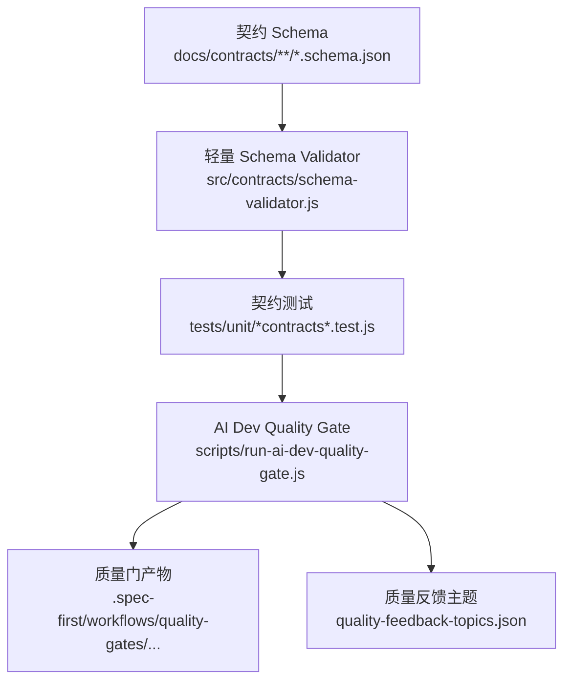

本页解释 spec-first 中 **Schema、质量门与确定性不变量** 的边界：Schema 负责把契约结构变成可检查的对象约束，质量门负责把关键契约测试与评估产物聚合成门禁结果，确定性不变量负责保证这些判断不依赖隐藏状态、模型语义或运行时猜测。当前页位于 Skills、Agents 与契约治理分组下，建议将它视为 [Context、Evidence、Execution、Evaluation 与 Knowledge Harness 分层](25-context-evidence-execution-evaluation-yu-knowledge-harness-fen-ceng) 之后、[测试体系：单元、集成、烟测与契约测试](27-ce-shi-ti-xi-dan-yuan-ji-cheng-yan-ce-yu-qi-yue-ce-shi) 之前的契约执行层说明。Sources: [schema-validator.js](src/contracts/schema-validator.js#L48-L207), [run-ai-dev-quality-gate.js](scripts/run-ai-dev-quality-gate.js#L88-L103), [verification-profile.schema.json](docs/contracts/verification/verification-profile.schema.json#L1-L83)

## 架构假设与验证结论

本页的架构假设是：spec-first 没有把“契约可信度”托付给完整 JSON Schema 引擎或 AI 语义判断，而是使用一个轻量、确定性的本地 Schema Validator 覆盖项目内契约测试所需的关键关键字，再由质量门运行一组显式列出的契约测试并生成结构化结果；源码验证显示，验证器声明了受支持关键字集合，`validateAgainstSchema` 以递归方式执行类型、枚举、对象、数组、组合、条件、字符串、数值与本地 `$ref` 约束，而质量门只聚合显式测试列表与基准 fixtures，不从 workflow 状态机推断检查范围。Sources: [schema-validator.js](src/contracts/schema-validator.js#L3-L28), [schema-validator.js](src/contracts/schema-validator.js#L48-L207), [run-ai-dev-quality-gate.js](scripts/run-ai-dev-quality-gate.js#L16-L30), [ai-dev-quality-gate.test.js](tests/unit/ai-dev-quality-gate.test.js#L186-L203)

## 概念关系图

下面的图展示本页范围内的关系：契约 Schema 是结构定义，轻量验证器是确定性执行器，单元契约测试把 Schema 与真实产物连接起来，AI Dev Quality Gate 聚合阻断检查和 advisory 检查，最终把结果与反馈主题写入 `.spec-first/workflows/quality-gates/...` 下的产物目录。Sources: [profile-loader.js](src/verification/profile-loader.js#L137-L140), [ai-dev-quality-gate.test.js](tests/unit/ai-dev-quality-gate.test.js#L24-L59), [run-ai-dev-quality-gate.js](scripts/run-ai-dev-quality-gate.js#L138-L164), [artifact-paths.js](src/verification/artifact-paths.js#L34-L51)

这个设计刻意把“结构有效”与“业务语义正确”分开：Schema Validator 只负责本地可判定的结构约束，`format` 等未支持关键字在该验证器中保持 advisory，不会被误认为强约束；如果某个消费者需要标准完整的 JSON Schema 行为，项目契约文档明确要求为该消费者增加显式依赖和测试，而不是假定轻量验证器已经覆盖。Sources: [schema-validator.md](docs/contracts/schema-validator.md#L1-L30), [schema-validator-contracts.test.js](tests/unit/schema-validator-contracts.test.js#L99-L111)

## 轻量 Schema Validator 的职责边界

`src/contracts/schema-validator.js` 是一个小型确定性验证器，面向 spec-first 的契约测试与 doctor evidence 检查；它不是 Ajv 替代品，也不是 JSON Schema 标准完整实现。它支持的强制关键字包括 `$ref`、`type`、`enum`、`const`、`required`、`properties`、`items`、`contains`、`additionalProperties`、`anyOf`、`oneOf`、`allOf`、`if/then/else`、集合长度、字符串长度、正则模式与数值上下界。Sources: [schema-validator.md](docs/contracts/schema-validator.md#L1-L24), [schema-validator.js](src/contracts/schema-validator.js#L3-L28)

| 约束类别 | 已验证行为 | 典型用途 | 不变量 |
|---|---|---|---|
| 类型约束 | `type` 支持单类型与联合类型数组 | 区分 object、array、string、number、integer、boolean、null | 类型不匹配立即产生 pointer 化错误 |
| 对象约束 | `required`、`properties`、`additionalProperties` | 防止契约字段缺失或额外字段漂移 | 即使省略 `type: object`，只要出现对象约束也会执行 |
| 组合约束 | `anyOf`、`oneOf`、`allOf` | 描述多形态契约 | 匹配数必须满足组合语义 |
| 引用约束 | 本地 `#/...` `$ref` | 复用 `$defs` 子结构 | 非本地引用 fail closed |
| Advisory 关键字 | `format` 等未强制 | 文档化元信息 | 不参与阻断判断 |

Sources: [schema-validator.js](src/contracts/schema-validator.js#L100-L155), [schema-validator.js](src/contracts/schema-validator.js#L157-L207), [schema-validator.js](src/contracts/schema-validator.js#L210-L225), [schema-validator-contracts.test.js](tests/unit/schema-validator-contracts.test.js#L99-L111)

验证器的对象约束有一个重要的不变量：只要 schema 具有 `required`、`properties` 或 `additionalProperties` 等对象级约束，并且被验证值是普通对象，就会执行对象验证，而不要求 schema 显式声明 `type: "object"`；对应测试覆盖了“省略 `type: object` 仍检查 required/properties”的场景，避免合法子 schema 因省略类型而静默放行缺失字段。Sources: [schema-validator.js](src/contracts/schema-validator.js#L39-L45), [schema-validator.js](src/contracts/schema-validator.js#L125-L155), [schema-validator-contracts.test.js](tests/unit/schema-validator-contracts.test.js#L146-L159)

`$ref` 的策略是本地引用可解析、外部引用拒绝：实现只接受以 `#/` 开头的 JSON Pointer，并按 `~1` 与 `~0` 规则还原路径片段；如果引用不是本地路径、路径不存在或解析结果不是对象，则返回失败，调用侧会记录 `unsupported schema ref`。测试明确覆盖了 `$defs` 本地引用会继续执行嵌套约束，以及 `https://...` 外部引用会 fail closed。Sources: [schema-validator.js](src/contracts/schema-validator.js#L53-L64), [schema-validator.js](src/contracts/schema-validator.js#L210-L225), [schema-validator-contracts.test.js](tests/unit/schema-validator-contracts.test.js#L113-L144), [schema-validator-contracts.test.js](tests/unit/schema-validator-contracts.test.js#L173-L182)

## Schema 契约示例：验证配置文件

验证配置文件 `spec-first.verification.json` 使用 `verification-profile.v1` 作为 schema version，声明默认 profile、服务、栈、检查命令、runner kind 与 required tools；对应 Schema 限定顶层字段并通过 `additionalProperties: false` 阻止额外顶层漂移，同时约束 service path 不能是绝对路径、Windows 盘符路径、反斜杠路径、双斜杠路径或包含 `.`/`..` 路径片段的危险形式。Sources: [spec-first.verification.json](spec-first.verification.json#L1-L40), [verification-profile.schema.json](docs/contracts/verification/verification-profile.schema.json#L1-L83)

`profile-loader` 在加载显式文件或本地 override 后，会调用 `validateAgainstSchema(getProfileSchema(), profile)` 进行结构校验；结构通过后再解析 profile、service、stack 与 check 的交叉引用，确保每个 check 都能找到 command、runner_kind 与 required_tools。也就是说，Schema 先保证“形状正确”，解析器再保证“引用闭合”。Sources: [profile-loader.js](src/verification/profile-loader.js#L85-L140), [profile-loader.js](src/verification/profile-loader.js#L142-L200)

| 层次 | 由谁负责 | 失败 reason code 或错误形态 | 示例 |
|---|---|---|---|
| 文件读取 | `loadProfileFile` | `profile-unreadable` | JSON 无法解析 |
| Schema 结构 | `validateProfileObject` | `profile-schema-invalid` | `schema_version` 不等于 `verification-profile.v1` |
| 引用解析 | `resolveProfileChecks` | `profile-resolution-invalid` | service、stack 或 check command 缺失 |
| 自动推断 | `inferProfileFromPackageJson` | `profile-inferred` 或 not-configured | 从 package scripts 推断检查命令 |

Sources: [profile-loader.js](src/verification/profile-loader.js#L85-L140), [profile-loader.js](src/verification/profile-loader.js#L142-L200), [profile-loader.js](src/verification/profile-loader.js#L203-L279), [verification-profile.test.js](tests/unit/verification-profile.test.js#L171-L193)

## AI Dev Quality Gate 的门禁模型

AI Dev Quality Gate 的核心结果由 `buildGateResult` 构造，固定输出 `schema_version: "v1"`、`generated_at`、`gate_id`、`passed`、`checks`、`failures` 与 `advisory_failures`；其中 `passed` 只由非 advisory 的 blocking checks 决定，advisory 检查失败不会让聚合门禁失败，而是被记录到 `advisory_failures` 中。Sources: [run-ai-dev-quality-gate.js](scripts/run-ai-dev-quality-gate.js#L88-L103), [ai-dev-quality-gate-result.schema.json](docs/contracts/quality-gates/ai-dev-quality-gate-result.schema.json#L1-L73)

| 检查类型 | 来源 | 是否阻断 `passed` | 失败记录位置 | 产物字段 |
|---|---|---:|---|---|
| `workflow-runtime-contracts` | 显式 Jest 契约测试列表 | 是 | `failures` | `workflow-runtime-contracts.junit.json` |
| `ai-dev-benchmark-fixtures` | benchmark fixtures runner | 否，标记 advisory | `advisory_failures` | benchmark result artifact |
| feedback topics | gate result 派生 | 否 | `candidate_topics` | `quality-feedback-topics.json` |

Sources: [run-ai-dev-quality-gate.js](scripts/run-ai-dev-quality-gate.js#L49-L86), [run-ai-dev-quality-gate.js](scripts/run-ai-dev-quality-gate.js#L105-L135), [run-ai-dev-quality-gate.js](scripts/run-ai-dev-quality-gate.js#L138-L164), [quality-feedback.js](src/verification/quality-feedback.js#L24-L50)

质量门的一个关键不变量是“检查集合显式有界”：`WORKFLOW_RUNTIME_CONTRACT_TESTS` 是固定数组，runner 使用该数组调用 Jest，并在测试中断言该数组内容保持明确，而不是从 workflow 状态、目录扫描或运行时上下文中推断门禁范围。这使质量门更像一个可审计的契约矩阵，而不是一个隐式发现机制。Sources: [run-ai-dev-quality-gate.js](scripts/run-ai-dev-quality-gate.js#L16-L30), [run-ai-dev-quality-gate.js](scripts/run-ai-dev-quality-gate.js#L105-L135), [ai-dev-quality-gate.test.js](tests/unit/ai-dev-quality-gate.test.js#L186-L203)

GitHub Actions 触发范围同样被测试守护：workflow path filters 覆盖 `src/contracts/**`、`src/verification/**`、质量门契约、工作流契约、相关脚本、关键 skills、测试文件与 fixtures；测试还断言已移除的旧路径不会重新出现在触发条件里，从而把“哪些变更会触发质量门”变成可回归验证的不变量。Sources: [ai-dev-quality-gate.yml](.github/workflows/ai-dev-quality-gate.yml#L1-L69), [ai-dev-quality-gate.test.js](tests/unit/ai-dev-quality-gate.test.js#L205-L234)

## 产物路径与反馈闭环

质量门产物目录通过 `resolveWorkflowArtifactDir(repoRoot, "quality-gates", GATE_ID)` 解析为 workflow-scoped artifact 目录，并由 path segment 校验保证 workflow 与 slug 是安全路径片段；实现拒绝空值、`.`、`..`、包含正反斜杠、绝对路径、Windows 绝对路径、Windows 非法字符、尾随空格/点与保留设备名，同时验证产物目录仍位于 artifact anchor root 内。Sources: [artifact-paths.js](src/verification/artifact-paths.js#L34-L77), [artifact-paths.js](src/verification/artifact-paths.js#L79-L118), [run-ai-dev-quality-gate.js](scripts/run-ai-dev-quality-gate.js#L138-L151)

质量门执行完成后会写入 `ai-dev-quality-gate-result.json`，随后调用 `buildQualityFeedbackTopics` 生成 `quality-feedback-topics.json`；反馈主题只从失败 check 中派生，包含稳定的 `topic_id`、`kind`、`topic_key`、summary、scope hint、artifact paths 与 tags，并保留 latest gate 的 gate id、passed 状态、生成时间与产物路径。Sources: [run-ai-dev-quality-gate.js](scripts/run-ai-dev-quality-gate.js#L149-L164), [quality-feedback.js](src/verification/quality-feedback.js#L7-L21), [quality-feedback.js](src/verification/quality-feedback.js#L24-L50)

## 确定性不变量清单

本页所述机制共同维持以下不变量：Schema Validator 的错误包含稳定 pointer；外部 `$ref` 不会被静默忽略；对象约束不依赖显式 `type: object`；`format` 不被误当作强约束；质量门的 blocking 与 advisory 分离；workflow-runtime 契约测试列表显式固定；产物路径被限制在 `.spec-first/workflows/<workflow>/<slug>/` 结构内；验证配置的 Schema 结构校验与引用解析分阶段执行。Sources: [schema-validator.js](src/contracts/schema-validator.js#L111-L155), [schema-validator.js](src/contracts/schema-validator.js#L180-L207), [schema-validator.js](src/contracts/schema-validator.js#L210-L225), [run-ai-dev-quality-gate.js](scripts/run-ai-dev-quality-gate.js#L88-L103), [artifact-paths.js](src/verification/artifact-paths.js#L34-L51), [profile-loader.js](src/verification/profile-loader.js#L137-L200)

这些不变量的工程价值在于减少“看起来通过”的灰区：Schema 约束失败会返回具体路径错误，质量门失败会定位到 check id 与 artifact path，advisory 失败不会伪装成 blocking 失败，配置解析失败会落到明确 reason code。对于高级开发者而言，这意味着修复路径应优先从失败产物与 reason code 回溯，而不是从模型输出或口头流程解释中猜测。Sources: [schema-validator-contracts.test.js](tests/unit/schema-validator-contracts.test.js#L9-L38), [ai-dev-quality-gate.test.js](tests/unit/ai-dev-quality-gate.test.js#L61-L126), [verification-profile.test.js](tests/unit/verification-profile.test.js#L171-L193)

## 与相邻页面的阅读关系

如果你需要理解质量门如何被更大的测试体系承接，下一步阅读 [测试体系：单元、集成、烟测与契约测试](27-ce-shi-ti-xi-dan-yuan-ji-cheng-yan-ce-yu-qi-yue-ce-shi)；如果你关注 Skill 入口、AI Dev Quality Gate 与回归评估如何组成更高层的回归闭环，继续阅读 [Skill 入口 lint、AI Dev Quality Gate 与回归评估](28-skill-ru-kou-lint-ai-dev-quality-gate-yu-hui-gui-ping-gu)；如果你需要回到产物与执行分层的上下文，回看 [Context、Evidence、Execution、Evaluation 与 Knowledge Harness 分层](25-context-evidence-execution-evaluation-yu-knowledge-harness-fen-ceng)。Sources: [ai-dev-quality-gate.yml](.github/workflows/ai-dev-quality-gate.yml#L1-L69), [run-ai-dev-quality-gate.js](scripts/run-ai-dev-quality-gate.js#L138-L164), [quality-feedback.js](src/verification/quality-feedback.js#L24-L50)