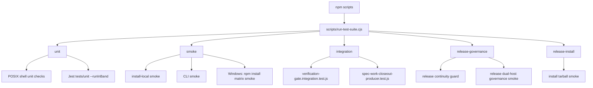
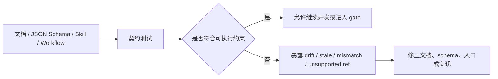

## 架构假设：测试不是单一 Jest 套件，而是分层验证网

从源码入口看，spec-first 的测试体系以 `scripts/run-test-suite.cjs` 作为统一调度层：`unit`、`smoke`、`integration`、`release`、`release-governance`、`release-install` 都是显式命名的 suite，而 `npm test` 默认执行 `all`，即单元、烟测、集成三层组合；发布相关验证被拆成独立入口，避免把耗时或依赖安装环境的检查混入默认开发反馈循环。Sources: [run-test-suite.cjs](scripts/run-test-suite.cjs#L69-L124), [package.json](package.json#L15-L35)



这张图表达的是源码中可验证的调用关系：`runUnit()` 先运行若干 shell 单测和 MCP setup 检查，再运行 `tests/unit` 下的 Jest；`runSmoke()` 在非 Windows 环境运行 `install-local.sh` 与 `cli.sh`，在原生 Windows 且未强制 POSIX 时改跑 `npm-install-matrix-smoke.js`；`runIntegration()` 只运行两个集成测试文件；`runReleaseGovernance()` 和 `runReleaseInstall()` 分别覆盖发布治理与 tarball 安装体验。Sources: [run-test-suite.cjs](scripts/run-test-suite.cjs#L69-L118)

## 测试目录的职责边界

项目的测试目录可以按反馈速度与系统边界分为四类：`tests/unit` 承载大量 Jest 契约与模块级断言，也包含少量 shell 单测；`tests/integration` 验证跨脚本、workflow、质量门之间的连接关系；`tests/smoke` 通过真实 CLI、安装脚本、tarball、宿主生成物做端到端可运行性检查；`tests/fixtures` 则为评估、任务包、workflow 不变量等测试提供固定输入。Sources: [run-test-suite.cjs](scripts/run-test-suite.cjs#L69-L100), [cli.sh](tests/smoke/cli.sh#L146-L200), [verification-gate.integration.test.js](tests/integration/verification-gate.integration.test.js#L16-L57)

```text
tests/
├── unit/          # Jest 契约测试 + 少量 shell 单测
├── integration/   # workflow / gate / producer 的跨模块连接测试
├── smoke/         # CLI、安装、本地 tarball 与发布治理烟测
├── fixtures/      # benchmark、parser、任务包与 workflow fixtures
└── helpers/       # 测试辅助数据与 helper
```

| 层级 | 主要入口 | 运行方式 | 验证重点 | 典型失败含义 |
|---|---|---|---|---|
| 单元测试 | `npm run test:unit` | `node scripts/run-test-suite.cjs unit` | 函数、契约、配置、schema、skill 文本不变量 | 局部行为或契约断裂 |
| 集成测试 | `npm run test:integration` | `node scripts/run-test-suite.cjs integration` | package scripts、CI workflow、质量门、producer 连接关系 | 多模块拼接关系失效 |
| 烟测 | `npm run test:smoke` | `node scripts/run-test-suite.cjs smoke` | CLI help/version、doctor、init、安装脚本输出 | 用户首次运行路径不可用 |
| 发布验证 | `npm run test:release*` | `release-governance` / `release-install` | tarball 内容、全局安装、宿主 runtime 生成 | 发布包或安装态闭环失效 |
| AI Dev Gate 子集 | `npm run test:ai-dev:gate` | `node scripts/run-ai-dev-quality-gate.js` | workflow runtime contracts 与 benchmark fixtures | 质量门阻塞项或 advisory drift |

Sources: [package.json](package.json#L23-L35), [run-test-suite.cjs](scripts/run-test-suite.cjs#L126-L137), [run-ai-dev-quality-gate.js](scripts/run-ai-dev-quality-gate.js#L16-L30)

## 单元测试：局部行为与契约的第一道防线

单元测试不是只验证 JavaScript 函数返回值；在这个仓库里，`runUnit()` 会依次运行 `tests/unit/developer.sh`、`tests/unit/lang-policy.sh`、`runMcpSetup()`、`tests/unit/version-reminder.sh`，然后用 Jest 串行运行 `tests/unit`，这说明 shell 行为、语言策略、MCP setup、版本提醒和大量契约测试共同构成单元层。Sources: [run-test-suite.cjs](scripts/run-test-suite.cjs#L69-L83)

Jest 配置保持轻量：它只声明 `tests/jest-setup.js` 作为 setup file，并忽略 `.worktrees`、`.agents`、`.claude`、`.codex`、`.spec-first` 以及 benchmark fixture 目录，避免生成 runtime、临时工作区和大型 fixture 干扰默认测试发现。Sources: [jest.config.js](jest.config.js#L3-L21)

`tests/unit/run-test-suite.test.js` 反过来测试测试运行器本身：它断言默认超时可被 `SPEC_FIRST_TEST_COMMAND_TIMEOUT_MS` 覆盖，超时会映射为退出码 `124`，发布治理检查必须先于 release dual-host governance smoke，并确认集成 suite 已退役旧的 shell e2e 链路。Sources: [run-test-suite.test.js](tests/unit/run-test-suite.test.js#L14-L56)

## 契约测试：把文档、schema、入口与治理规则变成可执行约束

契约测试在本项目中是单元层的重要组成部分，典型文件名包括 `*-contracts.test.js`、`*-contract.test.js` 与 governance 相关测试；它们常见的断言对象不是运行时输出，而是文档章节、schema、技能入口、workflow 边界、质量门配置与包内容清单。Sources: [run-ai-dev-quality-gate.js](scripts/run-ai-dev-quality-gate.js#L16-L30), [verification-gate.integration.test.js](tests/integration/verification-gate.integration.test.js#L28-L57)

`schema-validator-contracts.test.js` 展示了 schema 契约测试的粒度：它验证 `additionalProperties: false`、`anyOf`、数组长度、字符串长度、数值边界、正则 pattern、本地 `$defs` 引用、缺省 `type: object` 时的 required/properties，以及不支持远程 `$ref` 时 fail-closed。Sources: [schema-validator-contracts.test.js](tests/unit/schema-validator-contracts.test.js#L8-L183)

`contract-drift-guard.test.js` 展示了文档漂移防护的测试模式：测试会解析 Markdown 中指定章节，提取 Harness 层级术语，再与 probe registry 比对，识别 missing probe、stale probe、layer mismatch 与 duplicate 等问题；它还显式排除 `.claude/`、`.codex/`、`.agents/skills/`、`.spec-first/audits/`、`node_modules/` 等生成或依赖目录。Sources: [contract-drift-guard.test.js](tests/unit/contract-drift-guard.test.js#L11-L50), [contract-drift-guard.test.js](tests/unit/contract-drift-guard.test.js#L79-L189)



契约测试的价值在于把“约定”降级为可执行事实：schema validator 的测试约束数据形状，contract drift guard 约束文档术语与 probe 注册表一致，AI Dev Gate 的单元测试约束质量门结果 schema、advisory 语义与固定测试列表。Sources: [schema-validator-contracts.test.js](tests/unit/schema-validator-contracts.test.js#L99-L183), [contract-drift-guard.test.js](tests/unit/contract-drift-guard.test.js#L146-L189), [ai-dev-quality-gate.test.js](tests/unit/ai-dev-quality-gate.test.js#L24-L59)

## 集成测试：验证测试、CI 与质量门之间的接线

集成层当前由 `runIntegration()` 固定执行两个 Jest 文件：`tests/integration/verification-gate.integration.test.js` 与 `tests/integration/spec-work-closeout-producer.test.js`，并使用 `--runInBand` 串行运行；这表示集成层关注可重复的跨模块连接，而不是通过任意文件发现扩大范围。Sources: [run-test-suite.cjs](scripts/run-test-suite.cjs#L94-L100)

`verification-gate.integration.test.js` 直接读取 `package.json`、`scripts/run-test-suite.cjs`、GitHub Actions workflow 与 branch protection policy，验证 package scripts 暴露 `test:ai-dev:gate`、`test:ai-dev:benchmarks`、`test:integration`，并确认 integration runner 包含质量门集成测试文件。Sources: [verification-gate.integration.test.js](tests/integration/verification-gate.integration.test.js#L6-L26)

同一个集成测试还验证 `.github/workflows/ai-dev-quality-gate.yml` 的触发路径、执行命令与 artifact 上传路径：workflow 需覆盖 contracts、verification、quality-gates、核心 workflow skill、相关单测、benchmark fixtures 与 package 文件，执行 `npm run test:ai-dev:gate`，并上传 `.spec-first/workflows/quality-gates/`。Sources: [verification-gate.integration.test.js](tests/integration/verification-gate.integration.test.js#L28-L57), [ai-dev-quality-gate.yml](.github/workflows/ai-dev-quality-gate.yml#L3-L69)

## 烟测：验证用户路径是否真的能跑通

烟测层关注“真实入口能否工作”。`tests/smoke/cli.sh` 在隔离 HOME 与临时目录中运行 CLI，先检查 `--help` 与 `--version` 输出是否包含 `doctor`、`init`、`clean (--claude|--codex|--cursor|--kiro|--qoder)`、`tasks <subcommand>` 等入口，再验证未知命令走正常 usage 路径。Sources: [cli.sh](tests/smoke/cli.sh#L5-L18), [cli.sh](tests/smoke/cli.sh#L146-L168)

同一 CLI smoke 还验证 fresh project 下的 `doctor` 输出：普通输出需要提示没有检测到 spec-first platform、建议 `spec-first init` 并提示选择 Claude Code、Codex、Cursor、Kiro、Qoder；JSON 输出则断言 `workflow_runnability` 为 `not_verified`、`runtime_asset_health` 为 `not_applicable`。Sources: [cli.sh](tests/smoke/cli.sh#L170-L181)

`tests/smoke/install-local.sh` 验证本地安装脚本的输出仍指向 npm CLI 模型：输出必须包含全局安装命令、init 引导、按引导选择目标宿主，以及 `spec-compound` 的说明；同时它禁止继续输出旧的 `.claude/plugins/cache/spec-first-repo` 路径。Sources: [install-local.sh](tests/smoke/install-local.sh#L15-L36)

## 发布烟测：从 tarball 内容到安装态闭环

`tests/smoke/install-tarball.sh` 是真实 tarball 安装体验回归：脚本执行 `npm pack`，检查包内容不含 native parser 依赖、`.claude-plugin`、Python bytecode 缓存、已删除的 `spec-standards` skill 或命令模板，并要求当前 workflow assets、宿主 adapter 与关键 skill 文件存在。Sources: [install-tarball.sh](tests/smoke/install-tarball.sh#L1-L80)

随后该脚本在隔离 npm prefix 与 cache 中全局安装 tarball，检查安装日志不出现 `allow-scripts` 警告和 native parser 依赖，验证全局 shim 可执行、`spec-first -v` 输出包含 `Spec-First` 与 `doctor`，并验证空目录 `doctor` 输出包含 `init` 与多宿主选择提示。Sources: [install-tarball.sh](tests/smoke/install-tarball.sh#L83-L149)

`tests/smoke/release-dual-host-governance.sh` 则聚焦发布包中的多宿主治理闭环：它打包 tarball，检查 runtime governance JSON/schema、Kiro/Qoder adapters、verification evidence schema 与 typecheck 脚本进入包内，同时禁止 docs-side governance JSON/schema 和 `.claude-plugin` 进入包。Sources: [release-dual-host-governance.sh](tests/smoke/release-dual-host-governance.sh#L23-L58)

发布治理烟测还会把 tarball 安装到隔离 prefix，并用安装后的包执行 programmatic init；以 Codex 为例，它断言 `.agents/skills/spec-work/SKILL.md`、`using-spec-first`、hooks、`AGENTS.md` 中的 startup reminder 与 bounded agents 文案存在，并检查 `doctor --codex` 输出包含 `.agents/skills`、workflow skills、standalone skills 和 hook 路径。Sources: [release-dual-host-governance.sh](tests/smoke/release-dual-host-governance.sh#L59-L167)

## 跨平台策略：Windows 原生环境走替代路径

测试运行器对 Windows 做了显式分支：当 `process.platform === 'win32'` 且未设置 `SPEC_FIRST_FORCE_POSIX_TESTS=1` 时，POSIX shell 测试会跳过；MCP setup 单测改跑 PowerShell 契约测试；smoke 与 release-install 会运行 `scripts/npm-install-matrix-smoke.js`，而不是 bash smoke。Sources: [run-test-suite.cjs](scripts/run-test-suite.cjs#L8-L10), [run-test-suite.cjs](scripts/run-test-suite.cjs#L61-L92), [run-test-suite.cjs](scripts/run-test-suite.cjs#L107-L113)

`npm-install-matrix-smoke.test.js` 进一步约束 Windows 相关行为：它验证环境变量键大小写不敏感、npm CLI JavaScript entrypoint 的解析不依赖 `npm.cmd`、带空格 shim 路径的 cmd call line 正确、CI artifact writer 只接受安全文件名，并定义 release evidence 所需的检查 ID。Sources: [npm-install-matrix-smoke.test.js](tests/unit/npm-install-matrix-smoke.test.js#L60-L70), [npm-install-matrix-smoke.test.js](tests/unit/npm-install-matrix-smoke.test.js#L82-L193)

## AI Dev Quality Gate 在测试体系中的位置

AI Dev Quality Gate 不是默认 `npm test` 的一部分，而是通过 `npm run test:ai-dev:gate` 单独运行；脚本固定执行一组 workflow runtime contract 单测，并运行 benchmark fixtures，然后把结果写到 `.spec-first/workflows/quality-gates/ai-dev-quality-gate/ai-dev-quality-gate-result.json` 和 quality feedback topics。Sources: [package.json](package.json#L28-L35), [run-ai-dev-quality-gate.js](scripts/run-ai-dev-quality-gate.js#L16-L30), [run-ai-dev-quality-gate.js](scripts/run-ai-dev-quality-gate.js#L138-L164)

该 gate 的结果聚合规则是“blocking checks 决定 passed，benchmark fixtures 是 advisory”：`buildGateResult()` 会把 workflow runtime contracts 放入 checks，benchmark 存在时追加 benchmark check；`passed` 只看非 advisory 检查，advisory 失败会进入 `advisory_failures`，但不会直接让 gate 失败。Sources: [run-ai-dev-quality-gate.js](scripts/run-ai-dev-quality-gate.js#L49-L103), [ai-dev-quality-gate.test.js](tests/unit/ai-dev-quality-gate.test.js#L61-L126)

## 常用命令速查

| 场景 | 命令 | 会执行什么 | 适合何时运行 |
|---|---|---|---|
| 默认本地回归 | `npm test` | `run-test-suite.cjs all`：unit + smoke + integration | 提交前完整本地验证 |
| 快速局部反馈 | `npm run test:unit` | shell 单测、MCP setup、Jest `tests/unit` | 修改函数、schema、skill 文本、契约时 |
| CLI 与安装入口检查 | `npm run test:smoke` | install-local 与 CLI smoke，Windows 下走 npm install matrix | 修改 CLI、init、doctor、安装脚本时 |
| 跨模块连接检查 | `npm run test:integration` | verification gate 与 spec-work closeout producer 集成测试 | 修改质量门、workflow、producer 接线时 |
| 发布治理 | `npm run test:release:governance` | release continuity + dual-host governance tarball smoke | 修改发布包治理或宿主 runtime assets 时 |
| 发布安装 | `npm run test:release:install` | install tarball smoke，Windows 下走 npm install matrix | 发布前验证真实安装体验 |
| AI Dev Gate | `npm run test:ai-dev:gate` | workflow runtime contracts + benchmark fixtures + gate artifacts | 修改质量门覆盖面或核心 workflow runtime 时 |

Sources: [package.json](package.json#L23-L35), [run-test-suite.cjs](scripts/run-test-suite.cjs#L126-L137), [run-ai-dev-quality-gate.js](scripts/run-ai-dev-quality-gate.js#L105-L164)

## 失败定位路径

当单元测试失败时，优先看失败文件名是否属于契约类测试：如果是 schema、contract、governance、skill entry、workflow invariant 相关文件，通常需要同步修改实现、文档或 JSON/schema，而不是只修测试断言；`contract-drift-guard.test.js` 的错误分类也说明契约失败可能来自 missing probe、stale probe、layer mismatch 或 duplicate。Sources: [contract-drift-guard.test.js](tests/unit/contract-drift-guard.test.js#L146-L189), [schema-validator-contracts.test.js](tests/unit/schema-validator-contracts.test.js#L173-L183)

当 smoke 失败时，应按用户路径定位：`cli.sh` 的 help/version、doctor、init 非 TTY 等检查对应 CLI 交互面；`install-local.sh` 对应本地安装引导文本；`install-tarball.sh` 对应真实 tarball 内容、安装日志、全局 shim 和空目录 doctor。Sources: [cli.sh](tests/smoke/cli.sh#L146-L200), [install-local.sh](tests/smoke/install-local.sh#L22-L36), [install-tarball.sh](tests/smoke/install-tarball.sh#L31-L149)

当集成或 gate 失败时，应先确认 package scripts、runner、GitHub Actions workflow 与 branch protection policy 是否仍一致；`verification-gate.integration.test.js` 已把这些接线点放在同一个测试中，AI Dev Gate workflow 也明确只在相关 contract、verification、quality-gate、core skills、tests、fixtures 与 package 文件变更时触发。Sources: [verification-gate.integration.test.js](tests/integration/verification-gate.integration.test.js#L16-L71), [ai-dev-quality-gate.yml](.github/workflows/ai-dev-quality-gate.yml#L3-L41)

## 推荐阅读路径

如果你正在从测试体系继续理解质量闭环，下一步应阅读 [Skill 入口 lint、AI Dev Quality Gate 与回归评估](28-skill-ru-kou-lint-ai-dev-quality-gate-yu-hui-gui-ping-gu)，它承接本页的 gate 与评估部分；如果你关心测试如何服务发布前检查，再读 [发布包内容、版本连续性与网站同步检查](29-fa-bu-bao-nei-rong-ban-ben-lian-xu-xing-yu-wang-zhan-tong-bu-jian-cha)。Sources: [package.json](package.json#L28-L35), [run-ai-dev-quality-gate.js](scripts/run-ai-dev-quality-gate.js#L138-L164), [run-test-suite.cjs](scripts/run-test-suite.cjs#L102-L118)

如果你需要回到测试体系背后的治理对象，可回读 [Schema、质量门与确定性不变量](26-schema-zhi-liang-men-yu-que-ding-xing-bu-bian-liang)，再结合本页理解为什么大量 `*-contracts.test.js` 和 schema validator 测试被放在单元层；如果你要理解这些测试保护的 workflow 主链路，可回读 [工作流主链路：Spec、Plan、Tasks、Code、Review、Knowledge](11-gong-zuo-liu-zhu-lian-lu-spec-plan-tasks-code-review-knowledge)。Sources: [schema-validator-contracts.test.js](tests/unit/schema-validator-contracts.test.js#L8-L183), [run-ai-dev-quality-gate.js](scripts/run-ai-dev-quality-gate.js#L16-L30)
