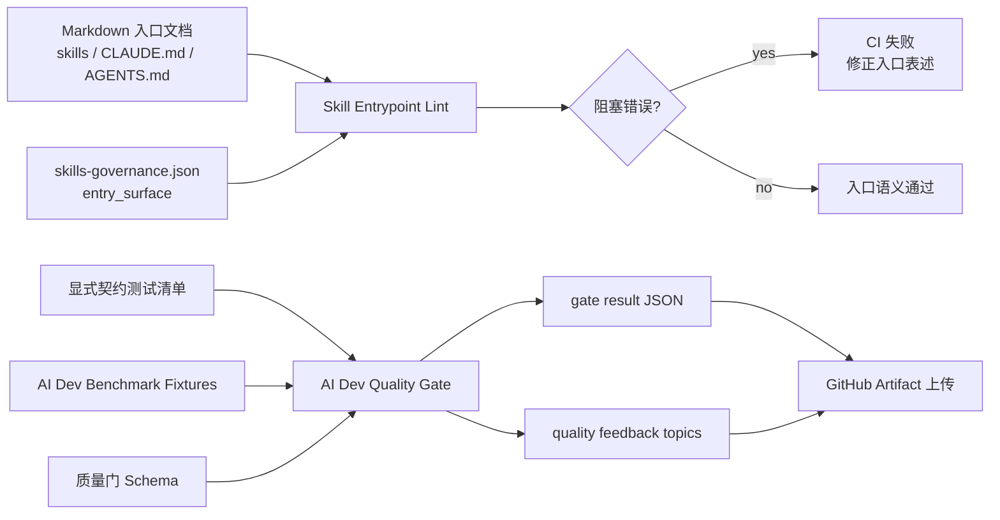

本页聚焦 spec-first 中两类“质量闸门”的工程实现：**Skill 入口 lint** 用于阻止用户可见文档把 standalone skill 误写成 slash command 或遗留入口；**AI Dev Quality Gate** 用于把核心工作流运行时契约测试与 AI 开发回归 fixture 汇总为可上传、可追踪的质量门产物。它不展开整体测试体系、发布包校验或 Source of Truth 边界；这些主题分别属于 [测试体系：单元、集成、烟测与契约测试](27-ce-shi-ti-xi-dan-yuan-ji-cheng-yan-ce-yu-qi-yue-ce-shi)、[发布包内容、版本连续性与网站同步检查](29-fa-bu-bao-nei-rong-ban-ben-lian-xu-xing-yu-wang-zhan-tong-bu-jian-cha) 与 [Source of Truth 与 Generated Runtime 边界](21-source-of-truth-yu-generated-runtime-bian-jie)。Sources: [lint-skill-entrypoints.js](scripts/lint-skill-entrypoints.js#L13-L23), [run-ai-dev-quality-gate.js](scripts/run-ai-dev-quality-gate.js#L14-L30), [ai-dev-quality-gate.yml](.github/workflows/ai-dev-quality-gate.yml#L60-L68)

## 架构假设与验证结论

从第一性原理看，这一页的核心不是“跑更多测试”，而是把**入口语义**与**回归证据**固定为仓库内可检查的不变量：入口 lint 以治理清单为事实源，扫描 `skills`、`CLAUDE.md`、`AGENTS.md` 等 Markdown；AI Dev Quality Gate 以显式测试清单和 fixture manifest 为输入，生成 `.spec-first/workflows/quality-gates/...` 下的 JSON 证据。代码验证显示，这两个闸门都避免从运行时状态隐式推导规则，而是通过配置、治理 JSON、schema 与显式文件列表形成可审计闭环。Sources: [lint-skill-entrypoints.config.json](scripts/lint-skill-entrypoints.config.json#L1-L32), [lint-skill-entrypoints.js](scripts/lint-skill-entrypoints.js#L26-L50), [run-ai-dev-quality-gate.js](scripts/run-ai-dev-quality-gate.js#L88-L103), [ai-dev-quality-gate.test.js](tests/unit/ai-dev-quality-gate.test.js#L186-L203)

上图体现了两个闸门的分工：入口 lint 解决“用户应该如何调用或理解 skill”的语言层一致性；AI Dev Quality Gate 解决“工作流核心契约与 AI 开发 fixture 是否仍能被验证”的证据层一致性。CI 中这两条路径也被拆分为两个 workflow：`skill-entrypoint-gate.yml` 在相关入口、契约和 skill 文件变更时运行 lint 与 eval fixture contracts；`ai-dev-quality-gate.yml` 在质量门、工作流契约、核心 workflow skill、benchmark fixture 等路径变更时运行 AI Dev Quality Gate 并上传产物。Sources: [skill-entrypoint-gate.yml](.github/workflows/skill-entrypoint-gate.yml#L3-L50), [ai-dev-quality-gate.yml](.github/workflows/ai-dev-quality-gate.yml#L3-L69)

## Skill 入口 lint：治理目的与扫描边界

Skill 入口 lint 的治理对象是 Markdown 中的用户可见入口表述。配置文件声明扫描根为 `skills`、`CLAUDE.md`、`AGENTS.md`，扩展名仅为 `.md`，并允许通过 `ignoredLineContains` 跳过包含 `Skill(` 与 `skill:` 的行；这说明 lint 的目标不是解析所有代码或配置，而是约束文档与宿主入口说明中的自然语言入口。Sources: [lint-skill-entrypoints.config.json](scripts/lint-skill-entrypoints.config.json#L1-L13), [lint-skill-entrypoints.js](scripts/lint-skill-entrypoints.js#L118-L144)

lint 的规则来源分为两层：配置中的静态 blocked patterns，以及基于 skills governance 动态生成的 standalone skill slash-command 规则。静态规则阻止以 slash command 开头的标题、遗留 Codex entry point 写法，以及 `/research`、`/simplify` 等遗留 free command alias；动态规则从 `loadSkillsGovernance()` 读取 `entry_surface === 'standalone_skill'` 的 skill，并为 `spec-*` 名称生成去掉 `spec-` 前缀的 alias，从而同时捕捉 `/spec:xxx`、`/xxx`、`$spec-xxx` 等误导性入口写法。Sources: [lint-skill-entrypoints.config.json](scripts/lint-skill-entrypoints.config.json#L14-L31), [lint-skill-entrypoints.js](scripts/lint-skill-entrypoints.js#L26-L70)

| 规则层 | 输入 | 检查重点 | 失败语义 |
|---|---|---|---|
| 静态 blockedPatterns | `lint-skill-entrypoints.config.json` | 标题 slash 化、遗留宿主入口、遗留 free command | 直接产生 `error` finding |
| 动态 standalone 规则 | `skills-governance.json` 经 `loadSkillsGovernance()` 加载 | standalone skill 不应被描述为 command entrypoint | 直接产生 `error` finding |
| guardrail 例外 | 当前行文本 | “Do not / never / not command entrypoint”等否定性防护语句 | 不报错，允许文档说明禁用规则 |

Sources: [lint-skill-entrypoints.js](scripts/lint-skill-entrypoints.js#L73-L104), [lint-skill-entrypoints.js](scripts/lint-skill-entrypoints.js#L173-L178), [lint-skill-entrypoints.test.js](tests/unit/lint-skill-entrypoints.test.js#L40-L75)

lint 的执行流程非常窄：加载配置与治理数据，构建规则，收集扫描文件，对每行执行正则检查，最终把 `error` 级 finding 输出到 stderr 并以 exit code `1` 失败；warning 只会在没有 error 时输出，不阻塞进程。`package.json` 将 `npm run lint` 映射到 `npm run lint:skill-entrypoints`，后者直接执行 `node scripts/lint-skill-entrypoints.js`。Sources: [lint-skill-entrypoints.js](scripts/lint-skill-entrypoints.js#L180-L200), [lint-skill-entrypoints.js](scripts/lint-skill-entrypoints.js#L160-L166), [package.json](package.json#L15-L18)

## 入口 lint 的可维护性要点

入口 lint 的关键设计点是**不把 standalone skill 与 workflow command 混为一谈**。单元测试明确构造了 `using-spec-first` 作为 `standalone_skill`、`spec-write-tasks` 与 `spec-work` 作为 `workflow_command`：前者被写成 `/spec:using-spec-first` 的正向路由时会被阻塞，后者作为公开 workflow command 出现在 prose 中则允许通过。Sources: [lint-skill-entrypoints.test.js](tests/unit/lint-skill-entrypoints.test.js#L21-L38), [lint-skill-entrypoints.test.js](tests/unit/lint-skill-entrypoints.test.js#L56-L104)

另一个维护点是 host 入口文档覆盖。测试中明确断言 `scanRoots` 必须包含 `CLAUDE.md` 与 `AGENTS.md`，并且 `collectFiles()` 必须支持“文件级 scanRoot”，不是只递归目录；这保证宿主级说明文档中的入口漂移也能被同一个 lint 捕获。Sources: [lint-skill-entrypoints.test.js](tests/unit/lint-skill-entrypoints.test.js#L106-L119), [lint-skill-entrypoints.js](scripts/lint-skill-entrypoints.js#L121-L140)

## AI Dev Quality Gate：阻塞检查与建议性回归

AI Dev Quality Gate 的核心结果由 `buildGateResult()` 生成，固定包含 `schema_version`、`generated_at`、`gate_id`、`passed`、`checks`、`failures` 与 `advisory_failures`。其中 `passed` 只由非 advisory 的 blocking checks 决定；benchmark fixture 会作为 advisory check 加入 `checks`，即使 fixture 失败，也进入 `advisory_failures` 而不是 `failures`。Sources: [run-ai-dev-quality-gate.js](scripts/run-ai-dev-quality-gate.js#L49-L64), [run-ai-dev-quality-gate.js](scripts/run-ai-dev-quality-gate.js#L66-L103), [ai-dev-quality-gate.test.js](tests/unit/ai-dev-quality-gate.test.js#L61-L126)

| 检查项 | `check_id` | 类型 | 是否阻塞 `passed` | 产物 |
|---|---|---|---|---|
| Workflow Runtime Contracts | `workflow-runtime-contracts` | `unit-suite` | 是 | `workflow-runtime-contracts.junit.json` |
| AI Dev Benchmark Fixtures | `ai-dev-benchmark-fixtures` | `benchmark` | 否，`advisory: true` | `benchmark-fixtures-result.json` |
| Quality Feedback Topics | 非 check，本质是反馈产物 | passive feedback | 不参与 gate 判定 | `quality-feedback-topics.json` |

Sources: [run-ai-dev-quality-gate.js](scripts/run-ai-dev-quality-gate.js#L105-L136), [run-ai-dev-quality-gate.js](scripts/run-ai-dev-quality-gate.js#L138-L164), [quality-feedback.js](src/verification/quality-feedback.js#L24-L55)

阻塞检查使用一个显式维护的 Jest 测试文件列表 `WORKFLOW_RUNTIME_CONTRACT_TESTS`，覆盖分支保护、init source path、package install、mcp setup PowerShell、AI Dev Gate 自身、benchmark fixture、spec-plan、task-pack、spec-write-tasks、spec-work、spec-doc-review、spec-code-review、plan status taxonomy 等单元契约。runner 通过 `spawnSync(process.execPath, [jestBin, ...tests, '--runInBand', '--json', '--outputFile=...'])` 执行，并从 Jest JSON 中读取 suite/test 总数与失败数。Sources: [run-ai-dev-quality-gate.js](scripts/run-ai-dev-quality-gate.js#L16-L30), [run-ai-dev-quality-gate.js](scripts/run-ai-dev-quality-gate.js#L105-L136), [ai-dev-quality-gate.test.js](tests/unit/ai-dev-quality-gate.test.js#L186-L203)

## Benchmark fixture：只验证回归样本结构，不执行声明命令

AI Dev benchmark fixture runner 的定位是**回归样本结构与证据完整性校验**。它读取 `tests/fixtures/ai-dev-benchmarks` 下的 fixture 目录，要求存在 `manifest.json`，并用 `docs/contracts/quality-gates/ai-dev-benchmark-fixture.schema.json` 校验 manifest；内置合法场景类型为 `api-contract`、`docs-only`、`cli-bugfix`、`multi-module-refactor`。Sources: [run-ai-dev-benchmark-fixtures.js](scripts/run-ai-dev-benchmark-fixtures.js#L10-L34), [run-ai-dev-benchmark-fixtures.js](scripts/run-ai-dev-benchmark-fixtures.js#L109-L168), [ai-dev-benchmark-fixtures.test.js](tests/unit/ai-dev-benchmark-fixtures.test.js#L82-L99)

fixture runner 还执行路径安全检查：路径必须是 POSIX repo-relative path，不能包含反斜杠，不能是绝对路径，不能通过 `..` 或非规范化形式逃逸。它会检查 `prompt_path` 是否存在且为文件、`repo_path` 是否存在且为目录、`semantic_review.artifact_path` 是否存在且为文件，并要求 `expected_artifacts` 与 `validation_commands` 至少各有一项。Sources: [run-ai-dev-benchmark-fixtures.js](scripts/run-ai-dev-benchmark-fixtures.js#L53-L79), [run-ai-dev-benchmark-fixtures.js](scripts/run-ai-dev-benchmark-fixtures.js#L196-L276), [ai-dev-benchmark-fixtures.test.js](tests/unit/ai-dev-benchmark-fixtures.test.js#L142-L149)

需要特别注意的是，`validation_commands` 在当前 runner 中是**声明式字段**，不会被执行；fixture 输出中的 `validation_commands_status` 固定体现为 `declared_only`。对应测试明确验证“full-closure scenario types without executing declared commands”和“unknown scenario types without executing declared commands”，因此这里的 benchmark 是回归评估输入完整性门，不是端到端命令执行器。Sources: [run-ai-dev-benchmark-fixtures.js](scripts/run-ai-dev-benchmark-fixtures.js#L280-L289), [ai-dev-benchmark-fixtures.test.js](tests/unit/ai-dev-benchmark-fixtures.test.js#L151-L196)

## 产物路径、Schema 与反馈闭环

AI Dev Quality Gate 的产物目录由 `resolveWorkflowArtifactDir(repoRoot, 'quality-gates', GATE_ID)` 生成，目录布局遵循 `<repoRoot>/.spec-first/workflows/<workflow>/<slug>/`。路径段会被校验为非空、安全、非绝对、无 `/` 或 `\`，并额外检查 Windows 非法文件名字符、尾随空格/点和保留名；目录 containment 也会验证产物仍位于 artifact anchor root 内。Sources: [run-ai-dev-quality-gate.js](scripts/run-ai-dev-quality-gate.js#L138-L164), [artifact-paths.js](src/verification/artifact-paths.js#L34-L52), [artifact-paths.js](src/verification/artifact-paths.js#L54-L93)

质量门结果 schema 要求每个 check 具备 `check_id`、`kind`、`passed`、`summary`、`artifact_path`；`kind` 只能是 `unit-suite` 或 `benchmark`；`failures` 是阻塞失败 check id 字符串数组；`advisory_failures` 则保存 advisory check 的 `check_id`、`reason_code` 与 `artifact_paths`。单元测试使用该 schema 校验 lightweight gate result 与包含 advisory benchmark failure 的 aggregate gate result。Sources: [ai-dev-quality-gate-result.schema.json](docs/contracts/quality-gates/ai-dev-quality-gate-result.schema.json#L1-L72), [ai-dev-quality-gate.test.js](tests/unit/ai-dev-quality-gate.test.js#L24-L59), [ai-dev-quality-gate.test.js](tests/unit/ai-dev-quality-gate.test.js#L61-L126)

质量反馈产物由 `buildQualityFeedbackTopics()` 生成，来源标记为 `passive-quality-feedback`。它会遍历 gate result 中 `passed === false` 的 check，把每个失败 check 归一化为 `gate-check:<check_id>` 主题，附带 `artifact_paths` 与 `quality-gate`、`check_id`、`kind` 等 tags；同时记录 latest gate 的 `gate_id`、`passed`、`generated_at` 与 artifact path。Sources: [quality-feedback.js](src/verification/quality-feedback.js#L7-L22), [quality-feedback.js](src/verification/quality-feedback.js#L24-L55), [run-ai-dev-quality-gate.js](scripts/run-ai-dev-quality-gate.js#L150-L164)

## CI 触发边界与本地命令

`Skill Entrypoint Gate` 在 pull request 中仅对入口治理相关路径触发，包括 `skills/**`、workflow/eval/source-runtime/dual-host contracts、PR 模板、workflow 自身、lint 脚本与配置、若干 eval 与 skill contract 测试、plugin manifest、package 文件等；执行步骤是 checkout、Node 20、`npm ci`、`npm run lint:skill-entrypoints`、`npm run test:eval-fixtures`。Sources: [skill-entrypoint-gate.yml](.github/workflows/skill-entrypoint-gate.yml#L3-L50)

`AI Dev Quality Gate` 的触发路径覆盖 contracts、verification、quality-gates、plans、核心 workflow skill、runner 脚本、相关单元测试、benchmark fixtures 与 package 文件；执行 `npm run test:ai-dev:gate` 后，无论成功失败都会上传 `.spec-first/workflows/quality-gates/` 作为 GitHub artifact。Sources: [ai-dev-quality-gate.yml](.github/workflows/ai-dev-quality-gate.yml#L3-L41), [ai-dev-quality-gate.yml](.github/workflows/ai-dev-quality-gate.yml#L43-L69)

| 本地目的 | 命令 | 直接入口 | 预期输出 |
|---|---|---|---|
| 只检查 Skill 入口表述 | `npm run lint:skill-entrypoints` | `node scripts/lint-skill-entrypoints.js` | 无 error 时通过；有 error 时输出 finding 并退出 1 |
| 只检查 AI benchmark fixture | `npm run test:ai-dev:benchmarks` | `node scripts/run-ai-dev-benchmark-fixtures.js` | 输出 benchmark result JSON，并写入 quality-gates 产物 |
| 运行完整 AI Dev Gate | `npm run test:ai-dev:gate` | `node scripts/run-ai-dev-quality-gate.js` | 输出 gate result JSON，失败阻塞 check 时 exit code 非 0 |

Sources: [package.json](package.json#L15-L30), [lint-skill-entrypoints.js](scripts/lint-skill-entrypoints.js#L180-L200), [run-ai-dev-benchmark-fixtures.js](scripts/run-ai-dev-benchmark-fixtures.js#L344-L380), [run-ai-dev-quality-gate.js](scripts/run-ai-dev-quality-gate.js#L167-L173)

## 失败定位方式

当入口 lint 失败时，优先看 finding 的 `ruleId`：`heading-leading-slash` 通常意味着标题把 skill 写成 slash entrypoint；`legacy-host-specific-entrypoint` 指向旧宿主特定入口；`legacy-free-command` 指向遗留 alias；`standalone-command-entrypoint` 则说明 standalone skill 被正向描述成命令入口。修复方式不是绕过 lint，而是把文档语言改成“作为 skill 使用”或明确否定 command entrypoint；代码中已经允许 guardrail prose，例如 “Do not route users to `/spec:using-spec-first`”。Sources: [lint-skill-entrypoints.config.json](scripts/lint-skill-entrypoints.config.json#L14-L31), [lint-skill-entrypoints.js](scripts/lint-skill-entrypoints.js#L160-L178), [lint-skill-entrypoints.test.js](tests/unit/lint-skill-entrypoints.test.js#L40-L75)

当 AI Dev Quality Gate 失败时，先区分 `failures` 与 `advisory_failures`：`failures` 中的 check id 会导致整体 `passed: false`；`advisory_failures` 只表示 benchmark fixture 漂移或样本证据不完整。阻塞失败通常需要查看 `workflow-runtime-contracts.junit.json`；建议性失败则查看 `benchmark-fixtures-result.json` 中的 `reason_code` 与 `artifact_paths`。Sources: [run-ai-dev-quality-gate.js](scripts/run-ai-dev-quality-gate.js#L88-L103), [run-ai-dev-quality-gate.js](scripts/run-ai-dev-quality-gate.js#L105-L136), [run-ai-dev-benchmark-fixtures.js](scripts/run-ai-dev-benchmark-fixtures.js#L81-L88), [run-ai-dev-benchmark-fixtures.js](scripts/run-ai-dev-benchmark-fixtures.js#L328-L336)

## 与相邻页面的阅读顺序

如果你需要理解这些闸门在完整测试金字塔中的位置，先读 [测试体系：单元、集成、烟测与契约测试](27-ce-shi-ti-xi-dan-yuan-ji-cheng-yan-ce-yu-qi-yue-ce-shi)；如果你正在维护 skill 的公开入口与内部能力边界，回到 [Skill 类型、公开入口与内部能力边界](22-skill-lei-xing-gong-kai-ru-kou-yu-nei-bu-neng-li-bian-jie)；如果你关心 GitHub 发布前还会检查哪些包内容与版本连续性，继续读 [发布包内容、版本连续性与网站同步检查](29-fa-bu-bao-nei-rong-ban-ben-lian-xu-xing-yu-wang-zhan-tong-bu-jian-cha)。Sources: [skill-entrypoint-gate.yml](.github/workflows/skill-entrypoint-gate.yml#L45-L49), [ai-dev-quality-gate.yml](.github/workflows/ai-dev-quality-gate.yml#L60-L68), [package.json](package.json#L28-L35)