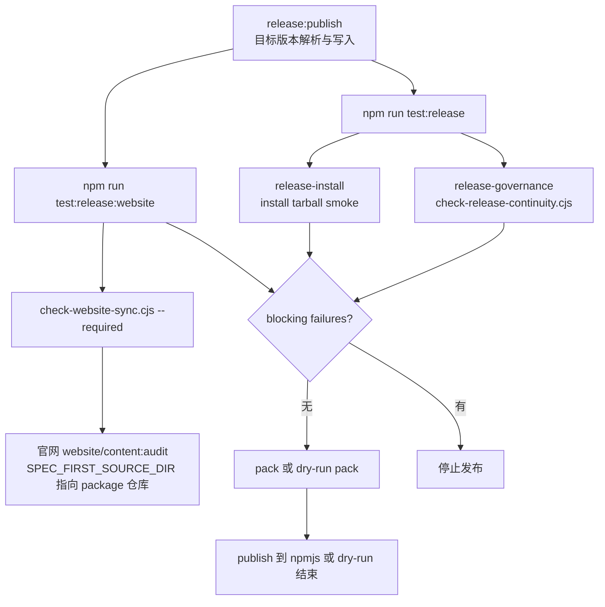
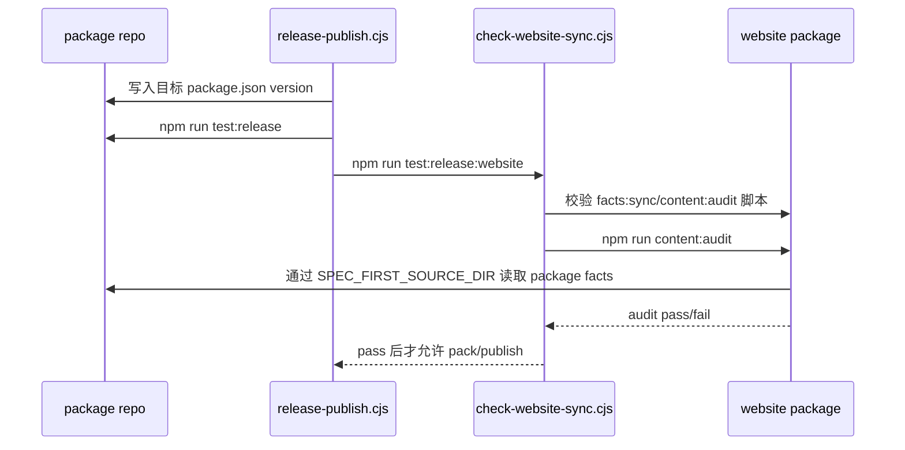

本页解释 spec-first 的发布前确定性防线：它不只验证测试是否通过，还把 **npm 发布包内容、运行时能力目录新鲜度、公开 workflow 摘要覆盖、发布脚本中的网站同步门禁** 串成一个可失败关闭的发布连续性检查。当前页面位于“测试、发布与演进”分组中的 [发布包内容、版本连续性与网站同步检查](29-fa-bu-bao-nei-rong-ban-ben-lian-xu-xing-yu-wang-zhan-tong-bu-jian-cha)，建议先阅读 [测试体系：单元、集成、烟测与契约测试](27-ce-shi-ti-xi-dan-yuan-ji-cheng-yan-ce-yu-qi-yue-ce-shi) 与 [Skill 入口 lint、AI Dev Quality Gate 与回归评估](28-skill-ru-kou-lint-ai-dev-quality-gate-yu-hui-gui-ping-gu)，再继续到 [路线图、ADR 与历史方案如何阅读](30-lu-xian-tu-adr-yu-li-shi-fang-an-ru-he-yue-du)。Sources: [package.json](package.json#L15-L36), [check-release-continuity.cjs](scripts/check-release-continuity.cjs#L253-L319), [run-test-suite.cjs](scripts/run-test-suite.cjs#L102-L118)

## 架构假设：发布不是单点动作，而是连续性证明

从代码形态看，发布链路的核心假设是：**真正危险的发布回归通常不是单个测试失败，而是 source-of-truth、打包面、外部官网消费面之间发生漂移**。因此仓库把发布前校验拆成三类确定性证据：`check-release-continuity.cjs` 负责仓库内部连续性，`npm pack --dry-run --json` 负责实际 tarball 面，`check-website-sync.cjs --required` 负责外部官网 checkout 的内容审计门禁；`release-publish.cjs` 在写入目标版本后、pack/publish 前强制运行这些门禁。Sources: [check-release-continuity.cjs](scripts/check-release-continuity.cjs#L119-L160), [check-release-continuity.cjs](scripts/check-release-continuity.cjs#L199-L221), [release-publish.cjs](scripts/release-publish.cjs#L96-L132)

上图的关键边界是：普通 release 测试由 `test:release` 触发，并在 `run-test-suite.cjs` 中展开为 release governance 与 release install；官网同步检查没有被折叠进普通 release suite，而是由 `release-publish.cjs` 额外运行 `test:release:website`，从而避免日常 release 测试依赖 sibling 官网 checkout，同时保证真实发布前必须检查官网消费面。Sources: [package.json](package.json#L32-L35), [run-test-suite.cjs](scripts/run-test-suite.cjs#L102-L118), [release-publish.cjs](scripts/release-publish.cjs#L109-L112), [website-sync-contract.md](docs/contracts/website-sync-contract.md#L62-L67)

## 发布包内容：`files` 字段与真实 tarball 双重校验

发布包内容首先由 `package.json` 的 `files` 白名单声明，当前包含 `bin/`、`src/`、`agents/`、运行时能力目录、契约文档、发布与测试脚本、AI benchmark fixtures、`skills/`、`templates/` 与 `README.md`，并显式排除 Python 缓存产物。这个白名单决定 npm pack 的候选交付面，而不是让整个仓库默认进入包。Sources: [package.json](package.json#L37-L83)

| 交付类别 | 代表路径 | 发布意义 |
|---|---|---|
| CLI 与运行时代码 | `bin/`, `src/` | 安装后可执行 `spec-first`，并暴露初始化相关模块 |
| Skill 与运行时模板 | `skills/`, `templates/` | 支撑多宿主生成运行时资产 |
| 契约与目录 | `docs/contracts/**`, `docs/catalog/runtime-capabilities.md`, `docs/standards/` | 让发布包携带可验证的行为边界与能力目录 |
| 发布校验脚本 | `scripts/check-release-continuity.cjs`, `scripts/check-website-sync.cjs`, `scripts/run-test-suite.cjs` | 让包内发布治理逻辑本身可被消费与复核 |
| 测试夹具 | `tests/fixtures/ai-dev-benchmarks/` | 支撑发布包中的 benchmark fixture 契约 |

Sources: [package.json](package.json#L37-L83), [package-install-contracts.test.js](tests/unit/package-install-contracts.test.js#L82-L113)

`checkPackageDeliverySurface()` 并不只读 `package.json.files`；它还执行 `npm pack --dry-run --json`，解析 npm 返回的文件列表，并确认非目录型必需条目实际出现在 tarball 文件集合中。也就是说，检查同时覆盖“声明缺失”和“声明了但真实 pack 没进包”两类失败。Sources: [check-release-continuity.cjs](scripts/check-release-continuity.cjs#L119-L160), [check-release-continuity.cjs](scripts/check-release-continuity.cjs#L162-L197)

发布包内容守护的最小必需面包括运行时能力目录、workflow schema 目录、发布连续性脚本、官网同步脚本、运行时能力目录生成脚本、测试套件 runner、`src/`、`skills/` 与 `templates/`。其中目录项只要求 `files` 白名单声明存在，文件项还会被 tarball dry-run 文件集验证。Sources: [check-release-continuity.cjs](scripts/check-release-continuity.cjs#L119-L140)

## 版本连续性：先写目标版本，再用目标版本跑门禁

`release-publish.cjs` 接受 `<version>|auto|patch|minor|major`，其中 `auto` 与 `patch` 都把 patch 号加一，`minor` 重置 patch，`major` 重置 minor 与 patch；显式版本则必须符合 semver 正则。该脚本在发布前打印包名、当前版本、目标版本与 dry-run/publish 模式，随后在必要时临时或正式写入 `package.json.version`。Sources: [release-publish.cjs](scripts/release-publish.cjs#L36-L90), [release-publish.cjs](scripts/release-publish.cjs#L96-L107)

版本连续性的关键实现顺序是：**目标版本写入后才运行 release gates，release gates 通过后才 pack 或 publish**。测试也固定了这个顺序，要求 `writePackageJson(nextPkg)` 位于 `test:release` 与 `test:release:website` 之前，并要求网站门禁位于真实 pack 与 dry-run pack 之前。Sources: [release-publish.cjs](scripts/release-publish.cjs#L96-L125), [release-publish.test.js](tests/unit/release-publish.test.js#L20-L39)

失败恢复策略同样是连续性的一部分：如果脚本写入过目标版本，但处于 dry-run 或真实 publish 未成功，就会在 `finally` 中把 `package.json` 恢复为原始版本；只有真实 publish 成功后，版本写入才不会被回滚。Sources: [release-publish.cjs](scripts/release-publish.cjs#L92-L145)

## Release Continuity Guard：五个守卫的失败语义

`check-release-continuity.cjs` 输出 `release-continuity-guard/v1` 结构，包含整体 `status`、每个 guard、blocking failures 与 advisory failures；只要 blocking guard 失败，整体状态就是 `failed`，CLI 退出码也会变成 1。该脚本支持 `--json` 输出结构化结果，否则输出文本摘要。Sources: [check-release-continuity.cjs](scripts/check-release-continuity.cjs#L253-L341)

| Guard ID | 分类 | 保护对象 | 通过语义 | 失败语义 |
|---|---:|---|---|---|
| `runtime-capability-catalog-fresh` | blocking | `docs/catalog/runtime-capabilities.md` | 生成结果与现有目录完全一致 | 目录缺失、不可读或 stale |
| `public-workflow-contract-summary-coverage` | blocking | workflow skill 的 Contract Summary | 所有公开 workflow 与指定独立 skill 有摘要 | 指定 skill 缺少摘要 |
| `package-delivery-surface` | blocking | npm 交付面 | `files` 与 tarball dry-run 都覆盖必需面 | `files` 缺失、tarball 不可用或文件未入包 |
| `website-sync-release-gate-preserved` | blocking | 官网同步发布门禁 | package script 与发布脚本都保留网站门禁 | 发布链路缺少网站同步门禁 |
| `readme-source-runtime-boundary-links` | docs-only-no-impact | README 边界链接 | 中英文 README 都链接 source/runtime 边界契约 | 文档链接缺失但不阻断发布 |

Sources: [check-release-continuity.cjs](scripts/check-release-continuity.cjs#L55-L117), [check-release-continuity.cjs](scripts/check-release-continuity.cjs#L119-L160), [check-release-continuity.cjs](scripts/check-release-continuity.cjs#L199-L239), [check-release-continuity.cjs](scripts/check-release-continuity.cjs#L253-L319)

运行时能力目录守卫会调用 `buildRuntimeCapabilityCatalog()` 生成期望内容，并与当前输出文件做字节级比较；如果读取失败，会把缺失映射为 `runtime-catalog-missing`，其他读取问题映射为 `runtime-catalog-unreadable`，内容不一致则是 `runtime-catalog-stale`。Sources: [check-release-continuity.cjs](scripts/check-release-continuity.cjs#L55-L94)

公开 workflow 摘要守卫读取 `src/cli/contracts/dual-host-governance/skills-governance.json`，筛选 `entry_surface === 'workflow_command'` 的 skill，再额外加入 `using-spec-first` 与 `spec-write-tasks`，并要求每个对应 `skills/<name>/SKILL.md` 前 120 行包含 `## Contract Summary` 或 `## Workflow Contract Summary`。Sources: [check-release-continuity.cjs](scripts/check-release-continuity.cjs#L23-L42), [check-release-continuity.cjs](scripts/check-release-continuity.cjs#L96-L117)

## 网站同步检查：官网是外部 consumer，不是包仓库目录

官网同步契约明确规定：官网是本仓库的外部 consumer，package 仓库拥有 package facts、skills、agents、README 与用户手册等事实；官网仓库通过自己的 generated data 与 content audit 消费这些事实，package 发布流程不能修改官网 source files。Sources: [website-sync-contract.md](docs/contracts/website-sync-contract.md#L3-L20)

`check-website-sync.cjs` 默认把官网仓库定位到当前仓库 sibling 的 `spec-first-official-website`，也允许通过 `SPEC_FIRST_WEBSITE_REPO` 覆盖；真正检查的 package 目录是 `<websiteRepo>/website`。如果缺少官网 checkout，非 required 模式会 `SKIP`，但 `--required` 或 `SPEC_FIRST_WEBSITE_SYNC_REQUIRED=1` 会失败关闭。Sources: [check-website-sync.cjs](scripts/check-website-sync.cjs#L8-L23), [check-website-sync.cjs](scripts/check-website-sync.cjs#L41-L51)

网站检查脚本要求官网 package 暴露 `facts:sync` 与 `content:audit` 两个 npm script，并要求 `website/scripts/sync-spec-first-facts.js` 与 `website/scripts/audit-content-facts.js` 文件存在；但发布门禁实际运行的是 `npm run content:audit`，并把 `SPEC_FIRST_SOURCE_DIR` 指向当前 package 仓库。Sources: [check-website-sync.cjs](scripts/check-website-sync.cjs#L53-L78)

这个 sequence 的边界条件被单元测试固定：发布脚本必须包含 `runNpmChecked(['run', 'test:release:website'])`；网站同步脚本必须复用非 shell 的 npm runner，以保持 Windows 可移植性；运行 `content:audit` 时，测试会验证 `SPEC_FIRST_SOURCE_DIR` 等于当前 package 仓库根目录。Sources: [website-sync-contracts.test.js](tests/unit/website-sync-contracts.test.js#L36-L52), [website-sync-contracts.test.js](tests/unit/website-sync-contracts.test.js#L54-L84)

## Release Evidence Schema：发布产物摘要的形状契约

`release-package-evidence.schema.json` 定义发布证据摘要必须包含 `schema_version`、`generated_at`、`status`、`package`、`environment`、`artifacts`、`checks` 与 `failures`；其中 schema version 固定为 `release-package-evidence.v1`，状态只能是 `passed` 或 `failed`。Sources: [release-package-evidence.schema.json](docs/contracts/release-package-evidence.schema.json#L1-L18)

该 schema 要求发布证据记录 tarball 名称、平台、Node 版本，以及一组固定 artifact 名称，包括 `summary.json`、`pack-output.log`、`package-content-manifest.json`、各宿主 init programmatic log、Cursor doctor/clean/loader evidence log 与 `release-artifact-summary.json`。Sources: [release-package-evidence.schema.json](docs/contracts/release-package-evidence.schema.json#L19-L69)

实际构造逻辑位于 `npm-install-matrix-smoke.js`：`buildReleaseArtifactSummary()` 生成同名 schema version，写入 package name/version/tarball、当前平台与 Node 版本、默认 artifact 列表、checks 与 failures；失败列表默认由 failed checks 映射为 reason code、message 与 artifact path。Sources: [npm-install-matrix-smoke.js](scripts/npm-install-matrix-smoke.js#L637-L669)

## 操作路径：发布前如何解释失败

当 `runtime-capability-catalog-fresh` 失败时，应先判断是缺失、不可读还是 stale；代码中的 checked sources 指向目录生成器、plugin、skills governance、workflow schema 与现有 runtime catalog，因此修复路径通常是重新生成或同步运行时能力目录，而不是绕过 release guard。Sources: [check-release-continuity.cjs](scripts/check-release-continuity.cjs#L55-L94), [release-continuity-guard.test.js](tests/unit/release-continuity-guard.test.js#L61-L89)

当 `package-delivery-surface` 失败时，应区分三种原因：`package-delivery-surface-missing-files-field` 表示 `files` 字段为空或缺失，`package-delivery-surface-missing:*` 表示白名单未声明必需条目，`package-delivery-tarball-missing:*` 表示声明存在但 `npm pack --dry-run --json` 的真实 tarball 文件集缺失。Sources: [check-release-continuity.cjs](scripts/check-release-continuity.cjs#L119-L160)

当网站同步失败时，不应在 package 仓库 vendor 官网源码，也不应让 package 发布脚本重写官网 facts；契约规定 stale content 的修复应留给维护者在官网仓库运行 `npm run facts:sync` 并审查官网 diff，而 package 发布侧只消费 `content:audit` 的通过/失败结果。Sources: [website-sync-contract.md](docs/contracts/website-sync-contract.md#L36-L45), [website-sync-contract.md](docs/contracts/website-sync-contract.md#L54-L67)

## 最小命令心智模型

发布路径中最小可记忆命令是：`npm run test:release` 覆盖 release governance 与 install tarball smoke，`npm run test:release:website` 在 required 模式下检查官网内容审计，`npm run release:publish -- <version>|auto|patch|minor|major [--dry-run]` 则把目标版本写入、release gates、website gate、pack/publish 串在一起。Sources: [package.json](package.json#L21-L35), [release-publish.cjs](scripts/release-publish.cjs#L63-L79), [run-test-suite.cjs](scripts/run-test-suite.cjs#L102-L118)

如果只是调试结构化发布连续性输出，可以直接运行 `node scripts/check-release-continuity.cjs --json`；其 JSON 输出包含每个 guard 的 `guard_id`、`result`、`reason_code`、`classification`、`artifact_path` 与 `checked_sources`，测试也要求这些字段稳定存在。Sources: [check-release-continuity.cjs](scripts/check-release-continuity.cjs#L321-L347), [release-continuity-guard.test.js](tests/unit/release-continuity-guard.test.js#L17-L59)

## 阅读延伸

如果你正在定位某个发布失败，下一步应回到 [测试体系：单元、集成、烟测与契约测试](27-ce-shi-ti-xi-dan-yuan-ji-cheng-yan-ce-yu-qi-yue-ce-shi) 理解 release suite 与 smoke suite 的分层；如果失败来自 workflow 摘要、skill 入口或 AI Dev gate，则继续阅读 [Skill 入口 lint、AI Dev Quality Gate 与回归评估](28-skill-ru-kou-lint-ai-dev-quality-gate-yu-hui-gui-ping-gu)；如果你需要判断某个发布契约来自历史设计还是当前实现，则进入 [路线图、ADR 与历史方案如何阅读](30-lu-xian-tu-adr-yu-li-shi-fang-an-ru-he-yue-du)。Sources: [run-test-suite.cjs](scripts/run-test-suite.cjs#L69-L118), [package.json](package.json#L15-L36)