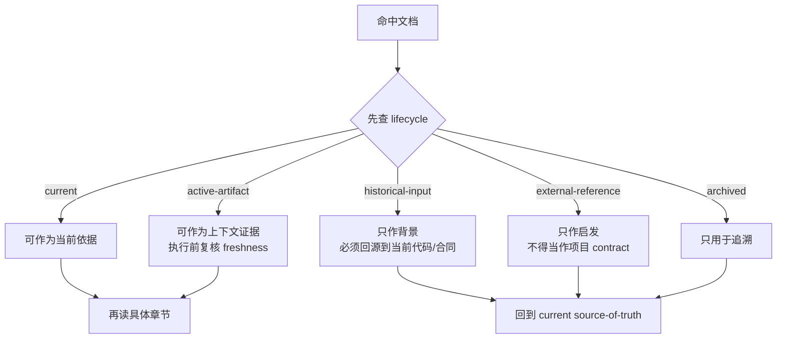
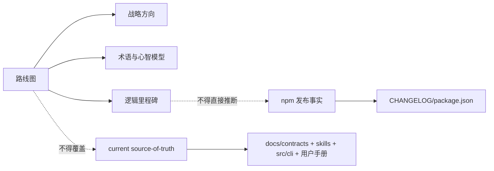
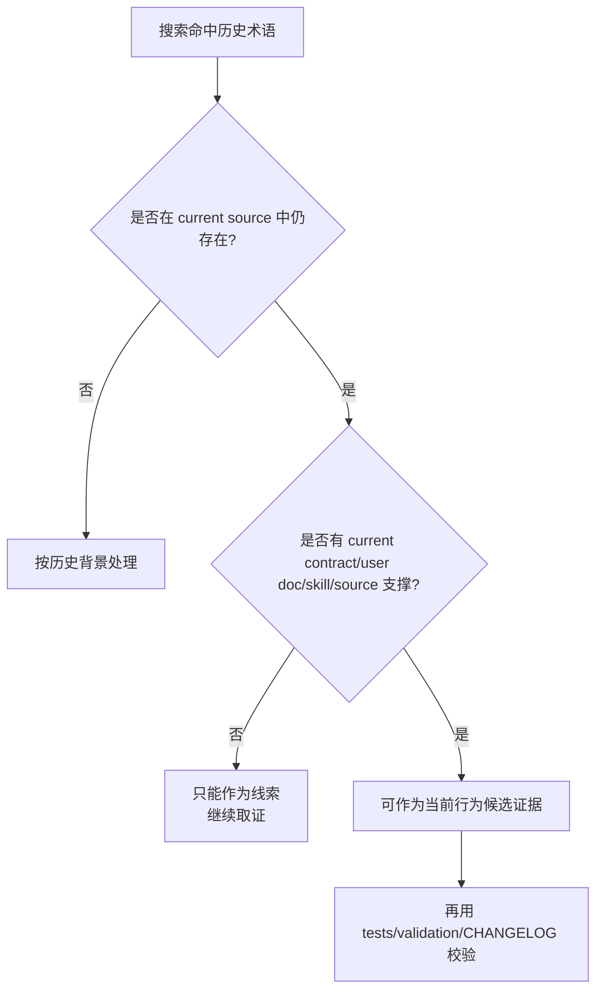
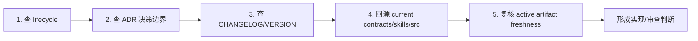

本页位于「深度解析 / 测试、发布与演进」的末尾，目标不是复述所有路线图或历史方案，而是给高级开发者一套**判读规则**：当你在 `docs/00-版本路线/`、`docs/adr/`、`docs/plans/`、`docs/brainstorms/`、`docs/08-版本更新/` 与 `CHANGELOG.md` 之间来回取证时，如何判断哪份材料能约束当前实现，哪份只能作为背景输入。仓库文档索引明确要求：阅读文档时先看 lifecycle 状态，不要仅凭文件日期或目录名判断某份文档是否代表当前 source of truth。Sources: [docs/README.md](docs/README.md#L1-L4)

## 当前页在阅读路径中的位置

如果你刚读完 [发布包内容、版本连续性与网站同步检查](29-fa-bu-bao-nei-rong-ban-ben-lian-xu-xing-yu-wang-zhan-tong-bu-jian-cha)，本页补上的是「演进材料的考古方法」：发布与版本页告诉你当前包如何验证，本页告诉你如何把路线图、ADR、PRD、Plan、历史设计和 Changelog 放进同一个证据优先级模型里。若你需要回到运行时事实边界，应先读 [Source of Truth 与 Generated Runtime 边界](21-source-of-truth-yu-generated-runtime-bian-jie)；若你需要理解契约与质量门，应回看 [Schema、质量门与确定性不变量](26-schema-zhi-liang-men-yu-que-ding-xing-bu-bian-liang)。Sources: [docs/README.md](docs/README.md#L15-L33)

## 第一原则：先判生命周期，再判内容细节

spec-first 的文档体系把材料分成 `current`、`active-artifact`、`historical-input`、`archived` 与 `external-reference`：`current` 可以作为实现、审查和 README 链接依据；`active-artifact` 可以作为近期上下文证据，但执行前仍需验证 freshness；`historical-input` 只能作为背景输入，不能覆盖当前代码和 source-of-truth；`external-reference` 只提供启发，不代表项目 contract。这个生命周期表是阅读路线图和历史方案时的总入口。Sources: [docs/README.md](docs/README.md#L5-L14)

上图的关键不是「历史文档不能读」，而是**历史文档不能单独裁决当前行为**。仓库索引已经把当前 source-of-truth 列为 `docs/05-用户手册/`、`docs/contracts/`、`docs/standards/`、`docs/10-prompt/结构化项目角色契约.md`、`docs/solutions/`、`skills/`、`src/cli/` 等；而 `docs/00-版本路线/`、`docs/01-需求分析/`、`docs/02-架构设计/`、`docs/03-实施方案/`、`docs/06-待办事项/` 与 `docs/08-版本更新/` 均被标为历史输入或历史版本材料。Sources: [docs/README.md](docs/README.md#L17-L45)

## 证据优先级：从当前事实回读历史意图

高级开发者阅读演进材料时，应采用「当前事实 → 决策记录 → 活跃产物 → 历史背景」的顺序，而不是按日期从旧到新线性阅读。`CHANGELOG.md` 明确说明行首 `v版本号` 是 npm 发布版本并与 `package.json` 版本一致，摘要正文中的 `vX.Y` 可能只是父方案路线图里程碑标签，与 npm semver 解耦；这意味着路线图里的版本号不能直接当成已发布事实。Sources: [CHANGELOG.md](CHANGELOG.md#L1-L5)

| 优先级 | 材料类型 | 可用于什么 | 不能用于什么 |
|---:|---|---|---|
| 1 | 当前代码、技能源、合同、用户手册、CHANGELOG | 判断当前实现、入口、契约、发布事实 | 不能替代 owner 明确 ADR 的决策语义 |
| 2 | ADR | 判断已接受的架构方向、边界扩展、非目标 | 不能证明某个实现已经完成 |
| 3 | active PRD / Plan / Validation | 判断一次变更的近期上下文、方案、验证证据 | freshness 未复核前不能直接执行 |
| 4 | historical roadmap / design | 理解演进背景、曾经的取舍、术语来源 | 不能覆盖当前 source-of-truth |
| 5 | external research | 提供启发与对照 | 不能成为项目 contract |

这张表对应仓库已有的分层：`docs/contracts/` 是 schema、quality gate、workflow contract 与 verifier contract 的当前来源；`docs/brainstorms/`、`docs/plans/`、`docs/tasks/` 与 `docs/validation/` 是 active artifact，需要按报告日期和引用代码状态判断有效性；`docs/00-版本路线/` 只作路线背景，当前版本事实以 `CHANGELOG.md` 和 `package.json` 为准。Sources: [docs/README.md](docs/README.md#L19-L32), [docs/README.md](docs/README.md#L36-L45)

## 路线图：读方向，不读承诺

`docs/00-版本路线/版本规划.md` 在文首已经声明自己是 `historical-input`，只作为演进背景；当前能力、入口和 runtime 事实以 `docs/README.md`、根目录 README、用户手册、合同、skills、CLI 源码和 `CHANGELOG.md` 为准。因此，阅读路线图时应把它当作战略意图和术语来源，而不是当前实现清单。Sources: [版本规划.md](docs/00-版本路线/版本规划.md#L1-L4)

路线图中的「AI Coding Harness」定位仍然有解释价值：它把 spec-first 描述为 repo-local、evidence-governed、review-closed 的 AI coding Harness，并把目标从一次性聊天、vibe coding、临时 prompt、单点 agent 执行升级为需求有锚点、上下文有路由、计划有证据、任务可交接、执行有边界、审查有闭环、知识可复用、团队可治理。这个部分适合用来理解项目心智，而不适合直接判断某个功能是否已经落地。Sources: [版本规划.md](docs/00-版本路线/版本规划.md#L5-L30)

路线图还显式把 Milestone 与 npm semver 解耦：M0 到 M9 是逻辑里程碑，避免与已发布 npm v1.x 撞车；M9 Stable Harness 也不等于 npm v1.0，而是预期对应 npm v2.0 GA 的逻辑目标。读到路线图里的 `v1.next-minor`、`v2.0`、M0-M9 时，应先问「这是逻辑阶段还是 npm 发布事实？」Sources: [版本规划.md](docs/00-版本路线/版本规划.md#L91-L119)

上图解释了一个常见误读：路线图可以告诉你「为什么会有某个方向」，但不能告诉你「当前包里是否已经可用」。例如 SCALE Engine 融合路线文档明确标记 `superseded`，并说明本拆分文档不再作为 active 发布管理入口，仅作历史快照；虽然它保留了版本拆分原则、Wave A-D 和准入条件的方向判断，但逐版本明细已被实现期的窄 plan 超越。Sources: [2026-06-03-scale-engine-fusion-version-split.md](docs/00-版本路线/2026-06-03-scale-engine-fusion-version-split.md#L1-L12)

## ADR：读决策、边界与后果

ADR 的阅读重点是三件事：**Decision**、**Boundaries**、**Consequences**。例如团队知识 Git 接入 ADR 说明，它部分扩展 ADR 0001，原因是团队知识仓库首次接入需要联网 clone 并写入 user-global knowledge registry，超出了 ADR 0001 的权限范围，所以必须显式扩展。Sources: [0002-init-team-knowledge-network-access.md](docs/adr/0002-init-team-knowledge-network-access.md#L1-L14)

该 ADR 的决策不是「init 可以随意联网」，而是在两个前提同时满足时才授权：用户在 init 交互流程中明确 opt-in 并输入 Git URL；非交互 `spec-first init -y` 不触发授权，只有显式传入知识参数时才允许。它还通过对比表限定了扩展范围：网络访问从零网络扩展为 opt-in clone 指定 Git URL，user-global 文件从语言偏好扩展到 knowledge registry 与 checkout 路径。Sources: [0002-init-team-knowledge-network-access.md](docs/adr/0002-init-team-knowledge-network-access.md#L15-L29)

更重要的是 ADR 的边界继承：`init -y` 不得默认联网加载知识、token 不得写入持久化文件、本机绝对路径不得写入项目 Git、已知凭据来源限于用户本机 Git 凭据、init 不得在未经用户确认的情况下自动更新或 pull 知识仓库。阅读 ADR 时，如果只读标题和 Decision 而跳过 Boundaries，就会把「受限授权」误读成「默认能力」。Sources: [0002-init-team-knowledge-network-access.md](docs/adr/0002-init-team-knowledge-network-access.md#L30-L39)

另一个 ADR 说明了架构选择如何被锁定：`spec-prd` 保持 workflow 编排加少数选择性 agent dispatch，不整体重构为 agent 架构。它把问题定位为第一次 durable PRD write 前缺少确定性可观测检查点，而不是语义专家不足；因此正解是增加 script 守的确定性写前闸，而不是把每个节点做成常驻 agent。Sources: [0002-spec-prd-stays-workflow-not-agent-collection.md](docs/adr/0002-spec-prd-stays-workflow-not-agent-collection.md#L1-L13)

这个 ADR 的阅读价值在于避免「架构洁癖式重构」：它明确指出问题不是要不要 agent 化，而是哪些节点该 agent 化；把 8 个 workflow 节点变成 8 个 agent 会撞上 agent collection、强状态机、宿主能力重建三条边界。后续动作也被限定为独立 plan，本 ADR 只锁方向，不改代码。Sources: [0002-spec-prd-stays-workflow-not-agent-collection.md](docs/adr/0002-spec-prd-stays-workflow-not-agent-collection.md#L30-L44), [0002-spec-prd-stays-workflow-not-agent-collection.md](docs/adr/0002-spec-prd-stays-workflow-not-agent-collection.md#L55-L68)

## PRD 与 Plan：读本次变更，不读永恒真理

`docs/brainstorms/` 中的 PRD 类文档通常承载一次需求澄清和进入 planning 的 readiness，而不是长期合同。以 Qoder Host Support 需求为例，它的 frontmatter 明确 `status: ready-for-planning`、`evidence_grade: mixed`、`source_authority: mixed`、`readiness_authority: engineering-owned`，并记录 `can_enter_spec_plan: yes`、checker schema、hash 与 blocking count。这类信息告诉你「本需求可以进入计划」，不等价于「实现已经存在且稳定」。Sources: [2026-07-04-001-qoder-host-support-requirements.md](docs/brainstorms/2026-07-04-001-qoder-host-support-requirements.md#L1-L33)

PRD 正文也会区分 confirmed-source 与 external-research：Qoder 文档中，当前支持宿主、Kiro adapter、init 平台选择来自仓库源码；Qoder commands、skills、subagents、MCP、hooks、memory 等能力来自外部官方文档读取。阅读时要保留这个混合证据结构，不能把 external-research 直接升级为本仓已实现行为。Sources: [2026-07-04-001-qoder-host-support-requirements.md](docs/brainstorms/2026-07-04-001-qoder-host-support-requirements.md#L52-L68)

`docs/plans/` 中的计划文档则更接近执行方案，但仍然需要看 `status`、`scope boundaries`、`direct evidence readiness` 和 `limitations`。例如团队规范获取流程优化计划标记为 `status: active`，明确「本计划只写 source 优化方案，不执行实现」，并在 Scope Boundaries 中说明不修改目标 skill、不调整合同、不创建真实 acquisition run、不刷新 generated runtime mirrors。Sources: [2026-07-05-001-refactor-standards-acquisition-flow-plan.md](docs/plans/2026-07-05-001-refactor-standards-acquisition-flow-plan.md#L1-L16), [2026-07-05-001-refactor-standards-acquisition-flow-plan.md](docs/plans/2026-07-05-001-refactor-standards-acquisition-flow-plan.md#L55-L62)

同一计划还记录了 planning-time snapshot、worktree dirty、source reads completed、source reads required 与 limitations，说明实现期必须重新打开拟修改文件，不能只按计划中的旧快照执行。高级开发者读 Plan 时应把它当成「带证据的执行假设」，而不是免复核脚本。Sources: [2026-07-05-001-refactor-standards-acquisition-flow-plan.md](docs/plans/2026-07-05-001-refactor-standards-acquisition-flow-plan.md#L65-L85)

## 版本说明、CHANGELOG 与历史更新目录的差异

正式变更事实优先看 `CHANGELOG.md`，因为它规定条目必须 compact 记录 source surface、用户可见影响、验证或未验证状态和必要 artifact 路径，长推理放到 requirements、plan、review 或 validation 文档。也就是说，Changelog 是发布事实索引，不是完整设计解释。Sources: [CHANGELOG.md](CHANGELOG.md#L1-L5)

`docs/VERSION/` 中的版本说明适合给人读发布摘要。例如 `spec-first@1.12.1` 说明它在保持 CLI 与 runtime 对外行为兼容的前提下，以 PRD 工程化为核心强化规划、执行、代码审查、调试与知识沉淀，并列出需求工作流、write-tasks、核心链路质量、路由触发、可验证性与上手体验等亮点。它适合快速理解一个版本的用户可见变化。Sources: [2026-07-02-1.12.1.md](docs/VERSION/2026-07-02-1.12.1.md#L1-L48)

`docs/08-版本更新/` 则被仓库索引标为 historical-input，正式变更事实以 `CHANGELOG.md` 为准；该目录 README 也自述保留 benchmark / CRG Quality Gate 的历史演进记录，并说明其中一些 benchmark、质量门与旧命令已经退役，不再构成现行操作面或质量门。Sources: [docs/README.md](docs/README.md#L43-L45), [README.md](docs/08-版本更新/README.md#L1-L8)

| 问题 | 首选材料 | 校验方式 |
|---|---|---|
| 某版本到底发布了什么？ | `CHANGELOG.md` | 看行首 npm 版本条目与摘要 |
| 某版本用户侧怎么理解？ | `docs/VERSION/*.md` | 看亮点、升级注意事项 |
| 某个早期能力为什么出现？ | `docs/08-版本更新/`、路线图 | 按 historical-input 读，回源当前实现 |
| 某路线是否仍是 active？ | 路线图 frontmatter / 状态说明 | 查是否 `historical-input`、`superseded` 或被后续 plan 超越 |

这张表的实际用途是防止「历史更新目录漂移」：如果 `docs/08-版本更新/README.md` 说某能力存在，但 `CHANGELOG.md`、当前用户手册、skills 或 `src/cli/` 不再支持，就必须以后者为准。仓库索引已经明确历史版本说明材料不覆盖正式变更事实。Sources: [docs/README.md](docs/README.md#L34-L45)

## 历史方案的安全阅读模式

历史方案最常见的风险是术语复活。仓库索引专门提醒：如果搜索命中 `src/crg`、`spec-first crg`、`graph.db`、`CRG Stage-0`、`ECC` 或旧 bootstrap-compiler 路径，默认先按 `historical-input` 处理，不要直接当作当前实现、CLI 或 graph readiness contract。Sources: [docs/README.md](docs/README.md#L58-L63)

这条规则背后的工程原因是：历史方案往往非常具体，甚至包含目录、命令、数据库和流程图，但具体不等于当前。仓库索引要求先按 lifecycle 表判读搜索命中的历史语境，再回到当前 source-of-truth 列表复核；单篇历史文档即使正文很具体，也不能覆盖当前 source、contract 或 generated runtime 治理规则。Sources: [docs/README.md](docs/README.md#L60-L69)

实际操作中，你可以把历史方案当成「问题索引」而不是「实现说明」。例如早期框架设计文档提出一期仅聚焦 Claude Code CLI、不做多模型协同、通过五步闭环 brainstorm → plan → work → review → compound 串联交付；这些内容能解释 spec-first 的起源，但当前多宿主、runtime 投影、合同治理、质量门等事实必须回到当前文档和源码验证。Sources: [2026-03-29-spec-first-framework-design.md](docs/00-版本路线/2026-03-29-spec-first-framework-design.md#L10-L31), [2026-03-29-spec-first-framework-design.md](docs/00-版本路线/2026-03-29-spec-first-framework-design.md#L115-L128)

## 一个可复制的阅读流程

当你准备基于一份路线图、ADR 或历史方案做实现判断时，先执行五步：第一，查 `docs/README.md` 的 lifecycle；第二，定位是否有 ADR 锁定决策边界；第三，查 `CHANGELOG.md` 与 `docs/VERSION/` 判断发布事实；第四，回源 `docs/contracts/`、`skills/`、`src/cli/` 与用户手册；第五，若来自 PRD/Plan/Validation，则复核 freshness、worktree 状态、source reads required 与 limitations。Sources: [docs/README.md](docs/README.md#L5-L14), [docs/README.md](docs/README.md#L77-L84)

这个流程的判断标准很简单：**没有 current source 支撑的历史结论，只能作为背景；没有 ADR 或合同支撑的架构扩展，只能作为提案；没有 Changelog 或版本说明支撑的发布叙事，只能作为未发布上下文；没有 freshness 复核的 active artifact，只能作为待验证输入。**Sources: [docs/README.md](docs/README.md#L15-L33), [CHANGELOG.md](CHANGELOG.md#L1-L5)

## 下一步阅读建议

如果你要把本页的方法应用到日常开发，建议回到 [贡献流程与变更验证](9-gong-xian-liu-cheng-yu-bian-geng-yan-zheng) 理解提交前验证，再读 [测试体系：单元、集成、烟测与契约测试](27-ce-shi-ti-xi-dan-yuan-ji-cheng-yan-ce-yu-qi-yue-ce-shi) 判断证据是否足够；如果你正在处理 runtime 或宿主差异，优先回看 [Source of Truth 与 Generated Runtime 边界](21-source-of-truth-yu-generated-runtime-bian-jie) 与 [平台适配器与宿主差异封装](19-ping-tai-gua-pei-qi-yu-su-zhu-chai-yi-feng-zhuang)；如果你正在新增或修改工作流能力，则应继续阅读 [Skill 类型、公开入口与内部能力边界](22-skill-lei-xing-gong-kai-ru-kou-yu-nei-bu-neng-li-bian-jie) 与 [Schema、质量门与确定性不变量](26-schema-zhi-liang-men-yu-que-ding-xing-bu-bian-liang)。Sources: [docs/README.md](docs/README.md#L17-L33)