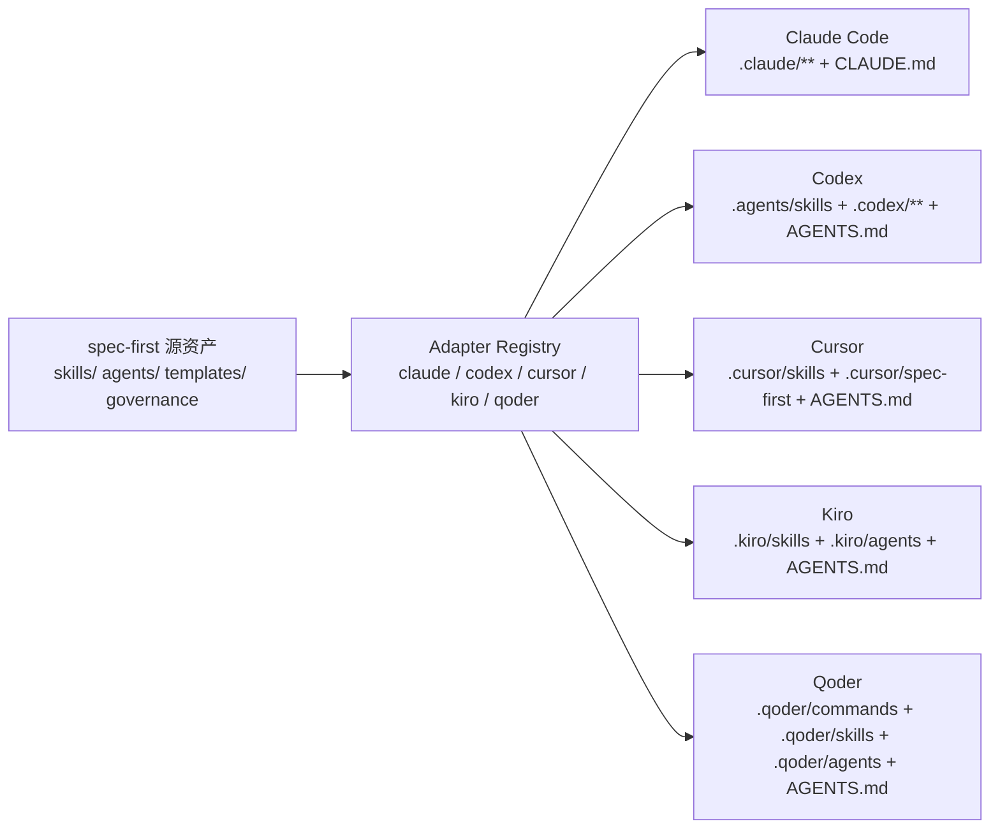

本页位于入门指南的第四篇，目标是帮初学者理解：**spec-first 不是只能运行在一个 AI 编码工具里，而是把同一套 workflow / skill / agent 源资产，按不同宿主的规则生成到 Claude Code、Codex、Cursor、Kiro 与 Qoder 的运行时目录中**。如果你还没安装或初始化，建议先读 [快速开始](2-kuai-su-kai-shi) 与 [首次运行与成功信号](3-shou-ci-yun-xing-yu-cheng-gong-xin-hao)；读完本页后，再进入 [常用入口速查：从需求、计划、执行到审查](5-chang-yong-ru-kou-su-cha-cong-xu-qiu-ji-hua-zhi-xing-dao-shen-cha)。Sources: [adapters/index.js](src/cli/adapters/index.js#L1-L13), [init.js](src/cli/commands/init.js#L77-L113)

## 架构假设：宿主选择本质上是“同源资产的不同投影”

从第一性原理看，宿主选择不是选择五套不同的 spec-first，而是选择把同一批 source assets 投影到哪个 AI 工具能识别的目录结构里。代码中有一个统一的 adapter registry，当前注册了 `claude`、`codex`、`cursor`、`kiro`、`qoder` 五个 adapter；每个 adapter 再声明自己的 runtime root、skills root、agents root、state file 与指令文件等路径。Sources: [adapters/index.js](src/cli/adapters/index.js#L1-L13), [base.js](src/cli/adapters/base.js#L14-L84)



这个图的关键含义是：你通常不应该手改 `.claude/**`、`.codex/**`、`.cursor/**`、`.kiro/**` 或 `.qoder/**` 下的 spec-first 生成文件；应通过 `spec-first init --<host>` 重新生成。runtime capability catalog 也明确说明它是从 `src/cli/plugin.js`、governance、workflow schema、skills 与 agents 派生出来的只读 catalog，不是第二套 truth source。Sources: [runtime-capabilities.md](docs/catalog/runtime-capabilities.md#L1-L15), [plugin.js](src/cli/plugin.js#L25-L35)

## 五个宿主怎么选：先看你的日常入口

如果你主要使用 Claude Code，Claude 是最直接的选择，因为它生成 `spec-*` project commands、workflow skill mirrors、standalone skills 和 agents；如果你使用 Codex，则入口以 skill discovery 为主，workflow 与 standalone skills 安装到 `.agents/skills/`，agents 放在 `.codex/agents/`；如果你在试用 Cursor，它目前是 generated-runtime preview，主要生成 `.cursor/skills/**` 与 `.cursor/spec-first/**`，不生成 agents；如果你在 Kiro 中工作，P0 走 Agent Skills 与 agents；如果你使用 Qoder，它同时生成 project commands、skills、agents 与本地 state。Sources: [runtime-capabilities.md](docs/catalog/runtime-capabilities.md#L25-L31), [runtime-capabilities.md](docs/catalog/runtime-capabilities.md#L90-L118)

| 宿主 | 初学者心智模型 | 主要入口形态 | 生成路径重点 | 适合谁 |
|---|---|---|---|---|
| Claude Code | “我用 `spec-*` 命令启动流程” | commands + skills + agents | `.claude/commands/`、`.claude/spec-first/workflows/`、`.claude/skills/`、`.claude/agents/` | 已在 Claude Code 中开发，想要最直观命令入口的用户 |
| Codex | “我通过 skills 使用 workflow” | skills + agents | `.agents/skills/`、`.codex/agents/`、`.codex/spec-first/` | Codex 用户，或希望入口更偏 skill discovery 的团队 |
| Cursor | “我先试用 Cursor Skills 投影” | skills-only preview | `.cursor/skills/`、`.cursor/spec-first/` | Cursor 用户，但接受当前为 preview、loader 证据降级 |
| Kiro | “我通过 Kiro Agent Skills 使用 spec-first” | skills + agents | `.kiro/skills/`、`.kiro/agents/`、`.kiro/spec-first/` | Kiro 用户，想叠加 spec-first 的跨宿主治理能力 |
| Qoder | “我可以用 Qoder commands，也有 skills / agents” | commands + skills + agents | `.qoder/commands/`、`.qoder/skills/`、`.qoder/agents/`、`.qoder/spec-first/` | Qoder 用户，想要 command 与 skill 两种入口 |

这张表只描述当前仓库能验证的投影形态，不表示五个宿主在真实 IDE / CLI 中完全等价。Cursor 的 catalog 明确标记为 `generated_runtime_preview`，并说明本机尚未确认 Cursor skill discovery / invocation，因此不要把 Cursor 当作默认 full host；Kiro 与 Qoder 的规划文档也把真实宿主 smoke 与 preview 边界作为完成标准的一部分。Sources: [runtime-capabilities.md](docs/catalog/runtime-capabilities.md#L36-L44), [2026-07-03-001-feat-kiro-host-support-plan.md](docs/plans/2026-07-03-001-feat-kiro-host-support-plan.md#L92-L102), [2026-07-04-001-qoder-host-support-requirements.md](docs/brainstorms/2026-07-04-001-qoder-host-support-requirements.md#L143-L159)

## 初始化时怎么选择宿主

`spec-first init` 的交互式选择列表包含五个宿主：Claude Code、Codex、Cursor、Kiro、Qoder；其中 Claude Code 与 Codex 的 `defaultForYes` 为 true，Cursor、Kiro、Qoder 的 `defaultForYes` 为 false。这意味着在没有显式传参时，`-y/--yes` 默认不会自动安装 preview 类宿主；你需要用 `--cursor`、`--kiro` 或 `--qoder` 明确选择它们。Sources: [init.js](src/cli/commands/init.js#L77-L113), [init.js](src/cli/commands/init.js#L421-L430)

```bash
# 默认自动路径：使用默认宿主集合
spec-first init -y

# 明确只初始化 Claude Code
spec-first init --claude -y

# 明确只初始化 Codex
spec-first init --codex -y

# 明确试用 Cursor preview
spec-first init --cursor -y

# 明确试用 Kiro
spec-first init --kiro -y

# 明确试用 Qoder
spec-first init --qoder -y

# 多宿主并存，例如 Claude Code + Qoder
spec-first init --claude --qoder -y
```

命令参数解析并不是写死五段重复逻辑，而是从 `INIT_PLATFORM_CHOICES` 中查找 `--<flag>`，找到后把对应宿主 id 加入初始化平台集合；这也是为什么五个宿主可以用同一套 `spec-first init` 入口选择。Sources: [init.js](src/cli/commands/init.js#L264-L277), [init.js](src/cli/commands/init.js#L356-L376)

## 生成后的目录长什么样

下面是一个“概念化”的项目结构图，用来帮助你识别哪些目录是宿主 runtime，哪些文件是仓库级指令入口。实际生成内容取决于你选择了哪些宿主；例如 Cursor 不生成 agents，Codex 不生成 command files，Qoder 会生成 commands。Sources: [claude.js](src/cli/adapters/claude.js#L48-L82), [codex.js](src/cli/adapters/codex.js#L41-L75), [cursor.js](src/cli/adapters/cursor.js#L59-L97), [kiro.js](src/cli/adapters/kiro.js#L25-L58), [qoder.js](src/cli/adapters/qoder.js#L32-L65)

```text
your-project/
├── CLAUDE.md                     # Claude Code 指令入口
├── AGENTS.md                     # Codex / Cursor / Kiro / Qoder 共享指令入口
├── .claude/
│   ├── commands/                 # Claude Code spec-* commands
│   ├── skills/                   # Claude standalone skills
│   ├── agents/                   # Claude agents
│   └── spec-first/               # Claude managed state / workflow mirrors
├── .agents/
│   └── skills/                   # Codex workflow / standalone skills
├── .codex/
│   ├── agents/                   # Codex agents
│   └── spec-first/               # Codex managed state
├── .cursor/
│   ├── skills/                   # Cursor preview skills
│   └── spec-first/               # Cursor managed state
├── .kiro/
│   ├── skills/                   # Kiro Agent Skills
│   ├── agents/                   # Kiro agents
│   └── spec-first/               # Kiro managed state
└── .qoder/
    ├── commands/                 # Qoder spec-* commands
    ├── skills/                   # Qoder skills
    ├── agents/                   # Qoder agents
    └── spec-first/               # Qoder managed state
```

从代码看，Claude 的 instruction file 是 `CLAUDE.md`，Codex、Cursor、Kiro、Qoder 的 instruction file 都是 `AGENTS.md`；这对初学者很重要，因为它说明“宿主 runtime 文件”和“仓库级行为指令文件”不是一回事。Sources: [claude.js](src/cli/adapters/claude.js#L76-L82), [codex.js](src/cli/adapters/codex.js#L69-L75), [cursor.js](src/cli/adapters/cursor.js#L91-L97), [kiro.js](src/cli/adapters/kiro.js#L53-L58), [qoder.js](src/cli/adapters/qoder.js#L60-L65)

## 宿主差异的核心：commands、skills、agents 是否可用

五个宿主最容易混淆的地方是“入口名字看起来相同，但落地机制不同”。Claude 与 Qoder 都生成 command 文件；Codex、Cursor、Kiro 在当前实现中不把 command files 作为主要交付面，其中 Cursor 还显式 `supportsAgents=false`，表示 P0 preview 不安装 bundled agent profiles。Sources: [base.js](src/cli/adapters/base.js#L35-L48), [cursor.js](src/cli/adapters/cursor.js#L67-L89), [qoder.js](src/cli/adapters/qoder.js#L40-L58)

| 能力面 | Claude Code | Codex | Cursor | Kiro | Qoder |
|---|---:|---:|---:|---:|---:|
| 生成 command entrypoints | 是 | 否 | 否 | 否 | 是 |
| 生成 workflow / standalone skills | 是 | 是 | 是 | 是 | 是 |
| 生成 agents | 是 | 是 | 否 | 是 | 是 |
| managed state | `.claude/spec-first/state.json` | `.codex/spec-first/state.json` | `.cursor/spec-first/state.json` | `.kiro/spec-first/state.json` | `.qoder/spec-first/state.json` |
| 仓库级指令文件 | `CLAUDE.md` | `AGENTS.md` | `AGENTS.md` | `AGENTS.md` | `AGENTS.md` |

你可以把这个差异理解成“同一套工作流，有的宿主通过命令发现，有的宿主通过技能发现，有的宿主还支持投影 agent”。因此，当文档或同事说“运行 `spec-plan`”时，在 Claude / Qoder 中更像使用 command，在 Codex / Cursor / Kiro 中更像调用 skill；下一篇 [常用入口速查：从需求、计划、执行到审查](5-chang-yong-ru-kou-su-cha-cong-xu-qiu-ji-hua-zhi-xing-dao-shen-cha) 会继续解释这些 workflow 入口。Sources: [runtime-capabilities.md](docs/catalog/runtime-capabilities.md#L46-L69), [runtime-capabilities.md](docs/catalog/runtime-capabilities.md#L90-L118)

## 如何检查当前项目装了哪些宿主

`spec-first doctor` 支持 `--claude`、`--codex`、`--cursor`、`--kiro`、`--qoder` 与 `--json`。不带宿主参数时，它会自动检测当前项目中已初始化的 runtime；如果完全没有检测到，会提示运行 `spec-first init` 并选择 Claude Code、Codex、Cursor、Kiro 或 Qoder。Sources: [doctor.js](src/cli/commands/doctor.js#L28-L65), [doctor.js](src/cli/commands/doctor.js#L1134-L1167)

```bash
# 自动检测当前项目已初始化的宿主
spec-first doctor

# 只检查 Claude Code
spec-first doctor --claude

# 只检查 Cursor preview runtime
spec-first doctor --cursor

# 输出 JSON，适合复制给同事或 CI 诊断
spec-first doctor --qoder --json
```

doctor 的检查分成公共检查与平台特定检查：公共检查包含 Node.js、Git 等基础条件；平台检查会检查对应宿主 CLI、managed state、skills、agents、commands 与 runtime drift。对初学者来说，最实用的判断是：如果 doctor 输出 `WARNING`，通常表示某些 runtime 文件缺失或漂移，可以重新执行对应宿主的 `spec-first init --<host>`。Sources: [doctor.js](src/cli/commands/doctor.js#L75-L103), [doctor.js](src/cli/commands/doctor.js#L148-L200), [doctor.js](src/cli/commands/doctor.js#L220-L303)

## 自动检测为什么对 Cursor、Kiro、Qoder 更谨慎

Claude 与 Codex 的检测可以看 runtime root 是否存在；但 Cursor、Kiro、Qoder 更容易和宿主原生文件混在一起，所以检测策略更谨慎。当前代码对 Qoder 和 Cursor 要求看到 spec-first 的 state file 才算安装态；Kiro 则检查 state、skills 或 agents 中任一 runtime path 是否存在。Sources: [doctor.js](src/cli/commands/doctor.js#L1105-L1132)

这避免了一个常见误判：你的项目可能本来就有 `.cursor/**`、`.kiro/**` 或 `.qoder/**` 原生配置，但那不等于 spec-first 已经接管这些目录。Qoder 的需求文档也明确要求 doctor 不得因为仅存在 `.qoder/rules/**`、user-owned settings 或其他 Qoder native files 就误判 runtime installed。Sources: [doctor.js](src/cli/commands/doctor.js#L1112-L1132), [2026-07-04-001-qoder-host-support-requirements.md](docs/brainstorms/2026-07-04-001-qoder-host-support-requirements.md#L151-L158)

## 推荐选择路径

如果你是第一次使用 spec-first，并且已经在 Claude Code 或 Codex 中工作，建议优先选择你当前最常用的宿主；如果你只是想快速跑通默认路径，可以使用 `spec-first init -y`，因为默认 yes 路径会选择 `defaultForYes=true` 的宿主集合，而 Cursor、Kiro、Qoder 不会被默认安装。Sources: [init.js](src/cli/commands/init.js#L77-L113), [init.js](src/cli/commands/init.js#L421-L430)

如果你正在评估 Cursor、Kiro 或 Qoder，请把它们当成显式 opt-in 的宿主：使用 `spec-first init --cursor -y`、`spec-first init --kiro -y` 或 `spec-first init --qoder -y`，随后立即运行对应的 `spec-first doctor --cursor`、`spec-first doctor --kiro` 或 `spec-first doctor --qoder`。Cursor 的 runtime catalog 已明确写出当前是 generated-runtime preview，不应进入 `init -y` defaults 或 full host support wording。Sources: [runtime-capabilities.md](docs/catalog/runtime-capabilities.md#L36-L44), [doctor.js](src/cli/commands/doctor.js#L37-L39)

如果你在团队里需要多宿主并存，可以一次初始化多个宿主，例如 `spec-first init --claude --codex --qoder -y`。代码的初始化流程会把平台集合传入每个 project init plan，再由对应 adapter 生成各自 runtime；这比手动复制目录更可靠，也能让 doctor 后续识别 managed state 与 drift。Sources: [init.js](src/cli/commands/init.js#L188-L195), [init.js](src/cli/commands/init.js#L872-L904)

## 常见误区

误区一：看到 `.cursor/`、`.kiro/` 或 `.qoder/` 就以为 spec-first 已安装。正确理解是：只有 spec-first managed state 或对应 generated runtime 存在时，才应认为该宿主被 spec-first 初始化；doctor 对 Cursor 与 Qoder 也采用 state file 检测来降低误报。Sources: [doctor.js](src/cli/commands/doctor.js#L1112-L1123), [cursor.js](src/cli/adapters/cursor.js#L91-L97), [qoder.js](src/cli/adapters/qoder.js#L60-L65)

误区二：认为五个宿主的入口完全一样。正确理解是：workflow 名字可以一致，但宿主入口面不同；Claude / Qoder 有 command projection，Codex / Cursor / Kiro 主要是 skill projection，Cursor 当前还不投影 agents。Sources: [runtime-capabilities.md](docs/catalog/runtime-capabilities.md#L48-L69), [cursor.js](src/cli/adapters/cursor.js#L67-L89)

误区三：手动编辑 generated runtime 修复问题。正确做法是修改 source assets 或配置，然后重新运行 `spec-first init --<host>`；runtime capability catalog 明确说它由 source 与 governance 派生，generated mirrors 是可重建输出。Sources: [runtime-capabilities.md](docs/catalog/runtime-capabilities.md#L1-L15), [runtime-capabilities.md](docs/catalog/runtime-capabilities.md#L119-L123)

## 下一步阅读

如果你还没有完成初始化，请回到 [快速开始](2-kuai-su-kai-shi)；如果你已经初始化并想确认是否成功，请读 [首次运行与成功信号](3-shou-ci-yun-xing-yu-cheng-gong-xin-hao)；如果你已经选好宿主，下一步应读 [常用入口速查：从需求、计划、执行到审查](5-chang-yong-ru-kou-su-cha-cong-xu-qiu-ji-hua-zhi-xing-dao-shen-cha)，了解 `spec-prd`、`spec-plan`、`spec-work`、`spec-code-review` 等入口在日常开发中的位置。Sources: [runtime-capabilities.md](docs/catalog/runtime-capabilities.md#L46-L69)

如果你关心生成文件能否提交、哪些目录是 runtime、哪些目录是源文件，请继续读 [产物目录与提交边界](6-chan-wu-mu-lu-yu-ti-jiao-bian-jie)；如果你要维护本地安装或修复 runtime drift，请读 [日常维护命令：doctor、init、update、clean](8-ri-chang-wei-hu-ming-ling-doctor-init-update-clean)。Sources: [runtime-capabilities.md](docs/catalog/runtime-capabilities.md#L90-L123), [doctor.js](src/cli/commands/doctor.js#L1080-L1098)