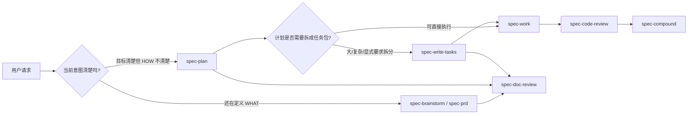
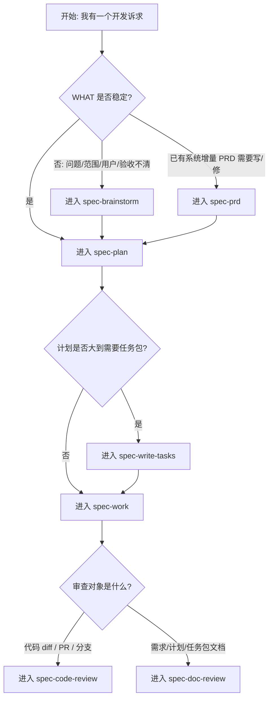

本页是你在目录中的第 5 页，位于「入门指南」里的「[常用入口速查：从需求、计划、执行到审查](5-chang-yong-ru-kou-su-cha-cong-xu-qiu-ji-hua-zhi-xing-dao-shen-cha)」。它只解决一个问题：当你面对一个开发请求时，应该从哪个 `spec-*` 入口开始，而不是把所有工作都塞进同一个流程。`using-spec-first` 是入口治理器：它会在较大的工作、用户询问下一步、或者需要决定 workflow 时使用；它的输出要么是一个公共 workflow 入口，要么是只读的下一步建议，要么是不进入 workflow 的直接回答。Sources: [SKILL.md](skills/using-spec-first/SKILL.md#L15-L26)

## 架构假设：入口不是命令菜单，而是意图路由

本页的工作假设是：spec-first 的常用入口形成一条从「定义要做什么」到「规划怎么做」再到「执行、审查、沉淀」的链路；真正的入口选择不靠关键词，而靠用户当前意图。源码中的路由规则明确要求使用决策树，优先处理显式路由、修复/诊断/审查/定义/优化/执行/知识等意图，并且不要自动串联多个 workflow，除非当前 workflow 明确定义了交接边界。Sources: [SKILL.md](skills/using-spec-first/SKILL.md#L108-L132)



上图要读成「常见路径」，不是强制流水线：`spec-brainstorm` 负责在行为、范围、用户、成功标准或交接上下文还不清楚时澄清 WHAT；`spec-prd` 负责已有系统增量的 PRD 级需求；`spec-plan` 把清楚的目标转成 HOW 计划；`spec-write-tasks` 是 plan 与 work 之间可选的派生层；`spec-work` 执行已经明确的计划、任务包或具体实现请求；`spec-code-review` 审查代码 diff/PR/分支实现；`spec-doc-review` 审查需求、计划、任务包等文档。Sources: [SKILL.md](skills/spec-brainstorm/SKILL.md#L9-L37), [SKILL.md](skills/spec-prd/SKILL.md#L8-L18), [SKILL.md](skills/spec-plan/SKILL.md#L8-L18), [SKILL.md](skills/spec-write-tasks/SKILL.md#L6-L15), [SKILL.md](skills/spec-work/SKILL.md#L11-L19), [SKILL.md](skills/spec-code-review/SKILL.md#L11-L19), [SKILL.md](skills/spec-doc-review/SKILL.md#L11-L19)

## 一张表选入口

如果你是新手，先不要记住所有流程细节，只需要把「我现在要 AI 帮我做什么」映射到下面的入口。`using-spec-first` 的路由表把常见意图映射到统一的 `spec-*` 入口，例如环境设置到 `spec-mcp-setup`、故障诊断到 `spec-debug`、代码审查到 `spec-code-review`、文档审查到 `spec-doc-review`、PRD 到 `spec-prd`、计划到 `spec-plan`、任务拆分到 `spec-write-tasks`、执行到 `spec-work`、知识沉淀到 `spec-compound`。Sources: [SKILL.md](skills/using-spec-first/SKILL.md#L146-L174)

| 你现在的情况 | 推荐入口 | 为什么 |
| --- | --- | --- |
| 还不知道功能边界、用户、成功标准，计划会被迫编造 WHAT | `spec-brainstorm` | 用于已选定问题/功能但行为、范围、用户、成功标准未定的场景 |
| 已有系统里要写、修订或验证 PRD 级需求 | `spec-prd` | 用于 brownfield 增量 PRD、已有 PRD 优化、代码感知的 PRD readiness |
| 目标清楚，但不知道怎么实现 | `spec-plan` | 把清楚目标、需求文档、bug 或项目转为 HOW 计划 |
| 已有计划，但太大、太复杂，想拆成可执行任务 | `spec-write-tasks` | 可选地把 settled plan 编译成派生任务包，或验证已有任务包 |
| 已有计划、任务包或非常明确的实现请求 | `spec-work` | 在当前仓库范围内执行已确定的实现工作 |
| 已完成代码改动，需要审查 diff、PR 或分支质量 | `spec-code-review` | 审查代码变更、合并发现、给出风险和可处理 findings |
| 要审查需求、计划、任务包或 Markdown 规划文档 | `spec-doc-review` | 审查文档一致性、可行性、范围、风险和下游 readiness |
| 做完一件事，想沉淀为可复用经验 | `spec-compound` | 路由表把已解决问题或工作后的知识沉淀交给 compound |

Sources: [SKILL.md](skills/spec-brainstorm/SKILL.md#L13-L37), [SKILL.md](skills/spec-prd/SKILL.md#L22-L55), [SKILL.md](skills/spec-plan/SKILL.md#L28-L60), [SKILL.md](skills/spec-write-tasks/SKILL.md#L16-L48), [SKILL.md](skills/spec-work/SKILL.md#L15-L47), [SKILL.md](skills/spec-code-review/SKILL.md#L11-L43), [SKILL.md](skills/spec-doc-review/SKILL.md#L11-L43), [SKILL.md](skills/using-spec-first/SKILL.md#L168-L169)

## 最常见主链路：需求 → 计划 → 任务 → 执行 → 审查

常规开发可以理解为一条主链路：先用 `spec-brainstorm` 或 `spec-prd` 稳住 WHAT，再用 `spec-plan` 设计 HOW，必要时用 `spec-write-tasks` 拆成任务包，然后用 `spec-work` 实施，最后用 `spec-code-review` 或 `spec-doc-review` 审查。这里的关键边界是：`spec-plan` 明确说 `spec-brainstorm` 定义 WHAT、`spec-plan` 定义 HOW、`spec-work` 执行计划；`spec-write-tasks` 也明确自己只是 plan 与 work 之间的可选派生层，不执行代码。Sources: [SKILL.md](skills/spec-plan/SKILL.md#L14-L23), [SKILL.md](skills/spec-write-tasks/SKILL.md#L6-L15)



这个流程的「停顿点」很重要：`spec-plan` 在计划完成后必须展示 handoff 菜单并等待用户明确选择，不能自动继续进入 `spec-work`、任务编译、issue 创建或代码编辑；`using-spec-first` 也要求不要自动串联多个 workflow，除非当前 workflow 自己定义了交接。Sources: [SKILL.md](skills/spec-plan/SKILL.md#L20-L27), [SKILL.md](skills/using-spec-first/SKILL.md#L131-L132)

## 需求入口：`spec-brainstorm` 与 `spec-prd` 怎么选

当你还在回答「到底要做什么」时，优先考虑需求入口。`spec-brainstorm` 适用于已经有一个用户框定的问题、功能或改进，但行为、范围、用户、成功标准或规划交接上下文还没定清楚的情况；它的产物通常是 `docs/brainstorms/` 下的需求文档或简要对齐总结。Sources: [SKILL.md](skills/spec-brainstorm/SKILL.md#L9-L37)

`spec-prd` 更适合已有系统中的增量需求：它把粗糙产品说明、低质量 PRD 或已有系统增量转成标准、持久的 PRD 需求产物，并且强调先做 source-first 的需求澄清，再写 WHAT/WHY、当前状态证据、验收、边界、假设和未解问题；默认产物是 `docs/brainstorms/*-requirements.md`，并且不得创建 `docs/prds/`、不得实现代码、不得写实现计划。Sources: [SKILL.md](skills/spec-prd/SKILL.md#L8-L20)

| 判断问题 | 选 `spec-brainstorm` | 选 `spec-prd` |
| --- | --- | --- |
| 是否已有明确系统表面？ | 不一定，重点是选定问题/功能还未澄清 | 是，面向 existing system increment |
| 主要产物 | 需求文档或对齐总结 | PRD-grade requirements artifact |
| 主要风险 | planning 会编造 WHAT | PRD readiness 不足会迫使 planning 编造 WHAT |
| 不该做什么 | 不做执行、debug、review、setup | 不做 0-1 探索、实现计划、任务执行、debug |

Sources: [SKILL.md](skills/spec-brainstorm/SKILL.md#L15-L31), [SKILL.md](skills/spec-prd/SKILL.md#L24-L47)

## 计划入口：`spec-plan` 只回答 HOW，不直接动手

当你已经知道要达成什么结果，但还需要设计实现方案时，使用 `spec-plan`。它的职责是把清楚的目标、需求文档、bug、项目或已有计划转成有证据基础的 HOW 计划，同时保持 planning-only 边界，并在执行前明确交接。Sources: [SKILL.md](skills/spec-plan/SKILL.md#L8-L18)

`spec-plan` 的安全边界对新手尤其重要：在交接前，它只能研究、决策、写或更新计划产物，不应该修改代码、配置、运行时 source，也不应该声称已经开始实现；计划写完并审查后，它必须等待用户明确选择下一步。Sources: [SKILL.md](skills/spec-plan/SKILL.md#L20-L27)

一个合格计划至少应该让实现者不用再让计划「替自己写代码」就能开工：它需要问题框架、范围边界、需求追踪、仓库相对路径、测试路径、决策与理由、现有模式、复用/扩展/新建判断、风险、依赖和顺序。Sources: [SKILL.md](skills/spec-plan/SKILL.md#L106-L120)

## 任务入口：`spec-write-tasks` 是可选层，不是必经步骤

如果计划很小，通常可以直接进入 `spec-work`；如果计划很大、依赖多、上下文负担重，或者用户明确要求「拆成任务」，再用 `spec-write-tasks`。这个 workflow 的定位是把 settled local source plan 编译成派生任务包，或者验证已有任务包；它不会执行代码，也不会替代 source plan。Sources: [SKILL.md](skills/spec-write-tasks/SKILL.md#L6-L15)

`spec-write-tasks` 的核心规则是：`spec-plan` 永远是单一事实来源；任务包可以重排执行切片，但不能改变范围、验收标准、非目标、仓库归属或产品决策；任务包不是进度状态、审批状态、生命周期数据库或第二份计划。Sources: [SKILL.md](skills/spec-write-tasks/SKILL.md#L56-L65)

| 任务拆分结果 | 含义 | 下一步 |
| --- | --- | --- |
| `compile` | 计划可拆，任务包能降低执行风险或上下文负担 | 生成 `docs/tasks/` 下任务包 |
| `skip` | 直接 `spec-work` 更便宜、更安全 | 不创建任务包 |
| `return-to-plan` | 范围、验收、架构、验证或 repo ownership 未解决 | 回到 `spec-plan` |
| `validate-only` | 检查已有任务包是否还能执行 | 通过后再交给 `spec-work` |

Sources: [SKILL.md](skills/spec-write-tasks/SKILL.md#L75-L83), [SKILL.md](skills/spec-write-tasks/SKILL.md#L102-L116)

## 执行入口：`spec-work` 只执行已经稳定的范围

当你有 validated task pack、settled plan、spec path，或者非常明确的实现请求时，使用 `spec-work`。它会在当前仓库范围内系统执行工作，保持 source plan/task 边界，遵循现有模式，并用证据完成验证；如果 WHAT/HOW 不清楚，它应该退回到规划，而不是悄悄扩大范围。Sources: [SKILL.md](skills/spec-work/SKILL.md#L11-L23)

`spec-work` 的输出不是一份「我努力过」的叙述，而是可检查的工程结果：代码/文档/配置变更、聚焦验证结果、审查或残留状态，以及包含 changed files、checks run、artifacts 和 required next action 的完成响应。Sources: [SKILL.md](skills/spec-work/SKILL.md#L25-L43)

执行时的一个好习惯是先建立最小反馈回路，例如 characterization test、CLI 调用、HTTP/browser 脚本、trace replay、schema validation 或其他能观察当前切片的命令；然后尽量按 vertical tracer bullet 完成一个行为的实现、验证和必要交接，再扩大到下一个行为。Sources: [SKILL.md](skills/spec-work/SKILL.md#L77-L82)

## 审查入口：代码审查与文档审查分开

如果审查对象是代码 diff、PR 或分支实现，使用 `spec-code-review`。它用于 PR 前、实现完成后或任何需要结构化审查的代码 diff，输出包含 severity、confidence、evidence、autofix_class、owner routing、residual status、test gaps 和 Coverage 的合并 findings 报告。Sources: [SKILL.md](skills/spec-code-review/SKILL.md#L11-L43)

如果审查对象是需求、计划、任务包或 Markdown 规划文档，使用 `spec-doc-review`。它审查的是文档的一致性、可行性、范围、风险和下游执行 readiness，不应该用来做代码 diff 审查，也不应该把实现修复当成文档审查的一部分。Sources: [SKILL.md](skills/spec-doc-review/SKILL.md#L11-L43)

| 审查入口 | 审查对象 | 不适合 |
| --- | --- | --- |
| `spec-code-review` | 当前分支 diff、PR URL/编号、目标分支、base ref、实现相关上下文 | 需求/计划/任务包文档审查、实现执行、创建 commit/push/PR |
| `spec-doc-review` | requirements、plan、task-pack 文档路径，或 headless 模式下的文档路径 | 代码 diff 审查、实现修复、PR merge-readiness 代码审查 |

Sources: [SKILL.md](skills/spec-code-review/SKILL.md#L21-L39), [SKILL.md](skills/spec-doc-review/SKILL.md#L21-L39)

## 视觉化目录：常用入口对应的产物位置

从产物角度看，需求类工作通常进入 `docs/brainstorms/`，计划进入 `docs/plans/`，任务包进入 `docs/tasks/`，执行工作的权威证据主要是 repo diff、测试/检查结果、commit/PR 或残留 review 文档；代码审查的 session-scoped artifacts 位于 OS temp 目录，只有被 workflow 明确路由时才会产生 durable repo-local evidence。Sources: [SKILL.md](skills/spec-prd/SKILL.md#L18-L20), [SKILL.md](skills/spec-plan/SKILL.md#L46-L49), [SKILL.md](skills/spec-write-tasks/SKILL.md#L34-L37), [SKILL.md](skills/spec-work/SKILL.md#L33-L35), [SKILL.md](skills/spec-code-review/SKILL.md#L29-L31)

```text
docs/
├── brainstorms/       # spec-brainstorm / spec-prd 的需求与 PRD-grade requirements
├── plans/             # spec-plan 的 HOW 计划
├── tasks/             # spec-write-tasks 的派生任务包
└── solutions/         # spec-compound / spec-compound-refresh 相关的可复用知识

repo diff / tests / PR # spec-work 与 spec-code-review 的主要工程证据
```

这棵树只是新手速查图，不代表所有 workflow 都一定会写文件：`using-spec-first` 自身明确不创建 plans、task packs、review reports、setup reports、runtime assets 或 durable knowledge；`spec-plan` 对非软件 answer-seeking 任务也可能只在聊天中回答而不写计划文件。Sources: [SKILL.md](skills/using-spec-first/SKILL.md#L17-L25), [SKILL.md](skills/spec-plan/SKILL.md#L42-L49)

## 入口选择的三个反例

第一，不要因为看到「需求」二字就自动进入 `spec-brainstorm`：如果是已有系统增量 PRD 的 authoring、refinement 或 code-aware validation，路由表明确指向 `spec-prd`；如果只是独立审查一份 requirements、plan、task 或 Markdown artifact，则 tie-break 规则指向 `spec-doc-review`。Sources: [SKILL.md](skills/using-spec-first/SKILL.md#L133-L134), [SKILL.md](skills/using-spec-first/SKILL.md#L160-L163)

第二，不要在 `spec-plan` 里偷偷开始实现：`spec-plan` 的 Plan-Only Safety Contract 要求在 handoff 前只做计划相关工作，不能修改代码或配置，不能运行实现 workflow，也不能说实现已经开始。Sources: [SKILL.md](skills/spec-plan/SKILL.md#L20-L27)

第三，不要把任务包当成第二份计划或审批系统：`spec-write-tasks` 明确说任务包不能改变 plan 的范围、验收标准、非目标、repo ownership 或产品决策，也不是 progress state、approval state、lifecycle database 或 second plan。Sources: [SKILL.md](skills/spec-write-tasks/SKILL.md#L56-L65)

## 你可以直接这样问

如果你不知道下一步该跑什么，可以只请求建议，而不是启动 workflow。`using-spec-first` 有 User Next-Step Guide Mode：它是只读模式，只推荐一个最佳公共 workflow 入口、一个具体理由和一个下一步动作，不创建 brainstorm、plan、task、review、solution 或 runtime artifacts。Sources: [SKILL.md](skills/using-spec-first/SKILL.md#L88-L103)

```text
我现在有一个功能想法，但范围还不清楚，请推荐 spec-first 下一步入口。
```

```text
我已经有 docs/plans/xxx-plan.md，请判断是直接 spec-work，还是先 spec-write-tasks。
```

```text
我刚完成一组代码改动，请用 spec-code-review 审查当前分支。
```

这些问法分别对应「只要下一步建议」「计划到执行前的任务拆分判断」「实现后的代码审查」。显式命名当前公共 workflow 时，`using-spec-first` 会优先尊重显式路由，除非该路由明显不可能或不安全；如果只是问下一步，它会保持 guide mode，不会替你直接启动 workflow。Sources: [SKILL.md](skills/using-spec-first/SKILL.md#L76-L87), [SKILL.md](skills/using-spec-first/SKILL.md#L112-L119)

## 推荐阅读顺序

读完本页后，如果你还没安装和初始化，回到上一层基础页面补齐运行条件：先读 [快速开始](2-kuai-su-kai-shi) 和 [首次运行与成功信号](3-shou-ci-yun-xing-yu-cheng-gong-xin-hao)，再根据宿主选择读 [选择你的宿主：Claude Code、Codex、Cursor、Kiro 与 Qoder](4-xuan-ze-ni-de-su-zhu-claude-code-codex-cursor-kiro-yu-qoder)。Sources: [SKILL.md](skills/using-spec-first/SKILL.md#L50-L59)

如果你已经知道入口，但想理解产物会放在哪里，下一页应读 [产物目录与提交边界](6-chan-wu-mu-lu-yu-ti-jiao-bian-jie)；如果你想理解完整主链路背后的理念，继续读深度解析里的 [工作流主链路：Spec、Plan、Tasks、Code、Review、Knowledge](11-gong-zuo-liu-zhu-lian-lu-spec-plan-tasks-code-review-knowledge)。Sources: [SKILL.md](skills/spec-prd/SKILL.md#L18-L20), [SKILL.md](skills/spec-plan/SKILL.md#L46-L49), [SKILL.md](skills/spec-write-tasks/SKILL.md#L34-L37), [SKILL.md](skills/spec-work/SKILL.md#L33-L35)

如果你经常纠结「到底要不要进入 workflow」，下一步读 [路由治理：何时进入 workflow，何时直接回答](12-lu-you-zhi-li-he-shi-jin-ru-workflow-he-shi-zhi-jie-hui-da)；如果你主要卡在需求质量，读 [需求澄清与 PRD 质量闭环](13-xu-qiu-cheng-qing-yu-prd-zhi-liang-bi-huan)；如果你主要卡在计划到执行交接，读 [计划、任务包与执行交接契约](14-ji-hua-ren-wu-bao-yu-zhi-xing-jiao-jie-qi-yue)。Sources: [SKILL.md](skills/using-spec-first/SKILL.md#L108-L132), [SKILL.md](skills/spec-prd/SKILL.md#L89-L114), [SKILL.md](skills/spec-write-tasks/SKILL.md#L102-L116)