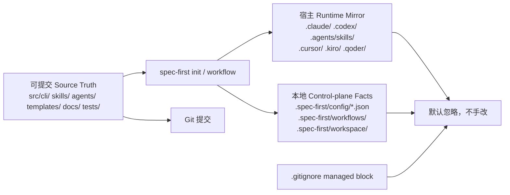

本页位于入门指南的第 6 篇：[产物目录与提交边界](6-chan-wu-mu-lu-yu-ti-jiao-bian-jie)。它回答一个新手最容易混淆的问题：**哪些文件是团队应该提交的长期资产，哪些只是本机或宿主可重建的运行时产物**。架构假设是：spec-first 把“协作知识”和“源码真相”放在可提交路径，把宿主运行时、副本、临时事实和本地索引放在默认忽略路径；代码和文档均验证了这一边界。Sources: [10-产物目录.md](docs/05-用户手册/10-产物目录.md#L3-L11), [12-gitignore参考.md](docs/05-用户手册/12-gitignore参考.md#L7-L18)

## 一句话原则

你可以先记住这条规则：**`docs/`、`src/cli/`、`skills/`、`agents/`、`templates/`、`tests/` 是长期资产；`.claude/`、`.codex/`、`.agents/skills/`、`.cursor/skills/`、`.kiro/skills/`、`.qoder/skills/`、`.spec-first/workspace/`、`.spec-first/workflows/` 多数是可重建或本地事实，默认不要提交**。官方手册明确把 CLI、skill、agent、template 作为 source truth，把多宿主 runtime 和 `.spec-first/` control-plane facts 作为非 source truth。Sources: [10-产物目录.md](docs/05-用户手册/10-产物目录.md#L5-L11), [12-gitignore参考.md](docs/05-用户手册/12-gitignore参考.md#L184-L204)

## 总览图：从 Source Truth 到本地 Runtime

下面这张图用来建立直觉：左侧是你和团队长期维护的内容，中间是 `spec-first init` 或 workflow 生成的内容，右侧是 Git 提交边界。读图时只需关注箭头含义：**source truth 可以生成 runtime，但 runtime 不反向成为 source truth**。Sources: [10-产物目录.md](docs/05-用户手册/10-产物目录.md#L38-L61), [src/cli/commands/init.js](src/cli/commands/init.js#L2628-L2673)



这张图对应代码中的实际机制：`init` 会构建 runtime 同步计划、写入 `.gitignore` managed block，并规划把已误提交的 managed runtime 从 Git index 中移除；这些行为都围绕同一个边界展开。Sources: [src/cli/commands/init.js](src/cli/commands/init.js#L2628-L2690), [src/cli/runtime-untrack.js](src/cli/runtime-untrack.js#L9-L40)

## 常见目录该不该提交

| 路径 | 新手判断 | 通常是否提交 | 原因 |
| --- | --- | --- | --- |
| `docs/brainstorms/`、`docs/plans/`、`docs/tasks/`、`docs/solutions/` | 工作流文档与长期知识 | 通常提交 | 记录需求、计划、任务交接和可复用经验 |
| `src/cli/` | CLI 源码真相 | 提交 | 命令行为、契约校验和运行逻辑来自这里 |
| `skills/` | Skill 源码真相 | 提交 | runtime skill 是从这里同步出去的副本 |
| `agents/` | Agent 源码真相 | 提交 | runtime agent 是从这里同步出去的副本 |
| `templates/` | 宿主文件生成模板 | 提交 | init 和 runtime 生成依赖这里 |
| `tests/` | 回归与契约测试 | 提交 | 用于保护边界和行为不漂移 |
| `.claude/skills/`、`.claude/agents/`、`.claude/spec-first/` | Claude Code runtime | 默认不提交 | `spec-first init` 可重建 |
| `.codex/`、`.agents/skills/` | Codex runtime 与 skill mirror | 默认不提交 | 本地宿主运行时或可重建副本 |
| `.cursor/skills/`、`.cursor/spec-first/`、`.cursor/mcp.json` | Cursor runtime / MCP 输出 | 默认不提交 | spec-first 管理的 preview runtime 与本地配置 |
| `.kiro/skills/`、`.kiro/agents/`、`.kiro/spec-first/`、`.kiro/settings/` | Kiro runtime / MCP 配置 | 默认不提交 | init 或 setup 可重建 |
| `.qoder/commands/spec-*.md`、`.qoder/skills/`、`.qoder/agents/`、`.qoder/spec-first/` | Qoder runtime | 默认不提交 | init 可重建 |
| `.spec-first/config/*.json`、`.spec-first/workflows/`、`.spec-first/workspace/` | 本地 setup / workflow facts | 默认不提交 | 回答“当前机器事实是什么”，不是长期知识 |
| `.codegraph/`、`graphify-out/` | provider 本地索引或图谱运行目录 | 默认不提交 | 可重建或按团队策略另行决定 |

Sources: [10-产物目录.md](docs/05-用户手册/10-产物目录.md#L13-L24), [10-产物目录.md](docs/05-用户手册/10-产物目录.md#L38-L61), [12-gitignore参考.md](docs/05-用户手册/12-gitignore参考.md#L161-L204)

## 视觉化目录结构

下面是执行 `spec-first init` 之后，新手最常看到的目录形态。重点不是背路径，而是区分三类：**可提交入口文档**、**可重建 runtime**、**本地事实与索引**。Sources: [12-gitignore参考.md](docs/05-用户手册/12-gitignore参考.md#L84-L159)

```text
<repo>/
  AGENTS.md                         # Codex 入口文档，可提交
  CLAUDE.md                         # Claude Code 入口文档，可提交
  .gitignore                        # 建议提交，用于统一团队忽略规则

  docs/
    brainstorms/                    # durable workflow artifact，通常提交
    plans/                          # durable workflow artifact，通常提交
    tasks/                          # 视团队协作需要提交
    solutions/                      # 可复用经验，通常提交

  src/cli/                          # CLI source truth，提交
  skills/                           # skill source truth，提交
  agents/                           # agent source truth，提交
  templates/                        # runtime 生成模板，提交
  tests/                            # 回归与契约测试，提交

  .claude/                          # spec-first 生成的 Claude runtime，多数忽略
  .codex/                           # Codex host/runtime，忽略
  .agents/skills/                   # Codex skill runtime mirror，忽略
  .cursor/skills/                   # Cursor runtime mirror，忽略
  .kiro/skills/                     # Kiro runtime mirror，忽略
  .qoder/skills/                    # Qoder runtime mirror，忽略

  .spec-first/
    config/*.json                   # setup-owned local facts，忽略
    workflows/                      # workflow execution artifacts，忽略
    workspace/                      # parent workspace advisory summaries，忽略

  .codegraph/                       # 本地 SQLite index，忽略
  graphify-out/                     # provider runtime graph directory，默认忽略
```

这份结构与用户手册中的“执行后常见产物树”一致：`AGENTS.md`、`CLAUDE.md`、`.gitignore`、durable workflow docs 可提交；多宿主 runtime、`.spec-first` 本地事实、Graphify / CodeGraph 本地输出默认忽略。Sources: [12-gitignore参考.md](docs/05-用户手册/12-gitignore参考.md#L86-L159), [12-gitignore参考.md](docs/05-用户手册/12-gitignore参考.md#L161-L204)

## `.gitignore` managed block 是什么

从 v1.7.0 起，`spec-first init` 会在目标项目 `.gitignore` 中写入或更新 `# spec-first:start` / `# spec-first:end` managed block；交互式 init 会先预览写入内容，取消时不会改变文件系统。这个 block 的目的不是替你管理整个仓库，而是稳定忽略 spec-first 可重建 runtime、本地 setup facts 和可选 provider 本地产物。Sources: [12-gitignore参考.md](docs/05-用户手册/12-gitignore参考.md#L3-L6), [src/cli/gitignore-policy.js](src/cli/gitignore-policy.js#L3-L12)

```gitignore
# spec-first:start
# spec-first generated runtime assets
.claude/commands/spec/
.claude/commands/spec-*.md
.claude/skills/
.claude/spec-first/
.claude/agents/
.claude/hooks/session-start
.claude/hooks/spec-plan-guard
.claude/hooks/prd-prewrite-guard
.claude/hooks/prd-readiness-guard
.claude/tasks/
.claude/worktrees/
.codex/
.agents/skills/
.cursor/skills/
.cursor/spec-first/
.cursor/mcp.json
.kiro/skills/
.kiro/agents/
.kiro/spec-first/
.kiro/settings/
.qoder/commands/spec/
.qoder/commands/spec-*.md
.qoder/skills/
.qoder/agents/
.qoder/spec-first/
.qoder/settings.local.json
.context/spec-first/

# spec-first local setup and workflow runtime artifacts
.spec-first/*.local.yaml
.spec-first/config.local.yaml
.spec-first/config/*.json
.spec-first/audits/
.spec-first/governance/
.spec-first/app-audit/
.spec-first/workflows/
.spec-first/workspace/
.spec-first/sessions/

# optional provider local artifacts
.codegraph/
graphify-out/
# spec-first:end
```

代码中，这个 block 由 `SPEC_FIRST_GITIGNORE_SECTIONS` 生成；`applySpecFirstGitignoreBlock` 会在已有 block 存在时替换 block 内部内容，在空文件或普通 `.gitignore` 中追加 block，并保证最终文件有换行。Sources: [src/cli/gitignore-policy.js](src/cli/gitignore-policy.js#L6-L60), [src/cli/gitignore-policy.js](src/cli/gitignore-policy.js#L72-L123)

## 不要手改 managed block 内部

如果团队需要额外忽略规则，请放在 managed block 外部。测试明确验证了：已有用户内容会保留在 managed block 前后，重复的用户自定义规则不会被强行去重；这意味着 spec-first 只维护自己标记的那一块，不接管你的全部 `.gitignore`。Sources: [12-gitignore参考.md](docs/05-用户手册/12-gitignore参考.md#L20-L23), [tests/unit/gitignore-policy.test.js](tests/unit/gitignore-policy.test.js#L90-L135)

## 为什么不要直接忽略整个 `.claude/`、`.agents/`、`.spec-first/`

不要为了省事默认写 `.claude/`、`.agents/`、`.spec-first/`、`.cursor/`、`.qoder/`。原因是这些根目录里可能混有团队有意维护的宿主原生文件、项目配置、规则、agent、模板或示例配置；默认策略是只忽略 spec-first 可重建 runtime、本地 facts 和明确的 provider 产物，保留 source 路径的提交决策空间。Sources: [12-gitignore参考.md](docs/05-用户手册/12-gitignore参考.md#L220-L240), [tests/unit/gitignore-policy.test.js](tests/unit/gitignore-policy.test.js#L55-L70)

## Workflow 文档产物的提交边界

| 产物路径 | 生成者 | 读取方 | Git 边界 | 新手理解 |
| --- | --- | --- | --- | --- |
| `docs/ideation/*-ideation.md` | `spec-ideate` | `spec-brainstorm`、维护者 | 通常提交 | 早期想法、排序、拒绝理由 |
| `docs/brainstorms/*-requirements.md` | `spec-brainstorm` 或 `spec-prd` | `spec-plan`、文档审查、维护者 | 通常提交 | 已澄清的需求 brief 或 PRD requirements |
| `docs/plans/*-plan.md` | `spec-plan` | `spec-work`、`spec-write-tasks`、review | 通常提交 | 执行前主要决策上下文 |
| `docs/tasks/*-tasks.md` | `spec-write-tasks` | `spec-work` | 视团队需要提交 | 从 plan 派生的 executable handoff |
| `docs/solutions/**/*` | `spec-compound` | 后续 brainstorm、plan、work、debug、review | 通常提交 | 解决后沉淀的可复用经验 |
| `CHANGELOG.md` | agent 或维护者 | reviewer、release、用户 | 提交 | 源码或文档变更的同步记录 |

Sources: [10-产物目录.md](docs/05-用户手册/10-产物目录.md#L13-L24)

这些文档是“协作记忆”，不是临时缓存。新手可以这样判断：如果它解释了需求、计划、任务交接、复盘经验或用户可见变更，它通常应该进入 Git；如果它只是某次本地运行时状态或机器事实，它通常不该进入 Git。Sources: [10-产物目录.md](docs/05-用户手册/10-产物目录.md#L62-L75), [12-gitignore参考.md](docs/05-用户手册/12-gitignore参考.md#L161-L173)

## `.spec-first/` 里哪些内容要小心

`.spec-first/` 不是一个整体都应该提交或整体都应该忽略的目录。当前默认忽略 `.spec-first/*.local.yaml`、`.spec-first/config.local.yaml`、`.spec-first/config/*.json`、`.spec-first/audits/`、`.spec-first/governance/`、`.spec-first/app-audit/`、`.spec-first/workflows/`、`.spec-first/workspace/`、`.spec-first/sessions/`，因为它们主要是本地 setup、workflow runtime、治理观察或 advisory facts。Sources: [src/cli/gitignore-policy.js](src/cli/gitignore-policy.js#L39-L52), [12-gitignore参考.md](docs/05-用户手册/12-gitignore参考.md#L55-L65)

但手册也列出例外：`.spec-first/config.local.example.yaml` 在不包含个人密钥时可作为 onboarding 模板提交；如果团队明确使用 `.spec-first/specs/repo-profile.yaml` 承载 confirmed project profile，也可以作为项目知识 source 提交。不要用“忽略整个 `.spec-first/`”来掩盖这些例外。Sources: [12-gitignore参考.md](docs/05-用户手册/12-gitignore参考.md#L161-L173), [12-gitignore参考.md](docs/05-用户手册/12-gitignore参考.md#L232-L240)

## 宿主目录里的团队自有文件怎么处理

Cursor、Kiro、Qoder 等宿主目录里可能有宿主原生或用户维护的文件，例如 `.cursor/rules/**`、`.cursor/agents/**`、`.kiro/specs/**`、`.qoder/rules/**`。这些不属于 spec-first generated runtime mirror；是否提交应按宿主和团队策略决定，而不是按 spec-first runtime 规则一刀切。Sources: [12-gitignore参考.md](docs/05-用户手册/12-gitignore参考.md#L9-L12), [12-gitignore参考.md](docs/05-用户手册/12-gitignore参考.md#L175-L183)

## 如果 runtime 已经被误提交怎么办

`spec-first init` 会用当前 gitignore policy 查找已经被 Git 跟踪的 managed runtime 路径，并生成 `untrack_index` 操作；实现上它通过 `git ls-files -z -- <patterns>` 找出这些路径，再在应用时执行 `git rm --cached --quiet -f -- <path>`，只把文件从 Git index 移除，不等同于删除本地文件。Sources: [src/cli/runtime-untrack.js](src/cli/runtime-untrack.js#L9-L40), [src/cli/runtime-untrack.js](src/cli/runtime-untrack.js#L43-L89)

`init` 的计划会把 runtime 同步、`.gitignore` 写入、metadata 写入和 untrack plan 合并在一起；应用成功后会打印 generated commands、skills、agents、`.gitignore` 更新和 runtime untrack 的摘要。对新手而言，正确动作通常是重新运行 `spec-first init`，让工具修复边界，而不是手动编辑 runtime 副本。Sources: [src/cli/commands/init.js](src/cli/commands/init.js#L2628-L2690), [src/cli/commands/init.js](src/cli/commands/init.js#L1218-L1248)

## Workflow runtime artifact 的安全路径

workflow 运行时产物使用固定布局：`<repoRoot>/.spec-first/workflows/<workflow>/<slug>/`。实现要求 workflow 和 slug 都必须是非空、安全路径片段，并拒绝路径穿越、绝对路径、Windows 不兼容名称以及通过 symlink 逃出 artifact anchor root 的情况。Sources: [src/verification/artifact-paths.js](src/verification/artifact-paths.js#L34-L52), [src/verification/artifact-paths.js](src/verification/artifact-paths.js#L54-L93)

这说明 `.spec-first/workflows/` 的定位很清楚：它是 workflow-scoped 的本地运行产物目录，不是团队长期知识库。测试验证了标准路径、可选 artifact anchor root、多 hyphen slug、空字段、路径穿越和 Windows 保留名等行为。Sources: [tests/unit/workflow-artifact-paths.test.js](tests/unit/workflow-artifact-paths.test.js#L10-L28), [tests/unit/workflow-artifact-paths.test.js](tests/unit/workflow-artifact-paths.test.js#L51-L108)

## 新手决策表：看到一个文件时怎么判断

| 问题 | 如果答案是“是” | 建议 |
| --- | --- | --- |
| 它是否记录需求、计划、任务、解决方案或变更说明？ | 是 | 通常提交 |
| 它是否位于 `src/cli/`、`skills/`、`agents/`、`templates/`、`tests/`？ | 是 | 通常提交，并运行相应验证 |
| 它是否由 `spec-first init` 生成在宿主 runtime 目录？ | 是 | 默认不提交，漂移时重新 init |
| 它是否位于 `.spec-first/config/*.json`、`.spec-first/workflows/`、`.spec-first/workspace/`？ | 是 | 默认不提交，视为本地事实 |
| 它是否是 `.cursor/rules/**`、`.qoder/rules/**` 等宿主原生规则？ | 是 | 按团队和宿主策略决定 |
| 它是否包含个人路径、密钥、本地 MCP 配置或本机索引？ | 是 | 不提交 |
| 不确定它是不是 runtime？ | 是 | 优先查 `.gitignore` managed block 和本页表格 |

Sources: [10-产物目录.md](docs/05-用户手册/10-产物目录.md#L78-L89), [12-gitignore参考.md](docs/05-用户手册/12-gitignore参考.md#L161-L204)

## 推荐操作顺序

第一次接入项目时，先运行 `spec-first init`，确认 `.gitignore` managed block 被写入；然后提交 `.gitignore`、`AGENTS.md`、`CLAUDE.md` 以及你实际产生的 durable workflow docs。不要提交 `.claude/skills/`、`.codex/`、`.agents/skills/`、`.spec-first/workflows/` 这类可重建或本地事实目录。Sources: [12-gitignore参考.md](docs/05-用户手册/12-gitignore参考.md#L3-L6), [12-gitignore参考.md](docs/05-用户手册/12-gitignore参考.md#L161-L204)

当你发现宿主 runtime 看起来坏了，先判断 source truth 是否正确，再用 `spec-first init` 选择目标宿主重建；如果不确定某个产物是否该提交，优先提交 durable docs 和源码资产，不提交可重建 runtime/control-plane facts。Sources: [10-产物目录.md](docs/05-用户手册/10-产物目录.md#L78-L89)

## 下一步阅读

如果你刚完成本页，建议继续读 [本地源码安装与开发环境准备](7-ben-di-yuan-ma-an-zhuang-yu-kai-fa-huan-jing-zhun-bei)，理解如何在本地修改 source truth；然后读 [日常维护命令：doctor、init、update、clean](8-ri-chang-wei-hu-ming-ling-doctor-init-update-clean)，学习如何维护和重建 runtime；如果你准备提交变更，再读 [贡献流程与变更验证](9-gong-xian-liu-cheng-yu-bian-geng-yan-zheng)。Sources: [10-产物目录.md](docs/05-用户手册/10-产物目录.md#L51-L61), [src/cli/commands/clean.js](src/cli/commands/clean.js#L43-L114)