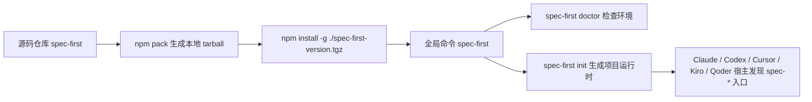
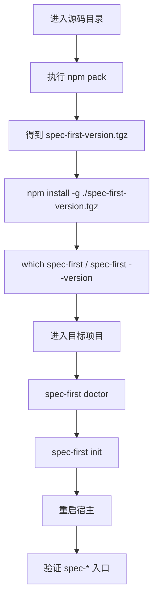

本页说明如何从源码仓库把 `spec-first` 打包成本地 npm tarball、安装为全局 CLI、在目标项目执行 `doctor` 与 `init`，并为后续本地开发准备最小验证环境；它只覆盖“源码安装”和“开发环境准备”，不展开日常维护命令、贡献流程或完整测试体系，那些内容建议继续阅读 [日常维护命令：doctor、init、update、clean](8-ri-chang-wei-hu-ming-ling-doctor-init-update-clean) 与 [贡献流程与变更验证](9-gong-xian-liu-cheng-yu-bian-geng-yan-zheng)。Sources: [06-本地源码安装.md](docs/05-用户手册/06-本地源码安装.md#L1-L10), [package.json](package.json#L1-L14)

## 架构假设：源码安装本质上是在验证 npm CLI 发布模型

从代码与现有安装脚本看，当前仓库的本地源码安装不是“把仓库直接注册成 Claude plugin”，而是先通过 npm 包模型暴露 `spec-first` CLI，再由 `spec-first init` 把 workflow、skills、agents 与命令模板写入目标项目；`install-local.sh` 也只输出 npm CLI 模型下的验证步骤，并明确“不再尝试把自己注册为 Claude plugin”。Sources: [install-local.sh](install-local.sh#L1-L35), [docs/05-用户手册/06-本地源码安装.md](docs/05-用户手册/06-本地源码安装.md#L11-L31)



上图中的关键边界是：`bin/spec-first.js` 是 npm `bin` 暴露的全局入口，进入后先检查 Node.js 版本，再把参数交给 `src/cli` 的 `runCli`；真正的 workflow 入口如 `spec-plan`、`spec-work`、`spec-code-review` 是宿主在 `init` 之后发现的运行时入口，不是 package CLI 子命令。Sources: [package.json](package.json#L6-L14), [bin/spec-first.js](bin/spec-first.js#L1-L24), [src/cli/index.js](src/cli/index.js#L158-L181), [src/cli/index.js](src/cli/index.js#L192-L218)

## 你需要先准备什么

本地源码安装前，请确认本机已安装 Node.js 20 或更新版本；CLI 入口会调用 `ensureSupportedNodeVersion()`，低于 Node.js 20 时会输出“spec-first requires Node.js >=20.0.0”并停止继续执行。Sources: [src/cli/node-version.js](src/cli/node-version.js#L1-L42), [bin/spec-first.js](bin/spec-first.js#L5-L10)

| 准备项 | 为什么需要 | 如何快速检查 |
|---|---|---|
| Node.js >= 20 | CLI 启动时强制校验最低 Node 主版本 | `node --version` |
| npm | 用于 `npm pack` 与全局安装 tarball | `npm --version` |
| 一个目标项目 | `spec-first init` 会把运行时资产写入目标项目，而不是只停留在源码仓库 | 在目标项目根目录运行 `spec-first doctor` / `spec-first init` |
| 目标宿主 | 初始化后需要由 Claude Code、Codex、Cursor、Kiro 或 Qoder 发现生成的入口 | 根据引导选择宿主或使用显式 flag |

这些准备项与源码包本身的约束一致：`package.json` 声明 Node engine 为 `>=20.0.0`，并通过 `bin` 字段把 `spec-first` 映射到 `bin/spec-first.js`。Sources: [package.json](package.json#L1-L14), [package.json](package.json#L112-L117)

## 推荐安装流程

源码安装的推荐路径是：克隆仓库后执行 `npm pack` 生成 `spec-first-<version>.tgz`，再用 `npm install -g ./spec-first-<version>.tgz` 安装到全局 PATH；安装完成后，先运行 `spec-first doctor`，再运行 `spec-first init`。Sources: [docs/05-用户手册/06-本地源码安装.md](docs/05-用户手册/06-本地源码安装.md#L32-L88), [install-local.sh](install-local.sh#L26-L32)



按步骤执行时，可以使用下面这组命令；其中 `<version>` 必须替换为 `npm pack` 实际生成的版本号，例如当前包版本来自 `package.json` 的 `version` 字段。Sources: [package.json](package.json#L1-L8), [docs/05-用户手册/06-本地源码安装.md](docs/05-用户手册/06-本地源码安装.md#L41-L73)

```bash
git clone https://github.com/sunrain520/spec-first.git
cd spec-first

npm pack
npm install -g ./spec-first-<version>.tgz

which spec-first
spec-first --version
spec-first -v
```

安装后进入你的目标项目，先检查环境，再初始化运行时；如果希望跳过交互式选择，可以在脚本场景中使用显式宿主 flag 与 `-y`，例如 `spec-first init --codex -y -u reviewer --lang zh`。Sources: [docs/05-用户手册/06-本地源码安装.md](docs/05-用户手册/06-本地源码安装.md#L75-L103), [src/cli/index.js](src/cli/index.js#L44-L58)

```bash
cd /path/to/your/project

spec-first doctor
spec-first init

# 脚本化示例
spec-first init --codex -y -u reviewer --lang zh
```

## 本地安装会生成哪些东西

`spec-first init` 的目标是把 npm 包中的运行时资产同步到目标项目：Claude Code 会获得 `.claude/commands/spec-*.md`、`.claude/skills/`、`.claude/spec-first/workflows/` 与 `.claude/agents/`；Codex 会获得 `.agents/skills/spec-*/SKILL.md`、`.codex/agents/` 以及 `.codex/spec-first/` 下的受管状态文件。Sources: [docs/05-用户手册/06-本地源码安装.md](docs/05-用户手册/06-本地源码安装.md#L17-L30), [docs/05-用户手册/06-本地源码安装.md](docs/05-用户手册/06-本地源码安装.md#L124-L167)

```text
目标项目/
├── .claude/
│   ├── commands/
│   │   └── spec-*.md
│   ├── skills/
│   ├── agents/
│   └── spec-first/
│       ├── workflows/
│       ├── .developer
│       └── state.json
├── .agents/
│   └── skills/
│       └── spec-*/
└── .codex/
    ├── agents/
    └── spec-first/
        ├── .developer
        └── state.json
```

源码包会发布 `bin/`、`src/`、`agents/`、`skills/`、`templates/`、部分 `docs/contracts/`、运行时治理脚本与 `README.md`，所以本地 tarball 安装验证的是接近正式 npm 发布包的内容边界，而不是任意读取源码仓库中的所有文件。Sources: [package.json](package.json#L37-L83)

| 目标位置 | 主要用途 | 初学者该检查什么 |
|---|---|---|
| `.claude/commands/spec-*.md` | Claude Code 的命令入口 | `ls .claude/commands | rg '^spec-.*\.md$'` |
| `.claude/skills/` | Claude Code 的 standalone skills | `ls .claude/skills` |
| `.claude/spec-first/workflows/` | Claude command-backing workflow skills | `ls .claude/spec-first/workflows` |
| `.agents/skills/spec-*` | Codex 的 skill 入口 | `ls .agents/skills | rg '^spec-'` |
| `.claude/agents/` / `.codex/agents/` | 随包发布的 agents 与支持文件 | `find .claude/agents -type f | head` 或 `find .codex/agents -type f | head` |

上表中的检查命令来自当前本地安装指南的验证段落；如果目录存在但宿主看不到入口，下一步不是手工改文件，而是重新运行 `spec-first init` 并完全重启宿主。Sources: [docs/05-用户手册/06-本地源码安装.md](docs/05-用户手册/06-本地源码安装.md#L124-L168)

## 为什么要重启宿主

`spec-first init` 写入的是项目内运行时目录，Claude Code 或 Codex 需要完全退出后重新启动，才能稳定识别新生成的 `spec-*` 入口；在 macOS 上，关闭窗口不等于退出应用，文档建议使用 `Cmd+Q` 或 `pkill -f "claude"` 结束进程后再重新启动。Sources: [docs/05-用户手册/06-本地源码安装.md](docs/05-用户手册/06-本地源码安装.md#L104-L123)

```bash
# Claude Code
pkill -f "claude"
claude

# Codex
pkill -f "codex"
codex
```

需要特别记住：目录存在只能证明资产已经生成，不能单独证明宿主已经重新发现入口；因此“安装成功”的判断应包括 CLI 可运行、`doctor/init` 成功、运行时目录存在、宿主重启后能看到目标 `spec-*` 入口。Sources: [docs/05-用户手册/06-本地源码安装.md](docs/05-用户手册/06-本地源码安装.md#L104-L168), [src/cli/index.js](src/cli/index.js#L208-L214)

## 源码开发时如何快速重新验证

如果你修改了源码，当前仓库提供的 `dev-reload.sh` 不会热加载宿主运行时，而是提醒你按 npm CLI 模型重新验证：安装 CLI、在目标项目运行 `spec-first doctor`、再运行 `spec-first init` 并选择目标宿主；如需验证本地发布物，脚本明确提示先执行 `npm pack`。Sources: [dev-reload.sh](dev-reload.sh#L1-L13), [docs/05-用户手册/06-本地源码安装.md](docs/05-用户手册/06-本地源码安装.md#L207-L259)

| 场景 | 推荐动作 | 原因 |
|---|---|---|
| 只想看当前安装说明 | 运行 `./install-local.sh` | 它只输出 npm CLI 模型下的本地验证步骤 |
| 修改了源码并想验证发布物 | `npm pack` 后重新 `npm install -g ./spec-first-<version>.tgz` | 本地 tarball 更接近正式 npm 发布包边界 |
| 修改后宿主内入口没变化 | 重新 `spec-first init` 并完全重启宿主 | 当前平台运行时不支持热加载 |
| 怀疑 shell 仍指向旧 shim | 执行 `hash -r` 或重开终端 | 避免 shell 命令缓存继续指向旧路径 |

这些开发注意事项都指向同一个原则：源码仓库是 Source of Truth，目标项目里的 `.claude/`、`.agents/`、`.codex/` 等目录是生成运行时；修改源码后，需要重新打包、安装、初始化并重启宿主，才能验证真实用户会得到的效果。Sources: [docs/05-用户手册/06-本地源码安装.md](docs/05-用户手册/06-本地源码安装.md#L175-L185), [docs/05-用户手册/06-本地源码安装.md](docs/05-用户手册/06-本地源码安装.md#L207-L259)

## 安装验证清单

安装完成后，先用 `spec-first --version` 或 `spec-first -v` 验证全局 CLI；`-v` 会显示快速上手提示，其中包含 `spec-first doctor`、`spec-first init`、重启宿主 CLI，以及在对话中使用 `spec-plan`、`spec-work`、`spec-code-review`、`spec-mcp-setup` 等宿主 workflow 入口。Sources: [src/cli/index.js](src/cli/index.js#L192-L218), [docs/05-用户手册/06-本地源码安装.md](docs/05-用户手册/06-本地源码安装.md#L57-L73)

| 验证点 | 命令 | 成功信号 |
|---|---|---|
| CLI 在 PATH 中 | `which spec-first` | 输出全局安装路径 |
| CLI 能启动 | `spec-first --version` 或 `spec-first -v` | 输出版本或欢迎页 |
| 环境诊断能运行 | `spec-first doctor` | 返回环境检查结果 |
| 项目运行时已生成 | `spec-first init` 后检查 `.claude/`、`.agents/` 或 `.codex/` | 目标宿主目录出现受管资产 |
| 宿主入口可见 | 重启宿主后尝试 `spec-mcp-setup`、`spec-skill-audit` 等 | 宿主能识别对应入口 |

`install-local.sh` 的 smoke test 也把这些预期固化为回归检查：脚本输出必须包含 `npm install -g spec-first`、`spec-first init`、按引导选择目标宿主，并且不得再输出旧插件缓存路径。Sources: [tests/smoke/install-local.sh](tests/smoke/install-local.sh#L15-L37)

## 常见问题与处理方式

如果 `which spec-first` 或 `spec-first doctor` 仍然指向旧路径，先执行 `hash -r`，再重新检查；如果仍不正确，关闭当前终端并重新打开，因为旧 pnpm shim 或 shell 缓存可能仍在影响命令解析。Sources: [docs/05-用户手册/06-本地源码安装.md](docs/05-用户手册/06-本地源码安装.md#L65-L73), [docs/05-用户手册/06-本地源码安装.md](docs/05-用户手册/06-本地源码安装.md#L342-L352)

如果宿主找不到 skills 或 commands，先检查目标项目内 `.claude/commands`、`.claude/skills`、`.claude/spec-first/workflows` 或 `.agents/skills`，然后重新运行 `spec-first init` 与 `spec-first doctor`；必要时重新 `npm pack` 并重新安装本地 tarball。Sources: [docs/05-用户手册/06-本地源码安装.md](docs/05-用户手册/06-本地源码安装.md#L289-L315)

如果安装时看到 `npm warn ERESOLVE overriding peer dependency`，当前指南建议先验证 `spec-first -v` 与 `spec-first doctor` 是否正常；若 CLI 可用，provider 与 helper readiness 应继续交给宿主内的 `spec-mcp-setup` workflow 验证。Sources: [docs/05-用户手册/06-本地源码安装.md](docs/05-用户手册/06-本地源码安装.md#L325-L341)

| 问题 | 优先处理 | 何时升级处理 |
|---|---|---|
| Node 版本过低 | 安装 Node.js 20 或更新版本 | `spec-first` 启动即报 Node 版本错误 |
| 找不到 `spec-first` | 检查 `which spec-first`，必要时重开终端 | `hash -r` 后仍指向旧路径 |
| 宿主看不到入口 | 重新 `spec-first init` 并完全重启宿主 | 运行时目录缺失或宿主仍未发现 |
| peer dependency 警告 | 先跑 `spec-first -v` 与 `spec-first doctor` | CLI 无法启动时再清 npm 缓存或使用文档中的重装参数 |

这些排查步骤只解决本地源码安装与运行时生成问题；如果你已经完成安装，想理解 `doctor`、`init`、`update`、`clean` 的日常使用边界，请继续阅读 [日常维护命令：doctor、init、update、clean](8-ri-chang-wei-hu-ming-ling-doctor-init-update-clean)。Sources: [docs/05-用户手册/06-本地源码安装.md](docs/05-用户手册/06-本地源码安装.md#L277-L353), [src/cli/index.js](src/cli/index.js#L158-L181)

## 下一步阅读路径

如果你是第一次安装，建议先回看 [首次运行与成功信号](3-shou-ci-yun-xing-yu-cheng-gong-xin-hao) 来确认“成功”应当如何判断；如果你还没有选择宿主，先读 [选择你的宿主：Claude Code、Codex、Cursor、Kiro 与 Qoder](4-xuan-ze-ni-de-su-zhu-claude-code-codex-cursor-kiro-yu-qoder)；安装完成并能看到入口后，再读 [日常维护命令：doctor、init、update、clean](8-ri-chang-wei-hu-ming-ling-doctor-init-update-clean) 与 [贡献流程与变更验证](9-gong-xian-liu-cheng-yu-bian-geng-yan-zheng)。Sources: [src/cli/index.js](src/cli/index.js#L158-L181), [src/cli/index.js](src/cli/index.js#L192-L218)