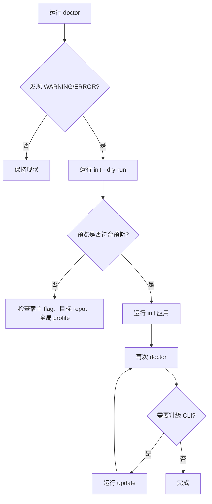

本页位于入门指南的“日常维护”位置，聚焦 `spec-first` CLI 中四个维护命令：`doctor` 用于诊断环境与运行时资产，`init` 用于生成或刷新项目内的多宿主运行时，`update` 用于升级 npm 全局安装的 CLI 并触发运行时刷新，`clean` 用于移除当前项目中由 spec-first 托管的运行时资产。CLI 顶层分发只把 `doctor`、`init`、`clean`、`update` 作为包级维护命令处理，并且这些命令会触发版本提醒逻辑；本页不展开工作流入口、Skill 设计或测试发布体系。Sources: [index.js](src/cli/index.js#L37-L58), [index.js](src/cli/index.js#L82-L87)

## 维护命令在 CLI 中的位置

`spec-first` 的命令行入口由 `src/cli/index.js` 负责分发：当命令为 `doctor`、`init`、`clean`、`update` 时，分别调用 `runDoctor`、`runInit`、`runClean`、`runUpdate`；帮助信息也把这四个命令定义为日常使用的包级命令，其中 `init` 支持 Claude Code、Codex、Cursor、Kiro、Qoder，`clean` 要求显式选择一个宿主，`update` 会升级 CLI 并刷新 runtime。Sources: [index.js](src/cli/index.js#L44-L58), [index.js](src/cli/index.js#L158-L181)


这四个命令形成一个维护闭环：先用 `doctor` 识别安装健康度、运行时资产健康度、宿主可用性与 workflow runnability；再用 `init` 修复缺失、漂移或旧状态；版本升级时用 `update` 先升级包再调用新的 `spec-first init` 子进程刷新 runtime；需要退出某个宿主集成时，用 `clean --claude|--codex|--cursor|--kiro|--qoder` 删除托管资产并保留非托管自定义内容。Sources: [doctor.js](src/cli/commands/doctor.js#L443-L527), [init.js](src/cli/commands/init.js#L188-L254), [update.js](src/cli/commands/update.js#L16-L27), [clean.js](src/cli/commands/clean.js#L102-L114)

## 命令速查表

| 命令 | 典型用途 | 关键选项 | 成功退出码 | 失败或特殊退出码 |
|---|---|---|---:|---|
| `spec-first doctor` | 检查 Node.js、Git、runtime asset manifest、全局开发者 profile、宿主 CLI、托管 state、指令 bootstrap、skills、agents 与 workflow runnability | `--claude`、`--codex`、`--cursor`、`--kiro`、`--qoder`、`--json` | `0` | JSON 模式下存在 ERROR 返回 `3`；未知选项返回 `2` |
| `spec-first init` | 安装或刷新项目 runtime、写入托管 state、同步 commands/skills/agents、写入全局开发者 profile、可处理单仓或父工作区多仓 | `--claude`、`--codex`、`--cursor`、`--kiro`、`--qoder`、`-y`、`--dry-run`、`--all-repos`、`--repo <path>`、`--lang zh|en` | `0` | 参数错误或非交互条件不满足返回 `2`；计划错误或应用失败返回 `1` |
| `spec-first update` | 执行 `npm install -g spec-first@latest`，升级成功后用 fresh `spec-first init` 子进程刷新 runtime | `-h`、`--help` | `0` | npm 或自动刷新失败返回 `1`；意外参数返回 `2` |
| `spec-first clean` | 删除当前项目内某一个宿主的 spec-first 托管资产；或清理父工作区 orphan evidence 中允许的路径 | `--claude`、`--codex`、`--cursor`、`--kiro`、`--qoder`、`--dry-run`、`--workspace-orphans`、`--confirm` | `0` | 参数错误返回 `2`；state 不可读、legacy state、清理失败等返回 `1` |

Sources: [doctor.js](src/cli/commands/doctor.js#L28-L73), [init.js](src/cli/commands/init.js#L126-L150), [init.js](src/cli/commands/init.js#L264-L376), [update.js](src/cli/commands/update.js#L28-L40), [update.js](src/cli/commands/update.js#L51-L100), [clean.js](src/cli/commands/clean.js#L25-L53), [clean.js](src/cli/commands/clean.js#L166-L242)

## 可视化项目结构：这些命令会读写哪里

维护命令围绕“包内 Source of Truth”和“项目内 Generated Runtime”工作：包内的 `src/cli/commands/*.js` 实现命令行为，`skills/`、`agents/`、`templates/`、`docs/contracts/` 等被包含在 npm 发布文件中；项目内的 `.claude`、`.codex`、`.cursor`、`.kiro`、`.qoder` 目录则是 `init` 生成、`doctor` 检查、`clean` 移除的宿主运行时表面。Sources: [package.json](package.json#L37-L82), [adapters/index.js](src/cli/adapters/index.js#L1-L13), [init.js](src/cli/commands/init.js#L743-L750)

```text
spec-first package
├── bin/spec-first.js
├── src/cli/index.js
├── src/cli/commands/
│   ├── doctor.js
│   ├── init.js
│   ├── update.js
│   └── clean.js
├── skills/
├── agents/
├── templates/
└── docs/contracts/

target project after init
├── .claude/spec-first/state.json
├── .codex/spec-first/state.json
├── .cursor/spec-first/state.json
├── .kiro/spec-first/state.json
├── .qoder/spec-first/state.json
└── host-specific commands / skills / agents / instruction files
```

`init` 会根据宿主 adapter 生成命令、skills、agents、宿主运行时文件与 state；`doctor` 读取这些路径并对缺失、漂移、manifest 版本不一致等情况给出修复建议；`clean` 则根据 state 规划删除托管资产、清理 instruction 文件中的托管块、移除 state 文件与宿主运行时文件。Sources: [init.js](src/cli/commands/init.js#L1014-L1124), [doctor.js](src/cli/commands/doctor.js#L203-L252), [doctor.js](src/cli/commands/doctor.js#L254-L413), [clean.js](src/cli/commands/clean.js#L392-L441)

## doctor：先诊断，不修改项目

`doctor` 是只读诊断入口。执行时会解析宿主筛选参数；如果没有显式传入 `--claude`、`--codex`、`--cursor`、`--kiro`、`--qoder`，它会自动检测当前项目已初始化的平台；如果没有检测到任何 spec-first 平台，普通输出会提示运行 `spec-first init`，JSON 输出则返回空平台报告。Sources: [doctor.js](src/cli/commands/doctor.js#L28-L68)

```bash
spec-first doctor
spec-first doctor --claude
spec-first doctor --codex --json
```

Sources: [doctor.js](src/cli/commands/doctor.js#L28-L73), [doctor.js](src/cli/commands/doctor.js#L537-L553)

`doctor` 的公共检查包括 Node.js 版本、Git、runtime asset manifest 与全局开发者 profile。Node.js 检查要求主版本不低于 20；Git 检查通过 `git --version` 验证 PATH；manifest 检查会读取包内插件 manifest 与 bundled commands；全局开发者 profile 位于 `~/.spec-first/.developer`，必须包含非空 `name` 与 `lang`，且 `lang` 只能是 `zh` 或 `en`。Sources: [doctor.js](src/cli/commands/doctor.js#L106-L146), [doctor.js](src/cli/commands/doctor.js#L415-L440), [doctor.js](src/cli/commands/doctor.js#L828-L869), [package.json](package.json#L112-L114)

`doctor` 的平台检查分为宿主可用性与 runtime 资产两类：宿主可用性通过对应 CLI 的 `--version` 探测，Claude 使用 `claude`，Codex 使用 `codex`，Cursor 使用 `agent`，Kiro 使用 `kiro`，Qoder 使用 `qodercli`；runtime 资产检查包括 managed state、instruction bootstrap、宿主 runtime 文件、commands、skills、agents 与 agent support files。Sources: [doctor.js](src/cli/commands/doctor.js#L148-L200), [doctor.js](src/cli/commands/doctor.js#L443-L487)

`doctor --json` 输出结构化报告，字段包括 `install_health`、`runtime_asset_health`、`host_readiness`、`decision_input_health`、`workflow_runnability`、`checks`、`common_checks`、`platform_checks` 与 `warnings`；其中存在 ERROR 时 JSON 模式返回 `3`，否则返回 `0`。Sources: [doctor.js](src/cli/commands/doctor.js#L68-L73), [doctor.js](src/cli/commands/doctor.js#L512-L553)

`workflow_runnability` 不是简单的文件存在性判断：它要求 runtime assets ready、host readiness 不为 error、managed state 存在、workflow surface resolved；如果还存在 schema 有效且新鲜的 verification evidence，则状态为 `verified`，否则在 runtime surface 就绪但证据不足时为 `simulated`，资产或表面不完整时为 `not_verified`。Sources: [doctor.js](src/cli/commands/doctor.js#L555-L645), [doctor.js](src/cli/commands/doctor.js#L665-L699)

## init：生成或刷新宿主运行时

`init` 是日常维护中最核心的修复命令。它支持交互模式与 `-y/--yes` 非交互模式；非交互模式下如果没有显式选择宿主，会使用默认宿主集合，而默认宿主当前是 `Claude Code` 与 `Codex`；如果没有交互终端且未使用 `-y/--yes`，命令会报错并返回 `2`。Sources: [init.js](src/cli/commands/init.js#L115-L150), [init.js](src/cli/commands/init.js#L567-L571)

```bash
spec-first init
spec-first init --claude
spec-first init --codex --cursor
spec-first init -y
spec-first init --all-repos -y
spec-first init --repo packages/api --claude
spec-first init --dry-run --qoder
```

Sources: [init.js](src/cli/commands/init.js#L264-L376), [init.js](src/cli/commands/init.js#L626-L665)

`init` 的参数解析支持宿主选择、`--dry-run`、`--all-repos`、`--repo`、`-u/--user`、`--lang`、`--sync-user-language` 与 `--no-sync-user-language`；`--lang` 只接受 `zh` 或 `en`，`--repo` 不能和 `--all-repos` 同时使用，用户语言同步的正反选项也不能同时使用。Sources: [init.js](src/cli/commands/init.js#L264-L376)

交互模式会先确定语言、宿主、开发者名字、用户语言同步偏好与目标仓库；如果已有全局开发者 profile 且本次没有显式覆盖，交互流程会优先复用已有 profile，并用上次记录的宿主选择预勾选复选框。Sources: [init.js](src/cli/commands/init.js#L379-L510), [init.js](src/cli/commands/init.js#L573-L591)

目标仓库选择有三种路径：当前目录在 Git 仓库内时使用当前 Git root；`--repo <path>` 要求目标存在、位于当前 workspace 内，并能解析到 workspace 内的 Git root；`--all-repos` 要求从父工作区运行，且该父目录下存在子 Git 仓库。Sources: [init.js](src/cli/commands/init.js#L609-L665), [init.js](src/cli/commands/init.js#L667-L709)

`init` 先构建 plan 再应用。plan 中包含 previous state、preview state、pre-sync plan、write plan、operation plan、diagnostics、errors 与 global developer write；如果传入 `--dry-run`，只打印预览并返回，不写文件；否则会在用户确认后应用计划。Sources: [init.js](src/cli/commands/init.js#L188-L219), [init.js](src/cli/commands/init.js#L872-L916), [init.js](src/cli/commands/init.js#L1123-L1154)

`init` 对旧状态和漂移有内置修复路径：如果发现 legacy managed state，会执行 managed hard reset 后重新初始化；如果已有 state 但当前 runtime drift 被检测到，也会先对托管资产执行 hard reset，再写入新的 runtime。Claude 场景还会在初始化前验证 `.claude/settings.json` 是有效 JSON。Sources: [init.js](src/cli/commands/init.js#L968-L981), [init.js](src/cli/commands/init.js#L1049-L1071), [init.js](src/cli/commands/init.js#L1073-L1104)

`init --all-repos` 会同时为父工作区 runtime 和每个子仓库构建初始化计划；实际应用时会生成 `workspace-init-summary.v1` 摘要，记录 parent runtime、每个 child repo 的状态、ready/action-required 计数、整体状态与下一步动作。Sources: [init.js](src/cli/commands/init.js#L1503-L1572), [init.js](src/cli/commands/init.js#L1394-L1500)

## update：升级 CLI，并用新进程刷新 runtime

`update` 的设计边界非常明确：它无条件执行 `npm install -g spec-first@latest`，不检查当前版本，也不检测安装方式；npm 成功后，再启动 fresh `spec-first init` 子进程刷新本地 runtime，避免旧进程直接执行新生成逻辑造成版本错位。Sources: [update.js](src/cli/commands/update.js#L13-L27)

```bash
spec-first update
```

Sources: [update.js](src/cli/commands/update.js#L167-L192)

升级阶段如果找不到 `npm`，会提示 PATH 问题并返回 `1`；如果 npm 返回非零状态，会提示手动重试 `npm install -g spec-first@latest`；升级成功后会清理 CLI 版本提醒 cooldown，但清理失败不会把成功升级变成失败命令。Sources: [update.js](src/cli/commands/update.js#L51-L67), [update.js](src/cli/commands/update.js#L92-L100), [update.js](src/cli/commands/update.js#L103-L115)

runtime 刷新范围由当前目录决定：如果当前目录能找到 Git root，则刷新命令是 `spec-first init -y`；如果当前目录不是 Git 仓库但包含子 Git 仓库，则刷新命令是 `spec-first init --all-repos -y`；如果范围无法安全判断，则跳过自动刷新并打印 fallback 命令。Sources: [update.js](src/cli/commands/update.js#L70-L91), [update.js](src/cli/commands/update.js#L130-L161)

需要注意，`update` 只升级 npm 全局安装的 `spec-first`。如果你是通过 Claude Code plugin 使用 spec-first，命令会提示改用 `claude plugin update`，因为 `npm -g` 管理的是另一份副本。Sources: [update.js](src/cli/commands/update.js#L92-L95), [update.js](src/cli/commands/update.js#L186-L188)

## clean：移除托管资产，保留自定义内容

`clean` 用于删除当前项目中某一个宿主的 spec-first 托管资产，必须且只能指定一个宿主：`--claude`、`--codex`、`--cursor`、`--kiro` 或 `--qoder`。如果没有指定宿主、指定多个宿主或传入未知参数，命令返回 `2`。Sources: [clean.js](src/cli/commands/clean.js#L25-L56), [clean.js](src/cli/commands/clean.js#L125-L164)

```bash
spec-first clean --claude --dry-run
spec-first clean --codex
spec-first clean --workspace-orphans
spec-first clean --workspace-orphans --confirm
```

Sources: [clean.js](src/cli/commands/clean.js#L368-L380)

普通清理会先读取对应宿主的 managed state；如果没有 state，输出 “No spec-first managed project assets found.” 并返回 `0`；如果检测到 legacy state，`clean` 不会迁移旧安装，而是提示先运行 `init` 完成 hard reset 与 runtime 重建，再重新执行 clean。Sources: [clean.js](src/cli/commands/clean.js#L58-L86)

Claude 清理前会额外验证 `.claude/settings.json` 可读且 JSON 有效；如果无效，命令要求先修复该文件再重新运行 `spec-first clean --claude`。Sources: [clean.js](src/cli/commands/clean.js#L88-L100)

`clean` 的删除计划由三部分组成：根据 state 删除托管资产、清理 instruction 文件中的 managed blocks 并删除 state 文件、调用 adapter 删除宿主 runtime 文件；Claude 场景还会移除托管 hook matcher，必要时更新或删除 `.claude/settings.json`。Sources: [clean.js](src/cli/commands/clean.js#L392-L441)

`--dry-run` 会打印将要删除、将要更新的路径数量与路径列表，并明确说明 “No files were changed.”；真正执行时，命令会应用删除计划、清理空 managed root，并输出“自定义资产不在 spec-first managed set 内，因此保留”。Sources: [clean.js](src/cli/commands/clean.js#L102-L114), [clean.js](src/cli/commands/clean.js#L444-L477)

`clean --workspace-orphans` 是独立清理路径，不能和宿主 flag 组合。默认只预览 `.spec-first/workspace/parent-artifact-quarantine.json` 中记录的父工作区 orphan evidence；只有加上 `--confirm` 才会删除允许的 orphan 路径，目前允许的目标是 `.spec-first/config/tool-facts.json` 与 `.spec-first/config/runtime-capabilities.json`。Sources: [clean.js](src/cli/commands/clean.js#L166-L183), [clean.js](src/cli/commands/clean.js#L206-L242), [clean.js](src/cli/commands/clean.js#L245-L347)

## 推荐维护流程

日常排障建议遵循“诊断 → 预览 → 应用 → 再诊断”的最小闭环：先运行 `spec-first doctor --json` 查看结构化健康状态；如果 runtime asset health 有 warning，运行 `spec-first init --dry-run` 观察将写入或删除的托管路径；确认后运行 `spec-first init` 或带宿主 flag 的 `init`；最后再次运行 `doctor` 确认 state、skills、agents、commands 与 workflow runnability 的状态。Sources: [doctor.js](src/cli/commands/doctor.js#L537-L553), [init.js](src/cli/commands/init.js#L206-L219), [init.js](src/cli/commands/init.js#L221-L254), [doctor.js](src/cli/commands/doctor.js#L489-L527)



如果你只是想升级 CLI，直接运行 `spec-first update`；如果你想移除某个宿主的集成，先运行 `spec-first clean --<host> --dry-run`，确认删除范围只包含托管资产后再去掉 `--dry-run`。Sources: [update.js](src/cli/commands/update.js#L48-L100), [clean.js](src/cli/commands/clean.js#L102-L114), [clean.js](src/cli/commands/clean.js#L444-L477)

## 常见问题与处理方式

| 现象 | 原因判断 | 处理方式 |
|---|---|---|
| `doctor` 提示 Node.js ERROR | 当前 Node.js 主版本低于 20 | 安装 Node.js 20 或更新版本 |
| `doctor` 提示 Git not found | `git --version` 无法执行 | 安装 Git 并确认 PATH |
| `doctor` 提示 state manifest 版本不一致 | state 记录的 manifestVersion 与当前包内 manifest 版本不同 | 运行 `spec-first init` 重新同步托管资产 |
| `init` 在非交互环境报错 | 未使用 `-y/--yes` 且没有交互式终端 | 使用 `spec-first init -y`，必要时显式添加宿主 flag |
| `update` 找不到 npm | `npm` 不在 PATH | 安装 Node.js/npm，或使用自己的包管理器手动升级 |
| `clean` 检测到 legacy state | clean 不迁移旧安装 | 先运行 `spec-first init` 完成 hard reset 与重建，再重新 clean |
| `clean --workspace-orphans` 无 evidence | 缺少父工作区 quarantine 文件 | 重新从父工作区运行生成 workspace orphan evidence 的流程 |

Sources: [doctor.js](src/cli/commands/doctor.js#L106-L146), [doctor.js](src/cli/commands/doctor.js#L871-L925), [init.js](src/cli/commands/init.js#L138-L150), [update.js](src/cli/commands/update.js#L53-L67), [clean.js](src/cli/commands/clean.js#L58-L86), [clean.js](src/cli/commands/clean.js#L178-L194)

## 下一步阅读

如果你还没有完成首次安装，先回到 [快速开始](2-kuai-su-kai-shi) 与 [首次运行与成功信号](3-shou-ci-yun-xing-yu-cheng-gong-xin-hao)；如果你需要理解 Claude Code、Codex、Cursor、Kiro、Qoder 的差异，继续阅读 [选择你的宿主：Claude Code、Codex、Cursor、Kiro 与 Qoder](4-xuan-ze-ni-de-su-zhu-claude-code-codex-cursor-kiro-yu-qoder)；如果你想确认哪些生成文件应该提交，阅读 [产物目录与提交边界](6-chan-wu-mu-lu-yu-ti-jiao-bian-jie)；如果你准备修改本仓库并验证变更，下一篇是 [贡献流程与变更验证](9-gong-xian-liu-cheng-yu-bian-geng-yan-zheng)。Sources: [index.js](src/cli/index.js#L158-L181)