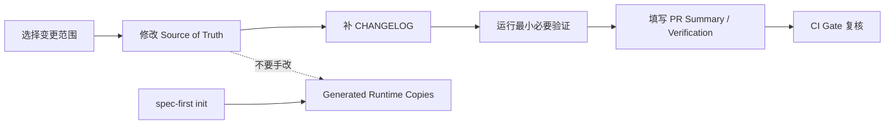
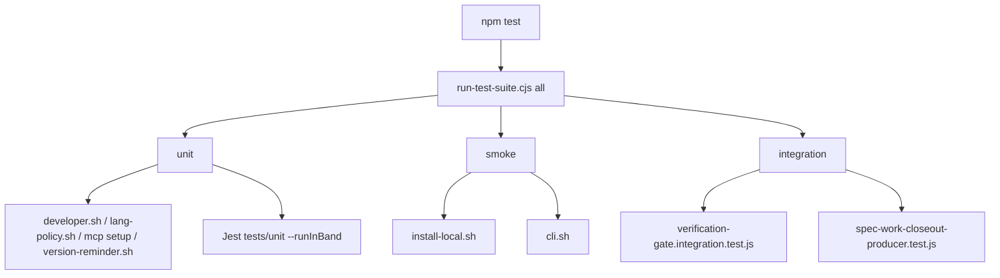
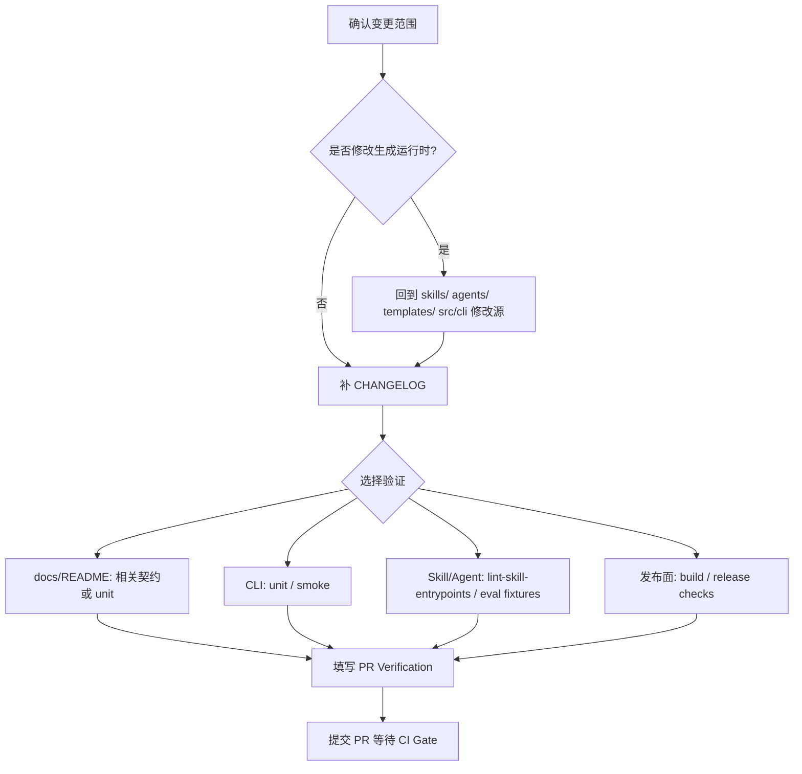

本页位于入门指南的第 9 页，目标是把一次贡献从“我改了代码”收敛为“我改了正确的 Source of Truth、记录了用户可见影响、运行了匹配范围的验证，并在 PR 中留下可复核证据”。这里不展开 CLI 架构、宿主适配或发布体系的内部设计，只说明贡献者在提交变更前后需要遵守的流程边界与验证选择。Sources: [CONTRIBUTING.md](CONTRIBUTING.md#L3-L5), [.github/pull_request_template.md](.github/pull_request_template.md#L1-L16)

## 架构假设：贡献不是直接改运行时，而是修改源并验证投影

本页采用的核心假设是：spec-first 的贡献流程围绕 **Source of Truth → 验证 → PR 证据** 展开。贡献者应优先修改 `skills/`、`agents/`、`templates/` 或 `src/cli/` 下的源资产，而不是手工修改 `.claude/`、`.codex/`、`.agents/skills/` 等生成运行时副本；当需要刷新运行时副本时，通过 `spec-first init` 重新生成。Sources: [CONTRIBUTING.md](CONTRIBUTING.md#L24-L30)



Sources: [CONTRIBUTING.md](CONTRIBUTING.md#L24-L30), [CONTRIBUTING.md](CONTRIBUTING.md#L32-L36), [.github/pull_request_template.md](.github/pull_request_template.md#L1-L16)

## 贡献前准备

本地准备的基线命令是 `npm install`、`npm run typecheck` 与 `npm test`；这是贡献者进入完整验证前的默认路径。迭代过程中可以先运行更窄的检查，例如 `npm run test:unit`、`npm run test:smoke`、`npm run test:integration` 与 `npm run build`，以便把反馈周期控制在当前变更范围内。Sources: [CONTRIBUTING.md](CONTRIBUTING.md#L7-L22)

| 场景 | 推荐命令 | 适用时机 |
|---|---|---|
| 初次准备或完整回归 | `npm install` → `npm run typecheck` → `npm test` | 开始贡献、提交前总检 |
| 单元级修改 | `npm run test:unit` | 修改 `src/cli/`、脚本、契约类逻辑 |
| CLI/安装冒烟 | `npm run test:smoke` | 修改安装、命令入口或运行时生成相关行为 |
| 集成验证 | `npm run test:integration` | 修改 verification gate 或 closeout 产物相关逻辑 |
| 打包面检查 | `npm run build` | 修改发布包内容、`files`、README 或交付面 |

Sources: [CONTRIBUTING.md](CONTRIBUTING.md#L15-L22), [package.json](package.json#L15-L36)

## 变更范围与 Source of Truth 边界

贡献时最容易出错的地方是把生成物当成源来改。仓库明确规定：源资产位于 `skills/`、`agents/`、`templates/` 或 `src/cli/`，而 `.claude/`、`.codex/`、`.agents/skills/` 下的运行时副本是可丢弃投影；这意味着修复 skill、agent、模板或 CLI 行为时，应回到源目录修改，并在必要时重新初始化运行时。Sources: [CONTRIBUTING.md](CONTRIBUTING.md#L24-L30)

```text
spec-first/
├── skills/          # Skill 源资产：应在这里修改 skill 行为与文案
├── agents/          # Agent 源资产：应在这里修改专家角色定义
├── templates/       # 宿主模板源：应在这里修改生成模板
├── src/cli/         # CLI 源码：应在这里修改命令、初始化、治理逻辑
├── .claude/         # 生成运行时副本：不要手工作为源修改
├── .codex/          # 生成运行时副本：不要手工作为源修改
└── .agents/skills/  # 生成运行时副本：不要手工作为源修改
```

Sources: [CONTRIBUTING.md](CONTRIBUTING.md#L24-L30)

## 常见变更类型与验证选择

不同变更类型对应不同验证重点。README 或 docs 变更在影响公开表面时需要同步 README、中文 README、相关文档与 README 契约测试；CLI 变更应修改 `src/cli/` 并运行能证明行为的最窄单元或冒烟测试；Skill 或 agent 变更应修改源资产而不是生成运行时，并在行为变化时补契约测试；运行时治理变更则需要验证支持宿主行为，并保持统一 `spec-*` 入口映射集中。Sources: [CONTRIBUTING.md](CONTRIBUTING.md#L38-L43)

| 变更类型 | 修改位置 | 最小验证建议 | 额外注意 |
|---|---|---|---|
| README / docs 公开表面 | `README.md`、`README.zh-CN.md`、相关 `docs/` | 相关契约测试或 `npm run test:unit` 中对应测试 | 公开入口、链接、示例要保持有效 |
| CLI 行为 | `src/cli/` | `npm run test:unit`；必要时 `npm run test:smoke` | 用最窄测试证明行为变化 |
| Skill / agent 行为 | `skills/`、`agents/` | `npm run lint:skill-entrypoints`；必要时契约测试 | 不要把生成运行时当源修改 |
| 运行时治理 | `src/cli/`、`templates/`、治理契约 | `npm run test:unit`、宿主相关冒烟或 gate | 入口映射应保持集中 |
| 发布或包内容 | `package.json`、发布脚本、交付契约 | `npm run build`、`npm run test:release` | 关注 npm 包交付面 |

Sources: [CONTRIBUTING.md](CONTRIBUTING.md#L38-L43), [package.json](package.json#L15-L36)

## CHANGELOG 是贡献闭环的一部分

任何 source 或 documentation 变更都必须添加 `CHANGELOG.md` 条目。项目的 changelog 记录格式是 `- v版本号 YYYY-MM-DD HH:MM:SS 作者: 变更摘要 [(user-visible)]`，条目应保持 compact，记录 source surface、用户可见影响、验证或未验证状态以及必要 artifact 路径；长推理应放到 requirements、plan、review 或 validation 文档，而不是塞进 changelog。Sources: [CONTRIBUTING.md](CONTRIBUTING.md#L32-L36), [CHANGELOG.md](CHANGELOG.md#L1-L5)

## 本地验证命令如何工作

`npm test` 实际调用 `node scripts/run-test-suite.cjs all`，而 `all` 会顺序运行 unit、smoke 与 integration。unit 套件包括若干 shell 检查、mcp setup 检查与 `tests/unit` 下的 Jest 测试；smoke 在非 Windows 原生路径下运行本地安装与 CLI 冒烟；integration 运行 verification gate 与 spec-work closeout producer 的集成测试。Sources: [package.json](package.json#L25-L31), [scripts/run-test-suite.cjs](scripts/run-test-suite.cjs#L69-L124)

`run-test-suite.cjs` 对测试命令设置了默认 15 分钟超时，并允许通过 `SPEC_FIRST_TEST_COMMAND_TIMEOUT_MS` 覆盖；在原生 Windows 且未设置 `SPEC_FIRST_FORCE_POSIX_TESTS=1` 时，POSIX shell 测试会被跳过或替换为 Windows 适配检查。贡献者在 macOS 或 Linux 上通常会执行完整 POSIX 路径，在 Windows 上则需要注意该平台分支。Sources: [scripts/run-test-suite.cjs](scripts/run-test-suite.cjs#L9-L17), [scripts/run-test-suite.cjs](scripts/run-test-suite.cjs#L61-L67), [scripts/run-test-suite.cjs](scripts/run-test-suite.cjs#L77-L92)



Sources: [scripts/run-test-suite.cjs](scripts/run-test-suite.cjs#L69-L124)

## Skill 入口与工作流文案验证

Skill 入口 lint 由 `scripts/lint-skill-entrypoints.js` 执行，它会加载配置、读取治理数据、构建阻断规则与警告规则，并扫描配置中的 Markdown 根目录。脚本还会为 standalone skill 构造入口误用规则，阻止 standalone skill 被描述成 command entrypoint；发现 error 时进程以失败退出。Sources: [scripts/lint-skill-entrypoints.js](scripts/lint-skill-entrypoints.js#L13-L51), [scripts/lint-skill-entrypoints.js](scripts/lint-skill-entrypoints.js#L53-L71), [scripts/lint-skill-entrypoints.js](scripts/lint-skill-entrypoints.js#L180-L197)

Skill Entrypoint Gate 会在 PR 触及 `skills/**`、workflow eval 契约、source-runtime 边界、dual-host governance、PR 模板、lint 脚本、相关测试或 package 文件时触发；CI 中先运行 `npm run lint:skill-entrypoints`，再运行 `npm run test:eval-fixtures`。Sources: [.github/workflows/skill-entrypoint-gate.yml](.github/workflows/skill-entrypoint-gate.yml#L3-L26), [.github/workflows/skill-entrypoint-gate.yml](.github/workflows/skill-entrypoint-gate.yml#L28-L50)

## AI Dev Quality Gate 适用范围

AI Dev Quality Gate 面向 workflow runtime contracts 与 benchmark fixtures。脚本会运行一组固定的 workflow runtime contract tests，并运行 AI dev benchmark fixtures；最终写出 `ai-dev-quality-gate-result.json` 与 `quality-feedback-topics.json` 到 workflow artifact 目录。Sources: [scripts/run-ai-dev-quality-gate.js](scripts/run-ai-dev-quality-gate.js#L14-L30), [scripts/run-ai-dev-quality-gate.js](scripts/run-ai-dev-quality-gate.js#L138-L164)

该 gate 的 CI 触发范围覆盖 verification、workflow contracts、verifier/quality-gate contracts、核心 workflow skills、相关测试、benchmark fixtures 与 package 文件；GitHub Actions 会安装依赖、运行 `npm run test:ai-dev:gate`，并上传 `.spec-first/workflows/quality-gates/` 下的 gate artifacts。Sources: [.github/workflows/ai-dev-quality-gate.yml](.github/workflows/ai-dev-quality-gate.yml#L3-L41), [.github/workflows/ai-dev-quality-gate.yml](.github/workflows/ai-dev-quality-gate.yml#L43-L69)

## 发布相关变更的额外验证

发布连续性检查由 `scripts/check-release-continuity.cjs` 承担，覆盖 runtime capability catalog 是否新鲜、公开 workflow contract summary 覆盖率、package delivery surface、website sync release gate 是否保留，以及 README source-runtime boundary 链接。阻断类失败会导致整体状态为 failed。Sources: [scripts/check-release-continuity.cjs](scripts/check-release-continuity.cjs#L55-L117), [scripts/check-release-continuity.cjs](scripts/check-release-continuity.cjs#L119-L160), [scripts/check-release-continuity.cjs](scripts/check-release-continuity.cjs#L199-L239), [scripts/check-release-continuity.cjs](scripts/check-release-continuity.cjs#L253-L318)

website sync 检查通过 `scripts/check-website-sync.cjs` 执行；当以 `--required` 或 `SPEC_FIRST_WEBSITE_SYNC_REQUIRED=1` 运行时，如果找不到官方 website repo 或缺少必要脚本会失败。脚本会检查 website package 中的 `facts:sync` 与 `content:audit`，并运行 `content:audit`，同时把 `SPEC_FIRST_SOURCE_DIR` 指向当前 spec-first 仓库。Sources: [scripts/check-website-sync.cjs](scripts/check-website-sync.cjs#L41-L51), [scripts/check-website-sync.cjs](scripts/check-website-sync.cjs#L53-L79)

## PR 填写标准

PR 模板要求填写 Summary、Verification 与 Workflow / Runtime。对于触及 skill、agent、workflow prose、templates、host entry blocks 或 generated-runtime behavior 的 PR，需要填写 fresh-source eval 状态、reason / artifact path，以及 runtime impact；无关变更可标记为 `N/A`。Sources: [.github/pull_request_template.md](.github/pull_request_template.md#L1-L16)

贡献前的 PR checklist 应确认：变更范围只覆盖声明的问题；适用时 `CHANGELOG.md` 已记录用户可见影响；PR 描述列出测试或验证命令；没有把生成运行时资产当成 source truth 手工修改；当 README 链接和示例提到公开 workflow entrypoints 时，对 Claude Code 与 Codex 仍然有效。Sources: [CONTRIBUTING.md](CONTRIBUTING.md#L45-L52)

## 推荐提交前自检流程

提交前可以按“范围确认 → Source of Truth 检查 → Changelog → 最小验证 → PR 证据”的顺序执行。若只是文档或 README 小改，重点是 changelog、链接与相关契约；若修改 CLI、skill、agent 或运行时治理，应至少运行对应的 unit、lint 或 smoke；若触及发布交付面，则补充 build、release continuity 或 website sync。Sources: [CONTRIBUTING.md](CONTRIBUTING.md#L38-L52), [package.json](package.json#L15-L36), [scripts/check-release-continuity.cjs](scripts/check-release-continuity.cjs#L253-L318)



Sources: [CONTRIBUTING.md](CONTRIBUTING.md#L15-L22), [CONTRIBUTING.md](CONTRIBUTING.md#L24-L52), [.github/pull_request_template.md](.github/pull_request_template.md#L1-L16)

## 下一步阅读

如果你刚完成本页，建议回到前一页核对哪些目录应该提交、哪些运行时产物不该提交：[产物目录与提交边界](6-chan-wu-mu-lu-yu-ti-jiao-bian-jie)。如果你需要搭建可运行的源码环境，请阅读：[本地源码安装与开发环境准备](7-ben-di-yuan-ma-an-zhuang-yu-kai-fa-huan-jing-zhun-bei)。如果你要理解测试矩阵背后的分层设计，再进入深度解析：[测试体系：单元、集成、烟测与契约测试](27-ce-shi-ti-xi-dan-yuan-ji-cheng-yan-ce-yu-qi-yue-ce-shi) 与 [Skill 入口 lint、AI Dev Quality Gate 与回归评估](28-skill-ru-kou-lint-ai-dev-quality-gate-yu-hui-gui-ping-gu)。Sources: [CONTRIBUTING.md](CONTRIBUTING.md#L7-L22), [scripts/run-test-suite.cjs](scripts/run-test-suite.cjs#L69-L124), [.github/workflows/skill-entrypoint-gate.yml](.github/workflows/skill-entrypoint-gate.yml#L45-L50), [.github/workflows/ai-dev-quality-gate.yml](.github/workflows/ai-dev-quality-gate.yml#L60-L69)