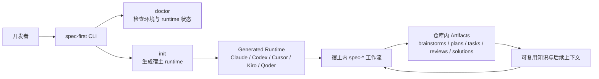
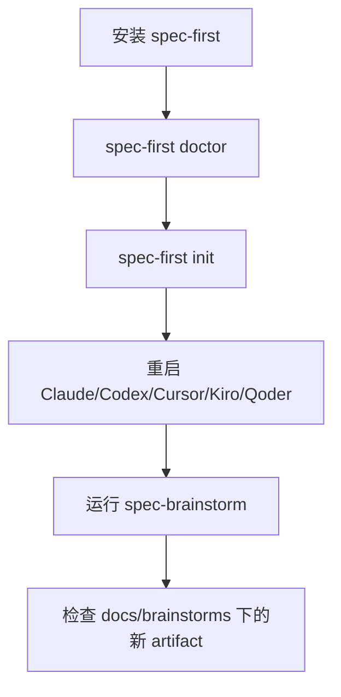

`spec-first` 是面向 Claude Code、Codex、Kiro、Qoder 与 Cursor 的 **AI Coding Harness**：它不替代这些 AI 编程宿主，而是在项目仓库里增加一层可治理的工作流，把一次性 AI coding 对话转成可检查、可复用的 requirements、plans、tasks、code、review 与 knowledge 闭环。本页是入门指南的第一篇，目标是帮初学者先建立整体地图：它解决什么问题、由哪些部分组成、第一次使用会看到哪些产物，以及下一步应该读哪一页。Sources: [README.zh-CN.md](README.zh-CN.md#L16-L19), [docs/contracts/ai-coding-harness.md](docs/contracts/ai-coding-harness.md#L1-L13)

## 架构假设与验证结论

本页采用的验证假设是：`spec-first` 的核心不是“更多 prompt”或“更多 agent”，而是一个由 CLI、source assets、generated runtime、workflow artifacts 和质量边界组成的仓库内工程闭环。代码与文档验证后，这个假设成立：包描述明确将它定义为 AI Coding Harness；CLI 负责 `doctor`、`init`、`update`、`clean`、`tasks`、`session` 等管理命令；`init` 支持 Claude Code、Codex、Cursor、Kiro、Qoder；工作流会把需求、计划、任务、审查与经验沉淀到仓库目录中。Sources: [package.json](package.json#L1-L14), [src/cli/index.js](src/cli/index.js#L158-L182), [src/cli/commands/init.js](src/cli/commands/init.js#L77-L113), [README.zh-CN.md](README.zh-CN.md#L125-L141)

## 一句话理解 spec-first

如果你已经在真实项目里使用 AI 写代码，`spec-first` 关心的不是“AI 当场回答得多漂亮”，而是“这次工作是否留下了团队以后还能检查、评审、复用的工程轨迹”。它把工作拆进一个清晰链路：从 Codebase 到 Spec，再到 Plan、Tasks、Code、Review，最后进入 Knowledge；脚本负责准备事实和守住可机械检查的边界，LLM 在这个事实地板之上做需求、范围、取舍和审查判断。Sources: [docs/contracts/ai-coding-harness.md](docs/contracts/ai-coding-harness.md#L7-L14), [docs/contracts/ai-coding-harness.md](docs/contracts/ai-coding-harness.md#L26-L34), [README.zh-CN.md](README.zh-CN.md#L207-L215)

## 你当前在文档中的位置

你现在阅读的是 **入门指南 / 项目概览**，它只负责建立全局认知，不展开安装细节、完整走查、CLI 选项、宿主适配器或质量门禁机制。读完本页后，建议继续阅读 [快速开始](2-kuai-su-kai-shi)，再进入 [适用场景与核心价值](3-gua-yong-chang-jing-yu-he-xin-jie-zhi)、[安装、环境检查与宿主初始化](4-an-zhuang-huan-jing-jian-cha-yu-su-zhu-chu-shi-hua) 和 [第一次工作流走查：从需求到仓库产物](5-di-ci-gong-zuo-liu-zou-cha-cong-xu-qiu-dao-cang-ku-chan-wu)。Sources: [README.zh-CN.md](README.zh-CN.md#L228-L243), [docs/05-用户手册/01-快速开始.md](docs/05-用户手册/01-快速开始.md#L1-L6)

## 整体架构鸟瞰

下面这张图展示的是初学者需要先记住的主干：你通过 npm 安装 CLI，用 `spec-first doctor` 检查环境，用 `spec-first init` 把仓库里的 source assets 投影成不同宿主可加载的 generated runtime；之后在宿主会话里调用 `spec-*` 工作流入口，产出仓库内可检查的文档、证据和知识。Sources: [README.zh-CN.md](README.zh-CN.md#L36-L88), [README.zh-CN.md](README.zh-CN.md#L193-L199), [src/cli/index.js](src/cli/index.js#L44-L74)



这张图里的关键边界是：`skills/`、`agents/`、`templates/`、`src/cli/` 等是 source assets；`.claude/`、`.codex/`、`.agents/skills/`、`.cursor/`、`.kiro/`、`.qoder/` 等是由 `init` 生成或管理的宿主 runtime；`docs/brainstorms/`、`docs/plans/`、`docs/tasks/`、`docs/solutions/` 等是工作流留下的仓库产物。Sources: [README.zh-CN.md](README.zh-CN.md#L193-L205), [CONCEPTS.md](CONCEPTS.md#L71-L91)

## 初学者需要认识的五类组成

| 组成 | 初学者怎么理解 | 你会在哪里看到 |
|---|---|---|
| CLI | 安装、检查、初始化、更新和清理的命令行工具 | `spec-first doctor`、`spec-first init`、`spec-first update` |
| Source assets | spec-first 自身维护的源头资产 | `skills/`、`agents/`、`templates/`、`src/cli/` |
| Generated runtime | 按宿主生成的可加载副本 | `.claude/`、`.codex/`、`.cursor/`、`.kiro/`、`.qoder/` |
| Workflow artifacts | 每次工作留下的仓库内证据 | `docs/brainstorms/`、`docs/plans/`、`docs/tasks/`、`docs/solutions/` |
| Contracts / tests | 守住边界和质量的规则 | `docs/contracts/`、`tests/`、`scripts/` |

这些组成对应同一个工程原则：source assets 是可维护的真实来源，generated runtime 是投影出来给宿主使用的运行时表面，workflow artifacts 是每次 AI 辅助研发留下的可检查结果；如果 runtime 漂移，应通过 source 变更和 `spec-first init` 修复，而不是把生成副本当成源头手工维护。Sources: [README.zh-CN.md](README.zh-CN.md#L193-L205), [CONCEPTS.md](CONCEPTS.md#L73-L80), [package.json](package.json#L37-L83)

## 可视化项目结构

下面是初学者最需要先认识的结构视图；它不是完整目录清单，而是把仓库中与使用 `spec-first` 最相关的部分放在一起。Sources: [package.json](package.json#L37-L83), [README.zh-CN.md](README.zh-CN.md#L125-L141), [README.zh-CN.md](README.zh-CN.md#L193-L199)

```text
spec-first/
├── bin/
│   └── spec-first.js              # npm 暴露的 CLI 入口
├── src/cli/                       # doctor、init、update、clean 等 CLI 实现
├── skills/                        # 工作流与技能 source assets
├── agents/                        # 专家 agent source assets
├── templates/                     # 生成宿主 runtime 所需模板
├── docs/
│   ├── contracts/                 # Harness、证据、工作流等合同
│   ├── brainstorms/               # 需求与探索类产物
│   ├── plans/                     # 实施计划产物
│   ├── tasks/                     # 任务包产物
│   └── solutions/                 # 复用经验与知识沉淀
├── scripts/                       # 校验、发布、测试、同步等脚本
├── tests/                         # 单元、集成、smoke 与契约测试
└── .claude/.codex/.cursor/.kiro/.qoder
    └── generated runtime          # init 后生成或管理的宿主侧资产
```

在实际使用中，你通常不会先修改这些目录；初学者的第一目标是安装 CLI、运行 `doctor`、执行 `init`、重启宿主，然后在宿主里运行一个 `spec-*` 工作流，并检查仓库里是否出现了新的 Markdown artifact。Sources: [README.zh-CN.md](README.zh-CN.md#L47-L88), [README.zh-CN.md](README.zh-CN.md#L90-L112)

## 工作流主线

`spec-first` 的研发主链路可以理解为：先把想法或需求变成可读的 Spec，再把 Spec 变成 Plan，必要时拆成 Tasks，然后执行 Code，接着 Review，最后把稳定经验沉淀成 Knowledge。这个链路的价值在于让 AI 辅助研发不只停留在聊天窗口，而是把关键判断、范围、证据和后续上下文保存在仓库里。Sources: [docs/contracts/ai-coding-harness.md](docs/contracts/ai-coding-harness.md#L7-L14), [README.zh-CN.md](README.zh-CN.md#L143-L160), [README.zh-CN.md](README.zh-CN.md#L162-L191)


并不是每次都必须跑完整链路；第一次试用时，从 `spec-brainstorm "描述你的第一个任务"` 开始就足够，因为它会生成一个可以马上检查的需求 artifact，通常位于 `docs/brainstorms/`。Sources: [README.zh-CN.md](README.zh-CN.md#L94-L123), [README.zh-CN.md](README.zh-CN.md#L141-L160)

## 常见入口速查

| 你现在要做什么 | 推荐入口 | 典型产物 |
|---|---|---|
| 从粗略想法提炼需求 | `spec-brainstorm` | `docs/brainstorms/` |
| 从已有 PRD 或需求笔记开始 | `spec-prd` | `docs/brainstorms/` |
| 制定实现计划 | `spec-plan` | `docs/plans/` |
| 把计划拆成可执行任务 | `spec-write-tasks` | `docs/tasks/` |
| 执行范围明确的开发工作 | `spec-work` | 源码变更与执行证据 |
| 审查代码或文档 | `spec-code-review` / `spec-doc-review` | 结构化 findings |
| 沉淀可复用经验 | `spec-compound` | `docs/solutions/` |

这些入口是宿主会话里的 workflow entrypoints，不是普通 shell 命令；CLI 的职责是安装、初始化和管理 runtime，而 `spec-*` 工作流入口由宿主在 `spec-first init` 后加载。Sources: [README.zh-CN.md](README.zh-CN.md#L90-L101), [README.zh-CN.md](README.zh-CN.md#L143-L160), [src/cli/index.js](src/cli/index.js#L158-L182)

## CLI 与宿主的关系

`spec-first` CLI 管理的是项目里的 workflow assets：`doctor` 检查环境与 runtime 状态，`init` 安装 workflows、skills、agents 与开发者画像，`update` 升级 CLI 并刷新 runtime，`clean` 移除托管资产，`tasks` 校验派生任务包，`session` 提供多 actor 会话提示。宿主侧的 Claude Code、Codex、Cursor、Kiro、Qoder 则负责在会话里加载并执行这些 workflow entrypoints。Sources: [src/cli/index.js](src/cli/index.js#L158-L182), [src/cli/commands/init.js](src/cli/commands/init.js#L77-L113)

| 层级 | 负责什么 | 不负责什么 |
|---|---|---|
| CLI | 安装、检查、初始化、更新、清理和确定性校验 | 在聊天里替你完成语义判断 |
| 宿主 runtime | 暴露 `spec-*` 工作流入口 | 成为 source of truth |
| LLM workflow | 做需求理解、范围判断、方案取舍、审查解释 | 绕过脚本和合同直接宣称事实 |
| 脚本 / 合同 | 准备事实、校验 schema、路径、hash、readiness 等机械边界 | 替代架构、产品和 review 判断 |

这个分工也是 `spec-first` 的信任模型：脚本强制确定性不变量并准备事实，LLM 在事实地板之上判断语义是否充分；外部工具或 provider 输出在被源码、测试、日志、合同或用户确认前只能作为 advisory evidence。Sources: [docs/contracts/ai-coding-harness.md](docs/contracts/ai-coding-harness.md#L26-L45), [README.zh-CN.md](README.zh-CN.md#L207-L215)

## 第一次成功的判断标准

对初学者来说，第一次成功不需要理解所有内部机制；最小成功信号是：你完成安装与 `init`，重启宿主，在宿主里运行一个 workflow，然后在仓库中看到新增的 Markdown artifact。README 给出的最小例子是运行 `spec-brainstorm "描述你的第一个任务"` 后检查 `docs/brainstorms/YYYY-MM-DD-NNN-<topic>-requirements.md`。Sources: [README.zh-CN.md](README.zh-CN.md#L26-L35), [README.zh-CN.md](README.zh-CN.md#L94-L112)



如果这条路径跑通，你已经验证了 `spec-first` 的核心价值：AI 工作不再只存在于会话里，而是开始进入仓库、留下可检查的需求与后续工程轨迹。Sources: [README.zh-CN.md](README.zh-CN.md#L30-L35), [README.zh-CN.md](README.zh-CN.md#L125-L141)

## spec-first 适合谁

`spec-first` 适合已经在使用 Claude Code、Codex、Kiro、Qoder 或 Cursor，并希望把一次性 prompt 变成项目内 workflow 的团队或个人；它尤其适合需要 durable requirements、plans、review summaries、learnings，并希望脚本守住机械边界、LLM 继续处理语义判断的场景。Sources: [README.zh-CN.md](README.zh-CN.md#L217-L226)

如果你只想要一次性 prompt 片段、通用 agent marketplace、不依赖宿主的独立应用，或者团队明确不希望 workflow artifacts 写入仓库，那么 `spec-first` 可能不是当前最合适的形态。Sources: [README.zh-CN.md](README.zh-CN.md#L217-L226)

## 与普通 prompt pack 的区别

| 采纳时关心的问题 | 普通 prompt pack / agent 编排 | spec-first |
|---|---|---|
| 第一次跑完得到什么 | 更好的聊天回答或 transcript | 仓库内 artifact，例如需求 brief 或 plan |
| 决策和证据在哪里 | session state 或 runtime memory | 项目内文档、generated runtime assets、可验证 CLI facts |
| 人要 review 什么 | 多数时候是最终 diff 或 agent 输出 | requirements、plans、task packs、diff、findings、learnings |
| 谁守住机械边界 | 主要依赖模型自觉或 glue | 脚本强制确定性不变量并准备事实 |
| 多宿主如何对齐 | 各自维护 setup 和 prompt | 一套 source assets 投影到多个宿主 runtime |

这张表的核心不是宣称 `spec-first` 永远优于其他方案，而是说明它的产品形态：它优先追求仓库内、可检查、可复用的工程闭环，而不是只优化单次聊天体验。Sources: [README.zh-CN.md](README.zh-CN.md#L168-L191)

## 下一步阅读路径

建议按入门目录顺序继续：如果你想马上动手，读 [快速开始](2-kuai-su-kai-shi)；如果你还在判断是否适合团队，读 [适用场景与核心价值](3-gua-yong-chang-jing-yu-he-xin-jie-zhi)；如果你准备初始化真实项目，读 [安装、环境检查与宿主初始化](4-an-zhuang-huan-jing-jian-cha-yu-su-zhu-chu-shi-hua)；如果你想看完整端到端体验，读 [第一次工作流走查：从需求到仓库产物](5-di-ci-gong-zuo-liu-zou-cha-cong-xu-qiu-dao-cang-ku-chan-wu)。Sources: [README.zh-CN.md](README.zh-CN.md#L228-L243), [docs/05-用户手册/01-快速开始.md](docs/05-用户手册/01-快速开始.md#L42-L70)

当你已经完成第一次运行，再继续阅读 [工作流入口速查与任务路由](6-gong-zuo-liu-ru-kou-su-cha-yu-ren-wu-lu-you)、[产物目录与可检查工程轨迹](7-chan-wu-mu-lu-yu-ke-jian-cha-gong-cheng-gui-ji) 和 [多宿主使用指南：Claude Code、Codex、Cursor、Kiro 与 Qoder](8-duo-su-zhu-shi-yong-zhi-nan-claude-code-codex-cursor-kiro-yu-qoder)，它们会把本页的总览拆成更具体的操作和定位方法。Sources: [README.zh-CN.md](README.zh-CN.md#L143-L160), [README.zh-CN.md](README.zh-CN.md#L245-L258), [src/cli/commands/init.js](src/cli/commands/init.js#L77-L113)