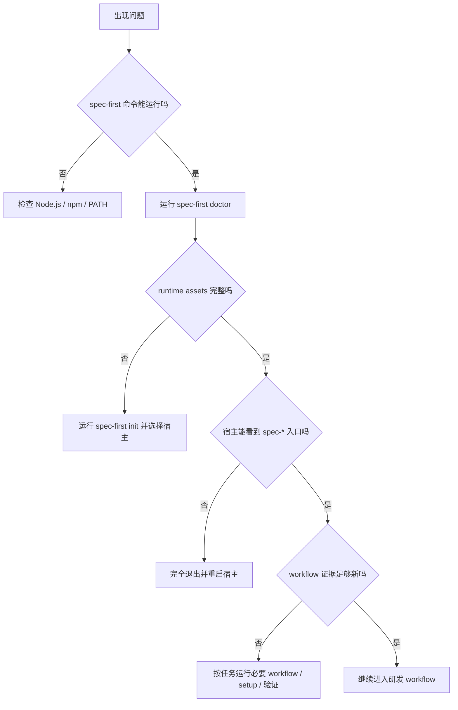
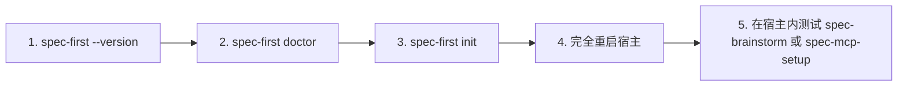

本页站在入门开发者视角，回答“装好了但入口不可见”“`doctor` 有 warning”“运行时漂移”“父级 workspace 残留”“应该降级到直接读源码还是重新 setup”等常见问题。核心判断模型是：`spec-first` 的 CLI 负责检查和重建可机械验证的 runtime assets，宿主 workflow 负责在这些事实之上完成需求、计划、实现、审查和知识沉淀；如果 runtime 或证据不完整，优先选择可解释的降级路径，而不是手改 generated runtime。Sources: [10-产物目录.md](docs/05-用户手册/10-产物目录.md#L5-L12), [20-研发场景与降级路径.md](docs/05-用户手册/20-研发场景与降级路径.md#L5-L10)

## 先建立故障排查心智模型

架构假设是：多数“不可用”并不是 workflow 本身坏了，而是处在四个层次之一——CLI 安装层、项目 runtime 生成层、宿主发现层、workflow 证据层。代码中的 `spec-first` CLI 暴露 `doctor`、`init`、`clean`、`update`、`tasks`、`repair-worktree`、`session` 等命令；其中 `doctor` 负责检查环境和 managed runtime assets，`init` 负责安装或重建 workflow、skills、agents 和 developer profile。Sources: [index.js](src/cli/index.js#L44-L79), [index.js](src/cli/index.js#L158-L181)

这个图的关键点是：不要把“文件存在”直接等同于“宿主已识别入口”，也不要把 `doctor` 的 `simulated` 理解成失败；它通常表示 runtime surface 已准备好，但缺少足够新的 verification evidence。Sources: [04-常见问题.md](docs/05-用户手册/04-常见问题.md#L28-L38), [doctor.js](src/cli/commands/doctor.js#L610-L645)

## 最小排查顺序

第一次遇到问题时，按固定顺序走：先确认全局命令，再检查项目状态，再重建 runtime，最后重启宿主。安装后推荐先运行 `spec-first doctor`，再运行 `spec-first init`；`init` 写入项目内运行时目录后，必须完全退出并重启 Claude Code 或 Codex 才能稳定识别新入口。Sources: [06-本地源码安装.md](docs/05-用户手册/06-本地源码安装.md#L78-L91), [06-本地源码安装.md](docs/05-用户手册/06-本地源码安装.md#L107-L126)

| 症状 | 先做什么 | 下一步 |
|---|---|---|
| `spec-first` 命令找不到 | 检查全局安装路径，macOS/Linux 可用 `which spec-first` | 如果 shell 仍指向旧路径，执行 `hash -r` 或重开终端 |
| `doctor` 提示 runtime 缺失 | 运行 `spec-first init` 并选择目标宿主 | 完全退出并重启宿主 |
| 宿主内看不到 `spec-*` | 不要手改 `.claude/`、`.agents/skills/` 等 runtime mirror | 重新 `init`，再重启宿主 |
| workflow 可以运行但证据不足 | 查看 `doctor --json` 的 `workflow_runnability` 和 `fallback_reason` | 运行必要 workflow、setup 或验证命令 |

这些动作对应的事实边界是：`.claude/`、`.codex/`、`.agents/skills/`、`.cursor/skills/`、`.kiro/skills/`、`.qoder/skills/` 等目录是 generated runtime assets，可由 `spec-first init` 重建，不应作为 source truth 手工修改。Sources: [12-gitignore参考.md](docs/05-用户手册/12-gitignore参考.md#L7-L19), [10-产物目录.md](docs/05-用户手册/10-产物目录.md#L38-L50)

## 常见问题一：如何确认安装真的成功？

“安装成功”分两层：第一层是 CLI 可用，第二层是宿主内 workflow 可见。CLI 层建议运行 `spec-first doctor`，必要时加 `--claude`、`--codex`、`--cursor`、`--kiro` 或 `--qoder` 指定宿主；宿主层则需要在完全重启宿主后，在会话里测试 `spec-brainstorm`、`spec-mcp-setup` 等入口。Sources: [04-常见问题.md](docs/05-用户手册/04-常见问题.md#L5-L38), [index.js](src/cli/index.js#L166-L174)

如果你是从源码包本地安装，先用 `npm pack` 生成 tarball，再 `npm install -g ./spec-first-<version>.tgz`，然后用 `which spec-first`、`spec-first --version` 或 `spec-first -v` 确认命令解析路径和版本；Windows 下用 `Get-Command spec-first` 或 `where spec-first`，没有 `hash -r` 时直接重开终端。Sources: [06-本地源码安装.md](docs/05-用户手册/06-本地源码安装.md#L42-L76)

## 常见问题二：为什么安装后找不到 `spec-*` 入口？

最常见原因是项目 runtime 没生成、生成后未被宿主重新加载，或你检查了错误的宿主目录。Claude Code 应检查 `.claude/commands/spec-*.md`、`.claude/skills` 和 `.claude/spec-first/workflows`；Codex 应检查 `.agents/skills` 和 `.codex/agents`；如果目录缺失或 drift，重新运行 `spec-first init`。Sources: [04-常见问题.md](docs/05-用户手册/04-常见问题.md#L105-L164), [doctor.js](src/cli/commands/doctor.js#L203-L252)

如果目录存在但宿主不识别入口，优先判断为宿主没有完全重启。macOS 下关闭窗口不等于退出应用，应使用 `Cmd+Q` 完全退出，或按文档中的方式结束宿主进程后重新打开。Sources: [04-常见问题.md](docs/05-用户手册/04-常见问题.md#L28-L38), [06-本地源码安装.md](docs/05-用户手册/06-本地源码安装.md#L107-L126)

## 常见问题三：`doctor --json` 的状态怎么看？

`doctor --json` 是给脚本、CI 和维护者读取的机器可读报告，它检查 CLI 安装、managed runtime assets、host readiness 和 workflow verification evidence；它不是 MCP/provider/graph 的完整健康检查。常见字段包括 `install_health`、`runtime_asset_health`、`host_readiness`、`decision_input_health`、`workflow_runnability` 和 `workflow_runnability_basis`。Sources: [04-常见问题.md](docs/05-用户手册/04-常见问题.md#L46-L58), [doctor.js](src/cli/commands/doctor.js#L537-L552)

| `workflow_runnability` | 含义 | 初学者动作 |
|---|---|---|
| `verified` | runtime、宿主、workflow surface 和新鲜 execution evidence 都满足条件 | 可以继续下游 workflow，但具体任务仍要运行测试和 review |
| `simulated` | runtime surface 已就绪，但 verification evidence 缺失、过期或不完整 | 不必恐慌；按当前任务运行必要 workflow、setup 或验证 |
| `not_verified` | runtime assets、managed state 或 workflow surface 不完整 | 先运行 `spec-first init`，重启宿主后再检查 |

这些状态来自代码里的 `computeWorkflowRunnability`：当 runtime assets、host readiness、managed state 和 workflow surface 都准备好，并且存在 schema 有效且新鲜的 verification evidence，状态才是 `verified`；如果 runtime 可用但证据不满足 verification-grade，则返回 `simulated`；如果 runtime 或 surface 不完整，则返回 `not_verified`。Sources: [doctor.js](src/cli/commands/doctor.js#L555-L645), [04-常见问题.md](docs/05-用户手册/04-常见问题.md#L59-L76)

## 常见问题四：`doctor` 报 Node、Git 或宿主 CLI warning 怎么办？

`doctor` 会检查 Node.js 主版本是否至少为 20，并通过 `git --version` 检查 Git 是否可用；Node 版本不足会给出 ERROR，Git 找不到或超时也会提示安装 Git、检查 PATH 或 shell 启动脚本。Sources: [doctor.js](src/cli/commands/doctor.js#L106-L146), [README.zh-CN.md](README.zh-CN.md#L40-L45)

宿主 CLI 检查会按平台调用不同命令：Codex 使用 `codex`，Cursor 使用 `agent`，Kiro 使用 `kiro`，Qoder 使用 `qodercli`，Claude Code 使用 `claude`；如果命令不在 PATH，`doctor` 会给出 WARNING，并提示安装对应 CLI 后重启 shell。Sources: [doctor.js](src/cli/commands/doctor.js#L148-L200)

## 常见问题五：runtime 漂移或 state 异常时要手动删目录吗？

不要优先手动删除 generated runtime。`doctor` 如果发现 command、skill、agent 或 managed state 缺失、漂移、版本不匹配，会提示重新运行 `spec-first init` 来重建；`init` 是刷新 source-owned runtime mirrors 的标准入口。Sources: [doctor.js](src/cli/commands/doctor.js#L203-L303), [doctor.js](src/cli/commands/doctor.js#L871-L926)

如果确认要移除某个宿主的受管资产，使用 `spec-first clean --claude`、`--codex`、`--cursor`、`--kiro` 或 `--qoder`，并可先加 `--dry-run` 预览；`clean` 只删除 spec-first 管理的资产，自定义资产会保留。Sources: [clean.js](src/cli/commands/clean.js#L25-L55), [clean.js](src/cli/commands/clean.js#L102-L114)

## 常见问题六：父级 workspace 有 orphan 或残留怎么办？

父级 workspace 的 `.spec-first/workspace/*` 是 advisory facts，不替代 child repo 内的事实；如果 `spec-mcp-setup` 生成了 `parent-artifact-quarantine.json`，可以先运行 `spec-first clean --workspace-orphans` 预览，再用 `--confirm` 删除白名单内的 parent orphan 路径。Sources: [20-研发场景与降级路径.md](docs/05-用户手册/20-研发场景与降级路径.md#L12-L23), [clean.js](src/cli/commands/clean.js#L166-L210)

清理有安全边界：当前只允许清理 `.spec-first/config/tool-facts.json` 和 `.spec-first/config/runtime-capabilities.json` 这类受支持 orphan 路径，并要求路径是 repo-relative、不能包含 `..`、不能通过 symlink 逃出项目根目录。Sources: [clean.js](src/cli/commands/clean.js#L245-L272), [clean.js](src/cli/commands/clean.js#L322-L347)

## 常见问题七：broken worktree 或 corrupted gitdir 怎么办？

如果 setup 或诊断提示 `broken-worktree`，先运行 `spec-first repair-worktree --dry-run`。这个命令是预览性质，会调用平台对应脚本输出 broken Git worktree pointer 的修复指导，帮助你理解 `.git` pointer 状态；帮助文本明确说明该命令不会删除 `.git`。Sources: [04-常见问题.md](docs/05-用户手册/04-常见问题.md#L78-L104), [repair-worktree.js](src/cli/commands/repair-worktree.js#L6-L55)

如果是 `corrupted-gitdir`，按提示使用 Git 自身诊断，例如 `git fsck`；如果是父级 workspace 覆盖缺口，不要自动把普通非 Git 文件夹纳入索引，而是按需要对明确目录直接读源码或显式传入 setup 参数。Sources: [04-常见问题.md](docs/05-用户手册/04-常见问题.md#L97-L104), [20-研发场景与降级路径.md](docs/05-用户手册/20-研发场景与降级路径.md#L73-L79)

## 降级路径：什么时候继续、什么时候 setup、什么时候停止？

降级的目标不是“绕过问题”，而是把证据边界说清楚。当前场景能力可分为 `full`、`bounded`、`partial`、`fallback-only` 和 `blocked-action-required`：完整时按正常 workflow 使用；有边界时限定 repo/file scope；只能 fallback 时依赖直接源码、测试、日志或用户证据；阻断时先清理或刷新，再做写入、autofix、commit、root-cause claim 或 graph-backed review claim。Sources: [20-研发场景与降级路径.md](docs/05-用户手册/20-研发场景与降级路径.md#L40-L51)

| 场景 | 推荐降级路径 |
|---|---|
| 单仓库干净 | 正常使用 workflow；需要 direct evidence 时确认 freshness |
| 单仓库 dirty | 明确 diff scope；提交、PR 或 review 前披露影响路径 |
| 第一次接入 Git 仓库 | setup-heavy 或 graph-heavy 任务先跑 `spec-mcp-setup`；轻量任务可直接读源码 |
| 多仓 workspace | 写入、测试、commit、review autofix 前明确 `target_repo` |
| provider degraded | graph-backed claim 降级；先 setup 或改用 bounded direct evidence |
| 非 Git 文件夹 | 可做文件定位和源码审查；不要声称 Git diff、commit freshness 或 review impact evidence |

这张表来自场景类别约束：`state_class` 是解释标签，不是审批状态、状态机或风险评分；不要因为 graph-targets 命名了相邻 repo 或 module 就自动扩大 plan、work 或 review scope。Sources: [20-研发场景与降级路径.md](docs/05-用户手册/20-研发场景与降级路径.md#L24-L39), [20-研发场景与降级路径.md](docs/05-用户手册/20-研发场景与降级路径.md#L94-L102)

## 不要做的事

不要手改 generated runtime mirrors，例如 `.claude/commands/spec-*.md`、`.claude/skills/`、`.agents/skills/`、`.cursor/skills/`、`.kiro/skills/`、`.qoder/skills/`；如果这些目录看起来坏了，先判断 source truth 是否正确，再用 `spec-first init` 重建。Sources: [10-产物目录.md](docs/05-用户手册/10-产物目录.md#L38-L50), [10-产物目录.md](docs/05-用户手册/10-产物目录.md#L78-L89)

不要把 `.spec-first/config/`、`.spec-first/workspace/`、`.spec-first/audits/`、`.spec-first/workflows/` 当成长期知识库或普通上下文扫描源；它们主要是 runtime/control-plane facts，默认不提交，事实 stale、blocked 或 degraded 时应说明限制并回退到直接源码、git diff、tests/logs 或用户提供证据。Sources: [10-产物目录.md](docs/05-用户手册/10-产物目录.md#L62-L77), [12-gitignore参考.md](docs/05-用户手册/12-gitignore参考.md#L189-L200)

## 快速决策清单

如果你只想快速恢复工作，按这个清单执行：先在终端运行 `spec-first doctor`；如果提示 runtime 缺失或 drift，运行 `spec-first init`；如果宿主内看不到入口，完全退出并重启宿主；如果 `doctor --json` 是 `simulated`，根据 `fallback_reason` 补充 setup、workflow 或验证证据；如果是父级 workspace 残留，先预览 `spec-first clean --workspace-orphans`；如果是 broken worktree，先 `spec-first repair-worktree --dry-run`。Sources: [04-常见问题.md](docs/05-用户手册/04-常见问题.md#L11-L27), [doctor.js](src/cli/commands/doctor.js#L802-L826), [clean.js](src/cli/commands/clean.js#L166-L210), [repair-worktree.js](src/cli/commands/repair-worktree.js#L53-L55)

## 下一步阅读

如果你还没完成第一次安装，继续读 [安装、环境检查与宿主初始化](4-an-zhuang-huan-jing-jian-cha-yu-su-zhu-chu-shi-hua)；如果你已经能看到入口但不知道从哪里开始，读 [工作流入口速查与任务路由](6-gong-zuo-liu-ru-kou-su-cha-yu-ren-wu-lu-you)；如果你想知道哪些文件该提交、哪些不该提交，读 [产物目录与可检查工程轨迹](7-chan-wu-mu-lu-yu-ke-jian-cha-gong-cheng-gui-ji)；如果你使用多个宿主，读 [多宿主使用指南：Claude Code、Codex、Cursor、Kiro 与 Qoder](8-duo-su-zhu-shi-yong-zhi-nan-claude-code-codex-cursor-kiro-yu-qoder)。Sources: [README.zh-CN.md](README.zh-CN.md#L36-L123), [10-产物目录.md](docs/05-用户手册/10-产物目录.md#L1-L12)