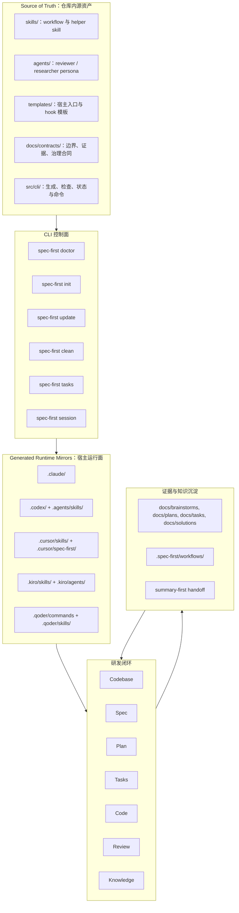
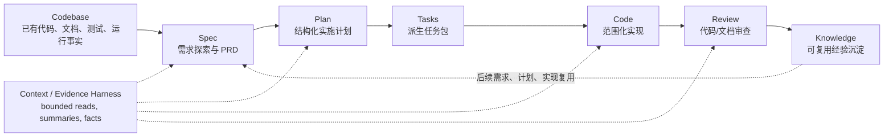
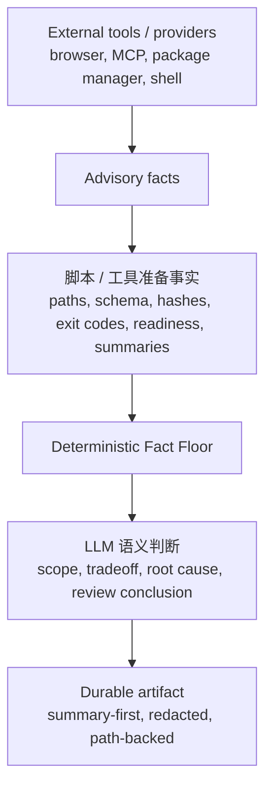

本页定位在“深入解析 / 架构与设计理念”的第一站：解释 spec-first 为什么被定义为 **AI Coding Harness for spec-driven software engineering**，以及它如何把一次性 AI coding 对话约束成可治理、可观察、可验证的仓库闭环。本文只讲架构总览，不展开具体 CLI 命令、宿主适配器细节、工作流逐项用法或测试体系；这些内容会在后续页面分解。Sources: [ai-coding-harness.md](docs/contracts/ai-coding-harness.md#L1-L5), [README.zh-CN.md](README.zh-CN.md#L16-L18)

## 架构假设与源码验证结论

本页采用的架构假设是：spec-first 的核心不是“更多 prompt”或“更多 agent”，而是在 Claude Code、Codex、Cursor、Kiro、Qoder 这些宿主之上增加一层项目内 Harness，让 Codebase → Spec → Plan → Tasks → Code → Review → Knowledge 这条链路留下可复用的仓库产物，并把脚本可判定事实与 LLM 语义判断分开。合同文档直接命名了这条核心链路，README 也把一次性对话转化为 requirements、plans、scoped work、review、reusable learning 的闭环作为产品定位。Sources: [ai-coding-harness.md](docs/contracts/ai-coding-harness.md#L7-L13), [README.zh-CN.md](README.zh-CN.md#L26-L35)

源码验证后的结论是：这个 Harness 由四类可见结构共同实现：第一，`docs/contracts/` 定义 durable contract surface；第二，`skills/`、`agents/`、`templates/`、`src/cli/` 是行为 source-of-truth；第三，CLI 通过 `doctor`、`init`、`update`、`clean`、`tasks`、`session` 等命令管理 runtime 与证据入口；第四，宿主适配器把同一套 source assets 投影到不同宿主 runtime surface。Sources: [source-runtime-customization-boundary.md](docs/contracts/source-runtime-customization-boundary.md#L7-L24), [index.js](src/cli/index.js#L44-L74), [adapters/index.js](src/cli/adapters/index.js#L1-L13)

## 一张图看懂 Harness 总体结构

下面的图把 spec-first 的架构压缩为五层：源资产层、CLI 生成与治理层、宿主 runtime 层、工作流闭环层、证据与知识层。注意这里的箭头不是一个中心化状态机，而是 source assets 经 CLI 生成 runtime，runtime 在宿主中触发 workflow，workflow 再产出仓库内 artifact 与 knowledge。合同明确说明 Execution Harness 在 plan/task/work/review 间传递 scope、task identity、repo scope 和 handoff evidence，但“不变成状态机”。Sources: [ai-coding-harness.md](docs/contracts/ai-coding-harness.md#L15-L24), [ai-coding-harness.md](docs/contracts/ai-coding-harness.md#L26-L33)



这张图的关键边界是：`skills/`、`agents/`、`templates/`、`src/cli/`、`docs/` 等 checked-in 文件是 source-of-truth；`.claude/`、`.codex/`、`.agents/skills/`、`.cursor/skills/`、`.kiro/skills/`、`.qoder/skills/` 等是 generated runtime mirrors，不能通过手改 runtime mirror 作为行为修复。Sources: [source-runtime-customization-boundary.md](docs/contracts/source-runtime-customization-boundary.md#L7-L24), [source-runtime-customization-boundary.md](docs/contracts/source-runtime-customization-boundary.md#L25-L62)

## Harness 六层职责

AI Coding Harness 合同把系统分成六个 layer：Context、Execution、Evidence、Evaluation、Governance、Knowledge。这个分层的价值在于把“给模型上下文”“执行任务交接”“保留证据”“评价系统是否变好”“治理 runtime/provider 边界”“沉淀知识”分成不同责任面，避免把所有问题都塞进一个长 prompt 或隐式会话状态。Sources: [ai-coding-harness.md](docs/contracts/ai-coding-harness.md#L15-L24)

| Harness Layer | 解决的问题 | 在架构中的位置 |
|---|---|---|
| Context Harness | 给 LLM 有界、相关、可追溯的上下文 | 默认排除 generated runtime、大型 raw dump；优先 summary-first 与 path-backed evidence |
| Execution Harness | 在 plan/task/work/review 间传递 scope、task identity、repo scope、handoff evidence | 让工作流可交接，但不建立中心化状态机 |
| Evidence Harness | 保存 provenance、freshness、source reads、limitations、redaction | 让结论可质疑、可复核 |
| Evaluation Harness | 用 quality gate、verification evidence、decision-linked metrics 评估系统是否变好 | 避免只看 workflow 调用次数 |
| Governance Harness | 明确 source/runtime/provider 边界、host delivery、mutation gate、并发与 freshness owner | 防止宿主 runtime、provider facts 或外部工具越权 |
| Knowledge Harness | 只沉淀已验证、可复用的经验，并让它可发现 | 通过 `docs/solutions/` 等路径进入后续工作流复用 |

这六层不是抽象口号，而是有明确合同落点：例如 Context Harness 对应 `context-governance.md` 和 `context-bundle.md`，Governance Harness 对应 source/runtime/provider 边界与 session 合同，Knowledge Harness 对应 knowledge 与 artifact summary 合同。Sources: [ai-coding-harness.md](docs/contracts/ai-coding-harness.md#L17-L24), [context-governance.md](docs/contracts/context-governance.md#L1-L6)

## 核心工作流闭环

spec-first 的主链路是 `Codebase → Spec → Plan → Tasks → Code → Review → Knowledge`。这里的 Context 不是一个顺序节点，而是横切 evidence / harness layer：普通 workflow 通过 bounded source reads、`rg`、ast-grep、git diff、tests/logs、docs/solutions 和 runtime readiness facts 获取可验证上下文。Sources: [workflow-skill-agent-map.md](docs/workflow-skill-agent-map.md#L4-L11)



公开 workflow 与链路节点的映射是：`spec-brainstorm`、`spec-prd`、`spec-ideate` 支撑 Spec；`spec-plan` 支撑 Plan；`spec-write-tasks` 支撑 Tasks；`spec-work` 支撑 Code；`spec-code-review`、`spec-doc-review` 支撑 Review；`spec-compound`、`spec-compound-refresh`、`spec-sessions` 支撑 Knowledge。Sources: [workflow-skill-agent-map.md](docs/workflow-skill-agent-map.md#L12-L21), [README.zh-CN.md](README.zh-CN.md#L143-L160)

## Source of Truth 与 Generated Runtime

spec-first 的治理模型明确要求：行为修改应发生在 checked-in source assets，而不是宿主生成目录。source-of-truth 包括 `skills/`、`agents/`、`templates/`、`src/cli/`、`docs/`、README、AGENTS、CLAUDE、CHANGELOG 等；runtime mirrors 包括 `.claude/`、`.codex/`、`.agents/skills/`、`.cursor/skills/`、`.kiro/skills/`、`.qoder/skills/` 等。Sources: [source-runtime-customization-boundary.md](docs/contracts/source-runtime-customization-boundary.md#L7-L24), [source-runtime-customization-boundary.md](docs/contracts/source-runtime-customization-boundary.md#L25-L62)

```text
spec-first/
├── skills/                 # workflow/helper skill 源资产
├── agents/                 # reviewer/researcher persona 源资产
├── templates/              # 宿主入口、hook、规则模板
├── src/cli/                # CLI 控制面、适配器、状态、生成逻辑
├── docs/contracts/         # Harness 合同与治理边界
├── docs/brainstorms/       # 需求与 PRD 类 artifact
├── docs/plans/             # implementation plan artifact
├── docs/tasks/             # task pack artifact
├── docs/solutions/         # 可复用经验知识库
├── .spec-first/workflows/  # workflow closeout evidence，默认 gitignore
├── .claude/                # Claude generated runtime mirror
├── .codex/                 # Codex managed runtime state / hooks
├── .agents/skills/         # Codex-facing generated skill runtime
├── .cursor/                # Cursor generated-runtime preview surface
├── .kiro/                  # Kiro generated runtime surface
└── .qoder/                 # Qoder generated runtime surface
```

这个目录结构带来的架构规则是：修改行为时先改 source，再通过 `spec-first init` 重新生成目标宿主 runtime；`doctor` 用于检查 runtime drift，但 drift 报告只是 reconciliation evidence，不是直接手改 mirror 的授权。Sources: [source-runtime-customization-boundary.md](docs/contracts/source-runtime-customization-boundary.md#L46-L56), [source-runtime-customization-boundary.md](docs/contracts/source-runtime-customization-boundary.md#L136-L148)

## CLI 控制面：生成、检查、清理与会话辅助

CLI 是 Harness 的控制面，而不是工作流本身。`src/cli/index.js` 暴露 package CLI 命令：`doctor` 检查环境和 managed runtime assets，`init` 安装 workflows、skills、agents 与 developer profile，`update` 升级 CLI 并刷新 runtime assets，`clean` 删除 spec-first managed assets，`tasks` 处理派生 task pack 的 hash 与验证，`session` 提供 opt-in multi-actor session advisory。Sources: [index.js](src/cli/index.js#L158-L181), [index.js](src/cli/index.js#L44-L74)

`init` 的执行形态体现了架构分层：先解析参数与交互输入，再构建一个或多个 init plan，打印诊断与 preview，确认后应用 plan，最后同步用户语言偏好并输出下一步提示。它把“计划要写什么”和“实际写入”拆开，这使 runtime 生成可以预览、诊断和在错误时中止。Sources: [init.js](src/cli/commands/init.js#L115-L200), [init.js](src/cli/commands/init.js#L200-L267)

`init` plan 内部还会构建 preview state、检测 legacy state、检测当前 runtime drift，并在必要时执行 managed hard reset；写入阶段会先应用 pre-sync plan，再应用 write plan，涉及破坏性 reset 时还会创建 rollback backup。这个实现对应 Governance Harness：runtime mirror 可重建，但重建要有状态、诊断和回滚边界。Sources: [init.js](src/cli/commands/init.js#L1146-L1256), [init.js](src/cli/commands/init.js#L1259-L1295)

## 宿主适配器：同源资产到不同 Runtime Surface 的投影

spec-first 支持的宿主由 adapter registry 统一登记：`claude`、`codex`、`cursor`、`kiro`、`qoder`。`getAdapter(platformId)` 根据平台 id 返回对应 adapter，未知平台会抛错；这说明宿主差异被收敛在 adapter 层，而不是分散在每个 workflow 文档中。Sources: [adapters/index.js](src/cli/adapters/index.js#L1-L13), [adapters/index.js](src/cli/adapters/index.js#L15-L40)

| 宿主 | Runtime root | Workflow surface | Agent surface | State file | 结构特征 |
|---|---:|---:|---:|---:|---|
| Claude Code | `.claude` | `.claude/commands` + `.claude/spec-first/workflows` | `.claude/agents` | `.claude/spec-first/state.json` | 有 command、skill、agent 与 hook surface |
| Codex | `.codex` | `.agents/skills` | `.codex/agents` | `.codex/spec-first/state.json` | project-scoped；用户可见 workflow 从 `.agents/skills/` 发现 |
| Cursor | `.cursor` | `.cursor/skills` | 不支持 spec-first generated agents | `.cursor/spec-first/state.json` | generated-runtime preview；skills-only |
| Kiro | `.kiro` | `.kiro/skills` | `.kiro/agents` | `.kiro/spec-first/state.json` | skills + agents；不使用 generated command files |
| Qoder | `.qoder` | `.qoder/commands` + `.qoder/skills` | `.qoder/agents` | `.qoder/spec-first/state.json` | command 与 skill runtime 并存 |

这些宿主 surface 来自各 adapter 的 getter 定义：Claude adapter 定义 `.claude/commands`、`.claude/skills`、`.claude/spec-first/workflows`、`.claude/agents`；Codex adapter 明确 project-scoped，并把 `.agents/skills/` 作为用户可见 workflow entrypoint；Cursor adapter 标记 `supportsAgents=false`；Kiro adapter 使用 `.kiro/skills` 与 `.kiro/agents`；Qoder adapter 使用 `.qoder/commands`、`.qoder/skills` 与 `.qoder/agents`。Sources: [claude.js](src/cli/adapters/claude.js#L43-L83), [codex.js](src/cli/adapters/codex.js#L27-L75), [cursor.js](src/cli/adapters/cursor.js#L58-L101), [kiro.js](src/cli/adapters/kiro.js#L32-L71), [qoder.js](src/cli/adapters/qoder.js#L34-L73)

## 资产清单与 Manifest 生成

CLI 不是手写静态 runtime 文件列表，而是从 source 构建 plugin manifest。`plugin.js` 定义 source directories：commands 来自 `templates/claude/commands/spec`，skills 来自 `skills`，agents 来自 `agents`；支持平台集合包括 `claude`、`codex`、`cursor`、`kiro`、`qoder`。Sources: [plugin.js](src/cli/plugin.js#L15-L35)

manifest 构建过程会读取 package metadata 与 skills governance truth source，再从 governance skills 中筛选 `entry_surface === 'workflow_command'` 的记录，提取 command name、skill name、模板文件、skill source 与 frontmatter metadata，最后列出 skills、agents、包名和版本。Sources: [plugin.js](src/cli/plugin.js#L107-L150), [plugin.js](src/cli/plugin.js#L160-L180)

这意味着 workflow command、skill、agent 的交付不是任意复制文件，而是经过 manifest validation、frontmatter 读取、治理字段校验与平台投影。对于中级开发者，最重要的结论是：新增或修改 workflow 行为时，不应只看某个宿主目录是否有文件，而要追溯到 source skill、governance 记录、adapter transform 与 init 生成链路。Sources: [plugin.js](src/cli/plugin.js#L107-L150), [source-runtime-customization-boundary.md](docs/contracts/source-runtime-customization-boundary.md#L136-L148)

## 状态文件与 Drift 管理

每个宿主 adapter 都定义自己的 `stateFile`，CLI 使用 `buildState()` 记录 manifestVersion、platform、commands、skills、workflowSkills、agents、agentSupportFiles。这个 managed state 让 `init`、`clean`、runtime drift 检查和 obsolete asset removal 有可比对的事实基线。Sources: [state.js](src/cli/state.js#L62-L91), [state.js](src/cli/state.js#L99-L125)

状态文件还经过安全形状校验：必须是 JSON object，必须包含 required array fields，数组项必须是非空字符串，路径不能是绝对路径、Windows drive path、包含反斜杠、危险 segment 或 Windows reserved name。这是脚本层面的 deterministic invariant，属于“模型判断之前的事实地板”。Sources: [state.js](src/cli/state.js#L127-L187), [ai-coding-harness.md](docs/contracts/ai-coding-harness.md#L26-L33)

## 事实地板：脚本与 LLM 的边界

Harness 的核心边界规则是：脚本强制 deterministic invariants 并准备 deterministic facts，例如路径、schema validity、hash、readiness、budget、reason code、artifact refs、raw-log refs；LLM 在这层事实地板之上判断 semantic adequacy，例如 scope、架构取舍、finding 是否成立、root cause、task ordering、degraded evidence 是否足够。Sources: [ai-coding-harness.md](docs/contracts/ai-coding-harness.md#L26-L33), [source-runtime-customization-boundary.md](docs/contracts/source-runtime-customization-boundary.md#L77-L99)



外部工具与 provider 不拥有 scope authority、finding authority、root-cause authority、mutation authority 或 workflow state；它们只能提供 evidence、capabilities、logs、readiness facts，并且在 source、test、log、schema、contract 或用户确认前都是 advisory。Sources: [ai-coding-harness.md](docs/contracts/ai-coding-harness.md#L31-L45), [source-runtime-customization-boundary.md](docs/contracts/source-runtime-customization-boundary.md#L77-L99)

## Context Governance：默认不广播 Runtime 和 Raw Dump

Context Harness 的默认策略是 source-first、summary-first、path-backed evidence。普通 workflow 默认不把 runtime、generated、audit artifacts 当作普通上下文，不扫描 generated mirrors，不广播 raw MCP dump、完整 external-tool output、大 JSON、旧 audit snapshots 或 generated runtime。Sources: [context-governance.md](docs/contracts/context-governance.md#L7-L14), [context-governance.md](docs/contracts/context-governance.md#L71-L82)

普通 workflow 的上下文读取顺序是：先读用户请求、diff、changed files、计划/需求/task-pack summary；再读 source-of-truth files 与 nearby implementation/test slices；再读 validated summaries、review facts、deterministic setup facts；只有在用户要求、workflow 明确需要或 summary 显示证据不足时，才展开精确路径的 full artifact 或 raw evidence。Sources: [context-governance.md](docs/contracts/context-governance.md#L118-L130)

这个设计让 Harness 保持轻量：它不实现中心化 context router，也不替代 `spec-plan`、`spec-work`、`spec-code-review`、`spec-doc-review` 的语义判断；它只固化普通 workflow 读取 repo context 时必须遵守的最小 runtime exclusion policy。Sources: [context-governance.md](docs/contracts/context-governance.md#L1-L6), [context-governance.md](docs/contracts/context-governance.md#L15-L21)

## 产物：仓库里的可检查工程轨迹

spec-first 的架构价值最终体现在 artifact：典型 workflow 会在 `docs/brainstorms/` 写 requirements briefs 与 PRD 级需求，在 `docs/plans/` 写 implementation plans，在 `docs/tasks/` 写 derived task packs，在 `docs/solutions/` 写可复用经验，并在 `.spec-first/workflows/` 保存 structured work closeout evidence。Sources: [README.zh-CN.md](README.zh-CN.md#L125-L141), [source-runtime-customization-boundary.md](docs/contracts/source-runtime-customization-boundary.md#L63-L76)

| Artifact 路径 | 架构角色 | 是否是行为 source-of-truth |
|---|---|---|
| `docs/brainstorms/` | Spec / requirements evidence | 否，属于 workflow artifact |
| `docs/plans/` | Plan evidence | 否，属于 workflow artifact |
| `docs/tasks/` | Tasks handoff evidence | 否，属于 workflow artifact |
| `docs/solutions/` | Knowledge reuse evidence | 否，属于 workflow artifact / knowledge base |
| `.spec-first/workflows/` | Run closeout evidence | 否，属于 runtime evidence，默认不作为普通 source context |
| `skills/`、`agents/`、`templates/`、`src/cli/`、`docs/contracts/` | Harness 行为与合同 source | 是 |

workflow artifacts 可被下游 workflow、review 和人类读取，但不会覆盖 `skills/`、`agents/`、`templates/`、`src/cli/` 或 `docs/contracts/**` 中的 source contracts。这个边界防止“某次运行产物”反向改变系统行为。Sources: [source-runtime-customization-boundary.md](docs/contracts/source-runtime-customization-boundary.md#L63-L76)

## 与普通 Prompt Pack 的架构差异

spec-first 与普通 prompt pack / agent 编排的差异，不在于是否能让模型回答更好，而在于是否能把工作写回仓库并形成可验证闭环。README 的对比表明确指出：prompt pack 往往留下 session state、消息总线或 agent transcript，而 spec-first 留下项目内文档、generated runtime assets、可验证 CLI facts，并由脚本守住机械边界、LLM 做语义判断。Sources: [README.zh-CN.md](README.zh-CN.md#L168-L179)

| 采纳问题 | Prompt pack / 一般 agent 编排 | spec-first Harness |
|---|---|---|
| 第一次跑完得到什么 | 更好的聊天答案或 transcript | 仓库内 artifact，例如 requirements brief 或 plan |
| 决策和证据在哪里 | session state、runtime memory | docs artifact、runtime state、CLI facts |
| 人 review 什么 | 最终 diff 或 agent 输出 | requirements、plans、task packs、diff、findings、learnings |
| 谁守机械边界 | 主要靠模型自觉 | 脚本强制 deterministic invariants |
| 多宿主如何对齐 | 分开维护 prompt | 一套 source assets 投影到多个 runtime surface |

这个差异也解释了为什么本页把 spec-first 称为 Harness：它不是替代 Claude Code、Codex、Cursor、Kiro 或 Qoder，而是在这些宿主之上提供项目内的上下文、执行、证据、评估、治理与知识边界。Sources: [README.zh-CN.md](README.zh-CN.md#L168-L179), [ai-coding-harness.md](docs/contracts/ai-coding-harness.md#L15-L24)

## 推荐阅读路径

读完本页后，建议按“理念 → 边界 → 运行时 → 工作流 → 质量门禁”的顺序继续：先读 [从一次性对话到仓库闭环：Spec、Plan、Tasks、Code、Review、Knowledge](12-cong-ci-xing-dui-hua-dao-cang-ku-bi-huan-spec-plan-tasks-code-review-knowledge)，理解主链路每个节点的交接；再读 [事实地板与语义判断：脚本、契约、证据和 LLM 的边界](13-shi-shi-di-ban-yu-yu-yi-pan-duan-jiao-ben-qi-yue-zheng-ju-he-llm-de-bian-jie)，深化脚本与 LLM 的职责边界；然后读 [Generated Runtime 与 Source of Truth 的治理模型](14-generated-runtime-yu-source-of-truth-de-zhi-li-mo-xing)，掌握 source/runtime 修改规则。Sources: [ai-coding-harness.md](docs/contracts/ai-coding-harness.md#L7-L24), [source-runtime-customization-boundary.md](docs/contracts/source-runtime-customization-boundary.md#L136-L148)

如果你的关注点是实现细节，下一步可以读 [CLI 命令体系：doctor、init、update、clean、tasks 与 session](15-cli-ming-ling-ti-xi-doctor-init-update-clean-tasks-yu-session)、[初始化流水线：资产发现、操作计划、原子写入与状态记录](16-chu-shi-hua-liu-shui-xian-zi-chan-fa-xian-cao-zuo-ji-hua-yuan-zi-xie-ru-yu-zhuang-tai-ji-lu)、[宿主适配器设计：统一源资产到不同 Runtime Surface 的投影](17-su-zhu-gua-pei-qi-she-ji-tong-yuan-zi-chan-dao-bu-tong-runtime-surface-de-tou-ying)。如果你的关注点是日常研发流程，则继续读 [公开工作流命令与 Skill 治理模型](19-gong-kai-gong-zuo-liu-ming-ling-yu-skill-zhi-li-mo-xing) 和 [核心研发链路：brainstorm、prd、plan、write-tasks、work、review、compound](20-he-xin-yan-fa-lian-lu-brainstorm-prd-plan-write-tasks-work-review-compound)。Sources: [index.js](src/cli/index.js#L158-L181), [init.js](src/cli/commands/init.js#L200-L267), [workflow-skill-agent-map.md](docs/workflow-skill-agent-map.md#L24-L48)